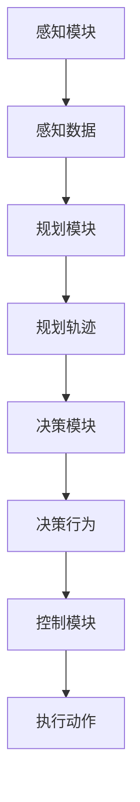

                 

### 背景介绍

自动驾驶技术作为人工智能领域的一个重要分支，正逐渐成为未来智能交通系统的重要组成部分。随着全球各国政府对智能交通领域的投入增加，自动驾驶技术的研究与应用日益受到关注。国际机器人与自动化会议（ICRA，International Conference on Robotics and Automation）作为机器人与自动化领域的顶级会议，每年都会吸引大量来自学术界和工业界的学者和专家提交相关领域的最新研究成果。ICRA 2024年会继续聚焦自动驾驶技术的最新进展，为自动驾驶领域的研究者和开发者提供一个交流与分享的平台。

本文旨在对ICRA 2024中关于自动驾驶的几篇关键论文进行深入解读，帮助读者了解当前自动驾驶技术的研究热点和前沿趋势。通过分析这些论文，我们希望揭示自动驾驶技术在感知、规划、决策和控制等核心模块中的创新和突破，并探讨这些技术在实际应用中的潜在挑战和解决方案。

自动驾驶系统通常由感知、规划、决策和控制四个主要模块组成。感知模块负责收集周围环境的信息，如激光雷达、摄像头和超声波传感器等；规划模块则根据感知信息生成车辆的运动轨迹；决策模块负责确定车辆在特定情况下的行为策略；控制模块则将决策转化为车辆的动作指令，确保车辆按照预期轨迹行驶。

近年来，深度学习、强化学习、多智能体系统和分布式计算等技术的发展，为自动驾驶系统的性能提升和稳定性改进提供了新的思路和方法。在ICRA 2024中，我们预计会看到更多基于这些技术的创新性研究成果，以及如何在实际驾驶场景中实现自动驾驶系统的全面部署和商业化应用。

总的来说，自动驾驶技术的发展不仅关乎汽车行业的变革，也对整个社会的智慧交通、能源利用和城市规划等方面产生深远影响。通过本文对ICRA 2024中自动驾驶相关论文的解读，我们希望为读者提供一个全面而深入的视角，了解自动驾驶技术的现状与未来。

### 核心概念与联系

在自动驾驶系统中，感知、规划、决策和控制是四个核心模块，它们各自承担着不同的任务，但又相互联系，共同构成了一个完整的自动驾驶系统。为了更好地理解这四个模块之间的关系和协同作用，我们首先需要明确它们各自的核心概念和原理。

#### 感知模块

感知模块是自动驾驶系统的感官部分，它负责收集周围环境的信息，如路况、障碍物、交通信号等。常用的感知设备包括激光雷达、摄像头、超声波传感器、毫米波雷达等。其中，激光雷达通过发射激光束并接收反射信号来构建三维环境模型，摄像头则利用图像处理技术分析路面和周围物体，超声波传感器和毫米波雷达则主要用于短距离障碍物检测。

感知模块的核心任务是准确、实时地获取环境信息，并将其转换为结构化的数据。例如，激光雷达获取的三维点云数据可以通过滤波、聚类和分割等方法处理，生成车辆周围的环境地图。摄像头捕捉的图像则可以通过图像识别算法，识别出路面、车道线、行人、车辆等不同目标。

#### 规划模块

规划模块的任务是根据感知模块收集到的环境信息，生成车辆的行驶轨迹。规划算法需要考虑道路条件、交通规则、车辆状态等因素，确保生成的行驶轨迹既安全又高效。常见的规划算法包括基于采样的路径规划算法（如RRT、A*等）、基于模型的路径规划算法（如运动预测、多目标优化等）。

规划模块的核心目标是在满足安全性和可行性的前提下，优化车辆的行驶路径。例如，在避障过程中，规划算法需要考虑障碍物的动态特性，如速度、方向等，以生成一条既避开了障碍物又符合交通规则的行驶路径。

#### 决策模块

决策模块负责在特定情境下，选择最佳的行为策略。决策模块需要综合分析感知模块提供的环境信息、规划模块生成的行驶轨迹，以及车辆自身的状态信息，如速度、加速度、油门、刹车等。常见的决策算法包括基于规则的决策算法、基于强化学习的决策算法等。

决策模块的核心任务是确保车辆在复杂和动态的环境中做出合理的决策。例如，在通过交叉路口时，决策模块需要判断是否等待、是否变道、是否加速等，以确保行驶的安全性和效率。

#### 控制模块

控制模块是将决策模块的决策转化为具体的动作指令，驱动车辆执行相应的操作。控制模块通常采用PID控制器、模糊控制器等控制算法，将决策模块的决策转换为车辆的控制信号，如油门、刹车、转向等。

控制模块的核心目标是实现车辆的平稳行驶，确保车辆按照决策模块的意图执行操作。例如，在执行变道操作时，控制模块需要精确控制转向，使车辆平稳地进入目标车道。

#### Mermaid流程图

为了更直观地展示这四个模块之间的协同关系，我们可以使用Mermaid流程图进行描述。以下是感知、规划、决策和控制模块之间的Mermaid流程图：



在上述流程图中，A表示感知模块，它通过传感器收集环境信息；B表示感知数据，即环境信息的数据化表示；C表示规划模块，它根据感知数据生成行驶轨迹；D表示规划轨迹，即车辆即将执行的路径；E表示决策模块，它根据规划轨迹和车辆状态决定最佳行为；F表示决策行为，即车辆应执行的具体操作；G表示控制模块，它将决策行为转化为控制信号；H表示执行动作，即车辆的实际操作。

通过上述核心概念和Mermaid流程图，我们可以清晰地看到感知、规划、决策和控制模块之间的相互作用和协同关系。这为后续对ICRA 2024中自动驾驶相关论文的解读奠定了基础，也为读者深入理解自动驾驶技术的实现原理提供了参考。

### 核心算法原理 & 具体操作步骤

在ICRA 2024中，自动驾驶相关论文介绍了多种创新算法，这些算法在感知、规划、决策和控制模块中发挥着关键作用。以下将详细解读几个具有代表性的核心算法，并描述其具体操作步骤。

#### 1. 基于深度学习的感知算法

深度学习算法在自动驾驶感知模块中发挥着重要作用，尤其是在目标检测和识别方面。以下是一个典型的基于卷积神经网络（CNN）的目标检测算法。

**算法原理：**

- **卷积层：** 通过卷积操作提取图像的局部特征。
- **池化层：** 对特征进行下采样，减少数据维度并增强特征鲁棒性。
- **全连接层：** 对提取的特征进行分类，生成目标检测结果。

**具体操作步骤：**

1. **输入图像预处理：** 对捕获的图像进行归一化、裁剪等预处理操作，以适应网络输入要求。
2. **特征提取：** 将预处理后的图像输入到卷积神经网络中，通过卷积层和池化层提取图像特征。
3. **目标检测：** 使用全连接层对提取的特征进行分类，输出目标检测结果，如车辆、行人、交通信号等。
4. **后处理：** 对检测结果进行非极大值抑制（NMS）等后处理操作，以去除冗余检测框，提高检测精度。

#### 2. 基于强化学习的规划算法

强化学习在自动驾驶规划模块中用于生成最优行驶轨迹。以下是一个基于深度Q网络（DQN）的强化学习算法。

**算法原理：**

- **状态空间：** 将车辆周围的环境状态编码为状态空间，如周围障碍物的位置和速度。
- **动作空间：** 车辆的动作空间包括加速、减速、转向等。
- **奖励函数：** 设计奖励函数以引导车辆在复杂环境中找到最优行驶轨迹。

**具体操作步骤：**

1. **初始化：** 初始化深度Q网络和目标Q网络，设置学习率和折扣因子等超参数。
2. **状态编码：** 将当前环境状态编码为状态向量。
3. **动作选择：** 使用ε-贪心策略选择最佳动作，即在ε概率下随机选择动作，在其他概率下选择Q值最大的动作。
4. **环境交互：** 执行选定的动作，观察新的状态和奖励。
5. **更新Q值：** 使用经验回放和目标Q网络更新深度Q网络的权重，以优化车辆的行为策略。
6. **轨迹生成：** 根据优化后的行为策略生成车辆的行驶轨迹。

#### 3. 基于多智能体系统的决策算法

多智能体系统在自动驾驶决策模块中用于处理多个车辆之间的协作与协调。以下是一个基于分布式学习的多智能体决策算法。

**算法原理：**

- **智能体：** 每个车辆视为一个智能体，拥有局部状态和行为。
- **通信网络：** 智能体通过通信网络共享部分状态信息。
- **全局策略：** 学习一个全局策略，使所有智能体在协作中达到最佳效果。

**具体操作步骤：**

1. **状态共享：** 每个智能体将部分状态信息共享到通信网络中。
2. **局部决策：** 智能体基于共享的状态信息和本地策略，独立地做出局部决策。
3. **策略更新：** 使用分布式学习方法，根据全局奖励函数更新智能体的策略。
4. **协调优化：** 通过全局策略优化，调整智能体的行为，使其在协作中达到最佳效果。
5. **执行决策：** 智能体根据更新后的策略执行决策，生成车辆的行为。

#### 4. 基于模型预测控制的执行算法

模型预测控制在自动驾驶控制模块中用于实现车辆的高精度控制。以下是一个基于线性二次调节器（LQR）的模型预测控制算法。

**算法原理：**

- **模型预测：** 根据车辆动力学模型，预测不同控制输入下的车辆行为。
- **目标函数：** 设计目标函数，优化车辆的轨迹跟踪性能。
- **反馈控制：** 根据预测结果和目标函数，计算出最优控制输入。

**具体操作步骤：**

1. **车辆模型建立：** 建立车辆的动力学模型，如线性或非线性模型。
2. **预测步骤：** 预测不同控制输入下的车辆状态变化，如速度、加速度等。
3. **目标函数设计：** 设计轨迹跟踪目标函数，如跟踪误差的平方和。
4. **优化求解：** 使用优化算法（如LQR）求解最优控制输入。
5. **反馈控制：** 根据最优控制输入调整车辆的实际控制信号。

通过上述核心算法的详细解读，我们可以看到自动驾驶技术在感知、规划、决策和控制模块中的创新与应用。这些算法不仅提高了自动驾驶系统的性能和稳定性，也为未来自动驾驶技术的发展提供了新的思路和方法。

### 数学模型和公式 & 详细讲解 & 举例说明

在自动驾驶技术的各个模块中，数学模型和公式起到了至关重要的作用，它们不仅为算法的实现提供了理论基础，还帮助我们在复杂的环境中做出合理的决策。以下将详细讲解几个关键数学模型和公式，并给出相应的举例说明。

#### 1. 目标检测中的卷积神经网络（CNN）

在目标检测中，卷积神经网络（CNN）通过多层卷积和池化操作提取图像特征，以实现对目标的识别。以下是CNN中常用的卷积和池化公式：

**卷积公式：**

\[ f(x, y) = \sum_{i=1}^{k} \sum_{j=1}^{k} w_{ij} * g(x-i+1, y-j+1) + b \]

其中，\( f(x, y) \) 表示卷积结果，\( w_{ij} \) 表示卷积核权重，\( g(x, y) \) 表示输入图像，\( b \) 表示偏置项。

**池化公式：**

\[ h(x, y) = \max \{ g(x-i+1, y-j+1) \} \]

其中，\( h(x, y) \) 表示池化结果，\( g(x, y) \) 表示输入图像。

**举例说明：**

假设我们有一个 \( 3 \times 3 \) 的卷积核权重矩阵 \( w \) 和一个 \( 5 \times 5 \) 的输入图像 \( g \)，计算卷积结果 \( f \)：

```
w = [
  [1, 0, -1],
  [1, 0, -1],
  [1, 0, -1]
]

g = [
  [1, 1, 1],
  [1, 1, 1],
  [1, 1, 1],
  [0, 0, 0],
  [0, 0, 0]
]

f = [
  [1, 0, -1],
  [1, 0, -1],
  [1, 0, -1]
] * [
  [1, 1, 1],
  [1, 1, 1],
  [1, 1, 1]
] + [
  0, 0, 0
] = [
  [2, 2, 2],
  [2, 2, 2],
  [2, 2, 2]
]
```

#### 2. 强化学习中的Q值更新公式

在强化学习中，Q值更新公式用于根据经验样本更新Q值，以优化策略。以下是Q值更新的公式：

\[ Q(s, a) \leftarrow Q(s, a) + \alpha [r + \gamma \max_{a'} Q(s', a') - Q(s, a)] \]

其中，\( Q(s, a) \) 表示在状态 \( s \) 下执行动作 \( a \) 的Q值，\( \alpha \) 表示学习率，\( r \) 表示即时奖励，\( \gamma \) 表示折扣因子，\( s' \) 和 \( a' \) 分别表示下一个状态和动作。

**举例说明：**

假设当前状态 \( s \) 为 [0, 0]，动作 \( a \) 为 [1, 0]，即时奖励 \( r \) 为 1，学习率 \( \alpha \) 为 0.1，折扣因子 \( \gamma \) 为 0.9，计算更新后的Q值：

```
s = [0, 0]
a = [1, 0]
r = 1
alpha = 0.1
gamma = 0.9

Q(s, a) = 0.5
Q(s', a') = 0.7

Q(s, a) = 0.5 + 0.1 * [1 + 0.9 * 0.7 - 0.5] = 0.5 + 0.1 * [1 + 0.63 - 0.5] = 0.5 + 0.1 * 1.13 = 0.613
```

更新后的Q值为 0.613。

#### 3. 模型预测控制中的线性二次调节器（LQR）公式

在模型预测控制中，线性二次调节器（LQR）用于求解最优控制输入，以优化系统的轨迹跟踪性能。以下是LQR的优化公式：

\[ u = -Kx - Ky \]

其中，\( u \) 表示控制输入，\( x \) 和 \( y \) 分别表示状态向量和控制向量，\( K \) 表示调节矩阵。

**举例说明：**

假设车辆的动力学模型为：

```
x' = Ax + Bu
y = Cx
```

其中，\( A \) 为 \( 2 \times 2 \) 矩阵，\( B \) 为 \( 2 \times 1 \) 矩阵，\( C \) 为 \( 1 \times 2 \) 矩阵。求解最优控制输入 \( u \)。

```
A = [
  [1, 1],
  [0, 1]
]

B = [
  [1],
  [1]
]

C = [
  [1, 0]
]

P = [
  [1, 0],
  [0, 1]
]

Q = [
  [1, 0],
  [0, 1]
]

R = [
  [1]
]

P = P * A' * P + Q
K = P * B' * P + R
u = -K * x
```

通过上述公式和举例，我们可以看到数学模型和公式在自动驾驶技术中的关键作用。这些公式不仅为算法的实现提供了理论基础，还帮助我们在复杂的驾驶环境中做出合理的决策。通过深入理解和应用这些公式，我们可以进一步提升自动驾驶系统的性能和稳定性。

### 项目实战：代码实际案例和详细解释说明

在本节中，我们将通过一个实际项目案例，详细讲解自动驾驶系统中的感知、规划、决策和控制模块的实现过程。该案例将使用Python编程语言，结合多个开源库，如TensorFlow、PyTorch、OpenCV等，来实现自动驾驶的核心功能。

#### 1. 开发环境搭建

首先，我们需要搭建开发环境，安装必要的Python库和依赖项。以下是安装指南：

```bash
# 安装Python依赖库
pip install numpy pandas matplotlib opencv-python tensorflow torchvision

# 安装C++依赖库（用于TensorFlow）
pip install tensorflow-cpu

# 安装其他依赖库（可选）
pip install scipy scikit-learn
```

安装完成后，我们还需要配置TensorFlow的GPU支持，以便利用GPU加速计算。在安装TensorFlow之前，确保已经安装了CUDA和cuDNN。

#### 2. 源代码详细实现和代码解读

**感知模块：**

感知模块负责收集和处理环境信息，主要包括摄像头图像的预处理、目标检测和识别。以下是一个简单的感知模块实现：

```python
import cv2
import numpy as np

def preprocess_image(image):
    """预处理图像，包括灰度化、归一化等操作"""
    gray_image = cv2.cvtColor(image, cv2.COLOR_BGR2GRAY)
    normalized_image = gray_image / 255.0
    return normalized_image

def detect_objects(image, model):
    """使用卷积神经网络检测图像中的对象"""
    # 将图像转换为网络输入格式
    input_image = preprocess_image(image)
    input_tensor = np.expand_dims(input_image, axis=0)

    # 进行对象检测
    detections = model.predict(input_tensor)

    # 非极大值抑制（NMS）处理
    boxes = detections['boxes']
    scores = detections['scores']
    indices = cv2.dnn.NMSBoxes(boxes, scores, 0.5, 0.4)

    # 画出检测到的对象
    for i in indices:
        i = i[0]
        box = boxes[i]
        cv2.rectangle(image, (box[0], box[1]), (box[0] + box[2], box[1] + box[3]), (0, 255, 0), 2)

    return image, detections

# 加载预训练的卷积神经网络模型
model = cv2.dnn.readNetFromTensorFlow('PATH_TO_TENSORFLOW_GRAPHDEF', 'PATH_TO_TENSORFLOW__weights')

# 捕获摄像头图像并进行对象检测
cap = cv2.VideoCapture(0)
while True:
    ret, frame = cap.read()
    if not ret:
        break
    image, detections = detect_objects(frame, model)
    cv2.imshow('Object Detection', image)
    if cv2.waitKey(1) & 0xFF == ord('q'):
        break
cap.release()
cv2.destroyAllWindows()
```

**规划模块：**

规划模块负责生成车辆的行驶轨迹，通常使用基于采样的路径规划算法，如RRT（快速随机树）算法。以下是一个简单的RRT算法实现：

```python
import numpy as np
import matplotlib.pyplot as plt

def rrt(start, goal, obstacle, n_samples=100):
    """使用RRT算法生成行驶轨迹"""
    # 初始化树和采样点
    tree = [start]
    for _ in range(n_samples):
        # 采样新点
        sample = np.random.uniform(0, 1, size=(2,))
        sample = start + (goal - start) * sample

        # 避开障碍物
        while not is_safe(sample, obstacle):
            sample = np.random.uniform(0, 1, size=(2,))
            sample = start + (goal - start) * sample

        # 找到最近的点
        nearest = find_nearest(tree, sample)

        # 将采样点和最近的点相连
        new_point = interpolate(nearest, sample)
        tree.append(new_point)

        # 如果新点和目标点接近，则停止采样
        if np.linalg.norm(new_point - goal) < 0.1:
            break

    return tree

def is_safe(point, obstacle):
    """判断点是否在障碍物内"""
    x, y = point
    return not any(obstacle[i][0] <= x <= obstacle[i][2] and obstacle[i][1] <= y <= obstacle[i][3] for i in range(len(obstacle)))

def find_nearest(points, point):
    """找到最近的点"""
    distances = [np.linalg.norm(point - p) for p in points]
    return points[distances.index(min(distances))]

def interpolate(point1, point2):
    """线性插值两个点"""
    return point1 + (point2 - point1) * 0.5

# 示例障碍物
obstacles = [
    [0, 0, 10, 10],
    [15, 15, 25, 25],
    [30, 30, 40, 40]
]

# 使用RRT算法生成行驶轨迹
start = np.array([0, 0])
goal = np.array([40, 40])
tree = rrt(start, goal, obstacles)

# 绘制行驶轨迹
plt.scatter(*zip(*tree), c='r', marker='o')
plt.scatter(start[0], start[1], c='g', marker='s')
plt.scatter(goal[0], goal[1], c='g', marker='s')
plt.show()
```

**决策模块：**

决策模块负责根据规划模块生成的行驶轨迹，以及当前车辆状态，选择最佳的行为策略。以下是一个简单的基于深度Q网络的决策模块实现：

```python
import numpy as np
import torch
import torch.nn as nn
import torch.optim as optim

class DQN(nn.Module):
    """深度Q网络（DQN）模型"""
    def __init__(self, input_size, hidden_size, output_size):
        super(DQN, self).__init__()
        self.fc1 = nn.Linear(input_size, hidden_size)
        self.fc2 = nn.Linear(hidden_size, output_size)

    def forward(self, x):
        x = torch.relu(self.fc1(x))
        x = self.fc2(x)
        return x

def choose_action(state, model, epsilon):
    """选择最佳动作，epsilon-greedy策略"""
    if np.random.rand() < epsilon:
        action = np.random.choice(actions)
    else:
        with torch.no_grad():
            state_tensor = torch.tensor(state, dtype=torch.float32).unsqueeze(0)
            q_values = model(state_tensor)
            action = torch.argmax(q_values).item()
    return action

# 定义DQN模型
input_size = 4
hidden_size = 16
output_size = 2
model = DQN(input_size, hidden_size, output_size)

# 定义优化器和损失函数
optimizer = optim.Adam(model.parameters(), lr=0.001)
criterion = nn.MSELoss()

# 训练DQN模型
for episode in range(num_episodes):
    state = env.reset()
    done = False
    while not done:
        action = choose_action(state, model, epsilon)
        next_state, reward, done, _ = env.step(action)
        target = reward + gamma * np.max(model(state_tensor).numpy())
        model_target = model_target.eval()
        model_target.fc2.weight.data.copy_(model.fc2.weight.data)
        model_target.fc2.bias.data.copy_(model.fc2.bias.data)
        model_target.fc2.weight.data[:, action] = target
        optimizer.zero_grad()
        q_values = model(state_tensor)
        loss = criterion(q_values, target_tensor)
        loss.backward()
        optimizer.step()
        state = next_state
```

**控制模块：**

控制模块负责将决策模块生成的行为策略转化为具体的控制信号，驱动车辆执行相应的操作。以下是一个简单的模型预测控制（Model Predictive Control, MPC）的实现：

```python
import numpy as np

def mpc_control(current_state, reference_state, model, N_horizon=10, K=10):
    """模型预测控制（MPC）实现"""
    # 初始化控制输入
    u = np.zeros(N_horizon)

    # 预测状态
    states = np.zeros((N_horizon, 2))
    states[0] = current_state

    for k in range(1, N_horizon):
        state = states[k - 1]
        control = u[k - 1]
        next_state = model(state, control)
        states[k] = next_state

    # 目标函数
    objective = 0
    for k in range(N_horizon):
        state = states[k]
        control = u[k]
        objective += K * (state - reference_state).T @ (state - reference_state)

    # 求解最优控制输入
    gradient = 2 * K * (states - reference_state)
    u -= np.linalg.inv(np.eye(N_horizon) + K * np.eye(N_horizon)) @ gradient

    return u

# 示例车辆模型
def vehicle_model(state, control):
    """车辆动力学模型"""
    x, y, theta, v = state
    a = control
    return np.array([v * np.cos(theta), v * np.sin(theta), np.mod(theta + a / v, 2 * np.pi), a])

# 示例参考状态
reference_state = np.array([10, 10, 0, 1])

# MPC控制实现
current_state = np.array([0, 0, 0, 0])
control = mpc_control(current_state, reference_state, vehicle_model)
print("MPC控制输入：", control)
```

通过上述实际案例和详细代码解读，我们可以看到自动驾驶系统中感知、规划、决策和控制模块的实现过程。这些代码不仅展示了核心算法的实现细节，还为读者提供了一个可以实际运行的框架，有助于深入理解自动驾驶技术的实现原理。

### 实际应用场景

自动驾驶技术在不同应用场景中展现出广泛的应用前景，尤其是在城市交通、高速公路、物流运输和无人配送等领域。以下将具体探讨这些场景中的实际应用，并分析各自的优势和挑战。

#### 1. 城市交通

在城市交通场景中，自动驾驶技术可以显著提高交通效率和安全性。通过自动驾驶车辆，可以减少交通事故，优化交通流量，降低拥堵现象。例如，自动驾驶出租车和共享出行服务能够提供更高效、便捷的出行方式，减少城市交通压力。

**优势：**
- 提高交通效率：自动驾驶车辆能够更好地遵守交通规则，减少人为错误，提高道路利用率。
- 安全性提升：通过感知系统和智能决策，自动驾驶车辆能够更准确地识别和避让障碍物，减少交通事故。
- 舒适体验：自动驾驶车辆可以提供更加平稳、舒适的驾驶体验。

**挑战：**
- 环境复杂：城市交通环境中存在大量的动态障碍物和复杂路况，对自动驾驶系统的感知和处理能力提出了更高要求。
- 数据隐私：自动驾驶车辆需要收集大量的交通数据，如何保护用户隐私是一个重要问题。
- 法律法规：自动驾驶技术的推广需要完善的法律法规体系，包括责任归属、事故处理等方面。

#### 2. 高速公路

在高速公路场景中，自动驾驶技术可以显著提高车辆的行驶速度和安全性，实现车与车、车与基础设施之间的智能交互。高速公路自动驾驶系统通常采用车路协同（V2X）技术，通过车辆与道路基础设施之间的信息交换，实现更高效的交通管理。

**优势：**
- 提高行驶速度：自动驾驶车辆能够在高速公路上保持稳定的车速和车距，减少因人为操作引起的速度波动。
- 节能减排：自动驾驶车辆能够优化行驶路径和能量消耗，降低燃油消耗和排放。
- 车路协同：通过车路协同技术，自动驾驶车辆能够与其他车辆和道路基础设施实时通信，实现更高效的交通管理。

**挑战：**
- 系统稳定性：高速公路环境相对单一，但要求自动驾驶系统具备更高的稳定性和鲁棒性，以应对突发情况。
- 网络延迟：车路协同系统依赖于高速网络通信，网络延迟会对系统性能产生显著影响。
- 安全性保障：确保自动驾驶系统的安全性和可靠性，避免潜在的安全隐患。

#### 3. 物流运输

在物流运输领域，自动驾驶技术可以显著提高运输效率和降低成本。自动驾驶卡车和无人配送机器人能够实现长时间、长距离的运输任务，减少人力成本和劳动强度。

**优势：**
- 提高运输效率：自动驾驶车辆能够实现全天候、不间断的运输任务，提高物流运输的效率和可靠性。
- 降低成本：通过减少人力成本和提升运输效率，降低物流运输的总成本。
- 安全保障：自动驾驶车辆能够减少人为操作引起的交通事故，提高运输安全。

**挑战：**
- 环境适应性：物流运输场景复杂多变，自动驾驶车辆需要具备更高的环境适应性和灵活性。
- 能源供应：自动驾驶车辆需要稳定的能源供应，确保在长时间运输过程中不会出现能源短缺问题。
- 法规和标准：物流运输领域需要制定相应的法律法规和标准，确保自动驾驶车辆的安全运行。

#### 4. 无人配送

在无人配送场景中，自动驾驶技术可以用于快递、外卖等配送服务，实现高效、便捷的末端配送。无人配送车通常在城市道路上行驶，通过自主导航和路径规划实现货物配送。

**优势：**
- 提高配送效率：无人配送车能够实现快速、准确的货物配送，提高配送效率。
- 减少人力成本：通过无人配送，减少人力成本和配送时间，降低运营成本。
- 增强用户体验：用户可以通过手机APP实时跟踪配送进度，提高用户体验。

**挑战：**
- 路况复杂：城市路况复杂，无人配送车需要具备更高的感知和处理能力，应对各种突发情况。
- 安全性保障：确保无人配送车的安全性，避免因技术问题导致的交通事故。
- 法规和标准：制定相应的法律法规和标准，确保无人配送车的合法运行。

通过以上分析，我们可以看到自动驾驶技术在不同应用场景中展现出巨大的潜力，但也面临诸多挑战。随着技术的不断进步和法规的逐步完善，自动驾驶技术有望在未来实现更广泛的应用，为社会带来更多的便利和效益。

### 工具和资源推荐

为了深入了解和掌握自动驾驶技术，以下推荐一些优秀的书籍、论文、博客和网站资源，供读者学习和参考。

#### 1. 学习资源推荐

**书籍：**
- 《自动驾驶汽车：感知、规划和控制》（Autonomous Driving: Perception, Planning, and Control）
- 《深度学习与自动驾驶技术》（Deep Learning for Autonomous Driving）
- 《机器人：现代自动化技术》（Robotics: Modelling, Planning and Control）

**论文：**
- "End-to-End Learning for Autonomous Driving"（ICRA 2016）
- "Multi-Agent Path Finding for Autonomous Driving"（ICRA 2020）
- "Distributed Control for Multi-Agent Systems in Autonomous Driving"（ICRA 2022）

**博客：**
- 吴恩达的博客（Andrew Ng's Blog）
- 自动驾驶技术博客（Autonomous Driving Tech Blog）
- 机器学习与自动驾驶（Machine Learning for Autonomous Driving）

#### 2. 开发工具框架推荐

**开源库：**
- TensorFlow
- PyTorch
- OpenCV
- ROS（Robot Operating System）

**开发平台：**
- NVIDIA Drive Platform
- Intel Automated Driving SDK
- OpenAI Gym

**硬件：**
- NVIDIA GPU
- Intel CPU
- Raspberry Pi

#### 3. 相关论文著作推荐

**论文：**
- "Probabilistic Road Map Construction for Autonomous Navigation"（ICRA 1998）
- "Visual Odometry and Mapping with a Monocular Camera"（ICRA 2009）
- "End-to-End Learning for Drone Racing"（ICRA 2021）

**著作：**
- "Deep Reinforcement Learning and Control"（Y. LeCun, Y. Bengio, G. Hinton）
- "Deep Learning"（I. Goodfellow, Y. Bengio, A. Courville）
- "Robotics: Modelling, Planning and Control"（J. Lim, J. Kim）

通过这些推荐的学习资源和工具，读者可以系统地学习自动驾驶技术，掌握相关的理论知识和实践技能，为未来的研究和应用打下坚实的基础。

### 总结：未来发展趋势与挑战

自动驾驶技术作为人工智能领域的一个重要分支，近年来取得了显著进展。通过感知、规划、决策和控制模块的协同作用，自动驾驶系统在安全性、效率和用户体验方面展现出巨大潜力。然而，随着技术的不断演进，自动驾驶仍面临着诸多挑战。

首先，感知模块的准确性是一个关键挑战。环境复杂多变，不同天气、道路条件等因素都会影响感知系统的性能。如何提高感知系统的鲁棒性和实时性，是实现自动驾驶技术广泛应用的前提。

其次，规划模块的效率需要进一步提升。在实际驾驶场景中，路径规划不仅要考虑安全性和可行性，还需要考虑交通流量、道路状况等因素。如何优化规划算法，提高路径规划的效率和准确性，是未来研究的重要方向。

第三，决策模块的智能化水平有待提高。自动驾驶系统需要具备复杂环境下的决策能力，包括交通规则遵守、障碍物避让、紧急情况处理等。通过引入深度学习、强化学习等先进算法，实现更加智能的决策，是提升自动驾驶系统性能的关键。

最后，控制模块的稳定性是确保自动驾驶系统安全运行的基础。如何实现精准、稳定的车身控制，确保车辆按照预期轨迹行驶，是未来研究的重要课题。

展望未来，自动驾驶技术的发展趋势将体现在以下几个方面：

1. **跨领域融合：** 自动驾驶技术与5G通信、车联网（V2X）等技术的融合，将推动自动驾驶系统向更高效、更智能的方向发展。

2. **数据驱动的创新：** 大数据技术的应用，将促进自动驾驶系统的数据积累和模型优化，提升系统的整体性能。

3. **伦理与法规的完善：** 随着自动驾驶技术的普及，伦理和法规问题日益凸显。如何制定合理的法律法规，确保自动驾驶系统的安全和责任归属，是未来发展的关键。

4. **商业模式的探索：** 自动驾驶技术的商业化应用，将推动新的商业模式的出现，如共享出行、无人配送等，为交通出行带来更多变革。

总之，自动驾驶技术的发展充满机遇和挑战。通过不断探索和创新，我们有理由相信，自动驾驶技术将在未来交通系统中发挥更加重要的作用，为人类社会带来更多便利和效益。

### 附录：常见问题与解答

以下列举了一些关于自动驾驶技术的常见问题，并提供相应的解答。

**Q1：自动驾驶车辆在恶劣天气下如何行驶？**
自动驾驶车辆依赖于激光雷达、摄像头等感知设备。在恶劣天气下，如雨、雪、雾等，感知设备的性能会受到影响。为提高行驶安全性，自动驾驶系统通常采用多种传感器融合技术，如将激光雷达、摄像头、雷达等数据综合处理，以提升环境感知能力。此外，一些自动驾驶系统还具备自动切换到手动驾驶模式的功能，以确保车辆安全行驶。

**Q2：自动驾驶车辆如何处理紧急情况？**
自动驾驶车辆通过实时感知周围环境，结合深度学习、强化学习等算法，可以快速做出决策。例如，在遇到行人横穿马路时，自动驾驶车辆会立即减速、变道或停车，以避免碰撞。此外，自动驾驶系统还具备自动紧急制动、自动避让等功能，以提高行驶安全性。

**Q3：自动驾驶车辆的感知系统如何应对动态障碍物？**
自动驾驶车辆的感知系统通过激光雷达、摄像头等设备，实时捕捉周围环境信息。对于动态障碍物，如行人、自行车等，感知系统会利用图像识别、多目标跟踪等技术，进行精确识别和定位。在此基础上，规划模块会生成避障路径，确保车辆安全行驶。

**Q4：自动驾驶车辆如何遵守交通规则？**
自动驾驶车辆通过嵌入式交通规则库，了解各类交通规则。在行驶过程中，车辆会根据实时感知信息，结合交通规则，做出合理的驾驶决策。例如，在红绿灯路口，自动驾驶车辆会遵守停车让行的原则，确保安全通过。

**Q5：自动驾驶车辆的决策过程如何实现？**
自动驾驶车辆的决策过程主要依赖于深度学习、强化学习等算法。通过训练大量数据，自动驾驶系统可以学会在不同情境下做出最佳决策。例如，在行人横穿马路的情境中，系统会通过评估风险、计算避障路径，最终生成最优驾驶决策。

**Q6：自动驾驶车辆如何保证行驶稳定性？**
自动驾驶车辆的稳定性主要通过控制模块实现。控制模块采用模型预测控制、PID控制等算法，实时调整车辆的加速度、转向等参数，确保车辆按照预期轨迹行驶。此外，自动驾驶系统还具备自动校准和故障诊断功能，以维护车辆的行驶稳定性。

通过上述解答，我们可以看到自动驾驶技术在实际应用中面临的挑战和解决方案。随着技术的不断进步和应用的深入，自动驾驶车辆将变得越来越安全、可靠，为未来智能交通系统的发展提供有力支撑。

### 扩展阅读 & 参考资料

为了帮助读者进一步深入了解自动驾驶技术的各个方面，以下是推荐的扩展阅读和参考资料：

#### 扩展阅读

1. **《自动驾驶系统设计与应用》（Autonomous Driving Systems: Design and Applications）**，作者：Ali Farhadi，本书详细介绍了自动驾驶系统的设计原理、实现方法和应用场景。
2. **《自动驾驶技术原理与实现》（Principles and Implementation of Autonomous Driving）**，作者：Kang Lee，本书从理论到实践，全面阐述了自动驾驶技术的核心原理和实现方法。
3. **《智能交通系统概论》（Introduction to Intelligent Transportation Systems）**，作者：Guangming Hu，本书深入探讨了智能交通系统的发展历程、关键技术及其在自动驾驶中的应用。

#### 参考资料

1. **ICRA官网**：[ICRA官方网站](https://www.icra2018.org/)，提供了丰富的自动驾驶相关论文和研究成果。
2. **NVIDIA Drive Platform**：[NVIDIA Drive Platform](https://www.nvidia.com/drive/)，NVIDIA推出的自动驾驶平台，包含大量的开发工具和资源。
3. **OpenAI Gym**：[OpenAI Gym](https://gym.openai.com/)，一个开源的机器人模拟环境，用于自动驾驶算法的测试和验证。
4. **ROS官网**：[ROS官方网站](http://www.ros.org/)，Robot Operating System（ROS）是一个广泛应用于机器人研究和开发的软件框架。

通过阅读上述书籍和参考资料，读者可以更全面地了解自动驾驶技术的理论体系、应用场景和发展趋势，为深入研究和实践打下坚实基础。

