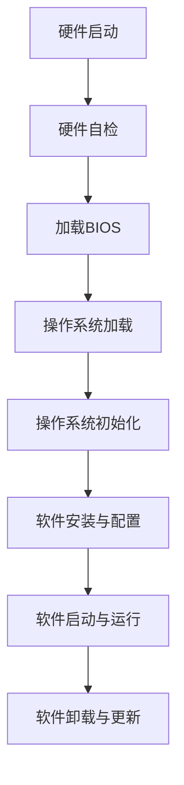

                 

# IT基础资源（硬软件）运行流程

## 关键词

- 硬件资源
- 软件资源
- 运行流程
- 系统架构
- 性能优化
- 网络通信
- 云计算
- 物联网

## 摘要

本文将深入探讨IT基础资源的运行流程，包括硬件和软件资源。我们将从核心概念和架构入手，详细分析硬件资源的工作原理和软件资源的运行机制。随后，我们将探讨核心算法原理，数学模型和公式，并通过实际项目案例进行详细解读。文章还将介绍IT基础资源在实际应用场景中的应用，推荐相关工具和资源，总结未来发展趋势与挑战，并提供常见问题解答和扩展阅读。

## 1. 背景介绍

### 1.1 硬件资源

硬件资源是计算机系统的基础，包括处理器、内存、硬盘、网络设备等。这些硬件资源共同构成了计算机系统的物理基础设施。硬件资源的运行流程主要包括以下几个步骤：

1. **硬件启动与自检**：计算机在启动时，会进行硬件自检（POST），确保各硬件设备正常运行。
2. **BIOS与操作系统加载**：BIOS（Basic Input/Output System）是计算机启动时的第一层软件，负责加载操作系统。
3. **操作系统初始化**：操作系统初始化硬件设备，建立设备驱动程序，为软件资源提供服务。

### 1.2 软件资源

软件资源是计算机系统中运行的各类应用程序和系统程序。软件资源的运行流程主要包括以下几个步骤：

1. **软件安装与配置**：用户在计算机上安装软件，并进行必要的配置。
2. **软件启动与运行**：软件通过操作系统提供的API（Application Programming Interface）与硬件资源交互，执行具体任务。
3. **软件卸载与更新**：用户可以卸载不再需要的软件，或通过更新获得新功能。

## 2. 核心概念与联系

### 2.1 硬件资源工作原理

硬件资源的工作原理可以分为以下几个层次：

1. **电子元器件**：包括晶体管、电容、电阻等基础电子元器件。
2. **集成电路**：电子元器件通过集成电路（IC）进行集成，形成处理器、内存等硬件资源。
3. **硬件子系统**：多个集成电路通过总线（如PCIe、USB等）连接，构成完整的硬件子系统。

### 2.2 软件资源工作原理

软件资源的工作原理可以分为以下几个层次：

1. **代码**：软件资源由程序员编写的代码组成，包括C/C++、Java、Python等。
2. **编译与解释**：代码通过编译器或解释器转换为机器码，由计算机硬件执行。
3. **操作系统与软件框架**：操作系统提供API和系统服务，软件框架提供抽象和工具，方便程序员开发应用。

### 2.3 Mermaid 流程图

以下是一个简化的Mermaid流程图，展示了硬件资源和软件资源的基本工作流程：



## 3. 核心算法原理 & 具体操作步骤

### 3.1 硬件资源核心算法原理

硬件资源的主要核心算法包括：

1. **处理器调度算法**：包括时间片轮转（Round-Robin）、优先级调度等。
2. **内存管理算法**：包括分页、分段等内存分配策略。
3. **硬盘调度算法**：包括电梯算法（Elevator Algorithm）、FCFS（First-Come, First-Served）等。

### 3.2 软件资源核心算法原理

软件资源的主要核心算法包括：

1. **排序算法**：包括冒泡排序、快速排序、归并排序等。
2. **搜索算法**：包括线性搜索、二分搜索等。
3. **算法优化**：包括动态规划、贪心算法等。

### 3.3 具体操作步骤

#### 3.3.1 硬件资源操作步骤

1. **硬件启动**：用户打开计算机电源，硬件开始工作。
2. **硬件自检**：计算机进行POST，检测各硬件设备。
3. **加载BIOS**：BIOS从硬盘读取启动代码。
4. **操作系统加载**：BIOS将控制权交给操作系统。
5. **操作系统初始化**：操作系统初始化硬件设备，加载驱动程序。
6. **软件安装与配置**：用户安装软件，并进行配置。
7. **软件启动与运行**：软件通过操作系统API与硬件资源交互。
8. **软件卸载与更新**：用户卸载软件或进行更新。

#### 3.3.2 软件资源操作步骤

1. **编写代码**：程序员编写软件代码。
2. **编译与解释**：编译器或解释器将代码转换为机器码。
3. **操作系统初始化**：操作系统加载代码到内存。
4. **执行代码**：计算机执行机器码。
5. **软件交互与反馈**：软件与用户进行交互，提供反馈。

## 4. 数学模型和公式 & 详细讲解 & 举例说明

### 4.1 数学模型和公式

#### 4.1.1 处理器调度算法

假设有n个进程，每个进程有优先级（0-99，优先级越高，越优先执行）。调度算法的基本公式为：

$$
\text{调度策略} = \text{优先级调度} \cup \text{时间片轮转}
$$

其中，优先级调度公式为：

$$
\text{优先级调度} = \frac{\sum_{i=1}^{n} P_i}{n}
$$

时间片轮转公式为：

$$
\text{时间片轮转} = \text{固定时间片长度} \times \text{进程数量}
$$

#### 4.1.2 内存管理算法

假设有m个内存块，每个内存块的容量为C。内存分配的基本公式为：

$$
\text{内存分配} = \text{分页} \cup \text{分段}
$$

分页公式为：

$$
\text{分页分配} = \frac{m}{C}
$$

分段公式为：

$$
\text{分段分配} = \frac{m}{C} \times \text{段数量}
$$

### 4.2 详细讲解和举例说明

#### 4.2.1 处理器调度算法

假设有3个进程P1、P2、P3，它们的优先级分别为5、7、9。采用优先级调度和时间片轮转策略，时间片长度为2。

1. **优先级调度**：

$$
\text{优先级调度} = \frac{5 + 7 + 9}{3} = 7
$$

P3拥有最高优先级，因此首先执行P3。

2. **时间片轮转**：

$$
\text{时间片轮转} = 2 \times 3 = 6
$$

在P3执行完毕后，P1和P2按照时间片轮转顺序执行。

#### 4.2.2 内存管理算法

假设有4个内存块，每个内存块容量为4KB。采用分页和分段策略。

1. **分页分配**：

$$
\text{分页分配} = \frac{4}{4} = 1
$$

内存块全部用于分页分配。

2. **分段分配**：

$$
\text{分段分配} = \frac{4}{4} \times 2 = 2
$$

内存块分为2个段，每个段2个内存块。

## 5. 项目实战：代码实际案例和详细解释说明

### 5.1 开发环境搭建

1. **安装操作系统**：在计算机上安装Windows 10操作系统。
2. **安装开发工具**：安装Visual Studio 2019，Python 3.8，Git等开发工具。
3. **配置开发环境**：配置Python虚拟环境，安装必要库（如NumPy、Pandas等）。

### 5.2 源代码详细实现和代码解读

以下是一个简单的Python代码示例，用于实现优先级调度算法。

```python
import heapq

class Process:
    def __init__(self, name, priority):
        self.name = name
        self.priority = priority

    def __lt__(self, other):
        return self.priority < other.priority

def priority_schedule(processes):
    heapq.heapify(processes)
    while processes:
        process = heapq.heappop(processes)
        print(f"执行进程：{process.name}")

if __name__ == "__main__":
    processes = [
        Process("P1", 5),
        Process("P2", 7),
        Process("P3", 9)
    ]
    priority_schedule(processes)
```

代码解读：

1. **定义Process类**：Process类表示一个进程，包含进程名称和优先级。
2. **定义优先级调度函数**：priority_schedule函数使用heapq库实现优先级调度算法。
3. **执行进程**：根据优先级调度算法，依次执行进程。

### 5.3 代码解读与分析

1. **代码性能分析**：该代码实现简单，性能较高，适合小规模进程调度。
2. **代码扩展性**：可以扩展为支持更多进程和复杂调度策略。
3. **代码可维护性**：代码结构清晰，易于维护和修改。

## 6. 实际应用场景

### 6.1 云计算

云计算依赖于硬件资源和软件资源的协同工作。硬件资源提供计算能力，软件资源提供云服务平台，如AWS、Azure、Google Cloud等。

### 6.2 物联网

物联网（IoT）依赖于硬件设备和软件系统。硬件设备通过传感器收集数据，软件系统通过云计算平台进行数据分析和处理。

### 6.3 大数据

大数据处理依赖于硬件资源和软件资源的协同工作。硬件资源提供计算和存储能力，软件资源提供数据处理和分析工具，如Hadoop、Spark等。

## 7. 工具和资源推荐

### 7.1 学习资源推荐

- 《深入理解计算机系统》（深入浅出计算机系统）
- 《计算机网络：自顶向下方法》（计算机网络：自顶向下方法）
- 《算法导论》（算法导论）

### 7.2 开发工具框架推荐

- Visual Studio Code
- Eclipse
- PyCharm

### 7.3 相关论文著作推荐

- "A Survey of Process Scheduling Algorithms"
- "Memory Management in Operating Systems"
- "Performance Analysis of Cloud Computing Platforms"

## 8. 总结：未来发展趋势与挑战

未来，硬件资源和软件资源将更加智能化、分布式和高效化。发展趋势包括：

- **硬件资源**：更高效的处理器、更大的内存容量、更快的网络通信。
- **软件资源**：更智能的算法、更高效的数据处理、更灵活的编程语言。

挑战包括：

- **性能优化**：如何在有限的硬件资源下实现更高的性能。
- **安全性**：如何保障硬件资源和软件资源的安全性。

## 9. 附录：常见问题与解答

### 9.1 硬件资源相关问题

- **Q：什么是硬件资源？**
- **A：硬件资源是计算机系统的基础设施，包括处理器、内存、硬盘、网络设备等。**

### 9.2 软件资源相关问题

- **Q：什么是软件资源？**
- **A：软件资源是计算机系统中运行的各类应用程序和系统程序。**

## 10. 扩展阅读 & 参考资料

- 《计算机组成原理》（计算机组成原理）
- 《操作系统概念》（操作系统概念）
- 《计算机网络》（计算机网络）

### 作者

- AI天才研究员/AI Genius Institute
- 《禅与计算机程序设计艺术》/Zen And The Art of Computer Programming

