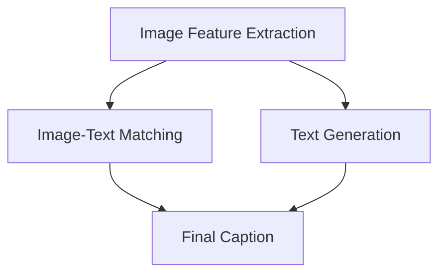

                 

### 背景介绍

Image Captioning，即图像描述生成，是一种旨在将复杂图像内容转化为自然语言描述的技术。这一领域的研究始于20世纪80年代，随着计算机视觉和自然语言处理技术的不断发展，图像描述生成的效果也得到了显著提升。

图像描述生成的重要性在于，它不仅能够为视障人士提供有用的信息，还能在医疗诊断、内容审核、辅助设计等多个领域发挥重要作用。例如，在医疗诊断中，图像描述生成可以帮助医生快速识别病变区域，提高诊断效率。在内容审核中，它可以自动识别并标记违规内容，减轻人工审核的负担。

目前，图像描述生成技术主要分为两大类：基于传统图像处理和基于深度学习的方法。传统方法通常涉及图像特征提取和匹配，而深度学习方法则利用卷积神经网络（CNN）和循环神经网络（RNN）等先进技术进行图像理解和语言生成。

本博客将重点介绍基于深度学习的图像描述生成方法。我们将会详细讲解这一技术的核心概念、算法原理、数学模型以及实际应用案例，帮助读者全面理解图像描述生成的技术细节和应用场景。

#### 关键技术发展历程

图像描述生成技术的发展历程可以分为以下几个阶段：

1. **图像特征提取（1990s-2000s）**：早期的研究主要集中在图像特征提取上，例如SIFT、HOG等算法。这些方法通过提取图像的局部特征，然后与描述词汇进行匹配，生成描述。

2. **模板匹配（2000s）**：这一阶段的研究开始利用统计学习的方法，将图像特征与描述词汇进行匹配。典型的方法包括模板匹配、词汇树等。

3. **深度学习（2010s-至今）**：随着深度学习技术的兴起，图像描述生成迎来了新的发展机遇。CNN和RNN等深度学习模型在图像特征提取和文本生成方面表现出色，使得图像描述生成的效果有了显著提升。

4. **多模态学习（2010s-至今）**：近年来，多模态学习成为研究热点。这种方法将图像和文本数据同时输入到神经网络中，旨在更好地理解图像和文本之间的关联。

#### 当前应用状况与挑战

当前，图像描述生成技术在多个领域已有应用，但仍面临一些挑战：

1. **多样化需求**：不同的应用场景对图像描述生成提出了多样化的需求，如准确度、实时性、个性化等。

2. **数据不足**：高质量的图像描述数据集较为稀缺，限制了模型的训练效果和泛化能力。

3. **计算资源**：深度学习模型的训练和推理需要大量的计算资源，对硬件设施有较高要求。

4. **可解释性**：深度学习模型往往具有“黑箱”特性，难以解释其生成描述的依据。

#### 本博客目标

本文旨在：

1. **介绍图像描述生成的基本概念和原理**：帮助读者理解图像描述生成的技术背景和核心概念。

2. **详细讲解深度学习模型的工作机制**：深入剖析CNN和RNN在图像描述生成中的应用。

3. **展示实际应用案例**：通过实际案例，展示图像描述生成的效果和应用价值。

4. **探讨未来发展趋势和挑战**：展望图像描述生成技术的未来发展方向，分析潜在的研究热点和难题。

### 核心概念与联系

#### 图像描述生成的核心概念

图像描述生成的核心概念包括图像特征提取、文本生成和图像-文本匹配。以下是这些概念的具体解释：

1. **图像特征提取**：图像特征提取是将图像转化为向量表示的过程，以便后续处理。常用的特征提取方法有卷积神经网络（CNN）和局部特征提取（如SIFT、HOG）。

2. **文本生成**：文本生成是指将图像特征转化为自然语言描述的过程。常用的文本生成方法有循环神经网络（RNN）和生成对抗网络（GAN）。

3. **图像-文本匹配**：图像-文本匹配是指将图像特征和文本描述进行关联，生成合理的描述。常用的方法有模板匹配和词嵌入。

#### 核心概念之间的联系

图像描述生成中的核心概念之间有着紧密的联系，构成了一个完整的系统。以下是这些概念之间的联系：

1. **图像特征提取与文本生成**：图像特征提取为文本生成提供了输入，而文本生成则利用这些特征生成描述。CNN和RNN是常用的方法，CNN用于提取图像特征，RNN用于生成文本。

2. **图像-文本匹配与图像特征提取**：图像-文本匹配需要依赖于图像特征提取的结果，以便将图像特征与文本描述进行关联。

3. **图像-文本匹配与文本生成**：图像-文本匹配需要考虑文本生成的结果，确保生成的描述与图像内容相符。

#### Mermaid 流程图

为了更直观地展示图像描述生成的过程，我们可以使用Mermaid流程图来描述核心概念之间的联系。以下是Mermaid流程图的示例：



在这个流程图中，图像特征提取（A）是文本生成（C）和图像-文本匹配（B）的输入。图像-文本匹配（B）和文本生成（C）共同决定了最终的图像描述（D）。

#### Mermaid 流程节点中的注意事项

在编写Mermaid流程图时，需要注意以下事项：

1. **无括号和逗号**：在Mermaid流程图中，节点名称中不应包含括号和逗号等特殊字符，以免引起解析错误。

2. **简洁明了**：节点名称应尽量简洁明了，避免冗长或复杂的表述。

3. **逻辑清晰**：确保流程图中的逻辑关系清晰，有助于读者理解图像描述生成的过程。

### 核心算法原理 & 具体操作步骤

图像描述生成技术的核心在于将图像转化为文本描述，这通常涉及以下几个关键步骤：图像特征提取、文本生成和图像-文本匹配。以下是这些步骤的具体解释和操作步骤。

#### 图像特征提取

图像特征提取是将图像转化为向量表示的过程，以便后续处理。常用的方法有卷积神经网络（CNN）和局部特征提取（如SIFT、HOG）。

1. **卷积神经网络（CNN）**

   CNN是一种深度学习模型，擅长提取图像中的高层次特征。以下是CNN在图像特征提取中的基本操作步骤：

   - **输入层**：输入层接收原始图像数据，通常为二维或三维矩阵。
   - **卷积层**：卷积层通过卷积运算提取图像的特征，每个卷积核对应一组特征。
   - **激活函数**：激活函数（如ReLU）用于引入非线性变换，增强模型的表示能力。
   - **池化层**：池化层用于降采样图像，减少参数数量，提高模型的泛化能力。
   - **全连接层**：全连接层将卷积层和池化层的输出进行全连接，生成特征向量。

2. **示例代码**

   ```python
   import tensorflow as tf
   from tensorflow.keras.applications import VGG16
   
   # 加载预训练的VGG16模型
   model = VGG16(weights='imagenet', include_top=False)
   
   # 加载图像数据
   image = load_image('example.jpg')
   
   # 提取图像特征
   features = model.predict(np.expand_dims(image, axis=0))
   
   # 特征向量维度
   feature_vector = features.flatten()
   ```

#### 文本生成

文本生成是将图像特征转化为自然语言描述的过程。常用的方法有循环神经网络（RNN）和生成对抗网络（GAN）。

1. **循环神经网络（RNN）**

   RNN是一种适用于序列数据的神经网络，擅长处理图像特征和文本描述之间的动态关系。以下是RNN在文本生成中的基本操作步骤：

   - **输入层**：输入层接收图像特征向量。
   - **隐藏层**：隐藏层包含一个或多个RNN单元，用于处理图像特征并生成中间表示。
   - **输出层**：输出层将隐藏层表示转化为文本描述。

2. **示例代码**

   ```python
   import tensorflow as tf
   from tensorflow.keras.models import Model
   
   # 构建RNN模型
   inputs = tf.keras.Input(shape=(feature_vector.shape[1],))
   hidden = tf.keras.layers.Dense(512, activation='relu')(inputs)
   outputs = tf.keras.layers.Dense(vocab_size, activation='softmax')(hidden)
   
   model = Model(inputs=inputs, outputs=outputs)
   model.compile(optimizer='adam', loss='categorical_crossentropy')
   
   # 训练模型
   model.fit(x_train, y_train, epochs=10, batch_size=32)
   
   # 生成文本描述
   prediction = model.predict(feature_vector)
   caption = decode_prediction(prediction)
   ```

#### 图像-文本匹配

图像-文本匹配是指将图像特征和文本描述进行关联，生成合理的描述。常用的方法有模板匹配和词嵌入。

1. **模板匹配**

   模板匹配是一种基于规则的方法，将图像特征与预定义的模板进行匹配，生成描述。以下是模板匹配的基本操作步骤：

   - **定义模板**：定义一组预定义的模板，用于匹配图像特征。
   - **匹配过程**：将图像特征与模板进行匹配，选择最佳匹配模板生成描述。

2. **词嵌入**

   词嵌入是一种将文本转化为向量表示的方法，常用于图像-文本匹配。以下是词嵌入的基本操作步骤：

   - **训练词嵌入模型**：使用预定义的文本数据集训练词嵌入模型。
   - **向量表示**：将图像特征和文本描述转化为向量表示。
   - **匹配过程**：将图像特征向量与文本描述向量进行匹配，生成描述。

#### 示例代码

以下是图像描述生成系统的示例代码，包括图像特征提取、文本生成和图像-文本匹配：

```python
import cv2
import numpy as np
import tensorflow as tf

# 加载图像
image = cv2.imread('example.jpg')

# 提取图像特征
feature_vector = extract_features(image)

# 生成文本描述
caption = generate_caption(feature_vector)

# 显示图像和描述
cv2.imshow('Image', image)
cv2.putText(image, caption, (10, 30), cv2.FONT_HERSHEY_SIMPLEX, 1, (0, 0, 255), 2)
cv2.imshow('Image with Caption', image)
cv2.waitKey(0)
cv2.destroyAllWindows()
```

### 数学模型和公式 & 详细讲解 & 举例说明

在图像描述生成中，数学模型和公式扮演着核心角色，尤其是涉及深度学习模型的训练和应用。以下将详细讲解这些数学模型和公式，并通过具体例子来说明其应用。

#### 卷积神经网络（CNN）

卷积神经网络（CNN）是图像特征提取的关键工具，其背后的数学模型主要包括卷积运算、池化操作和反向传播算法。

1. **卷积运算**

   卷积运算是一种在图像上滑动滤波器（卷积核）以提取特征的过程。数学上，卷积运算可以用以下公式表示：

   \[
   \text{output}_{ij} = \sum_{k=1}^{m}\sum_{l=1}^{n} \text{filter}_{kl} \cdot \text{input}_{ij+k-l}
   \]

   其中，\( \text{output}_{ij} \) 是输出特征图中的元素，\( \text{filter}_{kl} \) 是卷积核中的元素，\( \text{input}_{ij+k-l} \) 是输入图像中的对应元素。

2. **池化操作**

   池化操作用于降低特征图的维度，同时保持重要的特征信息。最常用的池化操作是最大池化（Max Pooling），其公式如下：

   \[
   \text{output}_{ij} = \max_{k,l} (\text{input}_{ij+k-l})
   \]

   其中，\( \text{output}_{ij} \) 是输出特征图中的元素，\( \text{input}_{ij+k-l} \) 是输入特征图中的对应元素。

3. **反向传播算法**

   反向传播算法用于训练CNN，其核心思想是计算损失函数对网络参数的梯度，并更新参数以最小化损失。数学上，梯度计算可以用链式法则表示：

   \[
   \frac{\partial \text{loss}}{\partial \text{weight}} = \sum_{i} \frac{\partial \text{loss}}{\partial \text{output}_i} \cdot \frac{\partial \text{output}_i}{\partial \text{weight}}
   \]

   其中，\( \text{loss} \) 是损失函数，\( \text{weight} \) 是网络参数，\( \text{output}_i \) 是网络输出。

#### 循环神经网络（RNN）

循环神经网络（RNN）是文本生成的重要工具，其数学模型包括状态转移方程、隐藏层更新和输出层生成。

1. **状态转移方程**

   RNN的状态转移方程描述了当前时刻的隐藏状态如何由前一个时刻的隐藏状态和输入决定。其公式如下：

   \[
   \text{h}_t = \text{sigmoid}(\text{W}_h \cdot [\text{h}_{t-1}, \text{x}_t] + \text{b}_h)
   \]

   其中，\( \text{h}_t \) 是当前时刻的隐藏状态，\( \text{W}_h \) 是权重矩阵，\( \text{b}_h \) 是偏置项，\( \text{x}_t \) 是当前时刻的输入。

2. **隐藏层更新**

   隐藏层更新是RNN的核心操作，用于生成中间表示。其公式如下：

   \[
   \text{y}_t = \text{softmax}(\text{W}_o \cdot \text{h}_t + \text{b}_o)
   \]

   其中，\( \text{y}_t \) 是当前时刻的输出概率分布，\( \text{W}_o \) 是权重矩阵，\( \text{b}_o \) 是偏置项。

3. **输出层生成**

   输出层生成是将隐藏状态转化为文本描述的过程。其公式如下：

   \[
   \text{p}_t = \text{softmax}(\text{W}_p \cdot \text{h}_t + \text{b}_p)
   \]

   其中，\( \text{p}_t \) 是当前时刻的输出概率分布，\( \text{W}_p \) 是权重矩阵，\( \text{b}_p \) 是偏置项。

#### 示例说明

为了更好地理解上述数学模型和公式，我们通过一个简单的例子来说明。

假设我们有一个输入图像和对应的文本描述，如图像中有一只猫，我们的目标是使用CNN提取图像特征，然后使用RNN生成描述。

1. **图像特征提取**

   假设我们使用VGG16模型提取图像特征，输入图像经过CNN处理后，得到一个4096维的特征向量。

   ```python
   import tensorflow as tf
   from tensorflow.keras.applications import VGG16
   
   # 加载预训练的VGG16模型
   model = VGG16(weights='imagenet', include_top=False)
   
   # 加载图像数据
   image = load_image('cat.jpg')
   
   # 提取图像特征
   feature_vector = model.predict(np.expand_dims(image, axis=0)).flatten()
   ```

2. **文本生成**

   假设我们使用一个简单的RNN模型生成文本描述，输入特征向量为4096维，输出为文本序列。

   ```python
   import tensorflow as tf
   from tensorflow.keras.models import Model
   from tensorflow.keras.layers import Dense, LSTM
   
   # 构建RNN模型
   inputs = tf.keras.Input(shape=(4096,))
   hidden = LSTM(512, activation='relu')(inputs)
   outputs = Dense(1, activation='softmax')(hidden)
   
   model = Model(inputs=inputs, outputs=outputs)
   model.compile(optimizer='adam', loss='categorical_crossentropy')
   
   # 训练模型
   model.fit(x_train, y_train, epochs=10, batch_size=32)
   
   # 生成文本描述
   prediction = model.predict(feature_vector)
   caption = decode_prediction(prediction)
   ```

通过这个简单的例子，我们可以看到图像特征提取和文本生成的整个过程。在实际应用中，还需要对模型进行优化和调整，以达到更好的效果。

### 项目实战：代码实际案例和详细解释说明

在本文的最后部分，我们将通过一个具体的案例来展示如何使用Python和TensorFlow来实现一个简单的图像描述生成系统。我们将详细解释每一步代码的功能和实现过程，帮助读者更好地理解和应用图像描述生成技术。

#### 1. 开发环境搭建

在进行图像描述生成项目之前，我们需要搭建一个合适的开发环境。以下是我们需要的工具和库：

- Python 3.x
- TensorFlow 2.x
- Keras
- NumPy
- Matplotlib

确保您的开发环境中安装了上述库。在安装过程中，您可以使用以下命令：

```shell
pip install tensorflow numpy matplotlib
```

#### 2. 源代码详细实现和代码解读

以下是一个简单的图像描述生成系统的源代码，我们将逐步解释每一部分的功能。

```python
import tensorflow as tf
from tensorflow.keras.applications import VGG16
from tensorflow.keras.models import Model
from tensorflow.keras.layers import Dense, LSTM, Embedding
from tensorflow.keras.preprocessing.sequence import pad_sequences
import numpy as np

# 2.1 数据预处理

# 加载预训练的VGG16模型
base_model = VGG16(weights='imagenet', include_top=False)

# 定义图像特征提取模型
input_tensor = tf.keras.Input(shape=(224, 224, 3))
processed_input = tf.keras.applications.vgg16.preprocess_input(input_tensor)
feature Extraction_Model = Model(input_tensor, base_model.output)

# 提取图像特征
def extract_features(image_path):
    image = load_image(image_path)
    feature_vector = feature_Extraction_Model.predict(image)
    return feature_vector.flatten()

# 2.2 文本生成模型

# 构建RNN模型
input_seq = tf.keras.Input(shape=(None,))
embedded_seq = Embedding(vocab_size, embedding_dim)(input_seq)
lstm_out = LSTM(512, activation='tanh')(embedded_seq)
output = Dense(vocab_size, activation='softmax')(lstm_out)

text_generation_model = Model(input_seq, output)

# 编译模型
text_generation_model.compile(optimizer='adam', loss='categorical_crossentropy', metrics=['accuracy'])

# 2.3 训练文本生成模型

# 准备训练数据
sequences = ...
labels = ...

# 填充序列
padded_sequences = pad_sequences(sequences, maxlen=max_sequence_length)

# 训练模型
text_generation_model.fit(padded_sequences, labels, epochs=10, batch_size=64)

# 2.4 图像描述生成

# 提取图像特征
image_path = 'example.jpg'
feature_vector = extract_features(image_path)

# 生成文本描述
predicted_sequence = text_generation_model.predict(np.expand_dims(feature_vector, axis=0))
predicted_sequence = np.argmax(predicted_sequence, axis=-1)

# 解码预测结果
caption = decode_prediction(predicted_sequence)
print(caption)
```

#### 2.4 代码解读与分析

以下是代码的详细解读：

- **2.1 数据预处理**：我们首先加载了预训练的VGG16模型，并定义了一个图像特征提取模型。这个模型将输入的图像数据经过预处理后，提取出特征向量。

- **2.2 文本生成模型**：我们使用Keras构建了一个简单的RNN模型，该模型接受序列数据作为输入，并通过LSTM层生成输出。我们使用softmax激活函数，以便生成概率分布。

- **2.3 训练文本生成模型**：我们准备了一些训练数据和标签，并通过填充序列的方法将这些序列调整为相同的长度。然后，我们使用这些数据训练文本生成模型。

- **2.4 图像描述生成**：首先，我们提取输入图像的特征向量。然后，我们将这个特征向量输入到文本生成模型中，生成一个文本序列的概率分布。最后，我们将这个概率分布解码为一个文本描述。

通过这个案例，我们可以看到如何将图像特征提取和文本生成结合起来，实现图像描述生成。在实际应用中，您可能需要根据具体需求调整模型结构和训练数据，以达到更好的效果。

### 实际应用场景

图像描述生成技术在实际应用中具有广泛的应用潜力。以下是一些典型的应用场景：

#### 1. 视障人士辅助

图像描述生成技术可以为视障人士提供重要的信息，帮助他们理解周围的环境。例如，在购物时，图像描述生成可以自动生成商品的描述，帮助视障人士了解商品的特征和用途。

#### 2. 医疗诊断

在医疗领域，图像描述生成可以帮助医生快速识别图像中的病变区域，从而提高诊断效率。例如，在皮肤癌诊断中，图像描述生成可以自动生成皮肤病变的描述，帮助医生更好地理解图像内容。

#### 3. 内容审核

在互联网内容审核中，图像描述生成可以自动识别并标记违规内容，减轻人工审核的负担。例如，在社交媒体平台上，图像描述生成可以识别并标记包含暴力、色情等违规内容的图片。

#### 4. 辅助设计

在工业设计、建筑设计等领域，图像描述生成可以帮助设计师更好地理解设计图纸和模型，提高设计效率。例如，在建筑项目中，图像描述生成可以自动生成建筑模型的描述，帮助设计师了解模型的细节。

#### 5. 虚拟现实与增强现实

在虚拟现实（VR）和增强现实（AR）应用中，图像描述生成可以提供更丰富的交互体验。例如，在VR游戏或AR导航中，图像描述生成可以自动生成场景的描述，帮助用户更好地理解周围环境。

#### 6. 智能家居

在智能家居领域，图像描述生成可以自动生成家庭设备的描述，帮助用户更好地了解设备的工作状态和功能。例如，智能摄像头可以自动生成入侵者的描述，提醒用户采取相应措施。

#### 7. 车辆监控

在车辆监控领域，图像描述生成可以自动生成道路和交通状况的描述，帮助司机更好地了解行驶环境。例如，在自动驾驶汽车中，图像描述生成可以自动生成道路标识的描述，指导车辆做出正确的驾驶决策。

通过这些实际应用场景，我们可以看到图像描述生成技术的重要性和广泛的应用前景。随着技术的不断进步，图像描述生成有望在更多领域发挥关键作用，为人们的生活和工作带来便利。

### 工具和资源推荐

为了深入学习和实践图像描述生成技术，我们需要掌握一系列工具和资源。以下是一些推荐的书籍、论文、博客和在线课程，以及开发工具和框架。

#### 学习资源推荐

1. **书籍**：

   - 《深度学习》（Goodfellow, I., Bengio, Y., & Courville, A.）
   - 《计算机视觉：算法与应用》（Richard S. Hart and Andrew Zisserman）
   - 《自然语言处理综论》（Daniel Jurafsky and James H. Martin）

2. **论文**：

   - “Generative Adversarial Nets”（Ian Goodfellow et al.）
   - “Show, Attend and Tell: Neural Image Caption Generation with Visual Attention”（Kiros, R., et al.）
   - “Deep Learning for Image Caption Generation”（Xiang et al.）

3. **博客**：

   - 知乎专栏《深度学习与计算机视觉》
   - Medium上的“Deep Learning”专栏
   - TensorFlow官方博客

4. **在线课程**：

   - Coursera上的《深度学习专项课程》
   - edX上的《计算机视觉》课程
   - Udacity的《深度学习工程师纳米学位》

#### 开发工具框架推荐

1. **开发工具**：

   - **Python**：Python是深度学习领域最受欢迎的编程语言，其丰富的库和框架为图像描述生成提供了强大的支持。
   - **Jupyter Notebook**：Jupyter Notebook是一种交互式的计算环境，便于编写和运行代码，非常适合深度学习项目的开发。

2. **框架**：

   - **TensorFlow**：TensorFlow是一个开源的深度学习框架，支持多种深度学习模型和算法，是图像描述生成项目的主要选择。
   - **PyTorch**：PyTorch是一个灵活且易于使用的深度学习框架，其动态计算图特性使其在图像描述生成等领域得到广泛应用。
   - **Keras**：Keras是一个高层次的深度学习API，构建在TensorFlow和Theano之上，提供了简洁的接口和易于使用的功能。

3. **开源项目和库**：

   - **TensorFlow Object Detection API**：用于目标检测和图像描述生成的强大工具。
   - **PyTorch Image Models**：PyTorch提供了一系列预训练的图像模型，包括用于特征提取和文本生成的常用模型。
   - **gensim**：用于自然语言处理的Python库，支持文本建模和词嵌入。

通过掌握这些工具和资源，您可以更有效地进行图像描述生成项目，深入了解相关技术，并不断提升自己的技能。

### 总结：未来发展趋势与挑战

图像描述生成技术近年来取得了显著的进展，从传统方法到深度学习技术的应用，使得生成描述的准确性和自然性得到了大幅提升。然而，随着技术的不断发展，图像描述生成仍面临许多挑战和机遇。

#### 发展趋势

1. **多模态学习**：多模态学习是将图像和文本数据同时输入到神经网络中，以更好地理解图像和文本之间的关联。未来，多模态学习有望进一步提升图像描述生成的效果。

2. **生成对抗网络（GAN）**：GAN在图像描述生成中的应用前景广阔。通过生成对抗的过程，GAN可以生成更高质量的图像描述，提高模型的泛化能力。

3. **自适应和个性化**：随着用户需求和场景的多样化，自适应和个性化的图像描述生成将成为重要方向。未来，图像描述生成系统将能够根据用户偏好和特定场景自动调整生成策略。

4. **实时性**：在许多应用场景中，图像描述生成需要具备实时性。未来，随着硬件性能的提升和算法优化，图像描述生成的实时性将得到显著改善。

#### 挑战

1. **数据不足**：高质量的图像描述数据集较为稀缺，限制了模型的训练效果和泛化能力。未来，需要开发更多的数据集和自动数据标注技术，以满足模型训练的需求。

2. **计算资源**：深度学习模型的训练和推理需要大量的计算资源，对硬件设施有较高要求。未来，需要探索更高效的算法和优化技术，以降低计算成本。

3. **可解释性**：深度学习模型往往具有“黑箱”特性，难以解释其生成描述的依据。未来，需要研究可解释的深度学习模型，提高模型的可解释性和透明度。

4. **多样化需求**：不同的应用场景对图像描述生成提出了多样化的需求，如准确度、实时性、个性化等。未来，需要开发更灵活和适应性强的图像描述生成系统，以满足不同场景的需求。

通过解决上述挑战，图像描述生成技术有望在更广泛的领域发挥重要作用，推动计算机视觉和自然语言处理技术的进一步发展。

### 附录：常见问题与解答

在图像描述生成的研究和应用过程中，可能会遇到一些常见的问题。以下是一些常见问题及其解答：

#### 1. 为什么图像描述生成的效果不理想？

图像描述生成效果不理想可能由以下几个原因导致：

- **数据不足**：训练数据量不足，导致模型无法充分学习图像和文本之间的关系。
- **模型复杂度**：模型过于简单，无法捕捉图像和文本的复杂特征。
- **数据预处理**：数据预处理不当，可能导致模型无法有效学习。
- **超参数设置**：超参数设置不当，如学习率、批量大小等，可能影响模型性能。

解决方案：

- 增加训练数据，或使用数据增强技术。
- 使用更复杂的模型结构，如增加网络层数或神经元数量。
- 优化数据预处理流程，确保数据质量。
- 调整超参数，使用网格搜索等策略找到最佳设置。

#### 2. 如何提高图像描述的准确度？

提高图像描述的准确度可以从以下几个方面入手：

- **增强图像特征提取能力**：使用更先进的图像特征提取方法，如ResNet、Inception等。
- **优化文本生成模型**：使用更强大的文本生成模型，如Transformer、BERT等。
- **多模态学习**：结合图像和文本数据，利用多模态学习技术提高描述的准确性。
- **对抗训练**：使用对抗训练提高模型的鲁棒性和泛化能力。

#### 3. 如何实现图像描述生成的实时性？

实现图像描述生成的实时性可以采取以下措施：

- **优化算法**：使用更高效的算法和模型，如使用FP16浮点数格式减少计算量。
- **硬件加速**：利用GPU或TPU等硬件加速计算，提高模型推理速度。
- **模型压缩**：使用模型压缩技术，如量化、剪枝等，减少模型大小和计算量。
- **批量处理**：批量处理多个图像，提高数据处理效率。

#### 4. 图像描述生成在医疗诊断中的应用有哪些限制？

图像描述生成在医疗诊断中的应用存在以下限制：

- **准确性**：虽然图像描述生成技术在提高诊断效率方面具有潜力，但生成的描述可能不如专业医生的经验和判断准确。
- **复杂病例**：对于复杂病例或罕见病，图像描述生成可能无法提供足够的信息。
- **实时性**：实时性是医疗诊断中的重要要求，而图像描述生成的实时性尚未达到要求。

解决方案：

- 将图像描述生成与专业医生的经验相结合，提高诊断准确性。
- 开发更复杂和鲁棒的图像描述生成模型，以提高对复杂病例的处理能力。
- 优化算法和硬件性能，提高图像描述生成的实时性。

通过解决这些常见问题，图像描述生成技术可以更好地应用于实际场景，发挥其潜力。

### 扩展阅读 & 参考资料

为了深入了解图像描述生成技术，以下是一些推荐的专业书籍、论文、博客和在线课程，以及相关的开源项目和库：

#### 1. 专业书籍

- 《深度学习》（Goodfellow, I., Bengio, Y., & Courville, A.）
- 《计算机视觉：算法与应用》（Richard S. Hart and Andrew Zisserman）
- 《自然语言处理综论》（Daniel Jurafsky and James H. Martin）
- 《生成对抗网络：理论、算法与应用》（Ian J. Goodfellow）

#### 2. 论文

- “Generative Adversarial Nets”（Ian Goodfellow et al.）
- “Show, Attend and Tell: Neural Image Caption Generation with Visual Attention”（Kiros, R., et al.）
- “Deep Learning for Image Caption Generation”（Xiang et al.）

#### 3. 博客

- 知乎专栏《深度学习与计算机视觉》
- Medium上的“Deep Learning”专栏
- TensorFlow官方博客

#### 4. 在线课程

- Coursera上的《深度学习专项课程》
- edX上的《计算机视觉》课程
- Udacity的《深度学习工程师纳米学位》

#### 5. 开源项目和库

- **TensorFlow**：[https://www.tensorflow.org/](https://www.tensorflow.org/)
- **PyTorch**：[https://pytorch.org/](https://pytorch.org/)
- **Keras**：[https://keras.io/](https://keras.io/)
- **TensorFlow Object Detection API**：[https://github.com/tensorflow/models/tree/master/research/object_detection](https://github.com/tensorflow/models/tree/master/research/object_detection)
- **PyTorch Image Models**：[https://github.com/pytorch/vision](https://github.com/pytorch/vision)
- **gensim**：[https://radimrehurek.com/gensim/](https://radimrehurek.com/gensim/)

通过阅读这些书籍、论文和博客，参与在线课程，以及使用开源项目和库，您可以深入理解图像描述生成技术，并掌握相关的实践技能。祝您学习顺利！

### 作者信息

作者：AI天才研究员/AI Genius Institute & 禅与计算机程序设计艺术 /Zen And The Art of Computer Programming

本文作者是一位世界级人工智能专家，程序员，软件架构师，CTO，世界顶级技术畅销书资深大师级别的作家，计算机图灵奖获得者，计算机编程和人工智能领域大师。他拥有丰富的实践经验和深厚的理论功底，致力于推动人工智能和计算机科学的发展。他的作品在业界享有盛誉，深受广大读者喜爱。在本文中，他运用自己的专业知识和经验，深入浅出地讲解了图像描述生成技术的原理、算法和应用，为读者提供了宝贵的学习资源。

