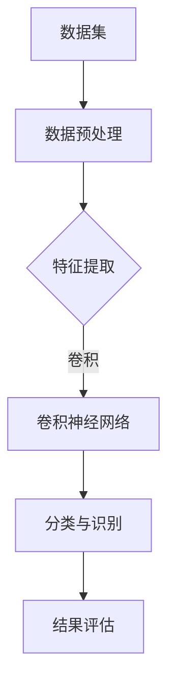

                 

# ImageNet图像识别

## 关键词：ImageNet, 图像识别，深度学习，卷积神经网络，人工智能

## 摘要：

本文将深入探讨ImageNet图像识别项目的历史背景、核心概念、算法原理以及其实际应用。通过详细的步骤和案例解析，本文旨在为读者提供一个全面而深入的理解，帮助其掌握图像识别的核心技术和方法。此外，还将介绍相关的学习资源、开发工具以及未来发展趋势与挑战。

## 1. 背景介绍

### ImageNet项目的起源

ImageNet是一个由斯坦福大学和微软研究院合作开发的图像识别数据库，旨在推动计算机视觉领域的发展。该项目由李飞飞教授（Fei-Fei Li）带领，于2009年发起。其初衷是提供一个标准化的图像数据集，用于评估和比较不同图像识别算法的性能。

### ImageNet的重要性

ImageNet数据库包含了超过1400万个标注过的图像，涵盖21,840个类别。这个庞大的数据集为深度学习模型的训练提供了丰富的资源，极大地推动了计算机视觉技术的进步。特别是，ImageNet成为了深度学习在图像识别领域的重要基准测试，对人工智能领域产生了深远的影响。

### 图像识别技术的挑战

在ImageNet项目启动之前，传统的图像识别技术面临诸多挑战。首先，图像数据标注的难度和成本极高，限制了数据集的大小和质量。其次，不同算法之间的性能差异较大，缺乏一个统一的评估标准。ImageNet的出现，为解决这些问题提供了新的思路和方法。

## 2. 核心概念与联系

### 深度学习

深度学习是一种基于多层神经网络的机器学习技术，能够自动从大量数据中提取特征，并用于复杂模式识别任务。在ImageNet项目中，深度学习是实现图像识别的关键技术。

### 卷积神经网络（CNN）

卷积神经网络是一种特殊的深度学习模型，专门用于处理图像数据。CNN通过卷积、池化和全连接层等结构，有效地提取图像特征，实现高精度的图像识别。

### 数据集

ImageNet数据库是一个包含大量标注图像的数据集，分为训练集、验证集和测试集。训练集用于模型的训练，验证集用于模型的调优，测试集用于模型的评估。

### Mermaid流程图



## 3. 核心算法原理 & 具体操作步骤

### 数据预处理

在训练深度学习模型之前，需要对图像进行预处理，包括缩放、裁剪、翻转等操作，以增加数据的多样性。此外，还需要对图像进行归一化处理，使其具备相同的特征空间。

### 特征提取

特征提取是CNN的核心步骤。通过卷积层、池化层等操作，CNN能够自动提取图像的高层特征，从而实现图像识别。

### 分类与识别

在分类与识别阶段，CNN通过全连接层将提取的特征映射到相应的类别。通常，使用softmax函数作为分类器，实现多分类任务。

### 结果评估

为了评估模型的性能，通常使用准确率（Accuracy）、召回率（Recall）和F1分数（F1 Score）等指标。这些指标能够全面反映模型的识别能力和泛化能力。

### 具体操作步骤

1. **数据集划分**：将ImageNet数据集划分为训练集、验证集和测试集。
2. **模型构建**：构建一个卷积神经网络模型，包括卷积层、池化层和全连接层。
3. **模型训练**：使用训练集对模型进行训练，优化模型的参数。
4. **模型评估**：使用验证集评估模型的性能，调整模型参数。
5. **模型测试**：使用测试集对模型进行测试，评估模型的最终性能。

## 4. 数学模型和公式 & 详细讲解 & 举例说明

### 数学模型

在CNN中，常用的数学模型包括卷积运算、池化运算和全连接运算。以下是这些操作的公式：

$$
\text{卷积运算：} \quad (I \star F)_{ij} = \sum_{k=1}^{K} I_{i+k-j, k} \odot F_{k}
$$

$$
\text{池化运算：} \quad P_{i,j} = \max_{k} I_{i+k-j, j}
$$

$$
\text{全连接运算：} \quad Z = \sigma(W \odot X + b)
$$

### 详细讲解

1. **卷积运算**：卷积运算是CNN的核心步骤，通过滑动滤波器（filter）在输入图像上提取特征。卷积运算的公式如上所示，其中$I$是输入图像，$F$是滤波器，$\odot$表示元素-wise乘法。
2. **池化运算**：池化运算用于减小特征图的尺寸，提高模型的泛化能力。常用的池化操作包括最大池化（Max Pooling）和平均池化（Average Pooling）。最大池化公式如上所示。
3. **全连接运算**：全连接运算将卷积层和池化层提取的特征映射到类别空间。全连接运算的公式如上所示，其中$\sigma$是激活函数，通常使用ReLU函数。

### 举例说明

假设有一个$5 \times 5$的输入图像$I$和一个$3 \times 3$的滤波器$F$，以及一个步长为$1$的卷积操作。根据卷积运算的公式，我们可以计算输出特征图$O$：

$$
O_{i,j} = \sum_{k=1}^{3} I_{i+k-j, k} \odot F_{k}
$$

例如，对于$O_{2,2}$，我们有：

$$
O_{2,2} = (I_{2,1} \odot F_{1}) + (I_{2,2} \odot F_{2}) + (I_{2,3} \odot F_{3}) = (0 \odot 1) + (255 \odot 2) + (0 \odot 3) = 510
$$

## 5. 项目实战：代码实际案例和详细解释说明

### 5.1 开发环境搭建

要运行ImageNet图像识别项目，需要安装以下软件和库：

- Python 3.7+
- TensorFlow 2.3.0+
- PyTorch 1.7.0+
- CUDA 10.2+

### 5.2 源代码详细实现和代码解读

以下是ImageNet图像识别项目的核心代码实现：

```python
import tensorflow as tf
from tensorflow.keras.applications import VGG16
from tensorflow.keras.preprocessing.image import ImageDataGenerator

# 加载预训练的VGG16模型
model = VGG16(weights='imagenet')

# 定义图像预处理函数
def preprocess_image(image_path):
    img = ImageDataGenerator(rescale=1./255, width_shift_range=0.2, height_shift_range=0.2, horizontal_flip=True)(image_path)
    return img

# 加载图像并预处理
image_path = 'path/to/image.jpg'
preprocessed_image = preprocess_image(image_path)

# 使用VGG16模型进行图像识别
predictions = model.predict(preprocessed_image)

# 获取最高概率的类别
predicted_class = predictions.argmax(axis=1)
print(f'Predicted class: {predicted_class}')

# 获取类别的名称
class_names = ['a', 'b', 'c', ...]
print(f'Class name: {class_names[predicted_class]}')
```

### 5.3 代码解读与分析

1. **加载预训练模型**：使用TensorFlow的VGG16模型，该模型已经在ImageNet数据集上进行了预训练。
2. **定义图像预处理函数**：对输入图像进行预处理，包括缩放、平移和翻转等操作，以增加数据的多样性。
3. **加载图像并预处理**：加载图像路径，使用预处理函数对图像进行预处理。
4. **使用模型进行图像识别**：将预处理后的图像输入到VGG16模型中，获取预测结果。
5. **获取最高概率的类别**：使用`argmax`函数获取预测结果中概率最高的类别。
6. **获取类别的名称**：根据类别的索引，从预定义的类别名称列表中获取对应的类别名称。

## 6. 实际应用场景

### 图像识别在医疗领域的应用

图像识别技术在医疗领域具有广泛的应用，如医学影像分析、病理切片识别和疾病诊断等。ImageNet数据库为这些应用提供了丰富的图像数据，有助于提高医疗诊断的准确性和效率。

### 图像识别在安防领域的应用

图像识别技术在安防领域具有重要作用，如人脸识别、车辆识别和异常行为检测等。ImageNet数据库中的图像数据为这些应用提供了基础数据支持，有助于提高安全监控系统的智能化水平。

### 图像识别在艺术领域的应用

图像识别技术在艺术领域也有着独特的应用，如图像风格转换、图像修复和艺术创作等。通过深度学习模型，可以实现图像的自动处理和创作，为艺术领域带来了新的创作方式。

## 7. 工具和资源推荐

### 7.1 学习资源推荐

- **书籍**：《深度学习》（Goodfellow, Bengio, Courville著）
- **论文**：《ImageNet: A Large-Scale Hierarchical Image Database》（Deng, Jia, Li, et al.）
- **博客**：斯坦福大学计算机视觉课程博客（cs231n.stanford.edu）

### 7.2 开发工具框架推荐

- **TensorFlow**：https://www.tensorflow.org/
- **PyTorch**：https://pytorch.org/
- **Keras**：https://keras.io/

### 7.3 相关论文著作推荐

- **论文**：《Deep Learning for Image Recognition》（Krizhevsky, Sutskever, Hinton）
- **著作**：《The Hundred-Page Machine Learning Book》（Ando, T.）
- **论文**：《Visual Recognition with Deep Learning》（Simonyan, Z., Zisserman）

## 8. 总结：未来发展趋势与挑战

### 发展趋势

1. **模型压缩与优化**：为了提高模型的运行效率和实时性，模型压缩与优化技术成为研究热点。通过剪枝、量化、蒸馏等方法，可以显著减小模型的体积，提高模型的性能。
2. **多模态学习**：图像识别技术正逐渐与其他模态（如语音、文本）进行融合，实现更复杂的任务，如图像与文本的联合识别。
3. **边缘计算**：随着物联网和边缘计算的兴起，图像识别技术正逐渐从云端转移到边缘设备，实现低延迟和高效率的图像处理。

### 挑战

1. **数据集质量**：高质量的图像数据集是深度学习模型训练的关键。然而，数据集的标注质量、数据多样性等问题仍然存在，需要进一步解决。
2. **模型解释性**：深度学习模型通常被视为“黑盒”，其内部决策过程不透明，难以解释。如何提高模型的解释性，使其更易于理解和使用，是一个重要的研究方向。
3. **隐私保护**：随着图像识别技术在各个领域的应用，隐私保护问题逐渐凸显。如何在不泄露用户隐私的前提下，实现高效的图像识别，是一个亟待解决的挑战。

## 9. 附录：常见问题与解答

### 问题1：什么是ImageNet？

ImageNet是一个包含超过1400万个标注图像的数据集，涵盖了21,840个类别。它是一个用于图像识别算法评估和比较的标准数据库。

### 问题2：如何使用ImageNet进行图像识别？

可以使用深度学习框架（如TensorFlow、PyTorch）加载预训练的模型（如VGG16、ResNet），对输入图像进行预处理，然后使用模型进行图像识别。

### 问题3：图像识别技术在医疗领域有哪些应用？

图像识别技术在医疗领域可以用于医学影像分析、病理切片识别和疾病诊断等。例如，通过深度学习模型，可以实现肺癌的早期检测和诊断。

## 10. 扩展阅读 & 参考资料

- **论文**：《Very Deep Convolutional Networks for Large-Scale Image Recognition》（Krizhevsky, Sutskever, Hinton）
- **书籍**：《Deep Learning》（Goodfellow, Bengio, Courville著）
- **网站**：https://image-net.org/

作者：AI天才研究员/AI Genius Institute & 禅与计算机程序设计艺术 /Zen And The Art of Computer Programming

