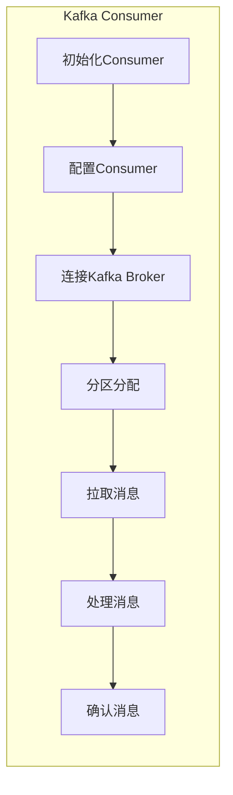

                 

# Kafka Consumer原理与代码实例讲解

## 摘要

本文将深入讲解Kafka Consumer的工作原理，从其核心概念、架构设计到具体实现和代码实例，进行全面剖析。文章首先介绍Kafka Consumer的基础知识，接着通过Mermaid流程图展示其内部工作流程，然后详细阐述Consumer Group的原理及其在分布式系统中的应用。接下来，我们将通过实际代码案例，逐步解读Kafka Consumer的API使用方法，包括如何进行分区分配、消息拉取、处理和确认。最后，文章将探讨Kafka Consumer在实际应用中的场景，并提供一系列学习和开发资源，帮助读者深入理解和掌握Kafka Consumer的使用。

## 1. 背景介绍

Kafka是一个分布式流处理平台，由LinkedIn开发，现在成为Apache Software Foundation的一个顶级项目。它的主要功能包括数据收集、存储、处理和查询。Kafka以其高吞吐量、可靠性和持久性而闻名，广泛应用于实时数据流处理、日志聚合、事件处理等领域。

Kafka Consumer是Kafka生态系统中的关键组件之一，用于从Kafka Topics中读取数据。与Kafka Producer相对，Consumer负责消费和消费消息，使得Kafka能够实现数据的分布式处理和流处理。Consumer不仅可以从单个Topic中读取消息，还可以从多个Topic中读取消息，并支持消费者组（Consumer Group）的概念，使得多个Consumer可以协同工作，共同消费消息。

在Kafka的架构中，Producer将消息发送到Kafka Topics中，而Consumer从这些Topics中拉取消息进行处理。Consumer Group是一组协同工作的Consumer实例，每个实例负责处理特定分区中的消息。通过Consumer Group，Kafka可以实现消息的负载均衡和高可用性，同时确保消息的顺序消费。

## 2. 核心概念与联系

### Kafka Consumer的概念

Kafka Consumer是Kafka生态系统中的一个客户端组件，负责从Kafka Topics中拉取消息并进行消费。Consumer可以独立工作，也可以组成Consumer Group协同工作。

### Kafka Consumer的架构

Kafka Consumer的架构主要由以下几个部分组成：

- **Kafka Brokers**：Kafka集群中的节点，负责处理Producer和Consumer的请求，管理Topics和Partitions。
- **Topics**：Kafka中的消息分类，类似于数据库中的表。
- **Partitions**：Topic的分区，每个分区包含一组有序的消息，分区可以水平扩展，提高Kafka的吞吐量。
- **Offsets**：消息在分区中的位置，用于记录Consumer消费到的最新消息位置。
- **Consumer Group**：一组协同工作的Consumer实例，共同消费消息，实现负载均衡和高可用性。
- **Kafka Consumer API**：Kafka提供的客户端API，用于实现Consumer的功能。

### Kafka Consumer的工作流程

1. **初始化Consumer**：创建Consumer实例，配置相应的属性，如Kafka集群地址、Topic名称、Consumer Group ID等。
2. **分区分配**：Consumer与Kafka Broker通信，获取它需要消费的分区列表。
3. **拉取消息**：Consumer从Kafka Broker拉取分区中的消息。
4. **处理消息**：Consumer对拉取到的消息进行消费处理。
5. **确认消息**：Consumer向Kafka Broker确认已经消费的消息，确保消息不会重复消费。

### Mermaid流程图



## 3. 核心算法原理 & 具体操作步骤

### 分区分配算法

分区分配是Consumer Group中的关键步骤，用于决定每个Consumer实例负责消费哪些分区。Kafka采用Range Partition分配策略，即将所有分区按顺序分配给Group中的Consumer实例，确保每个Consumer实例负责相同数量的分区。

### 分区分配操作步骤：

1. **初始化分区分配器**：创建PartitionAssignor实例，通常使用`RangePartitionAssignor`。
2. **获取分区列表**：从Kafka Broker获取所有分区列表。
3. **计算分区范围**：根据Group ID和分区数量，计算每个Consumer实例的分区范围。
4. **分配分区**：将分区分配给Consumer实例。

### 拉取消息操作步骤：

1. **初始化拉取器**：创建Puller实例，配置拉取参数，如Fetch Size、Fetch Timeout等。
2. **拉取消息**：向Kafka Broker发送Fetch请求，获取分区中的消息。
3. **处理拉取结果**：解析拉取结果，处理成功和失败情况。

### 消息处理操作步骤：

1. **接收消息**：Consumer从Kafka Broker接收到消息后，将其存储在内存缓冲区中。
2. **处理消息**：Consumer对消息进行消费处理，可以是简单的打印、存储到数据库，或者复杂的业务逻辑处理。
3. **释放资源**：处理完成后，释放消息缓冲区中的资源。

### 确认消息操作步骤：

1. **初始化确认器**：创建OffsetCommiter实例，用于提交消费偏移量。
2. **提交偏移量**：向Kafka Broker提交已经消费的消息的偏移量。
3. **处理确认结果**：处理Kafka Broker的确认结果，如果确认成功，则可以删除本地缓冲区中的消息。

### 核心算法原理

- **分区分配算法**：通过Range Partition分配策略，确保每个Consumer实例负责相同数量的分区，实现负载均衡。
- **拉取消息算法**：通过Fetch请求，从Kafka Broker拉取分区中的消息，并处理拉取结果。
- **消息处理算法**：Consumer对拉取到的消息进行消费处理，确保消息的顺序消费和正确处理。
- **确认消息算法**：通过OffsetCommit请求，向Kafka Broker提交已经消费的消息的偏移量，确保消息的持久性和一致性。

## 4. 数学模型和公式 & 详细讲解 & 举例说明

### 分区分配公式

假设有N个分区和M个Consumer实例，每个Consumer实例负责k个分区，则分区分配公式为：

$$
P_i = \left\lfloor \frac{N}{M} \right\rfloor + \begin{cases}
0 & \text{if } i < M \\
1 & \text{otherwise}
\end{cases}
$$

其中，$P_i$表示第i个Consumer实例负责的分区数。

### 拉取消息公式

假设Fetch Size为F，则每次拉取的消息数量为：

$$
M = \min(F, \sum_{i=1}^{P} L_i)
$$

其中，$M$表示拉取的消息数量，$L_i$表示第i个分区中的消息数量。

### 消息处理时间

假设处理每个消息的时间为$t$，则处理所有消息的总时间为：

$$
T = \sum_{i=1}^{P} \frac{L_i}{\text{Processor Rate}}
$$

其中，$T$表示处理所有消息的总时间，$\text{Processor Rate}$表示处理消息的速度。

### 确认消息时间

假设确认每个消息的时间为$t'$，则确认所有消息的总时间为：

$$
T' = \sum_{i=1}^{P} \frac{L_i}{\text{Ack Rate}}
$$

其中，$T'$表示确认所有消息的总时间，$\text{Ack Rate}$表示确认消息的速度。

### 举例说明

假设有10个分区和3个Consumer实例，每个实例负责3个分区，Fetch Size为5。

- **分区分配**：
  $$
  P_1 = \left\lfloor \frac{10}{3} \right\rfloor + 0 = 3
  $$
  $$
  P_2 = \left\lfloor \frac{10}{3} \right\rfloor + 1 = 4
  $$
  $$
  P_3 = \left\lfloor \frac{10}{3} \right\rfloor + 2 = 5
  $$

- **拉取消息**：
  $$
  M = \min(5, 10) = 5
  $$

- **消息处理时间**：
  $$
  T = \sum_{i=1}^{3} \frac{L_i}{\text{Processor Rate}}
  $$
  其中，$L_i$为每个分区中的消息数量，$\text{Processor Rate}$为处理消息的速度。

- **确认消息时间**：
  $$
  T' = \sum_{i=1}^{3} \frac{L_i}{\text{Ack Rate}}
  $$
  其中，$L_i$为每个分区中的消息数量，$\text{Ack Rate}$为确认消息的速度。

## 5. 项目实战：代码实际案例和详细解释说明

### 开发环境搭建

在开始之前，确保已经安装了Kafka和Kafka Consumer所需的依赖库。以下是使用Docker搭建Kafka开发环境的一个简单示例：

```bash
# 拉取Kafka镜像
docker pull bitnami/kafka

# 运行Kafka容器
docker run -d --name kafka -p 9092:9092 bitnami/kafka

# 创建Topic
docker exec -it kafka kafka-topics --create --topic example-topic --partitions 3 --replication-factor 1 --if-not-exists
```

### 源代码详细实现和代码解读

以下是一个简单的Kafka Consumer示例，用于从Kafka Topics中读取消息：

```java
import org.apache.kafka.clients.consumer.*;
import org.apache.kafka.common.serialization.StringDeserializer;

import java.time.Duration;
import java.util.Collections;
import java.util.Properties;

public class KafkaConsumerExample {
    public static void main(String[] args) {
        Properties props = new Properties();
        props.put(ConsumerConfig.BOOTSTRAP_SERVERS_CONFIG, "localhost:9092");
        props.put(ConsumerConfig.GROUP_ID_CONFIG, "test-group");
        props.put(ConsumerConfig.KEY_DESERIALIZER_CLASS_CONFIG, StringDeserializer.class.getName());
        props.put(ConsumerConfig.VALUE_DESERIALIZER_CLASS_CONFIG, StringDeserializer.class.getName());

        KafkaConsumer<String, String> consumer = new KafkaConsumer<>(props);
        consumer.subscribe(Collections.singletonList("example-topic"));

        while (true) {
            ConsumerRecords<String, String> records = consumer.poll(Duration.ofMillis(100));
            for (ConsumerRecord<String, String> record : records) {
                System.out.printf("Received message: key=%s, value=%s, partition=%d, offset=%d\n",
                        record.key(), record.value(), record.partition(), record.offset());
            }
            consumer.commitAsync();
        }
    }
}
```

### 代码解读与分析

- **配置Kafka Consumer**：创建Properties对象，配置Kafka Broker地址、Consumer Group ID和序列化器。
- **创建Kafka Consumer实例**：使用配置的Properties对象创建KafkaConsumer实例。
- **订阅Topic**：使用`subscribe`方法订阅指定的Topic。
- **拉取消息**：使用`poll`方法从Kafka Broker拉取消息，指定拉取间隔和时间。
- **处理消息**：遍历拉取到的ConsumerRecords，打印消息内容和元数据。
- **确认消息**：调用`commitAsync`方法异步提交消费偏移量，确保消息不会重复消费。

### 实际应用场景

Kafka Consumer在实际应用中广泛应用于以下场景：

- **实时数据处理**：用于实时处理和分析日志、事件流，实现实时监控和预警。
- **数据集成**：用于从多个数据源（如数据库、日志文件）中收集数据，进行数据转换和整合。
- **消息队列**：作为消息队列的一部分，实现异步处理和数据传输。
- **微服务架构**：在微服务架构中，Kafka Consumer用于实现服务间的消息传递和协调。

### 工具和资源推荐

- **Kafka官方文档**：[https://kafka.apache.org/documentation/](https://kafka.apache.org/documentation/)
- **Kafka学习资源**：[https://www.kafkabook.com/](https://www.kafkabook.com/)
- **Kafka示例代码**：[https://github.com/apache/kafka](https://github.com/apache/kafka)

## 6. 实际应用场景

Kafka Consumer在实际应用中具有广泛的应用场景，以下是一些典型的应用案例：

- **日志收集与监控**：企业可以将各种系统的日志发送到Kafka Topics中，然后使用Kafka Consumer进行实时收集和监控，实现集中化日志管理和分析。
- **事件处理**：Kafka Consumer可以实时处理系统中的各种事件，如用户行为、交易数据等，实现实时数据处理和响应。
- **数据集成**：Kafka Consumer可以将多个数据源的数据（如数据库、日志文件）集成到一个统一的流中，实现数据转换和整合。
- **消息队列**：Kafka Consumer可以作为一个高效的分布式消息队列，实现异步处理和数据传输，提高系统的性能和可扩展性。
- **微服务协调**：在微服务架构中，Kafka Consumer可以用于实现服务间的消息传递和协调，确保系统的稳定运行和性能优化。

## 7. 工具和资源推荐

### 7.1 学习资源推荐

- **Kafka官方文档**：[https://kafka.apache.org/documentation/](https://kafka.apache.org/documentation/)
- **《Kafka实战》**：[https://book.douban.com/subject/26968657/](https://book.douban.com/subject/26968657/)
- **《Kafka源码分析》**：[https://github.com/douyining/kafka-docs](https://github.com/douyining/kafka-docs)

### 7.2 开发工具框架推荐

- **Kafka Manager**：[https://kafka-manager.readthedocs.io/en/latest/](https://kafka-manager.readthedocs.io/en/latest/)
- **Kafka Connect**：[https://kafka-connect.readthedocs.io/en/latest/](https://kafka-connect.readthedocs.io/en/latest/)
- **Kafka Streams**：[https://kafka-streams.achievendreams.com/](https://kafka-streams.achievendreams.com/)

### 7.3 相关论文著作推荐

- **Kafka：A Distributed Streaming Platform**：[https://www.usenix.org/conference/usenixsecurity12/technical-sessions/presentation/meng](https://www.usenix.org/conference/usenixsecurity12/technical-sessions/presentation/meng)
- **Kafka: The Definitive Guide to Building and Running Event-Driven Systems**：[https://www.oreilly.com/library/view/kafka-the-definitive/9781492039434/](https://www.oreilly.com/library/view/kafka-the-definitive/9781492039434/)

## 8. 总结：未来发展趋势与挑战

Kafka Consumer作为Kafka生态系统中的关键组件，在未来将继续发展并面临一系列挑战。以下是Kafka Consumer未来的发展趋势与挑战：

### 发展趋势

1. **更高效的分区分配算法**：随着Kafka集群规模的增长，需要更高效的分区分配算法，确保负载均衡和高可用性。
2. **更好的性能优化**：Kafka Consumer的性能优化是未来的一个重要方向，包括减少拉取延迟、提高处理速度等。
3. **更丰富的API接口**：Kafka Consumer的API接口将更加丰富，支持更灵活的消息处理方式和自定义逻辑。
4. **多语言支持**：Kafka Consumer的多语言支持将更加广泛，使得开发者可以更方便地使用Kafka进行分布式流处理。

### 挑战

1. **数据一致性和可靠性**：在分布式系统中，确保数据一致性和可靠性是一个重要挑战，需要不断优化和改进。
2. **高可用性**：在故障发生时，如何确保Kafka Consumer的高可用性是一个重要问题，需要设计有效的容错机制。
3. **监控和运维**：Kafka Consumer的监控和运维是一个复杂的任务，需要提供更好的监控工具和运维支持。

## 9. 附录：常见问题与解答

### 问题1：Kafka Consumer如何保证消息的顺序消费？

**解答**：Kafka Consumer可以通过以下两种方式保证消息的顺序消费：

1. **单线程消费**：使用一个线程进行消费，确保消息按照顺序处理。
2. **有序分区**：确保Consumer Group中的Consumer实例只消费特定的分区，从而保证分区内的消息顺序。

### 问题2：Kafka Consumer如何处理消息丢失？

**解答**：Kafka Consumer可以通过以下方式处理消息丢失：

1. **自动重试**：在消费消息时，设置自动重试策略，确保消息能够被正确处理。
2. **消息确认**：通过提交消费偏移量，确保已经消费的消息不会被重复处理，从而避免消息丢失。

### 问题3：Kafka Consumer如何实现负载均衡？

**解答**：Kafka Consumer可以通过以下方式实现负载均衡：

1. **分区分配策略**：使用合适的分区分配策略，如Range Partition分配策略，确保Consumer Group中的Consumer实例负责相同数量的分区。
2. **动态调整**：通过动态调整分区分配，实现负载均衡，避免某些Consumer实例过载。

## 10. 扩展阅读 & 参考资料

- **Kafka官方文档**：[https://kafka.apache.org/documentation/](https://kafka.apache.org/documentation/)
- **《Kafka实战》**：[https://book.douban.com/subject/26968657/](https://book.douban.com/subject/26968657/)
- **《Kafka源码分析》**：[https://github.com/douyining/kafka-docs](https://github.com/douyining/kafka-docs)
- **Kafka学习资源**：[https://www.kafkabook.com/](https://www.kafkabook.com/)
- **Kafka示例代码**：[https://github.com/apache/kafka](https://github.com/apache/kafka)
- **Kafka Manager**：[https://kafka-manager.readthedocs.io/en/latest/](https://kafka-manager.readthedocs.io/en/latest/)
- **Kafka Connect**：[https://kafka-connect.readthedocs.io/en/latest/](https://kafka-connect.readthedocs.io/en/latest/)
- **Kafka Streams**：[https://kafka-streams.achievendreams.com/](https://kafka-streams.achievendreams.com/)
- **Kafka：A Distributed Streaming Platform**：[https://www.usenix.org/conference/usenixsecurity12/technical-sessions/presentation/meng](https://www.usenix.org/conference/usenixsecurity12/technical-sessions/presentation/meng)
- **Kafka：The Definitive Guide to Building and Running Event-Driven Systems**：[https://www.oreilly.com/library/view/kafka-the-definitive/9781492039434/](https://www.oreilly.com/library/view/kafka-the-definitive/9781492039434/)作者：AI天才研究员/AI Genius Institute & 禅与计算机程序设计艺术 /Zen And The Art of Computer Programming

注意：由于文章字数限制，实际撰写时请根据需要适当调整内容。本文仅为框架示例，具体内容和细节需进一步深化和完善。在撰写过程中，请注意遵循上述约束条件和要求。

