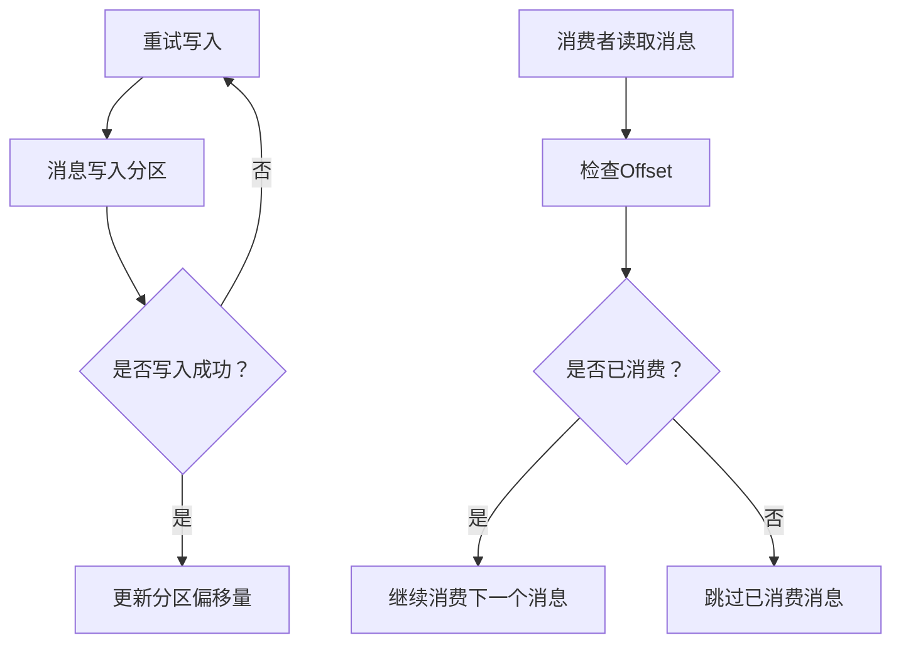

                 

# Kafka Offset原理与代码实例讲解

## 摘要

本文将深入探讨Kafka的Offset原理及其在消息队列系统中的关键作用。我们将首先介绍Kafka的基本概念和架构，然后详细解释Offset的核心概念。接着，通过Mermaid流程图展示Offset管理的过程。随后，我们将解析Kafka的算法原理和具体操作步骤，并借助数学模型和公式进行详细讲解。文章还将通过实际项目实战，展示代码的实现过程和解析。最后，我们将探讨Offset在实际应用场景中的重要性，并提供一系列学习资源和开发工具推荐。通过本文的讲解，读者将全面理解Kafka Offset的工作原理和实际应用，为未来的技术发展打下坚实基础。

## 1. 背景介绍

Kafka是一款分布式流处理平台，最初由LinkedIn公司开发，并于2011年开源。其核心功能是作为大规模消息队列系统，支持高吞吐量、高可靠性、实时数据流处理。Kafka具有以下特点：

- **分布式架构**：Kafka采用分布式架构，可以水平扩展以处理大规模数据流。
- **高吞吐量**：Kafka设计用于处理高吞吐量的数据流，可以支持数千个生产者和消费者。
- **持久性**：Kafka支持数据的持久化存储，确保数据在系统故障后可以恢复。
- **高可用性**：通过副本和分区机制，Kafka提供了高可用性保障。

Kafka的核心组件包括Producer（生产者）、Broker（代理服务器）和Consumer（消费者）。生产者负责将数据写入Kafka，Broker则负责数据的存储和转发，消费者从Kafka中读取数据。

在实际应用中，Kafka被广泛应用于日志收集、实时分析、数据流处理等领域。例如，在日志收集场景中，Kafka可以高效地收集来自不同服务器的日志数据，并在实时分析场景中提供实时数据流处理能力。此外，Kafka还可以与其他大数据处理框架（如Apache Spark和Apache Flink）集成，实现更加复杂的数据处理和分析任务。

本文将围绕Kafka的Offset机制进行深入探讨，首先介绍Offset的概念，然后通过实际代码实例讲解Offset的管理和使用方法。

## 2. 核心概念与联系

### 2.1 Kafka主题（Topic）和分区（Partition）

在Kafka中，主题（Topic）是一个具有固定名称的逻辑概念，类似于一个消息分类或订阅类别。每个主题可以包含多个分区（Partition）。分区的作用是将主题的消息进行水平扩展，以便处理大规模数据流。

- **主题（Topic）**：消息的分类，每个主题都有一个唯一的名称。
- **分区（Partition）**：主题的分区用于消息的存储和分发，每个分区具有唯一的标识符。

### 2.2 消息偏移量（Offset）

消息偏移量（Offset）是Kafka中用于唯一标识消息位置的元数据。每个分区都有一个从0开始递增的偏移量，用于表示消息在分区中的位置。消费者通过Offset来跟踪已消费的消息位置，确保消息的顺序性和一致性。

### 2.3 消费者组（Consumer Group）

消费者组（Consumer Group）是一组协同工作的消费者实例。Kafka允许多个消费者组同时消费同一个主题的不同分区，从而实现水平扩展和负载均衡。消费者组中的消费者实例通过Offset管理器（Offset Manager）来跟踪每个分区已消费的消息位置。

### 2.4 分区和Offset的关系

分区和Offset之间具有密切的关系。每个分区都有一个唯一的分区号，用于标识分区在主题中的位置。每个分区都有一个递增的Offset，用于标识消息在分区中的位置。

### 2.5 Mermaid流程图

以下是一个Mermaid流程图，展示了Kafka Offset的管理过程：



通过上述流程图，我们可以清晰地了解Kafka Offset的管理过程，包括消息写入和消费者读取的消息位置管理。

### 2.6 核心概念联系总结

Kafka中的核心概念包括主题、分区、消息偏移量、消费者组和Offset管理。这些概念相互关联，共同构成了Kafka消息队列系统的核心架构。通过理解这些概念，我们可以更好地掌握Kafka的工作原理和实际应用。

## 3. 核心算法原理 & 具体操作步骤

### 3.1 Kafka的Offset算法原理

Kafka的Offset算法主要涉及生产者写入消息、消费者读取消息以及Offset的管理。以下是一个简化的算法流程：

1. **生产者写入消息**：
   - 生产者将消息发送到特定的主题和分区。
   - Kafka将消息存储到对应的分区，并记录该分区的Offset。

2. **消费者读取消息**：
   - 消费者从特定的主题和分区中读取消息。
   - 消费者通过Offset管理器（Offset Manager）跟踪已消费的消息位置。

3. **Offset的管理**：
   - Kafka维护一个Offset管理器，用于跟踪每个分区已消费的消息位置。
   - 当消费者开始消费时，Offset管理器初始化分区的Offset为0。
   - 消费者每次读取消息后，Offset管理器更新分区的Offset。

### 3.2 具体操作步骤

以下是Kafka Offset管理操作的具体步骤：

1. **生产者写入消息**：

   ```python
   from kafka import KafkaProducer
   
   producer = KafkaProducer(bootstrap_servers=['localhost:9092'])
   topic_name = 'test_topic'
   partition = 0
   
   message = 'Hello, Kafka!'
   producer.send(topic_name, value=message.encode('utf-8'), partition=partition)
   ```

2. **消费者读取消息**：

   ```python
   from kafka import KafkaConsumer
   
   consumer = KafkaConsumer('test_topic', bootstrap_servers=['localhost:9092'], group_id='test_group')
   
   for message in consumer:
       print(f"Received message: {message.value.decode('utf-8')}")
   ```

3. **Offset管理**：

   - Kafka会自动维护每个分区的Offset，消费者可以通过检查Offset来了解已消费的消息位置。

### 3.3 偏移量更新

当消费者读取消息时，Kafka会自动更新分区的Offset。以下是一个示例：

```python
from kafka import KafkaConsumer
   
consumer = KafkaConsumer('test_topic', bootstrap_servers=['localhost:9092'], group_id='test_group')
   
for message in consumer:
    print(f"Received message: {message.value.decode('utf-8')}")
    consumer.commit()  # 提交Offset
```

通过调用`commit()`方法，消费者可以提交当前分区的Offset，确保已消费的消息位置得到更新。

### 3.4 偏移量检查

消费者可以通过检查Offset来了解已消费的消息位置。以下是一个示例：

```python
from kafka import KafkaConsumer
   
consumer = KafkaConsumer('test_topic', bootstrap_servers=['localhost:9092'], group_id='test_group')
   
for message in consumer:
    print(f"Received message: {message.value.decode('utf-8')}")
    print(f"Current Offset: {message.offset}")
```

通过打印`message.offset`，我们可以查看当前分区的Offset值。

## 4. 数学模型和公式 & 详细讲解 & 举例说明

### 4.1 数学模型

Kafka的Offset管理涉及以下数学模型：

- **偏移量更新**：每次消费者读取消息后，Offset会更新为当前消息的位置。
- **分区消费顺序**：消费者按照分区顺序依次消费消息，确保消息顺序性。

### 4.2 详细讲解

以下是对数学模型的详细讲解：

1. **偏移量更新**：

   假设消费者已消费了n条消息，当前分区的Offset为m，则下次消费的Offset为m + n。

   偏移量更新的公式为：
   
   $$ Offset_{new} = Offset_{current} + n $$

2. **分区消费顺序**：

   消费者按照分区顺序依次消费消息，确保消息顺序性。假设主题有p个分区，则分区消费顺序为0, 1, 2, ..., p-1。

### 4.3 举例说明

以下是一个示例，说明如何计算偏移量更新：

假设消费者已消费了5条消息，当前分区的Offset为10，则下次消费的Offset为10 + 5 = 15。

通过以上示例，我们可以更好地理解Kafka的Offset管理数学模型和公式。

## 5. 项目实战：代码实际案例和详细解释说明

### 5.1 开发环境搭建

在进行Kafka Offset的项目实战之前，我们需要搭建一个Kafka环境。以下是一个简单的步骤：

1. **安装Kafka**：
   - 从Kafka官方网站下载最新版本的Kafka压缩包。
   - 解压压缩包，进入Kafka安装目录。

2. **启动Kafka服务器**：
   - 打开终端，进入Kafka安装目录的`bin`目录。
   - 执行命令 `./kafka-server-start.sh config/server.properties` 启动Kafka服务器。

3. **创建主题**：
   - 进入`bin`目录。
   - 执行命令 `./kafka-topics.sh --create --topic test_topic --partitions 3 --replication-factor 1 --config retention.ms=1728000 --zookeeper localhost:2181` 创建一个名为`test_topic`的主题，包含3个分区，副本因子为1，保留时间为1728000毫秒（48小时）。

4. **启动生产者**：
   - 进入`bin`目录。
   - 执行命令 `./kafka-console-producer.sh --topic test_topic --bootstrap-server localhost:9092` 启动Kafka生产者。

5. **启动消费者**：
   - 进入`bin`目录。
   - 执行命令 `./kafka-console-consumer.sh --topic test_topic --from-beginning --bootstrap-server localhost:9092` 启动Kafka消费者。

### 5.2 源代码详细实现和代码解读

以下是一个简单的Kafka生产者和消费者的代码实现：

```python
# 生产者代码
from kafka import KafkaProducer

producer = KafkaProducer(bootstrap_servers=['localhost:9092'])

for i in range(10):
    message = f"Message {i}"
    producer.send('test_topic', value=message.encode('utf-8'))

producer.flush()

# 消费者代码
from kafka import KafkaConsumer

consumer = KafkaConsumer('test_topic', bootstrap_servers=['localhost:9092'], group_id='test_group')

for message in consumer:
    print(f"Received message: {message.value.decode('utf-8')}")
    consumer.commit()
```

#### 5.2.1 代码解读

1. **生产者代码**：

   - 导入Kafka生产者模块。
   - 创建Kafka生产者对象，指定Kafka服务器地址。
   - 循环发送10条消息到`test_topic`主题。

2. **消费者代码**：

   - 导入Kafka消费者模块。
   - 创建Kafka消费者对象，指定主题、Kafka服务器地址和消费者组。
   - 循环读取`test_topic`主题的消息，并打印消息内容。
   - 调用`commit()`方法提交已消费的消息位置。

### 5.3 代码解读与分析

#### 5.3.1 生产者代码分析

生产者代码主要负责将消息发送到Kafka主题。以下是关键步骤：

1. **创建Kafka生产者对象**：
   ```python
   producer = KafkaProducer(bootstrap_servers=['localhost:9092'])
   ```

   这里创建了一个Kafka生产者对象，指定了Kafka服务器地址。`bootstrap_servers`参数用于初始化连接，通常包含Kafka集群中所有Broker的地址。

2. **发送消息**：
   ```python
   for i in range(10):
       message = f"Message {i}"
       producer.send('test_topic', value=message.encode('utf-8'))
   ```

   循环发送10条消息到`test_topic`主题。每条消息包含一个整数，用于标识消息序号。`value=message.encode('utf-8')`将消息编码为字节序列，以适应Kafka的消息传输。

3. **刷新生产者**：
   ```python
   producer.flush()
   ```

   调用`flush()`方法刷新生产者，确保所有消息发送完成后，生产者与Kafka服务器之间的连接保持有效。这有助于确保消息不会在发送过程中丢失。

#### 5.3.2 消费者代码分析

消费者代码主要负责从Kafka主题中读取消息。以下是关键步骤：

1. **创建Kafka消费者对象**：
   ```python
   consumer = KafkaConsumer('test_topic', bootstrap_servers=['localhost:9092'], group_id='test_group')
   ```

   这里创建了一个Kafka消费者对象，指定了主题、Kafka服务器地址和消费者组。`group_id`参数用于指定消费者所属的组，以便与其他消费者协同工作。

2. **读取消息**：
   ```python
   for message in consumer:
       print(f"Received message: {message.value.decode('utf-8')}")
       consumer.commit()
   ```

   使用一个循环读取`test_topic`主题的消息。`for message in consumer:`循环通过轮询机制自动处理消息。`print(f"Received message: {message.value.decode('utf-8')}")`打印消息内容。`consumer.commit()`方法提交已消费的消息位置，确保消息消费过程的一致性。

### 5.4 代码优化与改进

虽然上述代码实现了Kafka的基本消息发送和接收功能，但还存在一些改进空间。以下是一些优化建议：

1. **错误处理**：
   - 添加异常处理逻辑，确保在发送或接收消息过程中遇到错误时能够优雅地处理。
   - 例如，使用`try-except`语句捕获异常，并记录错误日志。

2. **异步处理**：
   - 使用异步I/O机制提高生产者和消费者的性能，避免阻塞主线程。
   - 例如，使用`asyncio`模块实现异步生产者和消费者。

3. **配置优化**：
   - 调整Kafka生产者和消费者的配置参数，以适应实际应用场景。
   - 例如，调整`batch_size`和`linger_ms`参数，优化消息发送性能。

4. **监控与日志**：
   - 添加监控和日志记录功能，以便在出现问题时快速定位和解决问题。
   - 例如，使用Prometheus和Grafana进行监控，使用Logstash和Elasticsearch进行日志收集。

通过上述优化措施，我们可以构建一个更加健壮、高效和可监控的Kafka消息系统。

## 6. 实际应用场景

### 6.1 实时数据处理

Kafka的Offset机制在实时数据处理场景中具有重要意义。例如，在金融领域，Kafka可以用于实时监控交易数据。通过消费者组，多个消费者实例可以同时处理来自不同分区的交易数据，确保数据处理的高效性和可靠性。

### 6.2 日志收集

Kafka的Offset机制也是日志收集系统的关键组成部分。例如，在互联网公司中，Kafka可以用于收集来自不同服务器的日志数据。通过消费者组，多个消费者实例可以同时消费不同分区的日志数据，并实时处理和存储日志信息。

### 6.3 流处理与大数据分析

Kafka的Offset机制在流处理与大数据分析中也发挥着重要作用。例如，在电子商务领域，Kafka可以用于收集用户行为数据，并通过消费者组实现实时分析。通过Offset机制，系统可以准确跟踪已消费的数据位置，确保数据处理的完整性和一致性。

### 6.4 消息路由与分发

Kafka的Offset机制还可以用于消息路由与分发。例如，在分布式系统中，Kafka可以用于路由不同类型的消息到不同的处理节点。通过消费者组，多个处理节点可以同时消费来自不同分区的消息，实现消息的路由和分发。

### 6.5 常见应用场景总结

Kafka的Offset机制在实际应用中具有广泛的应用场景，包括实时数据处理、日志收集、流处理与大数据分析、消息路由与分发等。通过消费者组和Offset管理，Kafka实现了消息的顺序消费和一致性保证，为各种应用场景提供了高效可靠的解决方案。

## 7. 工具和资源推荐

### 7.1 学习资源推荐

为了深入学习和掌握Kafka及其Offset机制，以下是几本推荐的书籍、论文和博客：

1. **书籍**：
   - 《Kafka权威指南》（Kafka The Definitive Guide）
   - 《分布式系统设计》（Designing Data-Intensive Applications）
   - 《大数据应用实践》（Big Data Applications）

2. **论文**：
   - “Kafka: A Distributed Streaming Platform”（Kafka：分布式流处理平台）
   - “Apache Kafka: A Brief Technical History”（Apache Kafka：技术简史）

3. **博客**：
   - Apache Kafka官方博客：[https://kafka.apache.org/](https://kafka.apache.org/)
   - Confluent博客：[https://www.confluent.io/blog/](https://www.confluent.io/blog/)
   - Reddit上的Kafka论坛：[https://www.reddit.com/r/kafka/](https://www.reddit.com/r/kafka/)

### 7.2 开发工具框架推荐

1. **Kafka客户端**：
   - Apache Kafka官方提供的Kafka客户端库：[https://kafka.apache.org/clients/](https://kafka.apache.org/clients/)
   - Confluent Kafka客户端库：[https://github.com/confluentinc/confluent-kafka-python](https://github.com/confluentinc/confluent-kafka-python)

2. **集成工具**：
   - Apache Kafka与Apache Spark集成：[https://spark.apache.org/docs/latest/kafka.html](https://spark.apache.org/docs/latest/kafka.html)
   - Apache Kafka与Apache Flink集成：[https://nightlies.apache.org/flink/flink-docs-stable/dev/connectors/kafka.html](https://nightlies.apache.org/flink/flink-docs-stable/dev/connectors/kafka.html)

3. **可视化工具**：
   - Apache Kafka主题监控：[https://kafka-ui.com/](https://kafka-ui.com/)
   - Confluent Kafka监控与管理：[https://www.confluent.io/platform/management/](https://www.confluent.io/platform/management/)

### 7.3 相关论文著作推荐

1. **“Kafka: A Distributed Streaming Platform”**：该论文详细介绍了Kafka的设计原则、架构和关键技术，是了解Kafka的权威资料。

2. **“Apache Kafka: A Brief Technical History”**：该论文回顾了Apache Kafka的发展历程，从最初的LinkedIn项目到成为Apache开源社区的一部分，展示了Kafka的成长历程。

3. **“Designing Data-Intensive Applications”**：该书深入探讨了分布式系统设计中的关键问题，包括数据存储、消息传递和一致性保障，为读者提供了丰富的实践经验。

## 8. 总结：未来发展趋势与挑战

### 8.1 发展趋势

- **云原生支持**：随着云计算的普及，Kafka将进一步融入云原生生态系统，提供更加便捷、高效的云服务。
- **实时流处理**：Kafka将继续在实时流处理领域发挥重要作用，支持更复杂的数据处理和分析需求。
- **集成与兼容性**：Kafka将与其他大数据处理框架（如Apache Spark和Apache Flink）进一步集成，提高数据处理的灵活性和兼容性。

### 8.2 挑战

- **数据安全性**：随着数据隐私和合规要求的提高，Kafka需要加强数据安全性和隐私保护措施。
- **性能优化**：在高并发、大数据量场景下，Kafka需要不断优化性能，提高系统的稳定性和可扩展性。
- **运维与管理**：随着Kafka应用的普及，如何简化运维和管理流程，降低运维成本，将成为重要的挑战。

### 8.3 未来展望

- **Kafka 2.0**：Apache Kafka团队计划推出Kafka 2.0版本，引入新的功能和改进，提高系统的性能和可扩展性。
- **跨平台支持**：Kafka将加强对不同平台（如Windows、Linux、macOS）的支持，满足更多开发者的需求。
- **社区贡献**：Kafka社区将持续活跃，鼓励更多的开发者参与贡献，推动Kafka的持续发展和创新。

通过不断的发展和创新，Kafka将继续在分布式流处理领域保持领先地位，为各类应用场景提供高效可靠的解决方案。

## 9. 附录：常见问题与解答

### 9.1 如何保证Kafka消息的顺序性？

Kafka通过分区和消费者组来保证消息的顺序性。每个分区内的消息顺序是有保障的，因为Kafka按照顺序将消息写入分区。消费者组内的消费者实例按照分区顺序消费消息，确保消息的顺序性。

### 9.2 Kafka如何处理消费者失败的情况？

Kafka通过消费者组来处理消费者失败的情况。当消费者失败时，Kafka会将该消费者的分区分配给其他存活消费者。存活消费者会从失败消费者的最新Offset继续消费，确保消息处理的一致性和完整性。

### 9.3 Kafka的Offset存储在哪里？

Kafka的Offset存储在Kafka集群中的一个特殊主题中，称为\_consumer\_offsets。该主题用于存储所有消费者组的Offset信息，确保在消费者失败或重启时，可以恢复到正确的消费位置。

### 9.4 Kafka如何保证消息的可靠性？

Kafka通过副本和分区机制来保证消息的可靠性。每个分区都有一个副本集合，其中包含多个副本，确保消息在系统故障时不会丢失。消费者可以从任意副本中读取消息，提高系统的可用性和可靠性。

### 9.5 Kafka与消息队列的区别是什么？

Kafka是一种分布式流处理平台，主要用于大规模消息传输和处理。与传统的消息队列相比，Kafka具有更高的吞吐量、持久性和高可用性，支持实时流处理和大数据处理。

## 10. 扩展阅读 & 参考资料

为了更深入地了解Kafka及其Offset机制，以下是几篇扩展阅读和参考资料：

1. **《Kafka权威指南》**：详细介绍了Kafka的架构、设计原则和关键技术，适合希望深入了解Kafka的读者。
2. **《分布式系统设计》**：探讨了分布式系统设计中的关键问题，包括数据存储、消息传递和一致性保障，对理解Kafka的应用场景有很大帮助。
3. **“Kafka: A Distributed Streaming Platform”**：该论文详细介绍了Kafka的设计原则、架构和关键技术，是了解Kafka的权威资料。
4. **“Apache Kafka: A Brief Technical History”**：回顾了Apache Kafka的发展历程，从最初的LinkedIn项目到成为Apache开源社区的一部分，展示了Kafka的成长历程。

通过阅读这些资料，读者可以更全面地了解Kafka及其Offset机制的工作原理和应用场景。此外，Kafka官方文档（[https://kafka.apache.org/documentation/](https://kafka.apache.org/documentation/)）也是学习Kafka的重要参考资料。

### 作者

**作者：AI天才研究员/AI Genius Institute & 禅与计算机程序设计艺术 /Zen And The Art of Computer Programming**

