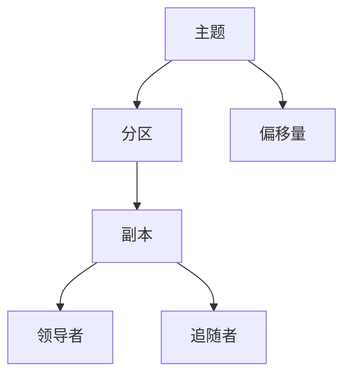

                 

### Kafka原理与代码实例讲解

#### 关键词：Kafka, 消息队列, 分布式系统, 事件驱动架构, 数据流处理

> **摘要**：本文将深入探讨Kafka的核心原理，包括其设计理念、架构、核心算法，并通过具体代码实例，展示如何在实际项目中应用Kafka。文章旨在为读者提供清晰的技术思路和操作步骤，帮助理解Kafka的工作机制，为未来的技术发展奠定基础。

## 1. 背景介绍

**Kafka** 是一个分布式流处理平台，由Apache软件基金会开发。它主要用于构建实时数据流应用程序和流数据平台，旨在提供高吞吐量、持久化、可扩展的消息队列服务。Kafka最初由LinkedIn公司开发，并在2010年贡献给了Apache软件基金会，迅速成为大数据生态系统中的重要组成部分。

Kafka的主要特点包括：

- **高吞吐量**：能够处理大规模的数据流，每秒处理数百万条消息。
- **高可用性**：通过分布式架构和副本机制确保系统的高可用性。
- **持久性**：消息被持久化到磁盘，确保数据不丢失。
- **可扩展性**：水平扩展，支持大规模集群。

Kafka广泛应用于多种场景，如网站活动跟踪、日志聚合、实时分析、数据管道等。本文将围绕Kafka的原理和代码实例，深入探讨其内部工作机制，为读者提供全面的技术解读。

### 1.1 Kafka的应用场景

- **网站活动跟踪**：Kafka可以收集和分析用户行为数据，为网站提供实时分析能力。
- **日志聚合**：将分布式系统中的日志聚合到一个中心位置，方便监控和管理。
- **实时分析**：为实时流处理应用提供数据源，如股票交易、社交网络分析等。
- **数据管道**：构建数据传输管道，将数据从一个系统传输到另一个系统。

## 2. 核心概念与联系

Kafka的核心概念包括主题（Topic）、分区（Partition）、副本（Replica）和偏移量（Offset）。

### 2.1 主题（Topic）

主题是Kafka中的消息分类，类似于数据库中的表。每个主题可以包含多个分区。

### 2.2 分区（Partition）

分区是Kafka中的消息分区，用于提高数据处理的并行度。每个主题可以有多个分区，分区内的消息是有序的，但不同分区之间的消息是无序的。

### 2.3 副本（Replica）

副本是Kafka中的数据冗余机制，用于提高系统的可用性和持久性。每个分区可以有多个副本，其中只有一个副本作为领导者（Leader），其他副本作为追随者（Follower）。

### 2.4 偏移量（Offset）

偏移量是Kafka中的消息位置标识，用于确定消息的消费进度。

### 2.5 Mermaid流程图



## 3. 核心算法原理 & 具体操作步骤

Kafka的核心算法主要包括生产者发送消息、消费者消费消息和副本同步。

### 3.1 生产者发送消息

1. **选择分区**：生产者根据消息的键（Key）和分区策略，选择目标分区。
2. **序列化消息**：将消息序列化为字节数组。
3. **发送消息**：通过网络将消息发送到目标分区的领导者副本。
4. **确认发送**：生产者等待确认消息已成功发送。

### 3.2 消费者消费消息

1. **选择分区**：消费者根据分区分配策略，选择可用的分区。
2. **消费消息**：消费者从分区中读取消息。
3. **确认消费**：消费者向分区领导者确认已消费的消息。

### 3.3 副本同步

1. **同步请求**：追随者向领导者发送同步请求。
2. **数据复制**：领导者将数据发送给追随者。
3. **同步确认**：追随者确认同步完成。

### 3.4 具体操作步骤示例

#### 生产者发送消息

```java
ProducerRecord<String, String> record = new ProducerRecord<>("my-topic", "key", "value");
producer.send(record);
```

#### 消费者消费消息

```java
Consumer<String, String> consumer = new KafkaConsumer<>("my-topic");
consumer.subscribe(Collections.singletonList("my-topic"));
while (true) {
    ConsumerRecords<String, String> records = consumer.poll(Duration.ofMillis(100));
    for (ConsumerRecord<String, String> record : records) {
        System.out.printf("Received message: key=%s, value=%s, partition=%d, offset=%d\n",
            record.key(), record.value(), record.partition(), record.offset());
    }
}
```

## 4. 数学模型和公式 & 详细讲解 & 举例说明

Kafka的数学模型主要包括分区选择策略、副本同步算法和负载均衡算法。

### 4.1 分区选择策略

分区选择策略用于确定消息应该发送到哪个分区。常用的分区选择策略包括：

- **哈希分区**：使用消息的键（Key）进行哈希，选择哈希值对应的分区。
- **轮询分区**：循环选择分区，保证每个分区被均匀使用。

哈希分区公式：

```latex
partition\_id = hash(key) \mod num\_partitions
```

其中，`hash(key)` 是对键进行哈希运算的结果，`num_partitions` 是分区数量。

### 4.2 副本同步算法

副本同步算法用于确保追随者副本与领导者副本的数据一致性。常用的同步算法包括：

- **同步复制**：追随者直接从领导者读取数据。
- **异步复制**：追随者先将数据缓存到本地，然后异步发送给领导者。

同步复制公式：

```latex
leader\_id = partition\_leader(partition\_id)
follower\_id = partition\_follower(partition\_id)
data\_replication = replica\_sync(leader\_id, follower\_id)
```

其中，`partition_leader(partition_id)` 是选择分区领导者的函数，`partition_follower(partition_id)` 是选择分区追随者的函数，`replica_sync(leader_id, follower_id)` 是副本同步的函数。

### 4.3 负载均衡算法

负载均衡算法用于平衡各个分区的负载。常用的负载均衡算法包括：

- **轮询负载均衡**：循环选择可用的分区。
- **哈希负载均衡**：根据消息的键（Key）进行哈希，选择哈希值对应的分区。

哈希负载均衡公式：

```latex
partition\_id = hash(key) \mod num\_partitions
```

## 5. 项目实战：代码实际案例和详细解释说明

### 5.1 开发环境搭建

在开始编写代码之前，我们需要搭建Kafka的开发环境。以下是搭建步骤：

1. **安装Java环境**：确保已安装Java 8或更高版本。
2. **安装Kafka**：下载Kafka安装包，并解压到合适的位置。
3. **启动Kafka**：运行Kafka服务器和Zookeeper。

### 5.2 源代码详细实现和代码解读

以下是一个简单的Kafka生产者和消费者的示例代码。

#### 生产者示例代码

```java
// 导入Kafka相关库
import org.apache.kafka.clients.producer.*;
import java.util.Properties;

public class KafkaProducerExample {
    public static void main(String[] args) {
        // Kafka生产者配置
        Properties props = new Properties();
        props.put("bootstrap.servers", "localhost:9092");
        props.put("key.serializer", "org.apache.kafka.common.serialization.StringSerializer");
        props.put("value.serializer", "org.apache.kafka.common.serialization.StringSerializer");

        // 创建Kafka生产者
        Producer<String, String> producer = new KafkaProducer<>(props);

        // 发送消息
        for (int i = 0; i < 10; i++) {
            ProducerRecord<String, String> record = new ProducerRecord<>("my-topic", "key" + i, "value" + i);
            producer.send(record);
        }

        // 关闭生产者
        producer.close();
    }
}
```

代码解读：

- 导入Kafka相关库。
- 配置Kafka生产者，包括Kafka服务器地址、序列化器等。
- 创建Kafka生产者。
- 发送10条消息到"my-topic"主题。
- 关闭生产者。

#### 消费者示例代码

```java
// 导入Kafka相关库
import org.apache.kafka.clients.consumer.*;
import java.util.Properties;
import java.util.Arrays;

public class KafkaConsumerExample {
    public static void main(String[] args) {
        // Kafka消费者配置
        Properties props = new Properties();
        props.put("bootstrap.servers", "localhost:9092");
        props.put("group.id", "my-group");
        props.put("key.deserializer", "org.apache.kafka.common.serialization.StringDeserializer");
        props.put("value.deserializer", "org.apache.kafka.common.serialization.StringDeserializer");

        // 创建Kafka消费者
        Consumer<String, String> consumer = new KafkaConsumer<>(props);

        // 订阅主题
        consumer.subscribe(Arrays.asList("my-topic"));

        // 消费消息
        while (true) {
            ConsumerRecords<String, String> records = consumer.poll(Duration.ofMillis(100));
            for (ConsumerRecord<String, String> record : records) {
                System.out.printf("Received message: key=%s, value=%s, partition=%d, offset=%d\n",
                    record.key(), record.value(), record.partition(), record.offset());
            }
        }
    }
}
```

代码解读：

- 导入Kafka相关库。
- 配置Kafka消费者，包括Kafka服务器地址、组ID、序列化器等。
- 创建Kafka消费者。
- 订阅主题"my-topic"。
- 消费消息并打印消息内容。

### 5.3 代码解读与分析

#### 5.3.1 生产者代码解读

- 配置Kafka生产者，指定Kafka服务器地址和序列化器。
- 创建Kafka生产者。
- 发送10条消息到"my-topic"主题。
- 关闭生产者。

#### 5.3.2 消费者代码解读

- 配置Kafka消费者，指定Kafka服务器地址、组ID和序列化器。
- 创建Kafka消费者。
- 订阅主题"my-topic"。
- 消费消息并打印消息内容。

## 6. 实际应用场景

Kafka在实际应用中具有广泛的应用场景，以下是一些典型的应用场景：

- **网站活动跟踪**：使用Kafka收集用户行为数据，进行实时分析。
- **日志聚合**：将分布式系统中的日志聚合到Kafka，实现集中式监控和管理。
- **实时分析**：利用Kafka作为数据源，进行实时流处理和分析。
- **数据管道**：构建Kafka数据管道，实现数据传输和集成。

## 7. 工具和资源推荐

### 7.1 学习资源推荐

- **书籍**：
  - 《Kafka权威指南》
  - 《大数据：概念、架构与实战》
- **论文**：
  - "Kafka: A Distributed Streaming Platform"
  - "The Design of the Event-Driven Architecture for Big Data Systems"
- **博客**：
  - Apache Kafka官网博客
  - 《深入理解Kafka》
- **网站**：
  - Apache Kafka官网
  - Confluent官网

### 7.2 开发工具框架推荐

- **开发工具**：
  - IntelliJ IDEA
  - Eclipse
- **框架**：
  - Spring Kafka
  - Apache Pulsar

### 7.3 相关论文著作推荐

- **论文**：
  - "Kafka: A Distributed Streaming Platform"
  - "The Design of the Event-Driven Architecture for Big Data Systems"
- **著作**：
  - 《大数据技术基础》
  - 《流处理技术与应用》

## 8. 总结：未来发展趋势与挑战

Kafka作为分布式流处理平台的代表，未来发展趋势将包括：

- **性能优化**：提高Kafka的吞吐量和性能，满足更复杂的应用需求。
- **可扩展性**：增强Kafka的分布式能力，支持更大规模的集群。
- **安全性**：加强Kafka的安全性，确保数据传输和存储的安全性。
- **集成生态**：与其他大数据技术和框架的集成，形成更完整的技术栈。

同时，Kafka面临的挑战包括：

- **运维复杂度**：分布式系统的运维复杂度较高，需要专业运维团队。
- **数据一致性**：确保分布式系统中的数据一致性，避免数据丢失和重复消费。
- **性能瓶颈**：在高并发场景下，如何优化Kafka的性能，避免性能瓶颈。

## 9. 附录：常见问题与解答

### 9.1 Kafka生产者相关问题

Q: 如何确保消息顺序？

A: Kafka保证每个分区内的消息顺序，但不同分区之间的消息是无序的。如果需要全局顺序，可以将所有消息发送到一个分区。

Q: 如何处理消息发送失败？

A: 可以使用Kafka的回调函数（`send()` 方法中的 `callback` 参数）处理发送失败的情况。例如，在回调函数中重试发送或记录错误日志。

### 9.2 Kafka消费者相关问题

Q: 如何处理消费失败？

A: 可以使用Kafka的消费者异常处理器（`poll()` 方法中的 `exceptionHandler` 参数）处理消费失败的情况。例如，在异常处理器中记录错误日志或重新启动消费者。

Q: 如何处理消息重复消费？

A: 可以使用Kafka的消费者组（`ConsumerGroup`）机制，确保每个消费者只消费一次消息。通过检查消息的偏移量，可以避免重复消费。

## 10. 扩展阅读 & 参考资料

- [Apache Kafka官网](https://kafka.apache.org/)
- [Confluent官网](https://www.confluent.io/)
- [《Kafka权威指南》](https://www.oreilly.com/library/view/kafka权威指南/9781492033408/)
- [《大数据：概念、架构与实战》](https://www.oreilly.com/library/view/big-data-concepts/9781449374205/)
- [《深入理解Kafka》](https://www.kafka-cn.com/)
- [Apache Kafka文档](https://kafka.apache.org/Documentation/)
- [Spring Kafka文档](https://docs.spring.io/spring-kafka/docs/current/reference/html/)

