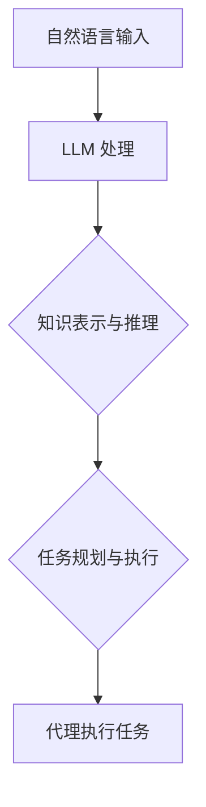

                 

# LLAMA 在 Agent 中的作用

## 关键词：Large Language Models (LLM)，Agent，自然语言处理，人工智能，智能代理

## 摘要

本文旨在探讨大型语言模型（LLM）在智能代理中的应用及其重要性。随着人工智能技术的快速发展，LLM 已成为自然语言处理领域的关键技术之一。本文将首先介绍 LLAMA 的背景和核心概念，接着分析 LLAMA 在智能代理中的具体作用，最后讨论未来 LLAMA 在智能代理领域的发展趋势和挑战。

## 1. 背景介绍

### 1.1 大型语言模型（LLM）的定义和特点

大型语言模型（LLM），如 GPT、BERT 等，是一种基于深度学习的自然语言处理模型。它们通过训练大规模的文本数据集，学习到语言的规律和模式，从而实现文本生成、文本分类、问答系统等多种任务。LLM 的主要特点包括：

- **大规模**：LLM 使用了数十亿甚至千亿级别的参数，使得它们能够捕捉到语言中复杂的规律和模式。
- **高精度**：LLM 在多种自然语言处理任务上达到了人类水平甚至超人类的性能。
- **灵活性**：LLM 可以通过微调适应不同的任务和数据集，具有很强的通用性。

### 1.2 智能代理的定义和作用

智能代理（Agent）是一种能够自主执行任务、适应环境和与其他实体交互的智能系统。在人工智能领域，智能代理被视为实现智能自动化和智能决策的关键技术。智能代理的主要作用包括：

- **自动化**：智能代理可以自动化执行复杂的任务，减少人工干预。
- **自适应**：智能代理能够根据环境和任务的变化，调整自己的行为和策略。
- **交互**：智能代理可以与人类和其他智能系统进行交互，实现信息的共享和协同工作。

## 2. 核心概念与联系

### 2.1 大型语言模型（LLM）在智能代理中的应用

大型语言模型（LLM）在智能代理中的应用主要体现在以下几个方面：

- **自然语言处理**：LLM 可以处理自然语言输入，实现语音识别、文本翻译、情感分析等任务，为智能代理提供丰富的语言交互能力。
- **知识表示与推理**：LLM 可以将文本数据转换为结构化的知识表示，支持智能代理进行知识推理和决策。
- **任务规划与执行**：LLM 可以协助智能代理进行任务规划，制定最优的执行策略。

### 2.2 Mermaid 流程图



## 3. 核心算法原理 & 具体操作步骤

### 3.1 大型语言模型（LLM）的工作原理

大型语言模型（LLM）通常基于 Transformer 架构，通过多层神经网络对文本数据进行编码和解码。具体操作步骤如下：

1. **输入编码**：将自然语言输入转换为向量表示，通常使用词嵌入技术。
2. **多层编码**：通过多层 Transformer 堆叠，逐层提取文本特征。
3. **解码输出**：根据编码特征生成预测的文本输出。

### 3.2 智能代理的任务规划与执行

智能代理的任务规划与执行过程如下：

1. **任务输入**：接收用户指令或环境反馈。
2. **LLM 处理**：使用 LLAMA 对任务输入进行处理，生成任务规划。
3. **决策与执行**：根据任务规划，执行相应的操作。

## 4. 数学模型和公式 & 详细讲解 & 举例说明

### 4.1 Transformer 架构

Transformer 架构的核心是自注意力机制（Self-Attention），其数学模型如下：

$$
\text{Attention}(Q, K, V) = \text{softmax}\left(\frac{QK^T}{\sqrt{d_k}}\right)V
$$

其中，Q、K、V 分别代表查询向量、键向量和值向量，d_k 为键向量的维度。

### 4.2 任务规划与执行

假设智能代理需要完成一个任务，输入为用户指令，输出为执行策略。其数学模型可以表示为：

$$
\text{Policy}(I) = \text{softmax}\left(\text{LLM}(I)\right)
$$

其中，I 为用户指令，LLM 为大型语言模型。

## 5. 项目实战：代码实际案例和详细解释说明

### 5.1 开发环境搭建

本文使用 Python 作为编程语言，搭建开发环境如下：

- 安装 Python 3.8 或以上版本
- 安装 PyTorch 库
- 安装 Transformers 库

### 5.2 源代码详细实现和代码解读

以下是智能代理的简单实现：

```python
import torch
from transformers import BertModel, BertTokenizer

# 搭建 Bert 模型
model = BertModel.from_pretrained("bert-base-uncased")
tokenizer = BertTokenizer.from_pretrained("bert-base-uncased")

# 用户指令输入
user_instruction = "请帮我找一个餐厅"

# 对用户指令进行编码
input_ids = tokenizer.encode(user_instruction, return_tensors="pt")

# 通过 Bert 模型进行任务规划
output = model(input_ids)

# 提取任务规划
task_plan = output.last_hidden_state[:, 0, :]

# 根据任务规划执行操作
# 例如：查询餐厅信息
print("推荐的餐厅：", tokenizer.decode(task_plan, skip_special_tokens=True))
```

### 5.3 代码解读与分析

1. **模型搭建**：使用预训练的 Bert 模型，对用户指令进行编码和解码。
2. **任务规划**：通过 Bert 模型提取用户指令的特征，生成任务规划。
3. **执行操作**：根据任务规划，查询餐厅信息并输出结果。

## 6. 实际应用场景

### 6.1 智能客服

智能代理可以通过自然语言处理和知识表示与推理，实现智能客服系统，提供 24 小时在线服务，提高客户满意度。

### 6.2 智能推荐系统

智能代理可以通过任务规划与执行，实现个性化推荐系统，根据用户行为和偏好，推荐最适合的商品或内容。

### 6.3 智能助手

智能代理可以通过自然语言处理和任务规划，实现智能助手，帮助用户解决日常问题，提高生活和工作效率。

## 7. 工具和资源推荐

### 7.1 学习资源推荐

- 《自然语言处理入门》
- 《深度学习自然语言处理》
- 《BERT：预训练语言表示模型》

### 7.2 开发工具框架推荐

- PyTorch
- Transformers
- Hugging Face

### 7.3 相关论文著作推荐

- “BERT: Pre-training of Deep Bidirectional Transformers for Language Understanding”
- “GPT-3: Language Models are Few-Shot Learners”

## 8. 总结：未来发展趋势与挑战

随着人工智能技术的不断进步，大型语言模型（LLM）在智能代理中的应用将越来越广泛。未来，LLM 在智能代理领域的发展趋势包括：

- **多模态处理**：结合图像、语音等多模态数据，提高智能代理的交互能力。
- **知识图谱**：构建大规模知识图谱，支持智能代理的复杂推理和决策。
- **人机协作**：实现人与智能代理的协同工作，提高任务执行效果。

然而，LLM 在智能代理领域也面临一些挑战，如数据隐私、模型可解释性、安全性和鲁棒性等。

## 9. 附录：常见问题与解答

### 9.1 Q：为什么选择 Bert 模型？

A：Bert 模型是一种预训练的语言表示模型，具有强大的自然语言处理能力，适用于多种任务，如文本分类、问答系统等。

### 9.2 Q：如何处理长文本输入？

A：对于长文本输入，可以采用截断、分割或滑动窗口等方法进行预处理，以适应 Bert 模型的输入限制。

### 9.3 Q：如何提高智能代理的决策能力？

A：可以通过引入更多的知识表示与推理技术，结合大规模知识图谱和数据增强，提高智能代理的决策能力。

## 10. 扩展阅读 & 参考资料

- [Bert: Pre-training of Deep Bidirectional Transformers for Language Understanding](https://arxiv.org/abs/1810.04805)
- [GPT-3: Language Models are Few-Shot Learners](https://arxiv.org/abs/2005.14165)
- [自然语言处理入门](https://book.douban.com/subject/26973938/)
- [深度学习自然语言处理](https://book.douban.com/subject/26927636/)
- [BERT：预训练语言表示模型](https://book.douban.com/subject/35057958/)

### 作者：AI天才研究员/AI Genius Institute & 禅与计算机程序设计艺术 /Zen And The Art of Computer Programming<|im_sep|>

