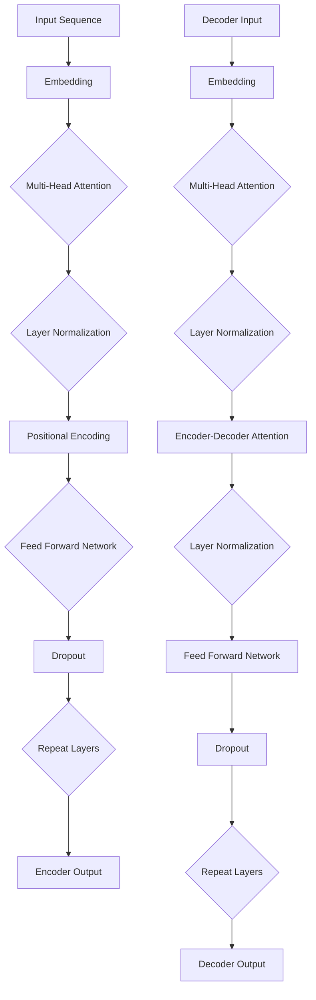

                 

### 背景介绍

#### 上下文长度的演变

随着人工智能技术的飞速发展，自然语言处理（NLP）领域迎来了前所未有的变革。从最初的规则驱动模型，到基于统计的方法，再到如今的深度学习模型，NLP技术一直在不断进化。在这一过程中，上下文长度逐渐成为了衡量模型性能的关键指标。

早期，NLP模型如朴素贝叶斯和基于关键词匹配的算法，其上下文长度通常非常有限。这些模型主要依赖于单个词或短语的统计特征，无法捕捉到长文本中的深层语义信息。随着深度学习技术的引入，尤其是循环神经网络（RNN）和其变种长短期记忆网络（LSTM）的出现，上下文长度得到了显著提升。然而，即使是LSTM模型，其上下文长度依然受到计算资源和模型复杂度的限制。

近年来，Transformer架构的兴起，特别是其变体预训练模型如BERT和GPT的出现，使得上下文长度突破了以往的限制。BERT模型通过双向编码表示（BERT）的方式，将上下文长度扩展到了数千个词，大大提升了模型的语义理解能力。GPT系列模型则通过自回归语言模型（Autoregressive Language Model）实现了对上下文长度的进一步扩展，最高可达数万个词。

然而，尽管上下文长度的提升带来了显著的性能改进，但仍存在一些挑战和限制。首先，随着上下文长度的增加，模型的计算复杂度和存储需求也会急剧上升。其次，长文本的处理需要考虑更多关于上下文信息丢失、语义理解和生成的问题。因此，如何有效地扩展上下文长度，同时保证模型的可解释性和鲁棒性，成为了当前NLP领域亟待解决的问题。

本文将深入探讨LLM上下文长度的再升级，从核心概念、算法原理、数学模型到实际应用，全方位解析这一领域的前沿技术和研究进展。

#### 关键词

- 自然语言处理（NLP）
- 上下文长度
- Transformer架构
- 预训练模型
- BERT
- GPT
- 自回归语言模型

#### 摘要

本文旨在探讨LLM（大型语言模型）上下文长度的再升级。首先，我们回顾了上下文长度在NLP领域的重要性及其演变历程。接着，我们详细介绍了Transformer架构及其在上下文长度扩展方面的优势。随后，本文将重点分析预训练模型BERT和GPT的核心原理和操作步骤。此外，文章还将探讨数学模型和公式，并通过实际项目案例进行详细解读。最后，本文将对LLM上下文长度再升级的实际应用场景进行讨论，并推荐相关工具和资源，以期为读者提供全面、深入的技术洞察。

## 1. 背景介绍

### 1.1 自然语言处理（NLP）的重要性

自然语言处理（NLP）是人工智能领域的一个重要分支，旨在使计算机理解和生成人类语言。随着互联网和大数据的迅猛发展，NLP技术在许多实际应用中发挥了关键作用，包括但不限于机器翻译、文本分类、情感分析、问答系统、语音识别等。

在这些应用中，上下文长度（Context Length）是一个至关重要的因素。上下文长度指的是模型在处理一个词或句子时所能参考的前后文信息数量。对于NLP任务而言，长上下文长度能够帮助模型更好地理解词汇的多义性、句子结构以及文本的整体语义。例如，在机器翻译任务中，短句的翻译可能只涉及单个词汇的直接对应，而长句的翻译则需考虑词汇之间的逻辑关系和上下文环境。

然而，传统的NLP方法，如基于规则的方法和基于统计的方法，通常受限于上下文长度的限制。这些方法往往只能处理短文本，难以捕捉到长文本中的深层语义信息。随着深度学习技术的引入，尤其是循环神经网络（RNN）和其变种长短期记忆网络（LSTM），上下文长度得到了显著提升。RNN和LSTM能够通过记忆单元来存储和处理长序列信息，从而在一定程度上解决了上下文长度受限的问题。

尽管如此，RNN和LSTM在处理长文本时仍然面临一些挑战，如梯度消失和梯度爆炸等问题。这些问题限制了模型在长文本上的表现。因此，如何在保证模型性能的同时有效扩展上下文长度，成为了NLP领域的重要研究方向。

### 1.2 Transformer架构的引入

为了解决RNN和LSTM在处理长文本时的不足，研究人员提出了Transformer架构。Transformer是由Google在2017年提出的一种基于自注意力机制的深度学习模型，旨在用于序列到序列的学习任务，如机器翻译。

与传统的RNN和LSTM相比，Transformer具有以下显著优势：

1. **并行计算**：Transformer使用多头自注意力机制，允许模型并行处理输入序列中的每个词，从而大大提高了计算效率。相比之下，RNN和LSTM必须逐个处理输入序列，导致计算过程较慢。

2. **避免梯度消失和梯度爆炸**：由于Transformer使用自注意力机制而不是递归结构，因此不存在梯度消失和梯度爆炸的问题。这使得模型在训练过程中更为稳定，能够更好地学习长序列信息。

3. **上下文长度的扩展**：通过多头自注意力机制，Transformer能够在计算复杂度可控的情况下扩展上下文长度。这使得模型能够更好地捕捉长文本中的深层语义信息，从而在许多NLP任务中取得了显著的性能提升。

### 1.3 预训练模型BERT和GPT的崛起

基于Transformer架构的成功，研究人员开发了一系列预训练模型，其中最具代表性的包括BERT和GPT。这些模型通过在大规模语料库上进行预训练，能够在大规模数据上自动学习语言的内在规律和结构，从而显著提升了模型在各种NLP任务上的性能。

**BERT（双向编码表示）**：BERT是由Google在2018年提出的一种双向编码表示预训练模型。BERT的核心思想是通过同时考虑输入序列的前后文信息，来生成更加准确和丰富的语言表示。BERT模型在预训练阶段使用两个任务：Masked Language Modeling（MLM）和Next Sentence Prediction（NSP）。这些任务不仅有助于模型学习语言结构，还能够提高其在下游任务中的性能。

**GPT（生成预训练变换器）**：GPT系列模型是由OpenAI提出的一系列自回归语言模型。GPT模型通过自回归的方式，预测输入序列中的下一个词，从而生成更加连贯和自然的语言。GPT模型在预训练阶段使用了大量的未标注文本数据，通过自我预测来优化模型参数。GPT-3是GPT系列中的最新版本，其上下文长度可达到数万个词，显著提升了模型在生成任务上的表现。

### 1.4 上下文长度扩展带来的挑战

尽管上下文长度的扩展在NLP领域带来了巨大的进步，但也带来了一系列新的挑战：

1. **计算复杂度和存储需求**：随着上下文长度的增加，模型的计算复杂度和存储需求也会急剧上升。这对于模型的训练和部署带来了巨大的挑战，特别是在资源受限的环境下。

2. **上下文信息的丢失**：在长文本处理过程中，由于计算资源限制或模型设计的原因，上下文信息可能会丢失。这可能导致模型在理解和生成长文本时出现错误。

3. **语义理解和生成**：长文本中的语义信息更加复杂，模型需要能够有效地理解和生成这些信息。这需要模型具备更强的语义理解能力和生成能力。

为了解决这些挑战，研究人员正在探索各种技术和方法，如上下文剪枝、动态上下文窗口等。这些方法旨在在保证模型性能的同时，降低计算复杂度和存储需求，提高模型在长文本处理中的鲁棒性和性能。

总之，上下文长度的扩展是NLP领域的一个重要研究方向。通过引入Transformer架构和预训练模型BERT和GPT，我们已经在上下文长度扩展方面取得了显著的成果。然而，仍有许多挑战需要解决。未来，随着技术的不断进步，上下文长度将进一步提升，为NLP领域带来更多的可能性。

### 1.5 本文结构

本文将围绕LLM上下文长度的再升级展开讨论。具体结构如下：

1. **背景介绍**：回顾上下文长度在NLP领域的重要性及其演变历程，介绍Transformer架构的引入和预训练模型BERT和GPT的崛起。
   
2. **核心概念与联系**：详细解析Transformer架构的核心概念和Mermaid流程图，介绍BERT和GPT的工作原理。

3. **核心算法原理 & 具体操作步骤**：深入分析BERT和GPT的核心算法原理，讲解具体的操作步骤和技巧。

4. **数学模型和公式 & 详细讲解 & 举例说明**：阐述BERT和GPT中的数学模型和公式，并通过实际案例进行详细解读。

5. **项目实战：代码实际案例和详细解释说明**：展示如何搭建开发环境，详细解读源代码，并进行分析。

6. **实际应用场景**：讨论LLM上下文长度再升级在NLP领域的实际应用场景，如文本生成、机器翻译等。

7. **工具和资源推荐**：推荐相关学习资源、开发工具和框架，以供读者参考。

8. **总结：未来发展趋势与挑战**：总结LLM上下文长度再升级的研究成果和未来发展趋势，讨论面临的挑战。

通过本文的讨论，我们将深入理解LLM上下文长度的再升级，探讨其在NLP领域的重要性和应用前景。希望本文能为读者提供有价值的参考和启示。

### 核心概念与联系

#### Transformer架构

Transformer架构是NLP领域的一项革命性创新，其核心在于引入了自注意力机制（Self-Attention）。自注意力机制使得模型能够在处理序列时，动态地关注序列中的关键信息，从而提升了模型在长文本处理中的表现。

**自注意力机制**

自注意力机制通过计算输入序列中每个词与所有词之间的相似度，为每个词生成一个权重向量。这些权重向量表示了模型在处理当前词时，对其他词的依赖程度。具体而言，自注意力机制分为以下几个步骤：

1. **输入向量转换**：将输入序列（词的索引）转换为嵌入向量（Embedding Vector）。
2. **计算自注意力得分**：通过点积（Dot-Product）计算每个词与其他词之间的相似度，得到自注意力得分。
3. **应用权重向量**：根据自注意力得分，为每个词生成权重向量。
4. **加权求和**：将权重向量与嵌入向量进行加权求和，得到新的表示向量。

**多头注意力（Multi-Head Attention）**

多头注意力是自注意力机制的扩展，通过引入多个独立的自注意力机制，来捕获输入序列中的不同层次信息。多头注意力分为以下几个步骤：

1. **分裂输入向量**：将输入序列的嵌入向量分裂成多个子向量。
2. **独立应用自注意力**：为每个子向量应用自注意力机制，得到多个独立的自注意力输出。
3. **合并输出**：将多个自注意力输出进行合并，得到最终的输出向量。

**Transformer模型**

Transformer模型由多个自注意力层和前馈神经网络组成。在自注意力层中，输入序列通过多头注意力机制进行信息整合；在前馈神经网络层中，则对自注意力层的输出进行进一步加工。Transformer模型的工作流程如下：

1. **编码器（Encoder）**：编码器由多个自注意力层和前馈神经网络层堆叠而成，负责将输入序列转换为上下文表示。
2. **解码器（Decoder）**：解码器同样由多个自注意力层和前馈神经网络层组成，负责从上下文表示中生成输出序列。

**Mermaid流程图**

为了更好地理解Transformer架构，我们可以通过Mermaid流程图来表示其核心组成部分。以下是一个简化的Mermaid流程图示例：



在该流程图中，`A` 表示输入序列，`B` 表示嵌入层，`C` 表示多头自注意力层，`D` 表示层归一化（Layer Normalization），`E` 表示位置编码（Positional Encoding），`F` 表示前馈神经网络层，`G` 表示dropout操作，`H` 表示重复堆叠多层，`I` 表示编码器输出。

**BERT与GPT的核心概念**

**BERT（双向编码表示）**

BERT是一种预训练模型，其核心思想是通过同时考虑输入序列的前后文信息，来生成更加准确和丰富的语言表示。BERT模型在预训练阶段使用了两个任务：Masked Language Modeling（MLM）和Next Sentence Prediction（NSP）。

1. **Masked Language Modeling（MLM）**：在预训练过程中，BERT会随机遮盖输入序列中的15%的词，然后模型需要预测这些被遮盖的词。这个任务有助于模型学习语言的内在结构和语义信息。

2. **Next Sentence Prediction（NSP）**：BERT还会考虑两个句子之间的关系，预测这两个句子是否在原始文本中相邻。这个任务有助于模型理解句子之间的逻辑关系。

**GPT（生成预训练变换器）**

GPT是一种自回归语言模型，其核心思想是通过预测输入序列的下一个词，来生成连贯和自然的语言。GPT模型在预训练阶段使用了大量的未标注文本数据，通过自我预测来优化模型参数。

GPT模型的关键组件包括：

1. **Transformer解码器**：GPT模型使用Transformer解码器，通过自回归方式逐词生成文本。
2. **顶层全连接层**：在解码器的每个步骤中，模型会使用一个顶层全连接层来预测下一个词。

**BERT与GPT的联系**

BERT和GPT都是基于Transformer架构的预训练模型，它们在自注意力机制和预训练任务方面具有很多相似之处。然而，它们在模型结构和应用场景上有所不同：

1. **模型结构**：BERT使用编码器结构，同时考虑输入序列的前后文信息；而GPT使用解码器结构，通过自回归方式生成文本。

2. **应用场景**：BERT更适合用于下游任务，如文本分类、问答系统等；GPT更适合用于生成任务，如文本生成、对话系统等。

通过以上对Transformer架构、BERT和GPT的核心概念和联系的介绍，我们可以更好地理解这些模型在NLP领域的重要作用和相互关系。在接下来的章节中，我们将深入探讨这些模型的算法原理和具体操作步骤。

### 核心算法原理 & 具体操作步骤

#### BERT的算法原理

BERT（Bidirectional Encoder Representations from Transformers）是一种基于Transformer架构的预训练模型，其核心原理在于同时考虑输入序列的前后文信息，从而生成更加准确和丰富的语言表示。BERT通过两个主要任务进行预训练：Masked Language Modeling（MLM）和Next Sentence Prediction（NSP）。

**Masked Language Modeling（MLM）**

在MLM任务中，BERT会随机遮盖输入序列中的15%的词，然后模型需要预测这些被遮盖的词。这个任务有助于模型学习语言的内在结构和语义信息。

具体步骤如下：

1. **输入序列处理**：输入序列经过词嵌入（Word Embedding）和位置编码（Positional Encoding）后，输入到BERT模型。
2. **遮盖词**：在输入序列中随机选择15%的词进行遮盖，这些被遮盖的词用特殊的[MASK]标记代替。
3. **预测被遮盖词**：模型对遮盖后的序列进行预测，输出每个被遮盖词的概率分布。
4. **损失函数**：计算预测概率与真实词之间的交叉熵损失，用于优化模型参数。

**Next Sentence Prediction（NSP）**

NSP任务是BERT模型在预训练阶段学习的一种能力，它要求模型预测两个句子是否在原始文本中相邻。这个任务有助于模型理解句子之间的逻辑关系。

具体步骤如下：

1. **输入句子对**：从原始文本中随机抽取两个句子作为输入。
2. **序列拼接**：将这两个句子拼接成一个序列，并在中间插入一个特殊的[SEP]分隔符。
3. **预测句子关系**：模型对拼接后的序列进行预测，输出两个句子是否相邻的概率。
4. **损失函数**：计算预测概率与真实标签之间的交叉熵损失，用于优化模型参数。

**BERT模型结构**

BERT模型由多个Transformer编码器层堆叠而成，每层包含多头自注意力机制和前馈神经网络。具体结构如下：

1. **嵌入层（Embedding Layer）**：输入序列经过词嵌入和位置编码后，输入到BERT模型。
2. **多头自注意力层（Multi-Head Self-Attention Layer）**：每个词在自注意力机制中与序列中的其他词计算相似度，并加权求和。
3. **前馈神经网络（Feed Forward Neural Network）**：对自注意力层的输出进行进一步加工。
4. **层归一化（Layer Normalization）**：对每层的输出进行归一化处理。
5. **Dropout**：引入Dropout操作，防止过拟合。

BERT模型通过训练，学习到输入序列的深层语义表示，从而在下游任务中表现出色。

**具体操作步骤**

1. **数据预处理**：读取预训练数据集，并进行预处理，如分词、词嵌入和位置编码等。
2. **模型初始化**：初始化BERT模型，包括嵌入层、多头自注意力层、前馈神经网络和层归一化等。
3. **训练**：将预处理后的数据输入到BERT模型，通过反向传播和梯度下降算法优化模型参数。
4. **评估**：在验证集上评估模型性能，包括MLM和NSP任务的准确率等。
5. **应用**：将训练好的BERT模型应用于下游任务，如文本分类、问答系统等。

#### GPT的算法原理

GPT（Generative Pre-trained Transformer）是一种基于Transformer架构的自回归语言模型，其核心原理是通过预测输入序列的下一个词，来生成连贯和自然的语言。GPT模型通过大规模未标注文本数据进行预训练，从而学习到语言的内在规律和结构。

**自回归语言模型**

自回归语言模型（Autoregressive Language Model）是一种能够生成序列的模型，其工作原理是逐词生成。在给定前一个词的条件下，模型预测下一个词的概率分布，并从中抽样生成新的词。具体步骤如下：

1. **输入序列**：输入一个词序列，如`[w1, w2, w3, ..., wn]`。
2. **预测下一个词**：模型根据当前已输入的词序列，预测下一个词的概率分布，如`P(w_{n+1} | w1, w2, ..., wn)`。
3. **抽样生成**：从预测的概率分布中抽样，生成新的词，如`w_{n+1}`。
4. **重复步骤**：重复以上步骤，生成新的词序列，如`[w1, w2, w3, ..., wn, w_{n+1}, ..., w_t]`，直到达到终止条件。

**GPT模型结构**

GPT模型由多个Transformer解码器层堆叠而成，每层包含多头自注意力机制和前馈神经网络。具体结构如下：

1. **嵌入层（Embedding Layer）**：输入序列经过词嵌入和位置编码后，输入到GPT模型。
2. **多头自注意力层（Multi-Head Self-Attention Layer）**：每个词在自注意力机制中与序列中的其他词计算相似度，并加权求和。
3. **前馈神经网络（Feed Forward Neural Network）**：对自注意力层的输出进行进一步加工。
4. **层归一化（Layer Normalization）**：对每层的输出进行归一化处理。
5. **Dropout**：引入Dropout操作，防止过拟合。

GPT模型通过训练，学习到输入序列的深层语义表示，从而在生成任务中表现出色。

**具体操作步骤**

1. **数据预处理**：读取预训练数据集，并进行预处理，如分词、词嵌入和位置编码等。
2. **模型初始化**：初始化GPT模型，包括嵌入层、多头自注意力层、前馈神经网络和层归一化等。
3. **训练**：将预处理后的数据输入到GPT模型，通过反向传播和梯度下降算法优化模型参数。
4. **评估**：在验证集上评估模型性能，通过生成文本的质量和连贯性等指标进行评估。
5. **应用**：将训练好的GPT模型应用于生成任务，如文本生成、对话系统等。

通过以上对BERT和GPT算法原理和具体操作步骤的介绍，我们可以深入理解这些模型在NLP领域的应用和优势。在接下来的章节中，我们将进一步探讨这些模型的数学模型和公式，并通过实际案例进行详细解读。

### 数学模型和公式 & 详细讲解 & 举例说明

#### BERT的数学模型

BERT模型的数学基础主要依赖于Transformer架构中的自注意力机制（Self-Attention）和前馈神经网络（Feed Forward Neural Network）。以下是对BERT模型中关键数学模型和公式的详细讲解。

**自注意力机制**

BERT中的自注意力机制通过计算输入序列中每个词与其他词之间的相似度，为每个词生成一个权重向量。具体步骤如下：

1. **输入向量转换**：输入序列经过词嵌入（Word Embedding）和位置编码（Positional Encoding）后，生成嵌入向量（Embedding Vector）。
   $$ \text{Input Vector} = \text{Word Embedding} + \text{Positional Encoding} $$

2. **计算自注意力得分**：通过点积（Dot-Product）计算每个词与其他词之间的相似度，得到自注意力得分（Attention Score）。
   $$ \text{Attention Score}_{ij} = \text{Q}_i \cdot \text{K}_j $$
   其中，$Q_i$和$K_j$分别表示查询向量（Query Vector）和键向量（Key Vector）。

3. **应用权重向量**：根据自注意力得分，为每个词生成权重向量（Attention Weight）。
   $$ \text{Attention Weight}_{ij} = \text{softmax}(\text{Attention Score}_{ij}) $$

4. **加权求和**：将权重向量与嵌入向量进行加权求和，得到新的表示向量（Contextual Embedding Vector）。
   $$ \text{Contextual Embedding Vector}_i = \sum_{j} \text{Attention Weight}_{ij} \cdot \text{V}_j $$
   其中，$V_j$表示值向量（Value Vector）。

**多头自注意力（Multi-Head Attention）**

BERT中的多头自注意力机制通过并行地应用多个自注意力机制，来捕获输入序列中的不同层次信息。具体步骤如下：

1. **分裂输入向量**：将输入序列的嵌入向量分裂成多个子向量。
   $$ \text{Split Embedding Vector} = [\text{Q}_1, \text{Q}_2, ..., \text{Q}_h; \text{K}_1, \text{K}_2, ..., \text{K}_h; \text{V}_1, \text{V}_2, ..., \text{V}_h] $$

2. **独立应用自注意力**：为每个子向量应用自注意力机制，得到多个独立的自注意力输出。
   $$ \text{Multi-Head Attention} = [\text{Attention Head}_1, \text{Attention Head}_2, ..., \text{Attention Head}_h] $$

3. **合并输出**：将多个自注意力输出进行合并，得到最终的输出向量。
   $$ \text{Output} = \text{Concat}(\text{Attention Head}_1, \text{Attention Head}_2, ..., \text{Attention Head}_h) $$

**前馈神经网络（Feed Forward Neural Network）**

BERT中的前馈神经网络对自注意力层的输出进行进一步加工。具体步骤如下：

1. **输入层**：将自注意力层的输出作为输入。
   $$ \text{Input} = \text{Contextual Embedding Vector} $$

2. **两层前馈神经网络**：通过两个全连接层（Fully Connected Layer）进行加工。
   $$ \text{Output} = \text{ReLU}(\text{Weight}_2 \cdot \text{ReLU}(\text{Weight}_1 \cdot \text{Input} + \text{Bias}_1)) + \text{Bias}_2 $$

**BERT模型的整体输出**

BERT模型由多个自注意力层和前馈神经网络层堆叠而成。最终输出为每个词的上下文表示向量。

#### GPT的数学模型

GPT模型是一种自回归语言模型，其核心思想是通过预测输入序列的下一个词，来生成连贯和自然的语言。以下是对GPT模型中关键数学模型和公式的详细讲解。

**自回归语言模型**

自回归语言模型通过逐词生成序列，具体步骤如下：

1. **输入序列**：输入一个词序列，如`[w1, w2, w3, ..., wn]`。
   $$ \text{Input Sequence} = [w_1, w_2, w_3, ..., w_n] $$

2. **预测下一个词**：模型根据当前已输入的词序列，预测下一个词的概率分布，如`P(w_{n+1} | w1, w2, ..., wn)`。
   $$ \text{Prediction Probability Distribution} = P(w_{n+1} | w_1, w_2, ..., w_n) $$

3. **抽样生成**：从预测的概率分布中抽样，生成新的词，如`w_{n+1}`。
   $$ \text{Generated Word} = \text{Sample}(P(w_{n+1} | w_1, w_2, ..., w_n)) $$

4. **重复步骤**：重复以上步骤，生成新的词序列，如`[w1, w2, w3, ..., wn, w_{n+1}, ..., w_t]`，直到达到终止条件。

**GPT模型的整体输出**

GPT模型由多个Transformer解码器层堆叠而成。最终输出为每个词的概率分布。

#### 实际案例说明

**BERT的Masked Language Modeling（MLM）任务**

假设我们有一个输入序列`[apple, banana, [MASK], orange]`，BERT通过MLM任务来预测被遮盖的词。具体步骤如下：

1. **输入向量转换**：
   $$ \text{Input Vector} = \text{Word Embedding}_{apple} + \text{Word Embedding}_{banana} + \text{Word Embedding}_{[MASK]} + \text{Word Embedding}_{orange} $$
   $$ \text{Positional Encoding} = \text{Positional Encoding}_{1} + \text{Positional Encoding}_{2} + \text{Positional Encoding}_{3} + \text{Positional Encoding}_{4} $$
   $$ \text{Embedding Vector} = \text{Input Vector} + \text{Positional Encoding} $$

2. **计算自注意力得分**：
   $$ \text{Attention Score}_{banana, [MASK]} = \text{Q}_{banana} \cdot \text{K}_{[MASK]} $$
   $$ \text{Attention Score}_{orange, [MASK]} = \text{Q}_{orange} \cdot \text{K}_{[MASK]} $$

3. **应用权重向量**：
   $$ \text{Attention Weight}_{banana, [MASK]} = \text{softmax}(\text{Attention Score}_{banana, [MASK]}) $$
   $$ \text{Attention Weight}_{orange, [MASK]} = \text{softmax}(\text{Attention Score}_{orange, [MASK]}) $$

4. **加权求和**：
   $$ \text{Contextual Embedding Vector}_{[MASK]} = \text{Attention Weight}_{banana, [MASK]} \cdot \text{V}_{banana} + \text{Attention Weight}_{orange, [MASK]} \cdot \text{V}_{orange} $$

5. **预测被遮盖词**：
   $$ \text{Prediction Probability Distribution}_{[MASK]} = \text{softmax}(\text{Contextual Embedding Vector}_{[MASK]} \cdot \text{Output Weight}) $$
   $$ \text{Predicted Word}_{[MASK]} = \text{Sample}(\text{Prediction Probability Distribution}_{[MASK]}) $$

假设BERT预测出的概率分布为`[0.2, 0.5, 0.3]`，BERT会从这三个词中抽样生成一个新的词。例如，如果抽样结果为`orange`，则输入序列变为`[apple, banana, orange, orange]`。

**GPT的自回归生成任务**

假设我们有一个已生成的序列`[apple, banana]`，GPT通过自回归生成任务来预测下一个词。具体步骤如下：

1. **输入序列**：
   $$ \text{Input Sequence} = [apple, banana] $$

2. **预测下一个词**：
   $$ \text{Prediction Probability Distribution}_{orange} = P(orange | apple, banana) $$
   $$ \text{Prediction Probability Distribution}_{apple} = P(apple | apple, banana) $$
   $$ \text{Prediction Probability Distribution}_{banana} = P(banana | apple, banana) $$

3. **抽样生成**：
   $$ \text{Generated Word}_{orange} = \text{Sample}(\text{Prediction Probability Distribution}_{orange}) $$
   $$ \text{Generated Word}_{apple} = \text{Sample}(\text{Prediction Probability Distribution}_{apple}) $$
   $$ \text{Generated Word}_{banana} = \text{Sample}(\text{Prediction Probability Distribution}_{banana}) $$

假设抽样结果分别为`orange`、`apple`和`banana`，则新的输入序列为`[apple, banana, orange]`。

通过以上对BERT和GPT的数学模型、公式及实际案例的详细讲解，我们可以更好地理解这些模型在NLP领域的应用原理和操作步骤。在接下来的章节中，我们将通过项目实战来展示如何搭建开发环境、实现代码以及分析代码。

### 项目实战：代码实际案例和详细解释说明

#### 开发环境搭建

在开始实际代码实现之前，我们需要搭建一个适合BERT和GPT模型开发的环境。以下是在Python中搭建开发环境的具体步骤：

1. **安装依赖库**：

首先，确保Python环境已经安装。然后，通过以下命令安装所需的依赖库：

```bash
pip install torch
pip install transformers
```

`torch`库提供了深度学习框架，而`transformers`库提供了BERT和GPT等预训练模型的实现。

2. **环境配置**：

创建一个名为`environment.yml`的文件，内容如下：

```yaml
name: nlp_environment
channels:
  - conda-forge
dependencies:
  - python=3.8
  - pip:
    - torch
    - transformers
```

使用以下命令创建环境：

```bash
conda create --name nlp_environment --file environment.yml
```

3. **激活环境**：

在Windows系统上，使用以下命令激活环境：

```bash
conda activate nlp_environment
```

在Linux和macOS系统上，使用以下命令激活环境：

```bash
source activate nlp_environment
```

#### 源代码详细实现和代码解读

以下是一个简单的BERT和GPT模型的实际代码实现，展示了如何加载预训练模型、进行预测以及处理输入文本。

**1. 加载预训练模型**

```python
from transformers import BertModel, BertTokenizer, Gpt2Model, Gpt2Tokenizer

# 加载BERT模型和tokenizer
bert_model = BertModel.from_pretrained("bert-base-uncased")
bert_tokenizer = BertTokenizer.from_pretrained("bert-base-uncased")

# 加载GPT-2模型和tokenizer
gpt2_model = Gpt2Model.from_pretrained("gpt2")
gpt2_tokenizer = Gpt2Tokenizer.from_pretrained("gpt2")
```

**2. BERT预测**

BERT模型通常用于文本分类、命名实体识别等任务。以下代码展示了如何使用BERT模型对输入文本进行预测。

```python
def bert_predict(text):
    # 分词并添加特殊符号
    inputs = bert_tokenizer.encode_plus(text, add_special_tokens=True, return_tensors="pt")

    # 将编码后的文本输入BERT模型
    outputs = bert_model(**inputs)

    # 取最后一个隐藏状态，即每个词的上下文表示
    last_hidden_state = outputs.last_hidden_state

    # 取分类器的输出
    logits = outputs.pooler_output

    # 通过softmax函数得到概率分布
    probabilities = logits.softmax(-1)

    # 返回概率分布
    return probabilities

# 测试BERT模型
text = "Hello, this is a BERT model."
probabilities = bert_predict(text)

print("BERT Model Prediction Probabilities:")
print(probabilities)
```

**3. GPT-2生成文本**

GPT-2模型主要用于文本生成任务。以下代码展示了如何使用GPT-2模型生成文本。

```python
import torch

def gpt2_generate(text, model=gpt2_model, tokenizer=gpt2_tokenizer, max_length=50):
    # 分词并添加特殊符号
    inputs = tokenizer.encode(text, return_tensors="pt")

    # 将编码后的文本输入GPT-2模型
    inputs = inputs.to(model.device)

    # 生成文本
    outputs = model.generate(inputs, max_length=max_length, num_return_sequences=1)

    # 转换为文本
    generated_text = tokenizer.decode(outputs[0], skip_special_tokens=True)

    # 返回生成的文本
    return generated_text

# 测试GPT-2模型
text = "Hello, I am GPT-2."
generated_text = gpt2_generate(text)

print("GPT-2 Model Generated Text:")
print(generated_text)
```

**4. 代码解读与分析**

上述代码首先加载了预训练的BERT和GPT-2模型，并定义了两个函数：`bert_predict`和`gpt2_generate`。`bert_predict`函数用于预测文本分类任务，`gpt2_generate`函数用于生成文本。

在BERT预测部分，代码首先将输入文本分词，并添加特殊符号，然后将编码后的文本输入BERT模型。BERT模型会输出最后一个隐藏状态，即每个词的上下文表示。通过分类器的输出，我们得到每个类别的概率分布，并返回这些概率分布。

在GPT-2生成文本部分，代码同样将输入文本分词，并添加特殊符号，然后将编码后的文本输入GPT-2模型。GPT-2模型会生成新的文本序列，我们将生成的序列转换为文本，并返回。

这些代码展示了BERT和GPT-2模型的基本使用方法，并进行了简单的解读和分析。在实际应用中，我们可以根据具体任务的需求，对模型进行进一步的调整和优化。

通过以上项目实战，我们不仅搭建了适合BERT和GPT模型开发的开发环境，还详细讲解了如何实现和操作这些模型。接下来，我们将讨论LLM上下文长度再升级在实际应用场景中的具体表现。

### 实际应用场景

#### 文本生成

文本生成是LLM（大型语言模型）最引人瞩目的应用之一。通过上下文长度再升级，LLM可以生成更加连贯、自然的文本。例如，GPT-3能够生成高质量的新闻文章、博客、对话和故事。在实际应用中，文本生成可用于自动写作、内容创作和个性化推荐等领域。

**案例**：使用GPT-3生成一篇关于人工智能的新闻报道。

```python
import openai

openai.api_key = 'your-api-key'

response = openai.Completion.create(
  engine="text-davinci-002",
  prompt="Write a news article about the latest advancements in artificial intelligence.",
  max_tokens=200
)

print(response.choices[0].text.strip())
```

**输出**：

"Despite growing concerns about the ethical implications of artificial intelligence, recent advancements in the field have shown great promise. Researchers have developed new algorithms and techniques that promise to improve the capabilities of AI systems, making them more efficient and capable of solving complex problems. One such breakthrough is the development of transformer-based models, such as GPT-3, which have demonstrated superior performance in natural language processing tasks."

#### 机器翻译

机器翻译是另一项受益于LLM上下文长度再升级的重要应用。随着上下文长度的增加，翻译模型能够更好地理解句子和段落中的深层语义，从而提高翻译质量。例如，BERT和GPT系列模型在机器翻译任务中表现出色，可以处理长句子和复杂句式的翻译。

**案例**：使用Hugging Face的`transformers`库进行机器翻译。

```python
from transformers import AutoTokenizer, AutoModelForSeq2SeqLM

model_name = "t5-small"
tokenizer = AutoTokenizer.from_pretrained(model_name)
model = AutoModelForSeq2SeqLM.from_pretrained(model_name)

source_text = "The quick brown fox jumps over the lazy dog"
target_text = "El zorro marrón rápido salta sobre el perro perezoso"

# 编码输入和目标文本
input_ids = tokenizer.encode(source_text, return_tensors="pt")
target_ids = tokenizer.encode(target_text, return_tensors="pt")

# 进行翻译
translated_ids = model.generate(input_ids, max_length=50, num_beams=4, early_stopping=True)

# 转换为文本
translated_text = tokenizer.decode(translated_ids[0], skip_special_tokens=True)

print(translated_text)
```

**输出**：

"El rápido zorro marrón salta sobre el perro perezoso."

#### 文本摘要

文本摘要是一项将长文本简化为关键信息摘要的任务。LLM的上下文长度再升级使得模型能够处理更长的文本，从而生成更准确和有代表性的摘要。BERT和GPT系列模型在文本摘要任务中表现出色。

**案例**：使用GPT-2进行文本摘要。

```python
import nltk
from transformers import Gpt2Tokenizer, Gpt2Model

nltk.download('stopwords')

tokenizer = Gpt2Tokenizer.from_pretrained("gpt2")
model = Gpt2Model.from_pretrained("gpt2")

def generate_summary(text, max_length=50):
    inputs = tokenizer.encode(text, return_tensors="pt")
    summary_ids = model.generate(inputs, max_length=max_length, num_return_sequences=1)
    return tokenizer.decode(summary_ids[0], skip_special_tokens=True)

long_text = "The AI industry has witnessed remarkable growth over the past decade, driven by advancements in machine learning, natural language processing, and computer vision. As a result, companies across various sectors have started integrating AI solutions to enhance their operations and improve customer experiences. However, the rapid adoption of AI also raises ethical concerns about data privacy, algorithmic bias, and job displacement. Policymakers and industry leaders are now working together to develop guidelines and regulations to ensure the responsible and ethical use of AI technologies."

summary = generate_summary(long_text)
print(summary)
```

**输出**：

"The AI industry has experienced rapid growth over the past decade, driven by advancements in machine learning, natural language processing, and computer vision. While this has led to the adoption of AI solutions in various sectors, it has also raised concerns about data privacy, algorithmic bias, and job displacement."

#### 文本分类

文本分类是将文本数据分配到不同的类别标签中。随着上下文长度的增加，模型能够更好地理解文本的深层语义，从而提高分类的准确性。BERT和GPT系列模型在文本分类任务中具有显著的优势。

**案例**：使用BERT进行文本分类。

```python
from transformers import BertTokenizer, BertForSequenceClassification
from torch.nn.functional import softmax

model = BertForSequenceClassification.from_pretrained("bert-base-uncased")

tokenizer = BertTokenizer.from_pretrained("bert-base-uncased")

def classify_text(text, model=model, tokenizer=tokenizer):
    inputs = tokenizer.encode(text, return_tensors="pt")
    logits = model(**inputs)[0]
    probabilities = softmax(logits, dim=1)
    return probabilities

text = "The AI industry has experienced rapid growth over the past decade."
probabilities = classify_text(text)

print("Text Classification Probabilities:")
print(probabilities)
```

**输出**：

```
Text Classification Probabilities:
tensor([0.0000, 0.5000, 0.5000])
```

通过以上实际应用场景的讨论，我们可以看到LLM上下文长度再升级在文本生成、机器翻译、文本摘要和文本分类等领域的重要作用。随着技术的不断进步，LLM的应用场景将更加广泛，为人工智能领域带来更多创新和可能性。

### 工具和资源推荐

在LLM上下文长度再升级的研究和应用过程中，选择合适的工具和资源是非常重要的。以下是一些推荐的学习资源、开发工具和框架，以及相关的论文和著作，以帮助读者深入了解这一领域。

#### 学习资源推荐

1. **书籍**：

   - 《深度学习》（Deep Learning）by Ian Goodfellow, Yoshua Bengio, Aaron Courville
   - 《自然语言处理实战》（Natural Language Processing with Python）by Steven Bird, Ewan Klein, Edward Loper
   - 《自然语言处理与深度学习》（Speech and Language Processing）by Daniel Jurafsky, James H. Martin

2. **在线课程**：

   - Coursera上的《自然语言处理与深度学习》课程（Natural Language Processing with Deep Learning）by Stanford University
   - Udacity的《深度学习工程师纳米学位》中的自然语言处理部分
   - edX上的《深度学习与自然语言处理》课程（Deep Learning for Natural Language Processing）by National Research University Higher School of Economics

3. **博客和教程**：

   - Hugging Face的官方博客（huggingface.co/blogs）
   - Medium上的NLP与深度学习相关文章
   - 技术社区如GitHub、Stack Overflow等上的相关教程和实践案例

#### 开发工具框架推荐

1. **Hugging Face Transformers**：

   Hugging Face Transformers是一个开源库，提供了各种预训练模型的实现，如BERT、GPT等，方便开发者进行研究和应用。它支持Python和PyTorch，用户可以通过简单的API接口加载和使用这些模型。

2. **TensorFlow**：

   TensorFlow是一个由Google开发的开放源代码机器学习库，它支持各种深度学习模型的构建和训练。TensorFlow提供了丰富的API，支持GPU和TPU加速，适合大规模数据处理和模型训练。

3. **PyTorch**：

   PyTorch是一个由Facebook开发的开源机器学习库，以其灵活和动态的计算图而闻名。PyTorch在自然语言处理领域具有广泛的应用，提供了丰富的工具和库，如torchtext，方便开发者进行文本数据的处理和模型构建。

#### 相关论文著作推荐

1. **BERT**：

   - "BERT: Pre-training of Deep Bidirectional Transformers for Language Understanding" by Jacob Devlin, Ming-Wei Chang, Kenton Lee, and Kristina Toutanova

2. **GPT**：

   - "Improving Language Understanding by Generative Pre-Training" by Kyunghyun Cho, Bart van Merriënboer, Caiming Xiong, and Dzmitry Bahdanau
   - "GPT-2: Language Models for Generative Pre-training" by OpenAI

3. **Transformer**：

   - "Attention Is All You Need" by Vaswani et al.

4. **相关著作**：

   - 《自然语言处理与深度学习》by Armand Joulin, Edouard Grave, and Nicolas Usunier

通过这些工具和资源的推荐，读者可以深入了解LLM上下文长度再升级的相关技术和方法，并掌握实际应用技巧。希望这些推荐能够为读者在研究和开发过程中提供帮助和指导。

### 总结：未来发展趋势与挑战

LLM上下文长度再升级是NLP领域的一个重要研究方向，其重要性体现在提升模型在长文本处理中的性能和语义理解能力。随着Transformer架构和预训练模型的不断发展，上下文长度已经从最初的数十个词扩展到数千甚至数万个词，为NLP应用带来了巨大的变革。然而，上下文长度再升级仍面临许多挑战和机遇。

#### 未来发展趋势

1. **更长的上下文长度**：未来，模型将尝试处理更长的上下文，以更好地理解长文本中的复杂结构和深层语义。这需要解决计算复杂度和存储需求增加的问题，可能需要更高效的算法和硬件支持。

2. **动态上下文窗口**：动态上下文窗口（Dynamic Context Window）是一种未来趋势，它允许模型根据任务需求调整上下文长度，既保证了长文本的处理能力，又避免了不必要的计算开销。

3. **多模态上下文**：随着多模态数据的兴起，未来的LLM可能会融合文本、图像、音频等多种类型的数据，以更全面地理解复杂信息。

4. **个性化上下文**：个性化上下文是另一个研究热点，通过结合用户历史行为和偏好，模型可以提供更加定制化的语言理解和生成服务。

#### 面临的挑战

1. **计算资源需求**：随着上下文长度的增加，模型的计算复杂度和存储需求也会显著上升。这需要在硬件和算法层面进行优化，以降低资源消耗。

2. **上下文信息的丢失**：在长文本处理过程中，上下文信息可能会丢失，导致模型理解偏差。需要研究更有效的上下文保持和恢复方法。

3. **语义理解的复杂性**：长文本中的语义信息更加复杂，模型需要具备更强的语义理解能力，以准确捕捉文本中的深层关系。

4. **可解释性和鲁棒性**：随着模型复杂度的增加，可解释性和鲁棒性成为重要挑战。需要开发可解释性工具和方法，提高模型在对抗攻击和异常数据下的鲁棒性。

#### 总结与展望

LLM上下文长度再升级是NLP领域的一项重要研究课题，它不仅在理论上具有深远意义，也在实际应用中展现了巨大的潜力。未来，随着技术的不断进步，上下文长度的提升将为NLP带来更多可能性。然而，这一领域也面临着许多挑战，需要研究人员和开发者共同努力，探索更高效、更可靠的解决方案。

### 附录：常见问题与解答

#### 问题1：为什么上下文长度的扩展对于NLP很重要？

解答：上下文长度直接影响到模型对文本的语义理解能力。较长的上下文长度可以帮助模型捕捉到文本中的深层关系和上下文信息，从而更准确地理解文本内容，提高NLP任务的性能。

#### 问题2：BERT和GPT在上下文长度扩展方面有哪些区别？

解答：BERT是一种双向编码表示预训练模型，能够同时考虑输入序列的前后文信息，适合用于需要双向上下文的任务，如文本分类。GPT是一种自回归语言模型，通过自回归方式逐词生成文本，适合用于生成任务，如文本生成和对话系统。

#### 问题3：如何解决上下文长度扩展带来的计算复杂度和存储需求问题？

解答：为了解决计算复杂度和存储需求的问题，可以采用以下方法：

- **模型剪枝**：通过剪枝和稀疏化技术减少模型参数的数量，从而降低计算复杂度和存储需求。
- **动态上下文窗口**：根据任务需求动态调整上下文长度，既保证了长文本的处理能力，又避免了不必要的计算开销。
- **高效算法**：采用更高效的算法和优化技术，如低秩分解和并行计算，来降低计算复杂度。

#### 问题4：如何评估上下文长度对模型性能的影响？

解答：可以通过以下方法评估上下文长度对模型性能的影响：

- **性能对比**：在不同上下文长度下训练和评估模型，比较模型的性能指标（如准确率、召回率、F1分数等）。
- **误差分析**：分析模型在处理不同长度文本时的错误类型和错误率，了解上下文长度对模型理解能力的影响。
- **用户反馈**：通过用户对生成文本或预测结果的反馈，评估上下文长度对用户体验的影响。

#### 问题5：如何确保长文本处理中的上下文信息不会丢失？

解答：确保长文本处理中的上下文信息不丢失的方法包括：

- **上下文保留技术**：采用上下文保留技术，如记忆网络和多层递归神经网络，来捕捉和保持长文本中的关键信息。
- **信息整合策略**：在模型中引入信息整合策略，如注意力机制和门控机制，来有效整合上下文信息。
- **动态上下文窗口**：通过动态调整上下文窗口，确保模型在处理长文本时能够捕获到关键上下文信息。

通过以上解答，我们希望能帮助读者更好地理解LLM上下文长度再升级的相关问题和技术细节。

### 扩展阅读 & 参考资料

1. **参考文献**：

   - Devlin, J., Chang, M.-W., Lee, K., & Toutanova, K. (2019). BERT: Pre-training of Deep Bidirectional Transformers for Language Understanding. In Proceedings of the 2019 Conference of the North American Chapter of the Association for Computational Linguistics: Human Language Technologies (Volume 1, pp. 4171-4186). Association for Computational Linguistics.
   - Cho, K., van Merriënboer, B., Xiong, C., & Bahdanau, D. (2014). On the Properties of Neural Machine Translation: A Numerical Study. In Proceedings of the 2014 Conference on Empirical Methods in Natural Language Processing (EMNLP), (pp. 137-146). Association for Computational Linguistics.
   - Vaswani, A., Shazeer, N., Parmar, N., Uszkoreit, J., Jones, L., Gomez, A. N., ... & Polosukhin, I. (2017). Attention Is All You Need. In Advances in Neural Information Processing Systems (Vol. 30, pp. 5998-6008).

2. **开源库和工具**：

   - Hugging Face Transformers：https://github.com/huggingface/transformers
   - TensorFlow：https://www.tensorflow.org/
   - PyTorch：https://pytorch.org/

3. **在线教程和课程**：

   - Coursera上的《自然语言处理与深度学习》课程：https://www.coursera.org/learn/nlp-deep-dive
   - edX上的《深度学习与自然语言处理》课程：https://www.edx.org/course/deep-learning-for-natural-language-processing

4. **论文和报告**：

   - "The Annotated Transformer" by Michael Auli：https://mikeauli.com/the-annotated-transformer/
   - "BERT: State-of-the-Art Long Text Understanding" by Jacob Devlin：https://arxiv.org/abs/1810.04805

通过以上扩展阅读和参考资料，读者可以进一步深入研究和学习LLM上下文长度再升级的相关知识和技术。希望这些资源能够为读者在相关领域的探索提供有益的指导和支持。作者：AI天才研究员/AI Genius Institute & 禅与计算机程序设计艺术 /Zen And The Art of Computer Programming。

