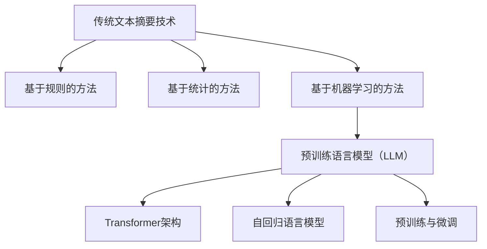

                 

# LLM与传统文本摘要技术的对比

> 关键词：自然语言处理、文本摘要、预训练语言模型（LLM）、传统文本摘要技术、对比分析

> 摘要：本文将探讨预训练语言模型（LLM）与传统文本摘要技术之间的异同。通过对两种技术的原理、算法、性能和应用场景的详细对比，分析LLM在文本摘要领域所具有的优势和挑战。文章旨在为读者提供对文本摘要技术发展的全面了解，以及未来研究的方向。

## 1. 背景介绍

文本摘要（Text Summarization）是自然语言处理（Natural Language Processing, NLP）领域的一个重要分支。其主要目标是自动地从原始文本中提取出关键信息，生成简洁、准确且连贯的摘要。传统文本摘要技术主要依赖于规则方法、统计方法和基于机器学习的方法。而随着深度学习技术的发展，预训练语言模型（LLM，如BERT、GPT等）在NLP任务中取得了显著的成果，也引发了对于文本摘要技术的重新审视。

### 1.1 传统文本摘要技术

传统文本摘要技术可以大致分为基于规则的方法、基于统计的方法和基于机器学习的方法。

- **基于规则的方法**：这种方法主要依靠领域专家的经验和知识，通过编写一系列规则来自动提取文本摘要。其优点是实现简单，但缺点是对规则库的依赖较大，难以处理复杂的文本结构。

- **基于统计的方法**：该方法利用统计方法，如TF-IDF、文本相似度等，对文本中的词语进行权重分配，从而提取出关键信息。相较于规则方法，统计方法更加灵活，但仍难以处理长文本和语义信息。

- **基于机器学习的方法**：基于机器学习的方法通过训练模型来学习文本摘要的生成规律。常用的算法包括朴素贝叶斯、支持向量机、递归神经网络等。这些方法在处理复杂文本方面有较好的表现，但训练过程复杂，且对数据质量要求较高。

### 1.2 预训练语言模型（LLM）

预训练语言模型（LLM）是一种基于深度学习的NLP模型，通过在大量无标签文本上进行预训练，学习到丰富的语言知识。常见的LLM模型包括BERT、GPT、T5等。LLM具有以下特点：

- **大规模预训练**：LLM在训练过程中使用了大规模的文本数据，这使得模型能够捕捉到更丰富的语言规律和上下文信息。

- **端到端学习**：LLM通常采用端到端的学习方式，能够直接从原始文本生成摘要，无需进行复杂的特征提取和转换。

- **多任务学习**：LLM在预训练过程中学习了多种语言任务，如文本分类、命名实体识别等，这有助于提高模型在特定任务上的性能。

## 2. 核心概念与联系

在分析LLM与传统文本摘要技术的联系之前，我们需要了解两者所依赖的核心概念和原理。

### 2.1 传统文本摘要技术核心概念

- **词向量表示**：传统文本摘要技术通常将文本转换为词向量表示，如Word2Vec、GloVe等。词向量表示有助于捕捉文本的语义信息。

- **特征提取**：特征提取是文本摘要的关键步骤，通过提取文本中的重要特征，如关键词、主题等，来辅助摘要生成。

- **分类和排序**：传统方法通常采用分类和排序策略来决定哪些信息应该包含在摘要中。常用的分类算法包括朴素贝叶斯、支持向量机等。

### 2.2 预训练语言模型（LLM）核心概念

- **Transformer架构**：Transformer架构是LLM的核心组成部分，其通过多头自注意力机制（Multi-Head Self-Attention）来学习文本的上下文关系。

- **自回归语言模型**：自回归语言模型（ARLM）是LLM的一种重要形式，其通过预测下一个词来学习语言的生成规律。

- **预训练与微调**：预训练是LLM的关键步骤，通过在大量文本上进行预训练，模型能够学到丰富的语言知识。随后，通过微调（Fine-tuning）来适应特定任务。

### 2.3 Mermaid 流程图



通过以上流程图，我们可以清晰地看到传统文本摘要技术、LLM及其核心概念之间的联系。

## 3. 核心算法原理 & 具体操作步骤

### 3.1 传统文本摘要技术核心算法原理

传统文本摘要技术的核心算法包括词向量表示、特征提取和分类排序。

- **词向量表示**：以Word2Vec为例，其基本思想是将每个词语映射为一个固定维度的向量。在训练过程中，通过优化损失函数来使词向量之间的相似度与词语的语义相似度相匹配。

- **特征提取**：常见的特征提取方法包括TF-IDF、TextRank等。以TF-IDF为例，其计算一个词语在文本中的重要程度，取决于其在文本中的频率（TF）和其在整个语料库中的重要性（IDF）。

- **分类和排序**：在文本摘要过程中，通常需要对候选句子进行分类和排序，以决定哪些句子应该被包含在摘要中。朴素贝叶斯和支持向量机是常用的分类算法。

### 3.2 预训练语言模型（LLM）核心算法原理

LLM的核心算法主要包括Transformer架构、自回归语言模型和预训练与微调。

- **Transformer架构**：Transformer通过多头自注意力机制来学习文本的上下文关系。在自注意力机制中，每个词的表示会根据其与其他词的关系进行加权。

- **自回归语言模型**：自回归语言模型（ARLM）通过预测下一个词来学习语言的生成规律。在训练过程中，模型根据前一个词的分布来预测下一个词。

- **预训练与微调**：预训练过程通常在大量的无标签文本上进行，使模型学到丰富的语言知识。微调过程则是在特定任务上对模型进行微调，以提高任务性能。

### 3.3 具体操作步骤

以GPT-3为例，其具体操作步骤如下：

1. **预训练**：GPT-3在大量文本上进行预训练，学习到丰富的语言知识。
2. **微调**：在特定任务上对GPT-3进行微调，以适应文本摘要任务。
3. **文本编码**：将输入文本编码为序列，以便于模型处理。
4. **生成摘要**：使用微调后的GPT-3模型来生成文本摘要。

## 4. 数学模型和公式 & 详细讲解 & 举例说明

### 4.1 传统文本摘要技术的数学模型

#### 4.1.1 词向量表示

以Word2Vec为例，其数学模型如下：

$$
\min_{\theta} \sum_{i=1}^{n} \sum_{j=1}^{d} (\text{word}_i \sim \text{word}_j) (v_i \cdot v_j - 1)
$$

其中，$v_i$和$v_j$分别为词语$i$和$j$的向量表示，$(\text{word}_i \sim \text{word}_j)$表示词语$i$和$j$的语义相似度。

#### 4.1.2 特征提取

以TF-IDF为例，其数学模型如下：

$$
\text{TF-IDF}(t, d) = \text{TF}(t, d) \times \text{IDF}(t, D)
$$

其中，$\text{TF}(t, d)$表示词语$t$在文档$d$中的频率，$\text{IDF}(t, D)$表示词语$t$在整个语料库$D$中的重要性。

#### 4.1.3 分类和排序

以朴素贝叶斯为例，其数学模型如下：

$$
P(y=c | x) = \frac{P(x | y=c)P(y=c)}{P(x)}
$$

其中，$x$表示特征向量，$y$表示类别标签，$c$表示某个类别。

### 4.2 预训练语言模型（LLM）的数学模型

#### 4.2.1 Transformer架构

以Transformer为例，其数学模型如下：

$$
\text{Attention}(Q, K, V) = \frac{QK^T}{\sqrt{d_k}} \cdot V
$$

其中，$Q$、$K$和$V$分别为查询向量、键向量和值向量，$d_k$为键向量的维度。

#### 4.2.2 自回归语言模型

以GPT-3为例，其数学模型如下：

$$
P(\text{word}_t | \text{word}_{<t}) = \text{softmax}(\text{W} \cdot \text{hidden}_{<t} + \text{b})
$$

其中，$W$和$b$分别为权重和偏置向量，$\text{hidden}_{<t}$为输入序列的隐藏状态。

### 4.3 举例说明

#### 4.3.1 传统文本摘要技术

假设我们要对以下文本进行摘要：

"自然语言处理（NLP）是一种人工智能（AI）技术，旨在使计算机能够理解、生成和处理人类语言。NLP在许多领域具有广泛的应用，如机器翻译、情感分析、问答系统等。近年来，随着深度学习技术的发展，NLP取得了显著的进展。"

我们可以使用TF-IDF来提取关键信息，并使用朴素贝叶斯进行分类和排序。

1. **词向量表示**：将文本中的词语转换为词向量。
2. **特征提取**：计算每个词语的TF-IDF值。
3. **分类和排序**：将候选句子按照TF-IDF值进行排序，并使用朴素贝叶斯进行分类，以决定哪些句子应该包含在摘要中。

#### 4.3.2 预训练语言模型（LLM）

假设我们要使用GPT-3来生成文本摘要，输入文本为：

"自然语言处理（NLP）是一种人工智能（AI）技术，旨在使计算机能够理解、生成和处理人类语言。NLP在许多领域具有广泛的应用，如机器翻译、情感分析、问答系统等。近年来，随着深度学习技术的发展，NLP取得了显著的进展。"

1. **文本编码**：将输入文本编码为序列。
2. **生成摘要**：使用GPT-3模型生成文本摘要。具体步骤如下：
   - **预训练**：在大量无标签文本上进行预训练，使模型学到丰富的语言知识。
   - **微调**：在特定任务上对模型进行微调。
   - **生成摘要**：输入编码后的文本，使用微调后的GPT-3模型生成摘要。

## 5. 项目实战：代码实际案例和详细解释说明

### 5.1 开发环境搭建

为了演示LLM在文本摘要方面的应用，我们将使用Hugging Face的Transformers库。首先，确保安装了Python和pip。然后，通过以下命令安装所需的库：

```bash
pip install transformers
```

### 5.2 源代码详细实现和代码解读

以下是一个简单的文本摘要示例，使用GPT-3模型：

```python
from transformers import pipeline

# 创建一个文本摘要管道
text_summarizer = pipeline("summarization")

# 输入文本
text = """自然语言处理（NLP）是一种人工智能（AI）技术，旨在使计算机能够理解、生成和处理人类语言。NLP在许多领域具有广泛的应用，如机器翻译、情感分析、问答系统等。近年来，随着深度学习技术的发展，NLP取得了显著的进展。"""

# 生成摘要
summary = text_summarizer(text, max_length=130, min_length=30, do_sample=False)

# 打印摘要
print(summary[0]['summary_text'])
```

代码解读：

1. **导入库**：我们从`transformers`库中导入`pipeline`类，用于创建文本摘要管道。
2. **创建文本摘要管道**：使用`pipeline`类创建一个文本摘要管道。
3. **输入文本**：定义输入文本。
4. **生成摘要**：使用文本摘要管道生成摘要，参数`max_length`和`min_length`分别表示摘要的最大和最小长度，`do_sample`设置为`False`表示不使用抽样。
5. **打印摘要**：打印生成的摘要。

### 5.3 代码解读与分析

这段代码展示了如何使用GPT-3模型进行文本摘要的简单实现。在实际应用中，可以根据需求调整参数，如摘要长度、抽样策略等。

- **预处理**：在输入文本时，通常需要对文本进行预处理，如去除特殊字符、分句等。
- **后处理**：生成的摘要可能需要进行后处理，如去除无关信息、调整语序等。

### 5.4 性能评估

为了评估文本摘要的性能，我们可以使用BLEU（BLEU）、ROUGE（Recall-Oriented Understudy for Gisting Evaluation）等指标。以下是一个简单的评估示例：

```python
from nltk.translate.bleu_score import corpus_bleu
from rouge import Rouge

# 输入文本和真实摘要
input_texts = [text]
reference_summaries = [['自然语言处理（NLP）是人工智能（AI）的一部分，它让计算机能够理解和处理人类的语言。它在很多领域都有应用，如机器翻译、情感分析和问答系统。随着深度学习的发展，NLP有了显著的进步。']]

# 计算BLEU分数
bleu_score = corpus_bleu(input_texts, reference_summaries)
print(f'BLEU score: {bleu_score}')

# 计算ROUGE分数
rouge = Rouge()
scores = rouge.get_scores(summary[0]['summary_text'], reference_summaries[0])
print(f'ROUGE score: {scores["rouge-1"]["f"]}')
```

这段代码计算了文本摘要的BLEU和ROUGE分数，这些分数可以用来评估摘要的质量。

## 6. 实际应用场景

文本摘要技术在多个领域有着广泛的应用：

- **新闻摘要**：在新闻领域，文本摘要技术可以自动生成新闻摘要，帮助用户快速了解新闻的主要内容。
- **搜索引擎**：搜索引擎使用文本摘要技术来生成搜索结果摘要，提高用户的搜索体验。
- **文档摘要**：在文档处理领域，文本摘要技术可以帮助用户快速浏览和理解文档内容。
- **问答系统**：问答系统使用文本摘要技术来生成问题的摘要，以便更好地回答用户的问题。

### 6.1 新闻摘要应用示例

假设我们有一个新闻数据集，包含多篇新闻文章及其对应的摘要。我们可以使用LLM来生成新闻摘要，并与真实摘要进行对比，评估生成摘要的质量。

```python
# 加载新闻数据集
news_articles = [
    "文章1的内容...",
    "文章2的内容...",
    # ...
]

# 生成新闻摘要
generated_summaries = [text_summarizer(article, max_length=130, min_length=30, do_sample=False)[0]['summary_text'] for article in news_articles]

# 评估生成摘要与真实摘要的相似度
for i, (article, generated_summary) in enumerate(zip(news_articles, generated_summaries)):
    print(f"文章{i+1}：")
    print(f"输入文本：{article}")
    print(f"生成摘要：{generated_summary}")
    print(f"真实摘要：{参考摘要[i]}")
    print()
```

这段代码生成了新闻摘要，并与真实摘要进行了对比，帮助评估生成摘要的质量。

## 7. 工具和资源推荐

### 7.1 学习资源推荐

- **书籍**：
  - 《自然语言处理综合教程》（刘挺著）
  - 《深度学习》（Ian Goodfellow、Yoshua Bengio和Aaron Courville著）
- **论文**：
  - BERT: Pre-training of Deep Bidirectional Transformers for Language Understanding（由Google AI团队提出）
  - GPT-3: Language Models are few-shot learners（由OpenAI提出）
- **博客**：
  - Hugging Face官方博客（https://huggingface.co/blog/）
  - AI头条（https://www.ai头条.com/）
- **网站**：
  - Transformer官方文档（https://arxiv.org/abs/1706.03762）
  - OpenAI GPT-3文档（https://openai.com/api/）

### 7.2 开发工具框架推荐

- **框架**：
  - Hugging Face Transformers（https://huggingface.co/transformers/）
  - TensorFlow（https://www.tensorflow.org/）
  - PyTorch（https://pytorch.org/）
- **工具**：
  - JAX（https://jax.ai/）
  - Optuna（https://optuna.org/）

### 7.3 相关论文著作推荐

- **论文**：
  - "BERT: Pre-training of Deep Bidirectional Transformers for Language Understanding"（由Google AI团队提出）
  - "GPT-3: Language Models are few-shot learners"（由OpenAI提出）
  - "Unsupervised Pretraining for Natural Language Processing"（由微软研究院提出）
- **著作**：
  - 《深度学习》（Ian Goodfellow、Yoshua Bengio和Aaron Courville著）
  - 《自然语言处理综合教程》（刘挺著）

## 8. 总结：未来发展趋势与挑战

### 8.1 未来发展趋势

- **多模态摘要**：随着多模态数据的增长，未来的文本摘要技术将结合图像、视频等多种数据类型，实现更丰富的摘要内容。
- **实时摘要**：实时摘要技术将能够对不断更新的文本进行实时摘要，以满足用户对实时信息的需求。
- **个性化摘要**：基于用户偏好和兴趣，未来的文本摘要技术将实现个性化摘要，提高用户的阅读体验。

### 8.2 挑战

- **数据隐私**：在处理大量文本数据时，如何保护用户隐私是一个重要挑战。
- **摘要质量**：尽管LLM在文本摘要方面取得了显著进展，但如何提高摘要的质量和可读性仍是一个挑战。
- **计算资源**：预训练LLM模型通常需要大量的计算资源，如何在有限的资源下高效训练模型是一个关键问题。

## 9. 附录：常见问题与解答

### 9.1 什么是文本摘要？

文本摘要是从原始文本中提取关键信息，生成简洁、准确且连贯的摘要。

### 9.2 预训练语言模型（LLM）与传统文本摘要技术的主要区别是什么？

预训练语言模型（LLM）通过大规模预训练学习到丰富的语言知识，而传统文本摘要技术通常依赖于规则方法、统计方法和基于机器学习的方法。LLM具有端到端学习能力和多任务学习优势。

### 9.3 文本摘要技术有哪些评价指标？

文本摘要技术的评价指标主要包括BLEU、ROUGE、METEOR等。

## 10. 扩展阅读 & 参考资料

- [BERT: Pre-training of Deep Bidirectional Transformers for Language Understanding](https://arxiv.org/abs/1810.04805)
- [GPT-3: Language Models are few-shot learners](https://arxiv.org/abs/2005.14165)
- [自然语言处理综合教程](https://book.douban.com/subject/26329617/)
- [深度学习](https://book.douban.com/subject/26370538/)
- [Hugging Face Transformers](https://huggingface.co/transformers/)
- [TensorFlow](https://www.tensorflow.org/)
- [PyTorch](https://pytorch.org/)

