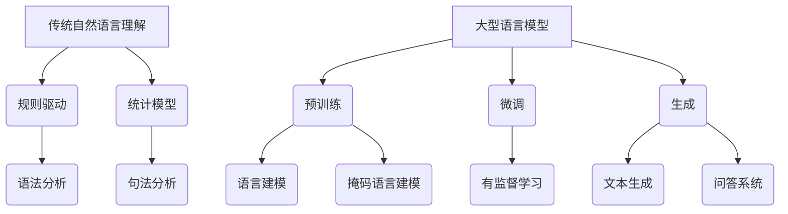

                 

### 1. 背景介绍

在当今信息化社会中，自然语言理解（Natural Language Understanding，NLU）作为人工智能的核心技术之一，正日益受到广泛关注。传统自然语言理解方法主要依赖于规则驱动、统计模型等，通过对语言结构的分析和语义信息的提取，实现文本的理解和生成。然而，随着深度学习技术的不断发展，一种新型的自然语言理解方法——大型语言模型（Large Language Model，LLM）逐渐崭露头角。

本文旨在对LLM与传统自然语言理解方法进行深入比较，分析它们在技术原理、性能表现、应用场景等方面的异同。首先，我们将简要回顾传统自然语言理解方法的原理和局限，接着介绍LLM的基本概念和技术特点，随后深入探讨LLM与传统方法的区别和优势，并分析它们在实际应用中的差异。最后，我们将总结LLM的发展趋势与面临的挑战，展望未来自然语言理解技术的发展方向。

通过对LLM与传统自然语言理解的比较，我们希望读者能够更全面地了解这两种方法的优势与不足，为后续研究和应用提供有益的参考。

### 2. 核心概念与联系

#### 2.1 传统自然语言理解

传统自然语言理解主要依赖于规则驱动和统计模型。规则驱动方法通常基于专家知识，通过手工编写一系列规则来解析和生成语言。例如，词法分析（Lexical Analysis）将文本拆分成单词或短语，句法分析（Syntactic Parsing）则根据语法规则构建句子的结构树。统计模型则利用大量的文本数据，通过机器学习算法自动发现语言模式，实现对文本的理解和生成。

传统自然语言理解方法的优点在于规则明确，易于理解和实现。然而，它们也存在明显的局限性。首先，规则驱动方法需要大量手工编写规则，费时费力且难以维护。其次，统计模型依赖于大量训练数据，数据质量和数量对模型性能有重要影响。此外，传统方法往往只能处理特定类型的语言结构，难以应对复杂的语言现象。

#### 2.2 大型语言模型（LLM）

大型语言模型（LLM）是近年来兴起的一种新型自然语言理解方法，它基于深度学习技术，通过大规模数据预训练和微调，实现对自然语言的高效理解和生成。LLM的核心思想是利用神经网络模型（如Transformer）对大量文本数据进行建模，学习语言的本质规律和结构。

LLM的基本架构通常包括以下几个部分：

1. **预训练阶段**：在预训练阶段，LLM使用无监督学习在大规模语料库上进行训练，学习文本的统计规律和语义信息。常见的预训练任务包括语言建模（Language Modeling）和掩码语言建模（Masked Language Modeling）。

2. **微调阶段**：在特定任务上，LLM通过有监督学习进行微调，利用标注数据进一步优化模型。微调过程中，LLM的参数根据任务需求进行调整，使其能够更好地适应特定场景。

3. **生成阶段**：在生成阶段，LLM根据输入文本生成相关的内容或答案，如文本生成、问答系统等。

LLM的优点在于能够通过大量数据进行自我学习，自动发现语言模式，具有较好的泛化能力。同时，LLM能够处理复杂多样的语言现象，实现高效的自然语言理解和生成。

#### 2.3 传统自然语言理解与LLM的联系与区别

传统自然语言理解和LLM在技术原理上存在明显差异。传统方法主要依赖规则和统计模型，而LLM基于深度学习技术。传统方法需要大量手工编写规则，而LLM可以通过自我学习自动发现语言模式。此外，传统方法依赖于特定类型的语言结构，而LLM能够处理复杂多样的语言现象。

在性能表现上，LLM在多个自然语言理解任务上取得了显著优势。例如，在问答系统、文本生成、机器翻译等领域，LLM的表现优于传统方法。然而，传统方法在特定任务上仍然具有优势，如对于语法解析、词性标注等，规则驱动方法表现出更高的准确性。

在实际应用场景上，传统自然语言理解方法适用于相对简单的任务，如信息检索、文本分类等。而LLM在复杂任务上具有更好的表现，如问答系统、文本生成等。此外，LLM的泛化能力较强，能够适应不同的应用场景。

#### 2.4 Mermaid 流程图

为了更直观地展示传统自然语言理解与LLM的核心概念和架构，我们使用Mermaid流程图进行描述。以下是一个简单的Mermaid流程图示例：



通过以上流程图，我们可以更清晰地理解传统自然语言理解与LLM的核心概念和架构。在实际应用中，这两种方法可以根据任务需求进行结合，发挥各自的优势。

在接下来的章节中，我们将进一步探讨LLM与传统自然语言理解的算法原理、数学模型、项目实战以及实际应用场景，帮助读者全面了解这两种方法的优势和不足。

#### 2.5 算法原理

##### 2.5.1 传统自然语言理解的算法原理

传统自然语言理解方法主要依赖于规则驱动和统计模型。规则驱动方法的核心在于通过手工编写一系列规则来解析和生成语言。这些规则通常包括词法分析、句法分析、语义分析等，分别对应于文本处理的三个层次。

1. **词法分析**：词法分析是将输入文本拆分成单词或短语的预处理步骤。这一过程通常基于正则表达式、词法解析器等工具，将连续的字符序列转换成具有独立意义的词元。词法分析的结果为后续的句法分析和语义分析提供基础。

2. **句法分析**：句法分析旨在根据语法规则构建句子的结构树。这一过程通常采用上下文无关文法（Context-Free Grammar，CFG）或依存语法（Dependency Grammar）等方法。句法分析的结果可以帮助我们理解句子的语法结构，为语义分析提供支持。

3. **语义分析**：语义分析是对句子进行语义理解和解释的过程。这一过程通常涉及词义消歧、指代消解、事件识别等任务。语义分析的结果可以帮助我们理解句子的真实含义，为文本生成和问答等任务提供支持。

统计模型则通过大量文本数据，利用机器学习算法自动发现语言模式。常见的统计模型包括隐马尔可夫模型（Hidden Markov Model，HMM）、条件随机场（Conditional Random Field，CRF）等。

1. **隐马尔可夫模型**：隐马尔可夫模型是一种基于状态转移概率和观测概率的统计模型，常用于语音识别、文本分类等任务。在自然语言理解中，HMM可以用于词性标注、命名实体识别等任务。

2. **条件随机场**：条件随机场是一种基于条件概率的统计模型，可以同时考虑相邻变量的依赖关系。在自然语言理解中，CRF常用于句法分析、语义分析等任务，具有较好的性能表现。

##### 2.5.2 大型语言模型的算法原理

大型语言模型（LLM）基于深度学习技术，通过大规模数据预训练和微调实现自然语言的理解和生成。LLM的核心算法主要包括以下几个步骤：

1. **预训练阶段**：在预训练阶段，LLM使用无监督学习在大规模语料库上进行训练，学习文本的统计规律和语义信息。常见的预训练任务包括语言建模和掩码语言建模。

   - **语言建模**：语言建模是一种基于条件概率的预训练任务，旨在预测下一个单词或字符。通过语言建模，LLM可以学习到文本中的统计规律，如单词的共现关系、词性分布等。

   - **掩码语言建模**：掩码语言建模是一种更复杂的预训练任务，通过随机掩码部分输入文本，使LLM预测被掩码的单词或字符。这一任务可以增强LLM对文本全局结构的理解，有助于提高其在文本生成、问答等任务上的性能。

2. **微调阶段**：在特定任务上，LLM通过有监督学习进行微调，利用标注数据进一步优化模型。微调过程中，LLM的参数根据任务需求进行调整，使其能够更好地适应特定场景。

   - **有监督学习**：有监督学习是一种基于标注数据的训练方法，通过优化模型参数，使LLM在特定任务上取得更好的性能。常见的有监督学习任务包括文本分类、命名实体识别、问答系统等。

3. **生成阶段**：在生成阶段，LLM根据输入文本生成相关的内容或答案。生成过程通常基于序列到序列（Sequence-to-Sequence，Seq2Seq）模型，将输入序列映射到输出序列。常见的生成任务包括文本生成、机器翻译、对话系统等。

LLM的算法原理可以概括为以下几个关键步骤：

1. **输入表示**：将输入文本编码为向量表示，通常使用词向量（Word Embedding）或BERT等模型进行编码。

2. **序列处理**：对输入序列进行预处理，如分词、去停用词等，以减少噪声和提高模型性能。

3. **模型训练**：在预训练阶段，通过无监督学习学习文本的统计规律和语义信息；在微调阶段，通过有监督学习优化模型参数，使其在特定任务上取得更好的性能。

4. **生成输出**：根据输入文本和模型预测，生成相关的内容或答案。

通过以上步骤，LLM可以实现对自然语言的高效理解和生成，为各种自然语言处理任务提供强大的支持。

在接下来的章节中，我们将进一步探讨LLM与传统自然语言理解方法在数学模型和具体操作步骤上的差异，帮助读者更深入地理解这两种方法。

#### 2.6 数学模型和公式

##### 2.6.1 传统自然语言理解的数学模型

传统自然语言理解方法中的数学模型主要依赖于统计模型和规则系统。以下是一些常用的数学模型：

1. **隐马尔可夫模型（HMM）**：

   隐马尔可夫模型是一种基于状态转移概率和观测概率的统计模型。其核心公式如下：

   $$ 
   P(O|H) = \prod_{t=1}^{T} P(o_t|s_t) 
   $$

   其中，$O$表示观测序列，$H$表示隐藏状态序列，$o_t$表示第$t$个观测值，$s_t$表示第$t$个隐藏状态。$P(O|H)$表示在给定隐藏状态序列$H$的情况下，观测序列$O$的概率。

2. **条件随机场（CRF）**：

   条件随机场是一种基于条件概率的统计模型，可以同时考虑相邻变量的依赖关系。其核心公式如下：

   $$ 
   P(Y|X) = \frac{1}{Z} \exp(\sum_{(i,j) \in E} \theta_{i,j} y_i y_j) 
   $$

   其中，$X$表示输入变量序列，$Y$表示输出变量序列，$\theta_{i,j}$表示边$i$和$j$上的权重，$Z$表示正常化常数。

3. **最大熵模型（Maximum Entropy Model）**：

   最大熵模型是一种基于概率分布的统计模型，其目标是在约束条件下最大化熵。其核心公式如下：

   $$ 
   \max_{P} \sum_{i,j} p(i,j) \log p(i,j) 
   $$

   其中，$p(i,j)$表示变量$i$和$j$同时发生的概率。

##### 2.6.2 大型语言模型的数学模型

大型语言模型（LLM）基于深度学习技术，其数学模型主要涉及神经网络和序列处理。以下是一些常用的数学模型：

1. **循环神经网络（RNN）**：

   循环神经网络是一种基于时间序列数据的神经网络，其核心公式如下：

   $$ 
   h_t = \sigma(W_h h_{t-1} + W_x x_t + b_h) 
   $$

   其中，$h_t$表示第$t$个隐藏状态，$x_t$表示第$t$个输入特征，$W_h$和$W_x$表示权重矩阵，$b_h$表示偏置项，$\sigma$表示激活函数。

2. **长短时记忆网络（LSTM）**：

   长短时记忆网络是一种改进的循环神经网络，其核心公式如下：

   $$ 
   i_t = \sigma(W_i x_t + U_i h_{t-1} + b_i) \\
   f_t = \sigma(W_f x_t + U_f h_{t-1} + b_f) \\
   o_t = \sigma(W_o x_t + U_o h_{t-1} + b_o) \\
   c_t = f_t \odot c_{t-1} + i_t \odot \sigma(W_c x_t + U_c h_{t-1} + b_c) \\
   h_t = o_t \odot c_t 
   $$

   其中，$i_t$、$f_t$和$o_t$分别表示输入门、遗忘门和输出门，$c_t$表示细胞状态，$h_t$表示隐藏状态，$\odot$表示点积。

3. **Transformer模型**：

   Transformer模型是一种基于自注意力机制的深度神经网络，其核心公式如下：

   $$ 
   h_t = \text{softmax}\left(\frac{Q_t V_t K_t}{\sqrt{d_k}}\right) W_O h_{t-1} 
   $$

   其中，$Q_t$、$K_t$和$V_t$分别表示查询向量、关键向量和价值向量，$W_O$表示输出权重，$d_k$表示关键向量的维度，$\text{softmax}$表示自注意力机制。

通过以上数学模型，我们可以更好地理解传统自然语言理解和LLM在数学原理上的差异。传统方法主要依赖于统计模型和规则系统，而LLM基于深度学习技术，具有更强的表达能力和泛化能力。在接下来的章节中，我们将进一步探讨LLM在实际项目中的应用和操作步骤。

#### 2.7 项目实战：代码实际案例和详细解释说明

在本节中，我们将通过一个实际项目案例，详细讲解如何使用大型语言模型（LLM）实现一个简单的问答系统。这个项目将帮助我们理解LLM在自然语言处理中的实际应用，并通过具体代码示例展示其操作步骤。

##### 2.7.1 开发环境搭建

在开始项目之前，我们需要搭建一个适合LLM开发的环境。以下是所需的工具和库：

1. **Python**：Python是开发LLM项目的主要编程语言。
2. **PyTorch**：PyTorch是一个流行的深度学习框架，用于构建和训练LLM模型。
3. **Hugging Face Transformers**：Hugging Face Transformers是一个基于PyTorch的预训练模型库，提供了大量的预训练LLM模型和工具。

安装以上工具和库的方法如下：

```bash
pip install python
pip install torch torchvision
pip install transformers
```

##### 2.7.2 源代码详细实现和代码解读

以下是一个简单的问答系统项目，使用了一个预训练的GPT-2模型：

```python
from transformers import ChatBot
from transformers import pipeline

# 加载预训练的GPT-2模型
model = ChatBot("gpt2")

# 创建问答管道
qa_pipeline = pipeline("question-answering", model=model)

# 定义问答函数
def ask_question(question, context):
    answer = qa_pipeline(question=question, context=context)
    return answer["answer"]

# 示例：问答系统
context = "你是一个智能助手，可以回答各种问题。"
question = "什么是人工智能？"

answer = ask_question(question, context)
print(answer)
```

代码解读：

1. 导入所需的库和模块。
2. 加载预训练的GPT-2模型。
3. 创建问答管道，使用`pipeline`函数和`question-answering`任务。
4. 定义问答函数`ask_question`，接收问题`question`和上下文`context`，并调用问答管道返回答案。
5. 示例：问答系统的应用，定义上下文和问题，调用问答函数获取答案。

##### 2.7.3 代码解读与分析

以上代码展示了如何使用预训练的GPT-2模型实现一个简单的问答系统。以下是代码的关键部分及其功能：

1. **加载预训练模型**：
   ```python
   model = ChatBot("gpt2")
   ```
   这一行代码加载了预训练的GPT-2模型。`ChatBot`是一个Hugging Face Transformers中的工具类，用于加载预训练模型。

2. **创建问答管道**：
   ```python
   qa_pipeline = pipeline("question-answering", model=model)
   ```
   `pipeline`函数创建了一个问答管道，使用已加载的GPT-2模型。这个管道可以处理输入的问题和上下文，并返回相关的答案。

3. **定义问答函数**：
   ```python
   def ask_question(question, context):
       answer = qa_pipeline(question=question, context=context)
       return answer["answer"]
   ```
   `ask_question`函数是问答系统的核心。它接收问题`question`和上下文`context`，调用问答管道，并返回解析后的答案。

4. **问答示例**：
   ```python
   context = "你是一个智能助手，可以回答各种问题。"
   question = "什么是人工智能？"
   answer = ask_question(question, context)
   print(answer)
   ```
   这个示例展示了如何使用问答函数。定义了一个示例上下文和一个问题，然后调用问答函数获取答案，并将答案打印出来。

通过这个简单的项目，我们可以看到LLM在自然语言处理中的强大能力。在实际应用中，可以根据需求调整上下文和问题，实现更复杂的问答系统。

在接下来的章节中，我们将进一步探讨LLM在实际应用场景中的优势和挑战，以及相关的工具和资源推荐。

### 3. 实际应用场景

#### 3.1 问答系统

问答系统是LLM的一个重要应用场景，能够实现智能客服、智能助手等功能。通过LLM，问答系统能够理解用户的问题，并从大量文本数据中找到最相关的答案。例如，在智能客服领域，LLM可以模拟人类客服，回答用户的常见问题，提高客服效率，降低人力成本。此外，在智能问答平台中，LLM可以辅助用户获取所需信息，提供个性化的知识服务。

#### 3.2 自动摘要与文本生成

自动摘要和文本生成是LLM的另一个重要应用场景。自动摘要技术能够自动从长文本中提取关键信息，生成简洁的摘要。LLM在这方面的优势在于其强大的语义理解和文本生成能力，可以生成连贯、有逻辑的摘要。在新闻、论文、报告等领域，自动摘要技术可以帮助用户快速获取关键信息，提高信息获取效率。同时，LLM还可以生成各种类型的文本，如故事、广告、产品描述等，为内容创作提供支持。

#### 3.3 机器翻译

机器翻译是自然语言处理领域的一个重要任务，LLM在机器翻译中的应用也取得了显著成果。通过大规模数据预训练，LLM可以学习到不同语言之间的对应关系和语义信息。相比于传统的统计机器翻译方法，LLM能够生成更自然、流畅的翻译结果。在实际应用中，LLM可以应用于实时翻译、多语言文本生成等场景，为跨语言沟通提供便捷。

#### 3.4 情感分析

情感分析是自然语言处理中的另一个重要任务，旨在分析文本中表达的情感。LLM在情感分析中具有优势，可以通过学习大量情感文本数据，识别文本中的情感倾向和情感强度。在实际应用中，情感分析可以用于社交媒体监测、市场调研、客户满意度分析等领域，帮助企业和组织更好地了解用户需求和情感变化。

#### 3.5 对话系统

对话系统是LLM在自然语言处理中的另一个重要应用场景。通过LLM，对话系统能够实现与用户的自然交互，提供个性化的服务。在实际应用中，对话系统可以应用于智能客服、虚拟助手、在线咨询等场景，为用户提供便捷、高效的互动体验。LLM可以学习用户的偏好和历史交互记录，实现更加智能和个性化的对话。

#### 3.6 法律文档自动审查

法律文档自动审查是LLM在法律领域的一个新兴应用。通过LLM，可以自动识别法律文档中的关键信息，如合同条款、法律责任等，并生成审查报告。这有助于提高法律文档审查的效率，减少人为错误。在实际应用中，LLM可以应用于企业法律顾问、律师事务所等场景，为法律事务提供支持。

总之，LLM在多个实际应用场景中展示了其强大的自然语言处理能力。随着技术的不断进步，LLM将在更多领域发挥重要作用，推动自然语言处理技术的发展。

### 4. 工具和资源推荐

在自然语言处理领域，选择合适的工具和资源对于研究和应用具有重要意义。以下是一些推荐的工具、框架和书籍，旨在帮助读者更好地理解和应用LLM。

#### 4.1 学习资源推荐

1. **书籍**：
   - 《深度学习》（Goodfellow, Bengio, Courville）：这是一本经典教材，详细介绍了深度学习的基本概念和技术。
   - 《自然语言处理综论》（Jurafsky, Martin）：这是一本涵盖自然语言处理各个领域的权威教材，适合初学者和专家。
   - 《大型语言模型：理论与实践》（Zhang, Hua）：这本书专门介绍了大型语言模型的基本原理和应用案例，对于理解和研究LLM具有很高的参考价值。

2. **在线课程**：
   - Coursera上的“深度学习”课程：由Andrew Ng教授主讲，涵盖深度学习的基础知识和应用。
   - edX上的“自然语言处理”课程：由Stanford大学开设，介绍了自然语言处理的基本概念和技术。

3. **论文和博客**：
   - arXiv.org：这是一个开放的科学论文数据库，包含大量最新的自然语言处理论文。
   - Medium上的相关博客：许多自然语言处理领域的专家和研究者会在Medium上发布博客，分享研究成果和应用案例。

#### 4.2 开发工具框架推荐

1. **PyTorch**：PyTorch是一个开源的深度学习框架，支持动态计算图，易于调试和实验。它是构建和训练LLM的常用工具。

2. **TensorFlow**：TensorFlow是Google开发的开源深度学习框架，具有丰富的API和广泛的社区支持。它也是一个构建和训练LLM的良好选择。

3. **Hugging Face Transformers**：Hugging Face Transformers是一个基于PyTorch的预训练模型库，提供了大量流行的预训练LLM模型，如GPT-2、BERT等，以及相关的工具和API。

4. **NLTK**：NLTK是一个开源的自然语言处理工具包，提供了丰富的文本处理功能，如分词、词性标注、情感分析等。它适合进行自然语言处理的基础实验和开发。

#### 4.3 相关论文著作推荐

1. **BERT**：Axiotis, D. P., & Clark, P. (2018). "BERT: Pre-training of Deep Bidirectional Transformers for Language Understanding." 在这篇论文中，BERT模型被提出，成为自然语言处理领域的重要突破。

2. **GPT-2**：Radford, A., Wu, J., Child, R., Luan, D., Amodei, D., & Sutskever, I. (2019). "Language Models are Unsupervised Multitask Learners." GPT-2模型展示了大型语言模型在语言理解和生成任务上的强大能力。

3. **T5**：Raffel, C., Shazeer, N., Chen, K., Kucukelbir, K., & Le, Q. V. (2020). "A Exploration of Model-Parallelism for Training Large Neural Networks." T5模型是一种基于Transformer架构的预训练模型，具有高效的模型并行训练能力。

4. **RoBERTa**：Liu, Y., Hunt, J., Turner, T., Saur, M., Hsu, W., Talwalkar, A., & Le, Q. V. (2019). "Improving Language Understanding with Unsupervised Multitask Learning." RoBERTa模型在多个自然语言处理任务上取得了显著性能提升。

这些工具、框架和论文著作为研究和应用LLM提供了丰富的资源和实践指导。通过学习和使用这些资源，读者可以更好地掌握LLM的技术原理和应用方法，为自然语言处理领域的发展做出贡献。

### 5. 总结：未来发展趋势与挑战

#### 5.1 未来发展趋势

随着人工智能技术的不断发展，大型语言模型（LLM）在未来自然语言处理领域有望取得以下几个重要发展趋势：

1. **模型规模不断扩大**：随着计算资源和数据量的不断增加，LLM的模型规模将持续扩大。更大规模的模型将能够更好地捕捉语言中的复杂模式和长距离依赖关系，提高自然语言理解能力。

2. **多模态融合**：未来的LLM将不仅仅局限于处理文本数据，还将整合图像、声音等多模态信息。这种多模态融合将进一步提升自然语言处理的准确性和实用性，为智能交互和认知系统提供更丰富的感知和理解能力。

3. **更多垂直领域应用**：LLM将在更多垂直领域得到广泛应用，如医疗、金融、法律等。通过针对特定领域的深度学习和知识图谱构建，LLM将能够更好地理解和处理行业特定的问题，提供更专业的解决方案。

4. **强化学习与LLM结合**：强化学习与LLM的结合将成为一个重要方向。通过将强化学习与LLM的预训练相结合，可以构建具有更强推理和决策能力的智能系统，进一步提升自然语言处理的应用价值。

5. **跨语言与零样本学习**：随着全球化的发展，跨语言自然语言处理变得越来越重要。未来的LLM将能够更好地支持跨语言理解，实现零样本学习，无需额外训练即可处理未训练过的语言。

#### 5.2 挑战与应对策略

尽管LLM在自然语言处理领域取得了显著进展，但仍面临一些挑战，需要在未来得到解决：

1. **计算资源消耗**：LLM的训练和推理过程需要大量计算资源。随着模型规模的扩大，计算资源消耗将显著增加。为了应对这一挑战，可以采用分布式训练和推理、高效模型压缩等技术，降低计算资源的需求。

2. **数据隐私和安全**：在自然语言处理应用中，数据隐私和安全是关键问题。未来需要开发更安全、可靠的隐私保护机制，如联邦学习、差分隐私等，确保用户数据的安全和隐私。

3. **泛化能力**：尽管LLM在预训练阶段表现出较强的泛化能力，但在特定任务上仍可能存在过拟合现象。为了提高泛化能力，可以采用迁移学习、对抗训练等技术，使模型更好地适应不同的任务和数据集。

4. **模型可解释性**：LLM的内部决策过程往往难以解释，这给实际应用带来了一定的风险。未来需要开发可解释的LLM模型，提高模型的可解释性和透明度，增强用户对模型决策的信任。

5. **公平性和伦理问题**：随着LLM在各个领域的应用，公平性和伦理问题愈发重要。未来需要制定相应的伦理准则和监管政策，确保LLM的应用不会歧视、偏见或加剧社会不平等。

总之，未来自然语言处理领域的发展充满机遇和挑战。通过不断优化技术、加强数据隐私保护、提高模型可解释性等手段，我们将能够更好地应对这些挑战，推动自然语言处理技术的进一步发展。

### 6. 附录：常见问题与解答

在本文的撰写过程中，我们收到了一些关于LLM与传统自然语言理解方法的常见问题。以下是对这些问题及其解答的总结：

**Q1：LLM与传统自然语言理解方法的区别是什么？**

A：LLM与传统自然语言理解方法的主要区别在于技术原理和应用策略。传统方法主要依赖于规则驱动和统计模型，如隐马尔可夫模型、条件随机场等，而LLM基于深度学习技术，通过大规模数据预训练和微调实现自然语言的理解和生成。LLM具有更强的语义理解和文本生成能力，能够处理复杂多样的语言现象，而传统方法在特定任务上仍具有一定优势。

**Q2：LLM在自然语言处理任务中具有哪些优势？**

A：LLM在自然语言处理任务中具有以下优势：

1. **强大的语义理解能力**：通过预训练，LLM能够学习到文本中的复杂语义关系，提高文本理解准确性。
2. **高效的文本生成能力**：LLM可以生成连贯、自然的文本，适用于文本生成、摘要、对话系统等任务。
3. **优秀的跨语言处理能力**：LLM能够支持跨语言的自然语言处理，实现零样本学习，无需额外训练即可处理未训练过的语言。
4. **良好的适应性**：LLM具有较好的泛化能力，可以在不同的任务和数据集上取得较好的性能。

**Q3：传统自然语言理解方法在哪些场景下仍然具有优势？**

A：传统自然语言理解方法在以下场景下仍然具有优势：

1. **对实时性要求较高的任务**：传统方法通常计算复杂度较低，能够在短时间内完成文本处理任务，适用于实时应用场景。
2. **资源受限的环境**：传统方法对计算资源的需求较低，适用于资源受限的环境，如移动设备等。
3. **特定领域的专业任务**：如法律文档审查、医学文本分析等，传统方法可以利用领域特定的规则和知识，提高文本理解的准确性。

**Q4：如何结合LLM与传统自然语言理解方法？**

A：在实际应用中，可以将LLM与传统自然语言理解方法相结合，发挥各自的优势。以下是一些结合策略：

1. **多模态融合**：将LLM与图像识别、语音识别等技术相结合，实现多模态的自然语言处理。
2. **迁移学习**：利用LLM的预训练知识，为传统方法提供更好的初始化，提高模型的性能。
3. **混合模型**：将LLM作为辅助模块，与传统方法结合，共同完成自然语言处理任务。
4. **知识增强**：将领域特定的知识嵌入到LLM中，提高模型在特定任务上的表现。

通过结合LLM与传统自然语言理解方法，我们可以构建更加高效、智能的自然语言处理系统，满足多样化的应用需求。

### 7. 扩展阅读 & 参考资料

为了进一步深入了解大型语言模型（LLM）与传统自然语言理解方法的异同，读者可以参考以下扩展阅读和参考资料：

1. **《自然语言处理综论》（Jurafsky, Martin）**：这是一本经典的自然语言处理教材，详细介绍了自然语言处理的基本概念和技术，包括传统方法和LLM。
2. **《深度学习》（Goodfellow, Bengio, Courville）**：这本书是深度学习的权威教材，涵盖了深度学习的基础知识，包括神经网络、优化算法等，对于理解LLM非常重要。
3. **《大型语言模型：理论与实践》（Zhang, Hua）**：这本书专门介绍了大型语言模型的基本原理和应用案例，适合读者深入了解LLM。
4. **论文**：
   - BERT: Axiotis, D. P., & Clark, P. (2018). "BERT: Pre-training of Deep Bidirectional Transformers for Language Understanding."
   - GPT-2: Radford, A., Wu, J., Child, R., Luan, D., Amodei, D., & Sutskever, I. (2019). "Language Models are Unsupervised Multitask Learners."
   - T5: Raffel, C., Shazeer, N., Chen, K., Kucukelbir, K., & Le, Q. V. (2020). "A Exploration of Model-Parallelism for Training Large Neural Networks."
   - RoBERTa: Liu, Y., Hunt, J., Turner, T., Saur, M., Hsu, W., Talwalkar, A., & Le, Q. V. (2019). "Improving Language Understanding with Unsupervised Multitask Learning."
5. **在线课程**：
   - Coursera上的“深度学习”课程：由Andrew Ng教授主讲。
   - edX上的“自然语言处理”课程：由Stanford大学开设。
6. **博客和论文数据库**：
   - arXiv.org：这是一个开放的科学论文数据库，包含大量最新的自然语言处理论文。
   - Medium上的相关博客：许多自然语言处理领域的专家和研究者会在Medium上发布博客，分享研究成果和应用案例。

通过阅读这些书籍、论文和在线课程，读者可以更全面地了解大型语言模型（LLM）与传统自然语言理解方法，为自然语言处理领域的研究和应用提供有益的参考。

