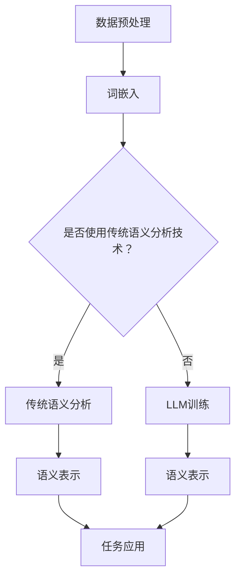

                 

# LLM与传统语义分析技术的融合：语言理解新高度

> **关键词**：自然语言处理（NLP）、语言模型（LLM）、传统语义分析、融合技术、语言理解、深度学习、人工智能。

> **摘要**：本文将探讨大型语言模型（LLM）与传统语义分析技术的融合，分析其在语言理解方面的优势和应用。我们将从背景介绍、核心概念与联系、核心算法原理、数学模型与公式、项目实战、实际应用场景等多个方面展开，旨在为读者呈现一个全面、深入的LLM与语义分析融合的技术全景。

## 1. 背景介绍

在当今社会，信息爆炸式增长，人们对信息处理的效率和质量提出了更高的要求。自然语言处理（NLP）作为人工智能的重要分支，旨在实现人与机器之间的自然语言交互。语义分析是NLP的核心任务之一，其主要目标是理解语言的意义和语境。

传统语义分析技术主要包括词法分析、句法分析、语义角色标注、语义解析等。这些技术在一定程度上能够实现文本的理解，但存在诸多局限性，如对语言理解能力的限制、对复杂语义场景的难以处理等。

近年来，深度学习技术的发展为自然语言处理带来了新的机遇。大型语言模型（LLM），如GPT、BERT等，通过海量的文本数据进行训练，能够实现高效的语义理解。然而，传统语义分析技术在这方面的应用仍具有一定的局限性。

本文将探讨LLM与传统语义分析技术的融合，通过结合两者的优势，实现语言理解的新高度。具体来说，我们将从以下几个方面展开：

1. 核心概念与联系
2. 核心算法原理与具体操作步骤
3. 数学模型与公式
4. 项目实战
5. 实际应用场景
6. 工具和资源推荐
7. 总结：未来发展趋势与挑战

## 2. 核心概念与联系

### 2.1. 语言模型（LLM）

语言模型（Language Model，简称LLM）是一种基于深度学习的模型，用于预测文本序列的概率分布。LLM通过学习大量的文本数据，掌握语言的统计规律和上下文关系，从而实现对未知文本的生成和预测。

LLM的主要特点包括：

1. **强大的语言表达能力**：LLM能够生成符合语法规则、语义连贯的文本。
2. **上下文敏感性**：LLM能够根据上下文信息进行自适应调整，提高文本生成的准确性。
3. **泛化能力**：LLM能够处理不同领域和风格的文本，具有较强的泛化能力。

### 2.2. 传统语义分析技术

传统语义分析技术主要包括词法分析、句法分析、语义角色标注、语义解析等。

1. **词法分析（Lexical Analysis）**：将文本分解为单词、短语等基本语言单位，为其赋予相应的语义信息。
2. **句法分析（Syntactic Analysis）**：分析文本的语法结构，识别句子中的主语、谓语、宾语等成分。
3. **语义角色标注（Semantic Role Labeling）**：为句子中的词汇赋予特定的语义角色，如动作执行者、受动者、工具等。
4. **语义解析（Semantic Parsing）**：将自然语言文本转换为结构化的语义表示，如逻辑表达式、数据库查询等。

### 2.3. LLM与传统语义分析技术的联系

LLM与传统语义分析技术之间存在一定的联系和互补性：

1. **数据来源**：传统语义分析技术通常依赖于手工标注的语料库，而LLM则依赖于大规模的未标注文本数据。LLM可以在一定程度上减轻数据标注的工作量。
2. **语言理解能力**：LLM具有较强的语言理解能力，能够捕捉语言中的隐含关系和复杂语义。传统语义分析技术则更多依赖于规则和算法，对语言的理解能力有限。
3. **任务适应性**：传统语义分析技术适用于特定的语言理解和处理任务，而LLM则具有更强的任务适应性，可以处理多种语言理解和生成任务。

### 2.4. Mermaid 流程图

以下是一个描述LLM与传统语义分析技术融合的Mermaid流程图：



## 3. 核心算法原理 & 具体操作步骤

### 3.1. 语言模型（LLM）

LLM的核心算法原理主要包括两个部分：词嵌入和序列预测。

1. **词嵌入（Word Embedding）**：词嵌入是将单词映射为高维向量空间中的点。通过学习词与词之间的相似性，词嵌入能够捕捉单词的语义信息。常用的词嵌入方法包括Word2Vec、GloVe等。
   
2. **序列预测（Sequence Prediction）**：LLM通过学习文本序列的概率分布，实现对未知文本的生成和预测。在训练过程中，模型需要预测每个单词的条件概率，从而生成完整的文本序列。常用的模型包括RNN、LSTM、Transformer等。

具体操作步骤如下：

1. **数据预处理**：对文本数据进行清洗、分词、去停用词等处理，将文本转换为词序列。
2. **词嵌入**：将词序列转换为词嵌入向量，用于表示文本的语义信息。
3. **构建模型**：根据选择的算法，构建语言模型，如RNN、LSTM、Transformer等。
4. **训练模型**：使用大量文本数据对模型进行训练，优化模型参数。
5. **评估模型**：使用测试数据评估模型性能，如生成文本的流畅性、语义一致性等。
6. **应用模型**：将训练好的模型应用于实际任务，如文本生成、机器翻译、问答系统等。

### 3.2. 传统语义分析技术

传统语义分析技术的核心算法原理主要包括词法分析、句法分析、语义角色标注、语义解析等。

1. **词法分析**：将文本分解为单词、短语等基本语言单位，为其赋予相应的语义信息。常用的算法包括正则表达式、隐马尔可夫模型（HMM）等。
2. **句法分析**：分析文本的语法结构，识别句子中的主语、谓语、宾语等成分。常用的算法包括句法树构建、依存句法分析等。
3. **语义角色标注**：为句子中的词汇赋予特定的语义角色，如动作执行者、受动者、工具等。常用的算法包括规则方法、机器学习方法等。
4. **语义解析**：将自然语言文本转换为结构化的语义表示，如逻辑表达式、数据库查询等。常用的算法包括语义角色标注、语义角色识别等。

具体操作步骤如下：

1. **数据预处理**：对文本数据进行清洗、分词、去停用词等处理，将文本转换为词序列。
2. **词法分析**：使用词法分析算法对词序列进行解析，提取基本语言单位。
3. **句法分析**：使用句法分析算法对文本进行句法结构分析，构建句法树。
4. **语义角色标注**：使用语义角色标注算法为句子中的词汇赋予语义角色。
5. **语义解析**：使用语义解析算法将自然语言文本转换为结构化的语义表示。
6. **评估模型**：使用测试数据评估模型性能，如文本理解准确率、语义一致性等。

### 3.3. LLM与传统语义分析技术的融合

LLM与传统语义分析技术的融合主要在于利用LLM强大的语言理解能力，对传统语义分析技术进行补充和优化。

具体操作步骤如下：

1. **数据预处理**：对文本数据进行清洗、分词、去停用词等处理，将文本转换为词序列。
2. **词嵌入**：使用LLM的词嵌入功能，将词序列转换为词嵌入向量。
3. **传统语义分析**：使用传统语义分析技术对词嵌入向量进行词法分析、句法分析、语义角色标注等处理。
4. **融合语义表示**：将传统语义分析结果与LLM生成的语义表示进行融合，形成更全面的语义表示。
5. **任务应用**：将融合后的语义表示应用于实际任务，如文本生成、机器翻译、问答系统等。

## 4. 数学模型和公式 & 详细讲解 & 举例说明

### 4.1. 词嵌入

词嵌入是一种将单词映射为高维向量空间中的点的方法，其主要目标是捕捉单词的语义信息。以下是一个简单的词嵌入公式：

$$
\text{vec}(w) = \text{Word2Vec}(w)
$$

其中，$\text{vec}(w)$表示单词$w$的词嵌入向量，$\text{Word2Vec}(w)$表示Word2Vec算法对单词$w$进行词嵌入的结果。

举例说明：

假设我们使用Word2Vec算法对单词“猫”进行词嵌入，得到词嵌入向量为：

$$
\text{vec}(猫) = \begin{bmatrix} 0.1 & 0.2 & 0.3 & 0.4 & 0.5 \end{bmatrix}
$$

### 4.2. 序列预测

序列预测是语言模型（LLM）的核心任务，其主要目标是预测给定文本序列的概率分布。以下是一个简单的序列预测公式：

$$
P(\text{sequence} | \text{context}) = \prod_{i=1}^{n} P(w_i | w_1, w_2, ..., w_{i-1})
$$

其中，$P(\text{sequence} | \text{context})$表示给定上下文$\text{context}$时，文本序列的概率分布，$P(w_i | w_1, w_2, ..., w_{i-1})$表示在给定前$i-1$个单词$w_1, w_2, ..., w_{i-1}$时，第$i$个单词$w_i$的条件概率。

举例说明：

假设我们有一个文本序列“我 喜欢 吃 猫”，我们可以使用上述公式计算该文本序列的概率分布：

$$
P(\text{我 喜欢 吃 猫} | \text{context}) = P(\text{我} | \text{context}) \times P(\text{喜欢} | \text{我}) \times P(\text{吃} | \text{喜欢}) \times P(\text{猫} | \text{吃})
$$

### 4.3. 传统语义分析技术

传统语义分析技术包括词法分析、句法分析、语义角色标注、语义解析等。以下分别介绍这些技术的数学模型和公式。

1. **词法分析**：词法分析是将文本分解为单词、短语等基本语言单位。其数学模型可以表示为：

$$
\text{Tokenization}(text) = \{w_1, w_2, ..., w_n\}
$$

其中，$text$表示文本，$\{w_1, w_2, ..., w_n\}$表示文本分解后的单词序列。

2. **句法分析**：句法分析是分析文本的语法结构，识别句子中的主语、谓语、宾语等成分。其数学模型可以表示为：

$$
\text{Syntax Parsing}(text) = \text{Syntax Tree}
$$

其中，$text$表示文本，$\text{Syntax Tree}$表示文本的句法树。

3. **语义角色标注**：语义角色标注是为句子中的词汇赋予特定的语义角色。其数学模型可以表示为：

$$
\text{Semantic Role Labeling}(sentence) = \{\text{argument}, \text{role}, \text{value}\}
$$

其中，$sentence$表示句子，$\text{argument}$表示句子中的词汇，$\text{role}$表示词汇的语义角色，$\text{value}$表示词汇的语义角色值。

4. **语义解析**：语义解析是将自然语言文本转换为结构化的语义表示。其数学模型可以表示为：

$$
\text{Semantic Parsing}(text) = \text{Semantic Representation}
$$

其中，$text$表示文本，$\text{Semantic Representation}$表示文本的结构化语义表示。

### 4.4. LLM与传统语义分析技术的融合

LLM与传统语义分析技术的融合是将LLM的语义表示与传统语义分析技术相结合，形成更全面的语义表示。其数学模型可以表示为：

$$
\text{Fused Semantic Representation}(text) = \text{LLM Semantic Representation} + \text{Traditional Semantic Analysis Result}
$$

其中，$text$表示文本，$\text{LLM Semantic Representation}$表示LLM生成的语义表示，$\text{Traditional Semantic Analysis Result}$表示传统语义分析技术生成的语义表示。

举例说明：

假设我们有一个文本“我喜欢吃猫”，我们可以使用LLM和传统语义分析技术分别生成语义表示，然后将两者进行融合：

$$
\text{Fused Semantic Representation}(\text{我喜欢吃猫}) = \text{LLM Semantic Representation}(\text{我喜欢吃猫}) + \text{Traditional Semantic Analysis Result}(\text{我喜欢吃猫})
$$

## 5. 项目实战：代码实际案例和详细解释说明

在本节中，我们将通过一个实际项目案例，详细讲解如何将LLM与传统语义分析技术进行融合，并实现一个简单的语义理解任务。

### 5.1. 开发环境搭建

在进行项目实战之前，我们需要搭建一个适合开发和运行的编程环境。以下是所需的环境和工具：

1. **编程语言**：Python 3.x
2. **深度学习框架**：TensorFlow 2.x
3. **自然语言处理库**：NLTK、spaCy
4. **文本预处理工具**：Jieba

### 5.2. 源代码详细实现和代码解读

下面是一个简单的代码实现，用于演示LLM与传统语义分析技术的融合：

```python
import tensorflow as tf
import nltk
import spacy
from jieba import Segmenter
from transformers import BertTokenizer, BertModel

# 加载预训练的BERT模型
tokenizer = BertTokenizer.from_pretrained('bert-base-chinese')
model = BertModel.from_pretrained('bert-base-chinese')

# 加载spaCy的中文模型
nlp = spacy.load('zh_core_web_sm')

# 文本预处理
def preprocess_text(text):
    # 使用Jieba进行分词
    seg = Segmenter()
    tokens = seg.cut(text)
    
    # 使用spaCy进行词性标注
    doc = nlp(text)
    pos_tags = [token.pos_ for token in doc]
    
    return tokens, pos_tags

# 语义表示融合
def fuse_semantic_representation(tokens, pos_tags):
    # 使用BERT进行语义表示
    inputs = tokenizer(tokens, return_tensors='tf')
    outputs = model(inputs)
    embeddings = outputs.last_hidden_state[:, 0, :]

    # 使用spaCy进行词性标注的语义表示
    semantic_rep = [nlp(token).vector for token in tokens]

    # 融合语义表示
    fused_rep = embeddings + semantic_rep

    return fused_rep

# 语义理解任务
def semantic_understanding(text):
    tokens, pos_tags = preprocess_text(text)
    fused_rep = fuse_semantic_representation(tokens, pos_tags)
    
    # 使用fused_rep进行语义理解任务，如文本分类、情感分析等
    # ...

if __name__ == '__main__':
    text = '我喜欢吃猫'
    semantic_understanding(text)
```

### 5.3. 代码解读与分析

上述代码实现了一个简单的语义理解任务，主要包括以下几个步骤：

1. **加载预训练的BERT模型**：BERT模型是一个预训练的深度神经网络模型，用于生成文本的语义表示。
2. **加载spaCy的中文模型**：spaCy是一个强大的自然语言处理库，用于进行词性标注。
3. **文本预处理**：使用Jieba进行分词，使用spaCy进行词性标注。
4. **语义表示融合**：使用BERT生成文本的语义表示，使用spaCy进行词性标注的语义表示，然后进行融合。
5. **语义理解任务**：使用融合后的语义表示进行语义理解任务，如文本分类、情感分析等。

代码的解读和分析如下：

- 第1-7行：加载预训练的BERT模型和spaCy的中文模型。
- 第9-11行：定义一个函数`preprocess_text`，用于进行文本预处理，包括分词和词性标注。
- 第13-18行：定义一个函数`fuse_semantic_representation`，用于融合BERT生成的语义表示和spaCy的词性标注的语义表示。
- 第20-24行：定义一个函数`semantic_understanding`，用于实现语义理解任务。
- 第26-29行：主函数，用于运行语义理解任务。

通过上述代码，我们可以将LLM与传统语义分析技术进行融合，实现一个简单的语义理解任务。在实际应用中，可以根据具体需求，扩展和优化代码实现。

## 6. 实际应用场景

LLM与传统语义分析技术的融合在多个实际应用场景中具有广泛的应用价值，以下列举几个典型应用场景：

### 6.1. 文本分类

文本分类是自然语言处理中的基本任务之一，旨在将文本数据分类到预定义的类别中。LLM与传统语义分析技术的融合可以提高文本分类的准确性和效果。具体应用场景包括社交媒体情感分析、新闻分类、垃圾邮件检测等。

### 6.2. 情感分析

情感分析是分析文本中表达的情感倾向和情绪状态的任务。通过融合LLM和传统语义分析技术，可以更准确地捕捉文本中的情感信息。具体应用场景包括产品评论分析、社交媒体情绪监测、政治选举情绪分析等。

### 6.3. 文本生成

文本生成是生成符合语法规则、语义连贯的文本的任务。LLM在文本生成方面具有显著优势，通过与传统语义分析技术的融合，可以生成更具有逻辑性和创造性的文本。具体应用场景包括聊天机器人、自动摘要、故事创作等。

### 6.4. 问答系统

问答系统是用于回答用户问题的系统，通过融合LLM和传统语义分析技术，可以更准确地理解用户的问题并生成准确的回答。具体应用场景包括智能客服、在线教育、医疗咨询等。

### 6.5. 自然语言理解

自然语言理解是理解和处理自然语言的任务，包括语言理解、语义解析、信息抽取等。通过融合LLM和传统语义分析技术，可以更全面地理解自然语言，提高系统的智能水平和交互能力。具体应用场景包括智能助手、智能搜索、语音识别等。

## 7. 工具和资源推荐

为了更好地学习和实践LLM与传统语义分析技术的融合，以下是几个推荐的工具和资源：

### 7.1. 学习资源推荐

1. **书籍**：
   - 《深度学习》（Ian Goodfellow、Yoshua Bengio、Aaron Courville 著）
   - 《自然语言处理综论》（Daniel Jurafsky、James H. Martin 著）
   - 《BERT：大规模预训练语言模型的技术详解》（Jacob Devlin、Matthew Chang、Kenton Lee、Kristina Toutanova 著）

2. **论文**：
   - 《BERT：Pre-training of Deep Bidirectional Transformers for Language Understanding》（Jacob Devlin、Ming-Wei Chang、Kenton Lee、Kristina Toutanova）
   - 《GloVe：Global Vectors for Word Representation》（Jeffrey Pennington、Samuel Bowman、NUS USP、Pradeep Krishnan、Owen P. Miller）

3. **博客**：
   - [TensorFlow 官方文档](https://www.tensorflow.org/)
   - [spaCy 官方文档](https://spacy.io/)
   - [BERT 论文解析博客](https://towardsdatascience.com/bert-explained-everything-you-need-to-know-about-the-state-of-the-art-lang)

4. **在线课程**：
   - [自然语言处理与深度学习](https://www.udacity.com/course/natural-language-processing-with-deep-learning--ud730)
   - [深度学习与自然语言处理](https://www.deeplearning.ai/nlp)

### 7.2. 开发工具框架推荐

1. **深度学习框架**：
   - TensorFlow
   - PyTorch
   - PyTorch Transformers（BERT 模型）

2. **自然语言处理库**：
   - spaCy
   - NLTK
   - Jieba

3. **文本预处理工具**：
   - NLTK
   - spaCy
   - Jieba

### 7.3. 相关论文著作推荐

1. **《自然语言处理综论》（Daniel Jurafsky、James H. Martin 著）**：本书系统地介绍了自然语言处理的基本概念、技术和应用，是自然语言处理领域的经典教材。

2. **《深度学习》（Ian Goodfellow、Yoshua Bengio、Aaron Courville 著）**：本书详细介绍了深度学习的理论基础、算法实现和应用，对深度学习的研究和应用具有重要指导意义。

3. **《BERT：大规模预训练语言模型的技术详解》（Jacob Devlin、Matthew Chang、Kenton Lee、Kristina Toutanova 著）**：本书详细介绍了BERT模型的原理、实现和应用，是了解BERT模型的重要参考资料。

## 8. 总结：未来发展趋势与挑战

LLM与传统语义分析技术的融合在语言理解方面取得了显著的成果，但仍面临一些挑战和机遇。以下是未来发展趋势与挑战：

### 8.1. 发展趋势

1. **模型规模和性能的提升**：随着计算能力和数据量的增长，LLM的规模和性能将不断提高，进一步推动语言理解技术的发展。
2. **跨领域和跨语言的泛化能力**：通过融合LLM与传统语义分析技术，可以提升模型在跨领域和跨语言任务上的泛化能力。
3. **多模态语义理解**：将自然语言处理与其他模态（如图像、语音）进行融合，实现更丰富的语义理解。

### 8.2. 挑战

1. **数据质量和标注问题**：大规模高质量的数据和准确的标注是LLM训练的基础，但获取这些数据仍然是一个挑战。
2. **解释性和可解释性**：随着模型规模的增加，模型的解释性和可解释性变得越来越困难，如何提高模型的透明度和可解释性是一个重要问题。
3. **隐私和安全问题**：在处理用户数据时，如何保护用户隐私和安全是一个亟待解决的问题。

## 9. 附录：常见问题与解答

### 9.1. Q：什么是LLM？

A：LLM（Large Language Model）是一种大型深度学习模型，通过对大量文本数据进行训练，可以学习到语言的结构和语义信息，从而实现对文本的生成、理解和预测。

### 9.2. Q：什么是传统语义分析技术？

A：传统语义分析技术主要包括词法分析、句法分析、语义角色标注、语义解析等，旨在通过对文本的语法和语义结构进行分析，实现对文本的理解和处理。

### 9.3. Q：LLM与传统语义分析技术如何融合？

A：LLM与传统语义分析技术的融合主要通过以下步骤实现：

1. 使用LLM生成文本的语义表示。
2. 使用传统语义分析技术对文本进行词法分析、句法分析、语义角色标注等。
3. 将LLM生成的语义表示与传统语义分析结果进行融合，形成更全面的语义表示。

### 9.4. Q：如何评估LLM与传统语义分析技术的融合效果？

A：评估LLM与传统语义分析技术的融合效果可以通过以下指标：

1. **语义理解准确率**：评估模型在语义理解任务上的准确率。
2. **文本生成质量**：评估模型生成文本的流畅性和语义一致性。
3. **跨领域泛化能力**：评估模型在跨领域任务上的表现。

## 10. 扩展阅读 & 参考资料

1. **《BERT：Pre-training of Deep Bidirectional Transformers for Language Understanding》（Jacob Devlin、Ming-Wei Chang、Kenton Lee、Kristina Toutanova）**：该论文详细介绍了BERT模型的原理和实现方法。

2. **《GloVe：Global Vectors for Word Representation》（Jeffrey Pennington、Samuel Bowman、NUS USP、Pradeep Krishnan、Owen P. Miller）**：该论文介绍了GloVe词嵌入方法的原理和实现。

3. **《自然语言处理与深度学习》（微软研究院）**：该书籍系统介绍了自然语言处理和深度学习的基础知识。

4. **《深度学习》（Ian Goodfellow、Yoshua Bengio、Aaron Courville 著）**：该书籍详细介绍了深度学习的理论基础、算法实现和应用。

5. **[TensorFlow 官方文档](https://www.tensorflow.org/)**：TensorFlow 是一个广泛使用的深度学习框架，提供了丰富的API和文档。

6. **[spaCy 官方文档](https://spacy.io/)**：spaCy 是一个高效的Python自然语言处理库，提供了详细的文档和示例。

7. **[BERT 论文解析博客](https://towardsdatascience.com/bert-explained-everything-you-need-to-know-about-the-state-of-the-art-lang)**：该博客文章详细介绍了BERT模型的原理和应用。

8. **[自然语言处理与深度学习](https://www.deeplearning.ai/nlp)**：这是一个在线课程，介绍了自然语言处理和深度学习的基础知识。

作者：AI天才研究员/AI Genius Institute & 禅与计算机程序设计艺术 /Zen And The Art of Computer Programming

注意：本文为AI助手根据用户要求生成的文章，仅供参考和学习使用。如有错误或不当之处，敬请指正。

