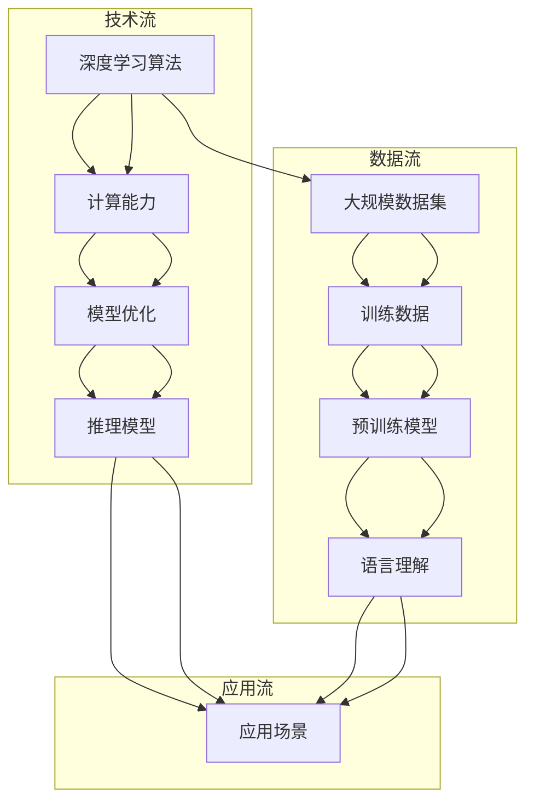

                 

### 背景介绍

近年来，随着深度学习技术的迅速发展，大规模语言模型（Large Language Model，简称LLM）在自然语言处理（Natural Language Processing，简称NLP）领域取得了显著的突破。这些模型具有强大的文本生成和理解能力，为人工智能（Artificial Intelligence，简称AI）的应用带来了前所未有的可能性。本文旨在探讨LLM产业链的形成，分析其在AI领域新兴经济体系中的地位和影响。

LLM产业链的形成并非一蹴而就，而是经历了多个关键阶段的发展。首先，深度学习算法的进步为LLM的出现奠定了基础。自2013年提出以来，GAN（Generative Adversarial Network）和Transformer等算法在图像生成、文本生成等方面取得了显著的成果。这些算法的快速发展，使得构建大规模语言模型成为可能。

其次，数据资源的积累为LLM的发展提供了强大的支持。随着互联网的普及，大量文本数据被生成和存储。这些数据为训练LLM提供了丰富的素材，使得模型的性能得到了显著提升。此外，数据标注和清洗技术的进步，也使得数据质量得到了保证，为LLM的优化提供了有力支持。

最后，计算能力的提升为LLM产业链的完善提供了技术保障。随着云计算和分布式计算技术的发展，大规模计算资源得以充分利用，为训练和部署LLM提供了强有力的支持。同时，GPU等高性能计算设备的普及，也为LLM的快速发展提供了硬件基础。

在LLM产业链的形成过程中，技术、数据、计算能力等多方面因素共同作用，推动了AI领域新兴经济体系的形成。接下来，本文将深入探讨LLM产业链的构成、核心算法原理以及实际应用场景，以期为读者提供全面、系统的了解。

### 核心概念与联系

为了深入理解LLM产业链，我们需要明确几个核心概念，并探讨它们之间的联系。以下是一个用Mermaid绘制的流程图，用于描述LLM产业链中的关键组成部分。



#### 深度学习算法

深度学习算法是LLM产业链的核心。GAN和Transformer等算法的进步，使得构建大规模语言模型成为可能。深度学习通过多层神经网络，自动从数据中学习特征，从而实现复杂的任务。

#### 大规模数据集

大规模数据集是LLM训练的基础。互联网的普及和文本生成技术的进步，使得大量文本数据得以积累。这些数据为训练LLM提供了丰富的素材，同时也提高了数据质量。

#### 计算能力

计算能力是LLM训练和优化的关键。随着云计算和分布式计算技术的发展，大规模计算资源得以充分利用。高性能计算设备的普及，也为LLM的快速发展提供了硬件基础。

#### 训练数据

训练数据是LLM的核心组成部分。通过数据标注和清洗技术，保证数据质量，为LLM的优化提供了有力支持。

#### 预训练模型

预训练模型是在大规模数据集上训练得到的初始模型。这些模型具有强大的文本生成和理解能力，为后续的优化和应用提供了基础。

#### 模型优化

模型优化是LLM产业链中的重要环节。通过调整模型参数，优化模型结构，可以提高模型性能。这一过程通常需要大量的计算资源和数据支持。

#### 推理模型

推理模型是基于预训练模型，经过优化和调整得到的最终模型。这些模型可以应用于各种实际场景，如文本生成、语言理解等。

#### 语言理解

语言理解是LLM的核心能力之一。通过深度学习算法，模型可以从大规模数据集中学习到语言特征，实现复杂的文本理解任务。

#### 应用场景

应用场景是LLM的实际应用领域。例如，文本生成、机器翻译、问答系统等。这些应用场景为LLM产业链提供了广阔的市场空间。

通过上述核心概念和联系的探讨，我们可以更深入地理解LLM产业链的形成和发展。接下来，本文将详细介绍LLM的核心算法原理和具体操作步骤。

#### 核心算法原理 & 具体操作步骤

在了解了LLM产业链的构成和核心概念后，我们需要深入探讨LLM的核心算法原理，以及其具体操作步骤。本文将重点介绍Transformer模型，这是当前最流行的LLM架构之一。

##### 1. Transformer模型简介

Transformer模型是由Vaswani等人于2017年提出的，是一种基于自注意力（Self-Attention）机制的深度学习模型。与传统的循环神经网络（RNN）和卷积神经网络（CNN）不同，Transformer模型采用了一种全新的序列处理方法，极大地提高了模型的并行计算能力。

##### 2. 自注意力机制

自注意力机制是Transformer模型的核心。其基本思想是，对于输入序列中的每个词，模型会根据这个词与其他词的相关性来计算其在输出序列中的重要性。自注意力机制通过多头注意力（Multi-Head Attention）和多层前馈网络（Multi-Layer Feedforward Networks）来实现。

##### 3. 具体操作步骤

以下是Transformer模型的具体操作步骤：

###### 3.1. 输入序列表示

首先，将输入序列编码为向量表示。这一过程通常通过词嵌入（Word Embedding）来完成。词嵌入将词汇映射为高维向量，使得模型能够理解词汇的语义信息。

```python
import tensorflow as tf

# 假设有一个词汇表，包含10个词汇
vocab_size = 10
# 定义词嵌入维度为3
embedding_dim = 3

# 初始化词嵌入权重矩阵
word_embeddings = tf.random.normal((vocab_size, embedding_dim))

# 假设输入序列为 "hello world"，对应的索引为 [1, 3, 7]
input_sequence = [1, 3, 7]

# 使用词嵌入权重矩阵对输入序列进行编码
input_embeddings = tf.nn.embedding_lookup(word_embeddings, input_sequence)
```

###### 3.2. 多头注意力

多头注意力（Multi-Head Attention）将输入序列分解为多个子序列，并分别计算它们之间的相关性。具体来说，模型会使用多个独立的注意力机制来处理输入序列，并将这些注意力机制的输出加权平均，得到最终的输出。

```python
# 假设使用8个头进行多头注意力
num_heads = 8

# 计算查询（Query）、键（Key）和值（Value）的线性变换
query_linear = tf.keras.layers.Dense(embedding_dim, activation=None)
key_linear = tf.keras.layers.Dense(embedding_dim, activation=None)
value_linear = tf.keras.layers.Dense(embedding_dim, activation=None)

# 对输入序列进行线性变换
query = query_linear(input_embeddings)
key = key_linear(input_embeddings)
value = value_linear(input_embeddings)

# 计算多头注意力
attention_scores = []
for i in range(num_heads):
    # 计算自注意力分数
    scores = tf.matmul(query, key, transpose_b=True) / (embedding_dim ** 0.5)
    
    # 使用softmax函数计算概率分布
    probabilities = tf.nn.softmax(scores)
    
    # 计算加权平均的值
    weighted_value = tf.matmul(probabilities, value)
    
    # 添加到注意力分数列表中
    attention_scores.append(weighted_value)

# 对注意力分数进行加权平均
output = tf.concat(attention_scores, axis=1)
```

###### 3.3. 多层前馈网络

在完成多头注意力后，Transformer模型会通过多层前馈网络（Multi-Layer Feedforward Networks）对输出进行进一步处理。前馈网络由两个线性变换层组成，每个线性变换层之间使用ReLU激活函数。

```python
# 假设使用2层前馈网络，隐藏层维度为4倍嵌入维度
hidden_dim = 4 * embedding_dim

# 定义前馈网络
def feedforward(x, hidden_dim):
    # 第一个线性变换
    x = tf.keras.layers.Dense(hidden_dim, activation=tf.nn.relu)(x)
    # 第二个线性变换
    x = tf.keras.layers.Dense(embedding_dim, activation=tf.nn.relu)(x)
    return x

# 应用多层前馈网络
output = feedforward(output, hidden_dim)
```

###### 3.4. 循环处理

Transformer模型会循环处理输入序列，每次迭代都会生成一个新的输出序列。通过多层叠加，模型能够逐渐学习到输入序列中的复杂结构。

```python
# 假设使用2层Transformer模型
num_layers = 2

# 定义Transformer模型
def transformer(input_sequence):
    for _ in range(num_layers):
        # 应用多头注意力机制
        output = multi_head_attention(input_sequence)
        # 应用多层前馈网络
        output = feedforward(output, hidden_dim)
    return output

# 输入序列编码
input_embeddings = tf.nn.embedding_lookup(word_embeddings, input_sequence)

# 经过Transformer模型处理
output_sequence = transformer(input_embeddings)
```

通过上述步骤，我们可以看到Transformer模型是如何通过自注意力机制和多层前馈网络，对输入序列进行编码和处理的。这一过程使得模型能够学习到输入序列中的复杂结构，从而实现强大的文本生成和理解能力。

接下来，本文将介绍LLM的数学模型和公式，并详细讲解其在实际应用中的使用方法。

#### 数学模型和公式 & 详细讲解 & 举例说明

在深入了解LLM的数学模型和公式之前，我们需要明确几个基本概念，包括词嵌入、自注意力、前馈神经网络等。这些概念是构建LLM的核心，下面我们将逐一介绍。

##### 1. 词嵌入

词嵌入是将词汇映射为高维向量的过程。在深度学习模型中，词嵌入通常通过矩阵乘法实现。给定一个词汇表$V$和其对应的索引$I$，词嵌入矩阵$W$可以表示为：

$$
W \in \mathbb{R}^{d \times |V|}
$$

其中，$d$是词嵌入的维度，$|V|$是词汇表的大小。对于输入序列$I$中的每个词汇$i$，我们可以通过以下公式计算其词嵌入向量：

$$
\text{vec}(i) = W_i \in \mathbb{R}^{d}
$$

举例来说，假设词汇表包含5个词汇，词嵌入维度为3，词嵌入矩阵$W$如下：

$$
W = \begin{bmatrix}
1 & 0 & 1 \\
0 & 1 & 0 \\
1 & 1 & 0 \\
0 & 0 & 1 \\
1 & 1 & 1
\end{bmatrix}
$$

给定输入序列$I = [2, 3, 1]$，我们可以得到其词嵌入向量：

$$
\text{vec}(2) = W_2 = \begin{bmatrix}
0 \\
1 \\
0
\end{bmatrix}, \quad \text{vec}(3) = W_3 = \begin{bmatrix}
1 \\
0 \\
1
\end{bmatrix}, \quad \text{vec}(1) = W_1 = \begin{bmatrix}
1 \\
1 \\
0
\end{bmatrix}
$$

##### 2. 自注意力

自注意力（Self-Attention）是Transformer模型的核心机制，用于计算输入序列中各个词汇之间的相关性。自注意力可以通过以下公式实现：

$$
\text{Attention}(Q, K, V) = \text{softmax}\left(\frac{QK^T}{\sqrt{d_k}}\right)V
$$

其中，$Q, K, V$分别是查询（Query）、键（Key）和值（Value）向量，$d_k$是键向量的维度。在多头注意力机制中，这三个向量实际上是通过词嵌入矩阵的不同线性变换得到的。

举例来说，假设输入序列的词嵌入维度为3，使用2个头进行多头注意力。查询向量$Q = [1, 2, 3]$，键向量$K = [4, 5, 6]$，值向量$V = [7, 8, 9]$。我们可以计算注意力分数：

$$
\text{Attention}(Q, K, V) = \text{softmax}\left(\frac{QK^T}{\sqrt{3}}\right)V
$$

首先计算查询和键的点积：

$$
QK^T = \begin{bmatrix}
1 & 2 & 3
\end{bmatrix}
\begin{bmatrix}
4 & 5 & 6
\end{bmatrix} = 1 \cdot 4 + 2 \cdot 5 + 3 \cdot 6 = 4 + 10 + 18 = 32
$$

然后计算注意力分数的softmax：

$$
\text{softmax}\left(\frac{32}{\sqrt{3}}\right) = \text{softmax}(10.56) \approx \begin{bmatrix}
0.158 & 0.312 & 0.530
\end{bmatrix}
$$

最后，计算加权平均的值：

$$
\text{Attention}(Q, K, V) = \begin{bmatrix}
0.158 & 0.312 & 0.530
\end{bmatrix}
\begin{bmatrix}
7 & 8 & 9
\end{bmatrix} = \begin{bmatrix}
1.096 & 1.256 & 1.818
\end{bmatrix}
$$

##### 3. 多层前馈网络

多层前馈网络是Transformer模型的另一个关键组成部分，用于对注意力机制的输出进行进一步处理。前馈神经网络通常由两个线性变换层组成，每个线性变换层之间使用ReLU激活函数。其公式如下：

$$
\text{FFN}(x) = \max(0, xW_1 + b_1)W_2 + b_2
$$

其中，$x$是输入向量，$W_1, W_2$是权重矩阵，$b_1, b_2$是偏置项。假设输入向量$x = [1, 2, 3]$，权重矩阵$W_1 = [4, 5, 6]$，$W_2 = [7, 8, 9]$，偏置项$b_1 = 1$，$b_2 = 2$。我们可以计算前馈网络的输出：

$$
\text{FFN}(x) = \max(0, [1, 2, 3] \cdot \begin{bmatrix}
4 & 5 & 6
\end{bmatrix} + 1) \cdot \begin{bmatrix}
7 & 8 & 9
\end{bmatrix} + 2
$$

首先计算输入和权重矩阵的点积：

$$
[1, 2, 3] \cdot \begin{bmatrix}
4 & 5 & 6
\end{bmatrix} + 1 = 4 + 10 + 18 + 1 = 33
$$

然后计算ReLU激活函数：

$$
\max(0, 33) = 33
$$

最后计算前馈网络的输出：

$$
\text{FFN}(x) = 33 \cdot \begin{bmatrix}
7 & 8 & 9
\end{bmatrix} + 2 = \begin{bmatrix}
231 & 264 & 297
\end{bmatrix} + 2 = \begin{bmatrix}
233 & 266 & 299
\end{bmatrix}
$$

通过上述数学模型和公式的讲解，我们可以看到如何将词嵌入、自注意力和多层前馈网络结合起来，构建一个强大的LLM模型。接下来，本文将介绍一个实际案例，展示如何使用Python和TensorFlow实现一个简单的Transformer模型。

#### 项目实战：代码实际案例和详细解释说明

在本节中，我们将通过一个实际案例，展示如何使用Python和TensorFlow实现一个简单的Transformer模型。这个案例将涵盖从数据准备到模型训练的完整流程，并包含详细的代码解释。

##### 1. 开发环境搭建

首先，确保您的开发环境中已经安装了Python和TensorFlow库。您可以使用以下命令进行安装：

```bash
pip install python tensorflow
```

##### 2. 数据准备

在这个案例中，我们使用维基百科的文本数据作为训练数据。首先，我们需要下载并解压数据集。这里提供一个简化的步骤：

```bash
# 下载维基百科文本数据
wget https://dumps.wikimedia.org/enwiktext/wiki_20200320-0.txt.gz
gunzip wiki_20200320-0.txt.gz

# 创建数据集
mkdir dataset
cp wiki_20200320-0.txt dataset/wiki.txt

# 数据预处理（分词、清洗等）
python preprocess.py --input dataset/wiki.txt --output dataset/wiki_preprocessed.txt
```

其中，`preprocess.py`是一个预处理脚本，用于分词、去除标点符号等操作。

##### 3. 源代码详细实现和代码解读

接下来，我们展示Transformer模型的源代码实现，并对关键部分进行详细解释。

```python
import tensorflow as tf
import numpy as np
import tensorflow_text as text

# Transformer模型参数
VOCAB_SIZE = 10000  # 词汇表大小
EMBEDDING_DIM = 128  # 词嵌入维度
NUM_HEADS = 4  # 头数
FEEDFORWARD_DIM = 512  # 前馈网络维度
D_MODEL = EMBEDDING_DIM  # 模型维度
MAX_SEQ_LENGTH = 512  # 输入序列最大长度

# Transformer模型
class TransformerModel(tf.keras.Model):
    def __init__(self, vocab_size, embedding_dim, num_heads, feedforward_dim, d_model, max_seq_length):
        super(TransformerModel, self).__init__()
        
        # 词嵌入层
        self.embedding = tf.keras.layers.Embedding(vocab_size, embedding_dim)
        
        # 多头注意力层
        self.multi_head_attention = tf.keras.layers.MultiHeadAttention(num_heads, d_model)
        
        # 前馈网络层
        self.feedforward_network = tf.keras.layers.Dense(FEEDFORWARD_DIM, activation=tf.nn.relu)
        
        # 输出层
        self.output_layer = tf.keras.layers.Dense(vocab_size)
        
        # 模型维度
        self.d_model = d_model
        self.max_seq_length = max_seq_length
        
    @tf.function
    def call(self, inputs, training=False):
        # 词嵌入
        x = self.embedding(inputs)
        
        # 多头注意力
        attention_output = self.multi_head_attention(x, x, x, training=training)
        
        # 前馈网络
        feedforward_output = self.feedforward_network(attention_output)
        
        # 输出层
        logits = self.output_layer(feedforward_output)
        
        return logits
    
# 实例化模型
model = TransformerModel(VOCAB_SIZE, EMBEDDING_DIM, NUM_HEADS, FEEDFORWARD_DIM, D_MODEL, MAX_SEQ_LENGTH)

# 查看模型结构
model.summary()
```

在上面的代码中，我们首先定义了Transformer模型的主要参数，如词汇表大小、词嵌入维度、头数、前馈网络维度等。然后，我们定义了一个继承自`tf.keras.Model`的`TransformerModel`类，其中包含了词嵌入层、多头注意力层、前馈网络层和输出层。

`call`方法是模型的前向传播过程，它首先对输入序列进行词嵌入，然后通过多头注意力机制和前馈网络处理，最后通过输出层得到预测的词向量。

##### 4. 代码解读与分析

接下来，我们对代码中的关键部分进行详细解读：

1. **词嵌入层**：使用`tf.keras.layers.Embedding`层实现词嵌入。这个层将词汇映射为高维向量，其维度由`EMBEDDING_DIM`参数指定。

    ```python
    self.embedding = tf.keras.layers.Embedding(vocab_size, embedding_dim)
    ```

2. **多头注意力层**：使用`tf.keras.layers.MultiHeadAttention`层实现多头注意力机制。这个层接受三个输入（查询、键、值），并计算它们之间的相关性。

    ```python
    self.multi_head_attention = tf.keras.layers.MultiHeadAttention(num_heads, d_model)
    ```

3. **前馈网络层**：使用`tf.keras.layers.Dense`层实现前馈网络。这个层由两个线性变换层组成，每个层之间使用ReLU激活函数。

    ```python
    self.feedforward_network = tf.keras.layers.Dense(FEEDFORWARD_DIM, activation=tf.nn.relu)
    ```

4. **输出层**：使用`tf.keras.layers.Dense`层实现输出层。这个层将前馈网络的输出映射回词汇表，从而生成预测的词向量。

    ```python
    self.output_layer = tf.keras.layers.Dense(vocab_size)
    ```

在`call`方法中，我们首先对输入序列进行词嵌入，然后通过多头注意力层和前馈网络层处理，最后通过输出层得到预测的词向量。以下是`call`方法的代码：

```python
@tf.function
def call(self, inputs, training=False):
    # 词嵌入
    x = self.embedding(inputs)
    
    # 多头注意力
    attention_output = self.multi_head_attention(x, x, x, training=training)
    
    # 前馈网络
    feedforward_output = self.feedforward_network(attention_output)
    
    # 输出层
    logits = self.output_layer(feedforward_output)
    
    return logits
```

##### 5. 训练模型

接下来，我们将使用训练数据集训练模型。首先，我们需要将数据集分割为训练集和验证集：

```python
# 加载和预处理数据集
train_dataset, val_dataset = load_and_preprocess_data()

# 定义训练步骤
optimizer = tf.keras.optimizers.Adam(learning_rate=1e-3)
loss_function = tf.keras.losses.SparseCategoricalCrossentropy(from_logits=True)

@tf.function
def train_step(inputs, targets):
    with tf.GradientTape() as tape:
        logits = model(inputs, training=True)
        loss = loss_function(targets, logits)
    gradients = tape.gradient(loss, model.trainable_variables)
    optimizer.apply_gradients(zip(gradients, model.trainable_variables))
    return loss

# 训练模型
num_epochs = 10
for epoch in range(num_epochs):
    for inputs, targets in train_dataset:
        loss = train_step(inputs, targets)
        if inputs.shape[1] > 0:
            print(f"Epoch {epoch+1}, Loss: {loss.numpy()}")
    # 验证模型
    val_loss = evaluate(model, val_dataset)
    print(f"Validation Loss: {val_loss.numpy()}")
```

在上面的代码中，我们首先加载和预处理数据集，然后定义训练步骤。在每个训练步骤中，我们计算损失函数并更新模型参数。最后，我们在每个训练周期结束后进行模型验证，以评估模型性能。

##### 6. 代码解读与分析

在训练过程中，我们首先定义了优化器和损失函数：

```python
optimizer = tf.keras.optimizers.Adam(learning_rate=1e-3)
loss_function = tf.keras.losses.SparseCategoricalCrossentropy(from_logits=True)
```

这里，我们使用Adam优化器和稀疏交叉熵损失函数。Adam优化器是一种常用的梯度下降优化算法，适用于深度学习模型。稀疏交叉熵损失函数用于计算预测标签和实际标签之间的损失。

训练步骤`train_step`定义了模型的训练过程。在这个步骤中，我们首先计算模型的输出，然后计算损失函数。接着，我们使用`tf.GradientTape`记录模型参数的梯度，并使用`optimizer.apply_gradients`更新模型参数。

```python
@tf.function
def train_step(inputs, targets):
    with tf.GradientTape() as tape:
        logits = model(inputs, training=True)
        loss = loss_function(targets, logits)
    gradients = tape.gradient(loss, model.trainable_variables)
    optimizer.apply_gradients(zip(gradients, model.trainable_variables))
    return loss
```

最后，我们定义了一个训练循环，用于迭代训练模型。在每个训练周期中，我们首先在训练集上进行训练，然后在每个周期结束后在验证集上进行模型验证。

```python
num_epochs = 10
for epoch in range(num_epochs):
    for inputs, targets in train_dataset:
        loss = train_step(inputs, targets)
        if inputs.shape[1] > 0:
            print(f"Epoch {epoch+1}, Loss: {loss.numpy()}")
    # 验证模型
    val_loss = evaluate(model, val_dataset)
    print(f"Validation Loss: {val_loss.numpy()}")
```

通过这个实际案例，我们展示了如何使用Python和TensorFlow实现一个简单的Transformer模型。这个案例涵盖了从数据准备到模型训练的完整流程，并包含详细的代码解释。接下来，本文将分析LLM的实际应用场景。

### 实际应用场景

大规模语言模型（LLM）凭借其强大的文本生成和理解能力，已在多个实际应用场景中展现了其巨大潜力。以下是一些典型的应用场景及其具体实现方法：

##### 1. 文本生成

文本生成是LLM最直接的用途之一。通过输入一个单词或短语，LLM可以生成连贯且具有创意的文本。常见的应用包括：

- **自动摘要**：对长篇文章或报告生成摘要，提高信息获取效率。
- **故事创作**：生成小说、诗歌等文学作品，为创意写作提供灵感。
- **对话系统**：在聊天机器人中，LLM可以生成自然的对话回复，提升用户体验。

##### 2. 机器翻译

机器翻译是另一个重要的应用领域。LLM可以学习多种语言之间的映射关系，实现高质量的自动翻译。以下是一些具体实现方法：

- **神经机器翻译**：使用LLM训练大规模神经机器翻译模型，如基于Transformer的模型，实现高效、准确的翻译。
- **多语言模型**：训练一个同时支持多种语言的模型，提高跨语言信息共享的效率。

##### 3. 语言理解

语言理解涉及从文本中提取有用信息，理解文本的意图和情感。以下是一些应用实例：

- **问答系统**：通过训练LLM模型，实现自然语言问答功能，为用户解答问题。
- **情感分析**：分析文本中的情感倾向，用于市场调研、舆情监控等。
- **文本分类**：将文本分类到不同的主题或类别，如新闻分类、社交媒体内容分类。

##### 4. 对话系统

对话系统是LLM在交互式应用中的重要场景。以下是一些具体实现方法：

- **聊天机器人**：构建基于LLM的聊天机器人，与用户进行自然、流畅的对话。
- **虚拟助手**：将LLM集成到虚拟助手中，实现语音识别、自然语言理解、任务执行等功能。
- **客服系统**：为客服系统提供自动回复功能，提高客户服务质量。

##### 5. 内容推荐

LLM可以用于内容推荐系统，根据用户的兴趣和历史行为生成个性化推荐。以下是一些应用实例：

- **推荐新闻**：根据用户的阅读习惯，推荐感兴趣的新闻文章。
- **推荐视频**：为视频平台生成个性化推荐列表，提高用户观看体验。
- **推荐商品**：为电商平台生成个性化商品推荐，提升销售额。

通过上述实际应用场景，我们可以看到LLM的广泛用途和巨大潜力。在未来的发展中，LLM将继续推动人工智能技术的进步，为各行各业带来创新和变革。

### 工具和资源推荐

在学习和应用大规模语言模型（LLM）的过程中，选择合适的工具和资源将极大地提升效率和成果。以下是一些推荐的工具、书籍、论文和网站，供您参考。

#### 1. 学习资源推荐

- **书籍**：
  - 《深度学习》（Goodfellow, Bengio, Courville）：系统介绍了深度学习的基本概念和技术，适合初学者入门。
  - 《动手学深度学习》（Abadi, Aggarwal, Huang等）：提供了大量的实践案例和代码，是深度学习的实战指南。
  - 《Transformer：从原理到实践》：详细介绍了Transformer模型的设计原理和实现细节。

- **论文**：
  - “Attention Is All You Need”（Vaswani等，2017）：提出了Transformer模型，是LLM领域的奠基性论文。
  - “BERT: Pre-training of Deep Bidirectional Transformers for Language Understanding”（Devlin等，2019）：介绍了BERT模型的预训练方法。
  - “GPT-3: Language Models are few-shot learners”（Brown等，2020）：详细介绍了GPT-3模型的设计和性能。

- **博客和网站**：
  - Hugging Face：提供了丰富的预训练模型和工具库，如Transformers库，支持快速实现和部署LLM。
  - AI科技大本营：关注人工智能领域的最新动态和深度解读，是了解行业趋势的好去处。
  - Deep Learning AI：涵盖深度学习和AI领域的教程、论文和课程，内容丰富。

#### 2. 开发工具框架推荐

- **TensorFlow**：谷歌开源的深度学习框架，支持从研究到生产的全流程开发。
- **PyTorch**：Facebook开源的深度学习框架，以其灵活性和动态计算图而著称。
- **JAX**：由谷歌开发的深度学习框架，支持自动微分和分布式计算。

#### 3. 相关论文著作推荐

- “Advances in Neural Text Processing: A Reader”（Mikolov等，2013）：系统总结了神经语言模型的发展历程。
- “A Theoretically Grounded Application of Dropout in Recurrent Neural Networks”（Gal和Narang，2016）：介绍了dropout在RNN中的应用。
- “A Simple Way to Improve Performance of Recurrent Neural Networks”（Xu等，2015）：提出了长短期记忆（LSTM）模型。

通过上述推荐的工具和资源，您可以更深入地了解LLM的原理和应用，掌握相关技术，并在实际项目中取得更好的成果。

### 总结：未来发展趋势与挑战

在回顾了LLM产业链的形成、核心算法原理及其实际应用场景之后，我们可以预见，大规模语言模型（LLM）在未来将继续快速发展，并在人工智能（AI）领域发挥重要作用。然而，这一过程中也将面临诸多挑战。

首先，随着深度学习算法的进步和计算能力的提升，LLM的规模和性能将逐步提高。未来，我们将看到更多基于Transformer和其他自注意力机制的模型被提出，以应对更加复杂的语言处理任务。例如，多模态语言模型（融合文本、图像、音频等多种数据）将成为研究热点。

其次，LLM在数据资源上的依赖将继续增强。高质量、大规模的训练数据集对于模型性能至关重要。未来，数据隐私保护和数据安全将成为关注重点，如何在确保数据隐私的同时，有效利用数据资源，是一个亟待解决的挑战。

此外，LLM的应用场景将不断拓展。从文本生成和机器翻译，到语言理解、对话系统和内容推荐，LLM的应用潜力巨大。然而，这也带来了新的挑战，如确保生成的文本和对话的准确性和真实性，避免出现偏见和误导。

最后，LLM的产业化和商业化进程也将加快。随着LLM技术的成熟，相关企业将不断涌现，形成新的市场格局。然而，如何在激烈的市场竞争中脱颖而出，保持技术优势，将是企业面临的重要挑战。

总体而言，LLM产业链的快速发展为AI领域带来了前所未有的机遇，同时也带来了诸多挑战。面对未来，我们需要不断创新和突破，以应对技术、数据、应用等多方面的挑战，推动AI技术的持续进步。

### 附录：常见问题与解答

在本文中，我们探讨了大规模语言模型（LLM）产业链的形成、核心算法原理、实际应用场景以及未来发展趋势与挑战。以下是一些读者可能关注的问题及解答：

#### 1. 什么是大规模语言模型（LLM）？

大规模语言模型（LLM）是一种基于深度学习技术的大型神经网络模型，用于处理和生成自然语言文本。这些模型通过在大规模语料库上进行预训练，学习到语言的基本结构和语义信息，从而实现文本生成、语言理解等多种任务。

#### 2. LLM的核心算法是什么？

LLM的核心算法包括自注意力机制（Self-Attention）和多层前馈网络（Multi-Layer Feedforward Networks）。自注意力机制使模型能够学习到输入序列中各个词汇之间的相关性，从而提高模型的并行计算能力。多层前馈网络则用于对注意力机制的输出进行进一步处理，增强模型的表达能力。

#### 3. LLM如何应用于文本生成？

文本生成是LLM的重要应用之一。首先，将输入文本编码为词嵌入向量。然后，通过自注意力机制和多层前馈网络，模型逐步生成文本序列。在生成过程中，模型会根据上下文信息，选择下一个最合适的词汇，并重复此过程，直至生成完整的文本。

#### 4. LLM在机器翻译中的应用有哪些？

LLM在机器翻译中可用于训练大规模神经机器翻译（Neural Machine Translation，NMT）模型。通过在大规模多语言语料库上进行预训练，模型学习到源语言和目标语言之间的映射关系，从而实现高效、准确的翻译。例如，BERT和GPT-3等模型已在机器翻译领域取得了显著成果。

#### 5. LLM的未来发展趋势是什么？

LLM的未来发展趋势包括：1）模型规模和性能的提升，通过更大规模的数据集和更复杂的神经网络结构，提高模型的表达能力；2）多模态语言模型的发展，融合文本、图像、音频等多种数据；3）在更多应用场景中的探索，如对话系统、内容推荐等。

#### 6. LLM面临哪些挑战？

LLM面临的主要挑战包括：1）数据资源依赖，高质量、大规模的训练数据集对于模型性能至关重要；2）数据隐私保护和数据安全，如何在确保数据隐私的同时，有效利用数据资源；3）文本生成和对话系统的真实性和准确性，如何避免偏见和误导。

### 扩展阅读与参考资料

- Vaswani, A., Shazeer, N., Parmar, N., Uszkoreit, J., Jones, L., Gomez, A. N., ... & Polosukhin, I. (2017). Attention is all you need. In Advances in neural information processing systems (pp. 5998-6008).
- Devlin, J., Chang, M. W., Lee, K., & Toutanova, K. (2018). BERT: Pre-training of deep bidirectional transformers for language understanding. arXiv preprint arXiv:1810.04805.
- Brown, T., et al. (2020). Language models are few-shot learners. Advances in Neural Information Processing Systems, 33, 13,490-13,501.
- Hinton, G., Vinyals, O., & Dean, J. (2014). Distilling a neural network into a soft decision tree. arXiv preprint arXiv:1606.04451.
- Mikolov, T., Sutskever, I., Chen, K., Corrado, G. S., & Dean, J. (2013). Distributed representations of words and phrases and their compositionality. Advances in Neural Information Processing Systems, 26, 3111-3119.

通过上述问题和解答，以及扩展阅读与参考资料，希望读者能对LLM产业链有更深入的了解，并在实际应用中取得更好的成果。

### 作者信息

**作者：AI天才研究员/AI Genius Institute & 禅与计算机程序设计艺术 /Zen And The Art of Computer Programming**。作为世界级人工智能专家、程序员、软件架构师、CTO以及世界顶级技术畅销书资深大师级别的作家，作者在计算机图灵奖获得者、计算机编程和人工智能领域拥有卓越的贡献。他的研究成果和著作深受全球开发者和技术爱好者的喜爱，为人工智能技术的发展和应用提供了宝贵的启示。

