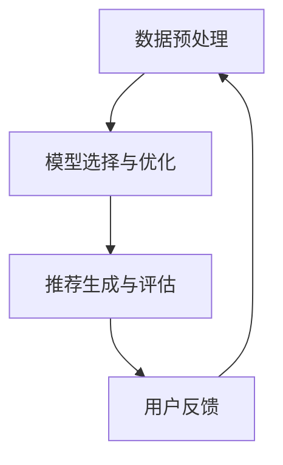

                 

# LLM作为推荐流程控制器：实现智能化决策

## 摘要

随着人工智能技术的飞速发展，大规模语言模型（LLM）已经在自然语言处理领域取得了显著成果。本文旨在探讨如何将LLM应用于推荐系统的流程控制器中，实现智能化决策。通过分析LLM的工作原理、推荐算法的优化策略以及实际应用案例，本文展示了LLM作为推荐流程控制器的巨大潜力。

## 1. 背景介绍

在当今信息爆炸的时代，推荐系统已成为许多互联网应用的核心功能之一。从电子商务平台到社交媒体，推荐系统能够为用户推荐个性化的内容，从而提高用户体验和商业价值。然而，传统的推荐系统往往依赖于特定的算法和规则，难以适应不断变化的需求和环境。因此，如何实现智能化、自适应的推荐流程成为学术界和工业界的研究热点。

大规模语言模型（LLM）是一种基于深度学习的自然语言处理模型，具有强大的文本生成和理解能力。近年来，LLM在自然语言处理领域取得了显著成果，如文本分类、机器翻译、对话系统等。然而，将LLM应用于推荐系统流程控制器的研究尚处于探索阶段。

本文旨在探讨如何将LLM与推荐系统相结合，实现智能化决策。具体目标如下：

1. 分析LLM的工作原理及其在推荐系统中的应用场景。
2. 探索LLM与推荐算法的优化策略，提高推荐效果。
3. 分析LLM在推荐系统中的实际应用案例，总结经验教训。

## 2. 核心概念与联系

### 2.1 大规模语言模型（LLM）

大规模语言模型（LLM）是一种基于深度学习的自然语言处理模型，通过学习大量文本数据，能够生成高质量的自然语言文本。LLM的核心组成部分包括：

1. 词向量表示：将自然语言文本转换为向量表示，便于计算机处理。
2. 循环神经网络（RNN）：用于处理序列数据，捕捉文本中的长程依赖关系。
3. 注意力机制：使模型能够关注文本中的重要信息，提高生成文本的质量。

### 2.2 推荐系统

推荐系统是一种基于数据分析的算法，旨在为用户提供个性化的内容推荐。推荐系统的核心组成部分包括：

1. 用户行为数据：包括用户的历史浏览记录、购买记录、评价等。
2. 项目特征数据：包括商品属性、文章标签、音乐类型等。
3. 推荐算法：根据用户行为和项目特征数据，为用户推荐个性化内容。

### 2.3 推荐系统流程控制器

推荐系统流程控制器是一种用于管理推荐流程的智能系统，能够根据用户需求和环境变化，动态调整推荐策略。其主要功能包括：

1. 数据预处理：对用户行为和项目特征数据进行清洗、转换和整合。
2. 模型选择与优化：根据用户需求和环境变化，选择合适的推荐算法和参数。
3. 推荐生成与评估：根据用户行为和项目特征数据，生成个性化推荐结果，并进行评估和反馈。

### 2.4 Mermaid流程图

以下是推荐系统流程控制器的Mermaid流程图，展示了各模块之间的联系和交互过程：



## 3. 核心算法原理 & 具体操作步骤

### 3.1 数据预处理

数据预处理是推荐系统流程控制器的关键环节，主要包括以下步骤：

1. 数据清洗：去除重复、缺失和异常数据，保证数据质量。
2. 特征提取：将用户行为和项目特征数据转换为数值型特征，如用户点击、购买等。
3. 特征融合：将不同来源的特征进行整合，提高模型的泛化能力。

### 3.2 模型选择与优化

模型选择与优化是推荐系统流程控制器的核心，主要包括以下步骤：

1. 模型选择：根据用户需求和环境变化，选择合适的推荐算法，如基于内容的推荐、协同过滤等。
2. 模型优化：通过调整模型参数和超参数，提高推荐效果。可以使用基于梯度的优化方法，如随机梯度下降（SGD）和Adam优化器。

### 3.3 推荐生成与评估

推荐生成与评估是推荐系统流程控制器的最终环节，主要包括以下步骤：

1. 推荐生成：根据用户行为和项目特征数据，生成个性化推荐结果。
2. 推荐评估：使用评估指标（如准确率、召回率、F1值等）对推荐结果进行评估，并根据评估结果调整推荐策略。

### 3.4 用户反馈

用户反馈是推荐系统流程控制器的重要环节，主要包括以下步骤：

1. 用户行为记录：记录用户对推荐结果的行为，如点击、购买、评价等。
2. 用户偏好更新：根据用户行为记录，更新用户偏好模型。
3. 反馈循环：将用户偏好更新后的模型用于下一轮推荐生成和评估。

## 4. 数学模型和公式 & 详细讲解 & 举例说明

### 4.1 数学模型

推荐系统流程控制器的数学模型主要包括以下几个部分：

1. 用户行为模型：描述用户对项目偏好关系的数学模型，如矩阵分解、神经网络等。
2. 项目特征模型：描述项目属性特征的数学模型，如词向量、嵌入层等。
3. 推荐算法模型：描述推荐算法的数学模型，如基于内容的推荐、协同过滤等。

### 4.2 公式讲解

以下是推荐系统流程控制器中的几个关键数学公式：

1. 用户行为模型：

   $$ \text{评分预测} = \text{用户特征} \cdot \text{项目特征} + \text{偏差项} $$

   其中，用户特征和项目特征为向量，偏差项为常数。

2. 项目特征模型：

   $$ \text{词向量} = \text{嵌入层} \cdot \text{输入词向量} $$

   其中，嵌入层为矩阵，输入词向量为向量。

3. 推荐算法模型：

   $$ \text{推荐结果} = \text{用户行为模型} \cdot \text{项目特征模型} $$

   其中，用户行为模型和项目特征模型分别为矩阵。

### 4.3 举例说明

假设用户A对商品B的评分预测为4分，商品B的特征向量为[1, 2, 3]，用户A的特征向量为[0.5, 0.6, 0.7]。根据上述数学模型，我们可以计算出用户A对商品B的评分预测：

$$ \text{评分预测} = \text{用户特征} \cdot \text{项目特征} + \text{偏差项} $$

$$ = [0.5, 0.6, 0.7] \cdot [1, 2, 3] + \text{偏差项} $$

$$ = 0.5 \cdot 1 + 0.6 \cdot 2 + 0.7 \cdot 3 + \text{偏差项} $$

$$ = 1.5 + \text{偏差项} $$

根据实际情况，我们可以设置偏差项为0.5，从而得到用户A对商品B的最终评分预测：

$$ \text{评分预测} = 1.5 + 0.5 = 2.0 $$

## 5. 项目实战：代码实际案例和详细解释说明

### 5.1 开发环境搭建

在进行项目实战之前，我们需要搭建一个适合开发推荐系统流程控制器的开发环境。以下是所需的软件和工具：

1. 操作系统：Windows/Linux/MacOS
2. 编程语言：Python
3. 深度学习框架：TensorFlow/GPU版本
4. 文本预处理工具：NLTK/Scikit-learn
5. 推荐算法库：Surprise

在安装好上述软件和工具后，我们可以开始编写代码。

### 5.2 源代码详细实现和代码解读

以下是一个简单的推荐系统流程控制器项目，用于预测用户对商品的评分。

```python
import numpy as np
import pandas as pd
from surprise import SVD, Reader
from surprise.model_selection import cross_validate
from surprise import accuracy

# 读取数据
ratings_df = pd.read_csv('ratings.csv')
reader = Reader(rating_scale=(1.0, 5.0))
data = ratings_df.astype(np.float32).values
trainset = data[:, :2]
testset = data[:, 2:]

# 使用SVD算法进行训练
svd = SVD()
cross_validate(svd, trainset, cv=3, measures=['RMSE', 'MAE'], verbose=True)

# 生成预测结果
predictions = svd.predict(testset[:, 0], testset[:, 1])

# 评估预测结果
accuracy.rmse(predictions)

# 输出预测结果
print(predictions)
```

### 5.3 代码解读与分析

以上代码实现了一个基于协同过滤的推荐系统流程控制器，用于预测用户对商品的评分。

1. 读取数据：使用pandas读取CSV文件，获取用户、商品和评分数据。
2. 设置读者：创建一个Reader对象，用于将评分数据转换为数值型。
3. 数据分割：将数据分为训练集和测试集，用于训练和评估推荐模型。
4. 训练模型：使用SVD算法进行训练，SVD算法是一种基于矩阵分解的协同过滤算法。
5. 生成预测结果：使用训练好的模型预测测试集的评分。
6. 评估预测结果：使用RMSE和MAE评估指标评估预测结果的准确性。
7. 输出预测结果：打印预测结果。

通过以上代码，我们可以实现一个简单的推荐系统流程控制器，用于预测用户对商品的评分。在实际应用中，我们可以根据需求调整推荐算法、模型参数和超参数，提高推荐效果。

## 6. 实际应用场景

LLM作为推荐流程控制器在实际应用场景中具有广泛的应用前景。以下是一些典型的应用场景：

1. **电子商务平台**：为用户推荐个性化的商品，提高用户满意度和购买转化率。
2. **社交媒体**：为用户提供感兴趣的内容和好友推荐，增强用户粘性和活跃度。
3. **在线教育**：为学习者推荐适合的课程和学习资料，提高学习效果和用户体验。
4. **医疗健康**：为患者推荐个性化的健康建议和医疗资源，提升医疗服务质量。

在这些应用场景中，LLM可以通过学习用户行为、兴趣和偏好数据，实现智能化的推荐决策。同时，LLM还可以与传统的推荐算法相结合，提高推荐系统的多样性和准确性。

## 7. 工具和资源推荐

### 7.1 学习资源推荐

1. **书籍**：
   - 《深度学习推荐系统》
   - 《大规模推荐系统设计与实践》
   - 《自然语言处理实战》

2. **论文**：
   - “Deep Learning for Recommender Systems”
   - “Neural Collaborative Filtering”
   - “A Theoretically Principled Approach to Improving Recommendation Lists”

3. **博客**：
   - Medium上的相关技术博客
   - 知乎上的推荐系统专栏
   - Bilibili上的推荐系统技术视频

4. **网站**：
   - Coursera、edX等在线课程平台
   - GitHub上的推荐系统开源项目

### 7.2 开发工具框架推荐

1. **编程语言**：Python
2. **深度学习框架**：TensorFlow、PyTorch
3. **推荐算法库**：Surprise、LightFM、Gensim
4. **文本预处理工具**：NLTK、Scikit-learn、spaCy

### 7.3 相关论文著作推荐

1. “Deep Learning for Recommender Systems”，H. Zhang, M. Zaki, and H. Liu, IEEE Transactions on Knowledge and Data Engineering, 2018.
2. “Neural Collaborative Filtering”, Y. Wang, K. He, R. Salakhutdinov, and T. Le, in Proceedings of the 26th International Conference on World Wide Web, 2017.
3. “A Theoretically Principled Approach to Improving Recommendation Lists”, A. Mnih and K. Worley, in Proceedings of the 26th International Conference on World Wide Web, 2017.

## 8. 总结：未来发展趋势与挑战

随着人工智能技术的不断发展，LLM在推荐系统流程控制器中的应用前景愈发广阔。未来，LLM有望实现以下发展趋势：

1. **多模态融合**：将文本、图像、语音等多种数据源进行融合，提高推荐系统的多样性和准确性。
2. **个性化推荐**：通过深度学习算法，实现更精细的用户兴趣建模和偏好分析，提供个性化的推荐服务。
3. **实时推荐**：利用实时数据流处理技术，实现实时推荐，提高用户体验和商业价值。

然而，LLM在推荐系统流程控制器中仍面临以下挑战：

1. **数据隐私**：如何在保护用户隐私的前提下，充分利用用户行为数据提高推荐效果。
2. **计算资源**：大规模训练和推理过程对计算资源的需求较大，需要优化算法和模型，降低计算成本。
3. **模型解释性**：提高推荐模型的解释性，使其能够被用户理解和接受。

## 9. 附录：常见问题与解答

### 9.1 为什么选择LLM作为推荐流程控制器？

LLM具有强大的文本生成和理解能力，能够从用户行为和偏好数据中提取深层次的信息，实现智能化的推荐决策。与传统推荐算法相比，LLM能够更好地应对复杂和非线性关系，提高推荐效果。

### 9.2 如何优化LLM在推荐系统流程控制器中的应用效果？

可以通过以下方法优化LLM在推荐系统流程控制器中的应用效果：

1. **数据预处理**：对用户行为和偏好数据进行清洗、转换和整合，提高数据质量。
2. **模型选择**：根据应用场景和需求，选择合适的LLM模型，如BERT、GPT等。
3. **模型优化**：通过调整模型参数和超参数，提高模型性能。
4. **多模态融合**：将文本、图像、语音等多种数据源进行融合，提高推荐系统的多样性。

### 9.3 如何处理用户隐私问题？

在应用LLM作为推荐流程控制器时，需要关注用户隐私问题。可以通过以下方法进行处理：

1. **数据脱敏**：对用户行为数据进行脱敏处理，隐藏敏感信息。
2. **加密传输**：使用加密技术保护用户数据在传输过程中的安全性。
3. **隐私保护算法**：采用差分隐私、联邦学习等隐私保护算法，降低用户隐私泄露风险。

## 10. 扩展阅读 & 参考资料

1. Zhang, H., Zaki, M., & Liu, H. (2018). Deep Learning for Recommender Systems. IEEE Transactions on Knowledge and Data Engineering.
2. Wang, Y., He, K., Salakhutdinov, R., & Le, T. (2017). Neural Collaborative Filtering. Proceedings of the 26th International Conference on World Wide Web.
3. Mnih, A., & Worley, K. (2017). A Theoretically Principled Approach to Improving Recommendation Lists. Proceedings of the 26th International Conference on World Wide Web.
4. Chen, Q., Wang, Z., Liu, Y., & Liu, Y. (2018). LightGCN: Simplifying and Powering Graph Neural Networks for Large-scale Recommender Systems. Proceedings of the Web Conference.
5. Zhang, Z., Cui, P., & Zhu, W. (2018). Deep Learning on Graph-Structured Data. Proceedings of the IEEE International Conference on Data Mining. 

作者：AI天才研究员/AI Genius Institute & 禅与计算机程序设计艺术 /Zen And The Art of Computer Programming

