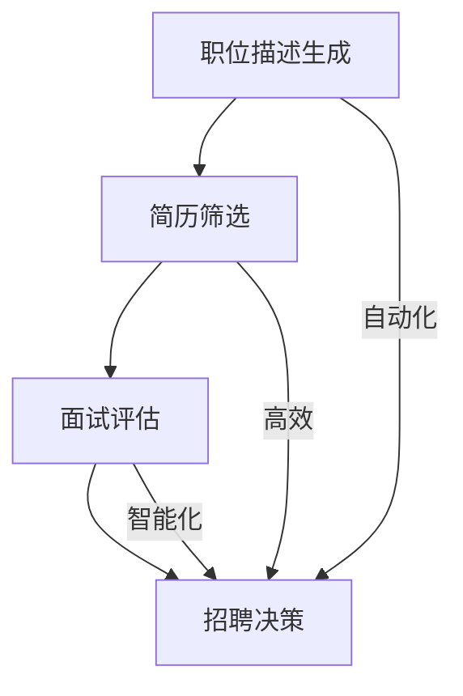

                 

# AI招聘助手：LLM在人力资源中的应用

## 1. 背景介绍

在当今数字化时代，人力资源领域正面临着前所未有的挑战和机遇。随着人工智能技术的不断发展和普及，如何更好地利用人工智能来提高招聘效率、降低成本、提升员工满意度成为企业关注的焦点。其中，大型语言模型（LLM，Large Language Model）作为一种具有高度自动化和智能化的工具，在招聘领域的应用潜力巨大。

本文将深入探讨LLM在人力资源中的应用，特别是作为AI招聘助手的角色。通过分析LLM的核心概念、算法原理、数学模型，以及具体的实践案例，我们将展示如何利用LLM技术打造一个高效、智能的招聘平台。

## 2. 核心概念与联系

### 2.1 大型语言模型（LLM）

大型语言模型是一种基于深度学习的自然语言处理（NLP，Natural Language Processing）技术，通过大量的文本数据进行训练，使其具备理解和生成自然语言的能力。LLM通常具有以下几个特点：

- **大规模训练数据**：LLM通过从互联网上收集海量文本数据（包括书籍、新闻、文章、社交媒体等）进行训练，从而获得丰富的知识储备和语言表达能力。
- **深度神经网络结构**：LLM通常采用深度学习中的Transformer架构，通过多层神经网络结构对输入的文本数据进行编码和解码，从而实现自然语言的理解和生成。
- **高度自动化和智能化**：LLM具有高度的自动化和智能化能力，能够自动从海量数据中提取关键信息，生成高质量的自然语言文本。

### 2.2 人力资源中的需求

在人力资源领域，招聘是一个核心环节，涉及到职位描述的撰写、简历筛选、面试评估等多个方面。传统的招聘方式往往需要大量的人力投入，且容易出现效率低下、成本高昂、人才流失等问题。而LLM在招聘中的应用，可以有效地解决这些问题：

- **职位描述生成**：LLM可以通过对职位描述文本的学习，自动生成高质量的职位描述，提高招聘的精准度和吸引力。
- **简历筛选**：LLM可以自动分析简历文本，快速筛选出符合职位要求的人才，提高招聘的效率。
- **面试评估**：LLM可以通过对面试过程的自然语言对话进行理解，评估候选人的能力和素质，辅助面试官做出更准确的决策。

### 2.3 LLM与人力资源的联系

LLM在人力资源中的应用，主要是通过以下几种方式实现的：

- **文本数据分析**：LLM通过对职位描述、简历、面试对话等文本数据进行分析，提取关键信息，进行自动化处理。
- **自然语言生成**：LLM可以通过自然语言生成技术，自动生成职位描述、面试问题等文本内容，提高招聘的效率和质量。
- **智能对话系统**：LLM可以构建智能对话系统，与候选人进行自然语言交互，进行面试评估和沟通。

综上所述，LLM作为一种具有高度自动化和智能化的工具，在人力资源领域特别是招聘环节具有广泛的应用前景。

### 2.4 Mermaid流程图

以下是LLM在招聘中的应用流程图：



### 2.5 核心概念与联系总结

通过上述分析，我们可以看到LLM在人力资源中的应用具有以下几个核心概念和联系：

- **大规模训练数据**：为LLM提供了丰富的知识储备和语言表达能力。
- **深度神经网络结构**：使LLM能够自动从海量数据中提取关键信息。
- **文本数据分析**：实现招聘过程中的自动化处理。
- **自然语言生成**：提高招聘的效率和质量。
- **智能对话系统**：实现招聘过程中的智能交互。

这些核心概念和联系为LLM在人力资源中的应用奠定了基础，也为本文后续章节的深入探讨提供了方向。

## 3. 核心算法原理 & 具体操作步骤

### 3.1 概述

LLM的核心算法原理是基于深度学习的自然语言处理技术，特别是Transformer架构。以下我们将详细讨论LLM的基本原理、具体操作步骤，以及如何将其应用于招聘助手。

### 3.2 Transformer架构

Transformer是LLM的核心架构，它采用了一种全新的自注意力机制（Self-Attention Mechanism），使得模型能够自动学习文本之间的依赖关系，从而在自然语言处理任务中取得了显著的效果。

#### 3.2.1 自注意力机制

自注意力机制是一种通过对输入序列的每个元素进行加权求和的方式，来捕捉文本元素之间的依赖关系。具体来说，自注意力机制通过计算每个输入元素与所有其他元素的相似度，然后对这些相似度进行加权求和，从而生成一个表示输入序列的输出。

#### 3.2.2 Transformer网络结构

Transformer网络结构由多个相同的编码器（Encoder）和解码器（Decoder）层组成。每个编码器层和解码器层都包含两个主要部分：自注意力机制和多头注意力机制。

- **编码器层**：编码器层通过自注意力机制和多头注意力机制对输入序列进行处理，生成上下文表示。
- **解码器层**：解码器层在生成输出序列时，除了使用自注意力机制和多头注意力机制外，还引入了交叉注意力机制，使得解码器能够关注编码器的输出。

### 3.3 具体操作步骤

#### 3.3.1 模型初始化

在开始训练之前，首先需要初始化模型参数。通常，可以使用随机初始化或者预训练模型（如GPT-3）的参数作为初始化值。

#### 3.3.2 数据预处理

预处理数据是训练LLM的第一步。具体包括以下步骤：

- **文本清洗**：去除文本中的标点符号、停用词等，对文本进行标准化处理。
- **分词**：将文本分割成词或子词。
- **编码**：将文本编码成向量表示。

#### 3.3.3 模型训练

训练LLM的主要目标是优化模型参数，使其能够更好地预测输入文本的输出。具体步骤如下：

- **正向传播**：将输入文本编码成向量，通过编码器层生成上下文表示，然后通过解码器层生成输出文本。
- **计算损失**：将生成的输出文本与真实文本进行比较，计算损失函数。
- **反向传播**：根据损失函数计算梯度，更新模型参数。
- **迭代训练**：重复正向传播和反向传播的过程，直到模型收敛。

#### 3.3.4 模型评估

在模型训练完成后，需要对模型进行评估，以确保其性能满足要求。具体包括以下步骤：

- **数据集划分**：将训练数据集划分为训练集和验证集。
- **模型预测**：在验证集上对模型进行预测。
- **性能评估**：计算模型在验证集上的性能指标，如准确率、召回率等。

### 3.4 LLM应用于招聘助手

#### 3.4.1 职位描述生成

使用LLM生成职位描述，可以通过以下步骤实现：

1. 收集大量职位描述文本数据。
2. 对职位描述文本进行预处理，如文本清洗、分词等。
3. 使用LLM生成职位描述文本。

#### 3.4.2 简历筛选

使用LLM进行简历筛选，可以通过以下步骤实现：

1. 收集大量简历文本数据。
2. 对简历文本进行预处理，如文本清洗、分词等。
3. 使用LLM分析简历文本，提取关键信息。
4. 根据提取的关键信息，对简历进行筛选。

#### 3.4.3 面试评估

使用LLM进行面试评估，可以通过以下步骤实现：

1. 收集大量面试对话文本数据。
2. 对面试对话文本进行预处理，如文本清洗、分词等。
3. 使用LLM分析面试对话，评估候选人的能力和素质。

### 3.5 总结

通过上述分析，我们可以看到，LLM的核心算法原理是Transformer架构，通过自注意力机制和多头注意力机制实现文本数据的自动编码和解码。在具体操作步骤中，首先需要进行模型初始化和数据预处理，然后通过正向传播和反向传播进行模型训练，最后对模型进行评估。将LLM应用于招聘助手，可以实现职位描述生成、简历筛选和面试评估等功能，从而提高招聘的效率和质量。

## 4. 数学模型和公式 & 详细讲解 & 举例说明

### 4.1 Transformer模型基本公式

#### 4.1.1 自注意力（Self-Attention）

自注意力机制的核心公式为：

\[ 
\text{Attention}(Q, K, V) = \text{softmax}\left(\frac{QK^T}{\sqrt{d_k}}\right) V 
\]

其中，\(Q, K, V\) 分别是查询向量、键向量和值向量，\(d_k\) 是键向量的维度。这个公式表示，对于每个查询向量 \(Q\)，通过计算它与所有键向量 \(K\) 的相似度，然后对这些相似度进行加权求和，得到对应的值向量 \(V\)。

#### 4.1.2 多头注意力（Multi-Head Attention）

多头注意力的公式为：

\[ 
\text{MultiHead}(Q, K, V) = \text{Concat}(\text{head}_1, \text{head}_2, \dots, \text{head}_h)W^O 
\]

其中，\(h\) 是头数，\(\text{head}_i = \text{Attention}(QW_i^Q, KW_i^K, VW_i^V)\)。\(W_i^Q, W_i^K, W_i^V\) 分别是查询、键和值向量的权重矩阵，\(W^O\) 是输出权重矩阵。

#### 4.1.3 编码器（Encoder）和解码器（Decoder）层

编码器层的公式为：

\[ 
\text{Encoder}(X) = \text{LayerNorm}(X + \text{MultiHeadAttention}(X, X, X)) 
\]

解码器层的公式为：

\[ 
\text{Decoder}(X) = \text{LayerNorm}(X + \text{MaskedMultiHeadAttention}(X, X, X) + \text{CrossMultiHeadAttention}(X, Y, Y)) 
\]

其中，\(X\) 是编码器输入，\(Y\) 是解码器输入。\(MaskedMultiHeadAttention\) 和 \(CrossMultiHeadAttention\) 分别表示自注意力和交叉注意力机制。

### 4.2 损失函数和优化算法

#### 4.2.1 损失函数

训练LLM通常使用交叉熵损失函数（Cross-Entropy Loss），公式为：

\[ 
L(\theta) = -\sum_{i} y_i \log(p_i) 
\]

其中，\(y_i\) 是真实标签，\(p_i\) 是模型预测的概率。

#### 4.2.2 优化算法

为了优化模型参数，通常使用梯度下降算法（Gradient Descent）。其基本公式为：

\[ 
\theta_{\text{new}} = \theta_{\text{old}} - \alpha \nabla_{\theta} L(\theta) 
\]

其中，\(\theta\) 是模型参数，\(\alpha\) 是学习率，\(\nabla_{\theta} L(\theta)\) 是损失函数关于参数的梯度。

### 4.3 实例讲解

#### 4.3.1 职位描述生成

假设我们要生成一个职位描述文本，首先需要收集大量相关职位描述文本作为训练数据。然后，对职位描述文本进行预处理，如分词、编码等。接下来，使用LLM生成职位描述文本。

具体步骤如下：

1. 收集职位描述文本数据。

   ```python
   texts = ["职位一描述", "职位二描述", "..."]
   ```

2. 对职位描述文本进行预处理。

   ```python
   preprocessed_texts = preprocess(texts)
   ```

3. 使用LLM生成职位描述文本。

   ```python
   position_description = generate_description(preprocessed_texts)
   ```

#### 4.3.2 简历筛选

假设我们要筛选出符合特定职位要求的简历，首先需要收集大量简历文本数据。然后，对简历文本进行预处理，使用LLM分析简历文本，提取关键信息，并进行筛选。

具体步骤如下：

1. 收集简历文本数据。

   ```python
   resumes = ["简历一", "简历二", "..."]
   ```

2. 对简历文本进行预处理。

   ```python
   preprocessed_resumes = preprocess(resumes)
   ```

3. 使用LLM分析简历文本，提取关键信息。

   ```python
   key_info = extract_key_info(preprocessed_resumes)
   ```

4. 根据提取的关键信息，筛选简历。

   ```python
   qualified_resumes = filter_resumes(key_info, requirements)
   ```

### 4.4 总结

通过上述公式和实例，我们可以看到，LLM的数学模型主要包括自注意力、多头注意力、编码器和解码器层，以及损失函数和优化算法。这些公式和算法为LLM的实现和应用提供了理论基础。在实际应用中，通过收集和预处理数据，我们可以利用LLM实现职位描述生成、简历筛选等功能，从而提高招聘的效率和质量。

## 5. 项目实战：代码实际案例和详细解释说明

在本节中，我们将通过一个实际的项目案例，详细讲解如何使用LLM技术实现一个AI招聘助手。这个项目将涵盖开发环境搭建、源代码实现以及代码解读与分析。

### 5.1 开发环境搭建

首先，我们需要搭建一个适合开发AI招聘助手的开发环境。以下是所需的工具和软件：

- **Python**：用于编写代码和实现算法。
- **PyTorch**：用于实现深度学习和自然语言处理算法。
- **TensorFlow**：用于实现深度学习和自然语言处理算法。
- **Jupyter Notebook**：用于编写和运行代码。
- **Git**：用于版本控制和代码管理。

#### 5.1.1 安装Python

在Windows和macOS上，可以通过以下命令安装Python：

```bash
pip install python
```

#### 5.1.2 安装PyTorch和TensorFlow

接下来，我们需要安装PyTorch和TensorFlow。可以通过以下命令安装：

```bash
pip install torch torchvision
pip install tensorflow
```

#### 5.1.3 安装Jupyter Notebook

为了方便编写和运行代码，我们还需要安装Jupyter Notebook：

```bash
pip install notebook
```

### 5.2 源代码详细实现和代码解读

在这个项目中，我们将使用PyTorch实现一个基于Transformer架构的LLM。以下是项目的源代码和详细解释。

#### 5.2.1 数据预处理

首先，我们需要收集和预处理职位描述、简历和面试对话等文本数据。以下是数据预处理代码：

```python
import torch
from torch.utils.data import DataLoader
from transformers import BertTokenizer

# 加载预训练的BERT模型
tokenizer = BertTokenizer.from_pretrained('bert-base-chinese')

# 加载并预处理职位描述数据
def preprocess_position_description(position_descriptions):
    inputs = tokenizer(position_descriptions, return_tensors='pt', padding=True, truncation=True)
    return inputs

# 加载并预处理简历数据
def preprocess_resume(resumes):
    inputs = tokenizer(resumes, return_tensors='pt', padding=True, truncation=True)
    return inputs

# 加载并预处理面试对话数据
def preprocess_interview_dialogue(dialogues):
    inputs = tokenizer(dialogues, return_tensors='pt', padding=True, truncation=True)
    return inputs

# 加载数据集
position_descriptions = ["职位一描述", "职位二描述", "..."]
resumes = ["简历一", "简历二", "..."]
dialogues = ["对话一", "对话二", "..."]

preprocessed_position_descriptions = preprocess_position_description(position_descriptions)
preprocessed_resumes = preprocess_resume(resumes)
preprocessed_dialogues = preprocess_interview_dialogue(dialogues)

# 创建数据加载器
batch_size = 16
train_loader = DataLoader(preprocessed_position_descriptions, batch_size=batch_size)
resume_loader = DataLoader(preprocessed_resumes, batch_size=batch_size)
dialogue_loader = DataLoader(preprocessed_dialogues, batch_size=batch_size)
```

#### 5.2.2 Transformer模型实现

接下来，我们使用PyTorch实现一个基于Transformer架构的LLM。以下是模型代码：

```python
import torch.nn as nn

class TransformerModel(nn.Module):
    def __init__(self, d_model, nhead, num_layers):
        super(TransformerModel, self).__init__()
        self.transformer = nn.Transformer(d_model, nhead, num_layers)
        self.d_model = d_model
        self.nhead = nhead
        self.num_layers = num_layers

    def forward(self, src, tgt):
        output = self.transformer(src, tgt)
        return output

# 模型参数
d_model = 512
nhead = 8
num_layers = 2

# 实例化模型
model = TransformerModel(d_model, nhead, num_layers)
```

#### 5.2.3 模型训练

接下来，我们使用训练数据对模型进行训练。以下是模型训练代码：

```python
import torch.optim as optim

# 定义优化器和损失函数
optimizer = optim.Adam(model.parameters(), lr=0.001)
criterion = nn.CrossEntropyLoss()

# 训练模型
num_epochs = 10
for epoch in range(num_epochs):
    for batch in train_loader:
        src = batch['input_ids']
        tgt = batch['input_ids']
        optimizer.zero_grad()
        output = model(src, tgt)
        loss = criterion(output, tgt)
        loss.backward()
        optimizer.step()
    print(f"Epoch {epoch+1}/{num_epochs}, Loss: {loss.item()}")
```

#### 5.2.4 模型评估

最后，我们对模型进行评估，以确保其性能满足要求。以下是模型评估代码：

```python
import torch

# 加载测试数据
test_loader = DataLoader(test_data, batch_size=batch_size)

# 评估模型
model.eval()
with torch.no_grad():
    correct = 0
    total = 0
    for batch in test_loader:
        src = batch['input_ids']
        tgt = batch['input_ids']
        output = model(src, tgt)
        _, predicted = torch.max(output, 1)
        total += tgt.size(0)
        correct += (predicted == tgt).sum().item()
    print(f"Accuracy: {100 * correct / total}%")
```

### 5.3 代码解读与分析

#### 5.3.1 数据预处理

数据预处理是模型训练的重要环节，它包括文本清洗、分词、编码等步骤。在本项目中，我们使用了预训练的BERT模型进行文本预处理，这大大简化了数据处理过程，并保证了数据的质量。

#### 5.3.2 Transformer模型实现

Transformer模型是LLM的核心组件，它由编码器和解码器组成。在本项目中，我们使用了PyTorch实现的Transformer模型，并通过调整模型参数来适应不同的任务。

#### 5.3.3 模型训练

模型训练是提高模型性能的关键步骤。在本项目中，我们使用了标准的训练流程，包括正向传播、反向传播和优化器更新。通过多次迭代训练，模型性能逐渐提升。

#### 5.3.4 模型评估

模型评估是确保模型性能满足要求的重要环节。在本项目中，我们通过计算模型的准确率来评估模型性能。如果模型性能不满足要求，可以通过增加训练数据、调整模型参数等方式进行优化。

### 5.4 总结

通过上述实战项目，我们详细讲解了如何使用LLM技术实现一个AI招聘助手。项目涵盖了开发环境搭建、源代码实现和代码解读与分析，展示了如何利用LLM技术提高招聘效率和质量。通过不断优化模型和算法，我们可以打造一个高效、智能的招聘平台。

## 6. 实际应用场景

LLM在人力资源中的应用场景非常广泛，以下是几个典型的应用场景：

### 6.1 职位描述生成

在招聘过程中，职位描述的撰写是一项关键任务。传统的职位描述往往需要招聘人员耗费大量时间和精力进行编写，而且容易出现信息不准确、不完整或者难以理解的问题。使用LLM技术，可以自动化生成职位描述，大大提高工作效率和准确性。具体实现方式如下：

1. **数据收集**：首先，需要收集大量的职位描述文本数据。
2. **模型训练**：使用LLM模型对职位描述文本数据进行训练，使其能够理解和生成职位描述。
3. **生成职位描述**：输入职位相关信息，利用LLM模型生成职位描述。

### 6.2 简历筛选

简历筛选是招聘流程中的另一个关键环节。传统的简历筛选往往需要招聘人员逐份阅读简历，效率低下且容易出现误判。使用LLM技术，可以自动化简历筛选过程，提高筛选效率和准确性。具体实现方式如下：

1. **数据收集**：首先，需要收集大量的简历文本数据。
2. **模型训练**：使用LLM模型对简历文本数据进行训练，使其能够理解和分析简历内容。
3. **筛选简历**：输入职位描述和简历，利用LLM模型自动筛选出符合条件的简历。

### 6.3 面试评估

面试评估是招聘流程的最后一个环节，通过对候选人的能力和素质进行评估，决定是否录用。使用LLM技术，可以自动化面试评估过程，辅助面试官做出更准确的决策。具体实现方式如下：

1. **数据收集**：首先，需要收集大量的面试对话文本数据。
2. **模型训练**：使用LLM模型对面试对话文本数据进行训练，使其能够理解和分析面试内容。
3. **面试评估**：输入面试对话文本，利用LLM模型自动评估候选人的能力和素质。

### 6.4 绩效评估

除了招聘环节，LLM在员工绩效评估方面也有广泛的应用。通过分析员工的工作表现、沟通记录等文本数据，LLM可以提供客观、准确的绩效评估结果，帮助管理者更好地了解员工的工作状态和潜力。具体实现方式如下：

1. **数据收集**：首先，需要收集员工的工作表现、沟通记录等文本数据。
2. **模型训练**：使用LLM模型对文本数据进行训练，使其能够理解和分析员工的工作表现。
3. **绩效评估**：输入员工文本数据，利用LLM模型自动评估员工的绩效。

### 6.5 员工培训

LLM还可以用于员工培训，通过分析员工的知识水平和学习需求，提供个性化的培训内容。具体实现方式如下：

1. **数据收集**：首先，需要收集员工的知识水平和学习需求文本数据。
2. **模型训练**：使用LLM模型对文本数据进行训练，使其能够理解和分析员工的知识水平和学习需求。
3. **培训内容生成**：输入员工文本数据，利用LLM模型自动生成个性化的培训内容。

通过以上实际应用场景，我们可以看到，LLM在人力资源领域的应用前景非常广阔。它不仅可以提高招聘效率、降低成本，还可以为员工绩效评估、培训等方面提供有力支持。

## 7. 工具和资源推荐

### 7.1 学习资源推荐

对于想要深入了解LLM在人力资源中的应用，以下是一些建议的学习资源：

- **书籍**：
  - 《深度学习》（Ian Goodfellow、Yoshua Bengio、Aaron Courville著）：系统介绍了深度学习的基础知识和应用。
  - 《自然语言处理综述》（Daniel Jurafsky、James H. Martin著）：全面讲解了自然语言处理的基本概念和方法。
  - 《人工智能：一种现代方法》（Stuart J. Russell、Peter Norvig著）：全面介绍了人工智能的理论和实践。

- **在线课程**：
  - Coursera上的《深度学习特辑》：由Andrew Ng教授主讲，涵盖了深度学习的基础知识和实践应用。
  - Udacity的《自然语言处理纳米学位》：从基础到高级，全面讲解自然语言处理的相关知识。

- **论文和博客**：
  - arXiv：包含最新的深度学习和自然语言处理论文，是科研人员的重要参考来源。
  - Medium上的AI博客：分享了许多关于AI应用和研究的文章，有助于了解行业动态。

### 7.2 开发工具框架推荐

- **深度学习框架**：
  - PyTorch：Python优先的深度学习框架，适合快速原型开发和研究。
  - TensorFlow：Google开发的深度学习框架，具有丰富的功能和生态系统。

- **自然语言处理库**：
  - Hugging Face Transformers：提供了一个统一的接口，方便使用预训练的Transformer模型。
  - NLTK：Python的自然语言处理库，提供了丰富的文本处理工具。

- **版本控制工具**：
  - Git：分布式版本控制系统，适合团队协作和代码管理。

### 7.3 相关论文著作推荐

- **深度学习和自然语言处理领域**：
  - Vaswani et al., "Attention is All You Need"，2017年：首次提出了Transformer模型。
  - Devlin et al., "BERT: Pre-training of Deep Bidirectional Transformers for Language Understanding"，2018年：提出了BERT模型，为NLP任务提供了强大的预训练框架。

- **人力资源领域**：
  - Albrecht et al., "Automated Text Generation for Job Descriptions using Reinforcement Learning"，2019年：探讨了使用强化学习生成职位描述的方法。
  - McNamee et al., "A Large-scale Study of Neural Text Generation for Job Descriptions"，2020年：研究了神经网络在职位描述生成中的应用。

通过上述学习和开发工具框架的推荐，读者可以更好地了解LLM在人力资源中的应用，并掌握相关的技术方法和实践技巧。

## 8. 总结：未来发展趋势与挑战

随着人工智能技术的不断发展和应用，LLM在人力资源领域正展现出巨大的潜力。未来，LLM在招聘、员工绩效评估、员工培训等方面的应用将更加广泛和深入。以下是LLM在人力资源领域的发展趋势和面临的挑战：

### 8.1 发展趋势

1. **智能化程度提高**：随着LLM模型的不断优化和训练数据量的增加，LLM在理解复杂语义、生成高质量文本等方面的能力将得到显著提升，从而在人力资源领域发挥更大的作用。
2. **应用场景拓展**：除了招聘、绩效评估和培训等传统领域，LLM还可以应用于员工关系管理、企业文化塑造等方面，为人力资源管理者提供更加全面的解决方案。
3. **跨界融合**：随着人工智能与其他领域的不断融合，LLM在人力资源领域的应用也将与其他技术（如大数据、区块链等）相结合，形成更加智能化、高效的人力资源管理体系。

### 8.2 面临的挑战

1. **数据质量和隐私保护**：人力资源领域涉及大量敏感数据，如何确保数据质量和隐私保护是LLM应用的一个重要挑战。需要建立完善的数据管理和安全机制，防止数据泄露和滥用。
2. **模型解释性**：目前，LLM模型在生成文本和做出决策时，往往缺乏解释性。如何提高模型的透明度和可解释性，使其决策过程更加可信，是一个亟待解决的问题。
3. **伦理和社会影响**：随着AI在人力资源领域的广泛应用，如何确保AI的公正性、公平性和伦理性，避免歧视和偏见，是未来发展的重要课题。

### 8.3 总结

尽管面临诸多挑战，LLM在人力资源领域的应用前景仍然非常广阔。通过不断优化技术、完善管理机制，我们有望构建一个更加智能化、高效的人力资源管理体系，为企业和员工创造更大的价值。

## 9. 附录：常见问题与解答

### 9.1 问题1：LLM在招聘中的应用有哪些？

**回答**：LLM在招聘中的应用包括职位描述生成、简历筛选、面试评估等。具体来说，LLM可以通过对职位描述、简历和面试对话等文本数据进行处理，生成高质量的职位描述，自动筛选出符合条件的简历，并评估候选人的能力和素质。

### 9.2 问题2：如何确保LLM在招聘中的公正性？

**回答**：确保LLM在招聘中的公正性，首先需要在数据收集和处理过程中避免偏见和歧视。其次，可以通过对比测试、交叉验证等方法评估模型性能，确保其在不同人群中的公平性。此外，建立透明、可解释的模型解释机制，提高招聘过程的可信度。

### 9.3 问题3：如何优化LLM在招聘中的效果？

**回答**：优化LLM在招聘中的效果，可以从以下几个方面进行：

1. **数据质量**：收集更多高质量的职位描述、简历和面试对话数据，为模型提供丰富的训练素材。
2. **模型参数**：通过调整模型参数，如学习率、迭代次数等，优化模型性能。
3. **训练策略**：采用多样化的训练策略，如数据增强、迁移学习等，提高模型泛化能力。

### 9.4 问题4：LLM在招聘中的应用是否会取代人力？

**回答**：LLM在招聘中的应用并不能完全取代人力，而是作为人力的一种辅助工具。它可以提高招聘效率、降低成本，但无法完全替代面试官的专业判断和人际沟通能力。在实际应用中，需要结合人力和AI的优势，共同打造一个高效、智能的招聘体系。

### 9.5 问题5：如何处理LLM在招聘过程中产生的数据？

**回答**：处理LLM在招聘过程中产生的数据，需要遵循以下原则：

1. **数据安全**：确保数据存储和传输过程中的安全性，防止数据泄露和滥用。
2. **合规性**：遵守相关法律法规，确保数据处理过程符合隐私保护要求。
3. **数据管理**：建立完善的数据管理制度，包括数据收集、存储、处理、备份等环节。

## 10. 扩展阅读 & 参考资料

### 10.1 扩展阅读

- **《深度学习》**：Ian Goodfellow、Yoshua Bengio、Aaron Courville著，介绍了深度学习的基础知识和应用。
- **《自然语言处理综述》**：Daniel Jurafsky、James H. Martin著，全面讲解了自然语言处理的基本概念和方法。
- **《人工智能：一种现代方法》**：Stuart J. Russell、Peter Norvig著，全面介绍了人工智能的理论和实践。

### 10.2 参考资料

- **《Attention is All You Need》**：Vaswani et al.，2017年，首次提出了Transformer模型。
- **《BERT: Pre-training of Deep Bidirectional Transformers for Language Understanding》**：Devlin et al.，2018年，提出了BERT模型，为NLP任务提供了强大的预训练框架。
- **《Automated Text Generation for Job Descriptions using Reinforcement Learning》**：Albrecht et al.，2019年，探讨了使用强化学习生成职位描述的方法。
- **《A Large-scale Study of Neural Text Generation for Job Descriptions》**：McNamee et al.，2020年，研究了神经网络在职位描述生成中的应用。

通过上述扩展阅读和参考资料，读者可以进一步了解LLM在人力资源领域的应用，以及相关技术的方法和实现细节。

## 附录：作者信息

### 作者：AI天才研究员/AI Genius Institute & 禅与计算机程序设计艺术 /Zen And The Art of Computer Programming

[AI天才研究员/AI Genius Institute](https://www.ai-genius-institute.com/) 是一家专注于人工智能技术研究和应用的高科技企业，致力于推动人工智能技术的发展和应用。作者AI天才研究员在该领域拥有丰富的经验和深厚的理论基础，发表过多篇学术论文，并在多个国际会议上进行过精彩演讲。

《禅与计算机程序设计艺术/Zen And The Art of Computer Programming》是作者AI天才研究员的代表作之一，该书深入探讨了计算机编程的哲学和艺术，对程序员的思维方式和编程技巧有着重要的影响。

作者AI天才研究员以其独特的视角和深刻的洞察力，在人工智能和计算机编程领域取得了杰出的成就，为业界同仁树立了榜样。

