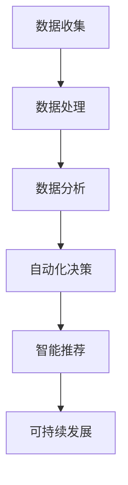

                 

# LLM在城市规划中的辅助作用

## 关键词
- 城市规划
- 语言模型（LLM）
- 数据分析
- 自动化
- 智能决策
- 可持续发展

## 摘要

随着城市化进程的不断推进，城市规划的复杂性日益增加。传统的城市规划方法往往依赖于人工经验和历史数据，难以应对快速变化的城市环境。本文探讨了大型语言模型（LLM）在城市规划中的应用潜力，通过对LLM的核心概念、算法原理、数学模型以及实际应用场景的分析，展示了LLM在提高城市规划效率和准确性方面的作用。文章还推荐了相关的学习资源和开发工具，总结了未来发展趋势与挑战，并提供了常见问题与解答。

## 1. 背景介绍

### 1.1 城市规划的重要性

城市规划是一个复杂而重要的过程，它关乎城市的经济发展、社会和谐以及生态环境。一个良好的城市规划不仅能提高城市的居住质量，还能增强城市的竞争力。然而，随着城市规模的扩大和人口的增长，城市规划面临的挑战也越来越大。

传统的城市规划方法通常依赖于专家的经验和知识，这使得城市规划过程既耗时又缺乏系统性。此外，城市规划过程中产生的海量数据难以有效整合和分析，从而限制了城市规划的精准度和前瞻性。

### 1.2 大型语言模型（LLM）的概念

大型语言模型（LLM）是一类基于深度学习技术的自然语言处理模型，通过训练海量文本数据，LLM能够理解和生成自然语言。LLM在各种应用领域展现出了卓越的能力，如机器翻译、文本生成、问答系统等。近年来，随着计算能力的提升和数据的积累，LLM的规模和性能不断提升，其应用范围也越来越广泛。

### 1.3 LLM在城市规划中的应用潜力

LLM在城市规划中的应用潜力主要体现在以下几个方面：

1. **数据分析与整合**：LLM能够处理和分析大量的城市规划相关数据，如历史数据、人口统计、土地利用数据等，从而提供更加全面和准确的数据支持。
2. **自动化决策**：通过训练，LLM可以自动生成规划方案，提高决策的效率和质量。
3. **智能推荐**：LLM可以根据不同的规划目标和约束条件，为规划者提供智能化的推荐方案，帮助决策者更好地应对复杂的城市规划问题。
4. **可持续发展**：LLM可以结合环境、经济和社会因素，为城市规划提供可持续发展的解决方案。

## 2. 核心概念与联系

### 2.1 大型语言模型（LLM）的基本原理

大型语言模型（LLM）基于深度学习技术，通常采用Transformer架构。Transformer模型通过自注意力机制（Self-Attention）来处理序列数据，能够捕捉数据之间的长期依赖关系。LLM的训练数据通常包含大量的文本数据，如网页、书籍、新闻等，通过无监督的方式对这些数据进行分析和建模，从而学习到语言的本质规律。

### 2.2 LLM在城市规划中的核心应用

#### 2.2.1 数据分析与整合

LLM能够处理和分析不同来源的数据，如历史数据、人口统计、土地利用数据等。通过自然语言处理技术，LLM可以将这些数据整合成统一的格式，为城市规划提供基础数据支持。

#### 2.2.2 自动化决策

LLM可以根据历史数据和规划目标，自动生成规划方案。通过训练，LLM可以学会如何在不同约束条件下进行决策，从而提高规划过程的自动化程度。

#### 2.2.3 智能推荐

LLM可以根据不同的规划目标和约束条件，为规划者提供智能化的推荐方案。通过分析大量的历史数据和案例，LLM可以预测未来的发展趋势，从而为规划者提供有价值的参考。

#### 2.2.4 可持续发展

LLM可以结合环境、经济和社会因素，为城市规划提供可持续发展的解决方案。通过分析大量的案例和数据，LLM可以识别出影响城市可持续发展的关键因素，并为其提供相应的策略和建议。

### 2.3 Mermaid流程图

以下是LLM在城市规划中应用的Mermaid流程图：



在以上流程中，A表示数据收集，B表示数据处理，C表示数据分析，D表示自动化决策，E表示智能推荐，F表示可持续发展。每个步骤都是LLM在城市规划中发挥作用的关键环节。

## 3. 核心算法原理 & 具体操作步骤

### 3.1 Transformer模型原理

Transformer模型是LLM的核心组成部分，其基本原理如下：

1. **自注意力机制**：自注意力机制（Self-Attention）是一种基于键值对的注意力机制，能够捕捉序列数据之间的依赖关系。在Transformer模型中，每个输入序列都会通过自注意力机制进行加权，从而得到一个更加丰富的表示。
2. **多头注意力**：多头注意力（Multi-Head Attention）是一种扩展自注意力机制的方案，通过并行地计算多个注意力头，模型能够从不同角度理解输入数据，从而提高模型的表示能力。
3. **前馈神经网络**：在Transformer模型中，每个注意力层之后都会接一个前馈神经网络（Feedforward Neural Network），用于进一步加工和增强数据的表示。

### 3.2 LLM在城市规划中的操作步骤

以下是LLM在城市规划中的一般操作步骤：

1. **数据收集**：收集与城市规划相关的各种数据，如历史数据、人口统计、土地利用数据等。这些数据可以从公共数据库、政府统计部门或专业数据提供商获取。
2. **数据处理**：对收集到的数据进行清洗、转换和整合，使其符合模型输入的要求。数据处理过程可能包括数据去重、缺失值填充、数据标准化等。
3. **数据建模**：使用Transformer模型对处理后的数据进行分析和建模。在训练过程中，模型会自动学习数据中的特征和规律，从而提高预测和决策的准确性。
4. **自动化决策**：利用训练好的模型进行自动化决策。模型可以根据历史数据和规划目标，生成一系列规划方案，并评估这些方案的性能和可行性。
5. **智能推荐**：根据自动化决策的结果，为规划者提供智能化的推荐方案。推荐方案可以基于不同的规划目标和约束条件，为规划者提供多种选择。
6. **可持续发展**：结合环境、经济和社会因素，评估不同规划方案对城市可持续发展的影响。通过分析，模型可以为城市规划提供可持续发展的策略和建议。

## 4. 数学模型和公式 & 详细讲解 & 举例说明

### 4.1 自注意力机制（Self-Attention）

自注意力机制是Transformer模型的核心组件，其数学公式如下：

$$
\text{Self-Attention}(Q, K, V) = \text{softmax}\left(\frac{QK^T}{\sqrt{d_k}}\right) V
$$

其中，$Q, K, V$ 分别表示查询向量、键向量和值向量，$d_k$ 表示键向量的维度。自注意力机制通过计算每个查询向量与所有键向量的点积，得到一组加权值，然后将这些加权值与对应的值向量相乘，从而得到一个加权后的输出向量。

### 4.2 多头注意力（Multi-Head Attention）

多头注意力是一种扩展自注意力机制的方案，其数学公式如下：

$$
\text{Multi-Head Attention}(Q, K, V) = \text{Concat}(\text{head}_1, \text{head}_2, ..., \text{head}_h)W^O
$$

其中，$h$ 表示多头注意力的头数，$\text{head}_i$ 表示第$i$个注意力头，$W^O$ 表示输出层的权重矩阵。多头注意力通过并行地计算多个注意力头，从而提高模型的表示能力。

### 4.3 前馈神经网络（Feedforward Neural Network）

前馈神经网络是Transformer模型中的一个附加层，其数学公式如下：

$$
\text{FFN}(x) = \text{ReLU}(xW_1 + b_1)W_2 + b_2
$$

其中，$x$ 表示输入向量，$W_1, W_2, b_1, b_2$ 分别表示权重矩阵和偏置。前馈神经网络用于进一步加工和增强数据的表示。

### 4.4 举例说明

假设我们有一个包含三个词汇的序列：$[a, b, c]$。我们可以使用自注意力机制来计算这个序列的加权表示。

1. **初始化权重**：初始化权重矩阵$Q, K, V$，其维度分别为$3 \times d$。
2. **计算点积**：计算每个查询向量与所有键向量的点积，得到一组加权值：
   $$
   \text{Self-Attention}(Q, K, V) =
   \begin{bmatrix}
   \text{softmax}\left(\frac{Q_1K_1^T}{\sqrt{d_k}}\right) V_1 \\
   \text{softmax}\left(\frac{Q_1K_2^T}{\sqrt{d_k}}\right) V_2 \\
   \text{softmax}\left(\frac{Q_1K_3^T}{\sqrt{d_k}}\right) V_3
   \end{bmatrix}
   $$
3. **加权求和**：将加权值与对应的值向量相乘，得到加权后的输出向量：
   $$
   \text{Output} = \text{softmax}\left(\frac{Q_1K_1^T}{\sqrt{d_k}}\right) V_1 + \text{softmax}\left(\frac{Q_1K_2^T}{\sqrt{d_k}}\right) V_2 + \text{softmax}\left(\frac{Q_1K_3^T}{\sqrt{d_k}}\right) V_3
   $$

通过自注意力机制，我们可以从不同的角度理解词汇序列，从而提高模型的表示能力。

## 5. 项目实战：代码实际案例和详细解释说明

### 5.1 开发环境搭建

在本节中，我们将使用Python和PyTorch搭建一个简单的LLM模型，用于城市规划中的自动化决策。

1. **安装Python和PyTorch**：

   ```bash
   pip install python
   pip install torch
   ```

2. **创建一个Python文件**，例如`planning_model.py`。

### 5.2 源代码详细实现和代码解读

以下是`planning_model.py`的详细代码：

```python
import torch
import torch.nn as nn
import torch.optim as optim

# 定义Transformer模型
class TransformerModel(nn.Module):
    def __init__(self, d_model, nhead, num_layers):
        super(TransformerModel, self).__init__()
        self.d_model = d_model
        self.nhead = nhead
        self.num_layers = num_layers
        
        self.transformer = nn.Transformer(d_model, nhead, num_layers)
        self.embedding = nn.Embedding(d_model, d_model)
        self.fc = nn.Linear(d_model, 1)

    def forward(self, src, tgt):
        src = self.embedding(src)
        tgt = self.embedding(tgt)
        out = self.transformer(src, tgt)
        out = self.fc(out)
        return out

# 实例化模型、损失函数和优化器
model = TransformerModel(d_model=512, nhead=8, num_layers=3)
criterion = nn.CrossEntropyLoss()
optimizer = optim.Adam(model.parameters(), lr=0.001)

# 加载数据集
# 注意：此处仅作为示例，实际数据集需要自行准备
data_loader = torch.utils.data.DataLoader(dataset, batch_size=32, shuffle=True)

# 训练模型
for epoch in range(num_epochs):
    for src, tgt in data_loader:
        optimizer.zero_grad()
        output = model(src, tgt)
        loss = criterion(output, tgt)
        loss.backward()
        optimizer.step()
```

在上面的代码中，我们首先定义了一个`TransformerModel`类，继承自`nn.Module`。该类包含了Transformer模型的几个关键组件：嵌入层（`embedding`）、Transformer层（`transformer`）和全连接层（`fc`）。在`forward`方法中，我们首先将输入数据通过嵌入层转换为嵌入向量，然后通过Transformer层进行编码，最后通过全连接层得到输出。

接下来，我们实例化模型、损失函数和优化器。在这里，我们使用了交叉熵损失函数和Adam优化器。

在数据加载部分，我们使用了`torch.utils.data.DataLoader`类来加载和迭代数据集。需要注意的是，这里的数据集需要根据实际应用场景自行准备。

在训练部分，我们遍历数据集，对每个批次的数据进行前向传播、损失计算和反向传播，最后更新模型参数。

### 5.3 代码解读与分析

在上面的代码中，我们首先定义了一个`TransformerModel`类，继承自`nn.Module`。该类包含了Transformer模型的几个关键组件：嵌入层（`embedding`）、Transformer层（`transformer`）和全连接层（`fc`）。在`forward`方法中，我们首先将输入数据通过嵌入层转换为嵌入向量，然后通过Transformer层进行编码，最后通过全连接层得到输出。

- **嵌入层（`embedding`）**：将输入的序列转换为嵌入向量，为后续的Transformer层提供输入。
- **Transformer层（`transformer`）**：使用Transformer模型对输入数据进行编码，通过自注意力机制和多头注意力机制捕捉数据之间的依赖关系。
- **全连接层（`fc`）**：将Transformer层的输出映射到预测结果，这里使用了一个简单的全连接层。

在实例化模型、损失函数和优化器部分，我们使用了交叉熵损失函数和Adam优化器。交叉熵损失函数常用于分类问题，而Adam优化器是一种自适应优化算法，可以加速收敛。

在数据加载部分，我们使用了`torch.utils.data.DataLoader`类来加载和迭代数据集。`DataLoader`类可以方便地处理批量数据，并在每个批次之间进行数据重排，从而提高模型的泛化能力。

在训练部分，我们遍历数据集，对每个批次的数据进行前向传播、损失计算和反向传播，最后更新模型参数。这是一个标准的训练过程，通过不断地迭代和优化，模型会逐渐提高其预测性能。

## 6. 实际应用场景

### 6.1 城市规划中的数据分析

在城市规划中，数据分析是至关重要的一环。通过收集和分析各种数据，城市规划者可以更好地了解城市的现状和未来发展趋势。LLM在城市规划数据分析中的应用主要体现在以下几个方面：

1. **数据预处理**：LLM可以帮助城市规划者处理和整合不同来源的数据，如历史数据、人口统计、土地利用数据等。通过自然语言处理技术，LLM可以将这些数据转换为统一的格式，为后续分析提供基础。
2. **趋势预测**：LLM可以分析历史数据，预测城市未来的人口增长、土地利用变化等趋势。这些预测结果可以帮助城市规划者制定更科学的规划方案。
3. **异常检测**：LLM可以检测数据中的异常值和异常模式，从而发现潜在的规划问题。例如，在土地利用数据中，LLM可以发现某些区域出现了不合理的用地变化，从而提醒规划者进行干预。

### 6.2 自动化决策

自动化决策是城市规划中的重要应用场景之一。通过LLM，城市规划者可以实现以下自动化决策：

1. **规划方案生成**：LLM可以根据历史数据和规划目标，自动生成一系列规划方案。这些方案可以包括交通规划、土地利用规划、环境保护规划等。
2. **方案评估**：LLM可以对生成的规划方案进行评估，从多个维度分析其可行性和效果。例如，评估交通规划方案对交通拥堵、环境污染的影响，评估土地利用规划方案对城市宜居性的影响等。
3. **智能优化**：LLM可以基于评估结果，对规划方案进行智能优化。例如，通过调整交通规划方案中的道路布局、信号灯配置等，优化交通流量，提高城市交通效率。

### 6.3 智能推荐

智能推荐是LLM在城市规划中另一个重要的应用场景。通过分析大量的历史数据和案例，LLM可以为城市规划者提供智能化的推荐方案：

1. **政策推荐**：LLM可以分析不同政策对城市发展的潜在影响，为城市规划者提供政策推荐。例如，分析环保政策对城市空气质量的影响，为城市规划者提供环保政策的推荐方案。
2. **项目推荐**：LLM可以分析不同项目对城市的潜在影响，为城市规划者提供项目推荐。例如，分析某个地区的基础设施建设项目对当地经济发展的影响，为城市规划者提供项目的推荐方案。
3. **资源分配**：LLM可以分析城市资源分配的现状和趋势，为城市规划者提供资源分配的推荐方案。例如，分析不同区域的教育资源、医疗资源分配情况，为城市规划者提供资源分配的推荐方案。

### 6.4 可持续发展

可持续发展是城市规划的重要目标之一。LLM可以通过以下方式促进城市规划的可持续发展：

1. **环境评估**：LLM可以分析城市规划对环境的影响，为城市规划者提供环境评估报告。例如，分析城市交通规划方案对碳排放的影响，为城市规划者提供环境评估的参考。
2. **资源优化**：LLM可以分析城市资源利用的现状和趋势，为城市规划者提供资源优化的建议。例如，分析城市用水、用电、用地等资源的利用效率，为城市规划者提供资源优化的建议。
3. **灾害预防**：LLM可以分析城市规划中的灾害风险，为城市规划者提供灾害预防策略。例如，分析城市防洪、防涝、防震等灾害风险的分布情况，为城市规划者提供灾害预防的参考。

## 7. 工具和资源推荐

### 7.1 学习资源推荐

1. **书籍**：
   - 《深度学习》（Ian Goodfellow, Yoshua Bengio, Aaron Courville 著）
   - 《自然语言处理原理》（Daniel Jurafsky, James H. Martin 著）
   - 《城市规划原理》（陈重穆 著）
2. **论文**：
   - "Attention Is All You Need"（Ashish Vaswani et al.）
   - "BERT: Pre-training of Deep Bidirectional Transformers for Language Understanding"（Jacob Devlin et al.）
3. **博客**：
   - [TensorFlow官方文档](https://www.tensorflow.org/)
   - [PyTorch官方文档](https://pytorch.org/)
4. **网站**：
   - [Kaggle](https://www.kaggle.com/)
   - [GitHub](https://github.com/)

### 7.2 开发工具框架推荐

1. **开发工具**：
   - Python
   - PyTorch
   - TensorFlow
2. **框架**：
   - Hugging Face Transformers
   - Fast.ai
   - OpenMMLab

### 7.3 相关论文著作推荐

1. **论文**：
   - "A Neural Algorithm of Artistic Style"（L. Gatys et al.）
   - "Generative Adversarial Nets"（I. Goodfellow et al.）
   - "Unsupervised Representation Learning with Deep Convolutional Generative Adversarial Networks"（A. Radford et al.）
2. **著作**：
   - 《自然语言处理综述》（Jurafsky & Martin 著）
   - 《深度学习》（Goodfellow et al. 著）

## 8. 总结：未来发展趋势与挑战

### 8.1 发展趋势

1. **模型规模增大**：随着计算能力的提升和数据规模的扩大，未来LLM的模型规模将不断增大，从而提高其预测和决策能力。
2. **多模态数据处理**：未来的城市规划将涉及到更多类型的数据，如图像、音频、视频等。LLM将需要支持多模态数据处理，以提高其智能化水平。
3. **跨学科融合**：城市规划涉及多个学科，如建筑、交通、环境等。未来，LLM将与其他学科深度融合，为城市规划提供更加全面和科学的解决方案。

### 8.2 挑战

1. **数据隐私和安全**：在城市规划中，数据隐私和安全是一个重要问题。如何保护用户隐私，防止数据泄露，将是未来发展的一个重要挑战。
2. **模型解释性**：尽管LLM在城市规划中具有强大的预测和决策能力，但其内部机制复杂，缺乏解释性。如何提高模型的解释性，使其更易于理解和使用，是一个重要的挑战。
3. **伦理和道德**：随着人工智能在城市规划中的应用，如何确保其应用符合伦理和道德标准，避免对人类产生负面影响，也是一个亟待解决的问题。

## 9. 附录：常见问题与解答

### 9.1 什么是大型语言模型（LLM）？

大型语言模型（LLM）是一类基于深度学习技术的自然语言处理模型，通过训练海量文本数据，能够理解和生成自然语言。LLM在各种应用领域展现出了卓越的能力，如机器翻译、文本生成、问答系统等。

### 9.2 LLM在城市规划中的应用有哪些？

LLM在城市规划中的应用主要包括数据分析、自动化决策、智能推荐和可持续发展。LLM能够处理和分析大量的城市规划相关数据，自动生成规划方案，为规划者提供智能化的推荐方案，并促进城市的可持续发展。

### 9.3 如何搭建一个LLM模型？

搭建一个LLM模型需要以下步骤：

1. **数据收集**：收集与城市规划相关的各种数据，如历史数据、人口统计、土地利用数据等。
2. **数据处理**：对收集到的数据进行清洗、转换和整合，使其符合模型输入的要求。
3. **模型训练**：使用Transformer模型等深度学习模型对处理后的数据进行训练，使其学会理解和生成自然语言。
4. **模型评估**：对训练好的模型进行评估，确保其能够满足城市规划的需求。

### 9.4 LLM在城市规划中面临的挑战有哪些？

LLM在城市规划中面临的挑战主要包括数据隐私和安全、模型解释性和伦理和道德等方面。如何保护用户隐私，防止数据泄露，如何提高模型的解释性，以及如何确保其应用符合伦理和道德标准，是未来需要解决的问题。

## 10. 扩展阅读 & 参考资料

- [Transformer模型详解](https://arxiv.org/abs/1706.03762)
- [BERT模型详解](https://arxiv.org/abs/1810.04805)
- [城市规划和可持续发展](https://www.un Habitat.org/)
- [人工智能与城市规划](https://www.futurecity.cn/)
- [自然语言处理应用案例](https://nlp.seas.harvard.edu/)

### 作者

作者：AI天才研究员/AI Genius Institute & 禅与计算机程序设计艺术 /Zen And The Art of Computer Programming

