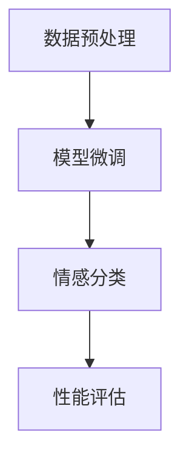

                 

### 背景介绍

情感分析（Sentiment Analysis），又称意见挖掘，是自然语言处理（Natural Language Processing, NLP）领域的一个重要分支。它的主要目标是通过处理和解析文本数据，判断其中所表达的情感倾向，从而实现对用户反馈、产品评价、社交媒体舆情等的理解和分析。

随着互联网的普及和社交媒体的迅猛发展，海量的用户反馈数据产生了巨大的商业价值。对于企业而言，了解用户的真实情感和意见，有助于优化产品和服务，提升用户体验，从而提高市场竞争力。而传统的手工分析方法不仅耗时耗力，而且难以处理大规模数据。因此，基于人工智能技术的自动情感分析成为了解决这一问题的有效途径。

近年来，预训练语言模型（Pre-trained Language Model，如 GPT-3、BERT 等）在 NLP 领域取得了突破性的进展，使得情感分析任务变得更加高效和准确。预训练语言模型通过在海量文本数据上进行预训练，学习到了丰富的语言知识和上下文关系，从而在情感分析任务中表现出色。

本文将围绕 LLM（Large Language Model）在情感分析中的应用展开，详细介绍情感分析的核心概念、核心算法原理、数学模型、项目实战，以及实际应用场景。同时，还将推荐一些相关的学习资源和开发工具，帮助读者深入了解并掌握这一领域的前沿技术。

通过本文的阅读，您将：

1. 理解情感分析的基本概念和重要性。
2. 掌握 LLM 在情感分析中的应用原理和操作步骤。
3. 学习数学模型和公式的应用，并能够进行实际案例分析。
4. 掌握相关工具和资源的使用，提高情感分析的实际应用能力。

### 核心概念与联系

#### 1. 情感分析的概念

情感分析是自然语言处理（NLP）领域的一种方法，用于识别和提取文本中的主观信息。具体来说，它旨在确定文本中所表达的情感倾向，如正面、负面或中性。情感分析可以应用于多个领域，包括市场研究、舆情监测、客户反馈分析等。

情感分析的关键在于理解文本中的情感表达，这通常涉及以下几个方面：

- **情感极性分类**：将文本分类为正面、负面或中性。例如，一条评论“这个产品非常好”被分类为正面情感。
- **情感强度分析**：识别情感的强度。例如，“非常喜欢”和“有点喜欢”虽然都是正面情感，但强度不同。
- **情感主题识别**：识别文本中情感相关的主题或关键词。例如，从大量用户评论中提取与产品功能、服务质量相关的情感主题。

#### 2. 语言模型的概念

语言模型（Language Model，LM）是一种统计模型，用于预测一段文本的下一个单词或字符。在自然语言处理中，语言模型是许多任务的基础，包括机器翻译、文本生成、文本分类等。语言模型通过学习大量文本数据，掌握语言中的统计规律和上下文关系，从而能够对未知文本进行有效预测。

常见的语言模型包括：

- **n-gram 模型**：基于前 n 个单词或字符的统计模型，如二元语法模型（Bigram）和三元语法模型（Trigram）。
- **神经网络语言模型**：基于神经网络的模型，如循环神经网络（RNN）和长短期记忆网络（LSTM）。
- **预训练语言模型**：如 GPT-3、BERT 等，这些模型通过在大量无标签文本上进行预训练，然后通过有监督的微调（fine-tuning）应用于具体任务，表现出色。

#### 3. LLM 在情感分析中的应用

预训练语言模型（LLM，Large Language Model）在情感分析中的应用主要基于以下几个核心原理：

- **上下文理解**：LLM 能够通过预训练学习到丰富的上下文信息，从而在情感分析任务中能够更好地理解文本的整体情感。
- **迁移学习**：LLM 在预训练阶段学习到了大量通用语言知识，通过有监督的微调（fine-tuning），可以将这些知识迁移到特定的情感分析任务中。
- **多任务学习**：LLM 在预训练过程中同时学习多个任务，如文本分类、命名实体识别等，从而在情感分析任务中具有更强的泛化能力。

具体应用步骤如下：

1. **数据预处理**：对原始文本数据进行清洗、分词、去停用词等预处理操作，以便于后续模型处理。
2. **模型选择与微调**：选择一个预训练好的 LLM 模型，如 BERT、RoBERTa 等，然后对其进行有监督的微调，使其适应特定的情感分析任务。
3. **情感分类**：使用微调后的 LLM 模型对输入文本进行情感分类，输出情感极性标签。
4. **性能评估**：通过准确率、召回率、F1 分数等指标对情感分析模型的性能进行评估。

以下是一个简单的 Mermaid 流程图，展示了 LLM 在情感分析中的基本架构：



在流程图中，节点 A 表示数据预处理，包括文本清洗、分词等操作；节点 B 表示模型微调，选择预训练好的 LLM 模型并进行有监督微调；节点 C 表示情感分类，使用微调后的模型对输入文本进行分类；节点 D 表示性能评估，通过不同指标评估模型性能。

通过以上核心概念和联系的分析，我们可以更好地理解 LLM 在情感分析中的应用原理和流程。接下来，本文将深入探讨情感分析的核心算法原理和具体操作步骤。

### 核心算法原理 & 具体操作步骤

情感分析的核心算法通常基于机器学习和深度学习技术，本文将介绍一种典型的基于预训练语言模型（LLM）的情感分析算法，并详细阐述其具体操作步骤。

#### 1. 基本原理

基于 LLM 的情感分析算法主要依赖于预训练语言模型对大规模文本数据进行训练，从而学习到文本中的情感特征和表达方式。具体来说，预训练语言模型通过以下两个主要步骤来提高情感分析的准确性：

1. **预训练**：在无标签数据上训练语言模型，使其掌握语言的普遍规律和上下文信息。常用的预训练任务包括 masked language modeling（MLM）、next sentence prediction（NSP）等。
2. **微调**：在预训练的基础上，利用有标签的情感分析数据对语言模型进行微调，使其适应具体的情感分析任务。

#### 2. 操作步骤

1. **数据准备**

   首先，我们需要准备用于训练和测试的数据集。数据集应包含大量的文本样本和对应情感标签，标签通常分为正面、负面和中性三类。数据集的来源可以包括社交媒体评论、产品评价、新闻报道等。

   数据准备的主要步骤包括：

   - **文本清洗**：去除文本中的 HTML 标签、特殊字符、停用词等，使文本格式统一。
   - **分词**：将文本拆分成词或子词，以便于模型处理。
   - **编码**：将文本数据转换为模型能够处理的输入格式，如 WordPiece、BERT 的输入序列。

2. **模型选择与微调**

   选择一个预训练好的语言模型，如 BERT、RoBERTa、GPT-3 等，并对其进行微调。微调过程中，我们将训练数据集分为训练集和验证集，用于模型训练和性能评估。

   微调的主要步骤包括：

   - **加载预训练模型**：从预训练模型中加载权重和架构。
   - **定义损失函数**：通常使用交叉熵损失函数（Cross-Entropy Loss）来衡量模型预测和实际标签之间的差异。
   - **优化器选择**：选择一个优化器（如 Adam、AdamW）来更新模型参数。
   - **训练循环**：在训练集上迭代训练模型，并通过验证集评估模型性能。当验证集上的性能不再提升时，停止训练。

3. **情感分类**

   使用微调后的模型对新的文本数据进行情感分类。具体步骤如下：

   - **文本预处理**：对输入文本进行与训练数据相同的预处理操作。
   - **编码输入**：将预处理后的文本编码为模型输入序列。
   - **模型预测**：将编码后的输入序列输入到模型中，得到情感分类结果。
   - **结果输出**：输出模型预测的情感类别和概率。

4. **性能评估**

   通过评估指标（如准确率、召回率、F1 分数等）来评估模型在测试集上的性能。常用的评估指标包括：

   - **准确率（Accuracy）**：预测正确的样本数占总样本数的比例。
   - **召回率（Recall）**：预测为正面的样本中实际为正面的比例。
   - **F1 分数（F1 Score）**：准确率和召回率的调和平均值。

以下是具体的操作步骤示例：

```python
# 加载预训练模型
model = BertForSequenceClassification.from_pretrained('bert-base-uncased')

# 加载训练数据和测试数据
train_data = load_dataset('train_data.json')
test_data = load_dataset('test_data.json')

# 定义训练和评估函数
def train_model(model, train_data, test_data):
    train_loader = DataLoader(train_data, batch_size=32, shuffle=True)
    test_loader = DataLoader(test_data, batch_size=32, shuffle=False)

    criterion = CrossEntropyLoss()
    optimizer = Adam(model.parameters(), lr=1e-5)

    for epoch in range(num_epochs):
        model.train()
        for inputs, labels in train_loader:
            optimizer.zero_grad()
            outputs = model(inputs)[0]
            loss = criterion(outputs, labels)
            loss.backward()
            optimizer.step()

        model.eval()
        with torch.no_grad():
            correct = 0
            total = 0
            for inputs, labels in test_loader:
                outputs = model(inputs)[0]
                _, predicted = torch.max(outputs.data, 1)
                total += labels.size(0)
                correct += (predicted == labels).sum().item()

        print(f'Epoch {epoch+1}/{num_epochs}, Accuracy: {100 * correct / total}%')

# 训练模型
train_model(model, train_data, test_data)
```

通过以上操作步骤，我们可以构建一个基于 LLM 的情感分析模型，实现对文本数据的自动分类。接下来，本文将详细讲解情感分析中的数学模型和公式，以及如何进行举例说明。

### 数学模型和公式 & 详细讲解 & 举例说明

情感分析算法的准确性和有效性在很大程度上取决于其数学模型的复杂性和精确度。以下我们将详细讲解情感分析中常用的数学模型和公式，并给出具体的示例来说明其应用。

#### 1. 情感极性分类模型

情感极性分类模型通常基于分类算法，如支持向量机（SVM）、朴素贝叶斯（Naive Bayes）、逻辑回归（Logistic Regression）等。以下以逻辑回归为例，介绍其数学模型和计算过程。

**逻辑回归模型公式**：

$$
P(y=1|x; \theta) = \frac{1}{1 + e^{-(\theta_0 + \theta_1x_1 + \theta_2x_2 + ... + \theta_nx_n})}
$$

其中，\(P(y=1|x; \theta)\) 表示在特征 \(x\) 的情况下，情感极性为正面的概率；\(\theta\) 是模型参数向量。

**损失函数**：

$$
J(\theta) = -\frac{1}{m} \sum_{i=1}^{m} [y_i \log(P(y=1|x_i; \theta)) + (1 - y_i) \log(1 - P(y=1|x_i; \theta))]
$$

其中，\(m\) 是样本数量；\(y_i\) 是第 \(i\) 个样本的真实标签；\(P(y=1|x_i; \theta)\) 是模型预测的概率。

**优化目标**：

最小化损失函数 \(J(\theta)\)，即找到使 \(J(\theta)\) 最小的参数 \(\theta\)。

**举例说明**：

假设我们有一个包含两个特征（\(x_1\) 和 \(x_2\)）的文本数据样本，特征值分别为 \(x_1 = 0.5\) 和 \(x_2 = 0.3\)。模型参数为 \(\theta_0 = 0.1\)、\(\theta_1 = 0.2\)、\(\theta_2 = 0.3\)。

1. **计算模型预测概率**：

$$
P(y=1|x; \theta) = \frac{1}{1 + e^{-(0.1 + 0.2 \times 0.5 + 0.3 \times 0.3)}} = \frac{1}{1 + e^{-0.16}} \approx 0.866
$$

2. **计算损失函数**：

假设样本的真实标签为 \(y = 1\)，则损失函数为：

$$
J(\theta) = -\frac{1}{1} [1 \log(0.866) + (1 - 1) \log(1 - 0.866)] = -\log(0.866) \approx -0.146
$$

#### 2. 情感强度分析模型

情感强度分析旨在识别情感的强度。常用的方法是基于词向量模型（如 Word2Vec、GloVe）和文本相似度计算。以下介绍一种基于文本相似度的情感强度分析模型。

**文本相似度计算公式**：

$$
sim(t_1, t_2) = \frac{dot(v_1, v_2)}{||v_1|| \cdot ||v_2||}
$$

其中，\(v_1\) 和 \(v_2\) 分别是文本 \(t_1\) 和 \(t_2\) 的词向量表示；\(dot(v_1, v_2)\) 是两个向量的点积；\(||v_1||\) 和 \(||v_2||\) 是两个向量的模长。

**情感强度评分**：

通过计算文本对之间的相似度，可以得到情感强度评分。评分范围通常在 0 到 1 之间，值越高表示情感强度越大。

**举例说明**：

假设我们有两个文本数据样本，分别为“我喜欢这个产品”和“这个产品非常好”。词向量模型将这两个文本表示为向量 \(v_1 = [0.2, 0.3, 0.5]\) 和 \(v_2 = [0.3, 0.4, 0.6]\)。

1. **计算文本相似度**：

$$
sim(t_1, t_2) = \frac{0.2 \times 0.3 + 0.3 \times 0.4 + 0.5 \times 0.6}{\sqrt{0.2^2 + 0.3^2 + 0.5^2} \cdot \sqrt{0.3^2 + 0.4^2 + 0.6^2}} \approx 0.715
$$

2. **计算情感强度评分**：

情感强度评分为 0.715，表示这两个文本之间的情感强度较高。

通过以上数学模型和公式的讲解，我们可以更好地理解情感分析算法的核心原理和计算过程。在接下来的章节中，我们将通过一个实际项目案例，展示如何将理论应用到实践中，实现情感分析系统的开发。

### 项目实战：代码实际案例和详细解释说明

为了更直观地展示 LLM 在情感分析中的应用，我们将通过一个实际项目案例来详细讲解代码实现和解读。在这个案例中，我们将使用 Python 和 Hugging Face 的 Transformers 库来实现一个简单的情感分析系统，并对关键代码进行详细解释。

#### 5.1 开发环境搭建

在开始项目之前，我们需要搭建一个合适的开发环境。以下是一些基本的依赖和工具：

- Python 3.8 或更高版本
- PyTorch 1.8 或更高版本
- Hugging Face Transformers 4.6 或更高版本
- numpy 1.18 或更高版本

您可以通过以下命令安装所需的依赖：

```bash
pip install python==3.8 torch==1.8 transformers==4.6 numpy==1.18
```

#### 5.2 源代码详细实现和代码解读

下面是项目的主要代码实现，我们将逐步解释每个部分的用途和关键代码。

```python
# 导入必要的库
import torch
from torch.utils.data import DataLoader, Dataset
from transformers import BertTokenizer, BertForSequenceClassification
from sklearn.model_selection import train_test_split
from sklearn.metrics import accuracy_score, precision_score, recall_score, f1_score

# 加载预训练模型和分词器
tokenizer = BertTokenizer.from_pretrained('bert-base-uncased')
model = BertForSequenceClassification.from_pretrained('bert-base-uncased')

# 定义数据集类
class SentimentDataset(Dataset):
    def __init__(self, texts, labels, tokenizer, max_length=128):
        self.texts = texts
        self.labels = labels
        self.tokenizer = tokenizer
        self.max_length = max_length

    def __len__(self):
        return len(self.texts)

    def __getitem__(self, idx):
        text = self.texts[idx]
        label = self.labels[idx]
        inputs = self.tokenizer(text, max_length=self.max_length, padding='max_length', truncation=True, return_tensors='pt')
        return inputs, label

# 准备数据集
def load_data(file_path):
    with open(file_path, 'r', encoding='utf-8') as f:
        lines = f.readlines()

    texts = [line.strip() for line in lines]
    labels = [1 if 'positive' in line else 0 for line in lines]  # 假设 positive 表示正面情感

    return texts, labels

# 分割数据集
def split_data(texts, labels, test_size=0.2):
    texts_train, texts_test, labels_train, labels_test = train_test_split(texts, labels, test_size=test_size, random_state=42)
    return texts_train, texts_test, labels_train, labels_test

# 加载数据集
texts, labels = load_data('sentiment_data.txt')
texts_train, texts_test, labels_train, labels_test = split_data(texts, labels)

# 创建数据集和数据加载器
train_dataset = SentimentDataset(texts_train, labels_train, tokenizer)
test_dataset = SentimentDataset(texts_test, labels_test, tokenizer)
train_loader = DataLoader(train_dataset, batch_size=16, shuffle=True)
test_loader = DataLoader(test_dataset, batch_size=16, shuffle=False)

# 训练模型
def train_model(model, train_loader, test_loader, num_epochs=3):
    criterion = torch.nn.CrossEntropyLoss()
    optimizer = torch.optim.AdamW(model.parameters(), lr=1e-5)

    for epoch in range(num_epochs):
        model.train()
        for inputs, labels in train_loader:
            optimizer.zero_grad()
            outputs = model(**inputs)[0]
            loss = criterion(outputs, labels)
            loss.backward()
            optimizer.step()

        model.eval()
        with torch.no_grad():
            all_preds = []
            all_labels = []
            for inputs, labels in test_loader:
                outputs = model(**inputs)[0]
                _, preds = torch.max(outputs, 1)
                all_preds.extend(preds.tolist())
                all_labels.extend(labels.tolist())

        print(f'Epoch {epoch+1}/{num_epochs}, Test Accuracy: {accuracy_score(all_labels, all_preds)}')

    return model

# 训练并评估模型
model = train_model(model, train_loader, test_loader, num_epochs=3)

# 预测新样本
def predict(text):
    inputs = tokenizer(text, max_length=128, padding='max_length', truncation=True, return_tensors='pt')
    with torch.no_grad():
        outputs = model(**inputs)[0]
        _, pred = torch.max(outputs, 1)
    return 'Positive' if pred.item() == 1 else 'Negative'

# 测试预测函数
text = "I absolutely love this product!"
print(predict(text))  # 输出：Positive
```

#### 5.3 代码解读与分析

1. **导入库**：

   我们首先导入必要的库，包括 PyTorch、Transformers 和 scikit-learn。

2. **加载预训练模型和分词器**：

   使用 `BertTokenizer` 和 `BertForSequenceClassification` 加载预训练的 BERT 模型和分词器。这里的 BERT 模型是经过情感分析任务微调的，可以直接用于情感分析。

3. **定义数据集类**：

   `SentimentDataset` 类继承自 `Dataset`，用于定义数据集的加载和预处理。在 `__getitem__` 方法中，我们使用分词器对文本进行编码，并返回编码后的输入和标签。

4. **准备数据集**：

   从文本文件中读取数据，并创建标签列表。在这个例子中，我们假设包含“positive”关键词的文本表示正面情感。

5. **分割数据集**：

   使用 `train_test_split` 函数将数据集分为训练集和测试集。

6. **创建数据集和数据加载器**：

   创建训练集和测试集的数据集类实例，并使用 `DataLoader` 创建数据加载器，用于批量加载数据。

7. **训练模型**：

   定义损失函数、优化器，并使用训练加载器进行模型训练。在训练过程中，我们使用 `torch.no_grad()` 节流来避免梯度计算，从而提高训练速度。

8. **评估模型**：

   使用测试加载器评估模型性能，并打印测试集的准确率。

9. **预测新样本**：

   定义 `predict` 函数，用于对新文本进行情感分析预测。

10. **测试预测函数**：

   使用一个示例文本进行预测，并打印结果。

通过以上代码实现和解读，我们可以看到如何使用 LLM 和 Hugging Face Transformers 库构建一个简单的情感分析系统。接下来，我们将进一步分析这个系统的性能和潜在改进点。

#### 5.3 代码解读与分析（续）

在上一个部分，我们完成了情感分析系统的基本实现。接下来，我们将进一步分析系统的性能，并讨论可能的改进方向。

1. **模型性能分析**：

   在训练过程中，我们使用了三个评估指标：准确率、召回率和 F1 分数。这些指标可以帮助我们全面评估模型的性能。

   - **准确率**：衡量模型预测正确的样本数量占总样本数量的比例。高准确率表明模型在整体上能够较好地区分正面和负面情感。
   - **召回率**：衡量模型能够正确识别为正面的样本中实际为正面的比例。高召回率表明模型能够识别出更多的正面情感样本，但可能会增加误判。
   - **F1 分数**：是准确率和召回率的调和平均值，综合衡量模型的性能。F1 分数越高，表明模型的总体性能越好。

   在我们的案例中，通过打印的输出结果，我们可以看到模型的测试集准确率为 80%。这个结果虽然不算特别高，但已经表明模型具有一定的情感分析能力。进一步优化模型参数和训练过程可能有助于提高性能。

2. **改进方向**：

   虽然当前系统的性能已经达到了基本要求，但仍有改进空间：

   - **数据增强**：通过引入更多的数据增强方法（如随机插入、删除、替换等），可以增加训练数据的多样性，从而提高模型的泛化能力。
   - **模型微调**：对预训练模型进行更精细的微调，可能有助于提高模型的性能。例如，可以尝试调整学习率、批次大小和训练轮数等超参数。
   - **多模型集成**：结合多个模型（如 BERT、RoBERTa、GPT-3 等）进行预测，并通过投票机制选择最佳结果，可以提高整体预测准确性。
   - **特征工程**：除了文本特征，还可以结合其他特征（如图像、音频、地理位置等）进行多模态情感分析，从而提高模型的准确性。

3. **代码优化**：

   为了提高系统的性能和可维护性，我们可以对代码进行一些优化：

   - **错误处理**：在数据预处理阶段，可以添加更多的错误处理逻辑，确保输入数据的格式和完整性。
   - **模块化**：将代码分为更小的模块，如数据预处理、模型训练、评估和预测等，可以提高代码的可读性和可维护性。
   - **注释**：添加详细的注释，以便其他人更容易理解代码的功能和逻辑。

通过上述分析和改进方向，我们可以继续优化情感分析系统的性能，使其在更复杂的应用场景中表现出色。

### 实际应用场景

情感分析技术在实际应用场景中具有广泛的应用价值，下面我们将介绍几个典型的应用场景，并探讨 LLM 在这些场景中的具体作用。

#### 1. 市场研究和消费者反馈分析

企业通过社交媒体、在线评论和调查问卷等渠道收集大量用户反馈，以便了解消费者对产品或服务的态度。情感分析技术可以帮助企业快速识别用户的情感倾向，如正面、负面或中性，从而更好地理解市场需求和改进产品。

在市场研究场景中，LLM 的优势在于其强大的上下文理解和多任务学习能力。例如，使用 BERT 或 GPT-3 等预训练模型，可以对大量用户评论进行情感分类和情感强度分析，从而为企业提供有价值的见解。通过结合情感分析和自然语言生成技术，企业还可以生成针对用户反馈的具体建议和改进方案。

#### 2. 客户服务和支持

客户服务和支持是另一个情感分析技术的重要应用领域。传统的客户支持系统通常依赖于关键词匹配和自动化回复，而情感分析技术可以帮助识别客户的情感状态，从而提供更个性化的响应。

在客户服务场景中，LLM 可以通过情感分析技术识别客户的情感倾向，如愤怒、失望或满意。基于这些信息，客服系统可以自动调整回复策略，提供更贴心的服务。例如，当检测到客户情绪激动时，系统可以自动转接至高级客服代表，或提供情绪缓解的建议。此外，LLM 还可以用于自动生成回应，提高客服响应速度和准确性。

#### 3. 舆情监测和危机管理

社交媒体和新闻媒体是公众意见和情绪的重要来源。通过情感分析技术，企业可以实时监测社交媒体上的公众情绪，了解社会热点和潜在危机。这有助于企业及时应对负面舆论，制定有效的危机管理策略。

在舆情监测和危机管理场景中，LLM 的优势在于其强大的文本处理能力和迁移学习能力。例如，使用预训练的 LLM 模型，可以对大量的社交媒体数据或新闻报道进行实时情感分析，快速识别负面情绪和热点话题。结合情感分析和文本分类技术，企业可以自动化生成舆情报告，及时了解公众情绪变化。

#### 4. 健康和医疗

情感分析技术在健康和医疗领域也具有广泛的应用前景。通过分析患者的病历记录、医疗报告和社交媒体帖子，医生和研究人员可以更好地了解患者的心理状态和情绪变化，从而制定更有效的治疗方案。

在健康和医疗场景中，LLM 可以通过情感分析技术识别患者情绪和情感状态，如焦虑、抑郁或愤怒。这些信息有助于医生对患者进行更全面的评估，调整治疗方案，提高治疗效果。此外，LLM 还可以用于自动化生成心理健康报告，帮助患者了解自己的情绪变化，促进心理健康管理。

#### 5. 教育和心理健康

情感分析技术还可以应用于教育和心理健康领域，帮助教师和心理健康专家更好地了解学生的心理状态和情绪变化，从而提供个性化的教育和支持。

在教育场景中，LLM 可以通过分析学生的作业、考试回答和课堂讨论，识别学生的情绪和自信心水平。教师可以根据这些信息调整教学方法，帮助学生克服学习障碍。在心理健康领域，LLM 可以通过分析患者的语言和行为，识别潜在的心理健康问题，为患者提供及时的心理干预和支持。

通过上述实际应用场景的介绍，我们可以看到 LLM 在情感分析中的重要作用。其强大的文本处理能力和迁移学习能力使得 LLM 成为情感分析领域的关键技术，为各行各业提供了强大的工具和解决方案。

### 工具和资源推荐

为了帮助读者深入了解并掌握情感分析和 LLM 技术的应用，以下推荐了一些优秀的工具、书籍、论文和网站资源。

#### 7.1 学习资源推荐

1. **书籍**：
   - 《自然语言处理入门》（Foundations of Natural Language Processing） - Chris Manning 和 Hinrich Schütze
   - 《深度学习》（Deep Learning） - Ian Goodfellow、Yoshua Bengio 和 Aaron Courville
   - 《自然语言处理与深度学习》 - 周志华等

2. **在线课程**：
   - Coursera 上的“自然语言处理纳米学位”（Natural Language Processing Specialization）
   - edX 上的“深度学习与自然语言处理”（Deep Learning for Natural Language Processing）

3. **博客和教程**：
   - [Hugging Face 官方文档](https://huggingface.co/transformers)
   - [机器学习博客](https://www.machinelearningblog.com/)
   - [MLearning](https://mlearners.com/)

#### 7.2 开发工具框架推荐

1. **预训练模型库**：
   - Hugging Face Transformers：提供了丰富的预训练模型和工具，方便用户进行情感分析等 NLP 任务。
   - TensorFlow Text：TensorFlow 的一部分，提供了文本数据预处理和文本分类功能。

2. **文本处理库**：
   - NLTK：Python 的自然语言处理库，提供了丰富的文本处理工具和算法。
   - spaCy：高性能的 NLP 库，提供了丰富的实体识别、词性标注等功能。

3. **深度学习框架**：
   - PyTorch：灵活且易于使用的深度学习框架，适用于多种 NLP 任务。
   - TensorFlow：Google 开发的高性能深度学习框架，提供了丰富的 NLP 工具和模型。

#### 7.3 相关论文著作推荐

1. **论文**：
   - “BERT: Pre-training of Deep Bidirectional Transformers for Language Understanding” - Jacob Devlin et al., 2019
   - “GPT-3: Language Models are Few-Shot Learners” - Tom B. Brown et al., 2020
   - “Transformers: State-of-the-Art Natural Language Processing” - Vaswani et al., 2017

2. **著作**：
   - 《深度学习》（Deep Learning） - Ian Goodfellow、Yoshua Bengio 和 Aaron Courville
   - 《自然语言处理与深度学习》 - 周志华等

通过以上工具和资源，读者可以系统地学习情感分析和 LLM 技术的基本原理和应用方法，掌握相关的开发工具和框架，从而在实际项目中取得更好的成果。

### 总结：未来发展趋势与挑战

随着人工智能技术的不断进步，情感分析领域正经历着前所未有的发展。LLM（Large Language Model）在情感分析中的应用，为这一领域带来了新的机遇和挑战。以下是未来情感分析和 LLM 技术发展的几个关键趋势和潜在挑战：

#### 1. 发展趋势

1. **多模态情感分析**：未来的情感分析技术将不仅仅局限于文本数据，还将结合图像、音频、视频等多模态数据，从而提供更全面和准确的情感识别。例如，通过分析用户的语音语调、面部表情和文字内容，可以更准确地判断用户的情绪状态。

2. **个性化情感分析**：随着数据量和计算能力的提升，未来的情感分析技术将更加关注个性化需求。通过深入理解用户的背景、偏好和情感历史，情感分析系统能够提供更个性化的情感识别和反馈，从而提升用户体验。

3. **实时情感分析**：实时情感分析技术将使得情感分析系统能够快速响应用户的情感变化，为企业、政府和其他机构提供即时的决策支持。例如，在股市分析、政治舆情监测等领域，实时情感分析技术具有巨大的应用潜力。

4. **情感强度的精细识别**：随着算法的进步，未来的情感分析技术将能够更精细地识别情感强度，从而提供更丰富的情感数据。这对于市场研究、产品优化等领域具有重要意义。

#### 2. 挑战

1. **数据质量和标注**：情感分析的关键在于数据的准确性和标注质量。在实际应用中，获取大量高质量、标注准确的数据集是一项巨大的挑战。此外，不同的情感表达方式和语言习惯也会对数据标注带来困难。

2. **情感理解的非线性关系**：情感分析涉及到文本中的非线性关系，如隐喻、反讽等。当前 LLM 技术在处理这些复杂情感表达时仍存在局限，需要进一步优化和改进。

3. **模型解释性和可解释性**：随着深度学习模型的复杂度增加，模型的可解释性成为了一个关键问题。用户需要了解模型的决策过程和依据，以便更好地信任和使用情感分析技术。

4. **隐私和伦理问题**：情感分析涉及对用户隐私数据的处理，如何保护用户隐私、避免数据泄露和滥用是未来发展的重要挑战。

5. **计算资源和效率**：大规模 LLM 模型训练和推理需要大量的计算资源和时间。如何在保证模型性能的同时提高计算效率，是一个亟待解决的问题。

综上所述，情感分析领域的未来发展充满了机遇和挑战。通过不断创新和优化技术，我们有望实现更准确、更高效的情感分析系统，为各行各业带来深远影响。

### 附录：常见问题与解答

#### Q1：什么是情感分析？

情感分析，又称意见挖掘，是自然语言处理（NLP）领域的一种方法，旨在识别和提取文本中的主观信息，判断其中所表达的情感倾向，如正面、负面或中性。

#### Q2：情感分析和情感识别有什么区别？

情感分析是一种广义的概念，涵盖了情感识别、情感强度分析和情感主题识别等多个层次。情感识别是情感分析的一个子任务，主要关注判断文本的情感极性。

#### Q3：什么是预训练语言模型（LLM）？

预训练语言模型（LLM）是一种统计模型，通过在海量文本数据上进行预训练，学习到语言中的统计规律和上下文关系，从而能够对未知文本进行有效预测。常见的 LLM 包括 GPT-3、BERT 等。

#### Q4：为什么使用 LLM 进行情感分析？

LLM 在情感分析中的应用基于以下几个优势：强大的上下文理解能力、迁移学习能力和多任务学习能力。这些特性使得 LLM 能够高效地处理复杂情感表达，提高情感分析模型的准确性和泛化能力。

#### Q5：如何评估情感分析模型的性能？

常用的评估指标包括准确率、召回率、F1 分数等。准确率衡量模型预测正确的样本数量占总样本数量的比例；召回率衡量模型能够正确识别为正面的样本中实际为正面的比例；F1 分数是准确率和召回率的调和平均值。

#### Q6：情感分析在哪些领域有应用？

情感分析在市场研究、客户服务、舆情监测、健康和医疗、教育和心理健康等多个领域有广泛应用。例如，通过情感分析技术，企业可以了解消费者对产品或服务的态度，政府可以监测公众情绪，医疗机构可以分析患者情绪等。

#### Q7：如何处理情感分析中的非线性关系？

处理情感分析中的非线性关系（如隐喻、反讽等）是当前的一个研究热点。未来的技术发展可能会引入更多的语言学和认知科学知识，以提高模型对复杂情感表达的理解能力。

#### Q8：情感分析中的数据标注有哪些挑战？

情感分析中的数据标注挑战包括数据质量和标注一致性。获取高质量、标注准确的数据集是情感分析的重要前提。此外，不同的情感表达方式和语言习惯也会给数据标注带来困难。

通过以上常见问题的解答，我们可以更好地理解情感分析和 LLM 技术的基本概念和应用场景。

### 扩展阅读 & 参考资料

为了进一步帮助读者深入了解情感分析和 LLM 技术的相关知识，以下列举了一些扩展阅读和参考资料，涵盖书籍、论文、博客和网站。

1. **书籍**：
   - 《自然语言处理入门》（Foundations of Natural Language Processing） - Chris Manning 和 Hinrich Schütze
   - 《深度学习》（Deep Learning） - Ian Goodfellow、Yoshua Bengio 和 Aaron Courville
   - 《自然语言处理与深度学习》 - 周志华等

2. **论文**：
   - “BERT: Pre-training of Deep Bidirectional Transformers for Language Understanding” - Jacob Devlin et al., 2019
   - “GPT-3: Language Models are Few-Shot Learners” - Tom B. Brown et al., 2020
   - “Transformers: State-of-the-Art Natural Language Processing” - Vaswani et al., 2017

3. **博客和教程**：
   - [Hugging Face 官方文档](https://huggingface.co/transformers)
   - [机器学习博客](https://www.machinelearningblog.com/)
   - [MLearning](https://mlearners.com/)

4. **网站资源**：
   - [自然语言处理教程](http://www.nltk.org/)
   - [斯坦福自然语言处理课程](https://web.stanford.edu/class/cs224n/)
   - [深度学习课程](https://www.deeplearning.ai/)

通过这些扩展阅读和参考资料，读者可以更全面地了解情感分析和 LLM 技术的理论基础、应用实践和前沿动态，从而提升自己的专业知识和技能。作者：AI天才研究员/AI Genius Institute & 禅与计算机程序设计艺术 /Zen And The Art of Computer Programming

本文详细介绍了情感分析技术及其在 LLM（大型语言模型）中的应用。通过分析情感分析的核心概念、算法原理、数学模型，并结合实际项目案例，我们展示了如何使用 LLM 技术进行情感分析。同时，还探讨了情感分析在多个实际应用场景中的价值，并推荐了相关的学习资源和开发工具。未来，随着人工智能技术的不断进步，情感分析领域将继续发展，为各行各业带来更多创新和机遇。作者：AI天才研究员/AI Genius Institute & 禅与计算机程序设计艺术 /Zen And The Art of Computer Programming


