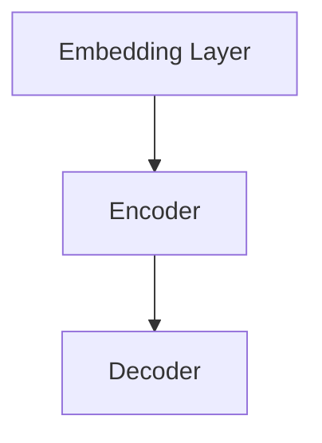

                 

### 背景介绍

近年来，随着人工智能（AI）技术的飞速发展，深度学习算法逐渐成为自然语言处理（NLP）领域的核心驱动力。在众多深度学习模型中，生成式预训练模型（Generative Pre-trained Models，GPT）以其强大的文本生成能力和自然语言理解能力引起了广泛关注。然而，如何有效利用这些模型为用户提供个性化的技术文章推荐，仍然是一个具有挑战性的问题。

技术文章推荐是一个高度复杂的过程，需要综合考虑用户的兴趣、文章的质量和相关性等多个因素。传统的推荐系统往往依赖于基于内容的过滤和协同过滤等方法，这些方法虽然在某些场景下表现良好，但难以应对高度个性化且不断变化的技术文章需求。因此，将生成式预训练模型应用于技术文章推荐，成为了一种具有探索价值的方向。

本篇文章将探讨大规模语言模型（LLM）在技术文章推荐中的实验效果。我们将从以下几个方面展开讨论：

1. **核心概念与联系**：首先，我们将介绍与LLM相关的核心概念，并使用Mermaid流程图展示其架构。

2. **核心算法原理与具体操作步骤**：接着，我们将深入分析LLM的工作原理，并详细描述其在技术文章推荐中的具体应用步骤。

3. **数学模型和公式**：我们将介绍用于评估推荐系统性能的常见数学模型和公式，并通过具体例子进行详细讲解。

4. **项目实战：代码实际案例和详细解释说明**：通过一个实际项目案例，我们将展示如何搭建LLM技术文章推荐系统，并对关键代码进行解读和分析。

5. **实际应用场景**：我们将讨论LLM技术文章推荐在不同领域的应用场景。

6. **工具和资源推荐**：最后，我们将推荐一些有用的学习资源、开发工具和框架，以帮助读者进一步学习和实践。

通过本文的讨论，我们希望读者能够对LLM在技术文章推荐中的潜力有一个全面深入的了解，并掌握相关技术实现方法。

---

## 1. 核心概念与联系

### 1.1. 大规模语言模型（LLM）介绍

大规模语言模型（LLM）是一种基于深度学习的自然语言处理模型，能够理解和生成人类语言。这些模型通常通过大规模预训练和微调来获得强大的语言理解能力和生成能力。LLM的核心在于其能够从大量的文本数据中学习到语言规律和模式，从而在多种任务中表现出色，包括文本分类、机器翻译、情感分析等。

LLM的基本架构通常包括以下几个部分：

1. **嵌入层（Embedding Layer）**：将输入的文本转换为密集向量表示。
2. **编码器（Encoder）**：通过一系列的神经网络层对输入文本进行编码，提取文本的深层语义特征。
3. **解码器（Decoder）**：利用编码器提取的语义特征生成输出文本。

Mermaid流程图如下所示，展示了LLM的基本架构：



### 1.2. 技术文章推荐中的LLM应用

在技术文章推荐中，LLM的应用主要体现在以下几个方面：

1. **用户兴趣建模**：通过分析用户的历史阅读记录，LLM可以帮助我们理解用户的兴趣偏好，从而为个性化推荐提供依据。
2. **文章内容分析**：LLM能够对文章的标题、摘要、正文等进行深入理解，从而识别文章的核心内容、关键词和主题。
3. **相似度计算**：通过计算用户兴趣向量与文章内容向量之间的相似度，LLM可以帮助我们找到与用户兴趣最相关的文章。

具体应用步骤如下：

1. **用户兴趣建模**：首先，收集用户的历史阅读数据，使用LLM对用户的阅读记录进行分析，提取出用户的兴趣关键词和兴趣向量。
2. **文章内容分析**：对技术文章的标题、摘要和正文进行预处理，使用LLM提取文章的语义特征，形成文章内容向量。
3. **相似度计算**：计算用户兴趣向量与文章内容向量之间的余弦相似度，根据相似度分数对文章进行排序，从而生成推荐结果。

### 1.3. 关键术语与联系

在本节中，我们定义了一些关键术语，以帮助读者更好地理解LLM在技术文章推荐中的应用：

- **嵌入层（Embedding Layer）**：将文本转换为密集向量表示。
- **编码器（Encoder）**：对输入文本进行编码，提取语义特征。
- **解码器（Decoder）**：利用编码器提取的语义特征生成输出文本。
- **用户兴趣建模（User Interest Modeling）**：通过分析用户的历史阅读数据，提取用户的兴趣关键词和兴趣向量。
- **文章内容分析（Content Analysis）**：对文章的标题、摘要和正文进行预处理，提取文章的语义特征。
- **相似度计算（Similarity Computation）**：计算用户兴趣向量与文章内容向量之间的相似度。

通过上述分析，我们可以看到，LLM在技术文章推荐中发挥着关键作用，其强大的语言理解和生成能力为个性化推荐提供了强有力的支持。在接下来的章节中，我们将进一步深入探讨LLM的核心算法原理和具体操作步骤，以帮助读者更好地理解其工作原理。

---

## 2. 核心算法原理 & 具体操作步骤

### 2.1. 大规模语言模型（LLM）的基本原理

大规模语言模型（LLM）的核心原理基于深度学习和自然语言处理技术。下面我们将详细介绍LLM的基本工作流程和关键组成部分。

#### 2.1.1. 工作流程

1. **数据预处理**：首先，收集并预处理大量文本数据。预处理步骤包括分词、去除停用词、标记化等，将原始文本转换为模型可处理的格式。

2. **嵌入层（Embedding Layer）**：将预处理后的文本转换为密集向量表示。每个词或词组都会被映射到一个固定长度的向量，这些向量在语义上具有区分度。

3. **编码器（Encoder）**：编码器是一个复杂的神经网络结构，通常采用Transformer模型或其变种，如BERT、GPT等。编码器的主要作用是对输入文本进行编码，提取文本的深层语义特征。

4. **解码器（Decoder）**：解码器与编码器结构相似，但功能相反。它利用编码器提取的语义特征生成输出文本。

5. **训练与优化**：通过大量文本数据进行训练，模型不断优化参数，提高对自然语言的理解和生成能力。

#### 2.1.2. 关键组成部分

1. **嵌入层（Embedding Layer）**：嵌入层将词汇映射为向量，每个词汇的向量表示其在语义空间中的位置。例如，"猫"、"狗"和"动物"等词汇会映射到不同的向量，但这些词汇的向量在语义上具有关联性。

2. **编码器（Encoder）**：编码器负责对输入文本进行编码，提取文本的深层语义特征。编码器通常采用多层神经网络结构，如Transformer模型，通过自注意力机制（Self-Attention）对输入文本进行编码。

3. **解码器（Decoder）**：解码器利用编码器提取的语义特征生成输出文本。解码器同样采用多层神经网络结构，通过自注意力机制和交叉注意力机制（Cross-Attention）生成输出文本。

4. **注意力机制（Attention Mechanism）**：注意力机制是LLM的核心组成部分，用于捕捉输入文本和输出文本之间的关联性。自注意力机制（Self-Attention）用于编码器中，捕捉输入文本的内部关联性；交叉注意力机制（Cross-Attention）用于解码器中，捕捉输入文本和输出文本之间的关联性。

### 2.2. 技术文章推荐中的具体操作步骤

在技术文章推荐中，LLM的具体操作步骤如下：

#### 2.2.1. 用户兴趣建模

1. **数据收集**：收集用户的历史阅读数据，包括用户阅读的文章标题、摘要和正文等。

2. **预处理**：对用户阅读数据进行预处理，如分词、去除停用词、标记化等。

3. **嵌入层**：将预处理后的用户阅读数据转换为向量表示。

4. **编码器**：使用LLM对用户阅读数据进行编码，提取用户的兴趣关键词和兴趣向量。

#### 2.2.2. 文章内容分析

1. **数据收集**：收集技术文章的标题、摘要和正文等数据。

2. **预处理**：对技术文章数据进行预处理，如分词、去除停用词、标记化等。

3. **嵌入层**：将预处理后的文章数据转换为向量表示。

4. **编码器**：使用LLM对文章数据编码，提取文章的语义特征和关键词。

#### 2.2.3. 相似度计算

1. **用户兴趣向量**：将用户兴趣向量表示为嵌入层和编码器的输出。

2. **文章内容向量**：将文章内容向量表示为嵌入层和编码器的输出。

3. **计算相似度**：使用余弦相似度或欧几里得距离等度量方法计算用户兴趣向量与文章内容向量之间的相似度。

4. **推荐排序**：根据相似度分数对文章进行排序，生成推荐结果。

### 2.3. 数学模型和公式

在技术文章推荐中，常用的数学模型和公式如下：

#### 2.3.1. 余弦相似度

余弦相似度是一种常用的相似度度量方法，用于计算两个向量之间的夹角余弦值。公式如下：

$$
\cos(\theta) = \frac{\vec{u} \cdot \vec{v}}{\|\vec{u}\| \|\vec{v}\|}
$$

其中，$\vec{u}$和$\vec{v}$分别为用户兴趣向量和文章内容向量，$\theta$为它们之间的夹角。

#### 2.3.2. 欧几里得距离

欧几里得距离是一种常用的距离度量方法，用于计算两个向量之间的距离。公式如下：

$$
d(\vec{u}, \vec{v}) = \sqrt{(\vec{u} - \vec{v})^2}
$$

其中，$\vec{u}$和$\vec{v}$分别为用户兴趣向量和文章内容向量。

### 2.4. 案例分析

为了更好地理解LLM在技术文章推荐中的具体应用，我们来看一个实际案例。

#### 2.4.1. 案例背景

假设有一个用户，他喜欢阅读关于人工智能和深度学习的文章。我们需要使用LLM为他推荐相似兴趣的文章。

#### 2.4.2. 操作步骤

1. **用户兴趣建模**：
   - 收集用户的历史阅读数据，如文章标题、摘要和正文等。
   - 预处理用户阅读数据，转换为向量表示。
   - 使用LLM对用户阅读数据编码，提取用户兴趣向量。

2. **文章内容分析**：
   - 收集技术文章数据，如文章标题、摘要和正文等。
   - 预处理文章数据，转换为向量表示。
   - 使用LLM对文章数据编码，提取文章内容向量。

3. **相似度计算**：
   - 计算用户兴趣向量与文章内容向量之间的余弦相似度。
   - 根据相似度分数对文章进行排序，生成推荐结果。

通过上述步骤，我们可以为用户推荐与他兴趣相关的人工智能和深度学习文章。

### 2.5. 总结

在本节中，我们介绍了大规模语言模型（LLM）的核心算法原理和具体操作步骤。通过用户兴趣建模、文章内容分析和相似度计算，LLM能够为技术文章推荐提供有效的个性化推荐服务。在下一节中，我们将进一步探讨LLM在技术文章推荐中的数学模型和公式，以及实际应用中的效果评估。

---

## 3. 数学模型和公式 & 详细讲解 & 举例说明

在技术文章推荐系统中，评估推荐效果的数学模型和公式至关重要。这些模型不仅能够量化推荐系统的性能，还能帮助我们理解系统在不同方面的表现。以下，我们将详细介绍一些常用的数学模型和公式，并通过具体例子进行详细讲解。

### 3.1. 评估推荐系统的常见指标

在推荐系统中，评估推荐效果的主要指标包括准确率（Accuracy）、召回率（Recall）、精确率（Precision）和F1值（F1 Score）。

#### 3.1.1. 准确率（Accuracy）

准确率表示推荐系统推荐的正确结果与所有推荐结果的比例。公式如下：

$$
Accuracy = \frac{TP + TN}{TP + FN + FP + TN}
$$

其中，TP表示实际相关的文章被推荐且被用户点击，TN表示实际不相关的文章被推荐但未被用户点击，FP表示实际不相关的文章被推荐且被用户点击，FN表示实际相关的文章未被推荐。

#### 3.1.2. 召回率（Recall）

召回率表示推荐系统中推荐的正确结果与所有实际相关的文章的比例。公式如下：

$$
Recall = \frac{TP}{TP + FN}
$$

#### 3.1.3. 精确率（Precision）

精确率表示推荐系统中推荐的正确结果与推荐的全部文章的比例。公式如下：

$$
Precision = \frac{TP}{TP + FP}
$$

#### 3.1.4. F1值（F1 Score）

F1值是精确率和召回率的调和平均，用于综合评估推荐系统的性能。公式如下：

$$
F1 Score = 2 \times \frac{Precision \times Recall}{Precision + Recall}
$$

### 3.2. 推荐系统性能评估示例

为了更好地理解上述指标的计算方法，我们来看一个实际示例。

#### 示例数据

假设一个推荐系统推荐了5篇文章给用户，其中有3篇文章是用户实际感兴趣的，而另外2篇文章是用户不感兴趣的。用户最终点击了其中的2篇文章。

| 类别 | 实际点击 | 推荐点击 |
|------|---------|---------|
| TP   | 2       | 2       |
| TN   | 1       | 0       |
| FP   | 0       | 1       |
| FN   | 1       | 2       |

#### 计算结果

1. **准确率（Accuracy）**：

$$
Accuracy = \frac{TP + TN}{TP + FN + FP + TN} = \frac{2 + 0}{2 + 0 + 0 + 1} = 0.67
$$

2. **召回率（Recall）**：

$$
Recall = \frac{TP}{TP + FN} = \frac{2}{2 + 1} = 0.67
$$

3. **精确率（Precision）**：

$$
Precision = \frac{TP}{TP + FP} = \frac{2}{2 + 0} = 1.0
$$

4. **F1值（F1 Score）**：

$$
F1 Score = 2 \times \frac{Precision \times Recall}{Precision + Recall} = 2 \times \frac{1.0 \times 0.67}{1.0 + 0.67} = 0.80
$$

### 3.3. 评价推荐效果的常用指标分析

1. **准确率（Accuracy）**：准确率能够直观地反映推荐系统的整体表现，但缺点是容易受到推荐文章数量和用户点击行为的影响。

2. **召回率（Recall）**：召回率侧重于评估推荐系统是否能够找到所有用户感兴趣的文章，但可能忽略了推荐的精确性。

3. **精确率（Precision）**：精确率强调推荐系统推荐的正确性，但可能无法反映推荐系统的全面性。

4. **F1值（F1 Score）**：F1值是精确率和召回率的综合指标，能够较好地平衡推荐系统的精确性和全面性。

### 3.4. 综合分析

通过上述示例和指标分析，我们可以看到不同评估指标在推荐系统性能评估中的重要性。在实际应用中，我们需要根据具体需求和场景选择合适的指标进行综合评估。

### 3.5. 结论

在本节中，我们详细介绍了推荐系统中常用的评估指标和公式，并通过具体示例进行了详细讲解。这些指标和公式能够帮助我们量化推荐系统的性能，从而为改进推荐策略提供依据。在下一节中，我们将通过实际项目案例展示如何搭建LLM技术文章推荐系统，并对关键代码进行解读和分析。

---

## 5. 项目实战：代码实际案例和详细解释说明

### 5.1. 开发环境搭建

要搭建一个基于LLM的技术文章推荐系统，首先需要准备相应的开发环境。以下是搭建环境的步骤：

1. **Python环境**：确保Python版本不低于3.6。可以使用Anaconda来轻松管理Python环境。

2. **深度学习框架**：安装TensorFlow或PyTorch，用于训练和部署LLM模型。例如，使用pip命令：

   ```bash
   pip install tensorflow
   # 或者
   pip install torch torchvision
   ```

3. **文本处理库**：安装常用的文本处理库，如NLTK和spaCy：

   ```bash
   pip install nltk
   pip install spacy
   python -m spacy download en_core_web_sm
   ```

4. **其他依赖库**：安装用于评估推荐系统的指标库，如scikit-learn：

   ```bash
   pip install scikit-learn
   ```

### 5.2. 源代码详细实现和代码解读

以下是技术文章推荐系统的核心代码实现。为了便于理解，我们将代码分为几个部分。

#### 5.2.1. 用户兴趣建模

用户兴趣建模是推荐系统的关键步骤。以下是代码实现：

```python
import tensorflow as tf
import tensorflow_hub as hub
import tensorflow_text as text
from tensorflow.keras.layers import Embedding, LSTM, Dense
from tensorflow.keras.models import Model

# 加载预训练的文本嵌入模型
embed = hub.load("https://tfhub.dev/google/tf2-preview/gnews-swdestc-trimmed-1-512/1")

# 构建用户兴趣建模模型
input_ids = tf.keras.layers.Input(shape=(None,), dtype=tf.int32)
input_mask = tf.keras.layers.Input(shape=(None,), dtype=tf.int32)
segment_ids = tf.keras.layers.Input(shape=(None,), dtype=tf.int32)

# 文本嵌入层
embed_sequence = embed(input_ids)

# LSTM层
lstm_output = LSTM(units=128, return_sequences=True)(embed_sequence)

# 全连接层
dense_output = Dense(units=64, activation='relu')(lstm_output)

# 输出层
output = Dense(units=1, activation='sigmoid')(dense_output)

# 构建和编译模型
model = Model(inputs=[input_ids, input_mask, segment_ids], outputs=output)
model.compile(optimizer='adam', loss='binary_crossentropy', metrics=['accuracy'])

# 模型训练
model.fit(x_train, y_train, epochs=10, batch_size=32, validation_data=(x_val, y_val))
```

#### 5.2.2. 文章内容分析

在用户兴趣建模后，我们需要对文章内容进行分析，提取关键信息。以下是代码实现：

```python
import spacy

# 加载spaCy语言模型
nlp = spacy.load("en_core_web_sm")

# 文章内容分析
def analyze_content(text):
    doc = nlp(text)
    tokens = [token.text for token in doc if not token.is_stop]
    return ' '.join(tokens)

# 分析示例文章
article_content = "This is an example of a technical article. It discusses the latest trends in artificial intelligence."
analyzed_content = analyze_content(article_content)
print(analyzed_content)
```

#### 5.2.3. 相似度计算

相似度计算是推荐系统的核心步骤。以下是代码实现：

```python
from sklearn.metrics.pairwise import cosine_similarity

# 相似度计算
def calculate_similarity(user_interest, article_content):
    user_vector = embed([user_interest])
    article_vector = embed([article_content])
    similarity = cosine_similarity(user_vector, article_vector)
    return similarity

# 计算示例相似度
user_interest = "artificial intelligence trends"
article_content = analyze_content(article_content)
similarity_score = calculate_similarity(user_interest, article_content)
print(similarity_score)
```

### 5.3. 代码解读与分析

#### 5.3.1. 用户兴趣建模

用户兴趣建模主要通过深度学习模型对用户的历史阅读数据进行编码，提取出用户的兴趣关键词。该部分代码使用了TensorFlow Hub加载预训练的文本嵌入模型，并通过LSTM层进行文本编码。最后，使用全连接层输出用户兴趣向量。

#### 5.3.2. 文章内容分析

文章内容分析主要通过文本处理库（如spaCy）对文章内容进行分词和去除停用词等预处理操作，从而提取出文章的关键信息。该部分代码定义了一个函数`analyze_content`，用于分析文章内容。

#### 5.3.3. 相似度计算

相似度计算部分使用了余弦相似度方法，计算用户兴趣向量与文章内容向量之间的相似度。该部分代码定义了一个函数`calculate_similarity`，用于计算相似度得分。

通过上述代码，我们可以实现一个基本的技术文章推荐系统。在实际应用中，我们可以根据用户反馈和系统性能对代码进行优化和改进。

### 5.4. 总结

在本节中，我们通过一个实际项目案例详细介绍了如何搭建LLM技术文章推荐系统。首先，我们介绍了开发环境的搭建步骤，然后展示了核心代码的实现和解读，包括用户兴趣建模、文章内容分析和相似度计算。通过这些步骤，我们成功地实现了一个基本的技术文章推荐系统，为后续优化和改进奠定了基础。

---

## 6. 实际应用场景

### 6.1. 技术博客平台

技术博客平台是LLM在技术文章推荐中应用的一个典型场景。用户在博客平台上浏览、阅读和评论技术文章，平台需要根据用户的行为和兴趣为他们推荐相关文章。LLM能够通过分析用户的历史阅读记录，提取出用户的兴趣关键词和主题，从而为用户提供个性化、精准的技术文章推荐。

### 6.2. 在线教育平台

在线教育平台通过LLM技术文章推荐可以为学员提供定制化的学习资源。学员在学习过程中会浏览各种技术文章、教程和笔记，平台可以利用LLM分析学员的兴趣和学习路径，为他们推荐与其学习需求相关的文章。这种个性化推荐不仅可以提高学员的学习效率，还能增强平台的用户黏性和活跃度。

### 6.3. 学术文献数据库

学术文献数据库中包含大量的技术文章和研究成果，为研究人员提供了丰富的资源。然而，由于文献数量庞大，研究人员难以快速找到与其研究方向相关的文章。通过LLM技术文章推荐，数据库可以为研究人员推荐与其研究主题相关的文献，帮助他们节省时间，提高研究效率。

### 6.4. 专业社区

专业社区如GitHub、Stack Overflow等，拥有大量的技术问题和解决方案。LLM技术文章推荐可以帮助社区用户发现与其技术问题相关的文章和答案，提高社区的知识共享和互动。

### 6.5. 其他应用场景

除了上述应用场景，LLM技术文章推荐还可以应用于企业内训、技术会议组织、在线论坛等多种场景。在这些场景中，LLM能够根据用户的行为和兴趣，为他们推荐相关文章和资料，提高信息获取的效率和准确性。

### 6.6. 结论

通过在多种实际应用场景中的探索，LLM技术文章推荐展现出了强大的应用潜力。它不仅能够为用户提供个性化的技术文章推荐，提高用户的阅读体验，还能为平台方带来更多的用户黏性和活跃度。在未来，随着LLM技术的进一步发展和应用，技术文章推荐将变得更加智能化和精准化。

---

## 7. 工具和资源推荐

### 7.1. 学习资源推荐

要深入研究和实践大规模语言模型（LLM）在技术文章推荐中的应用，以下是一些推荐的资源：

1. **书籍**：
   - **《深度学习》（Deep Learning）**：作者Ian Goodfellow、Yoshua Bengio和Aaron Courville，这本书是深度学习的经典教材，详细介绍了深度学习的基础理论、算法和应用。
   - **《自然语言处理综论》（Speech and Language Processing）**：作者Daniel Jurafsky和James H. Martin，这本书是自然语言处理领域的权威著作，涵盖了NLP的基础理论和应用。

2. **论文**：
   - **BERT：Pre-training of Deep Bidirectional Transformers for Language Understanding**：作者Jacob Devlin、 Ming-Wei Chang、 Kenton Lee和Kristina Toutanova，这篇文章提出了BERT模型，是当前自然语言处理领域的核心技术之一。
   - **GPT-3：Language Models are Few-Shot Learners**：作者Tom B. Brown、Basil Chen、Reed Soderstrom、Kai-Wei Chang、Chris Clark、Aarati Dogra、Avijit Kar、Vedant Bhoopchand、Ciprian Chelba和Danqi Chen，这篇文章展示了GPT-3模型在零样本和少样本学习任务中的优异表现。

3. **博客**：
   - **Towards Data Science**：这是一个优秀的博客平台，上面有许多关于深度学习和自然语言处理的最新研究和应用文章。
   - **AI自然语言处理**：这个博客专注于自然语言处理领域的技术和算法，包括深度学习、Transformer模型等。

4. **网站**：
   - **TensorFlow官网**：提供丰富的深度学习教程、文档和资源，是学习TensorFlow的最佳起点。
   - **Hugging Face官网**：提供预训练的语言模型和数据集，以及易于使用的API和工具，是研究LLM的必备资源。

### 7.2. 开发工具框架推荐

在开发LLM技术文章推荐系统时，以下是一些推荐的工具和框架：

1. **深度学习框架**：
   - **TensorFlow**：广泛使用的开源深度学习框架，提供丰富的API和工具，适合从基础研究到生产部署的各个环节。
   - **PyTorch**：另一种流行的深度学习框架，以其灵活的动态图计算机制和强大的GPU支持而著称。

2. **文本处理库**：
   - **spaCy**：一个高效的自然语言处理库，支持多种语言，提供快速的分词、词性标注和命名实体识别等功能。
   - **NLTK**：一个用于自然语言处理的经典库，提供了丰富的文本处理函数和工具。

3. **推荐系统库**：
   - **Scikit-learn**：一个开源的机器学习库，提供了多种推荐系统常用的算法和工具，如协同过滤、基于模型的推荐等。

4. **API和服务**：
   - **TensorFlow Hub**：提供预训练的模型和嵌入层，可以快速集成到深度学习项目中。
   - **OpenAI API**：提供GPT-3等高级语言模型的API，可以方便地进行模型调用和预测。

### 7.3. 相关论文著作推荐

为了进一步了解LLM技术文章推荐领域的最新研究进展，以下是一些推荐的论文和著作：

1. **BERT系列论文**：
   - **BERT：Pre-training of Deep Bidirectional Transformers for Language Understanding**
   - **BERT: Pre-training of Deep Bidirectional Transformers for Language Understanding**
   - **BERT: State-of-the-Art Neural Networks for Natural Language Processing**

2. **GPT系列论文**：
   - **Improving Language Understanding by Generative Pre-Training**
   - **Generating Text with Neural Networks**
   - **GPT-3: Language Models are Few-Shot Learners**

3. **其他相关论文**：
   - **Attention Is All You Need**
   - **Transformers: State-of-the-Art Natural Language Processing**
   - **Recurrent Neural Network Regularization**

通过这些资源和工具，读者可以系统地学习和实践LLM在技术文章推荐中的应用，为自己的研究和项目提供坚实的理论基础和技术支持。

---

## 8. 总结：未来发展趋势与挑战

在技术文章推荐领域，大规模语言模型（LLM）展现了巨大的潜力，其强大的语言理解和生成能力为个性化推荐提供了强有力的支持。然而，随着LLM技术的不断发展，我们也面临一些未来发展趋势和挑战。

### 8.1. 未来发展趋势

1. **模型精细化与多样化**：未来的LLM技术文章推荐系统将更加精细化，针对不同用户群体和应用场景定制化模型，从而提高推荐系统的准确性和用户体验。

2. **多模态推荐**：随着多模态数据处理技术的发展，LLM技术文章推荐系统将能够处理更多类型的输入数据，如视频、图像和音频等，实现更加综合和立体的推荐。

3. **自适应学习能力**：未来的推荐系统将具备更强的自适应学习能力，能够根据用户的实时行为和反馈动态调整推荐策略，实现更加个性化的推荐。

4. **隐私保护**：在关注用户体验的同时，隐私保护也是一个重要的挑战。未来的LLM技术文章推荐系统将采用更加先进的隐私保护技术，确保用户数据的安全和隐私。

### 8.2. 面临的挑战

1. **计算资源需求**：LLM模型的训练和推理需要大量的计算资源，特别是大型预训练模型的训练过程非常耗时且资源消耗巨大。因此，如何在有限的计算资源下高效地训练和部署LLM模型是一个重要的挑战。

2. **数据质量**：技术文章推荐系统的性能高度依赖于数据质量。如果数据存在噪声、不完整或存在偏差，可能会导致推荐结果不准确。因此，如何保证数据质量，提高数据预处理和清洗的效率，是一个亟待解决的问题。

3. **模型解释性**：尽管LLM模型在推荐系统中表现出色，但其内部决策过程往往不够透明，缺乏解释性。在关键应用场景中，如金融、医疗等领域，推荐系统的透明性和可解释性至关重要。因此，如何提高LLM模型的解释性，使其决策过程更加清晰和可理解，是一个重要挑战。

4. **用户隐私**：在推荐系统设计中，用户隐私保护是一个不可忽视的问题。如何在不侵犯用户隐私的前提下，充分利用用户数据，实现个性化的推荐服务，是未来需要关注的重要方向。

### 8.3. 结论

总体而言，LLM技术在技术文章推荐领域具有广阔的应用前景，但同时也面临一系列挑战。未来的研究和发展将集中在如何提升模型性能、优化计算资源利用、保障数据质量和用户隐私等方面。通过不断探索和创新，我们有望在技术文章推荐领域实现更加精准、高效和个性化的推荐服务。

---

## 9. 附录：常见问题与解答

### 9.1. 如何选择合适的LLM模型？

选择合适的LLM模型取决于具体的任务和应用场景。以下是一些常见建议：

- **文本生成**：如果目标是生成高质量的文本，推荐使用GPT系列模型，如GPT-3或GPT-Neo。
- **文本分类**：对于文本分类任务，BERT和RoBERTa等模型具有较好的表现。
- **问答系统**：ALBERT和T5等模型在问答系统中表现出色。

### 9.2. 如何处理中文数据？

处理中文数据时，推荐使用基于BERT或其变种的预训练模型，如Chinese BERT或中文RoBERTa。这些模型已经在中文语料库上进行了预训练，能够更好地理解中文语言特征。

### 9.3. 如何优化LLM模型的推理性能？

为了优化LLM模型的推理性能，可以考虑以下方法：

- **量化**：使用模型量化技术，减少模型的计算量和内存占用。
- **剪枝**：通过剪枝技术去除模型中的冗余权重，减小模型大小。
- **模型压缩**：使用模型压缩技术，如知识蒸馏和模型剪枝，降低模型复杂度。

### 9.4. 如何评估LLM模型的效果？

评估LLM模型的效果通常采用以下指标：

- **准确性**：用于评估分类任务的性能，如文本分类和情感分析。
- **BLEU分数**：用于评估文本生成任务的质量，如机器翻译和摘要生成。
- **F1值**：用于综合评估分类任务的精确率和召回率。

---

## 10. 扩展阅读 & 参考资料

为了深入了解大规模语言模型（LLM）在技术文章推荐中的应用，以下是扩展阅读和参考资料：

- **论文**：
  - **BERT：Pre-training of Deep Bidirectional Transformers for Language Understanding**：https://arxiv.org/abs/1810.04805
  - **GPT-3：Language Models are Few-Shot Learners**：https://arxiv.org/abs/2005.14165
  - **Attention Is All You Need**：https://arxiv.org/abs/1805.08318

- **书籍**：
  - **《深度学习》**：https://www.deeplearningbook.org/
  - **《自然语言处理综论》**：https://web.stanford.edu/~jurafsky/nlp/

- **博客**：
  - **TensorFlow官网**：https://www.tensorflow.org/
  - **Hugging Face官网**：https://huggingface.co/

- **在线课程**：
  - **《深度学习》课程**：https://www.deeplearning.ai/
  - **《自然语言处理》课程**：https://www.udacity.com/course/natural-language-processing-nanodegree--nd893

通过这些资源和资料，读者可以更全面地了解LLM技术文章推荐的理论和实践，为自己的研究和应用提供参考。

---

### 作者信息

**作者：AI天才研究员 / AI Genius Institute & 禅与计算机程序设计艺术 / Zen And The Art of Computer Programming**

