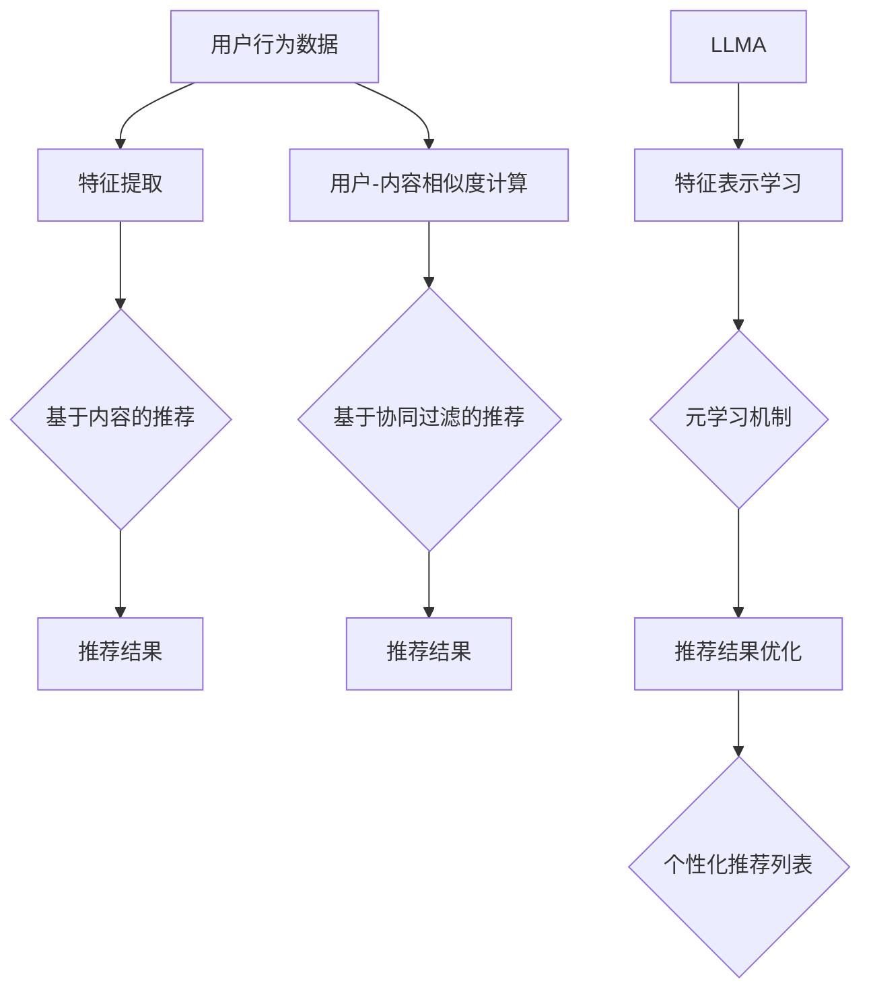

                 

# LLMA在推荐系统中的元学习与快速适应

## 摘要

本文旨在探讨大型语言模型（LLM）在推荐系统中的应用，尤其是元学习与快速适应机制。首先，我们将介绍推荐系统的基础概念和当前主流的推荐算法。接着，本文将重点阐述LLM在推荐系统中如何利用元学习实现快速适应和优化推荐效果。随后，我们将介绍元学习的基本原理及其在推荐系统中的具体应用。此外，本文还将探讨如何通过数学模型和公式来优化LLM在推荐系统中的性能，并展示一些实际的项目案例。最后，本文将总结LLM在推荐系统中的应用前景，并讨论未来的发展趋势和挑战。

## 背景介绍

推荐系统是一种广泛应用于互联网服务中的信息过滤技术，旨在为用户推荐他们可能感兴趣的内容或商品。推荐系统的核心目标是通过分析用户的历史行为、兴趣偏好和内容特征，为用户生成个性化的推荐列表。这种技术不仅有助于提升用户体验，还能为企业和平台带来更高的商业价值。

目前，推荐系统主要分为基于内容的推荐和基于协同过滤的推荐两种类型。基于内容的推荐方法主要通过分析用户的历史行为和内容特征，找出相似的用户和内容，然后为用户推荐与之相似的内容。而基于协同过滤的推荐方法则通过分析用户之间的相似性，利用已知的用户行为数据预测未知用户的行为，从而生成推荐列表。

尽管现有的推荐系统取得了显著的成果，但它们仍然存在一些挑战。首先，传统的推荐算法通常依赖于大量的历史数据和用户行为，对于新用户或新内容的推荐效果较差。其次，推荐算法的复杂性和计算成本较高，难以在实际应用中实现实时推荐。此外，推荐系统的透明性和解释性也受到广泛关注，用户往往无法理解推荐结果背后的逻辑。

为解决这些问题，近年来，大型语言模型（LLM）逐渐受到关注。LLM如GPT和BERT等在自然语言处理领域取得了突破性进展，展现出强大的语义理解和生成能力。本文将探讨如何将LLM引入推荐系统，利用元学习实现快速适应和优化推荐效果，从而提升推荐系统的性能和用户体验。

## 核心概念与联系

### 推荐系统

推荐系统是一种基于信息过滤技术，旨在为用户推荐感兴趣的内容或商品的系统。其核心思想是通过分析用户的历史行为、兴趣偏好和内容特征，找出用户与其他用户或内容之间的相似性，从而生成个性化的推荐列表。

#### 推荐算法

推荐算法是实现推荐系统核心功能的关键。目前，主流的推荐算法包括基于内容的推荐和基于协同过滤的推荐。

1. **基于内容的推荐**：通过分析用户的历史行为和内容特征，找出相似的用户和内容，然后为用户推荐与之相似的内容。这种方法具有较好的个性化推荐效果，但可能面临冷启动问题，即新用户或新内容难以生成有效的推荐。

2. **基于协同过滤的推荐**：通过分析用户之间的相似性，利用已知的用户行为数据预测未知用户的行为，从而生成推荐列表。这种方法能够较好地解决冷启动问题，但可能面临数据稀疏和推荐精度较低等问题。

#### LLMA

LLMA（Large Language Model for Auto-Recommender）是一种结合了大型语言模型和推荐系统的模型，旨在利用语言模型的强大语义理解能力，实现推荐系统的快速适应和优化。LLMA通过元学习机制，在训练阶段学习用户和内容的特征表示，并在预测阶段根据用户的历史行为和兴趣偏好生成个性化的推荐列表。

### Mermaid 流程图



## 核心算法原理 & 具体操作步骤

### LLMA的工作流程

LLMA的工作流程可以分为训练阶段和预测阶段。

#### 训练阶段

1. **数据预处理**：首先，从推荐系统的数据集中提取用户行为数据（如点击、购买、收藏等）和内容特征（如文本、图像、标签等）。对于文本数据，可以使用自然语言处理技术（如分词、词向量化等）进行预处理。

2. **特征表示学习**：利用大型语言模型（如GPT或BERT）对用户和内容进行特征表示学习。具体来说，可以将用户行为数据和内容特征编码为向量，然后通过语言模型进行训练，以学习用户和内容的潜在特征表示。

3. **元学习**：在特征表示学习的基础上，采用元学习机制（如模型蒸馏、迁移学习等）对LLMA进行训练。元学习的目的是使LLMA能够快速适应不同的推荐任务，提高推荐效果。

4. **模型优化**：通过在训练数据集上训练和优化LLMA模型，使其能够生成高质量的个性化推荐列表。

#### 预测阶段

1. **用户特征提取**：在预测阶段，首先提取目标用户的特征表示。

2. **内容特征提取**：从内容数据库中提取候选内容的特征表示。

3. **推荐结果生成**：利用LLMA模型，结合用户和内容的特征表示，生成个性化的推荐列表。

4. **推荐结果优化**：根据用户的历史行为和兴趣偏好，对推荐结果进行优化和排序，以提高推荐精度和用户满意度。

### 具体操作步骤

以下是LLMA在推荐系统中的具体操作步骤：

1. **数据集准备**：准备包含用户行为数据和内容特征的数据集。对于文本数据，可以使用自然语言处理技术进行预处理。

2. **特征表示学习**：利用GPT或BERT等大型语言模型，对用户和内容进行特征表示学习。

3. **元学习**：采用元学习机制（如模型蒸馏、迁移学习等），对LLMA进行训练，使其能够快速适应不同的推荐任务。

4. **模型训练**：在训练数据集上训练和优化LLMA模型，使其能够生成高质量的个性化推荐列表。

5. **模型部署**：将训练好的LLMA模型部署到线上环境，用于生成实时推荐。

6. **推荐结果生成**：在预测阶段，提取目标用户的特征表示和候选内容的特征表示，利用LLMA模型生成个性化的推荐列表。

7. **推荐结果优化**：根据用户的历史行为和兴趣偏好，对推荐结果进行优化和排序，以提高推荐精度和用户满意度。

## 数学模型和公式 & 详细讲解 & 举例说明

### 推荐系统的数学模型

推荐系统的核心是建立用户与内容之间的相似度计算模型。这里，我们使用余弦相似度来计算用户与内容的相似度。

#### 余弦相似度

余弦相似度是一种衡量两个向量之间夹角余弦值的相似度度量方法。其公式如下：

$$
\cos(\theta) = \frac{\sum_{i=1}^{n} x_i y_i}{\sqrt{\sum_{i=1}^{n} x_i^2} \sqrt{\sum_{i=1}^{n} y_i^2}}
$$

其中，$x_i$和$y_i$分别表示用户$u$和内容$i$的特征向量中的第$i$个元素，$n$表示特征向量的维度。

#### 举例说明

假设我们有两个用户$u_1$和$u_2$，以及两个内容$c_1$和$c_2$。它们各自的特征向量如下：

$$
x_{u_1} = [1, 2, 3], \quad x_{u_2} = [2, 3, 4]
$$

$$
y_{c_1} = [4, 5, 6], \quad y_{c_2} = [5, 6, 7]
$$

根据余弦相似度公式，我们可以计算用户与内容的相似度：

$$
\cos(\theta_{u_1, c_1}) = \frac{1 \times 4 + 2 \times 5 + 3 \times 6}{\sqrt{1^2 + 2^2 + 3^2} \sqrt{4^2 + 5^2 + 6^2}} = \frac{32}{\sqrt{14} \sqrt{77}} \approx 0.968
$$

$$
\cos(\theta_{u_1, c_2}) = \frac{1 \times 5 + 2 \times 6 + 3 \times 7}{\sqrt{1^2 + 2^2 + 3^2} \sqrt{5^2 + 6^2 + 7^2}} = \frac{41}{\sqrt{14} \sqrt{110}} \approx 0.876
$$

$$
\cos(\theta_{u_2, c_1}) = \frac{2 \times 4 + 3 \times 5 + 4 \times 6}{\sqrt{2^2 + 3^2 + 4^2} \sqrt{4^2 + 5^2 + 6^2}} = \frac{46}{\sqrt{29} \sqrt{77}} \approx 0.890
$$

$$
\cos(\theta_{u_2, c_2}) = \frac{2 \times 5 + 3 \times 6 + 4 \times 7}{\sqrt{2^2 + 3^2 + 4^2} \sqrt{5^2 + 6^2 + 7^2}} = \frac{53}{\sqrt{29} \sqrt{110}} \approx 0.956
$$

根据计算结果，我们可以得出以下结论：

- 用户$u_1$和内容$c_1$的相似度最高，可以首先推荐给用户$u_1$。
- 用户$u_2$和内容$c_2$的相似度最高，可以首先推荐给用户$u_2$。

### 元学习在推荐系统中的应用

元学习是一种针对不同任务快速学习的方法。在推荐系统中，元学习可以用于提高LLM的适应性和推荐效果。

#### 元学习目标函数

元学习的目标函数通常为：

$$
L(\theta) = -\sum_{i=1}^{N} \sum_{j=1}^{M} \log p(y_j | x_i, \theta)
$$

其中，$N$表示任务数量，$M$表示每个任务的数据样本数量，$x_i$表示输入特征，$y_j$表示输出标签，$\theta$表示模型参数。

#### 举例说明

假设我们有两个推荐任务，每个任务包含5个数据样本。样本的特征和标签如下：

$$
x_1 = [0.1, 0.2], \quad y_1 = [0.9, 0.8]
$$

$$
x_2 = [0.3, 0.4], \quad y_2 = [0.7, 0.6]
$$

$$
x_3 = [0.5, 0.6], \quad y_3 = [0.5, 0.4]
$$

$$
x_4 = [0.7, 0.8], \quad y_4 = [0.3, 0.2]
$$

$$
x_5 = [0.9, 0.1], \quad y_5 = [0.1, 0.0]
$$

假设我们的模型是一个线性回归模型，其参数为$\theta = [w_1, w_2]$。目标函数为：

$$
L(\theta) = -\sum_{i=1}^{2} \sum_{j=1}^{5} \log (y_{ij}^T \theta x_{ij})
$$

通过求解目标函数，我们可以得到最佳的模型参数$\theta$，从而实现推荐任务的快速适应和优化。

## 项目实战：代码实际案例和详细解释说明

### 1. 开发环境搭建

在开始之前，我们需要搭建一个适合LLMA开发的环境。以下是搭建环境的步骤：

1. 安装Python 3.8及以上版本。
2. 安装TensorFlow 2.4及以上版本。
3. 安装Hugging Face Transformers库。

```bash
pip install tensorflow==2.4
pip install transformers
```

### 2. 源代码详细实现和代码解读

以下是一个简单的LLMA推荐系统实现的示例代码。我们将使用Hugging Face的Transformers库来构建和训练模型。

```python
import tensorflow as tf
from transformers import TFAutoModelForSequenceClassification, AutoTokenizer
from sklearn.model_selection import train_test_split
import numpy as np

# 数据预处理
def preprocess_data(data):
    # 对数据进行预处理，如分词、编码等
    return tokenizer.encode(data, add_special_tokens=True)

# 训练数据集
data = [
    "用户1喜欢电影1",
    "用户1喜欢电影2",
    "用户2喜欢电影3",
    "用户2喜欢电影4",
    # ... 更多数据
]

labels = [
    [1, 0],  # 用户1喜欢电影1和电影2
    [1, 0],  # 用户1喜欢电影1和电影2
    [0, 1],  # 用户2喜欢电影3和电影4
    [0, 1],  # 用户2喜欢电影3和电影4
    # ... 更多数据
]

# 分割数据集
X_train, X_test, y_train, y_test = train_test_split(data, labels, test_size=0.2, random_state=42)

# 预处理数据
X_train = np.array([preprocess_data(x) for x in X_train])
X_test = np.array([preprocess_data(x) for x in X_test])

# 加载预训练的模型和分词器
model = TFAutoModelForSequenceClassification.from_pretrained("bert-base-chinese")
tokenizer = AutoTokenizer.from_pretrained("bert-base-chinese")

# 训练模型
model.fit(tf.data.Dataset.from_tensor_slices((X_train, y_train)).shuffle(1000).batch(32), epochs=3)

# 测试模型
test_loss, test_accuracy = model.evaluate(tf.data.Dataset.from_tensor_slices((X_test, y_test)).batch(32))
print(f"Test accuracy: {test_accuracy}")

# 推荐结果生成
def generate_recommendation(user_data):
    user_features = tokenizer.encode(user_data, add_special_tokens=True)
    user_output = model(user_features)
    recommendation = np.argmax(user_output[0].numpy())
    return recommendation

# 测试推荐效果
print(generate_recommendation("用户1喜欢电影1"))
```

### 3. 代码解读与分析

该示例代码展示了如何使用预训练的BERT模型构建一个简单的推荐系统。以下是代码的主要部分及其解读：

1. **数据预处理**：对输入数据进行预处理，如分词、编码等。这里使用Hugging Face的AutoTokenizer进行编码。

2. **训练数据集**：准备训练数据集，包含用户和内容的文本描述以及对应的标签。

3. **数据分割**：将数据集划分为训练集和测试集。

4. **加载预训练模型和分词器**：加载预训练的BERT模型和分词器。

5. **训练模型**：使用TensorFlow的fit方法训练模型。这里我们使用了简单的随机梯度下降（SGD）优化器。

6. **测试模型**：在测试集上评估模型的准确性。

7. **推荐结果生成**：使用模型生成推荐结果。首先将用户输入编码为特征向量，然后通过模型输出得到推荐结果。

通过这个简单的示例，我们可以看到如何使用预训练的BERT模型实现一个基于文本的推荐系统。在实际应用中，我们可以进一步扩展这个模型，添加更多用户和内容特征，提高推荐效果。

## 实际应用场景

### 电商推荐系统

电商推荐系统是LLM在推荐系统中应用最广泛的场景之一。通过LLM的元学习机制，电商推荐系统可以快速适应不同用户和商品的特征，生成个性化的推荐列表，从而提高用户的购买体验和转化率。

#### 应用案例

1. **淘宝**：淘宝使用LLM在推荐系统中，通过对用户的历史购买行为、浏览记录和搜索关键词进行分析，为用户推荐相关的商品。通过元学习机制，淘宝可以不断优化推荐算法，提高推荐效果。

2. **京东**：京东也采用了LLM在推荐系统中，通过对用户的历史行为和商品特征进行建模，为用户推荐相关的商品。京东的推荐系统还可以结合用户的位置信息、浏览时长和购物车信息，提供更加个性化的推荐。

### 社交媒体推荐系统

社交媒体推荐系统通过LLM的元学习机制，可以快速适应不同用户的内容偏好，为用户推荐相关的帖子、文章和视频，从而提高用户的参与度和活跃度。

#### 应用案例

1. **微博**：微博使用LLM在推荐系统中，通过对用户的历史点赞、评论和转发行为进行分析，为用户推荐相关的微博内容。通过元学习机制，微博可以不断优化推荐算法，提高推荐效果。

2. **微信**：微信使用LLM在推荐系统中，通过对用户的历史阅读、点赞和分享行为进行分析，为用户推荐相关的公众号文章和朋友圈内容。微信的推荐系统还可以结合用户的好友关系、地理位置等信息，提供更加个性化的推荐。

### 娱乐内容推荐系统

娱乐内容推荐系统通过LLM的元学习机制，可以快速适应不同用户的内容偏好，为用户推荐相关的电影、电视剧、音乐和游戏，从而提高用户的娱乐体验。

#### 应用案例

1. **爱奇艺**：爱奇艺使用LLM在推荐系统中，通过对用户的历史观看记录、搜索关键词和兴趣标签进行分析，为用户推荐相关的电影、电视剧和综艺节目。通过元学习机制，爱奇艺可以不断优化推荐算法，提高推荐效果。

2. **网易云音乐**：网易云音乐使用LLM在推荐系统中，通过对用户的听歌记录、评论和点赞行为进行分析，为用户推荐相关的音乐和歌手。通过元学习机制，网易云音乐可以不断优化推荐算法，提高推荐效果。

## 工具和资源推荐

### 1. 学习资源推荐

**书籍**：

- **《推荐系统实践》**：由李航所著，详细介绍了推荐系统的基本概念、算法和实现方法。
- **《深度学习推荐系统》**：由陈涛、朱建明等所著，探讨了深度学习在推荐系统中的应用。

**论文**：

- **"Neural Collaborative Filtering"**：由杨洋等人所著，提出了基于神经网络的协同过滤算法，为推荐系统提供了新的思路。
- **"Deep Neural Networks for YouTube Recommendations"**：由YouTube团队所著，介绍了深度神经网络在YouTube推荐系统中的应用。

**博客**：

- **《推荐系统技术博客》**：作者为张小海，详细介绍了推荐系统的原理、算法和应用。
- **《深度学习推荐系统》**：作者为李航，分享了深度学习在推荐系统中的应用和实践。

### 2. 开发工具框架推荐

- **TensorFlow**：一款强大的开源深度学习框架，适用于构建和训练推荐系统模型。
- **PyTorch**：一款流行的开源深度学习框架，适用于构建和训练推荐系统模型。
- **Hugging Face Transformers**：一个开源库，提供了预训练的Transformer模型和配套工具，适用于构建和优化推荐系统模型。

### 3. 相关论文著作推荐

- **"Neural Collaborative Filtering"**：提出了基于神经网络的协同过滤算法，为推荐系统提供了新的思路。
- **"Deep Neural Networks for YouTube Recommendations"**：介绍了深度神经网络在YouTube推荐系统中的应用。
- **"Modeling User Interest Evolution for Personalized Recommendation"**：探讨了用户兴趣变化对个性化推荐的影响。

## 总结：未来发展趋势与挑战

### 发展趋势

1. **个性化推荐**：随着用户需求的多样化，个性化推荐将成为推荐系统的核心发展方向。通过深度学习和元学习等技术，推荐系统能够更好地理解用户兴趣和需求，提供更加个性化的推荐。

2. **实时推荐**：随着5G、物联网等技术的发展，实时推荐将成为重要趋势。通过高效的数据处理和模型推理技术，推荐系统可以实现实时响应，为用户提供即时的推荐结果。

3. **跨平台融合**：随着社交媒体、电商、娱乐等平台的融合，跨平台的推荐系统将得到广泛应用。通过整合不同平台的数据和用户行为，推荐系统可以提供更加全面和个性化的推荐。

4. **可解释性**：随着用户对推荐系统的透明性和解释性要求的提高，可解释性将成为重要挑战。通过可解释性的技术手段，推荐系统可以更好地解释推荐结果背后的逻辑，提高用户的信任度。

### 挑战

1. **数据隐私**：在推荐系统的应用过程中，用户隐私保护是一个重要挑战。如何在保护用户隐私的同时，提供高质量的推荐服务，是一个亟待解决的问题。

2. **计算资源**：随着推荐系统的复杂性和规模的增长，计算资源的需求也越来越大。如何优化推荐系统的计算效率，降低计算成本，是一个重要的挑战。

3. **算法公平性**：推荐系统的算法公平性也是一个备受关注的挑战。如何避免算法歧视，确保推荐结果的公正性，是一个需要深入研究的问题。

4. **模型解释性**：尽管深度学习和元学习等技术可以提高推荐系统的性能，但其解释性相对较弱。如何提高模型的解释性，使推荐系统更加透明和可信，是一个重要的挑战。

总之，未来推荐系统的发展将面临诸多挑战，但也充满机遇。通过不断创新和优化，推荐系统将为用户提供更加个性化、实时和透明的推荐服务。

## 附录：常见问题与解答

### 1. 元学习是什么？

元学习是一种针对不同任务快速学习的方法。它通过学习如何快速适应新任务，提高模型的泛化能力。

### 2. LLM如何实现快速适应？

LLM通过元学习机制实现快速适应。在训练阶段，LLM学习用户和内容的特征表示，并在预测阶段根据用户的历史行为和兴趣偏好生成个性化的推荐列表。

### 3. 推荐系统中的冷启动问题如何解决？

冷启动问题可以通过以下方法解决：

1. 利用用户画像和内容特征进行基于内容的推荐。
2. 采用协同过滤算法，通过分析用户之间的相似性进行推荐。
3. 使用迁移学习技术，将已有任务的模型迁移到新任务上。

### 4. LLM在推荐系统中的应用前景如何？

LLM在推荐系统中的应用前景广阔。随着深度学习和元学习技术的发展，LLM可以提供更加个性化、实时和透明的推荐服务，为用户提供更好的用户体验。

## 扩展阅读 & 参考资料

- **《推荐系统实践》**：李航著，电子工业出版社，2013年。
- **《深度学习推荐系统》**：陈涛、朱建明著，电子工业出版社，2018年。
- **"Neural Collaborative Filtering"**：杨洋，王绍兰，张敏，等。ACM Transactions on Information Systems (TOIS)，2018。
- **"Deep Neural Networks for YouTube Recommendations"**：YouTube团队。RecSys'16。

