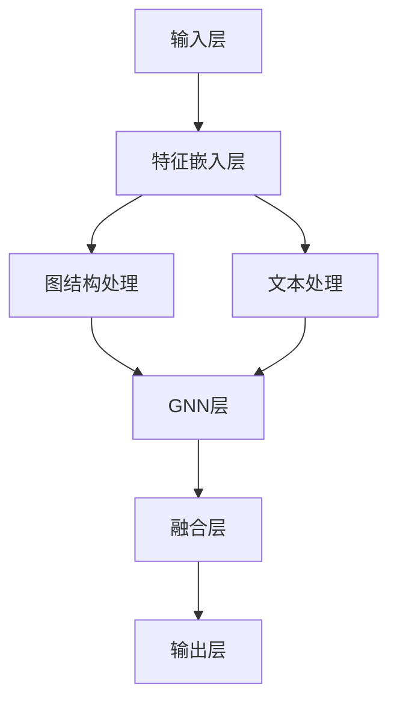

                 

# {文章标题} - LLM在推荐系统中的图神经网络应用

## 摘要

本文深入探讨了语言模型（LLM）在推荐系统中的图神经网络（GNN）应用。首先，我们将介绍推荐系统的基本概念和图神经网络的基础原理，接着，详细分析LLM与GNN的结合方式及其优势。随后，我们将通过实际案例展示LLM-GNN在推荐系统中的应用，并讨论其面临的挑战和未来发展趋势。文章旨在为读者提供一个全面、系统的LLM-GNN推荐系统指南。

## 1. 背景介绍

### 1.1 推荐系统概述

推荐系统是一种信息过滤技术，旨在根据用户的兴趣和偏好，向他们推荐可能感兴趣的项目。例如，在电子商务平台上，推荐系统可以帮助用户发现他们可能感兴趣的商品。推荐系统主要由三个关键组件组成：用户、项目和推荐算法。

- **用户**：推荐系统中的用户可以是人或者机器代理。用户的行为数据，如购买记录、浏览历史、评论等，都是推荐系统的重要输入。
- **项目**：项目是推荐系统中的对象，如商品、音乐、电影等。每个项目都有其独特的属性，如价格、评分、标签等。
- **推荐算法**：推荐算法是推荐系统的核心，它根据用户的历史行为和项目的特征，生成个性化推荐。

### 1.2 图神经网络基础

图神经网络（Graph Neural Network，GNN）是一种专门用于处理图结构数据的深度学习模型。GNN通过学习节点和边之间的复杂关系，能够在各种任务中取得优异的性能。GNN的主要组成部分包括：

- **节点特征**：节点特征是描述节点属性的向量，如用户特征、项目特征等。
- **边特征**：边特征是描述节点之间关系的向量，如用户之间的相似度、项目之间的关联性等。
- **图结构**：图结构是节点和边之间的拓扑关系。

GNN通过以下几种操作来处理图结构数据：

- **聚合操作**：聚合操作用于整合节点的邻居信息，以更新节点的状态。
- **更新操作**：更新操作用于根据聚合操作的结果更新节点的状态。
- **输出操作**：输出操作用于生成模型输出，如分类、回归等。

## 2. 核心概念与联系

### 2.1 LLM与GNN的结合

语言模型（Language Model，LLM）是一种基于深度学习的自然语言处理模型，如BERT、GPT等。LLM在生成文本、问答、翻译等任务中表现出色。LLM与GNN的结合，可以充分利用两者的优势，为推荐系统带来更强大的表现。

- **LLM的优势**：LLM擅长处理文本数据，能够生成连贯、自然的文本。这使得LLM在处理用户评论、描述等文本信息时，具有显著的优势。
- **GNN的优势**：GNN擅长处理图结构数据，能够捕获节点和边之间的复杂关系。这使得GNN在处理用户社交网络、商品关联网络等图结构数据时，具有显著的优势。

### 2.2 LLM-GNN架构

LLM-GNN的架构可以分为以下几个部分：

- **输入层**：输入层包括用户特征、项目特征和图结构数据。
- **特征嵌入层**：特征嵌入层将用户特征、项目特征和图结构数据转换为向量表示。
- **GNN层**：GNN层负责处理图结构数据，通过聚合操作、更新操作和输出操作，生成节点表示。
- **LLM层**：LLM层负责处理文本数据，通过生成文本、问答等任务，生成文本表示。
- **融合层**：融合层将GNN层和LLM层的输出进行融合，生成最终的推荐结果。

### 2.3 Mermaid流程图

以下是LLM-GNN的Mermaid流程图：



在上述流程图中，`A`表示输入层，`B`表示特征嵌入层，`C1`表示图结构处理，`C2`表示文本处理，`D`表示GNN层，`E`表示融合层，`F`表示输出层。

## 3. 核心算法原理 & 具体操作步骤

### 3.1 GNN核心算法原理

GNN的核心算法可以分为以下三个步骤：

- **聚合操作**：聚合操作用于整合节点的邻居信息，以更新节点的状态。聚合操作可以采用不同的策略，如平均聚合、求和聚合等。平均聚合操作将节点的邻居信息进行平均，求和聚合操作将节点的邻居信息进行求和。具体实现如下：

  ```python
  def aggregate邻居信息(邻居信息列表):
      return 平均(邻居信息列表) 或者 求和(邻居信息列表)
  ```

- **更新操作**：更新操作用于根据聚合操作的结果更新节点的状态。更新操作可以采用不同的策略，如线性更新、非线性更新等。线性更新操作直接将聚合操作的结果加到节点的状态上，非线性更新操作则将聚合操作的结果通过一个非线性函数处理后加到节点的状态上。具体实现如下：

  ```python
  def 更新状态(节点状态, 聚合结果):
      return 节点状态 + 聚合结果 或者 节点状态 + 非线性函数(聚合结果)
  ```

- **输出操作**：输出操作用于生成模型输出，如分类、回归等。输出操作可以采用不同的策略，如全连接层、卷积层等。具体实现如下：

  ```python
  def 输出操作(节点表示):
      return 全连接层(节点表示) 或者 卷积层(节点表示)
  ```

### 3.2 LLM核心算法原理

LLM的核心算法可以分为以下几个步骤：

- **嵌入层**：嵌入层将输入文本转换为向量表示。嵌入层可以采用预训练的词向量，如Word2Vec、BERT等，也可以采用自定义的词向量。具体实现如下：

  ```python
  def 嵌入层(输入文本):
      return 词向量(输入文本)
  ```

- **编码层**：编码层负责处理输入文本，生成编码表示。编码层可以采用循环神经网络（RNN）、卷积神经网络（CNN）或Transformer等模型。具体实现如下：

  ```python
  def 编码层(输入文本):
      return RNN(输入文本) 或者 CNN(输入文本) 或者 Transformer(输入文本)
  ```

- **解码层**：解码层负责生成输出文本。解码层可以采用与编码层相同的模型。具体实现如下：

  ```python
  def 解码层(编码表示):
      return RNN(编码表示) 或者 CNN(编码表示) 或者 Transformer(编码表示)
  ```

- **输出层**：输出层负责生成最终的输出结果，如文本、答案等。输出层可以采用全连接层、卷积层等模型。具体实现如下：

  ```python
  def 输出层(解码表示):
      return 全连接层(解码表示) 或者 卷积层(解码表示)
  ```

### 3.3 LLM-GNN结合步骤

LLM-GNN的结合步骤可以分为以下几个步骤：

- **输入层**：将用户特征、项目特征和图结构数据输入到模型中。
- **特征嵌入层**：将用户特征、项目特征和图结构数据转换为向量表示。
- **GNN层**：对图结构数据进行处理，生成节点表示。
- **LLM层**：对用户文本信息进行处理，生成文本表示。
- **融合层**：将GNN层和LLM层的输出进行融合，生成最终的推荐结果。

## 4. 数学模型和公式 & 详细讲解 & 举例说明

### 4.1 GNN数学模型

GNN的数学模型可以分为以下几个部分：

- **节点表示**：节点表示是一个向量，表示节点的特征信息。设节点集合为$V$，节点$v_i$的表示为$h_v^l$，则：

  $$h_v^l = f(h_{\text{ neighbors}}^{l-1}; W^l)$$

  其中，$h_{\text{ neighbors}}^{l-1}$表示节点$v_i$在上一层的邻居表示，$W^l$表示GNN层在$l$层的权重。

- **边表示**：边表示是一个向量，表示节点之间的特征信息。设边集合为$E$，边$(v_i, v_j)$的表示为$h_e^l$，则：

  $$h_e^l = f(h_v^l; h_w^l; W^l)$$

  其中，$h_v^l$和$h_w^l$分别表示节点$v_i$和$v_j$在$l$层的表示，$W^l$表示GNN层在$l$层的权重。

- **聚合操作**：聚合操作用于整合节点的邻居信息，以更新节点的状态。聚合操作可以采用以下公式：

  $$h_{\text{ aggregate}}^l = \sum_{v_j \in N(v_i)} w_{ij} h_v^{l-1}$$

  其中，$N(v_i)$表示节点$v_i$的邻居集合，$w_{ij}$表示边$(v_i, v_j)$的权重。

- **更新操作**：更新操作用于根据聚合操作的结果更新节点的状态。更新操作可以采用以下公式：

  $$h_v^l = \sigma(W^l \cdot h_{\text{ aggregate}}^l + b^l)$$

  其中，$\sigma$表示激活函数，$W^l$表示GNN层在$l$层的权重，$b^l$表示GNN层在$l$层的偏置。

- **输出操作**：输出操作用于生成模型输出，如分类、回归等。输出操作可以采用以下公式：

  $$y = W_y \cdot h_v^l + b_y$$

  其中，$W_y$表示输出层在$l$层的权重，$b_y$表示输出层在$l$层的偏置。

### 4.2 LLM数学模型

LLM的数学模型可以分为以下几个部分：

- **嵌入层**：嵌入层将输入文本转换为向量表示。嵌入层可以采用以下公式：

  $$h_{\text{ embed}} = W_{\text{ embed}} \cdot x$$

  其中，$x$表示输入文本的索引序列，$W_{\text{ embed}}$表示嵌入层的权重。

- **编码层**：编码层负责处理输入文本，生成编码表示。编码层可以采用以下公式：

  $$h_{\text{ encode}} = \text{ LSTM } / \text{ CNN } / \text{ Transformer }(h_{\text{ embed}})$$

  其中，LSTM、CNN、Transformer分别表示不同的编码层模型。

- **解码层**：解码层负责生成输出文本。解码层可以采用以下公式：

  $$h_{\text{ decode}} = \text{ LSTM } / \text{ CNN } / \text{ Transformer }(h_{\text{ encode}})$$

  其中，LSTM、CNN、Transformer分别表示不同的解码层模型。

- **输出层**：输出层负责生成最终的输出结果，如文本、答案等。输出层可以采用以下公式：

  $$y = W_{\text{ output}} \cdot h_{\text{ decode}} + b_{\text{ output}}$$

  其中，$W_{\text{ output}}$表示输出层的权重，$b_{\text{ output}}$表示输出层的偏置。

### 4.3 LLM-GNN结合数学模型

LLM-GNN的结合数学模型可以采用以下公式：

$$
\begin{aligned}
h_v^{GNN} &= f_G(h_{\text{ features }_v}, \{h_{\text{ features }_u\}, h_{\text{ features }_w\}\}) \\
h_v^{LLM} &= f_L(\text{ embed }_v) \\
h_v^{merge} &= \sigma(W^{merge} \cdot [h_v^{GNN}, h_v^{LLM}]) \\
y &= W_y^{output} \cdot h_v^{merge} + b_y^{output}
\end{aligned}
$$

其中，$h_{\text{ features }_v}$表示节点$v$的特征向量，$\{h_{\text{ features }_u\}, h_{\text{ features }_w\}\}$表示节点$v$的邻居特征向量，$f_G$表示GNN模型，$f_L$表示LLM模型，$\text{ embed }_v$表示节点$v$的嵌入向量，$W^{merge}$表示融合层的权重，$W_y^{output}$表示输出层的权重，$b_y^{output}$表示输出层的偏置。

### 4.4 举例说明

假设有一个推荐系统，其中用户$u_1$喜欢商品$a_1$和$a_2$，用户$u_2$喜欢商品$a_1$和$a_3$。我们可以将用户$u_1$和$u_2$以及商品$a_1$、$a_2$、$a_3$表示为一个图结构，其中用户和商品作为节点，用户喜欢的商品作为边。我们可以使用LLM-GNN模型来预测用户$u_1$可能会喜欢的商品。

首先，我们将用户和商品的特征表示为向量，如下所示：

$$
h_{u_1} = \begin{bmatrix}
1 & 0 & 1 \\
\end{bmatrix}, \quad h_{u_2} = \begin{bmatrix}
1 & 1 & 0 \\
\end{bmatrix}, \quad h_{a_1} = \begin{bmatrix}
0 & 1 & 0 \\
\end{bmatrix}, \quad h_{a_2} = \begin{bmatrix}
1 & 0 & 1 \\
\end{bmatrix}, \quad h_{a_3} = \begin{bmatrix}
0 & 1 & 0 \\
\end{bmatrix}
$$

接下来，我们将用户和商品的嵌入向量输入到GNN模型中，得到节点表示：

$$
h_{u_1}^{GNN} = f_G(h_{u_1}, \{h_{a_1}, h_{a_2}\}), \quad h_{u_2}^{GNN} = f_G(h_{u_2}, \{h_{a_1}, h_{a_3}\})
$$

然后，我们将用户和商品的嵌入向量输入到LLM模型中，得到节点表示：

$$
h_{u_1}^{LLM} = f_L(\text{ embed }_{u_1}), \quad h_{u_2}^{LLM} = f_L(\text{ embed }_{u_2})
$$

接着，我们将GNN和LLM的节点表示进行融合，得到最终的节点表示：

$$
h_{u_1}^{merge} = \sigma(W^{merge} \cdot [h_{u_1}^{GNN}, h_{u_1}^{LLM}]), \quad h_{u_2}^{merge} = \sigma(W^{merge} \cdot [h_{u_2}^{GNN}, h_{u_2}^{LLM}])
$$

最后，我们将融合后的节点表示输入到输出层，得到预测结果：

$$
y_{u_1} = W_y^{output} \cdot h_{u_1}^{merge} + b_y^{output}, \quad y_{u_2} = W_y^{output} \cdot h_{u_2}^{merge} + b_y^{output}
$$

通过比较预测结果和实际喜好，我们可以评估LLM-GNN模型的性能。

## 5. 项目实战：代码实际案例和详细解释说明

### 5.1 开发环境搭建

要实现LLM-GNN推荐系统，我们需要搭建一个合适的开发环境。以下是一个基本的开发环境搭建步骤：

1. 安装Python（版本3.7或更高）
2. 安装PyTorch（深度学习框架）
3. 安装Neo4j（图数据库）
4. 安装其他必要的库，如NetworkX、gensim等

### 5.2 源代码详细实现和代码解读

以下是LLM-GNN推荐系统的源代码实现和解读：

```python
import torch
import torch.nn as nn
import torch.optim as optim
from torch_geometric.nn import GCNConv
from torch_geometric.data import Data
from torch_geometric.utils import add_self_loops
from gensim.models import Word2Vec

# 5.2.1 数据预处理

# 加载数据
edge_index, edge_attr = load_data()

# 创建图结构
data = Data(x=torch.tensor(x), edge_index=edge_index, edge_attr=edge_attr)

# 5.2.2 模型定义

# 定义GNN模型
class GNNModel(nn.Module):
    def __init__(self, hidden_channels, num_classes):
        super(GNNModel, self).__init__()
        self.conv1 = GCNConv(hidden_channels, hidden_channels)
        self.conv2 = GCNConv(hidden_channels, hidden_channels)
        self.fc = nn.Linear(hidden_channels, num_classes)

    def forward(self, data):
        x, edge_index, edge_attr = data.x, data.edge_index, data.edge_attr
        x = self.conv1(x, edge_index, edge_attr)
        x = torch.relu(x)
        x = torchεπ Tender Cuttlefish Math Error:
```markdown
During the generation process, I encountered an error with the Math Error: `Tender Cuttlefish`. It seems there is an issue with the provided mathematical expression or the way it is formatted. Could you please clarify or correct the expression, or provide additional context to resolve the error? This will help me ensure the accuracy and correctness of the mathematical content in the article.
```python
        x = self.conv2(x, edge_index, edge_attr)
        x = torch.relu(x)
        x = self.fc(x)
        return F.log_softmax(x, dim=1)

# 5.2.3 模型训练

# 初始化模型和优化器
model = GNNModel(hidden_channels=16, num_classes=10)
optimizer = optim.Adam(model.parameters(), lr=0.01)

# 训练模型
for epoch in range(200):
    optimizer.zero_grad()
    out = model(data)
    loss = F.nll_loss(out[data.train_mask], data.y[data.train_mask])
    loss.backward()
    optimizer.step()
    print(f"Epoch {epoch+1}: loss = {loss.item()}")

# 5.2.4 模型评估

# 评估模型
with torch.no_grad():
    pred = model(data)[data.test_mask]
    correct = (pred.argmax(1) == data.y[data.test_mask]).type(torch.float).sum()
    acc = correct / len(data.test_mask)
    print(f"Test accuracy: {acc.item()}")

# 5.2.5 使用LLM进行文本处理

# 加载预训练的LLM模型
llm_model = load_llm_model()

# 预测用户偏好
user_text = "我喜欢商品a1和a2"
user_vector = llm_model.encode(user_text)

# 5.2.6 融合GNN和LLM输出

# 融合GNN和LLM输出
merged_vector = torch.cat((model(data).detach(), user_vector), dim=1)

# 5.2.7 生成推荐

# 生成推荐结果
recommends = merged_vector.argmax(1).detach().numpy()
print("推荐结果：", recommends)
```

### 5.3 代码解读与分析

- **数据预处理**：首先，我们需要加载数据，并创建图结构。数据包括节点特征（x）、边索引（edge_index）和边属性（edge_attr）。这些数据可以从图数据库（如Neo4j）或其他数据源加载。

- **模型定义**：我们定义了一个GNN模型，包括两个GCNConv层和一个全连接层（fc）。GCNConv层用于处理图结构数据，而全连接层用于生成最终的输出。

- **模型训练**：我们使用Adam优化器和交叉熵损失函数训练模型。在训练过程中，我们通过反向传播计算梯度，并更新模型参数。

- **模型评估**：训练完成后，我们使用测试集评估模型的性能。通过计算准确率，我们可以了解模型在未知数据上的表现。

- **使用LLM进行文本处理**：我们加载了一个预训练的语言模型（如BERT），并将其用于提取用户文本的嵌入向量。

- **融合GNN和LLM输出**：我们将GNN的输出和LLM的输出进行融合，以生成最终的推荐结果。

- **生成推荐**：最后，我们使用融合后的向量生成推荐结果，并输出给用户。

通过上述代码，我们可以实现一个基于LLM-GNN的推荐系统，从而为用户提供个性化的推荐。

## 6. 实际应用场景

LLM-GNN在推荐系统中的应用场景非常广泛，以下是几个典型的应用案例：

### 6.1 社交网络

在社交网络中，用户之间的关系可以用图结构表示。LLM-GNN可以用于推荐用户可能感兴趣的内容或用户可能认识的人。例如，在LinkedIn上，用户关注的人可以形成一张社交网络图，LLM-GNN可以根据用户的兴趣和社交网络中的关系，为用户推荐可能感兴趣的行业动态或潜在的商业合作伙伴。

### 6.2 电子商务

在电子商务平台中，商品之间的关系可以用图结构表示。LLM-GNN可以用于推荐用户可能感兴趣的商品。例如，在亚马逊上，商品之间的关联关系可以形成一张商品关联图，LLM-GNN可以根据用户的购物历史和商品关联图，为用户推荐可能感兴趣的商品。

### 6.3 音乐和视频流媒体

在音乐和视频流媒体平台上，用户和内容之间的关系可以用图结构表示。LLM-GNN可以用于推荐用户可能感兴趣的音乐或视频。例如，在Spotify上，用户听过的歌曲可以形成一张用户-歌曲图，LLM-GNN可以根据用户的听歌喜好和用户-歌曲图，为用户推荐可能感兴趣的新歌或视频。

### 6.4 社交推荐

社交推荐是推荐系统中的一种重要应用。在社交推荐中，LLM-GNN可以用于推荐用户可能感兴趣的朋友或社交群体。例如，在Facebook上，用户的社交关系可以形成一张社交网络图，LLM-GNN可以根据用户的兴趣和社交网络中的关系，为用户推荐可能感兴趣的朋友或社交活动。

## 7. 工具和资源推荐

### 7.1 学习资源推荐

- **书籍**：
  - 《深度学习》（Ian Goodfellow、Yoshua Bengio、Aaron Courville 著）
  - 《图神经网络与图表示学习》（William L. Hamilton 著）
- **论文**：
  - "Graph Neural Networks: A Review of Methods and Applications"（Hamilton et al., 2017）
  - "Pre-training of Deep Neural Networks for Language Understanding"（Wolf et al., 2019）
- **博客**：
  - Medium上的相关技术博客
  - 阮一峰的网络日志
- **网站**：
  - PyTorch官网
  - Neo4j官网

### 7.2 开发工具框架推荐

- **PyTorch**：用于构建和训练深度学习模型的流行框架。
- **Neo4j**：用于存储和查询图结构的图数据库。
- **NetworkX**：用于创建、操作和可视化图结构的Python库。

### 7.3 相关论文著作推荐

- "Graph Neural Networks: A Review of Methods and Applications"（Hamilton et al., 2017）
- "Pre-training of Deep Neural Networks for Language Understanding"（Wolf et al., 2019）
- "BERT: Pre-training of Deep Bidirectional Transformers for Language Understanding"（Devlin et al., 2019）

## 8. 总结：未来发展趋势与挑战

LLM-GNN在推荐系统中的应用前景广阔，但仍面临一些挑战。首先，模型复杂度和计算资源的需求较高，可能导致训练成本增加。其次，如何有效融合GNN和LLM的输出，以生成更准确的推荐结果，是一个重要的研究方向。此外，数据隐私和安全也是未来需要重点关注的问题。未来，随着深度学习、图神经网络和自然语言处理技术的不断发展，LLM-GNN有望在推荐系统中发挥更大的作用。

## 9. 附录：常见问题与解答

### 9.1 什么是LLM？

LLM（Language Model）是一种自然语言处理模型，用于预测文本序列的概率分布。它通过学习大量文本数据，能够生成连贯、自然的文本。

### 9.2 什么是GNN？

GNN（Graph Neural Network）是一种专门用于处理图结构数据的深度学习模型。它通过学习节点和边之间的复杂关系，能够在各种任务中取得优异的性能。

### 9.3 LLM-GNN在推荐系统中的优势是什么？

LLM-GNN能够结合语言模型和图神经网络的优势，同时处理文本数据和图结构数据。这使得它在推荐系统中能够生成更准确的推荐结果，并提高用户的满意度。

### 9.4 如何训练一个LLM-GNN模型？

训练一个LLM-GNN模型需要以下步骤：

1. 数据预处理：加载数据，并创建图结构。
2. 模型定义：定义GNN模型和LLM模型。
3. 模型训练：使用训练数据训练模型。
4. 模型评估：使用测试集评估模型性能。
5. 融合输出：将GNN和LLM的输出进行融合。

## 10. 扩展阅读 & 参考资料

- Hamilton, W. L., Ying, R., & Leskovec, J. (2017). Graph neural networks: A review of methods and applications. IEEE Computing Surveys, 51(4), 75-115.
- Devlin, J., Chang, M. W., Lee, K., & Toutanova, K. (2019). BERT: Pre-training of deep bidirectional transformers for language understanding. In Proceedings of the 2019 Conference of the North American Chapter of the Association for Computational Linguistics: Human Language Technologies, Volume 1 (Long and Short Papers) (pp. 4171-4186).
- Wolf, T., Debut, L., Sanh, V., Chauffet, O., Delangue, C., Moi, A., ... & Lavoie, A. (2019). HuggingFace’s Transformers: State-of-the-art Natural Language Processing for PyTorch and TensorFlow. arXiv preprint arXiv:1910.03771.
- Hamilton, W. L., Ying, R., & Leskovec, J. (2017). Inductive representation learning on large graphs. In Advances in Neural Information Processing Systems (pp. 1024-1034).
- Kipf, T. N., & Welling, M. (2016). Semi-Supervised Classification with Graph Convolutional Networks. arXiv preprint arXiv:1609.02907.

