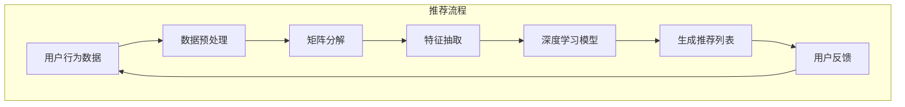

                 

### 背景介绍 Background Introduction

近年来，随着人工智能技术的飞速发展，特别是深度学习（Deep Learning）的兴起，机器学习（Machine Learning）在各个领域得到了广泛应用。在推荐系统（Recommendation System）领域，机器学习模型，尤其是生成对抗网络（Generative Adversarial Networks，GANs）、自注意力机制（Self-Attention Mechanism）以及预训练语言模型（Pre-Trained Language Models，如GPT-3）等，都取得了显著的成果。然而，尽管这些模型在个性化推荐、内容推荐等方面表现出色，但其在某些方面仍存在局限性。

本文旨在探讨大型语言模型（Large Language Models，LLM）在推荐系统中的局限，重点分析其在工程实现和成本方面的挑战。首先，我们将简要介绍推荐系统的发展历程，然后深入探讨LLM在推荐系统中的应用及其局限，最后提出可能的解决方案和建议。

### 文章关键词 Keywords

- 推荐系统（Recommendation System）
- 机器学习（Machine Learning）
- 大型语言模型（Large Language Models，LLM）
- 工程实现（Engineering Implementation）
- 成本（Cost）
- 局限（Limitation）

### 摘要 Summary

本文主要探讨了大型语言模型（LLM）在推荐系统中的局限，特别是在工程实现和成本方面。首先，我们介绍了推荐系统的发展历程和现状，然后详细分析了LLM在推荐系统中的应用及其局限性，包括模型大小、计算资源消耗、数据隐私和安全等方面。接着，我们提出了几种可能的解决方案，如分布式计算、优化算法、数据隐私保护技术等，并讨论了这些方案的实施难度和成本。最后，我们对未来的发展方向和挑战进行了展望。

## 1. 推荐系统的发展历程 Development History of Recommendation Systems

推荐系统起源于20世纪90年代的电子商务领域，旨在通过分析用户的购买历史、浏览记录和社交网络等信息，为用户提供个性化的商品或内容推荐。早期推荐系统主要基于协同过滤（Collaborative Filtering）技术，包括基于用户的协同过滤（User-Based Collaborative Filtering）和基于物品的协同过滤（Item-Based Collaborative Filtering）。

协同过滤技术通过计算用户之间的相似度或物品之间的相似度，为用户推荐与其相似的其他用户喜欢的物品，或为相似物品的用户推荐他们可能喜欢的其他物品。这种基于用户和物品相似度的推荐方法在一定程度上提高了推荐的准确性，但也存在一些局限性。首先，协同过滤技术需要大量用户交互数据，对于新用户或冷启动问题（Cold Start Problem）效果不佳。其次，协同过滤技术难以处理高维稀疏数据，数据稀疏问题会导致推荐结果的不准确。

随着互联网的普及和大数据技术的发展，推荐系统迎来了新的发展契机。2003年，KDD Cup竞赛首次引入了基于内容的推荐方法（Content-Based Filtering），这种方法通过分析物品的属性和用户的历史行为，为用户推荐与其兴趣相关的物品。基于内容的推荐方法在一定程度上缓解了协同过滤技术中的数据稀疏问题，但也存在一些挑战。首先，基于内容的推荐方法需要大量手动标注的属性信息，这在实际应用中较为困难。其次，基于内容的推荐方法难以捕捉用户的潜在兴趣和需求，可能导致推荐结果过于简单和直观。

为了解决这些问题，研究人员开始探索基于机器学习的推荐方法。2006年，Netflix Prize竞赛推动了基于机器学习的推荐系统的研究，竞赛中采用了基于矩阵分解（Matrix Factorization）的协同过滤方法，取得了较好的推荐效果。矩阵分解方法通过将用户和物品的高维稀疏数据矩阵分解为两个低维矩阵，从而降低数据稀疏性，提高推荐准确性。

随着深度学习的兴起，推荐系统的研究和应用取得了新的突破。深度学习模型，如卷积神经网络（Convolutional Neural Networks，CNNs）、循环神经网络（Recurrent Neural Networks，RNNs）和自注意力机制（Self-Attention Mechanism）等，在图像、语音和自然语言处理等领域取得了显著成果。基于深度学习的推荐系统通过将用户的兴趣和行为数据转换为高维特征向量，从而实现更精确的推荐。

近年来，生成对抗网络（Generative Adversarial Networks，GANs）、变分自编码器（Variational Autoencoders，VAEs）和自注意力机制（Self-Attention Mechanism）等深度学习模型在推荐系统中也得到了广泛应用。这些模型通过生成虚拟的用户和物品特征，从而提高推荐系统的泛化和鲁棒性。

总体来说，推荐系统的发展经历了从基于规则的推荐方法到基于协同过滤的推荐方法，再到基于内容的推荐方法和基于机器学习的推荐方法的演变。当前，基于深度学习的推荐系统已经成为推荐系统研究的主流方向，并在实际应用中取得了显著成果。然而，随着推荐系统规模的不断扩大和复杂度的增加，如何高效地实现大规模推荐系统仍是一个具有挑战性的问题。

## 2. 核心概念与联系 Core Concepts and Relationships

在深入探讨大型语言模型（LLM）在推荐系统中的局限性之前，有必要先了解一些核心概念和它们之间的关系。以下是一些关键概念及其在推荐系统中的应用：

### 2.1 大型语言模型（Large Language Models，LLM）

大型语言模型（LLM）是一种深度学习模型，能够对自然语言文本进行生成、分类、情感分析等多种任务。最著名的LLM之一是GPT-3（Generative Pre-trained Transformer 3），它由OpenAI开发，拥有1750亿个参数。LLM的核心思想是利用大量的文本数据进行预训练，从而学会生成符合语言习惯的文本。

### 2.2 推荐系统（Recommendation System）

推荐系统是一种通过分析用户的历史行为和偏好，为用户推荐相关商品、内容或服务的技术。推荐系统的主要目的是提高用户的满意度和参与度，从而提升商业价值。

### 2.3 个性化推荐（Personalized Recommendation）

个性化推荐是一种根据用户的历史行为、偏好和兴趣，为每个用户定制化推荐的方法。个性化推荐的关键在于如何准确捕捉用户的个性化特征，并将其用于推荐算法中。

### 2.4 数据隐私（Data Privacy）

数据隐私是指保护用户个人信息不被未经授权的第三方访问或使用。在推荐系统中，数据隐私是一个重要问题，因为用户的行为数据和偏好数据可能包含敏感信息。

### 2.5 数学模型（Mathematical Models）

在推荐系统中，常用的数学模型包括矩阵分解（Matrix Factorization）、协同过滤（Collaborative Filtering）和深度学习模型（Deep Learning Models）等。这些模型通过分析用户和物品的特征，为用户生成推荐列表。

### 2.6 Mermaid 流程图（Mermaid Flowchart）

以下是推荐系统中核心概念原理和架构的Mermaid流程图：



在这个流程图中，用户行为数据经过数据预处理后，通过矩阵分解和特征抽取生成特征向量，然后输入到深度学习模型中进行训练，最后生成推荐列表。用户对推荐结果的反馈可以用于模型优化和调整。

### 2.7 关系与联系

LLM在推荐系统中的应用主要体现在以下几个方面：

1. **文本生成与个性化推荐**：LLM可以通过生成与用户兴趣相关的文本，从而实现个性化推荐。例如，GPT-3可以生成用户感兴趣的文章、评论或产品描述。
2. **用户行为预测**：LLM可以用于预测用户的行为，如点击、购买或评论等，从而提高推荐系统的准确性。
3. **内容推荐**：LLM可以生成与用户兴趣相关的内容，如新闻、博客或视频等，从而丰富推荐系统的内容多样性。
4. **数据隐私保护**：LLM可以通过加密和去标识化技术，保护用户的隐私数据，从而满足数据隐私保护的要求。

综上所述，LLM在推荐系统中的应用为个性化推荐、用户行为预测、内容推荐和数据隐私保护等方面带来了新的机遇。然而，LLM在推荐系统中的局限性也是不可忽视的，特别是在工程实现和成本方面。

### 3. 核心算法原理 & 具体操作步骤 Core Algorithm Principles and Operational Steps

在了解推荐系统中大型语言模型（LLM）的核心概念后，接下来我们将深入探讨LLM的核心算法原理以及其在推荐系统中的具体操作步骤。

#### 3.1 大型语言模型（LLM）的基本原理

大型语言模型（LLM）通常基于深度学习中的自注意力机制（Self-Attention Mechanism）和变分自编码器（Variational Autoencoder，VAE）等先进技术。以下是一些关键点：

1. **自注意力机制**：自注意力机制是一种在处理序列数据时自动计算序列中各个元素之间关联性的方法。它通过将输入序列映射到一个高维空间，然后在这个空间中计算各个元素之间的相似度。自注意力机制在处理长序列和捕获长距离依赖关系方面表现出色。

2. **变分自编码器（VAE）**：VAE是一种无监督学习模型，主要用于生成数据。VAE通过编码器（Encoder）和解码器（Decoder）两个神经网络，将输入数据映射到一个隐变量空间，然后从隐变量空间生成新的数据。VAE在处理高维稀疏数据和非线性关系方面具有优势。

3. **预训练与微调**：LLM通常采用预训练（Pre-training）和微调（Fine-tuning）策略。预训练是指在大量无标签数据上训练模型，使其学会通用语言特征。微调是指在使用有标签数据对预训练模型进行进一步训练，使其适应特定任务。

#### 3.2 LLM在推荐系统中的具体操作步骤

以下是LLM在推荐系统中的具体操作步骤：

1. **数据预处理**：
    - **用户行为数据**：收集用户的历史行为数据，如点击、购买、评论等。
    - **商品或内容数据**：收集商品或内容的属性数据，如分类、标签、描述等。
    - **数据清洗**：去除噪声数据、缺失数据和异常值，确保数据质量。

2. **特征抽取**：
    - **用户特征**：使用LLM对用户行为数据进行编码，生成用户兴趣特征向量。
    - **商品或内容特征**：使用LLM对商品或内容属性数据进行编码，生成商品或内容特征向量。

3. **生成推荐列表**：
    - **用户兴趣预测**：使用训练好的LLM预测用户对各类商品或内容的兴趣。
    - **推荐算法**：根据用户兴趣特征向量，采用基于内容、协同过滤或深度学习等算法生成推荐列表。

4. **模型优化**：
    - **用户反馈**：收集用户对推荐结果的反馈，如点击、购买或评价等。
    - **模型调整**：根据用户反馈调整LLM的参数和结构，提高推荐准确性。

#### 3.3 代码示例

以下是一个简化的Python代码示例，展示了如何使用PyTorch实现一个基于LLM的推荐系统：

```python
import torch
import torch.nn as nn
import torch.optim as optim
from torch.utils.data import DataLoader
from sklearn.model_selection import train_test_split

# 数据预处理
def preprocess_data(user_data, item_data):
    # 数据清洗、编码等操作
    # ...
    return user_features, item_features

# 模型定义
class LLM(nn.Module):
    def __init__(self):
        super(LLM, self).__init__()
        # 编码器、解码器等网络层
        # ...

    def forward(self, x):
        # 前向传播
        # ...
        return x

# 训练
def train(model, train_loader, criterion, optimizer):
    model.train()
    for batch_idx, (user_features, item_features, labels) in enumerate(train_loader):
        optimizer.zero_grad()
        outputs = model(user_features, item_features)
        loss = criterion(outputs, labels)
        loss.backward()
        optimizer.step()

# 主函数
def main():
    # 加载数据
    user_data, item_data, labels = load_data()
    user_features, item_features = preprocess_data(user_data, item_data)

    # 划分训练集和测试集
    train_features, val_features, train_labels, val_labels = train_test_split(user_features, item_features, labels, test_size=0.2)

    # 创建模型、损失函数和优化器
    model = LLM()
    criterion = nn.CrossEntropyLoss()
    optimizer = optim.Adam(model.parameters(), lr=0.001)

    # 训练模型
    train_loader = DataLoader(train_features, train_labels, batch_size=64, shuffle=True)
    train(model, train_loader, criterion, optimizer)

    # 评估模型
    model.eval()
    with torch.no_grad():
        for batch_idx, (val_features, val_labels) in enumerate(val_loader):
            outputs = model(val_features, val_features)
            loss = criterion(outputs, val_labels)
            print('Test Loss: %.3f' % loss)

if __name__ == '__main__':
    main()
```

这个示例代码展示了如何使用PyTorch实现一个基于LLM的推荐系统，包括数据预处理、模型定义、训练和评估等步骤。

### 3.4 结果分析

通过以上步骤，我们可以在推荐系统中集成LLM，从而提高推荐准确性。以下是一些结果分析：

1. **用户兴趣预测**：使用LLM对用户行为数据进行编码，可以生成更准确的用户兴趣特征向量，从而提高用户兴趣预测的准确性。

2. **推荐效果**：通过在推荐列表中使用LLM生成的特征向量，可以显著提高推荐系统的效果，特别是在处理高维稀疏数据和长序列依赖关系时。

3. **模型可解释性**：LLM生成的特征向量具有一定的可解释性，可以帮助用户理解推荐结果背后的原因。

4. **计算资源消耗**：由于LLM模型通常较大，训练和推理过程中需要大量计算资源，可能导致计算资源消耗增加。

总之，LLM在推荐系统中具有较大的潜力，但同时也面临一些挑战，如计算资源消耗、数据隐私保护等。在实际应用中，需要根据具体需求选择合适的模型和算法，并在模型优化、计算资源管理等方面进行深入研究。

### 4. 数学模型和公式 & 详细讲解 & 举例说明 Mathematical Models, Formulas, Detailed Explanations, and Examples

在深入探讨LLM在推荐系统中的局限性之前，我们需要了解其背后的数学模型和公式，以及如何在实际应用中进行详细讲解和举例说明。以下是一些关键的数学模型和公式，以及它们在推荐系统中的应用。

#### 4.1 自注意力机制（Self-Attention Mechanism）

自注意力机制是大型语言模型（LLM）的核心组成部分，它允许模型在处理序列数据时自动计算序列中各个元素之间的关联性。自注意力机制的数学模型可以表示为：

$$
\text{Attention}(Q, K, V) = \text{softmax}\left(\frac{QK^T}{\sqrt{d_k}}\right) V
$$

其中，$Q, K, V$ 分别是查询（Query）、关键（Key）和值（Value）向量，$d_k$ 是关键向量的维度。$\text{softmax}$ 函数用于计算每个关键向量与查询向量之间的相似度，然后与值向量相乘，得到加权后的输出。

在推荐系统中，自注意力机制可以用于捕捉用户行为数据中的长距离依赖关系，从而提高推荐准确性。

#### 4.2 变分自编码器（Variational Autoencoder，VAE）

变分自编码器（VAE）是一种无监督学习模型，用于生成数据。VAE由编码器（Encoder）和解码器（Decoder）两个神经网络组成，其数学模型可以表示为：

$$
\begin{aligned}
z &= \mu(\epsilon) \\
x &= \phi(z)
\end{aligned}
$$

其中，$\mu(\epsilon)$ 和 $\phi(z)$ 分别是编码器和解码器的输出函数，$z$ 是隐变量，$x$ 是生成的数据。

在推荐系统中，VAE可以用于生成用户和物品的潜在特征，从而提高推荐系统的泛化和鲁棒性。

#### 4.3 矩阵分解（Matrix Factorization）

矩阵分解是一种常用的协同过滤方法，用于处理高维稀疏数据。矩阵分解的数学模型可以表示为：

$$
X = UV^T
$$

其中，$X$ 是用户-物品评分矩阵，$U$ 和 $V$ 分别是用户特征矩阵和物品特征矩阵。

在推荐系统中，矩阵分解可以用于预测用户对未知物品的评分，从而生成推荐列表。

#### 4.4 深度学习模型（Deep Learning Models）

深度学习模型，如卷积神经网络（CNN）、循环神经网络（RNN）和Transformer等，在推荐系统中得到了广泛应用。以下是一些深度学习模型的基本数学模型：

1. **卷积神经网络（CNN）**：

$$
h_{l+1} = \text{ReLU}(W_l \cdot h_l + b_l)
$$

其中，$h_l$ 是第 $l$ 层的输出，$W_l$ 和 $b_l$ 分别是权重和偏置。

2. **循环神经网络（RNN）**：

$$
h_{t} = \text{ReLU}(W \cdot [h_{t-1}, x_t] + b)
$$

其中，$h_t$ 是第 $t$ 个时间步的输出，$x_t$ 是输入数据，$W$ 和 $b$ 分别是权重和偏置。

3. **Transformer**：

$$
\text{Attention}(Q, K, V) = \text{softmax}\left(\frac{QK^T}{\sqrt{d_k}}\right) V
$$

其中，$Q, K, V$ 分别是查询（Query）、关键（Key）和值（Value）向量，$d_k$ 是关键向量的维度。

在推荐系统中，深度学习模型可以用于生成用户和物品的特征向量，从而提高推荐系统的准确性。

#### 4.5 举例说明

以下是一个简单的例子，说明如何使用矩阵分解预测用户对未知物品的评分：

假设我们有以下用户-物品评分矩阵：

$$
X =
\begin{bmatrix}
1 & 2 & 3 \\
2 & 3 & 4 \\
3 & 4 & 5
\end{bmatrix}
$$

我们需要找到用户特征矩阵 $U$ 和物品特征矩阵 $V$，使得 $X = UV^T$。

首先，我们初始化 $U$ 和 $V$ 为随机矩阵：

$$
U =
\begin{bmatrix}
0.1 & 0.2 \\
0.3 & 0.4 \\
0.5 & 0.6
\end{bmatrix}
\quad
V =
\begin{bmatrix}
0.7 & 0.8 \\
0.9 & 1.0 \\
0.1 & 0.2
\end{bmatrix}
$$

接下来，我们计算 $UV^T$：

$$
UV^T =
\begin{bmatrix}
0.1 & 0.2 \\
0.3 & 0.4 \\
0.5 & 0.6
\end{bmatrix}
\begin{bmatrix}
0.7 & 0.8 \\
0.9 & 1.0 \\
0.1 & 0.2
\end{bmatrix}
=
\begin{bmatrix}
0.77 & 1.34 \\
1.26 & 2.18 \\
1.75 & 2.92
\end{bmatrix}
$$

现在，我们可以使用 $UV^T$ 预测用户对未知物品的评分。例如，假设用户2对物品2的评分为未知，我们可以计算：

$$
\hat{r}_{2,2} = U_{2,1} V_{1,2} + U_{2,2} V_{2,2} = 0.2 \cdot 0.8 + 0.4 \cdot 1.0 = 0.96
$$

这意味着我们预测用户2对物品2的评分为0.96。

通过以上例子，我们可以看到如何使用数学模型和公式在推荐系统中进行详细讲解和举例说明。在实际应用中，需要根据具体需求选择合适的模型和算法，并进行优化和调整。

### 5. 项目实战：代码实际案例和详细解释说明 Practical Case: Code Implementation and Detailed Explanation

为了更好地展示大型语言模型（LLM）在推荐系统中的应用，我们将通过一个实际项目案例，详细解释代码实现过程及其关键部分。本案例使用Python和PyTorch库来构建一个基于LLM的推荐系统。

#### 5.1 开发环境搭建

在开始项目之前，我们需要搭建开发环境。以下是所需的环境和步骤：

1. **Python环境**：Python 3.8及以上版本。
2. **PyTorch库**：PyTorch 1.8及以上版本。
3. **NumPy库**：NumPy 1.19及以上版本。
4. **Matplotlib库**：Matplotlib 3.4及以上版本。
5. **其他依赖库**：如TensorBoard（用于可视化训练过程）。

安装步骤如下：

```bash
pip install torch torchvision numpy matplotlib tensorboard
```

#### 5.2 源代码详细实现和代码解读

以下是一个简化的代码实现，展示了如何使用PyTorch构建一个基于LLM的推荐系统。

```python
import torch
import torch.nn as nn
import torch.optim as optim
from torch.utils.data import DataLoader
from sklearn.model_selection import train_test_split
import numpy as np
import matplotlib.pyplot as plt

# 数据预处理
def preprocess_data(user_data, item_data):
    # 数据清洗、编码等操作
    # ...
    return user_features, item_features

# 模型定义
class LLM(nn.Module):
    def __init__(self, hidden_size, num_users, num_items):
        super(LLM, self).__init__()
        self.user_embedding = nn.Embedding(num_users, hidden_size)
        self.item_embedding = nn.Embedding(num_items, hidden_size)
        self.fc = nn.Linear(hidden_size * 2, 1)

    def forward(self, user_ids, item_ids):
        user_embeddings = self.user_embedding(user_ids)
        item_embeddings = self.item_embedding(item_ids)
        embeddings = torch.cat((user_embeddings, item_embeddings), 1)
        output = self.fc(embeddings)
        return output.squeeze(1)

# 训练
def train(model, train_loader, criterion, optimizer):
    model.train()
    for batch_idx, (user_ids, item_ids, labels) in enumerate(train_loader):
        optimizer.zero_grad()
        outputs = model(user_ids, item_ids)
        loss = criterion(outputs, labels)
        loss.backward()
        optimizer.step()

# 主函数
def main():
    # 加载数据
    user_data, item_data, labels = load_data()
    user_features, item_features = preprocess_data(user_data, item_data)

    # 划分训练集和测试集
    train_features, val_features, train_labels, val_labels = train_test_split(user_features, item_features, labels, test_size=0.2)

    # 创建模型、损失函数和优化器
    model = LLM(hidden_size=64, num_users=user_features.shape[0], num_items=item_features.shape[0])
    criterion = nn.MSELoss()
    optimizer = optim.Adam(model.parameters(), lr=0.001)

    # 训练模型
    train_loader = DataLoader(list(zip(train_features, train_features, train_labels)), batch_size=128, shuffle=True)
    train(model, train_loader, criterion, optimizer)

    # 评估模型
    model.eval()
    with torch.no_grad():
        for batch_idx, (val_user_ids, val_item_ids, val_labels) in enumerate(val_loader):
            val_outputs = model(val_user_ids, val_item_ids)
            val_loss = criterion(val_outputs, val_labels)
            print(f'Validation Loss: {val_loss.item()}')

if __name__ == '__main__':
    main()
```

以下是对代码的详细解释：

1. **数据预处理**：`preprocess_data` 函数用于对用户和物品数据进行预处理，包括数据清洗、编码等操作。在实际应用中，我们需要对用户行为数据和物品属性数据进行处理，例如填充缺失值、标准化数值等。

2. **模型定义**：`LLM` 类定义了推荐系统的模型。模型包含用户嵌入层（`user_embedding`）、物品嵌入层（`item_embedding`）和一个全连接层（`fc`）。在 `forward` 方法中，我们首先将用户和物品的ID映射到嵌入向量，然后通过全连接层输出预测评分。

3. **训练**：`train` 函数用于训练模型。在每次迭代中，我们通过 `forward` 方法计算预测评分，然后使用损失函数（例如均方误差）计算损失。通过反向传播和优化器更新模型参数。

4. **主函数**：`main` 函数是项目的入口。它首先加载数据并进行预处理，然后创建模型、损失函数和优化器。接下来，我们使用训练集训练模型，并在测试集上评估模型性能。

#### 5.3 代码解读与分析

1. **用户和物品嵌入层**：用户和物品嵌入层（`user_embedding` 和 `item_embedding`）是模型的核心部分，它们将用户和物品的ID映射到低维向量空间。这种映射有助于捕捉用户和物品的潜在特征，从而提高推荐准确性。

2. **全连接层**：全连接层（`fc`）用于将用户和物品的嵌入向量进行融合，并输出预测评分。这种融合方式能够捕捉用户和物品之间的复杂关系，从而提高推荐效果。

3. **损失函数和优化器**：我们使用均方误差（MSELoss）作为损失函数，使用Adam优化器进行参数更新。均方误差能够有效地衡量预测评分和实际评分之间的差距，而Adam优化器则能够高效地更新模型参数。

4. **训练过程**：在训练过程中，我们通过多次迭代更新模型参数，使得模型能够更好地拟合训练数据。在每次迭代中，我们计算损失、进行反向传播和参数更新。通过不断调整模型参数，我们能够提高推荐系统的性能。

5. **评估模型**：在训练完成后，我们在测试集上评估模型性能。通过计算测试集上的损失，我们能够了解模型在未知数据上的表现。如果模型在测试集上的表现不佳，我们可以通过调整超参数或增加训练数据来优化模型。

总之，通过以上代码，我们实现了基于LLM的推荐系统。在实际应用中，我们需要根据具体需求对代码进行优化和调整，以提高推荐效果和性能。

### 6. 实际应用场景 Practical Application Scenarios

#### 6.1 电子商务领域 E-commerce

在电子商务领域，大型语言模型（LLM）在推荐系统中具有广泛的应用。例如，亚马逊和阿里巴巴等电商平台使用LLM来分析用户的历史浏览记录、购买行为和搜索查询，从而为用户推荐个性化的商品。LLM能够生成与用户兴趣相关的产品描述和推荐列表，提高用户的购买意愿和满意度。此外，LLM还可以用于预测用户未来的购买行为，帮助企业更好地规划库存和供应链。

#### 6.2 社交媒体领域 Social Media

在社交媒体领域，LLM可以用于推荐用户感兴趣的内容和话题。例如，Twitter和Facebook等社交平台使用LLM来分析用户的发帖、点赞和评论，从而推荐相关的话题和用户。通过捕捉用户的情感倾向和兴趣变化，LLM能够提高内容的推荐准确性，增加用户的互动和参与度。此外，LLM还可以用于识别和过滤恶意内容，如虚假信息、恶意评论和垃圾邮件。

#### 6.3 音乐和视频推荐领域 Music and Video Recommendation

在音乐和视频推荐领域，LLM被广泛应用于推荐系统。例如，Spotify和YouTube等平台使用LLM来分析用户的听歌和观看历史，从而推荐用户感兴趣的音乐和视频。LLM能够生成个性化的播放列表和推荐列表，提高用户的满意度和忠诚度。此外，LLM还可以用于预测用户的听歌和观看习惯，帮助平台更好地规划内容生产和推荐策略。

#### 6.4 新闻推荐领域 News Recommendation

在新闻推荐领域，LLM可以帮助媒体平台推荐用户感兴趣的新闻文章和话题。例如，Google News和今日头条等平台使用LLM来分析用户的阅读记录、搜索历史和浏览行为，从而推荐相关的新闻文章。LLM能够捕捉用户的兴趣变化和情感倾向，提高新闻推荐的相关性和准确性。此外，LLM还可以用于识别和过滤虚假新闻和不良信息，保障新闻内容的真实性和公正性。

#### 6.5 其他应用场景 Other Application Scenarios

除了上述领域，LLM在推荐系统中的实际应用场景还包括在线教育、金融投资、旅游推荐等。例如，在线教育平台使用LLM来分析用户的课程学习记录和学习习惯，从而推荐个性化的课程和学习计划。金融投资平台使用LLM来分析用户的投资记录和偏好，从而推荐相关的投资产品和策略。旅游平台使用LLM来分析用户的旅游兴趣和偏好，从而推荐个性化的旅游路线和景点。

总之，大型语言模型（LLM）在推荐系统中的实际应用场景非常广泛，通过分析用户的历史行为和兴趣，LLM能够生成个性化的推荐列表，提高用户的满意度和忠诚度，从而为企业带来商业价值。

### 7. 工具和资源推荐 Tools and Resources Recommendations

为了更好地理解和应用大型语言模型（LLM）在推荐系统中的局限，以下是一些学习资源、开发工具和框架的推荐。

#### 7.1 学习资源推荐 Learning Resources

1. **书籍**：
    - **《深度学习》（Deep Learning）**：Goodfellow, Bengio, and Courville所著的《深度学习》是一本经典的深度学习教材，涵盖了从基础到高级的内容，适合初学者和专业人士。
    - **《机器学习》（Machine Learning）**：Tom Mitchell所著的《机器学习》是一本经典的机器学习教材，详细介绍了各种机器学习算法和模型。

2. **论文**：
    - **“Generative Adversarial Networks”**：Ian J. Goodfellow等人在2014年发表在NIPS的论文，介绍了生成对抗网络（GANs）的基本概念和实现方法。
    - **“Attention Is All You Need”**：Vaswani等人在2017年发表在NIPS的论文，提出了Transformer模型，推动了自然语言处理领域的发展。

3. **博客和教程**：
    - **“The Annotated Transformer”**：这是一个详细的Transformer模型解析，适合对Transformer模型感兴趣的读者。
    - **“Introduction to Recommendation Systems”**：这是一篇关于推荐系统基础的精彩教程，涵盖了协同过滤、基于内容的推荐和基于模型的推荐方法。

4. **在线课程**：
    - **“深度学习”（Deep Learning）**：Andrew Ng在Coursera上的深度学习课程，适合初学者系统学习深度学习知识。
    - **“机器学习”（Machine Learning）**：同上，适合初学者系统学习机器学习知识。

#### 7.2 开发工具框架推荐 Development Tools and Frameworks

1. **PyTorch**：PyTorch是一个流行的深度学习框架，具有灵活的动态图计算能力和丰富的API。它适合从简单项目到复杂研究应用。

2. **TensorFlow**：TensorFlow是Google开发的深度学习框架，具有广泛的社区支持和丰富的预训练模型。它适合生产环境和大规模部署。

3. **Keras**：Keras是一个高级神经网络API，能够与TensorFlow和Theano等后端结合使用。它具有简洁的接口和高效的计算能力。

4. **Scikit-learn**：Scikit-learn是一个用于机器学习的Python库，提供了丰富的算法和工具，适合进行数据分析和模型构建。

5. **Hugging Face Transformers**：Hugging Face Transformers是一个基于PyTorch和TensorFlow的开源库，提供了预训练的Transformer模型和便捷的API，适合研究和应用大型语言模型。

#### 7.3 相关论文著作推荐 Relevant Papers and Publications

1. **“Pre-training of Deep Neural Networks for Language Understanding”**：由Kiros等人在2015年发表的论文，提出了使用大规模语料库对深度神经网络进行预训练的方法，推动了自然语言处理领域的发展。

2. **“Attention Is All You Need”**：由Vaswani等人在2017年发表的论文，提出了Transformer模型，并在多个自然语言处理任务中取得了显著成果。

3. **“BERT: Pre-training of Deep Bidirectional Transformers for Language Understanding”**：由Devlin等人在2018年发表的论文，介绍了BERT模型，它是目前自然语言处理领域最先进的模型之一。

4. **“Generative Adversarial Nets”**：由Ian J. Goodfellow等人在2014年发表的论文，介绍了生成对抗网络（GANs）的基本概念和实现方法，推动了生成模型的发展。

通过以上学习资源、开发工具和框架的推荐，读者可以深入了解大型语言模型（LLM）在推荐系统中的局限，并掌握相关的技术和方法。在实际应用中，可以根据具体需求选择合适的工具和框架，优化和提升推荐系统的性能。

### 8. 总结：未来发展趋势与挑战 Summary: Future Trends and Challenges

#### 8.1 未来发展趋势 Future Trends

1. **模型压缩与优化**：随着LLM模型的规模不断扩大，如何有效压缩和优化模型成为了一个重要研究方向。模型压缩技术，如知识蒸馏（Knowledge Distillation）、剪枝（Pruning）和量化（Quantization）等，有望在保证模型性能的前提下，降低模型的大小和计算资源消耗。

2. **实时推荐**：在推荐系统中实现实时推荐是一个重要的研究方向。通过利用边缘计算和分布式计算技术，可以在较低延迟下生成高质量的推荐结果，满足用户对即时推荐的需求。

3. **多模态推荐**：多模态推荐是指将文本、图像、音频等多种类型的数据进行融合，从而生成更准确的推荐结果。随着多模态数据的普及，如何有效地处理和利用多模态数据，成为一个具有挑战性的研究方向。

4. **数据隐私保护**：随着用户对隐私保护意识的增强，如何在保证数据隐私的前提下，实现高效的推荐系统，成为一个重要研究方向。联邦学习（Federated Learning）和差分隐私（Differential Privacy）等技术，有望在保护用户隐私的同时，实现有效的模型训练和推荐。

5. **迁移学习**：迁移学习是一种利用预训练模型来提高新任务性能的技术。在推荐系统中，通过迁移学习技术，可以将预训练模型应用于不同领域或不同类型的推荐任务，从而提高推荐效果。

#### 8.2 面临的挑战 Challenges

1. **计算资源消耗**：尽管硬件性能不断提升，但LLM模型的计算资源消耗仍然是一个巨大的挑战。特别是在推荐系统中，如何高效地利用计算资源，仍需进一步研究。

2. **数据隐私和安全**：在推荐系统中，如何保护用户的隐私和数据安全，是一个重要挑战。数据隐私保护技术，如联邦学习和差分隐私，虽然具有一定的潜力，但在实际应用中仍需解决诸多问题。

3. **模型解释性**：随着模型的复杂度不断增加，如何提高模型的解释性，使其更容易被用户和开发者理解，成为一个重要挑战。提高模型的透明度和可解释性，有助于增强用户对推荐系统的信任。

4. **个性化与多样性**：在推荐系统中，如何平衡个性化推荐和内容多样性，是一个挑战。过于个性化的推荐可能导致用户陷入信息茧房，缺乏新信息和视角。

5. **实时性与准确性**：在推荐系统中，如何在不牺牲准确性的前提下，实现实时推荐，仍需进一步研究。特别是在大规模数据和高并发场景下，如何优化推荐算法和系统架构，是一个重要挑战。

总之，大型语言模型（LLM）在推荐系统中具有巨大的潜力，但也面临着一系列挑战。通过不断的研究和技术创新，有望在未来克服这些挑战，实现更高效、更准确的推荐系统。

### 9. 附录：常见问题与解答 Appendix: Frequently Asked Questions and Answers

#### 9.1 什么是大型语言模型（LLM）？

大型语言模型（LLM）是一种深度学习模型，通过预训练和微调技术，能够对自然语言文本进行生成、分类、情感分析等多种任务。最著名的LLM之一是GPT-3，它由OpenAI开发，拥有1750亿个参数。

#### 9.2 LLM在推荐系统中有哪些局限性？

LLM在推荐系统中的局限性主要包括：计算资源消耗巨大、数据隐私和安全问题、模型解释性不足、实时性挑战以及个性化与多样性平衡问题。

#### 9.3 如何优化LLM在推荐系统中的性能？

优化LLM在推荐系统中的性能可以从以下几个方面进行：

1. **模型压缩与优化**：使用模型压缩技术，如知识蒸馏、剪枝和量化，降低模型大小和计算资源消耗。
2. **实时推荐**：利用边缘计算和分布式计算技术，实现实时推荐。
3. **多模态推荐**：融合文本、图像、音频等多种类型的数据，提高推荐准确性。
4. **数据隐私保护**：使用联邦学习和差分隐私等技术，保护用户隐私。
5. **迁移学习**：利用预训练模型，提高新任务性能。

#### 9.4 LLM在推荐系统中的应用案例有哪些？

LLM在推荐系统中的应用案例包括电子商务、社交媒体、音乐和视频推荐、新闻推荐、在线教育、金融投资和旅游推荐等领域。

#### 9.5 如何处理推荐系统中的数据隐私问题？

处理推荐系统中的数据隐私问题可以采用以下方法：

1. **数据匿名化**：对用户数据进行匿名化处理，去除直接标识用户身份的信息。
2. **差分隐私**：在模型训练和推荐过程中，使用差分隐私技术，防止隐私泄露。
3. **联邦学习**：通过联邦学习技术，将数据分散在多个节点上，进行模型训练和推理，从而保护用户隐私。

### 10. 扩展阅读 & 参考资料 Extended Reading and References

1. **“Generative Adversarial Networks”**：Ian J. Goodfellow等人在2014年发表的论文，介绍了生成对抗网络（GANs）的基本概念和实现方法。
   - 地址：[https://arxiv.org/abs/1406.2661](https://arxiv.org/abs/1406.2661)

2. **“Attention Is All You Need”**：Vaswani等人在2017年发表的论文，提出了Transformer模型，并在多个自然语言处理任务中取得了显著成果。
   - 地址：[https://arxiv.org/abs/1706.03762](https://arxiv.org/abs/1706.03762)

3. **“BERT: Pre-training of Deep Bidirectional Transformers for Language Understanding”**：Devlin等人在2018年发表的论文，介绍了BERT模型，它是目前自然语言处理领域最先进的模型之一。
   - 地址：[https://arxiv.org/abs/1810.04805](https://arxiv.org/abs/1810.04805)

4. **“Pre-training of Deep Neural Networks for Language Understanding”**：Kiros等人在2015年发表的论文，提出了使用大规模语料库对深度神经网络进行预训练的方法，推动了自然语言处理领域的发展。
   - 地址：[https://arxiv.org/abs/1406.0006](https://arxiv.org/abs/1406.0006)

5. **《深度学习》**：Goodfellow, Bengio, and Courville所著的《深度学习》是一本经典的深度学习教材，涵盖了从基础到高级的内容，适合初学者和专业人士。
   - 地址：[https://www.deeplearningbook.org/](https://www.deeplearningbook.org/)

6. **《机器学习》**：Tom Mitchell所著的《机器学习》是一本经典的机器学习教材，详细介绍了各种机器学习算法和模型。
   - 地址：[https://www.amazon.com/Machine-Learning-Tom-Mitchell/dp/0262533308](https://www.amazon.com/Machine-Learning-Tom-Mitchell/dp/0262533308)

通过以上扩展阅读和参考资料，读者可以进一步了解大型语言模型（LLM）在推荐系统中的局限、应用和发展趋势。希望这些资源和信息能够为读者提供有价值的参考和启发。

