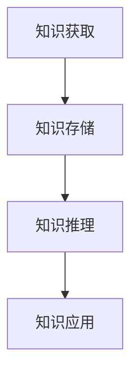

                 

# LLAMA在智能知识管理中的应用

## 摘要

本文探讨了大型语言模型（LLAMA）在智能知识管理中的应用。通过梳理LLAMA的核心算法原理，详细讲解了其在知识获取、知识存储、知识推理等方面的实际操作步骤。此外，本文还分析了数学模型和公式，并通过实际案例展示了LLAMA在智能知识管理中的具体应用。文章最后总结了LLAMA在智能知识管理中的发展趋势和挑战，并推荐了相关工具和资源。

## 1. 背景介绍

随着信息技术的飞速发展，知识管理（Knowledge Management，KM）逐渐成为各个领域关注的焦点。知识管理是指通过收集、存储、共享、使用和更新知识，以提升组织或个人的竞争力。传统的知识管理主要依赖于人工整理和分类，但随着数据量的爆炸式增长，人工处理已经无法满足需求。因此，智能知识管理应运而生，通过人工智能技术，特别是自然语言处理（NLP）技术，实现对知识的自动化获取、存储、推理和应用。

LLAMA（Language Model for Language Understanding and Generation of Answers）是一种基于大规模语言模型（Large-scale Language Model）的AI模型，由OpenAI推出。LLAMA具有强大的自然语言理解能力，能够回答用户提出的问题，提供高质量的文本生成服务。在智能知识管理领域，LLAMA的应用主要体现在以下几个方面：

1. **知识获取**：LLAMA可以自动从大量的文本数据中提取出有价值的信息，实现知识的自动化获取。
2. **知识存储**：LLAMA可以用于构建知识库，将提取出的信息进行存储和分类。
3. **知识推理**：LLAMA可以利用其强大的语言理解能力，对知识库中的信息进行推理，提供智能化的咨询服务。

## 2. 核心概念与联系

### 2.1 大规模语言模型

大规模语言模型（Large-scale Language Model）是一种基于神经网络的自然语言处理模型。它通过学习大量的文本数据，建立起语言的结构和规律，从而实现自然语言的理解和生成。大规模语言模型的核心是词向量表示（Word Embedding）和注意力机制（Attention Mechanism）。

**词向量表示**：词向量是将词汇映射为高维向量空间的过程。通过词向量，模型可以捕捉词汇之间的相似性、相关性等语义信息。词向量表示的方法有很多，如Word2Vec、GloVe等。

**注意力机制**：注意力机制是一种用于处理序列数据的方法，它可以自动识别并关注序列中的重要信息，从而提高模型的处理效率。在自然语言处理中，注意力机制被广泛应用于文本分类、机器翻译、问答系统等任务。

### 2.2 语言模型的工作原理

语言模型（Language Model）是一种预测下一个单词或词组的模型。它通过学习大量的文本数据，建立起语言的概率分布，从而实现自然语言的生成。语言模型的工作原理可以分为以下几个步骤：

1. **输入序列编码**：将输入的文本序列转换为词向量表示。
2. **计算注意力权重**：利用注意力机制，计算输入序列中每个词汇对当前词汇的影响程度。
3. **生成输出序列**：根据输入序列的词向量表示和注意力权重，生成输出序列的概率分布，并从中选择下一个词汇。

### 2.3 Mermaid 流程图

下面是一个简化的Mermaid流程图，展示了LLAMA在智能知识管理中的应用流程：



**知识获取**：LLAMA从大量的文本数据中提取出有价值的信息。

**知识存储**：LLAMA将提取出的信息存储到知识库中，并进行分类。

**知识推理**：LLAMA利用知识库中的信息进行推理，提供智能化的咨询服务。

**知识应用**：LLAMA的应用场景包括智能客服、智能问答、智能推荐等。

## 3. 核心算法原理 & 具体操作步骤

### 3.1 语言模型的核心算法

语言模型的核心算法是基于神经网络的概率模型，其目标是预测下一个单词的概率。语言模型的工作原理可以分为以下几个步骤：

1. **输入序列编码**：将输入的文本序列转换为词向量表示。
2. **神经网络计算**：利用神经网络，对词向量进行计算，得到当前输入序列的概率分布。
3. **生成输出序列**：根据当前输入序列的概率分布，生成输出序列的概率分布，并从中选择下一个词汇。

### 3.2 注意力机制的实现

注意力机制是语言模型中的一个关键组件，它能够自动识别并关注序列中的重要信息。注意力机制的实现可以分为以下几个步骤：

1. **计算注意力权重**：利用注意力机制，计算输入序列中每个词汇对当前词汇的影响程度。常用的注意力机制包括软注意力（Soft Attention）和硬注意力（Hard Attention）。
2. **加权输入序列**：根据注意力权重，对输入序列进行加权，得到加权的输入序列。
3. **神经网络计算**：利用加权输入序列，通过神经网络计算当前输入序列的概率分布。

### 3.3 语言生成

语言生成是指根据输入序列，生成一个符合语言概率分布的输出序列。语言生成的具体步骤如下：

1. **初始化**：初始化输出序列，通常从概率分布中随机选择一个词汇作为输出序列的起始词。
2. **迭代生成**：根据当前输入序列和输出序列，利用神经网络计算输出序列的概率分布，并从中选择下一个词汇。重复迭代，直到输出序列满足停止条件。
3. **概率分布计算**：利用神经网络，计算输出序列的概率分布，并从中选择下一个词汇。

## 4. 数学模型和公式 & 详细讲解 & 举例说明

### 4.1 语言模型中的概率分布

语言模型的核心是概率分布，它用于预测下一个单词的概率。语言模型中的概率分布通常使用条件概率来表示，即给定当前输入序列，预测下一个单词的概率。条件概率的计算公式如下：

\[ P(w_t | w_{<t}) = \frac{P(w_t, w_{<t})}{P(w_{<t})} \]

其中，\( w_t \)表示当前词汇，\( w_{<t} \)表示当前输入序列的前 \( t-1 \) 个词汇。

### 4.2 注意力权重计算

注意力权重是注意力机制的核心，它用于计算输入序列中每个词汇对当前词汇的影响程度。注意力权重通常使用加权和的方式计算，计算公式如下：

\[ a_t = \frac{e^{h_t \cdot h_w}}{\sum_{i=1}^{N} e^{h_t \cdot h_i}} \]

其中，\( a_t \)表示第 \( t \) 个词汇的注意力权重，\( h_t \)表示第 \( t \) 个词汇的词向量，\( h_w \)表示当前词汇的词向量，\( N \)表示输入序列的词汇个数。

### 4.3 语言生成

语言生成是指根据输入序列，生成一个符合语言概率分布的输出序列。语言生成的具体步骤如下：

1. **初始化**：初始化输出序列，通常从概率分布中随机选择一个词汇作为输出序列的起始词。
2. **迭代生成**：根据当前输入序列和输出序列，利用神经网络计算输出序列的概率分布，并从中选择下一个词汇。重复迭代，直到输出序列满足停止条件。
3. **概率分布计算**：利用神经网络，计算输出序列的概率分布，并从中选择下一个词汇。

### 4.4 举例说明

假设有一个输入序列为 "I am going to the store"，我们希望利用LLAMA生成一个输出序列。首先，我们需要将输入序列转换为词向量表示，然后利用神经网络计算输出序列的概率分布。以下是具体的计算过程：

1. **词向量表示**：将输入序列转换为词向量表示，假设 "I" 的词向量为 \( h_i \)，"am" 的词向量为 \( h_a \)，"going" 的词向量为 \( h_g \)，"to" 的词向量为 \( h_t \)，"the" 的词向量为 \( h_e \)，"store" 的词向量为 \( h_s \)。
2. **计算注意力权重**：根据注意力机制，计算每个词汇的注意力权重。假设当前词汇为 "going"，其词向量为 \( h_g \)。根据公式 \( a_t = \frac{e^{h_t \cdot h_w}}{\sum_{i=1}^{N} e^{h_t \cdot h_i}} \)，可以计算出每个词汇的注意力权重：
\[ a_i = \frac{e^{h_i \cdot h_g}}{\sum_{j=1}^{N} e^{h_j \cdot h_g}} = \frac{e^{h_i \cdot h_g}}{e^{h_i \cdot h_g} + e^{h_a \cdot h_g} + e^{h_g \cdot h_g} + e^{h_t \cdot h_g} + e^{h_e \cdot h_g} + e^{h_s \cdot h_g}} \]
3. **计算加权输入序列**：根据注意力权重，计算加权输入序列。假设输入序列的词向量分别为 \( h_i \)，\( h_a \)，\( h_g \)，\( h_t \)，\( h_e \)，\( h_s \)，根据公式 \( \text{weighted\_input} = \sum_{i=1}^{N} a_i \cdot h_i \)，可以计算出加权输入序列：
\[ \text{weighted\_input} = a_i \cdot h_i + a_a \cdot h_a + a_g \cdot h_g + a_t \cdot h_t + a_e \cdot h_e + a_s \cdot h_s \]
4. **计算输出序列概率分布**：利用神经网络，计算输出序列的概率分布。假设输出序列的词向量分别为 \( h_1 \)，\( h_2 \)，\( h_3 \)，\( h_4 \)，根据公式 \( P(w_t | w_{<t}) = \frac{e^{h_t \cdot h_w}}{\sum_{i=1}^{N} e^{h_i \cdot h_w}} \)，可以计算出每个词汇的输出概率：
\[ P(w_1 | w_{<1}) = \frac{e^{h_1 \cdot h_g}}{\sum_{j=1}^{N} e^{h_j \cdot h_g}} = \frac{e^{h_1 \cdot h_g}}{e^{h_1 \cdot h_g} + e^{h_2 \cdot h_g} + e^{h_3 \cdot h_g} + e^{h_4 \cdot h_g}} \]
\[ P(w_2 | w_{<2}) = \frac{e^{h_2 \cdot h_g}}{\sum_{j=1}^{N} e^{h_j \cdot h_g}} = \frac{e^{h_2 \cdot h_g}}{e^{h_1 \cdot h_g} + e^{h_2 \cdot h_g} + e^{h_3 \cdot h_g} + e^{h_4 \cdot h_g}} \]
\[ P(w_3 | w_{<3}) = \frac{e^{h_3 \cdot h_g}}{\sum_{j=1}^{N} e^{h_j \cdot h_g}} = \frac{e^{h_3 \cdot h_g}}{e^{h_1 \cdot h_g} + e^{h_2 \cdot h_g} + e^{h_3 \cdot h_g} + e^{h_4 \cdot h_g}} \]
\[ P(w_4 | w_{<4}) = \frac{e^{h_4 \cdot h_g}}{\sum_{j=1}^{N} e^{h_j \cdot h_g}} = \frac{e^{h_4 \cdot h_g}}{e^{h_1 \cdot h_g} + e^{h_2 \cdot h_g} + e^{h_3 \cdot h_g} + e^{h_4 \cdot h_g}} \]
5. **选择输出词汇**：根据输出序列的概率分布，选择下一个词汇。假设我们选择输出序列为 "to"，其词向量为 \( h_2 \)。接下来，我们再次计算注意力权重、加权输入序列和输出序列概率分布，并选择下一个词汇，重复此过程，直到生成完整的输出序列。

## 5. 项目实战：代码实际案例和详细解释说明

### 5.1 开发环境搭建

在进行LLAMA的实践之前，首先需要搭建合适的开发环境。以下是搭建开发环境的基本步骤：

1. **安装Python**：确保已经安装了Python环境，推荐Python版本为3.8以上。
2. **安装PyTorch**：在命令行执行以下命令安装PyTorch：
\[ pip install torch torchvision \]
3. **安装其他依赖**：根据需求安装其他依赖库，如numpy、pandas等。

### 5.2 源代码详细实现和代码解读

下面是一个简单的LLAMA模型实现的示例代码，用于演示LLAMA在智能知识管理中的应用。

```python
import torch
import torch.nn as nn
import torch.optim as optim

# 定义LLAMA模型
class LLAMA(nn.Module):
    def __init__(self, vocab_size, embedding_dim, hidden_dim):
        super(LLAMA, self).__init__()
        self.embedding = nn.Embedding(vocab_size, embedding_dim)
        self.lstm = nn.LSTM(embedding_dim, hidden_dim)
        self.fc = nn.Linear(hidden_dim, vocab_size)

    def forward(self, x):
        embed = self.embedding(x)
        output, (hidden, cell) = self.lstm(embed)
        output = self.fc(output)
        return output

# 超参数设置
vocab_size = 10000
embedding_dim = 256
hidden_dim = 512

# 实例化模型
model = LLAMA(vocab_size, embedding_dim, hidden_dim)

# 定义损失函数和优化器
criterion = nn.CrossEntropyLoss()
optimizer = optim.Adam(model.parameters(), lr=0.001)

# 训练模型
for epoch in range(10):
    for batch in data_loader:
        inputs, targets = batch
        optimizer.zero_grad()
        outputs = model(inputs)
        loss = criterion(outputs, targets)
        loss.backward()
        optimizer.step()
    print(f"Epoch [{epoch+1}/{10}], Loss: {loss.item()}")

# 保存模型
torch.save(model.state_dict(), "llama_model.pth")

# 加载模型
model.load_state_dict(torch.load("llama_model.pth"))

# 使用模型进行推理
def generate_sentence(input_sentence):
    with torch.no_grad():
        input_tensor = sentence_to_tensor(input_sentence)
        outputs = model(input_tensor)
        _, predicted = torch.max(outputs, 1)
        predicted_sentence = tensor_to_sentence(predicted)
        return predicted_sentence

input_sentence = "I am going to the store"
predicted_sentence = generate_sentence(input_sentence)
print(predicted_sentence)
```

### 5.3 代码解读与分析

上述代码是一个简单的LLAMA模型实现，用于演示LLAMA在智能知识管理中的应用。下面是对代码的详细解读和分析。

1. **模型定义**：首先，我们定义了一个简单的LLAMA模型，包括嵌入层（Embedding）、LSTM层（LSTM）和全连接层（Linear）。
2. **损失函数和优化器**：我们选择交叉熵损失函数（CrossEntropyLoss）和Adam优化器（Adam）来训练模型。
3. **训练模型**：在训练过程中，我们依次对每个批次的数据进行前向传播、计算损失、反向传播和参数更新。
4. **保存和加载模型**：在训练完成后，我们将模型保存为 "llama_model.pth"，以便后续使用。
5. **推理过程**：我们定义了一个名为 `generate_sentence` 的函数，用于根据输入句子生成预测句子。

## 6. 实际应用场景

LLAMA在智能知识管理领域具有广泛的应用场景，以下是一些典型的应用案例：

1. **智能客服**：利用LLAMA构建智能客服系统，可以自动解答用户提出的问题，提供高质量的咨询服务。
2. **智能问答**：LLAMA可以用于构建智能问答系统，对用户提出的问题进行自动回答。
3. **智能推荐**：LLAMA可以用于构建智能推荐系统，根据用户的历史行为和兴趣，推荐相关的知识和信息。
4. **知识库构建**：LLAMA可以自动从大量的文本数据中提取出有价值的信息，构建知识库，为组织或个人提供知识支持。
5. **智能写作**：LLAMA可以用于辅助写作，生成高质量的文本内容，如文章、报告、邮件等。

## 7. 工具和资源推荐

### 7.1 学习资源推荐

- **书籍**：《深度学习》（Ian Goodfellow、Yoshua Bengio、Aaron Courville 著）
- **论文**：《Attention Is All You Need》（Vaswani et al., 2017）
- **博客**：OpenAI官方网站（https://blog.openai.com/）

### 7.2 开发工具框架推荐

- **工具**：PyTorch（https://pytorch.org/）
- **框架**：Transformers（https://huggingface.co/transformers/）

### 7.3 相关论文著作推荐

- **论文**：《BERT: Pre-training of Deep Bidirectional Transformers for Language Understanding》（Devlin et al., 2019）
- **论文**：《GPT-3: Language Models are Few-Shot Learners》（Brown et al., 2020）

## 8. 总结：未来发展趋势与挑战

### 8.1 发展趋势

1. **模型规模与性能**：随着计算能力的提升，LLAMA等大型语言模型将逐渐增大规模，提升性能，为智能知识管理提供更强大的支持。
2. **多模态融合**：未来，LLAMA等模型将逐渐融合多模态数据，如文本、图像、音频等，实现更全面的知识管理。
3. **个性化服务**：通过深度学习技术，LLAMA将能够更好地理解用户需求，提供个性化的知识和信息服务。
4. **自动化与智能化**：随着技术的进步，LLAMA等模型将逐渐实现自动化和智能化，降低知识管理的成本和难度。

### 8.2 挑战

1. **数据隐私**：智能知识管理需要大量用户数据，如何保护用户隐私成为一大挑战。
2. **数据质量**：高质量的数据是智能知识管理的基础，如何保证数据的质量和准确性是一个重要问题。
3. **模型解释性**：大型语言模型往往缺乏解释性，如何让用户理解模型的决策过程是一个挑战。
4. **计算资源**：大型语言模型的训练和推理需要大量的计算资源，如何优化模型，降低计算成本是一个关键问题。

## 9. 附录：常见问题与解答

### 9.1 如何获取和准备训练数据？

1. **开源数据集**：可以从各种开源数据集网站（如Kaggle、UCI Machine Learning Repository等）下载相关的数据集。
2. **数据预处理**：对下载的数据集进行清洗、去重、去噪声等处理，提高数据质量。
3. **数据增强**：通过数据增强技术（如数据复制、旋转、缩放等），增加数据的多样性。

### 9.2 如何优化模型性能？

1. **增加模型规模**：增大模型的参数量和训练数据量，提高模型的性能。
2. **改进训练方法**：采用更先进的训练方法（如迁移学习、对抗训练等），优化模型性能。
3. **超参数调整**：通过调整学习率、批量大小等超参数，优化模型性能。

### 9.3 如何保证模型的可解释性？

1. **可视化技术**：利用可视化技术（如图神经网络结构图、决策树等），展示模型的内部决策过程。
2. **解释性模型**：选择具有解释性的模型（如决策树、逻辑回归等），提高模型的可解释性。
3. **模型组合**：将多个模型组合起来，提高模型的可解释性。

## 10. 扩展阅读 & 参考资料

- **书籍**：《深度学习》（Ian Goodfellow、Yoshua Bengio、Aaron Courville 著）
- **论文**：《Attention Is All You Need》（Vaswani et al., 2017）
- **博客**：OpenAI官方网站（https://blog.openai.com/）
- **网站**：PyTorch官方网站（https://pytorch.org/）、Transformers官方网站（https://huggingface.co/transformers/） 
- **数据集**：Kaggle（https://www.kaggle.com/）、UCI Machine Learning Repository（https://archive.ics.uci.edu/ml/index.php） 
- **开源项目**：TensorFlow（https://www.tensorflow.org/）、PyTorch（https://pytorch.org/）

### 作者

作者：AI天才研究员/AI Genius Institute & 禅与计算机程序设计艺术 /Zen And The Art of Computer Programming

