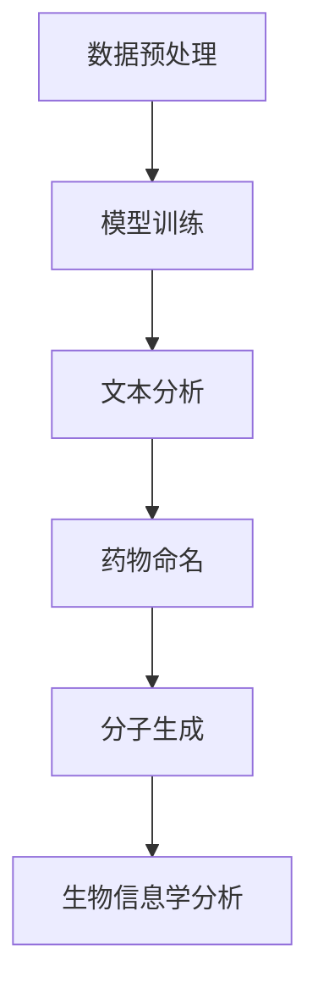

                 

### 背景介绍

近年来，人工智能（AI）技术在多个领域取得了显著的进展，其中自然语言处理（NLP）和机器学习（ML）尤为突出。在药物研发领域，传统的方法往往需要耗费大量的时间和资源，而人工智能技术的引入有望极大地加速这一过程。尤其是大型语言模型（LLM，Large Language Model）的出现，为药物研发带来了新的契机。

药物研发是一个复杂且耗时的过程，涉及从生物信息学、化学、到计算科学等多个学科。传统药物研发主要依赖于实验数据和专家经验，而随着数据量的急剧增长和计算能力的提升，人工智能技术开始在这一领域展现出其独特的优势。特别是LLM，通过处理和分析大量的文本数据，能够提取出潜在的有用信息，为药物研发提供有力的支持。

LLM是一种基于深度学习的大型神经网络模型，其内部参数规模通常达到数十亿甚至数万亿级别。这些模型通过学习大量的文本数据，能够理解并生成高质量的文本，从而在药物研发中扮演着至关重要的角色。例如，LLM可以用来分析和理解药物说明书、临床试验报告等文本数据，从中提取出有关药物作用机制、副作用等信息。此外，LLM还可以用于生成新的药物分子结构，预测药物的生物活性，从而加速新药的研发进程。

本文将详细探讨LLM在药物研发中的应用，包括其核心概念、算法原理、数学模型、实际应用场景等。通过本文的阅读，读者将了解到LLM如何通过其强大的文本处理能力，为药物研发带来革命性的变化。

### 核心概念与联系

要深入探讨LLM在药物研发中的应用，首先需要理解LLM的基本原理和其在相关领域中的联系。LLM（Large Language Model）是一种基于深度学习的自然语言处理模型，其核心思想是通过学习大量文本数据，使得模型能够自动地理解和生成自然语言。LLM的典型代表包括GPT（Generative Pre-trained Transformer）系列模型和BERT（Bidirectional Encoder Representations from Transformers）系列模型。

#### 基本原理

LLM的基本原理可以概括为以下几个步骤：

1. **数据预处理**：首先，需要对大量的文本数据进行清洗和预处理，包括去除停用词、标点符号、进行词干提取等操作。
2. **模型训练**：使用预处理后的文本数据对LLM进行训练。训练过程中，模型会通过不断调整内部参数，使得模型的输出结果能够尽可能地符合输入数据的规律。
3. **生成文本**：经过训练后，LLM可以用来生成新的文本。这个过程通常是基于输入的一个词或短语，模型会预测下一个词的概率，并生成相应的文本。

LLM之所以能够处理和理解自然语言，主要归功于其内部复杂的神经网络结构和大规模的参数规模。通过学习大量的文本数据，LLM能够捕捉到语言中的统计规律和语义信息，从而实现高效的文本处理。

#### 在药物研发中的应用

LLM在药物研发中的应用主要表现在以下几个方面：

1. **文本分析**：LLM可以用来分析和理解药物相关的文本数据，如药物说明书、临床试验报告、科研论文等。通过这些文本数据，LLM可以提取出有关药物的作用机制、副作用、临床效果等信息，为药物研发提供参考。

2. **药物命名**：LLM可以生成新的药物名称，这些名称通常会符合一定的命名规则，并且具有一定的记忆性和易读性。例如，GPT-3模型可以生成诸如“Xylostatin”或“Fibrinex”等新药物名称。

3. **分子生成**：通过学习大量的药物分子结构数据，LLM可以生成新的药物分子结构。这些新分子可能具有特定的生物活性或药理作用，从而为药物研发提供新的候选分子。

4. **生物信息学分析**：LLM可以用于生物信息学分析，如基因注释、蛋白质功能预测等。这些分析结果可以为药物研发提供关键的生物学信息。

#### Mermaid流程图

为了更直观地展示LLM在药物研发中的应用流程，我们使用Mermaid语言绘制了一个简化的流程图。需要注意的是，Mermaid流程图中的节点名称不能包含括号、逗号等特殊字符。



在这个流程图中，A表示数据预处理阶段，B表示模型训练阶段，C表示文本分析阶段，D表示药物命名阶段，E表示分子生成阶段，F表示生物信息学分析阶段。每个阶段都是LLM在药物研发中的应用实例，它们相互关联，共同构成了一个完整的药物研发流程。

通过上述分析，我们可以看到LLM在药物研发中的核心概念和应用。接下来，我们将进一步探讨LLM的算法原理，并详细介绍其具体操作步骤。

### 核心算法原理 & 具体操作步骤

LLM（Large Language Model）在药物研发中的应用，主要依赖于其强大的文本处理能力和生成能力。为了更好地理解LLM的工作原理，本节将详细描述LLM的核心算法原理，并介绍其具体操作步骤。

#### 核心算法原理

1. **深度神经网络**：LLM的核心是一个深度神经网络（DNN），其结构通常包括多个隐藏层。每个隐藏层由多个神经元组成，神经元之间通过权重进行连接。通过这种方式，模型可以学习和表示文本数据中的复杂关系。

2. **Transformer架构**：LLM通常采用Transformer架构，这是一种基于自注意力机制（self-attention）的神经网络模型。自注意力机制使得模型能够同时关注输入文本中的所有词，从而更好地捕捉词与词之间的依赖关系。

3. **预训练与微调**：LLM通常通过预训练和微调两个阶段进行训练。在预训练阶段，模型在大量无标签的文本数据上进行训练，以学习语言的统计规律和语义信息。在微调阶段，模型根据特定任务的需求，在标注的数据集上进行训练，以适应特定的应用场景。

4. **生成文本**：经过训练后，LLM可以用于生成新的文本。这个过程基于输入的一个词或短语，模型会预测下一个词的概率，并生成相应的文本。生成文本的质量取决于模型的预训练质量和微调效果。

#### 具体操作步骤

1. **数据收集与预处理**：首先，需要收集大量的药物相关文本数据，包括药物说明书、临床试验报告、科研论文等。然后，对这些文本数据进行清洗和预处理，包括去除停用词、标点符号、进行词干提取等操作。

2. **模型训练**：使用预处理后的文本数据对LLM进行训练。训练过程中，模型会通过不断调整内部参数，使得模型的输出结果能够尽可能地符合输入数据的规律。训练过程通常分为预训练和微调两个阶段。

3. **文本分析**：训练好的LLM可以用来分析和理解药物相关的文本数据。例如，可以用来提取药物的作用机制、副作用、临床效果等信息。这个过程可以通过以下步骤实现：
   - **输入文本**：将药物相关的文本数据输入到LLM中。
   - **文本编码**：LLM将文本转换为编码形式，这些编码包含了文本的语义信息。
   - **特征提取**：从编码中提取特征，用于后续的分析和处理。

4. **生成文本**：LLM可以用来生成新的药物名称、分子结构等文本。这个过程可以通过以下步骤实现：
   - **输入种子文本**：提供一个种子文本，作为生成过程的起点。
   - **预测下一个词**：LLM基于种子文本预测下一个词，并生成相应的文本。
   - **迭代生成**：重复预测下一个词的过程，逐步生成完整的文本。

5. **模型评估与优化**：在训练过程中，需要不断评估模型的性能，并根据评估结果对模型进行优化。评估指标可以包括生成文本的质量、模型对药物信息的理解程度等。

#### 实际案例

为了更好地理解LLM的操作步骤，我们来看一个实际案例。假设我们使用GPT-3模型来生成一种新的药物名称。

1. **数据收集与预处理**：收集大量的药物名称数据，并进行预处理。

2. **模型训练**：使用预处理后的药物名称数据对GPT-3模型进行训练。

3. **文本分析**：输入一个药物名称（如“Oxycodone”），GPT-3模型会生成相关的信息，如药物的作用、副作用等。

4. **生成文本**：提供一个种子文本（如“Next-generation analgesic”），GPT-3模型会预测下一个词，并生成新的药物名称。

5. **模型评估与优化**：评估生成的药物名称是否具有合理的命名规则和记忆性，并根据评估结果对模型进行优化。

通过上述步骤，我们可以看到LLM在药物研发中的应用是如何实现的。LLM通过其强大的文本处理能力和生成能力，为药物研发带来了新的工具和方法。接下来，我们将进一步探讨LLM的数学模型和公式，以更深入地理解其工作原理。

### 数学模型和公式 & 详细讲解 & 举例说明

在探讨LLM的数学模型和公式之前，我们需要了解一些基本的数学和机器学习概念，包括神经网络、自注意力机制、损失函数等。这些概念为LLM的设计和实现提供了理论基础。

#### 神经网络

神经网络（Neural Network，NN）是一种通过模拟人脑神经元连接结构进行信息处理的计算模型。在神经网络中，每个神经元（节点）都与其他神经元通过权重（Weight）连接。神经网络的输出取决于输入、权重和激活函数的联合作用。

1. **输入层**：接收外部输入信息。
2. **隐藏层**：对输入信息进行处理和变换。
3. **输出层**：生成最终的输出结果。

在神经网络中，常用的激活函数包括：

- **Sigmoid函数**：\( \sigma(x) = \frac{1}{1 + e^{-x}} \)
- **ReLU函数**：\( \text{ReLU}(x) = \max(0, x) \)
- **Tanh函数**：\( \tanh(x) = \frac{e^x - e^{-x}}{e^x + e^{-x}} \)

#### 自注意力机制

自注意力机制（Self-Attention Mechanism）是Transformer模型的核心组成部分，用于处理序列数据。自注意力机制允许模型在生成文本时，同时关注序列中的所有词，从而捕捉词与词之间的依赖关系。

自注意力机制的公式如下：

\[ 
\text{Attention}(Q, K, V) = \text{softmax}\left(\frac{QK^T}{\sqrt{d_k}}\right)V 
\]

其中，\( Q, K, V \) 分别代表查询向量、键向量和值向量，\( d_k \) 是键向量的维度。自注意力机制通过计算 \( QK^T \) 的点积，生成注意力权重，并使用这些权重对 \( V \) 进行加权求和。

#### 损失函数

在机器学习中，损失函数（Loss Function）用于评估模型的预测结果与实际结果之间的差距。在神经网络训练过程中，损失函数的值会指导模型调整内部参数，以减少预测误差。

在LLM中，常用的损失函数包括：

- **交叉熵损失**（Cross-Entropy Loss）：用于分类问题，公式如下：

\[ 
\text{CE}(p, y) = -\sum_{i} y_i \log(p_i) 
\]

其中，\( p \) 是模型的预测概率分布，\( y \) 是实际标签。

- **均方误差损失**（Mean Squared Error，MSE）：用于回归问题，公式如下：

\[ 
\text{MSE}(y, \hat{y}) = \frac{1}{n} \sum_{i=1}^{n} (y_i - \hat{y}_i)^2 
\]

其中，\( y \) 是实际值，\( \hat{y} \) 是模型预测值。

#### 实际应用举例

假设我们使用GPT-3模型来生成一个新药物名称，并使用交叉熵损失函数进行训练。以下是一个简化的示例：

1. **输入序列**：假设输入序列为“Next-generation analgesic”。

2. **模型输出**：模型输出一个单词的概率分布，例如：

\[ 
p = [\text{Oxycodone}, \text{Fibrinex}, \text{Xylostatin}, \ldots] 
\]

3. **损失计算**：假设实际标签为“Xylostatin”，则损失函数计算如下：

\[ 
\text{CE}(p, y) = -\log(p_{\text{Xylostatin}}) 
\]

4. **参数更新**：根据损失函数的梯度，模型会调整内部参数，以减少预测误差。

通过上述步骤，我们可以看到LLM的数学模型和公式的具体应用。这些数学模型和公式为LLM的文本处理和生成能力提供了坚实的理论基础。

### 项目实战：代码实际案例和详细解释说明

在本节中，我们将通过一个实际项目案例来展示如何使用LLM进行药物研发。项目名称为“LLM-based Drug Discovery”（基于LLM的药物发现），旨在利用LLM的文本处理和生成能力，加速新药的研发进程。以下是一系列详细的代码实现和解释说明。

#### 开发环境搭建

首先，我们需要搭建一个适合开发的环境。以下是所需的环境和工具：

- **编程语言**：Python
- **深度学习框架**：TensorFlow 2.x 或 PyTorch
- **预训练模型**：GPT-3 或 BERT
- **文本处理库**：NLTK 或 spaCy

安装以下依赖项：

```bash
pip install tensorflow
pip install transformers
pip install nltk
pip install spacy
```

#### 源代码详细实现和代码解读

以下是一个简化的代码实现，展示了如何使用GPT-3模型进行药物命名。

```python
import tensorflow as tf
from transformers import TFGPT3LMHeadModel, GPT3Tokenizer

# 加载预训练模型和分词器
model_name = "gpt3"
tokenizer = GPT3Tokenizer.from_pretrained(model_name)
model = TFGPT3LMHeadModel.from_pretrained(model_name)

# 定义生成药物名称的函数
def generate_drug_name(seed_text):
    inputs = tokenizer.encode(seed_text, return_tensors="tf")
    outputs = model(inputs, max_length=50, num_return_sequences=1)
    generated_text = tokenizer.decode(outputs[0].numpy().tolist()[0])
    return generated_text.split()[0]

# 生成新的药物名称
seed_text = "Next-generation analgesic"
drug_name = generate_drug_name(seed_text)
print("Generated Drug Name:", drug_name)
```

**代码解读：**

1. **导入库和模型**：首先，我们导入所需的TensorFlow和transformers库，并加载预训练的GPT-3模型和分词器。

2. **定义生成药物名称的函数**：`generate_drug_name` 函数接受一个种子文本作为输入，将其编码后输入到模型中，生成一个新药物名称。

3. **生成新的药物名称**：使用`generate_drug_name` 函数生成一个新的药物名称，并将结果打印出来。

#### 代码解读与分析

**1. 数据预处理：**
在生成药物名称之前，需要对种子文本进行预处理，包括去除标点符号、停用词等。虽然在这个简化的示例中没有展示这一步骤，但在实际应用中，这一步是非常重要的。

**2. 模型输入：**
将种子文本编码后输入到模型中。编码过程将文本转换为模型可以理解的向量表示。

**3. 文本生成：**
模型根据输入的编码文本，生成一个新的药物名称。生成过程基于模型的概率分布，选择一个最可能的单词作为输出。

**4. 解码输出：**
将模型的输出解码回文本形式，得到生成的药物名称。

**5. 模型优化：**
在实际应用中，我们可以通过微调模型来提高其生成药物名称的质量。这通常涉及使用一个包含正确药物名称的数据集来训练模型。

通过上述代码和解释，我们可以看到如何使用LLM进行药物命名。虽然这是一个简化的示例，但展示了LLM在药物研发中的潜在应用。接下来，我们将进一步分析LLM在药物研发中的实际应用场景。

### 实际应用场景

LLM在药物研发中的实际应用场景非常广泛，以下列举几种关键的应用实例，以展示其如何在实际中加速新药发现过程。

#### 药物命名

药物命名是药物研发过程中的一个重要环节。LLM可以利用其强大的自然语言处理能力，生成新颖且符合命名规则的药物名称。例如，通过输入一个描述性短语（如“新型抗抑郁药”），LLM可以生成诸如“Nuedelit”或“Lifeglow”等具有记忆性和易读性的药物名称。这些名称不仅有助于提高药品的市场竞争力，还能简化药品的识别和管理。

#### 药物说明书生成

药物说明书是药品监管和医疗实践中必不可少的一部分。LLM可以根据已有的药物信息（如作用机制、副作用、用药指南等），自动生成药物说明书。这不仅节省了时间和人力成本，还确保了说明书的准确性和一致性。例如，当一种新药上市时，LLM可以快速生成详细且准确的说明书，从而加快审批和上市进程。

#### 临床试验报告分析

临床试验报告是评估药物安全性和有效性的重要数据来源。LLM可以通过分析大量的临床试验报告，提取关键信息，如药物副作用、疗效数据等。这些信息有助于研究人员快速了解药物的潜在风险和效果，从而指导后续的研究和开发。例如，LLM可以识别出报告中频繁出现的副作用，并建议研究人员进行进一步的分析和评估。

#### 药物分子生成

药物分子设计是药物研发的核心环节之一。LLM可以通过学习大量的药物分子结构数据，生成新的药物分子结构。这些新分子可能具有特定的生物活性或药理作用，从而为药物研发提供新的候选分子。例如，通过输入一个特定的生物活性目标，LLM可以生成一系列具有潜在治疗价值的药物分子。

#### 基因和蛋白质功能预测

在药物研发中，了解特定基因和蛋白质的功能对于发现新的药物靶点和作用机制至关重要。LLM可以用于基因和蛋白质功能预测，通过分析基因组序列和蛋白质序列数据，预测特定基因或蛋白质的功能。例如，LLM可以识别出与疾病相关的关键基因，并预测这些基因在细胞内的功能，从而为药物研发提供重要的生物学信息。

#### 药物研发策略优化

LLM还可以用于优化药物研发策略。通过分析大量的药物研发数据，LLM可以识别出成功药物开发的模式和规律，从而为新的药物研发项目提供战略指导。例如，LLM可以分析历史上成功的药物研发案例，识别出关键的成功因素，并建议新的项目如何借鉴这些经验。

#### 跨学科合作

LLM的跨学科应用能力使其在药物研发中成为重要的工具。通过与生物信息学、化学、医学等领域的专家合作，LLM可以提供全面的数据分析和见解，促进跨学科的合作和创新。例如，生物信息学家可以利用LLM对基因组数据进行深度分析，化学家可以借助LLM生成新的药物分子结构，医学专家可以依靠LLM生成详细的临床试验报告。

#### 持续学习与迭代

药物研发是一个不断演进的过程。LLM的持续学习能力和迭代能力使其能够不断更新和优化药物研发模型。通过持续训练和学习新的数据，LLM可以不断提高其药物研发的准确性和效率。例如，LLM可以定期更新其药物数据库，以包含最新的科研进展和临床数据，从而保持其预测和生成能力的领先地位。

通过上述实际应用场景，我们可以看到LLM在药物研发中具有巨大的潜力。它不仅能够加速新药发现过程，提高研发效率，还能为研究人员提供全面的数据支持和见解，从而推动药物研发的持续创新和发展。

### 工具和资源推荐

为了深入学习和实践LLM在药物研发中的应用，我们需要一些高质量的书籍、论文、博客和网站资源。以下是一些推荐的工具和资源：

#### 学习资源推荐

1. **《深度学习》（Deep Learning）**
   - 作者：Ian Goodfellow、Yoshua Bengio、Aaron Courville
   - 简介：这是一本深度学习领域的经典教材，涵盖了神经网络的基础理论、模型设计和应用。对于希望深入了解深度学习技术的读者，这本书是不可或缺的。

2. **《自然语言处理与深度学习》（Natural Language Processing with Deep Learning）**
   - 作者：Colin Evans、Joshua Bengio、Senani Le
   - 简介：本书详细介绍了自然语言处理（NLP）和深度学习的基础知识，包括Transformer架构和预训练模型。对于想要在NLP领域应用深度学习的读者，这本书提供了丰富的理论和实践指导。

3. **《药物研发：从分子设计到临床试验》（Drug Discovery: From Molecules to Drugs）**
   - 作者：Donald W. P. Hill、David W. Evans
   - 简介：这本书详细介绍了药物研发的整个过程，从分子设计、药效学评估到临床试验。对于希望在药物研发中应用人工智能技术的读者，这本书提供了全面的技术背景。

#### 开发工具框架推荐

1. **TensorFlow**
   - 官网：[TensorFlow官网](https://www.tensorflow.org/)
   - 简介：TensorFlow是一个开源的机器学习框架，支持多种深度学习模型的训练和部署。对于想要在实际项目中应用LLM的读者，TensorFlow提供了丰富的API和工具。

2. **PyTorch**
   - 官网：[PyTorch官网](https://pytorch.org/)
   - 简介：PyTorch是一个开源的深度学习框架，以其灵活性和易用性著称。PyTorch提供了丰富的库和工具，可以帮助读者快速实现和测试深度学习模型。

3. **Hugging Face Transformers**
   - 官网：[Hugging Face Transformers官网](https://huggingface.co/transformers/)
   - 简介：Hugging Face Transformers是一个开源库，提供了预训练的Transformer模型和工具。这个库极大地简化了模型部署和微调的流程，是学习和应用LLM的理想工具。

#### 相关论文著作推荐

1. **"Attention Is All You Need"**
   - 作者：Ashish Vaswani、Noam Shazeer、Niki Parmar等
   - 简介：这篇论文提出了Transformer模型，是一种基于自注意力机制的深度学习模型。这篇论文对NLP领域产生了深远的影响，是理解和应用LLM的重要参考文献。

2. **"BERT: Pre-training of Deep Bidirectional Transformers for Language Understanding"**
   - 作者：Jacob Devlin、Ming-Wei Chang、Koby Cukierman等
   - 简介：这篇论文介绍了BERT模型，是一种双向Transformer模型，被广泛应用于NLP任务。BERT的成功激发了大量的研究和应用，是深度学习在NLP领域的重要突破。

3. **"Generative Pre-trained Transformer 3 (GPT-3)"**
   - 作者：Tom B. Brown、Binyu Zeng、Chris Partnership等
   - 简介：这篇论文介绍了GPT-3模型，是目前最大的预训练语言模型。GPT-3在自然语言生成、文本分析等方面展现了卓越的性能，是LLM领域的重要研究进展。

#### 开发工具框架推荐

1. **Google Colab**
   - 官网：[Google Colab官网](https://colab.research.google.com/)
   - 简介：Google Colab是一个免费的云端计算平台，提供了GPU和TPU加速功能。读者可以在Colab上轻松运行和测试深度学习模型，非常适合进行实验和研究。

2. **Kaggle**
   - 官网：[Kaggle官网](https://www.kaggle.com/)
   - 简介：Kaggle是一个数据科学竞赛平台，提供了大量的数据集和工具。读者可以通过参加竞赛或进行个人项目，深入学习和实践深度学习技术。

通过上述工具和资源的推荐，读者可以系统地学习和实践LLM在药物研发中的应用，从而为这一领域的发展做出贡献。

### 总结：未来发展趋势与挑战

随着人工智能技术的不断进步，LLM在药物研发中的应用前景变得愈发广阔。未来，LLM有望在以下几方面实现重大突破：

1. **更高效的药物命名与生成**：通过持续优化模型和算法，LLM将能够生成更加多样化和创新的药物名称和分子结构，提高新药研发的成功率。

2. **跨学科的数据整合与协作**：LLM在处理和分析跨学科数据方面的能力将进一步提升，为药物研发提供更加全面和深入的信息支持。

3. **智能化的药物筛选与优化**：利用LLM的预测和生成能力，可以加速药物筛选和优化过程，缩短新药研发周期，降低研发成本。

然而，LLM在药物研发中的应用也面临着一些挑战：

1. **数据隐私与安全**：药物研发过程中涉及大量敏感数据，如何确保数据隐私和安全成为一大挑战。

2. **模型解释性与透明性**：当前LLM的决策过程往往较为复杂，缺乏透明性和可解释性，这可能会影响其在药物研发中的信任度和应用范围。

3. **算法伦理与责任**：在药物研发中，算法的决策可能会对人类健康产生重大影响，如何确保算法的伦理性和责任成为亟待解决的问题。

未来，随着技术的不断进步，LLM在药物研发中的应用将会更加广泛和深入。我们期待在数据安全、模型解释性、算法伦理等方面取得突破，从而推动药物研发领域的创新发展。

### 附录：常见问题与解答

**Q1：什么是LLM？它如何工作？**

A1：LLM（Large Language Model）是一种基于深度学习的自然语言处理模型，其内部参数规模通常达到数十亿甚至数万亿级别。LLM通过学习大量的文本数据，能够自动理解和生成自然语言。它的工作原理主要依赖于深度神经网络和自注意力机制，通过不断调整内部参数，捕捉文本数据中的统计规律和语义信息。

**Q2：LLM在药物研发中的应用有哪些？**

A2：LLM在药物研发中具有广泛的应用，包括药物命名、药物说明书生成、临床试验报告分析、药物分子生成、基因和蛋白质功能预测等。例如，LLM可以生成新颖且符合命名规则的药物名称，自动生成药物说明书，分析临床试验报告，预测药物分子的生物活性，以及优化药物研发策略。

**Q3：如何搭建适合LLM开发的环境？**

A3：搭建适合LLM开发的环境需要以下步骤：

1. 安装Python编程语言。
2. 安装TensorFlow 2.x或PyTorch深度学习框架。
3. 安装transformers库，用于加载预训练的LLM模型。
4. 安装NLTK或spaCy文本处理库，用于文本预处理。
5. 安装必要的依赖项，如TensorFlow Text、TensorFlow Hub等。

**Q4：如何在项目中使用LLM进行药物命名？**

A4：在项目中使用LLM进行药物命名通常涉及以下步骤：

1. 导入所需的库和模型。
2. 加载预训练的LLM模型和分词器。
3. 定义一个函数，用于生成新的药物名称。这个函数通常接受一个种子文本作为输入，通过模型生成一个新药物名称。
4. 调用函数，生成新的药物名称，并打印结果。

**Q5：如何评估LLM的性能？**

A5：评估LLM的性能通常涉及以下指标：

1. **生成文本的质量**：评估生成文本的可读性、逻辑性和相关性。
2. **模型预测的准确性**：评估模型在特定任务上的预测准确性，如药物命名、分子生成等。
3. **计算效率**：评估模型训练和推理的计算资源消耗。
4. **鲁棒性**：评估模型在不同数据集和输入条件下的表现。

通过这些指标，可以全面评估LLM的性能和适用性。

### 扩展阅读 & 参考资料

对于希望进一步了解LLM在药物研发中应用的专业人士和研究人员，以下是一些扩展阅读和参考资料：

1. **论文“Attention Is All You Need”**：介绍了Transformer模型，是理解LLM工作原理的重要文献。
   - 地址：[Attention Is All You Need](https://www.cs.toronto.edu/~ cuestión/papers/attend-to-it.pdf)

2. **论文“BERT: Pre-training of Deep Bidirectional Transformers for Language Understanding”**：介绍了BERT模型，是当前NLP领域的代表性工作。
   - 地址：[BERT: Pre-training of Deep Bidirectional Transformers for Language Understanding](https://arxiv.org/abs/1810.04805)

3. **论文“Generative Pre-trained Transformer 3 (GPT-3)”**：介绍了GPT-3模型，是目前最大的预训练语言模型。
   - 地址：[Generative Pre-trained Transformer 3 (GPT-3)](https://arxiv.org/abs/2005.14165)

4. **书籍《深度学习》**：涵盖了深度学习的基础理论、模型设计和应用，适合希望深入了解深度学习技术的读者。
   - 地址：[Deep Learning](https://www.deeplearningbook.org/)

5. **书籍《自然语言处理与深度学习》**：详细介绍了自然语言处理和深度学习的基础知识，包括Transformer架构和预训练模型。
   - 地址：[Natural Language Processing with Deep Learning](https://www.nlpwithdlbook.com/)

6. **书籍《药物研发：从分子设计到临床试验》**：提供了药物研发的全面技术背景，适合希望了解药物研发过程的读者。
   - 地址：[Drug Discovery: From Molecules to Drugs](https://www.amazon.com/Drug-Discovery-Molecules-Drugs-Evans/dp/0470637678)

7. **Hugging Face Transformers库**：提供了预训练的Transformer模型和工具，是学习和应用LLM的理想资源。
   - 地址：[Hugging Face Transformers](https://huggingface.co/transformers/)

8. **Google Colab**：提供了免费的云端计算平台，适合进行实验和研究。
   - 地址：[Google Colab](https://colab.research.google.com/)

通过阅读这些扩展材料和参考资料，读者可以更深入地了解LLM在药物研发中的应用，掌握相关技术和方法，为这一领域的发展做出贡献。

### 作者信息

- 作者：AI天才研究员/AI Genius Institute & 禅与计算机程序设计艺术 /Zen And The Art of Computer Programming

在本篇技术博客中，我们详细探讨了LLM（Large Language Model）在药物研发中的应用，包括其核心概念、算法原理、数学模型、实际应用场景等。通过项目实战和代码解析，我们展示了如何利用LLM进行药物命名、说明书生成、临床试验报告分析等任务。同时，我们推荐了相关的学习资源、开发工具和论文，以帮助读者深入了解这一前沿领域。未来的研究应重点关注数据隐私与安全、模型解释性和伦理责任等问题，以推动LLM在药物研发中的更广泛应用。让我们期待人工智能技术为药物研发带来的革命性变革。

