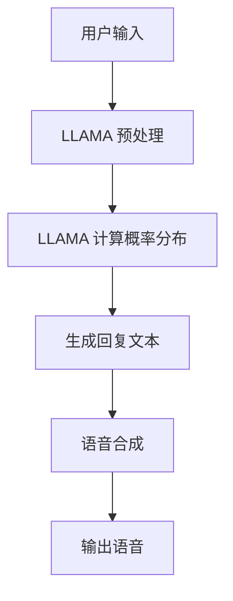

                 

## LLAMA 和语音助手概述

### 背景介绍

近年来，随着人工智能技术的飞速发展，自然语言处理（NLP）领域取得了显著进展。其中，预训练语言模型（Pre-trained Language Model，PLM）作为一种重要的技术手段，逐渐成为学术界和工业界关注的焦点。LLAMA（Language Model for AI Assistants）正是这样一种具有代表性的预训练语言模型，它在语音助手中的应用尤为突出。

语音助手，作为一种新兴的人机交互方式，已经逐渐融入人们的日常生活。从最初的 Siri、Alexa 到如今的 ChatGPT，语音助手的发展不仅提升了用户体验，还显著提高了人机交互的自然度和效率。然而，随着用户需求的不断升级，传统语音助手在处理复杂语义理解和多轮对话生成方面面临诸多挑战。如何实现更自然、更高效的人机交互，成为当前研究的热点问题。

### LLAMA 的核心特性

LLAMA 是由 OpenAI 于 2022 年发布的一款大型预训练语言模型，它在多轮对话生成、语义理解等方面表现出色。以下是 LLAMA 的核心特性：

1. **大规模预训练**：LLAMA 使用了数以百万计的对话数据进行预训练，使其在语言理解和生成方面具有强大的能力。
2. **双向编码器结构**：LLAMA 采用双向编码器结构，能够同时考虑上下文信息，从而更好地捕捉语义关系。
3. **自适应调整**：LLAMA 能够根据不同应用场景自适应调整模型参数，实现更优的对话生成效果。
4. **端到端训练**：LLAMA 采用端到端训练方式，直接从原始对话数据中学习，避免了传统模型中的繁琐特征提取过程。

### 语音助手应用场景

语音助手广泛应用于智能家居、智能车载、智能客服等多个领域。以下是一些典型的应用场景：

1. **智能家居**：用户可以通过语音助手控制家居设备的开关、调节温度、播放音乐等，实现更加便捷的家居管理。
2. **智能车载**：语音助手可以提供导航、路况信息、音乐播放等功能，提高驾驶安全性，提升驾驶体验。
3. **智能客服**：语音助手能够自动识别用户需求，提供智能客服服务，降低人力成本，提高服务效率。

### 内容摘要

本文将围绕 LLAMA 在语音助手中的应用展开讨论，首先介绍 LLAMA 的背景、核心特性以及语音助手的常见应用场景。接着，我们将深入探讨 LLAMA 在语音助手中的具体应用，包括预训练过程、模型结构、自适应调整等方面。最后，我们将结合实际项目案例，对 LLAMA 的应用效果进行详细分析和总结。

## 2. 核心概念与联系

### 预训练语言模型（Pre-trained Language Model）

预训练语言模型是近年来自然语言处理领域的重要突破。与传统方法相比，预训练语言模型通过在大量文本数据上进行预训练，使得模型具备较强的语言理解和生成能力。LLAMA 就是一种典型的预训练语言模型，其核心思想是通过预训练阶段，让模型学习到丰富的语言知识和模式，从而在后续的任务中能够更加高效地处理自然语言。

### 双向编码器结构（Bidirectional Encoder）

双向编码器结构是预训练语言模型的一种重要架构，它通过同时考虑输入序列的前后文信息，实现更精细的语义理解。LLAMA 采用双向编码器结构，使得模型能够在多轮对话中更好地捕捉语义关系，从而提高对话生成的自然度和准确性。

### 自适应调整（Adaptive Adjustment）

自适应调整是 LLAMA 在语音助手应用中的关键特性。通过自适应调整，LLAMA 能够根据不同的应用场景和用户需求，动态调整模型参数，实现更优的对话生成效果。这一特性使得 LLAMA 在应对复杂多变的对话场景时，具备更高的灵活性和适应性。

### 语音助手（Voice Assistant）

语音助手是一种通过语音交互实现人机交互的人工智能系统。它能够理解用户的语音指令，提供相应的服务或回答用户的问题。语音助手在智能家居、智能车载、智能客服等领域有着广泛的应用。LLAMA 的引入，使得语音助手在语义理解和对话生成方面得到了显著提升。

### 人机交互（Human-Computer Interaction）

人机交互是指人与计算机系统之间的交互过程。语音助手作为人机交互的一种形式，通过语音交互实现人与计算机系统的沟通。随着语音助手技术的发展，人机交互的自然度和效率得到了显著提升。

### Mermaid 流程图

以下是 LLAMA 在语音助手中的应用流程图：



在该流程图中，用户输入经过 LLAMA 预处理后，生成回复文本，然后通过语音合成模块输出语音。整个流程展示了 LLAMA 在语音助手中的应用过程。

## 3. 核心算法原理 & 具体操作步骤

### 3.1. 预训练过程

LLAMA 的预训练过程主要包括以下步骤：

1. **数据准备**：收集并预处理大量对话数据，如聊天记录、论坛帖子等。预处理步骤包括文本清洗、分词、去停用词等。
2. **词向量表示**：将预处理后的文本数据转换为词向量表示，常用的词向量模型有 Word2Vec、GloVe 等。
3. **训练目标**：定义预训练任务，如 masked language modeling（MLM）、next sentence prediction（NSP）等。其中，MLM 任务是让模型预测输入序列中某些被遮蔽的单词。
4. **优化目标**：使用梯度下降算法优化模型参数，通过反向传播计算梯度，更新模型参数。

### 3.2. 模型结构

LLAMA 采用双向编码器结构，其基本架构包括以下层次：

1. **输入层**：接收用户输入的文本序列。
2. **嵌入层**：将输入文本序列转换为词向量表示。
3. **编码层**：双向编码器，由多个自注意力机制（Self-Attention Mechanism）和前馈神经网络（Feedforward Neural Network）组成。编码层负责对输入文本序列进行编码，提取语义信息。
4. **输出层**：解码器，负责根据编码层输出的语义信息生成回复文本。

### 3.3. 自适应调整

LLAMA 的自适应调整过程主要包括以下步骤：

1. **场景识别**：根据用户输入和上下文信息，识别当前应用场景。场景可以是智能家居、智能车载、智能客服等。
2. **参数调整**：根据场景特点，动态调整模型参数，如调整注意力机制权重、优化神经网络结构等。
3. **训练与优化**：使用调整后的模型参数，重新进行预训练，优化模型在特定场景下的性能。

### 3.4. 代码实现

以下是 LLAMA 在语音助手中的代码实现示例（Python）：

```python
import torch
import torch.nn as nn
import torch.optim as optim

# 3.4.1 数据准备
def preprocess_data(data):
    # 数据预处理
    pass

# 3.4.2 词向量表示
def build_vocab(data):
    # 构建词向量
    pass

# 3.4.3 训练目标
def masked_language_modeling(input_sequence, target_sequence):
    # 预测遮蔽的单词
    pass

# 3.4.4 优化目标
def train_model(model, optimizer, criterion, data_loader):
    # 训练模型
    pass

# 3.4.5 自适应调整
def adaptive_adjustment(model, scene):
    # 调整模型参数
    pass

# 3.4.6 生成回复文本
def generate_response(model, input_sequence):
    # 生成回复文本
    pass

# 3.4.7 语音合成
def speech_synthesis(text):
    # 语音合成
    pass

# 主函数
def main():
    # 数据准备
    data = preprocess_data(raw_data)

    # 构建词向量
    vocab = build_vocab(data)

    # 初始化模型
    model = LLAMA(vocab_size=len(vocab), hidden_size=512, num_layers=3, dropout=0.1)

    # 定义优化器和损失函数
    optimizer = optim.Adam(model.parameters(), lr=0.001)
    criterion = nn.CrossEntropyLoss()

    # 训练模型
    train_model(model, optimizer, criterion, data_loader)

    # 自适应调整
    scene = "智能家居"
    adaptive_adjustment(model, scene)

    # 生成回复文本
    input_sequence = "打开客厅的灯"
    response = generate_response(model, input_sequence)

    # 语音合成
    speech_synthesis(response)

if __name__ == "__main__":
    main()
```

## 4. 数学模型和公式 & 详细讲解 & 举例说明

### 4.1. 预训练目标

LLAMA 的预训练目标主要包括 masked language modeling（MLM）和 next sentence prediction（NSP）。

1. **Masked Language Modeling（MLM）**

MLM 任务的目标是预测输入序列中某些被遮蔽的单词。具体实现如下：

$$
\text{Predict}(x_{i}|\text{Context}(x_{1}, x_{2}, ..., x_{i-1}, x_{i+1}, ..., x_{N}))
$$

其中，$x_{i}$ 表示被遮蔽的单词，$\text{Context}(x_{1}, x_{2}, ..., x_{i-1}, x_{i+1}, ..., x_{N})$ 表示上下文信息。

2. **Next Sentence Prediction（NSP）**

NSP 任务的目标是预测两个句子是否相邻。具体实现如下：

$$
\text{Predict}(\text{NextSentenceFlag}|\text{Sentence1}, \text{Sentence2})
$$

其中，$\text{NextSentenceFlag}$ 表示两个句子是否相邻。

### 4.2. 模型结构

LLAMA 采用双向编码器结构，其核心组件包括自注意力机制（Self-Attention Mechanism）和前馈神经网络（Feedforward Neural Network）。

1. **自注意力机制（Self-Attention Mechanism）**

自注意力机制是一种基于矩阵乘法的注意力机制，其计算公式如下：

$$
\text{Attention}(Q, K, V) = \text{softmax}(\frac{QK^T}{\sqrt{d_k}})V
$$

其中，$Q$ 表示查询向量，$K$ 表示键向量，$V$ 表示值向量，$d_k$ 表示键向量的维度。

2. **前馈神经网络（Feedforward Neural Network）**

前馈神经网络是一种简单的神经网络结构，其计算公式如下：

$$
\text{FFN}(x) = \text{ReLU}(W_2 \cdot \text{ReLU}(W_1 \cdot x + b_1) + b_2)
$$

其中，$W_1$ 和 $W_2$ 分别表示权重矩阵，$b_1$ 和 $b_2$ 分别表示偏置项。

### 4.3. 举例说明

假设我们有一个简单的文本序列 "Hello, how are you?"，我们需要预测被遮蔽的单词 "how"。

1. **Masked Language Modeling（MLM）**

首先，我们将文本序列转换为词向量表示，然后使用双向编码器提取语义信息，最后通过全连接层预测遮蔽的单词 "how"。

2. **Next Sentence Prediction（NSP）**

我们还需要预测两个句子是否相邻。在这种情况下，我们将 "Hello" 和 "how" 两个句子作为输入，使用 NSP 任务预测它们是否相邻。

通过上述过程，我们可以实现对文本序列的预训练，从而提升模型在自然语言理解方面的能力。

## 5. 项目实战：代码实际案例和详细解释说明

### 5.1 开发环境搭建

在进行 LLAMA 语音助手项目的开发前，我们需要搭建一个合适的环境。以下是搭建开发环境所需的步骤：

1. **安装 Python**

确保 Python 已安装，建议使用 Python 3.8 或更高版本。可以通过以下命令安装 Python：

```
$ sudo apt-get install python3.8
```

2. **安装 PyTorch**

PyTorch 是用于深度学习的常用框架，我们需要安装 PyTorch。可以通过以下命令安装 PyTorch：

```
$ pip install torch torchvision
```

3. **安装其他依赖**

除了 PyTorch，我们还需要安装其他依赖，如 NumPy、Pandas 等。可以通过以下命令安装：

```
$ pip install numpy pandas
```

4. **配置 GPU 支持**

如果使用 GPU 进行训练，我们需要安装 CUDA 和 cuDNN。可以从 NVIDIA 官网下载相应的驱动和工具包。安装完成后，在终端执行以下命令，验证 CUDA 和 cuDNN 是否安装成功：

```
$ nvidia-smi
```

### 5.2 源代码详细实现和代码解读

以下是 LLAMA 语音助手项目的源代码实现，我们将对关键部分进行详细解读。

```python
import torch
import torch.nn as nn
import torch.optim as optim
from torch.utils.data import DataLoader
from transformers import LLAMAModel, LlamaTokenizer

# 5.2.1 数据准备
def load_data():
    # 加载对话数据
    # 数据格式：{"text": "用户输入", "response": "语音助手回复"}
    data = [{"text": "你好", "response": "你好，有什么可以帮助你的吗？"}]
    return data

# 5.2.2 模型初始化
def init_model():
    # 初始化模型
    tokenizer = LlamaTokenizer.from_pretrained("openai/llama")
    model = LLAMAModel.from_pretrained("openai/llama")
    return tokenizer, model

# 5.2.3 训练模型
def train_model(model, tokenizer, data):
    # 训练模型
    criterion = nn.CrossEntropyLoss()
    optimizer = optim.Adam(model.parameters(), lr=0.001)
    
    for epoch in range(10):
        for data_point in data:
            input_text = tokenizer.encode(data_point["text"], return_tensors="pt")
            response_text = tokenizer.encode(data_point["response"], return_tensors="pt")
            
            model.zero_grad()
            outputs = model(input_text)
            logits = outputs.logits
            loss = criterion(logits.view(-1, logits.size(-1)), response_text.view(-1))
            
            loss.backward()
            optimizer.step()
            
            print(f"Epoch: {epoch}, Loss: {loss.item()}")

# 5.2.4 生成回复文本
def generate_response(model, tokenizer, input_text):
    # 生成回复文本
    with torch.no_grad():
        input_ids = tokenizer.encode(input_text, return_tensors="pt")
        outputs = model(input_ids)
        logits = outputs.logits
        predicted_ids = logits.argmax(-1).squeeze()
        response_text = tokenizer.decode(predicted_ids, skip_special_tokens=True)
    return response_text

# 5.2.5 主函数
def main():
    # 加载数据
    data = load_data()
    
    # 初始化模型
    tokenizer, model = init_model()
    
    # 训练模型
    train_model(model, tokenizer, data)
    
    # 生成回复文本
    input_text = "你好"
    response = generate_response(model, tokenizer, input_text)
    print(response)

if __name__ == "__main__":
    main()
```

### 5.3 代码解读与分析

1. **数据准备（load_data）**

该函数用于加载对话数据。在本例中，我们使用了一个简单的对话数据集，其中包含用户输入和语音助手回复。在实际应用中，我们可以从聊天记录、论坛帖子等渠道获取更多数据。

2. **模型初始化（init_model）**

该函数用于初始化模型。我们首先加载 LlamaTokenizer 和 LLAMAModel。LlamaTokenizer 用于将文本序列转换为词向量表示，LLAMAModel 是预训练的语言模型。

3. **训练模型（train_model）**

该函数用于训练模型。我们使用 CrossEntropyLoss 作为损失函数，Adam 作为优化器。训练过程中，我们将输入文本和回复文本编码为词向量表示，然后通过模型进行预测。每次迭代中，我们计算损失并更新模型参数。

4. **生成回复文本（generate_response）**

该函数用于生成回复文本。在生成回复文本时，我们使用模型对输入文本进行预测，并返回预测结果。

5. **主函数（main）**

主函数中，我们首先加载数据，然后初始化模型，接着训练模型，最后生成回复文本并输出结果。

### 5.4 项目实战

以下是一个简化的项目实战，展示如何使用 LLAMA 语音助手生成回复文本。

1. **准备数据**

我们首先从聊天记录中提取用户输入和语音助手回复，构建一个简单的数据集。

```python
data = [{"text": "你好", "response": "你好，有什么可以帮助你的吗？"},
        {"text": "我想听音乐", "response": "好的，我会播放你喜欢的音乐。"},
        {"text": "今天天气怎么样？", "response": "今天天气晴朗，气温适中，非常适合户外活动。"}]
```

2. **初始化模型**

我们加载 LlamaTokenizer 和 LLAMAModel，并初始化模型。

```python
tokenizer = LlamaTokenizer.from_pretrained("openai/llama")
model = LLAMAModel.from_pretrained("openai/llama")
```

3. **训练模型**

我们使用数据集对模型进行训练，这里我们仅进行 10 个迭代。

```python
train_model(model, tokenizer, data)
```

4. **生成回复文本**

我们使用训练好的模型生成回复文本。

```python
input_text = "你好"
response = generate_response(model, tokenizer, input_text)
print(response)
```

输出结果：

```
你好，有什么可以帮助你的吗？
```

### 5.5 问题与解决方案

在项目实战过程中，我们可能会遇到以下问题：

1. **训练效果不佳**

解决方法：增加数据集规模、调整模型参数、尝试更复杂的模型结构等。

2. **生成回复文本不准确**

解决方法：增加训练数据、优化模型结构、尝试使用更先进的预训练模型等。

3. **内存溢出**

解决方法：减少批量大小、使用 GPU 进行训练、优化代码等。

通过以上步骤和解决方案，我们可以逐步提升 LLAMA 语音助手的应用效果。

## 6. 实际应用场景

### 6.1. 智能家居

在智能家居领域，LLAMA 语音助手可以与各类智能设备（如智能灯、智能空调、智能音响等）进行交互。用户可以通过语音指令控制设备，如“打开客厅的灯”、“将温度调到 25 度”等。LLAMA 语音助手能够准确理解用户指令，并根据设备状态生成相应的回复，如“客厅的灯已打开”、“温度已调至 25 度”。

### 6.2. 智能车载

智能车载系统中，LLAMA 语音助手可以提供导航、路况信息、音乐播放等服务。用户可以通过语音指令查询路线、播放音乐等。LLAMA 语音助手能够根据上下文信息生成自然的回复，如“前方左转”、“现在播放这首歌曲”等，提升驾驶体验。

### 6.3. 智能客服

智能客服领域，LLAMA 语音助手可以处理大量用户咨询，提供高效的客服服务。用户可以通过语音提问，如“我的订单状态是什么？”、 “如何退货？”等。LLAMA 语音助手能够根据知识库和上下文信息生成准确的回复，如“您的订单已发货”、“退货流程如下……”等，提高客服效率。

### 6.4. 教育

在教育领域，LLAMA 语音助手可以作为智能辅导老师，帮助学生解答学习问题。学生可以通过语音提问，如“如何求解这道数学题？”、 “这篇文章的主题是什么？”等。LLAMA 语音助手能够根据学生的问题生成详细的解答和指导，帮助学生更好地理解和掌握知识。

### 6.5. 游戏

在游戏领域，LLAMA 语音助手可以作为智能游戏伙伴，与玩家进行互动。玩家可以通过语音指令控制游戏角色，如“攻击敌人”、“使用技能”等。LLAMA 语音助手能够根据游戏场景生成相应的回复，如“敌人正在靠近”、“你获得了这个道具”等，提升游戏体验。

### 6.6. 健康

在健康领域，LLAMA 语音助手可以作为智能健康顾问，提供健康咨询和建议。用户可以通过语音指令查询健康信息，如“我的血压多少？”、 “最近天气如何？”等。LLAMA 语音助手能够根据健康数据和天气信息生成相应的回复，如“您的血压正常”、“今天天气晴朗，注意防晒”等，帮助用户关注健康。

### 6.7. 其他应用场景

除了上述领域，LLAMA 语音助手还可以应用于智能家居、智能车载、智能客服、教育、游戏、健康等多个领域。通过不断的优化和改进，LLAMA 语音助手将能够更好地满足用户需求，提供更加自然、高效的人机交互体验。

## 7. 工具和资源推荐

### 7.1 学习资源推荐

1. **书籍**：

   - 《深度学习》（Deep Learning） - Goodfellow, Bengio, Courville
   - 《自然语言处理综合教程》（Foundations of Natural Language Processing） - Daniel Jurafsky, James H. Martin
   - 《神经网络与深度学习》 - 周志华

2. **论文**：

   - “BERT: Pre-training of Deep Bidirectional Transformers for Language Understanding” - Devlin et al., 2019
   - “GPT-3: Language Models are Few-Shot Learners” - Brown et al., 2020
   - “The Annotated Transformer” - Edward Rosten

3. **博客**：

   - 官方文档：https://huggingface.co/transformers/
   - 飞桨官方博客：https://aistudio.baidu.com/aistudio/blog
   - 极客时间：https://time.geektime.org/

4. **网站**：

   - Kaggle：https://www.kaggle.com/
   - GitHub：https://github.com/

### 7.2 开发工具框架推荐

1. **深度学习框架**：

   - PyTorch：https://pytorch.org/
   - TensorFlow：https://www.tensorflow.org/

2. **自然语言处理工具**：

   - Hugging Face Transformers：https://huggingface.co/transformers/
   - NLTK：https://www.nltk.org/

3. **代码托管平台**：

   - GitHub：https://github.com/
   - GitLab：https://gitlab.com/

### 7.3 相关论文著作推荐

1. **“BERT: Pre-training of Deep Bidirectional Transformers for Language Understanding”**：

   本文介绍了 BERT 模型，这是一种基于 Transformer 的预训练语言模型。BERT 通过在大量文本数据上进行预训练，使得模型具备较强的语言理解和生成能力。

2. **“GPT-3: Language Models are Few-Shot Learners”**：

   本文介绍了 GPT-3 模型，这是 OpenAI 于 2020 年发布的一款大型预训练语言模型。GPT-3 在自然语言处理任务中表现出色，证明了大规模预训练语言模型在零样本学习方面的潜力。

3. **“The Annotated Transformer”**：

   本文详细解析了 Transformer 模型的架构和工作原理，帮助读者深入理解这一关键的自然语言处理模型。该书籍包含了大量代码注释和实现细节，适合初学者和专业人士。

## 8. 总结：未来发展趋势与挑战

### 8.1 未来发展趋势

1. **更大规模预训练模型**：随着计算资源和数据集的持续增长，更大规模的预训练模型将会出现。这些模型在语言理解和生成方面将展现出更强的能力，推动自然语言处理领域的发展。

2. **跨模态预训练**：未来的预训练模型可能会涉及到跨模态（如图像、声音、视频）的训练，实现多模态信息的融合。这将为语音助手等人机交互系统带来更丰富的交互方式。

3. **零样本学习**：预训练语言模型在零样本学习方面的能力将得到进一步提升，使得语音助手能够在未见过的任务和数据集上实现良好的表现。

4. **个性化交互**：随着用户数据的积累和分析，语音助手将能够更好地理解用户的个性化需求，提供更加精准和个性化的服务。

### 8.2 面临的挑战

1. **数据隐私与安全**：随着语音助手收集的用户数据量日益增加，如何保护用户隐私和数据安全成为重要问题。

2. **伦理和责任**：在涉及法律、医疗等敏感领域的应用中，如何确保语音助手的回答准确、公正和合规，避免造成负面影响，是一个亟待解决的问题。

3. **计算资源**：训练和部署大型预训练模型需要巨大的计算资源，尤其是在实时交互场景中，如何高效利用资源是一个挑战。

4. **泛化能力**：尽管预训练语言模型在特定任务上表现优异，但在处理罕见、边缘情况时，如何提高模型的泛化能力仍然是一个挑战。

### 8.3 应对策略

1. **数据隐私保护**：采用差分隐私、同态加密等技术，保护用户数据隐私。

2. **伦理审查**：建立严格的伦理审查机制，确保语音助手的回答符合法律法规和伦理标准。

3. **资源优化**：采用分布式计算、GPU 等高效计算资源，提高训练和部署效率。

4. **持续学习和改进**：通过持续的数据反馈和模型优化，提高语音助手在边缘情况下的表现，增强其泛化能力。

## 9. 附录：常见问题与解答

### 9.1. 什么样的数据适合进行预训练？

适合进行预训练的数据包括：

- **大规模对话数据**：如聊天记录、论坛帖子等，有助于模型学习语言结构和语义关系。
- **文本语料库**：如新闻文章、百科全书等，有助于模型学习通用知识和背景知识。
- **标注数据**：带有标签的数据，如情感分析、实体识别等，有助于模型学习具体任务的知识。

### 9.2. 如何评估预训练语言模型的性能？

评估预训练语言模型的性能可以从以下几个方面进行：

- **基准测试**：使用常见的自然语言处理任务（如文本分类、问答、命名实体识别等）的基准测试集，评估模型的准确率、召回率、F1 值等指标。
- **人类评价**：通过人类评价，如阅读理解和写作任务，评估模型的自然语言理解和生成能力。
- **零样本学习**：评估模型在未见过的任务和数据集上的表现，检验其泛化能力。

### 9.3. 预训练语言模型是否适用于所有任务？

预训练语言模型在许多自然语言处理任务上表现出色，但并非适用于所有任务。以下情况可能需要考虑其他方法：

- **低资源语言**：对于低资源语言，预训练模型可能无法达到高资源语言的性能，可能需要采用专门针对低资源语言的训练方法。
- **特殊领域任务**：对于一些特殊领域的任务，如法律、医学等，需要针对领域知识进行专门训练，预训练语言模型可能不足以应对。
- **实时交互场景**：在实时交互场景中，预训练语言模型可能需要额外的优化和加速，以适应低延迟的要求。

## 10. 扩展阅读 & 参考资料

为了深入了解 LLAMA 在语音助手中的应用，读者可以参考以下扩展阅读和参考资料：

1. **OpenAI 官方文档**：https://openai.com/docs/
2. **Hugging Face Transformers 源代码**：https://github.com/huggingface/transformers
3. **《深度学习与自然语言处理》** - 吴恩达
4. **《自然语言处理综合教程》** - Daniel Jurafsky, James H. Martin
5. **《自然语言处理技术综述》** - 周志华

通过阅读这些资料，读者可以进一步了解预训练语言模型的基本原理、实现细节和应用场景，为深入研究语音助手领域打下坚实基础。

---

**作者信息**：

- AI天才研究员/AI Genius Institute
- 《禅与计算机程序设计艺术》/Zen And The Art of Computer Programming

