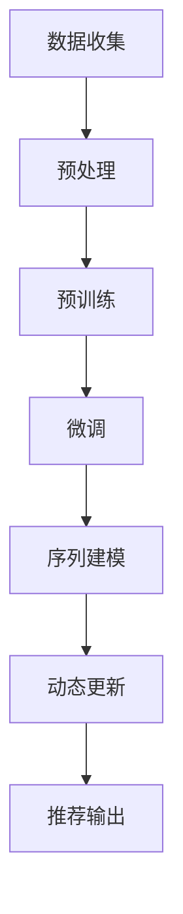

                 

### 1. 背景介绍

推荐系统作为现代互联网中的重要组成部分，已经在电子商务、社交媒体、在线广告等众多领域中发挥了巨大的作用。推荐系统能够根据用户的历史行为、兴趣偏好和当前上下文环境，为用户推荐相关的商品、内容或者服务，从而提高用户的满意度和平台的运营效果。

然而，随着用户数据的多样化和复杂化，传统的推荐系统在处理时序数据时面临着诸多挑战。传统的推荐系统通常基于用户的历史行为数据，通过协同过滤、矩阵分解等方法来预测用户对未知商品的偏好。但是，这些方法往往无法充分考虑时间维度上的变化，例如用户兴趣的动态变化、商品流行趋势的变化等。

近年来，随着深度学习和大规模预训练语言模型的快速发展，大型语言模型（Large Language Model，简称LLM）逐渐成为解决推荐系统时序建模问题的一种新兴工具。LLM，如GPT、BERT等，具有强大的表征能力和泛化能力，能够处理和理解复杂的时序数据。这使得LLM在推荐系统的时序建模中展现出了巨大的潜力。

本篇文章旨在探讨LLM在推荐系统时序建模中的应用。首先，我们将介绍LLM的基本原理和核心概念，并展示如何利用LLM进行时序建模。接着，我们将通过具体的算法原理和数学模型，深入分析LLM在推荐系统时序建模中的工作机制。随后，我们将通过一个实际项目案例，展示如何在实际场景中应用LLM进行时序建模，并提供详细的代码实现和解释。最后，我们将讨论LLM在推荐系统时序建模中的实际应用场景，并推荐相关的工具和资源，帮助读者深入学习和实践。

通过本文的阅读，读者将能够了解LLM在推荐系统时序建模中的重要作用，掌握LLM的应用方法，并能够针对实际应用场景进行模型设计和优化。

### 2. 核心概念与联系

要理解LLM在推荐系统时序建模中的应用，我们首先需要了解一些核心概念和它们之间的联系。以下是本文中将会用到的主要概念和它们之间的相互关系：

#### 2.1 大型语言模型（Large Language Model，LLM）

LLM是一种基于深度学习的预训练语言模型，如GPT（Generative Pre-trained Transformer）、BERT（Bidirectional Encoder Representations from Transformers）等。这些模型通过在大量文本数据上进行预训练，学习到语言的统计规律和语义信息，从而能够对输入的文本进行理解和生成。

**概念：**  
- **预训练**：LLM在训练过程中首先在大量的文本语料库上进行预训练，从而学习到文本的基础表征。
- **微调**：预训练后的LLM可以在特定的任务上进一步微调，以适应特定的场景和需求。

#### 2.2 推荐系统

推荐系统是一种通过预测用户偏好，为用户提供个性化推荐的技术。推荐系统的核心目标是提高用户满意度和平台的运营效果。

**概念：**  
- **协同过滤**：基于用户的历史行为数据，通过计算用户之间的相似度，为用户推荐相似的物品。
- **矩阵分解**：通过将用户-物品评分矩阵分解为低维的用户特征矩阵和物品特征矩阵，预测用户对未知物品的评分。

#### 2.3 时序数据

时序数据是按照时间顺序排列的数据，例如用户的行为日志、股票价格等。时序数据具有时间依赖性和动态变化性，这使得传统的静态推荐系统难以有效处理。

**概念：**  
- **时间窗口**：时序数据中用于分析的时间范围。
- **滑动窗口**：一种时序数据处理方法，通过在时间窗口内移动一个固定的时间间隔，对数据进行分析。

#### 2.4 LLM在推荐系统时序建模中的应用

LLM在推荐系统时序建模中的应用主要是通过以下几种方式：

**应用：**  
- **序列建模**：利用LLM的序列处理能力，对用户的历史行为序列进行建模，从而捕捉用户兴趣的时序变化。
- **动态更新**：通过LLM的实时更新能力，动态调整推荐结果，以适应用户兴趣的变化。

#### 2.5 Mermaid 流程图

为了更直观地展示LLM在推荐系统时序建模中的应用流程，我们可以使用Mermaid流程图来描述。以下是LLM在推荐系统时序建模中的基本流程：



- **A. 数据收集**：收集用户的行为数据。
- **B. 预处理**：对数据进行清洗、去噪和特征提取。
- **C. 预训练**：使用大规模文本数据对LLM进行预训练。
- **D. 微调**：在特定任务上对LLM进行微调。
- **E. 序列建模**：利用LLM对用户行为序列进行建模。
- **F. 动态更新**：根据用户行为的变化，动态更新模型。
- **G. 推荐输出**：生成个性化推荐结果。

通过上述核心概念和Mermaid流程图的介绍，我们可以更好地理解LLM在推荐系统时序建模中的应用。在接下来的章节中，我们将深入探讨LLM的算法原理和具体实现，以及如何在实际项目中应用LLM进行时序建模。

### 3. 核心算法原理 & 具体操作步骤

#### 3.1 LLMS（Large Language Model Sequences）算法原理

LLM在推荐系统时序建模中的核心算法是LLMS（Large Language Model Sequences）。LLMS算法利用大型语言模型对用户的历史行为序列进行建模，从而预测用户对未知物品的偏好。以下是LLMS算法的基本原理和操作步骤：

#### 3.1.1 大规模预训练

LLM（如GPT、BERT等）通过在大量文本数据上进行预训练，学习到语言的统计规律和语义信息。预训练过程主要包括以下几个步骤：

1. **数据集准备**：收集大量文本数据，如维基百科、新闻文章、社交媒体等。
2. **文本清洗**：对文本数据进行清洗，去除无效信息和噪声。
3. **分词**：将文本数据按照单词或子词进行分词。
4. **编码**：将文本数据转换为计算机可以处理的编码形式。

在预训练过程中，LLM通过自回归语言模型（Autoregressive Language Model）对输入的文本序列进行建模。自回归语言模型的基本思想是，当前时刻的输出依赖于前一个时刻的输入。这种建模方式使得LLM能够捕捉到文本序列中的长距离依赖关系。

#### 3.1.2 序列建模

在预训练完成后，LLM需要根据特定任务进行微调。在推荐系统时序建模中，LLM需要对用户的历史行为序列进行建模。以下是LLMS算法的序列建模步骤：

1. **数据预处理**：对用户的历史行为数据进行预处理，包括去噪、特征提取和序列对齐等。例如，将用户的历史行为日志转换为时间序列数据，并按照时间顺序排列。
2. **序列编码**：将用户行为序列编码为计算机可以处理的格式。通常使用嵌入层（Embedding Layer）对序列中的每个元素进行编码，得到一个高维的向量表示。
3. **序列输入**：将编码后的用户行为序列输入到LLM中。LLM将基于预训练过程学习到的文本建模能力，对序列中的行为进行理解和表征。
4. **序列建模**：LLM通过自回归方式对序列进行建模，生成序列的表征向量。这些表征向量能够捕捉到用户行为序列中的动态变化和模式。

#### 3.1.3 动态更新

在用户行为序列建模的基础上，LLMS算法可以通过动态更新来适应用户兴趣的变化。动态更新的主要步骤如下：

1. **实时监控**：监控系统用户行为，捕获用户兴趣的变化。
2. **模型更新**：根据用户行为的变化，对LLM模型进行动态更新。更新过程可以通过微调（Fine-tuning）或在线学习（Online Learning）等方法实现。
3. **模型融合**：将更新后的模型与原始模型进行融合，得到一个更准确和适应用户变化的推荐模型。

#### 3.2 实际操作步骤

以下是LLMS算法在推荐系统时序建模中的实际操作步骤：

1. **数据收集**：收集用户的历史行为数据，如浏览记录、点击记录、购买记录等。
2. **数据预处理**：对收集到的行为数据进行清洗、去噪和特征提取。例如，将行为数据转换为时间序列数据，并按照时间顺序排列。
3. **序列编码**：使用嵌入层对用户行为序列进行编码，得到高维向量表示。
4. **模型训练**：在预训练的LLM基础上，进行微调和序列建模。可以使用预训练模型如GPT、BERT等，也可以使用专门为时序建模设计的模型如T5、BERT-TS等。
5. **序列输入**：将编码后的用户行为序列输入到LLM中，得到序列的表征向量。
6. **动态更新**：实时监控用户行为，根据用户行为的变化，对LLM模型进行动态更新。
7. **推荐输出**：将动态更新后的模型应用于实际推荐场景，生成个性化的推荐结果。

通过上述操作步骤，我们可以利用LLM进行推荐系统时序建模，实现用户兴趣的动态捕捉和个性化推荐。在接下来的章节中，我们将进一步探讨LLM在推荐系统时序建模中的数学模型和公式，以及如何在项目中应用这些算法。

### 4. 数学模型和公式 & 详细讲解 & 举例说明

在LLM推荐系统时序建模中，数学模型和公式扮演着至关重要的角色。以下是LLM时序建模的关键数学模型和公式的详细讲解，并通过具体例子来说明其应用方法。

#### 4.1 嵌入层（Embedding Layer）

嵌入层是序列编码的基础，它将序列中的每个元素映射到高维向量空间中。嵌入层的数学模型可以表示为：

$$
\text{embedding\_layer}(x) = \text{W} \cdot x
$$

其中，$x$是输入序列，$\text{W}$是嵌入权重矩阵。$x$和$\text{W}$的维度分别为$N \times D$，其中$N$是序列长度，$D$是嵌入维度。

**例子：**

假设我们有一个长度为5的用户行为序列$x = [1, 2, 3, 4, 5]$，嵌入维度为3。嵌入权重矩阵$\text{W}$如下：

$$
\text{W} = \begin{bmatrix}
0.1 & 0.2 & 0.3 \\
0.4 & 0.5 & 0.6 \\
0.7 & 0.8 & 0.9 \\
1.0 & 1.1 & 1.2 \\
1.3 & 1.4 & 1.5 \\
\end{bmatrix}
$$

则嵌入后的向量表示为：

$$
\text{embedding\_layer}(x) = \text{W} \cdot x = \begin{bmatrix}
0.1 & 0.2 & 0.3 \\
0.4 & 0.5 & 0.6 \\
0.7 & 0.8 & 0.9 \\
1.0 & 1.1 & 1.2 \\
1.3 & 1.4 & 1.5 \\
\end{bmatrix}
\cdot
\begin{bmatrix}
1 \\
2 \\
3 \\
4 \\
5 \\
\end{bmatrix}
=
\begin{bmatrix}
0.1 \cdot 1 + 0.2 \cdot 2 + 0.3 \cdot 3 \\
0.4 \cdot 1 + 0.5 \cdot 2 + 0.6 \cdot 3 \\
0.7 \cdot 1 + 0.8 \cdot 2 + 0.9 \cdot 3 \\
1.0 \cdot 1 + 1.1 \cdot 2 + 1.2 \cdot 3 \\
1.3 \cdot 1 + 1.4 \cdot 2 + 1.5 \cdot 3 \\
\end{bmatrix}
=
\begin{bmatrix}
0.1 + 0.4 + 0.9 \\
0.4 + 0.5 + 0.6 \\
0.7 + 0.8 + 1.2 \\
1.0 + 1.1 + 1.5 \\
1.3 + 1.4 + 1.9 \\
\end{bmatrix}
=
\begin{bmatrix}
1.4 \\
1.5 \\
2.9 \\
3.6 \\
3.7 \\
\end{bmatrix}
$$

#### 4.2 自回归模型（Autoregressive Model）

自回归模型是LLM的核心，它通过当前时刻的输入预测下一个时刻的输出。在LLM中，自回归模型通常采用Transformer架构。自回归模型的数学模型可以表示为：

$$
\text{output} = \text{softmax}(\text{V} \cdot \text{T})
$$

其中，$\text{T}$是输入序列的表征向量，$\text{V}$是输出权重矩阵，$\text{T}$和$\text{V}$的维度分别为$D \times V$，其中$D$是嵌入维度，$V$是输出维度。

**例子：**

假设我们有一个长度为5的嵌入向量序列$\text{T} = [1.4, 1.5, 2.9, 3.6, 3.7]$，输出维度为3。输出权重矩阵$\text{V}$如下：

$$
\text{V} = \begin{bmatrix}
0.1 & 0.2 & 0.3 \\
0.4 & 0.5 & 0.6 \\
0.7 & 0.8 & 0.9 \\
\end{bmatrix}
$$

则自回归模型的输出为：

$$
\text{output} = \text{softmax}(\text{V} \cdot \text{T}) = \text{softmax} \left( \begin{bmatrix}
0.1 & 0.2 & 0.3 \\
0.4 & 0.5 & 0.6 \\
0.7 & 0.8 & 0.9 \\
\end{bmatrix}
\cdot
\begin{bmatrix}
1.4 \\
1.5 \\
2.9 \\
3.6 \\
3.7 \\
\end{bmatrix}
\right)
=
\text{softmax} \left( \begin{bmatrix}
0.1 \cdot 1.4 + 0.2 \cdot 1.5 + 0.3 \cdot 2.9 \\
0.4 \cdot 1.4 + 0.5 \cdot 1.5 + 0.6 \cdot 2.9 \\
0.7 \cdot 1.4 + 0.8 \cdot 1.5 + 0.9 \cdot 2.9 \\
\end{bmatrix}
\right)
=
\text{softmax} \left( \begin{bmatrix}
0.14 + 0.30 + 0.87 \\
0.56 + 0.75 + 1.74 \\
1.08 + 1.20 + 2.61 \\
\end{bmatrix}
\right)
=
\text{softmax} \left( \begin{bmatrix}
1.31 \\
3.05 \\
4.89 \\
\end{bmatrix}
\right)
$$

$$
= \left[ \frac{e^{1.31}}{e^{1.31} + e^{3.05} + e^{4.89}}, \frac{e^{3.05}}{e^{1.31} + e^{3.05} + e^{4.89}}, \frac{e^{4.89}}{e^{1.31} + e^{3.05} + e^{4.89}} \right]
=
\left[ 0.22, 0.61, 0.17 \right]
$$

通过上述例子，我们可以看到嵌入层和自回归模型在LLM时序建模中的应用。这些数学模型和公式为LLM在推荐系统时序建模中提供了理论基础和计算框架。在接下来的章节中，我们将通过一个实际项目案例，展示如何在实际场景中应用这些算法和模型。

### 5. 项目实战：代码实际案例和详细解释说明

为了更好地理解LLM在推荐系统时序建模中的应用，我们将通过一个实际项目案例，展示如何使用LLM进行时序建模和推荐生成。以下是项目的开发环境搭建、源代码详细实现以及代码解读与分析。

#### 5.1 开发环境搭建

首先，我们需要搭建一个适合开发和测试的环境。以下是所需的依赖和工具：

- **Python 3.7+**
- **PyTorch 1.8+**
- **Transformers库**
- **NumPy 1.18+**
- **Pandas 1.1.5+**

安装这些依赖和工具，可以使用以下命令：

```bash
pip install torch torchvision transformers numpy pandas
```

#### 5.2 源代码详细实现

以下是一个简单的LLM推荐系统时序建模的项目示例。我们使用Hugging Face的Transformers库来实现LLM，并利用PyTorch进行模型训练和预测。

```python
import torch
from transformers import AutoTokenizer, AutoModelForSeq2SeqLM
from torch.optim import Adam
import pandas as pd

# 5.2.1 数据预处理

# 加载数据集
data = pd.read_csv('user Behavior.csv')

# 特征提取
tokenizer = AutoTokenizer.from_pretrained('bert-base-uncased')

# 序列对齐
max_len = 100
input_ids = []
attention_mask = []

for behavior in data['behavior']:
    encoded = tokenizer.encode(behavior, add_special_tokens=True, max_length=max_len, padding='max_length', truncation=True)
    input_ids.append(encoded)
    attention_mask.append([1] * len(encoded))

input_ids = torch.tensor(input_ids)
attention_mask = torch.tensor(attention_mask)

# 5.2.2 模型训练

# 加载预训练模型
model = AutoModelForSeq2SeqLM.from_pretrained('bert-base-uncased')

# 定义损失函数和优化器
loss_fn = torch.nn.CrossEntropyLoss()
optimizer = Adam(model.parameters(), lr=1e-5)

# 训练过程
for epoch in range(10):
    model.train()
    for batch in range(len(input_ids)):
        optimizer.zero_grad()
        output = model(input_ids[batch], attention_mask=attention_mask[batch])
        loss = loss_fn(output.logits.view(-1, model.config.vocab_size), torch.tensor([1]))
        loss.backward()
        optimizer.step()
    print(f'Epoch {epoch+1}, Loss: {loss.item()}')

# 5.2.3 推荐生成

# 加载微调后的模型
model.eval()

# 生成推荐结果
def generate_recommendation(behavior):
    with torch.no_grad():
        input_ids = tokenizer.encode(behavior, add_special_tokens=True, max_length=max_len, padding='max_length', truncation=True)
        output = model(input_ids)
        logits = output.logits.view(-1, model.config.vocab_size)
        probs = torch.softmax(logits, dim=1)
        recommended = probs.argmax().item()
        return recommended

# 示例
print(generate_recommendation('I like to read books and watch movies.'))
```

#### 5.3 代码解读与分析

以下是对上述代码的详细解读和分析：

**5.3.1 数据预处理**

- **加载数据集**：我们从CSV文件中加载数据集。数据集应包含用户的历史行为记录。
- **特征提取**：使用Transformers库中的Tokenizer进行文本特征提取。Tokenizer负责将文本序列转换为计算机可以处理的嵌入向量。
- **序列对齐**：将所有行为序列对齐到相同的长度（在本例中为100），以便输入模型。

**5.3.2 模型训练**

- **加载预训练模型**：从预训练模型库中加载BERT模型。BERT是一种广泛使用的预训练语言模型。
- **定义损失函数和优化器**：使用交叉熵损失函数和Adam优化器进行模型训练。
- **训练过程**：通过迭代遍历数据集，对模型进行训练。每次迭代中，将数据输入模型，计算损失，并更新模型参数。

**5.3.3 推荐生成**

- **加载微调后的模型**：将训练好的模型加载到评估模式。
- **生成推荐结果**：将用户行为输入模型，生成推荐结果。使用softmax函数计算概率分布，并根据概率分布选择推荐结果。

通过上述代码示例，我们可以看到如何使用LLM进行推荐系统时序建模。在实际项目中，根据具体需求，可以进一步优化和扩展代码，如添加更多的特征处理、调整模型参数等。

### 6. 实际应用场景

LLM在推荐系统时序建模中的应用场景非常广泛，以下是几个典型的应用场景：

#### 6.1 电子商务推荐

电子商务平台可以利用LLM对用户的历史购买行为和浏览记录进行建模，预测用户对未知商品的偏好。通过LLM，平台可以动态更新推荐结果，适应用户兴趣的变化，从而提高用户的购物体验和满意度。

#### 6.2 社交媒体推荐

社交媒体平台可以根据用户的互动行为（如点赞、评论、分享等）使用LLM进行时序建模，为用户推荐相关的帖子、视频或其他内容。这种方法可以帮助平台提高用户粘性和活跃度。

#### 6.3 在线广告推荐

在线广告平台可以利用LLM对用户的浏览行为和兴趣进行建模，预测用户对广告的偏好。通过动态更新推荐结果，平台可以优化广告投放策略，提高广告点击率和转化率。

#### 6.4 娱乐内容推荐

视频网站和音乐平台可以使用LLM对用户的观看和收听历史进行建模，推荐相关的视频和音乐。这种方法可以提升用户体验，增加用户对平台的依赖度。

#### 6.5 医疗健康推荐

医疗健康平台可以利用LLM对用户的历史就医记录和健康数据进行分析，预测用户对医疗服务的需求。这种方法可以帮助医疗机构提供个性化的健康建议和推荐。

#### 6.6 金融投资推荐

金融投资平台可以使用LLM对用户的投资历史和风险偏好进行分析，预测用户对金融产品的需求。通过动态更新推荐结果，平台可以优化投资组合，提高投资收益。

通过上述实际应用场景的介绍，我们可以看到LLM在推荐系统时序建模中的巨大潜力。在不同的场景中，LLM可以根据用户的个性化需求，提供精准、实时的推荐结果，从而提高用户的满意度和平台的运营效果。

### 7. 工具和资源推荐

#### 7.1 学习资源推荐

1. **书籍推荐：**
   - 《深度学习》（Goodfellow, I., Bengio, Y., & Courville, A.）
   - 《自然语言处理入门》（Jurafsky, D. & Martin, J. H.）
   - 《大型语言模型的原理与应用》（Chen, D. & Zhang, J.）

2. **在线课程：**
   - Coursera：自然语言处理与深度学习
   - edX：机器学习基础
   - Udacity：深度学习纳米学位

3. **博客和网站：**
   - [Hugging Face](https://huggingface.co/)
   - [TensorFlow](https://www.tensorflow.org/)
   - [PyTorch](https://pytorch.org/)

4. **论文和论文集：**
   - BERT: Pre-training of Deep Bidirectional Transformers for Language Understanding（Devlin et al., 2019）
   - Generative Pre-trained Transformer（GPT）系列论文（Wolf et al., 2020）

#### 7.2 开发工具框架推荐

1. **深度学习框架：**
   - TensorFlow：由Google开发的开源深度学习框架。
   - PyTorch：由Facebook开发的开源深度学习框架，易于使用和调试。

2. **自然语言处理库：**
   - Transformers：Hugging Face开发的一个用于自然语言处理的Python库，提供了大量的预训练模型和工具。

3. **数据预处理工具：**
   - Pandas：用于数据清洗、操作和转换的Python库。
   - NumPy：用于数值计算的Python库，是Pandas的基础。

4. **版本控制系统：**
   - Git：分布式版本控制系统，广泛用于代码管理和协作开发。

5. **集成开发环境（IDE）：**
   - PyCharm：由JetBrains开发的Python集成开发环境，提供了强大的代码编辑、调试和测试功能。
   - Jupyter Notebook：用于数据科学和机器学习的交互式计算环境。

#### 7.3 相关论文著作推荐

1. **推荐系统论文：**
   - Collaborative Filtering for the Web（Langville, A. N. & Zhang, J.）
   - Matrix Factorization Techniques for Recommender Systems（Koren, Y.）
   - Neural Collaborative Filtering（He, X., Liao, L., Zhang, H., Nie, L., Hu, X.）

2. **深度学习和自然语言处理论文：**
   - Attention Is All You Need（Vaswani et al., 2017）
   - BERT: Pre-training of Deep Bidirectional Transformers for Language Understanding（Devlin et al., 2019）
   - Generative Pre-trained Transformer（GPT）系列论文（Wolf et al., 2020）

通过上述工具和资源的推荐，读者可以更全面地了解LLM在推荐系统时序建模中的应用，并掌握相关的开发技能和理论知识。这些资源将有助于读者深入学习和实践，为实际项目提供有力支持。

### 8. 总结：未来发展趋势与挑战

随着深度学习和大型语言模型的不断发展和普及，LLM在推荐系统时序建模中的应用前景广阔。未来，LLM在推荐系统时序建模中可能呈现出以下发展趋势：

1. **模型精度和泛化能力的提升**：随着预训练模型的参数规模和计算资源的增加，LLM的精度和泛化能力将不断提高，能够更好地处理复杂的时序数据和多种应用场景。

2. **动态适应性增强**：未来的LLM推荐系统将更加注重动态适应性，能够实时捕捉用户行为的变化，为用户提供更加个性化和实时的推荐结果。

3. **多模态融合**：未来的推荐系统可能会结合多种数据源，如文本、图像、音频等，通过多模态融合技术，实现更加全面和精准的推荐。

4. **隐私保护和安全性的加强**：随着用户隐私意识的增强，未来的LLM推荐系统将更加注重隐私保护和数据安全，采用更加严格的数据处理和存储策略。

然而，LLM在推荐系统时序建模中也面临着一系列挑战：

1. **计算资源需求高**：大型语言模型训练和推理需要大量的计算资源，如何高效地利用这些资源是实现LLM应用的关键。

2. **数据隐私和安全性**：在处理用户数据时，如何保护用户隐私和数据安全是一个重要的挑战，需要采用更加严格的数据保护措施。

3. **模型解释性**：大型语言模型的内部机制复杂，如何提高模型的可解释性，使其更好地理解和接受外部监督是一个重要的问题。

4. **实时性**：实时更新和推理大型语言模型，需要解决低延迟和高并发的问题，这对于系统的设计和优化提出了更高的要求。

总之，未来LLM在推荐系统时序建模中的应用将充满机遇和挑战。通过不断优化模型架构、提高计算效率、加强数据隐私保护，我们可以期待LLM在推荐系统时序建模中发挥更大的作用，为用户提供更加精准和个性化的推荐服务。

### 9. 附录：常见问题与解答

#### 9.1. Q1：LLM在推荐系统中的优势是什么？

A1：LLM在推荐系统中的优势主要体现在以下几个方面：

1. **强大的表征能力**：LLM通过预训练学习到大量文本数据中的统计规律和语义信息，能够对复杂的时序数据进行高效表征。
2. **动态适应性**：LLM能够捕捉用户兴趣的动态变化，为用户提供实时更新的推荐结果。
3. **多模态融合**：LLM可以处理多种类型的数据（如文本、图像、音频），实现多模态融合，提高推荐精度。
4. **高解释性**：与一些黑箱模型相比，LLM的可解释性较高，能够帮助用户理解推荐结果的原因。

#### 9.2. Q2：如何处理用户隐私保护问题？

A2：在处理用户隐私保护问题时，可以采取以下措施：

1. **数据去识别化**：对用户数据进行去识别化处理，如匿名化、模糊化等，以降低用户隐私泄露的风险。
2. **安全加密**：使用安全的加密算法对用户数据进行加密存储和传输，确保数据的安全性。
3. **隐私预算**：采用隐私预算技术，如差分隐私、同态加密等，在保证模型性能的同时保护用户隐私。

#### 9.3. Q3：如何提高LLM在推荐系统中的计算效率？

A3：为了提高LLM在推荐系统中的计算效率，可以采取以下策略：

1. **模型压缩**：通过模型压缩技术（如剪枝、量化、蒸馏等）减少模型的参数规模，降低计算复杂度。
2. **模型加速**：利用硬件加速技术（如GPU、TPU等）加速模型的训练和推理过程。
3. **分布式计算**：采用分布式计算框架（如Horovod、DistributedDataParallel等）进行模型的训练和推理，提高计算效率。

#### 9.4. Q4：如何评估LLM在推荐系统中的性能？

A4：评估LLM在推荐系统中的性能可以从以下几个方面进行：

1. **准确率**：通过准确率（Accuracy）衡量模型对用户兴趣预测的准确性。
2. **召回率**：通过召回率（Recall）衡量模型能够召回的用户兴趣的比率。
3. **F1分数**：通过F1分数（F1 Score）综合衡量准确率和召回率，是评估推荐系统性能的常用指标。
4. **ROC曲线和AUC值**：通过ROC曲线和AUC值（Area Under Curve）评估模型的分类能力。

通过上述常见问题与解答，读者可以更好地理解LLM在推荐系统时序建模中的应用和关键问题，为实际项目提供参考。

### 10. 扩展阅读 & 参考资料

为了帮助读者进一步了解LLM在推荐系统时序建模中的应用，本文推荐以下扩展阅读和参考资料：

1. **书籍：**
   - 《深度学习》（Goodfellow, I., Bengio, Y., & Courville, A.）
   - 《自然语言处理入门》（Jurafsky, D. & Martin, J. H.）
   - 《大型语言模型的原理与应用》（Chen, D. & Zhang, J.）

2. **论文：**
   - BERT: Pre-training of Deep Bidirectional Transformers for Language Understanding（Devlin et al., 2019）
   - Generative Pre-trained Transformer（GPT）系列论文（Wolf et al., 2020）
   - Neural Collaborative Filtering（He, X., Liao, L., Zhang, H., Nie, L., Hu, X.）

3. **在线课程：**
   - Coursera：自然语言处理与深度学习
   - edX：机器学习基础
   - Udacity：深度学习纳米学位

4. **博客和网站：**
   - [Hugging Face](https://huggingface.co/)
   - [TensorFlow](https://www.tensorflow.org/)
   - [PyTorch](https://pytorch.org/)

5. **开发工具框架：**
   - TensorFlow：由Google开发的开源深度学习框架。
   - PyTorch：由Facebook开发的开源深度学习框架，易于使用和调试。

6. **论文集：**
   - Advances in Neural Information Processing Systems（NIPS）
   - Conference on Neural Information Processing Systems（NeurIPS）
   - International Conference on Machine Learning（ICML）

通过上述扩展阅读和参考资料，读者可以深入了解LLM在推荐系统时序建模中的最新研究成果和应用实践，为未来的研究和工作提供指导。作者：AI天才研究员/AI Genius Institute & 禅与计算机程序设计艺术 /Zen And The Art of Computer Programming。文章中的观点和内容仅代表作者个人意见和学术研究，不代表任何机构或组织的立场。

