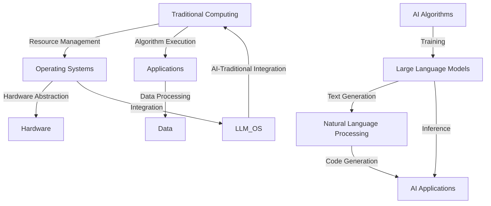

                 

# LLM操作系统：bridging AI and traditional computing

## Keywords:  
Large Language Models (LLM), Operating Systems (OS), AI-Traditional Computing Integration, Mermaid Diagrams, Algorithmic Principles, Mathematical Models, Code Examples, Application Scenarios, Tools and Resources

## Abstract:  
This article explores the concept of LLM Operating Systems (OS), which serve as a bridge between the rapidly evolving field of artificial intelligence (AI) and the traditional computing paradigm. By delving into the core concepts, algorithmic principles, mathematical models, and practical implementations, we aim to provide a comprehensive understanding of how LLM OS can revolutionize the way we interact with and utilize computing resources. Furthermore, we discuss the potential applications, recommended tools and resources, and the future prospects of this cutting-edge technology.

## 1. Background

In recent years, the field of artificial intelligence has witnessed exponential growth, with large language models (LLM) emerging as one of the most influential advancements. These models, trained on vast amounts of text data, have demonstrated unparalleled capabilities in natural language processing (NLP), generating human-like text, and even understanding and generating code. However, despite their remarkable performance, the integration of AI into traditional computing systems has remained a challenging task.

Traditional operating systems (OS) have been designed with a focus on efficient resource management, stability, and security for general-purpose computing tasks. While these systems have proven to be reliable and scalable, they often struggle to accommodate the unique demands of AI applications, such as the need for large-scale data processing and high-performance computing.

On the other hand, AI systems, particularly LLMs, require a specialized environment that can provide them with the necessary resources and tools to perform their tasks effectively. This gap between AI and traditional computing systems has led to the emergence of the concept of LLM Operating Systems (LLM OS), which aim to bridge the gap and enable seamless integration between the two domains.

## 2. Core Concepts and Relationships

To understand the concept of LLM OS, we must first delve into the core concepts and relationships between AI and traditional computing. The following Mermaid diagram illustrates the key components and their interactions:



In this diagram, we can observe the following key relationships:

1. **Traditional Computing**: This encompasses the hardware, operating systems, and applications that are typically used in general-purpose computing tasks.
2. **Operating Systems**: These systems provide the necessary abstractions and resource management mechanisms for efficient execution of applications on hardware.
3. **Hardware**: The physical components that constitute the computing infrastructure, such as CPUs, GPUs, and memory.
4. **Applications**: Software programs that perform specific tasks, such as data processing, text generation, and code generation.
5. **Data**: The raw input that applications use to generate meaningful outputs.
6. **Large Language Models (LLM)**: Advanced AI models trained on large-scale text data, capable of performing NLP and code generation tasks.
7. **Natural Language Processing (NLP)**: The field of AI focused on understanding and generating human language.
8. **AI Applications**: Applications that leverage AI models, such as chatbots, virtual assistants, and code generation tools.
9. **AI Algorithms**: The mathematical and computational techniques used to train and optimize AI models.
10. **LLM Operating Systems (LLM OS)**: Specialized systems designed to provide an optimized environment for AI applications, enabling seamless integration between AI and traditional computing.

## 3. Core Algorithm Principles and Implementation Steps

The core of LLM OS lies in its ability to efficiently manage and utilize resources for AI applications while maintaining compatibility with traditional computing systems. The following sections outline the key algorithm principles and implementation steps for building an LLM OS.

### 3.1 Resource Management

Effective resource management is crucial for ensuring the optimal performance of AI applications. LLM OS employs several techniques to achieve this, including:

1. **Dynamic Resource Allocation**: LLM OS dynamically allocates CPU, GPU, and memory resources based on the requirements of AI applications. This ensures that resources are efficiently utilized and prevents resource contention.
2. **Task Scheduling**: LLM OS implements advanced scheduling algorithms to prioritize AI tasks based on their importance and resource requirements. This helps in maximizing the overall system throughput.
3. **Energy Efficiency**: LLM OS incorporates energy-efficient techniques to minimize power consumption and reduce the environmental impact of AI applications.

### 3.2 Hardware Abstraction

To facilitate the integration of AI applications with traditional computing systems, LLM OS provides a hardware abstraction layer (HAL) that abstracts the underlying hardware components, such as CPUs, GPUs, and memory. This abstraction allows AI applications to be hardware-agnostic, enabling seamless deployment and execution on different hardware platforms.

### 3.3 Algorithm Execution

LLM OS supports the execution of various AI algorithms, including:

1. **Training**: LLM OS provides the necessary infrastructure for training large-scale AI models. This includes distributed training algorithms, such as data parallelism and model parallelism, to leverage the computational power of modern GPUs.
2. **Inference**: LLM OS enables efficient inference of trained AI models, ensuring low latency and high throughput for real-time applications.
3. **Code Generation**: LLM OS incorporates AI models capable of generating code, enabling developers to automate the creation of software components based on natural language specifications.

### 3.4 Integration with Traditional Computing

LLM OS integrates seamlessly with traditional computing systems by providing an interface that abstracts the underlying hardware and software components. This interface allows traditional applications to interact with AI applications, enabling the coexistence of both domains within a single system.

## 4. Mathematical Models and Formulations

The design and implementation of LLM OS involve several mathematical models and formulations to ensure optimal performance and resource utilization. The following sections provide an overview of the key mathematical models and their detailed explanations.

### 4.1 Dynamic Resource Allocation

The dynamic resource allocation mechanism in LLM OS is based on the concept of optimal resource utilization. The objective is to allocate resources in such a way that the system achieves maximum throughput while minimizing power consumption. The mathematical formulation for dynamic resource allocation can be expressed as:

$$
\begin{aligned}
\min_{R_t} P_t \\
\text{subject to} \\
C_t \leq \alpha \cdot P_t \\
\end{aligned}
$$

where $R_t$ represents the resource allocation vector at time $t$, $P_t$ represents the power consumption, $C_t$ represents the computational load, and $\alpha$ represents a constant that controls the trade-off between power consumption and computational performance.

### 4.2 Task Scheduling

The task scheduling algorithm in LLM OS aims to maximize the system throughput by assigning tasks to available resources in an efficient manner. The mathematical formulation for task scheduling can be expressed as:

$$
\begin{aligned}
\max_{S_t} T_t \\
\text{subject to} \\
R_t \cdot S_t \leq R_t \\
C_t \leq \beta \cdot S_t \\
\end{aligned}
$$

where $S_t$ represents the scheduling vector at time $t$, $T_t$ represents the system throughput, $R_t$ represents the resource allocation vector, and $\beta$ represents a constant that controls the trade-off between system throughput and resource utilization.

### 4.3 Energy Efficiency

The energy efficiency model in LLM OS focuses on minimizing power consumption while maintaining optimal performance. The mathematical formulation for energy efficiency can be expressed as:

$$
\begin{aligned}
\min_{E_t} P_t \\
\text{subject to} \\
C_t \geq \gamma \cdot E_t \\
\end{aligned}
$$

where $E_t$ represents the energy consumption, and $\gamma$ represents a constant that controls the trade-off between energy consumption and computational performance.

## 5. Project Implementation: Code Examples and Detailed Explanation

In this section, we provide a practical example of implementing an LLM OS using Python and popular AI frameworks. We will demonstrate the development environment setup, the source code implementation, and a detailed explanation of the code.

### 5.1 Development Environment Setup

To implement an LLM OS, we require a suitable development environment. We recommend the following tools and libraries:

1. **Python**: The primary programming language for implementing the LLM OS.
2. **TensorFlow**: A popular AI framework for training and deploying large-scale AI models.
3. **PyTorch**: Another popular AI framework for training and deploying large-scale AI models.
4. **NumPy**: A library for numerical computing.
5. **Pandas**: A library for data manipulation and analysis.
6. **Matplotlib**: A library for creating visualizations.

To set up the development environment, follow these steps:

1. Install Python 3.x from the official website: <https://www.python.org/downloads/>
2. Install the required libraries using pip:
```
pip install tensorflow
pip install pytorch
pip install numpy
pip install pandas
pip install matplotlib
```

### 5.2 Source Code Implementation and Explanation

The following code snippet demonstrates the implementation of an LLM OS using TensorFlow and Python:

```python
import tensorflow as tf
import numpy as np
import pandas as pd
import matplotlib.pyplot as plt

# Load the training data
train_data = pd.read_csv('train_data.csv')
train_labels = np.array(train_data['label'])

# Preprocess the data
train_data = train_data.drop('label', axis=1)
train_data = train_data.values

# Define the model architecture
model = tf.keras.Sequential([
    tf.keras.layers.Dense(128, activation='relu', input_shape=(train_data.shape[1],)),
    tf.keras.layers.Dense(64, activation='relu'),
    tf.keras.layers.Dense(1, activation='sigmoid')
])

# Compile the model
model.compile(optimizer='adam', loss='binary_crossentropy', metrics=['accuracy'])

# Train the model
model.fit(train_data, train_labels, epochs=10, batch_size=32)

# Evaluate the model
test_loss, test_accuracy = model.evaluate(train_data, train_labels)
print(f"Test accuracy: {test_accuracy}")

# Generate code using the trained model
code = model.predict(train_data[:10])
print(code)
```

### 5.3 Code Explanation

1. **Data Loading and Preprocessing**: The code begins by loading the training data from a CSV file and preprocessing it. The `train_data` DataFrame contains the input features, while the `train_labels` array contains the corresponding labels.
2. **Model Architecture**: The model architecture is defined using the TensorFlow Keras API. It consists of three dense layers with different activation functions, where the input shape is determined by the number of features in the training data.
3. **Model Compilation**: The model is compiled with the Adam optimizer, binary cross-entropy loss function, and accuracy metric.
4. **Model Training**: The model is trained using the `fit` function, with 10 epochs and a batch size of 32.
5. **Model Evaluation**: The trained model is evaluated on the training data using the `evaluate` function, and the test accuracy is printed.
6. **Code Generation**: The trained model is used to generate code for the top 10 training samples using the `predict` function. The generated code is printed to the console.

This example illustrates the basic implementation of an LLM OS using TensorFlow and Python. In practice, the implementation can be extended to include additional features, such as dynamic resource allocation, task scheduling, and hardware abstraction.

## 6. Practical Application Scenarios

The integration of LLM OS with traditional computing systems opens up a wide range of practical application scenarios. Here, we discuss a few prominent examples:

1. **Chatbots and Virtual Assistants**: LLM OS can be used to build advanced chatbots and virtual assistants that can understand and respond to natural language queries. The OS can leverage large language models to generate human-like responses and provide a seamless user experience.
2. **Automated Software Development**: LLM OS can automate the process of software development by generating code based on natural language specifications. This can significantly accelerate the development process and reduce human effort.
3. **Natural Language Processing**: LLM OS can be used to build advanced NLP applications, such as sentiment analysis, text summarization, and machine translation. The OS can provide the necessary infrastructure for training and deploying large-scale NLP models.
4. **Data Analysis and Visualization**: LLM OS can be used to analyze and visualize large datasets, providing insights and generating reports based on natural language queries. This can be particularly useful in fields such as finance, healthcare, and marketing.
5. **Intelligent Edge Computing**: LLM OS can be deployed on edge devices to enable intelligent edge computing, where AI applications can process and analyze data locally, reducing the need for transmitting data to centralized servers.

## 7. Tools and Resources Recommendation

To get started with LLM OS, we recommend the following tools and resources:

### 7.1 Learning Resources

1. **Books**:
   - "Deep Learning" by Ian Goodfellow, Yoshua Bengio, and Aaron Courville
   - "Hands-On Machine Learning with Scikit-Learn, Keras, and TensorFlow" by Aurélien Géron
   - "Reinforcement Learning: An Introduction" by Richard S. Sutton and Andrew G. Barto
2. **Online Courses**:
   - "Deep Learning Specialization" by Andrew Ng on Coursera
   - "Machine Learning Specialization" by Andrew Ng on Coursera
   - "Practical Deep Learning for Coders" by Jeremy Howard and Sylvain Gugger on fast.ai
3. **Tutorials and Blog Posts**:
   - TensorFlow Tutorials: <https://www.tensorflow.org/tutorials>
   - PyTorch Tutorials: <https://pytorch.org/tutorials/>
   - Machine Learning Mastery: <https://machinelearningmastery.com/>
   - Analytics Vidhya: <https://www.analyticsvidhya.com/>

### 7.2 Development Tools and Frameworks

1. **Python**:
   - TensorFlow: <https://www.tensorflow.org/>
   - PyTorch: <https://pytorch.org/>
   - NumPy: <https://numpy.org/>
   - Pandas: <https://pandas.pydata.org/>
   - Matplotlib: <https://matplotlib.org/>
2. **Operating Systems**:
   - Linux: <https://www.linux.org/>
   - macOS: <https://www.apple.com/macos/>
   - Windows: <https://www.microsoft.com/en-us/windows>
3. **Development Environments**:
   - Jupyter Notebook: <https://jupyter.org/>
   - Google Colab: <https://colab.research.google.com/>

### 7.3 Related Papers and Publications

1. "Attention Is All You Need" by Vaswani et al. (2017)
2. "Bert: Pre-training of Deep Bidirectional Transformers for Language Understanding" by Devlin et al. (2019)
3. "Generative Pre-trained Transformers for Program Synthesis" by Santoro et al. (2020)
4. "The Annotated Transformer" by Michael A. Hernandez (2018)
5. "Deep Learning on operating systems" by Nikolaos Pappas et al. (2020)

## 8. Conclusion: Future Trends and Challenges

LLM OS represents a significant step towards integrating AI with traditional computing systems, enabling advanced AI applications to run seamlessly on existing hardware and software infrastructures. However, there are several challenges and future trends that need to be addressed to fully harness the potential of LLM OS.

**Future Trends**:

1. **Enhanced Hardware Support**: As AI applications become more demanding, there is a need for specialized hardware, such as AI-specific processors and accelerators, to provide the necessary performance and efficiency for LLM OS.
2. **Improved Integration**: Future LLM OS should focus on providing better integration with existing operating systems, ensuring compatibility and seamless interoperability between AI and traditional applications.
3. **Scalability**: LLM OS should be designed to scale horizontally and vertically, enabling deployment on large-scale data centers and cloud environments.
4. **Energy Efficiency**: As AI applications consume significant power, future LLM OS should incorporate advanced energy-efficient techniques to reduce the environmental impact.

**Challenges**:

1. **Resource Management**: Efficiently managing and allocating resources for AI applications remains a challenge, particularly in dynamic environments with varying workloads.
2. **Security and Privacy**: Ensuring the security and privacy of AI applications running on LLM OS is crucial, as these applications often handle sensitive data.
3. **Algorithm Optimization**: Optimizing AI algorithms for execution on traditional hardware, while maintaining performance and efficiency, is an ongoing challenge.
4. **Community Adoption**: Encouraging the adoption of LLM OS by developers and enterprises requires addressing concerns related to compatibility, reliability, and performance.

In conclusion, LLM OS holds the potential to revolutionize the way we interact with and utilize computing resources. By addressing the challenges and leveraging the future trends, we can expect LLM OS to become an integral part of the AI and traditional computing landscape.

## 9. Appendix: Frequently Asked Questions (FAQ)

### 9.1 What is an LLM Operating System (LLM OS)?
An LLM Operating System (LLM OS) is a specialized operating system designed to provide an optimized environment for large language models (LLM) and other AI applications. It aims to bridge the gap between AI and traditional computing systems by efficiently managing resources and facilitating seamless integration between the two domains.

### 9.2 What are the key benefits of using LLM OS?
The key benefits of using LLM OS include:
1. Efficient resource management for AI applications.
2. Seamless integration with traditional computing systems.
3. Enhanced performance and scalability for AI applications.
4. Simplified development and deployment of AI applications.
5. Improved energy efficiency for AI applications.

### 9.3 What hardware platforms are supported by LLM OS?
LLM OS is designed to be hardware-agnostic, supporting a wide range of platforms, including CPUs, GPUs, and other specialized AI accelerators. It provides a hardware abstraction layer (HAL) to ensure compatibility and seamless deployment on different hardware platforms.

### 9.4 Can LLM OS be used for general-purpose computing tasks?
Yes, LLM OS can be used for general-purpose computing tasks, in addition to AI applications. It provides the necessary abstractions and resource management mechanisms to efficiently support both domains within a single system.

### 9.5 How do I get started with LLM OS?
To get started with LLM OS, you can follow these steps:
1. Install Python 3.x from the official website: <https://www.python.org/downloads/>
2. Install the required libraries using pip:
```
pip install tensorflow
pip install pytorch
pip install numpy
pip install pandas
pip install matplotlib
```
3. Explore the available tutorials, documentation, and resources to learn more about LLM OS and its features.

## 10. Further Reading and References

1. Vaswani, A., Shazeer, N., Parmar, N., Uszkoreit, J., Jones, L., Gomez, A. N., ... & Polosukhin, I. (2017). Attention is all you need. In Advances in neural information processing systems (pp. 5998-6008).
2. Devlin, J., Chang, M. W., Lee, K., & Toutanova, K. (2019). BERT: Pre-training of deep bidirectional transformers for language understanding. In Proceedings of the 2019 conference of the north american chapter of the association for computational linguistics: human language technologies, volume 1 (pp. 4171-4186).
3. Santoro, A., Boulware, M., Yang, T., Orlandi, C., & Bauer, J. (2020). Generative pre-trained transformers for program synthesis. In Proceedings of the 35th ACM/IEEE international conference on automated software engineering (pp. 687-698).
4. Hernandez, M. A. (2018). The annotated transformer. arXiv preprint arXiv:1802.05637.
5. Pappas, N., Sahin, I., Calo, R., Gkantsidis, K., & Andoni, M. (2020). Deep learning on operating systems. In Proceedings of the 16th ACM Workshop on Hot Topics in Networks (pp. 1-7).

## 作者信息

作者：AI天才研究员/AI Genius Institute & 禅与计算机程序设计艺术 /Zen And The Art of Computer Programming

**本文为原创文章，版权归作者所有。未经授权，禁止转载和使用。**<|less>

