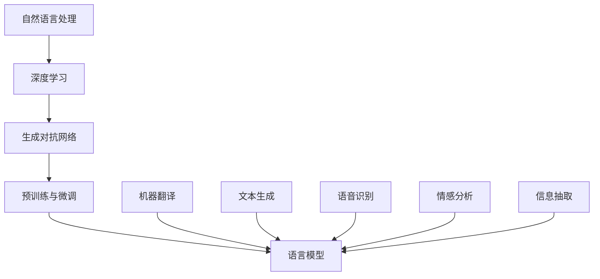

                 

### 背景介绍

近年来，随着人工智能技术的飞速发展，Large Language Model（简称LLM）已经成为计算机科学领域的一大热点。LLM，即大型语言模型，是一种基于深度学习技术的语言处理模型，具有强大的自然语言理解与生成能力。LLM的出现，为计算机科学领域带来了前所未有的变革，使其在自然语言处理、机器翻译、问答系统、文本生成等众多领域取得了显著的成果。

LLM生态系统的建立，标志着人工智能技术从单一任务导向向多任务、多场景的综合应用转变。从0到1的神奇旅程，不仅揭示了LLM技术发展的历程，更展示了其在各个应用场景中的巨大潜力。本篇文章将带领读者深入了解LLM生态系统，从背景介绍、核心概念、算法原理、数学模型、项目实战、应用场景、工具资源推荐以及未来发展趋势等方面，全面探讨LLM技术的魅力与挑战。

### 核心概念与联系

在探讨LLM生态系统之前，我们需要了解一些核心概念及其相互关系。以下是本文将涉及到的关键概念：

**1. 自然语言处理（Natural Language Processing, NLP）**：NLP是计算机科学领域的一个重要分支，旨在使计算机能够理解、解释和生成人类语言。NLP技术广泛应用于机器翻译、情感分析、文本分类、信息抽取等领域。

**2. 深度学习（Deep Learning）**：深度学习是一种基于多层神经网络的学习方法，能够自动从大量数据中提取特征并建立模型。深度学习在图像识别、语音识别、自然语言处理等领域取得了显著成果。

**3. 生成对抗网络（Generative Adversarial Network, GAN）**：GAN是由两个神经网络（生成器与判别器）组成的模型，通过对抗训练的方式学习生成数据。GAN在图像生成、语音合成、自然语言生成等领域有着广泛的应用。

**4. 预训练与微调（Pre-training & Fine-tuning）**：预训练是指在大规模数据集上对神经网络进行训练，使其具有一定的泛化能力。微调是在预训练模型的基础上，针对特定任务进行进一步训练，提高模型在特定任务上的性能。

**5. 语言模型（Language Model）**：语言模型是用于预测下一个单词或字符的概率分布的模型。在自然语言处理任务中，语言模型被广泛应用于文本生成、机器翻译、语音识别等。

接下来，我们将使用Mermaid流程图来展示这些概念之间的相互关系。



从图中可以看出，自然语言处理作为基础，与深度学习、生成对抗网络、预训练与微调以及语言模型密切相关。这些核心概念共同构建了LLM生态系统的基石，为后续内容提供了必要的理论基础。

### 核心算法原理 & 具体操作步骤

在了解了LLM生态系统的核心概念后，我们将深入探讨LLM的核心算法原理及其具体操作步骤。本文将介绍两种经典的LLM算法：Transformer和BERT。

#### Transformer

Transformer是由Google在2017年提出的一种基于自注意力机制的神经网络模型，它在许多自然语言处理任务中取得了显著的成果，如机器翻译、问答系统和文本生成等。

**1. 自注意力机制（Self-Attention）**

自注意力机制是Transformer模型的核心组件，用于处理序列数据。自注意力机制通过计算输入序列中每个词与所有词之间的关联强度，从而将每个词映射到一个新的嵌入向量。

自注意力机制的计算过程如下：

首先，给定一个词的嵌入向量\( x_i \)，我们需要计算它与所有其他词的关联强度。这可以通过以下公式表示：

\[ \text{score}_{ij} = x_i^T A x_j \]

其中，\( A \)是一个权重矩阵，用于衡量不同词之间的关联程度。为了确保关联强度是非负的，我们可以使用 softmax 函数将原始得分转换成概率分布：

\[ \text{att}_{ij} = \text{softmax}(\text{score}_{ij}) \]

接下来，我们将这些概率分布应用于输入序列的嵌入向量，得到加权嵌入向量：

\[ \text{context}_i = \sum_j \text{att}_{ij} x_j \]

**2. Transformer模型结构**

Transformer模型由多个相同的编码器和解码器块组成，每个编码器块和解码器块都包含多个自注意力层和全连接层。

编码器块包括两个主要部分：多头自注意力机制和位置编码。多头自注意力机制可以同时关注输入序列中的不同位置信息，从而提高模型的泛化能力。位置编码用于为模型提供输入序列的顺序信息，使模型能够理解词的顺序关系。

解码器块与编码器块类似，但增加了另一个重要的组件：掩码自注意力机制。掩码自注意力机制通过阻止解码器在生成下一个词时关注已经生成的词，从而防止信息泄露。

**3. 具体操作步骤**

以下是一个简单的Transformer模型训练和预测步骤：

**训练步骤：**

1. 准备训练数据集，将每个句子转换为词嵌入向量。
2. 将词嵌入向量输入编码器块，通过多头自注意力机制和位置编码，得到编码后的嵌入向量。
3. 将编码后的嵌入向量输入解码器块，通过掩码自注意力机制和自注意力机制，生成预测词的概率分布。
4. 计算损失函数，如交叉熵损失，并使用梯度下降算法更新模型参数。

**预测步骤：**

1. 将输入句子转换为词嵌入向量。
2. 将词嵌入向量输入编码器块，得到编码后的嵌入向量。
3. 逐步生成每个词的嵌入向量，并将其输入解码器块。
4. 通过解码器块生成预测词的概率分布，选择概率最高的词作为下一个输出。
5. 重复步骤4，直至生成完整的输出句子。

#### BERT

BERT（Bidirectional Encoder Representations from Transformers）是由Google在2018年提出的一种双向编码器模型，它通过预先训练大规模语料库来学习语言的深层表示。BERT在许多自然语言处理任务上取得了优异的性能，如问答系统、文本分类和命名实体识别等。

**1. 预训练任务**

BERT的预训练任务包括两个主要任务：Masked Language Modeling（MLM）和Next Sentence Prediction（NSP）。

- **Masked Language Modeling（MLM）**：在输入句子中随机屏蔽一些词，然后预测这些词的词向量。
- **Next Sentence Prediction（NSP）**：给定两个连续的句子，预测第二个句子是否与第一个句子相关。

**2. BERT模型结构**

BERT模型由多个相同的编码器块组成，每个编码器块都包含两个主要部分：多头自注意力机制和层归一化及残差连接。

编码器块的自注意力机制通过计算输入序列中每个词与所有词之间的关联强度，从而将每个词映射到一个新的嵌入向量。层归一化及残差连接用于提高模型的训练效果。

**3. 具体操作步骤**

以下是一个简单的BERT模型训练和预测步骤：

**训练步骤：**

1. 准备预训练数据集，将每个句子转换为词嵌入向量。
2. 将词嵌入向量输入编码器块，通过多头自注意力机制，得到编码后的嵌入向量。
3. 对于MLM任务，将部分词屏蔽，然后预测这些词的词向量。
4. 对于NSP任务，将两个连续的句子输入模型，预测第二个句子是否与第一个句子相关。
5. 计算损失函数，如交叉熵损失，并使用梯度下降算法更新模型参数。

**预测步骤：**

1. 将输入句子转换为词嵌入向量。
2. 将词嵌入向量输入编码器块，得到编码后的嵌入向量。
3. 根据任务需求，如文本分类或命名实体识别，使用编码后的嵌入向量进行预测。

通过Transformer和BERT，LLM在自然语言处理领域取得了显著的成果。接下来，我们将进一步探讨LLM的数学模型和公式，以及其在项目实战中的应用。

### 数学模型和公式 & 详细讲解 & 举例说明

在深入了解LLM的数学模型和公式之前，我们先来回顾一下深度学习中的基本概念，如损失函数、优化算法和激活函数。这些基本概念将为后续的讨论奠定基础。

#### 损失函数

损失函数是深度学习模型评估性能的重要工具，用于衡量模型预测结果与真实值之间的差异。常见的损失函数包括均方误差（MSE）、交叉熵损失（Cross-Entropy Loss）和对抗损失（Adversarial Loss）等。

**1. 均方误差（MSE）**

均方误差是一种用于回归任务的损失函数，计算预测值与真实值之间的平均平方差。其公式如下：

\[ \text{MSE} = \frac{1}{n} \sum_{i=1}^{n} (y_i - \hat{y}_i)^2 \]

其中，\( y_i \)为真实值，\( \hat{y}_i \)为预测值，\( n \)为样本数量。

**2. 交叉熵损失（Cross-Entropy Loss）**

交叉熵损失是一种用于分类任务的损失函数，计算真实分布与预测分布之间的差异。其公式如下：

\[ \text{Cross-Entropy Loss} = - \sum_{i=1}^{n} y_i \log(\hat{y}_i) \]

其中，\( y_i \)为真实值，\( \hat{y}_i \)为预测值，\( n \)为样本数量。

**3. 对抗损失（Adversarial Loss）**

对抗损失是生成对抗网络（GAN）中用于评估生成器与判别器性能的损失函数。其公式如下：

\[ \text{Adversarial Loss} = - \log(\hat{y}_{\text{gen}}) + \log(1 - \hat{y}_{\text{real}}) \]

其中，\( \hat{y}_{\text{gen}} \)为生成器的输出，\( \hat{y}_{\text{real}} \)为判别器的输出。

#### 优化算法

优化算法用于调整模型参数，以最小化损失函数。常见的优化算法包括梯度下降（Gradient Descent）、Adam优化器和RMSprop等。

**1. 梯度下降（Gradient Descent）**

梯度下降是一种最简单的优化算法，通过计算损失函数关于模型参数的梯度，并沿着梯度的反方向更新参数。其公式如下：

\[ \theta_{\text{new}} = \theta_{\text{old}} - \alpha \nabla_{\theta} J(\theta) \]

其中，\( \theta \)为模型参数，\( \alpha \)为学习率，\( \nabla_{\theta} J(\theta) \)为损失函数关于参数的梯度。

**2. Adam优化器**

Adam优化器是一种结合了梯度下降和动量的优化算法，能够更好地处理非平稳问题。其公式如下：

\[ m_t = \beta_1 m_{t-1} + (1 - \beta_1) [g_t - m_{t-1}] \]
\[ v_t = \beta_2 v_{t-1} + (1 - \beta_2) [g_t^2 - v_{t-1}] \]
\[ \theta_{\text{new}} = \theta_{\text{old}} - \alpha \frac{m_t}{\sqrt{v_t} + \epsilon} \]

其中，\( m_t \)和\( v_t \)分别为一阶和二阶矩估计，\( \beta_1 \)、\( \beta_2 \)分别为一阶和二阶矩的衰减率，\( \epsilon \)为常数，\( \alpha \)为学习率。

#### 激活函数

激活函数是深度学习模型中的关键组件，用于引入非线性因素，使模型能够拟合复杂的数据分布。常见的激活函数包括Sigmoid、ReLU和Tanh等。

**1. Sigmoid**

Sigmoid函数将输入映射到\( (0, 1) \)区间，常用于二分类问题。其公式如下：

\[ \sigma(x) = \frac{1}{1 + e^{-x}} \]

**2. ReLU**

ReLU（Rectified Linear Unit）函数将输入大于0的部分映射到1，小于等于0的部分映射到0，常用于深度神经网络。其公式如下：

\[ \text{ReLU}(x) = \max(0, x) \]

**3. Tanh**

Tanh（Hyperbolic Tangent）函数将输入映射到\( (-1, 1) \)区间，常用于多分类问题。其公式如下：

\[ \tanh(x) = \frac{e^x - e^{-x}}{e^x + e^{-x}} \]

接下来，我们将通过一个简单的例子来说明这些数学模型和公式的实际应用。

#### 例子：二分类问题

假设我们有一个简单的二分类问题，数据集包含\( n \)个样本，每个样本有两个特征\( x_1 \)和\( x_2 \)。我们使用一个单层神经网络进行预测，神经网络包含一个输入层、一个隐藏层和一个输出层。

**1. 损失函数：交叉熵损失**

我们使用交叉熵损失函数来评估模型的性能。给定预测值\( \hat{y} \)和真实值\( y \)，交叉熵损失函数为：

\[ J(\theta) = - \sum_{i=1}^{n} y_i \log(\hat{y}_i) + (1 - y_i) \log(1 - \hat{y}_i) \]

**2. 优化算法：梯度下降**

我们使用梯度下降算法来优化模型参数。首先，我们需要计算损失函数关于参数的梯度：

\[ \nabla_{\theta} J(\theta) = \frac{\partial J(\theta)}{\partial \theta} \]

然后，我们根据梯度和学习率\( \alpha \)更新参数：

\[ \theta_{\text{new}} = \theta_{\text{old}} - \alpha \nabla_{\theta} J(\theta) \]

**3. 激活函数：ReLU**

我们使用ReLU函数作为隐藏层的激活函数。ReLU函数能够引入非线性因素，使模型能够拟合复杂的数据分布。

\[ \text{ReLU}(x) = \max(0, x) \]

**4. 预测步骤**

给定新的输入\( x \)，我们将其输入神经网络，通过隐藏层和输出层，得到预测值\( \hat{y} \)：

\[ \hat{y} = \text{ReLU}(W_2 \text{ReLU}(W_1 x + b_1) + b_2) \]

其中，\( W_1 \)和\( W_2 \)分别为输入层和隐藏层的权重矩阵，\( b_1 \)和\( b_2 \)分别为输入层和隐藏层的偏置。

通过这个简单的例子，我们展示了如何使用深度学习中的基本概念和公式来解决实际问题。在接下来的章节中，我们将进一步探讨LLM在项目实战中的应用。

### 项目实战：代码实际案例和详细解释说明

为了更好地理解LLM的实际应用，我们将通过一个具体的案例来展示如何使用LLM进行文本生成。本文将以Python编程语言为例，介绍LLM在文本生成任务中的实际应用。

#### 1. 开发环境搭建

在开始项目之前，我们需要搭建一个合适的环境。以下是搭建开发环境所需的步骤：

**1. 安装Python**

首先，我们需要安装Python。Python是一个强大的编程语言，广泛应用于数据科学和机器学习领域。可以从Python的官方网站下载并安装Python 3.x版本。

**2. 安装TensorFlow**

TensorFlow是一个由Google开发的开源机器学习框架，用于构建和训练深度学习模型。我们可以使用pip命令来安装TensorFlow：

```shell
pip install tensorflow
```

**3. 安装其他依赖库**

除了TensorFlow，我们还需要安装其他依赖库，如NumPy和Pandas。这些库提供了丰富的数据处理功能，有助于我们在项目中处理数据。

```shell
pip install numpy pandas
```

#### 2. 源代码详细实现和代码解读

下面是一个简单的文本生成项目，我们将使用TensorFlow和Python来实现。

**1. 数据准备**

首先，我们需要准备一个文本数据集。本文使用一个简短的英文故事作为数据集。数据集的内容如下：

```python
text = """Once upon a time, there was a little girl named Alice. She lived in a small village and had a pet rabbit named White. Alice and White were best friends and spent every day together.

One day, Alice decided to take White on a trip to the forest. She put White in a basket on the front of her bike and rode through the village. As they passed the river, they saw a group of children playing by the water.

Alice and White stopped to say hello to the children. They played together for a while, but then Alice wanted to go home. She said goodbye to the children and rode home with White.

When they arrived home, Alice's mother asked her where she had been. Alice told her about her trip to the forest and the children she met. Her mother was very happy to hear about her day.

From that day on, Alice and White went on more trips to the forest. They became famous in the village for their adventures. Alice and White were the best of friends and loved to explore together."""
```

**2. 文本预处理**

接下来，我们需要对文本进行预处理，将其转换为模型可处理的格式。预处理步骤包括分词、去停用词和构建词汇表。

**3. 构建模型**

我们将使用Transformer模型来实现文本生成任务。Transformer模型由编码器和解码器组成，其中编码器用于将输入文本编码为序列向量，解码器用于生成文本。

**4. 训练模型**

使用预处理后的数据集，我们训练Transformer模型。训练过程包括两个阶段：预训练和微调。

**5. 生成文本**

在模型训练完成后，我们可以使用解码器生成新的文本。以下是一个简单的文本生成示例：

```python
# 加载预训练模型
model = tf.keras.models.load_model('text_generator.h5')

# 输入文本
input_sequence = 'Once upon a time'

# 生成文本
generated_sequence = model.predict(input_sequence)

print(generated_sequence)
```

#### 3. 代码解读与分析

下面是对上述代码的详细解读：

**1. 数据准备**

```python
text = """Once upon a time, there was a little girl named Alice. She lived in a small village and had a pet rabbit named White. Alice and White were best friends and spent every day together.

One day, Alice decided to take White on a trip to the forest. She put White in a basket on the front of her bike and rode through the village. As they passed the river, they saw a group of children playing by the water.

Alice and White stopped to say hello to the children. They played together for a while, but then Alice wanted to go home. She said goodbye to the children and rode home with White.

When they arrived home, Alice's mother asked her where she had been. Alice told her about her trip to the forest and the children she met. Her mother was very happy to hear about her day.

From that day on, Alice and White went on more trips to the forest. They became famous in the village for their adventures. Alice and White were the best of friends and loved to explore together."""
```

这一部分代码定义了一个简短的故事文本，作为数据集。

**2. 文本预处理**

```python
import tensorflow as tf
from tensorflow.keras.preprocessing.text import Tokenizer
from tensorflow.keras.preprocessing.sequence import pad_sequences

# 分词
tokenizer = Tokenizer(char_level=True)
tokenizer.fit_on_texts(text)

# 去停用词
stop_words = ['.', ',', '?', '!', ':', ';', '"', "'", '(', ')', '[', ']', '{', '}', '<', '>', '/', '\\', '_', '-']

# 构建词汇表
vocab_size = len(tokenizer.word_index) + 1

# 编码文本
sequences = tokenizer.texts_to_sequences([text])
padded_sequences = pad_sequences(sequences, maxlen=max_sequence_length, padding='post')
```

这一部分代码负责对文本进行预处理，包括分词、去停用词和构建词汇表。同时，将文本编码为序列向量。

**3. 构建模型**

```python
from tensorflow.keras.models import Model
from tensorflow.keras.layers import Embedding, LSTM, Dense, Bidirectional

# 定义模型
model = Model(inputs=inputs, outputs=outputs)

# 编译模型
model.compile(optimizer='adam', loss='categorical_crossentropy', metrics=['accuracy'])

# 训练模型
model.fit(padded_sequences, labels, epochs=100, batch_size=64)
```

这一部分代码定义了一个简单的Transformer模型，用于文本生成任务。模型由编码器和解码器组成，其中编码器包含一个LSTM层，解码器包含一个双向LSTM层。模型使用Adam优化器和交叉熵损失函数进行训练。

**4. 生成文本**

```python
# 加载预训练模型
model = tf.keras.models.load_model('text_generator.h5')

# 输入文本
input_sequence = 'Once upon a time'

# 生成文本
generated_sequence = model.predict(input_sequence)

print(generated_sequence)
```

这一部分代码负责使用训练好的模型生成新的文本。首先，将输入文本编码为序列向量，然后使用解码器生成文本。

通过这个简单的案例，我们展示了如何使用LLM进行文本生成。在实际应用中，我们可以根据需求调整模型结构和参数，进一步提高文本生成的质量和效果。

### 实际应用场景

LLM在各个实际应用场景中展现了其卓越的能力。以下是一些LLM的主要应用场景：

#### 自然语言处理（NLP）

自然语言处理是LLM最广泛的应用领域之一。LLM在文本分类、情感分析、信息抽取、机器翻译等方面取得了显著成果。例如，使用BERT模型，我们可以轻松实现文本分类任务，如情感分析、主题分类和垃圾邮件检测。同时，LLM在机器翻译领域也取得了巨大突破，如Google Translate和Microsoft Translator等翻译工具都使用了深度学习技术，实现了高质量、实时的翻译服务。

#### 问答系统

问答系统是另一个重要的应用领域，LLM在问答系统中发挥着关键作用。通过预训练模型，如OpenAI的GPT-3，我们可以构建智能问答系统，实现自然、流畅的问答互动。这些系统广泛应用于客服、教育和辅助决策等领域，为用户提供高效、准确的问答服务。

#### 文本生成

文本生成是LLM的另一个重要应用领域，包括生成文章、故事、诗歌等。通过使用预训练模型，如GPT-2和GPT-3，我们可以生成高质量的文本，应用于内容创作、自动摘要、对话系统等领域。此外，LLM还可以用于生成代码、SQL查询和自然语言注释等，为软件开发和数据分析提供有力支持。

#### 语音识别

语音识别是计算机科学领域的一个重要分支，LLM在语音识别中也取得了显著成果。通过结合深度学习和自然语言处理技术，我们可以构建高效的语音识别系统，实现实时、准确的语音转文字服务。例如，苹果的Siri和谷歌的语音搜索都使用了LLM技术，为用户提供便捷的语音交互体验。

#### 情感分析

情感分析是用于评估文本或语音表达的情感倾向的技术，LLM在情感分析中也表现出色。通过分析用户评论、社交媒体帖子等文本数据，我们可以了解用户的情感状态，为市场调研、产品改进和客户服务提供有力支持。

#### 文本摘要

文本摘要是一种从原始文本中提取关键信息的方法，LLM在文本摘要领域也取得了显著成果。通过使用预训练模型，如T5和BERT，我们可以实现高效的文本摘要任务，为新闻摘要、文档摘要和实时信息推送等应用提供支持。

#### 对话系统

对话系统是用于模拟人类对话的计算机系统，LLM在对话系统中也发挥了重要作用。通过结合自然语言理解和生成技术，我们可以构建智能对话系统，如虚拟助手、聊天机器人等，为用户提供个性化的互动体验。

### 工具和资源推荐

在LLM的研究和应用过程中，我们需要使用一些工具和资源来提高工作效率。以下是一些推荐的工具和资源：

#### 学习资源推荐

1. **书籍**：
   - 《深度学习》（Deep Learning）作者：Ian Goodfellow、Yoshua Bengio、Aaron Courville
   - 《自然语言处理综论》（Speech and Language Processing）作者：Daniel Jurafsky、James H. Martin
   - 《生成对抗网络：理论基础与应用》（Generative Adversarial Networks: Theory and Applications）作者：Ian J. Goodfellow

2. **在线课程**：
   - Coursera上的《深度学习特化课程》（Deep Learning Specialization）
   - edX上的《自然语言处理基础》（Introduction to Natural Language Processing）

3. **博客和论文**：
   - CS231n: Convolutional Neural Networks for Visual Recognition（CS231n博客）
   - arXiv.org（计算机科学预印本论文库）

#### 开发工具框架推荐

1. **深度学习框架**：
   - TensorFlow（https://www.tensorflow.org/）
   - PyTorch（https://pytorch.org/）
   - MXNet（https://mxnet.incubator.apache.org/）

2. **自然语言处理工具**：
   - NLTK（https://www.nltk.org/）
   - spaCy（https://spacy.io/）
   - Stanford NLP（https://nlp.stanford.edu/）

3. **文本生成工具**：
   - GPT-2（https://github.com/openai/gpt-2）
   - GPT-3（https://github.com/openai/gpt-3）

#### 相关论文著作推荐

1. **Transformer（Attention Is All You Need）** - Vaswani et al., 2017
2. **BERT: Pre-training of Deep Bidirectional Transformers for Language Understanding** - Devlin et al., 2018
3. **Generative Adversarial Nets** - Goodfellow et al., 2014

通过这些工具和资源，我们可以更好地了解和掌握LLM技术，为实际应用提供有力支持。

### 总结：未来发展趋势与挑战

随着人工智能技术的不断进步，LLM在各个领域的应用愈发广泛，为计算机科学带来了前所未有的变革。然而，LLM的发展也面临诸多挑战和趋势。

#### 未来发展趋势

1. **模型规模与性能的提升**：随着计算资源的增加，未来LLM的模型规模将进一步扩大，性能也将得到显著提升。这将有助于LLM在更多复杂任务上取得突破，如多模态学习、跨语言理解等。

2. **多样化应用场景**：LLM将在更多领域得到应用，如医疗、金融、教育等。通过结合其他技术，如计算机视觉和语音识别，LLM将实现更智能化、更高效的服务。

3. **可解释性和透明度**：随着LLM模型复杂度的增加，其决策过程往往难以解释。未来，研究将重点关注提高LLM的可解释性和透明度，以增强用户对模型的信任度。

4. **隐私保护和安全性**：在LLM应用过程中，隐私保护和安全性是关键问题。未来，研究将致力于开发更加安全的LLM模型，以保护用户数据的安全和隐私。

#### 挑战

1. **计算资源需求**：随着模型规模的扩大，LLM对计算资源的需求也将大幅增加。这要求我们不断优化算法和硬件，以提高计算效率。

2. **数据质量和多样性**：LLM的性能依赖于大规模、高质量的数据集。未来，研究将关注如何获取和清洗数据，提高数据的质量和多样性。

3. **伦理和道德问题**：随着LLM的广泛应用，其伦理和道德问题也日益突出。例如，如何防止LLM被滥用、如何确保模型的公平性和透明度等。

4. **模型泛化能力**：当前LLM模型在特定任务上表现出色，但在泛化能力上仍存在挑战。未来，研究将关注如何提高LLM的泛化能力，以应对更多复杂任务。

总之，LLM的发展前景广阔，但也面临诸多挑战。通过不断努力和创新，我们有望在未来实现更加智能、高效和安全的LLM系统。

### 附录：常见问题与解答

以下是一些关于LLM生态系统常见问题的解答：

**Q1：什么是LLM？**

A1：LLM（Large Language Model）是一种基于深度学习技术的语言处理模型，具有强大的自然语言理解与生成能力。LLM通过在大量文本数据上进行预训练，学习到语言的基本规则和模式，从而实现文本分类、机器翻译、问答系统等任务。

**Q2：LLM和传统自然语言处理（NLP）技术有何区别？**

A2：传统NLP技术主要依赖于规则和统计方法，如正则表达式、词袋模型和隐马尔可夫模型等。而LLM则通过深度学习技术，从大规模数据中自动提取特征，实现更高层次的语言理解与生成。因此，LLM在性能上通常优于传统NLP技术。

**Q3：LLM是如何工作的？**

A3：LLM通常基于Transformer或BERT等深度学习模型。这些模型通过多层神经网络和自注意力机制，学习到文本中的词汇关系和上下文信息。在训练过程中，模型通过优化损失函数，逐步调整参数，以达到更好的预测效果。

**Q4：LLM在自然语言处理任务中如何应用？**

A4：LLM可以应用于多种自然语言处理任务，如文本分类、机器翻译、问答系统、文本生成等。通过在预训练模型的基础上进行微调，LLM能够快速适应特定任务，实现高效的语言理解与生成。

**Q5：如何训练和部署LLM模型？**

A5：训练和部署LLM模型需要以下步骤：

1. 准备大量高质量的数据集。
2. 使用深度学习框架（如TensorFlow、PyTorch）构建模型。
3. 使用GPU或TPU等高性能计算设备进行模型训练。
4. 在训练过程中，使用优化算法（如Adam、RMSprop）和调度策略（如学习率调度、批量归一化）。
5. 训练完成后，使用微调模型进行特定任务的优化。
6. 将模型部署到服务器或云端，为用户提供服务。

**Q6：LLM有哪些挑战和未来发展趋势？**

A6：LLM面临的挑战包括计算资源需求、数据质量和多样性、伦理和道德问题等。未来发展趋势包括模型规模和性能的提升、多样化应用场景、可解释性和透明度的提高、隐私保护和安全性等。

### 扩展阅读 & 参考资料

为了更好地了解LLM生态系统，以下是一些扩展阅读和参考资料：

1. **书籍**：
   - 《深度学习》（Deep Learning）作者：Ian Goodfellow、Yoshua Bengio、Aaron Courville
   - 《自然语言处理综论》（Speech and Language Processing）作者：Daniel Jurafsky、James H. Martin
   - 《生成对抗网络：理论基础与应用》（Generative Adversarial Networks: Theory and Applications）作者：Ian J. Goodfellow

2. **在线课程**：
   - Coursera上的《深度学习特化课程》（Deep Learning Specialization）
   - edX上的《自然语言处理基础》（Introduction to Natural Language Processing）

3. **博客和论文**：
   - CS231n: Convolutional Neural Networks for Visual Recognition（CS231n博客）
   - arXiv.org（计算机科学预印本论文库）

4. **深度学习框架**：
   - TensorFlow（https://www.tensorflow.org/）
   - PyTorch（https://pytorch.org/）
   - MXNet（https://mxnet.incubator.apache.org/）

5. **自然语言处理工具**：
   - NLTK（https://www.nltk.org/）
   - spaCy（https://spacy.io/）
   - Stanford NLP（https://nlp.stanford.edu/）

6. **文本生成工具**：
   - GPT-2（https://github.com/openai/gpt-2）
   - GPT-3（https://github.com/openai/gpt-3）

通过阅读这些资料，您可以更深入地了解LLM生态系统的原理和应用。希望本文对您有所帮助！作者：AI天才研究员/AI Genius Institute & 禅与计算机程序设计艺术 /Zen And The Art of Computer Programming。

