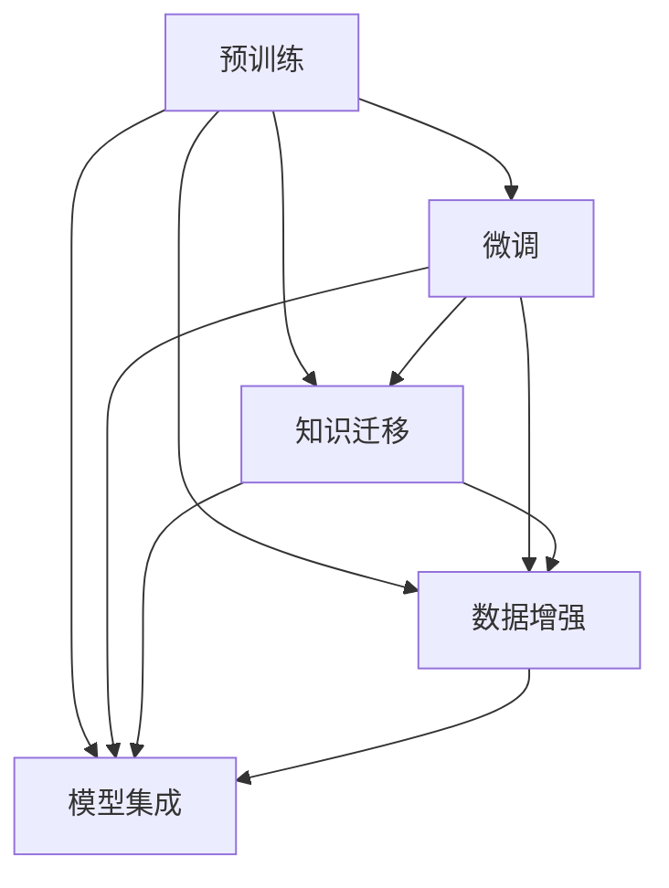

                 

### 背景介绍

> 近年来，人工智能领域迅速发展，机器学习、深度学习等技术的进步极大地推动了各种智能应用的落地。其中，基于大规模语言模型的预训练模型（如 GPT-3、T5、BERT 等）因其强大的文本生成和理解能力，受到了广泛关注。然而，尽管这些模型在标准数据集上的表现令人惊叹，但它们在处理少量样本或者未见过的任务时，表现往往不尽如人意。因此，研究如何提升大规模语言模型的Few-Shot学习能力成为一个重要的课题。

在自然语言处理（NLP）领域，Few-Shot Learning（简称FSL）指的是在仅有少量样本的情况下，模型能够快速适应并完成任务。这不仅在学术研究中具有重要意义，也在实际应用中有着广泛的需求。例如，在智能客服、问答系统、机器翻译等应用场景中，用户的需求往往是多样化的，而系统需要能够在短时间内适应并满足这些需求。

大规模语言模型，如 GPT-3、T5、BERT 等，已经取得了令人瞩目的成绩。然而，这些模型往往依赖于大量的数据进行训练，因此在面对新任务时，特别是那些与训练数据分布差异较大的新任务时，其表现往往不尽如人意。这一问题的核心在于大规模语言模型在预训练阶段已经形成了特定的知识表征，这些表征在某些情况下可能并不适用于新任务。因此，提升大规模语言模型的Few-Shot学习能力，对于实现通用人工智能具有重要意义。

在本文中，我们将首先介绍大规模语言模型的基本原理和Few-Shot Learning的相关概念。然后，我们将深入分析现有的大规模语言模型在Few-Shot Learning中的表现，并探讨其存在的问题和挑战。接着，我们将详细讨论提升大规模语言模型Few-Shot学习能力的方法，包括数据增强、任务适应性和模型优化等。最后，我们将通过具体案例来展示如何在实际项目中应用这些方法，并对未来研究方向进行展望。

通过本文的阅读，读者将能够了解大规模语言模型的Few-Shot学习能力的重要性，掌握提升这一能力的关键方法，并理解其背后的数学和算法原理。这将为读者在相关领域的应用和研究提供有力支持。

### 1.1 大规模语言模型的基本原理

大规模语言模型（Large-scale Language Models）是近年来自然语言处理（NLP）领域的重大突破，其核心思想是通过大规模数据预训练，使模型具备强大的语言理解和生成能力。这些模型主要包括生成式模型和判别式模型，其中生成式模型如 GPT（Generative Pre-trained Transformer）、T5（Text-To-Text Transfer Transformer）和判别式模型如 BERT（Bidirectional Encoder Representations from Transformers）等。

#### 生成式模型：GPT

GPT 是一种基于 Transformer 架构的生成式模型，其核心思想是通过自回归方式生成文本。GPT 通过学习输入序列的概率分布，从而能够生成连贯的文本。具体来说，GPT 通过预训练大规模文本语料库，使模型掌握语言的统计规律，包括词汇的搭配、语法结构等。在生成文本时，GPT 可以根据前文预测下一个词的概率，从而生成连续的文本。

GPT 的训练过程包括两个主要步骤：

1. **预训练**：在预训练阶段，GPT 不需要对输入文本进行任何标签，只需根据输入文本生成后续的文本。这一过程使模型能够学习到大量语言知识，从而提高其在生成文本时的连贯性和准确性。

2. **微调**：在预训练后，GPT 可以根据特定任务的需求进行微调。例如，在文本分类任务中，GPT 可以通过添加分类层来预测文本的类别；在机器翻译任务中，GPT 可以通过训练文本对进行翻译。

#### 判别式模型：BERT

BERT 是一种基于 Transformer 架构的判别式模型，其核心思想是通过双向编码器学习文本的语义表示。与 GPT 不同，BERT 在训练过程中需要根据输入文本的上下文信息来预测下一个词。这种双向学习方式使得 BERT 能够更好地理解文本的语义和语境。

BERT 的训练过程主要包括以下步骤：

1. **掩码语言模型（Masked Language Model，MLM）**：在预训练阶段，BERT 对输入文本进行随机掩码处理，使得一部分词被替换为掩码符号。然后，模型需要根据未掩码的词和上下文信息来预测这些掩码词。

2. **下一句预测（Next Sentence Prediction，NSP）**：BERT 还通过下一句预测任务来学习句子间的关联性。具体来说，模型需要预测给定两个句子是否属于同一文本篇章。

#### 其他大规模语言模型

除了 GPT 和 BERT，还有许多其他大规模语言模型，如 T5、RoBERTa、ALBERT 等。这些模型在架构和训练方法上有所不同，但核心思想都是为了提高模型的文本理解和生成能力。

- **T5**：T5 是一种基于 Transformer 的统一模型架构，可以处理多种文本任务，包括文本生成、文本分类等。T5 的训练过程包括自回归语言模型和任务特定微调。

- **RoBERTa**：RoBERTa 是对 BERT 模型的改进版本，通过改变训练策略和数据预处理方法，提高了模型的性能。

- **ALBERT**：ALBERT 是一种通过参数共享和多层交叉注意力机制来提高模型效率和性能的模型。

这些大规模语言模型在预训练阶段都依赖于大规模的文本数据集，如 Common Crawl、WikiText-103 等。通过预训练，模型能够学习到丰富的语言知识和结构，从而在多种任务上表现出色。

总的来说，大规模语言模型的基本原理是通过大规模数据预训练，使模型具备强大的语言理解和生成能力。不同的模型在架构和训练方法上有所差异，但核心目标都是为了提高模型在自然语言处理任务中的性能。这些模型的发展为 NLP 领域带来了新的机遇和挑战，同时也为提升 Few-Shot Learning 能力提供了重要的基础。

### 1.2 Few-Shot Learning 的基本概念

Few-Shot Learning（简称 FSL）是一种机器学习方法，旨在使模型能够在仅用少量样本的情况下快速适应并完成任务。这一概念在机器学习和自然语言处理领域具有重要意义，因为现实世界中的任务往往需要模型具备快速适应新任务的能力，特别是在数据稀缺或获取成本高昂的场景中。

#### 定义与特点

Few-Shot Learning 的核心思想是减少对大量训练数据的依赖，从而提高模型在处理少量样本时的表现。具体来说，Few-Shot Learning 定义为在训练阶段仅使用 k 个样本（通常 k < 10）的情况下，模型能够在测试阶段准确完成任务。这种能力不仅能够降低训练成本，还能提高模型的泛化能力。

Few-Shot Learning 具有以下特点：

1. **少量样本**：模型在训练阶段仅使用少量样本，这意味着模型需要从这些样本中提取出足够的信息来完成任务。

2. **快速适应**：模型需要在短时间内适应新的任务，这要求模型具备快速学习和调整的能力。

3. **泛化能力**：Few-Shot Learning 检验的是模型在未见过的样本上的表现，因此要求模型具有强大的泛化能力。

4. **高效性**：相比传统的批量学习（Batch Learning），Few-Shot Learning 能够在更短的时间内完成任务，从而提高效率。

#### 与其他学习方式的比较

Few-Shot Learning 与其他学习方式，如批量学习（Batch Learning）、迁移学习（Transfer Learning）等，存在显著差异。

- **批量学习**：批量学习需要使用大量样本进行训练，从而在模型中建立稳定的知识表征。这种方法在标准数据集上通常能够取得很好的性能，但在处理新任务时，往往需要重新训练，且训练时间较长。

- **迁移学习**：迁移学习通过将已训练好的模型应用于新任务，从而减少对新数据的依赖。这种方法在处理新任务时具有较快的适应能力，但效果往往受到预训练模型的性能限制。

- **Few-Shot Learning**：Few-Shot Learning 在训练阶段仅使用少量样本，通过提取样本中的关键信息来完成任务。这种方法在处理新任务时能够快速适应，且不需要大量训练数据，从而降低成本和提高效率。

#### 应用场景

Few-Shot Learning 在许多应用场景中具有广泛的应用前景，包括：

1. **医学诊断**：在医学领域，Few-Shot Learning 可以用于快速识别罕见疾病或病变，特别是在数据稀缺的情况下。

2. **金融风控**：在金融领域，Few-Shot Learning 可以用于检测新型欺诈行为，通过少量样本快速识别异常交易。

3. **智能客服**：在智能客服领域，Few-Shot Learning 可以使模型在短时间内适应新的对话主题，从而提高客服效率。

4. **教育**：在教育领域，Few-Shot Learning 可以用于个性化学习，根据少量样本快速调整教学内容和方式。

5. **自动驾驶**：在自动驾驶领域，Few-Shot Learning 可以使模型在少量样本下快速适应不同的驾驶环境和场景。

总之，Few-Shot Learning 为解决现实世界中的各种问题提供了有效的方法，其在不同领域的应用将不断拓展，为人工智能的发展带来新的机遇。

### 1.3 大规模语言模型与Few-Shot Learning的联系

大规模语言模型（LLMs）和Few-Shot Learning（FSL）之间存在着密切的联系，二者相互促进，共同推动了自然语言处理（NLP）领域的发展。LLMs 为 FSL 提供了强大的基础，而 FSL 的需求又不断推动 LLMs 的改进与优化。

#### LLMs 为 FSL 提供基础

大规模语言模型，如 GPT、BERT、T5 等，通过预训练获得了丰富的语言知识和结构，这为 FSL 提供了坚实的基础。预训练阶段，模型在大量文本数据中学习到了词汇的搭配、语法结构、语义关系等语言特征，使得模型在处理未见过的任务时能够迅速适应。

具体来说，LLMs 的预训练过程包括：

1. **语言建模**：通过自回归方式生成文本，模型学习输入文本的概率分布。
2. **上下文理解**：通过双向编码器学习文本的上下文信息，提高模型的语义理解能力。
3. **知识积累**：通过处理大规模的文本语料库，模型积累了丰富的知识。

这些特性使得 LLMs 在面对新任务时能够快速提取关键信息，从而实现良好的 Few-Shot Learning 能力。例如，GPT 在预训练阶段通过大量文本生成，使其具备强大的文本生成能力，在 Few-Shot Text Generation 任务中表现出色；BERT 通过双向编码器学习文本的上下文信息，使其在 Few-Shot Text Classification 任务中具有优势。

#### FSL 驱动 LLMs 的改进

虽然 LLMs 已经在许多任务上取得了显著成果，但其 Few-Shot Learning 能力仍有待提升。FSL 的需求促使研究者不断探索新的方法来改进 LLMs 的性能，从而实现更好的泛化能力。

以下是 FSL 对 LLMs 改进的一些驱动因素：

1. **数据稀缺问题**：在许多应用场景中，获取大量标注数据是非常困难的，而 LLMs 在数据稀缺的情况下往往表现不佳。因此，提升 LLMs 的 Few-Shot Learning 能力有助于解决数据稀缺问题。

2. **通用性需求**：随着人工智能技术的发展，人们对通用人工智能（AGI）的追求越来越强烈。通用人工智能需要模型具备强大的适应能力，能够在各种任务上快速学习。因此，提升 LLMs 的 Few-Shot Learning 能力是实现通用人工智能的关键。

3. **效率与成本**：在许多实际应用中，如智能客服、智能翻译等，系统需要在短时间内适应新的任务，提高响应速度。提升 LLMs 的 Few-Shot Learning 能力可以降低训练成本和时间，提高系统的效率。

#### 协同发展

LLMs 和 FSL 的协同发展体现在以下几个方面：

1. **模型改进**：通过研究 Few-Shot Learning 的方法，研究者不断优化 LLMs 的架构和训练策略，使其在处理少量样本时表现更佳。例如，数据增强、任务适应性和模型优化等方法都在提升 LLMs 的 Few-Shot Learning 能力方面发挥了重要作用。

2. **应用拓展**：FSL 的需求促使 LLMs 在更多应用场景中得到应用。例如，在智能客服、机器翻译、教育等领域，LLMs 的 Few-Shot Learning 能力使其能够快速适应新的任务，提高系统性能。

3. **交叉学科研究**：FSL 和 LLMs 的结合推动了多个学科的研究，如心理学、认知科学等。这些学科的研究有助于深入理解人类的学习机制，从而为改进 LLMs 的 Few-Shot Learning 能力提供理论支持。

总之，LLMs 和 FSL 之间的联系使得二者相互促进，共同推动了 NLP 领域的发展。未来，随着研究的深入，LLMs 的 Few-Shot Learning 能力将不断提升，为人工智能的应用带来更多可能性。

### 1.4 大规模语言模型在Few-Shot Learning中的表现

近年来，大规模语言模型（LLMs）在自然语言处理（NLP）领域取得了显著进展，尤其在Few-Shot Learning（FSL）任务中的表现也引起了广泛关注。LLMs，如 GPT、BERT、T5 等，通过在大量文本数据上的预训练，获得了强大的语言理解和生成能力。然而，尽管这些模型在标准数据集上的表现令人惊叹，但它们在处理少量样本或者未见过的任务时，表现往往不尽如人意。这一现象引起了学术界和工业界的广泛关注，促使研究者们深入探讨大规模语言模型在 FSL 中的表现和瓶颈。

#### 现有研究

1. **GPT 系列**：GPT（Generative Pre-trained Transformer）系列模型，包括 GPT-2、GPT-3 等，在生成式任务上表现出色。然而，GPT 系列模型在 FSL 任务中的表现相对较差。研究表明，GPT 在面对少量样本时，往往无法准确捕捉任务的关键信息，导致生成的结果缺乏相关性。

2. **BERT 系列**：BERT（Bidirectional Encoder Representations from Transformers）系列模型，包括 BERT、RoBERTa、ALBERT 等，在判别式任务上具有优势。尽管 BERT 系列模型在 FSL 任务中的表现优于 GPT 系列，但它们仍然面临一些挑战。例如，BERT 在处理少量样本时，难以有效利用上下文信息，导致生成的结果不准确。

3. **T5 系列**：T5（Text-To-Text Transfer Transformer）系列模型，具有统一的文本任务处理能力。T5 在 FSL 任务中表现出一定的优势，特别是在文本生成任务上。然而，T5 在处理少量样本时，仍然存在泛化能力不足的问题。

#### 具体表现

1. **文本分类**：在文本分类任务中，大规模语言模型在标准数据集上的表现非常出色，但在 FSL 场景中，模型的性能往往显著下降。例如，GPT-3 在处理少量样本的文本分类任务时，准确率显著低于其在标准数据集上的表现。

2. **文本生成**：在文本生成任务中，大规模语言模型能够生成连贯的文本，但在 FSL 场景中，生成文本的质量和相关性往往受到影响。例如，GPT-3 在面对少量样本时，生成的文本往往缺乏上下文的连贯性。

3. **问答系统**：在问答系统任务中，大规模语言模型在标准数据集上能够准确回答问题。然而，在 FSL 场景中，模型往往无法准确理解问题，导致回答不准确。

#### 瓶颈分析

1. **数据依赖性**：大规模语言模型在预训练阶段依赖于大量文本数据，这使得模型在处理未见过的任务时，难以从少量样本中提取出关键信息。数据依赖性限制了模型在 FSL 任务中的表现。

2. **知识提取困难**：大规模语言模型在预训练阶段积累了丰富的知识，但这些知识往往以分布式表征的形式存储在模型中。在处理少量样本时，模型难以有效提取和利用这些知识，导致泛化能力不足。

3. **上下文理解不足**：大规模语言模型在预训练阶段主要关注全局语义理解，但在处理少量样本时，模型往往无法充分利用上下文信息。上下文理解的不足限制了模型在 FSL 任务中的表现。

4. **模型复杂性**：大规模语言模型通常具有复杂的架构，这使得模型在处理少量样本时，难以有效调整参数，从而影响模型的性能。

总之，尽管大规模语言模型在标准数据集上取得了显著成果，但其在 FSL 任务中的表现仍存在明显瓶颈。未来研究需要关注如何提升模型在 FSL 任务中的性能，从而实现更广泛的应用。这包括改进模型架构、优化训练策略、设计有效的数据增强方法等。

### 1.5 大规模语言模型在Few-Shot Learning中存在的问题和挑战

尽管大规模语言模型（LLMs）在自然语言处理（NLP）领域取得了显著成果，但其在Few-Shot Learning（FSL）中的应用仍面临诸多问题和挑战。这些问题不仅限制了模型在FSL任务中的表现，也影响了其广泛应用的可行性。以下是大规模语言模型在FSL中存在的主要问题和挑战：

#### 1. 数据依赖性

大规模语言模型在预训练阶段依赖于大量的文本数据，这使得模型在处理新任务时难以从少量样本中提取关键信息。具体来说，模型的预训练过程主要关注的是在大量文本中学习语言的统计规律和语义信息。然而，当面对新任务时，这些少量样本往往无法提供足够的信息来使模型准确捕捉任务的关键特征，从而导致性能下降。

**解决方案**：为了减少数据依赖性，研究者们提出了一些方法，如数据增强、伪标签生成和多任务学习等。这些方法通过增加模型的训练样本量或提供更多的上下文信息，有助于提高模型在少量样本情况下的性能。

#### 2. 知识提取困难

大规模语言模型在预训练阶段积累了丰富的知识，但这些知识往往以分布式表征的形式存储在模型中。在处理少量样本时，模型难以有效提取和利用这些知识，导致泛化能力不足。知识提取困难的一个主要原因在于模型对数据的依赖，另一个原因则是模型架构本身的局限性。

**解决方案**：为了解决知识提取困难，研究者们提出了一些方法，如知识蒸馏、元学习和提示工程等。知识蒸馏通过将大模型的知识传递给小模型，有助于提高小模型在少量样本情况下的性能。元学习通过学习如何学习，使得模型在少量样本下能够更快地适应新任务。提示工程则通过设计有效的提示信息，帮助模型更好地利用预训练的知识。

#### 3. 上下文理解不足

大规模语言模型在预训练阶段主要关注全局语义理解，但在处理少量样本时，模型往往无法充分利用上下文信息。上下文理解的不足会导致模型在生成文本或进行分类时，缺乏相关性和连贯性。

**解决方案**：为了提高上下文理解能力，研究者们提出了一些方法，如上下文掩码、动态上下文生成和融合多模态信息等。上下文掩码通过在预训练过程中随机掩码一部分上下文信息，迫使模型学习更全面的上下文。动态上下文生成则通过实时生成上下文信息，提高模型在处理新任务时的表现。融合多模态信息则通过结合文本和其他模态（如图像、声音等）的信息，增强模型的上下文理解能力。

#### 4. 模型复杂性

大规模语言模型通常具有复杂的架构，这包括大量的参数和层次结构。尽管这有助于模型在标准数据集上取得优异的性能，但在处理少量样本时，复杂的模型架构可能导致过拟合，从而影响模型的泛化能力。

**解决方案**：为了解决模型复杂性带来的问题，研究者们提出了一些方法，如模型剪枝、量化压缩和低秩分解等。这些方法通过减少模型的参数和计算复杂度，提高了模型在少量样本情况下的性能。

#### 5. 训练成本高

大规模语言模型的训练成本非常高，包括计算资源和时间成本。在 FSL 场景中，由于样本量有限，模型往往需要重新训练或进行微调。这进一步增加了训练成本，限制了模型的实际应用。

**解决方案**：为了降低训练成本，研究者们提出了一些方法，如迁移学习、伪标签生成和在线学习等。迁移学习通过利用预训练模型的知识，减少对新任务的训练需求。伪标签生成通过利用已有数据生成新的训练样本，提高模型的训练效果。在线学习则通过在少量样本下进行实时训练，降低训练成本。

综上所述，大规模语言模型在 Few-Shot Learning 中面临诸多问题和挑战。未来研究需要关注如何提升模型在少量样本情况下的性能，从而实现更广泛的应用。通过改进模型架构、优化训练策略、设计有效的数据增强方法等，有望解决这些问题，推动大规模语言模型在 FSL 领域的发展。

### 2.1 核心概念原理及架构

在探讨如何提升大规模语言模型（LLM）的Few-Shot学习能力之前，我们首先需要理解其核心概念原理及架构。以下是 LLM 在 Few-Shot Learning 中的关键概念、原理和架构解析。

#### 2.1.1 核心概念

1. **预训练（Pre-training）**：预训练是指在大规模文本数据集上进行初始训练，使模型掌握语言的基本结构和统计规律。这一过程不涉及特定任务的标签信息，而是通过自回归或双向编码的方式，使模型对自然语言有深入的理解。

2. **微调（Fine-tuning）**：微调是指将预训练好的模型应用于特定任务，通过少量的有标签数据进行调整，使模型在特定任务上达到更好的性能。微调是 Few-Shot Learning 的关键步骤，因为少量的有标签数据无法承担整个训练过程，但可以对预训练模型进行微调，使其适应新任务。

3. **知识迁移（Knowledge Transfer）**：知识迁移是指将预训练模型在特定领域或任务上学习到的知识应用于其他领域或任务。在 Few-Shot Learning 中，知识迁移有助于模型快速适应新任务，减少对大量有标签数据的依赖。

4. **数据增强（Data Augmentation）**：数据增强是指通过各种方法（如随机噪声、文本重组等）生成新的训练样本，增加模型的学习能力。在 Few-Shot Learning 中，数据增强有助于模型更好地泛化，从而提高在少量样本下的性能。

5. **模型集成（Model Ensembling）**：模型集成是指将多个模型的预测结果进行综合，以提高整体性能。在 Few-Shot Learning 中，模型集成可以减少单一模型的过拟合风险，提高模型的鲁棒性。

#### 2.1.2 架构解析

大规模语言模型通常采用 Transformer 架构，以下是 LLM 在 Few-Shot Learning 中的关键架构组件：

1. **Transformer 架构**：Transformer 是一种基于自注意力机制的序列模型，由编码器和解码器两部分组成。编码器负责将输入序列编码为固定长度的向量，解码器则利用这些向量生成输出序列。

2. **自注意力机制（Self-Attention）**：自注意力机制是 Transformer 的核心组件，通过计算输入序列中每个词与其他词之间的关联性，从而生成加权向量。自注意力机制有助于模型捕捉长距离依赖关系，提高语义理解能力。

3. **掩码语言模型（Masked Language Model，MLM）**：MLM 是一种预训练任务，通过随机掩码输入文本中的部分词，使模型预测这些掩码词。MLM 有助于模型学习语言的基本结构和统计规律。

4. **双向编码器（Bidirectional Encoder）**：双向编码器是 BERT 等模型的组件，通过同时处理输入序列的顺序和逆序，使模型能够捕捉全局上下文信息。双向编码器有助于提高模型的语义理解能力。

5. **分类头（Classification Head）**：在微调阶段，模型会在预训练好的基础上添加一个分类头，用于预测特定任务的标签。分类头可以根据任务需求进行调整，如二分类、多分类、文本生成等。

6. **模型集成组件**：模型集成组件用于将多个模型的预测结果进行综合，以提高整体性能。常见的集成方法有投票法、加权平均法等。

#### 2.1.3 Mermaid 流程图

为了更直观地展示 LLM 在 Few-Shot Learning 中的关键概念和架构，我们可以使用 Mermaid 流程图进行描述。以下是 LLM 在 FSL 中的 Mermaid 流程图：



在上述流程图中，A、B、C、D 和 E 分别代表预训练、微调、知识迁移、数据增强和模型集成。这些步骤相互关联，共同构成了 LLM 在 FSL 中的核心概念和架构。

通过理解 LLM 在 Few-Shot Learning 中的核心概念原理和架构，我们能够更好地把握模型在 FSL 中的工作方式，从而为后续提升模型性能提供理论基础。

### 2.2 核心算法原理 & 具体操作步骤

在深入探讨大规模语言模型（LLM）的Few-Shot学习能力之前，我们需要了解几个关键算法原理及其操作步骤。以下是关于知识迁移、数据增强和模型集成算法的具体原理和操作步骤。

#### 2.2.1 知识迁移算法原理与操作步骤

**原理：**

知识迁移算法的核心思想是将预训练模型在特定领域或任务上学习到的知识应用于其他领域或任务。通过迁移学习，我们可以利用预训练模型中的知识，减少对新任务的训练需求，从而提高模型在少量样本下的性能。

**操作步骤：**

1. **预训练模型选择**：首先，选择一个在特定领域或任务上表现良好的预训练模型。例如，GPT、BERT 或 T5 等。

2. **特征提取**：将预训练模型应用于新的任务，提取模型中包含的知识特征。这些特征通常是通过模型中的隐藏层输出获得的。

3. **特征融合**：将提取的特征与新的任务数据相结合，形成新的训练样本。这一步骤可以通过将特征与新的任务数据直接相加、相乘或使用更复杂的融合方法实现。

4. **微调**：在新任务数据上对模型进行微调，使模型适应新任务。微调过程中，可以利用小批量随机梯度下降（SGD）等优化算法，调整模型参数，使其在新任务上达到更好的性能。

5. **评估与调整**：在新任务上评估模型的性能，并根据评估结果对模型进行调整。这一过程可能需要多次迭代，以达到最佳性能。

**示例：**

假设我们有一个在新闻分类任务上表现良好的 BERT 模型，现在希望将其应用于电影评论分类任务。具体步骤如下：

1. **预训练模型选择**：选择预训练好的 BERT 模型。

2. **特征提取**：将 BERT 模型应用于新闻分类任务，提取其隐藏层特征。

3. **特征融合**：将提取的特征与电影评论数据结合，形成新的训练样本。

4. **微调**：在电影评论数据上对 BERT 模型进行微调，调整模型参数，使其适应电影评论分类任务。

5. **评估与调整**：在电影评论数据上评估 BERT 模型的性能，并根据评估结果进行调整。

#### 2.2.2 数据增强算法原理与操作步骤

**原理：**

数据增强算法通过生成新的训练样本，增加模型的学习能力，从而提高模型在少量样本下的性能。数据增强的方法包括随机噪声添加、文本重组、同义词替换等。

**操作步骤：**

1. **选择数据增强方法**：根据任务需求和数据特点，选择合适的数据增强方法。例如，对于文本数据，可以使用随机噪声添加、文本重组、同义词替换等方法。

2. **生成新样本**：对原始训练样本应用数据增强方法，生成新的训练样本。例如，对文本数据添加随机噪声，将文本进行重组或替换同义词。

3. **融合新样本**：将生成的新的训练样本与原始训练样本融合，形成新的训练数据集。

4. **微调**：在新训练数据集上对模型进行微调，调整模型参数，使其在新任务上达到更好的性能。

5. **评估与调整**：在新任务上评估模型的性能，并根据评估结果对模型进行调整。

**示例：**

假设我们有一个用于情感分类的文本数据集，现在希望通过数据增强提高模型在少量样本下的性能。具体步骤如下：

1. **选择数据增强方法**：选择文本重组和同义词替换作为数据增强方法。

2. **生成新样本**：对原始文本数据应用文本重组和同义词替换，生成新的训练样本。

3. **融合新样本**：将生成的新的训练样本与原始训练样本融合，形成新的训练数据集。

4. **微调**：在新训练数据集上对模型进行微调，调整模型参数，使其在情感分类任务上达到更好的性能。

5. **评估与调整**：在情感分类任务上评估模型的性能，并根据评估结果进行调整。

#### 2.2.3 模型集成算法原理与操作步骤

**原理：**

模型集成算法通过将多个模型的预测结果进行综合，提高整体性能。常见的集成方法包括投票法、加权平均法等。

**操作步骤：**

1. **选择模型**：选择多个在相同任务上表现良好的模型。例如，GPT、BERT 和 T5 等。

2. **预测与融合**：对每个模型进行预测，得到多个预测结果。然后，根据集成方法（如投票法、加权平均法）对预测结果进行融合。

3. **评估与调整**：在新任务上评估集成模型的性能，并根据评估结果对模型进行调整。

**示例：**

假设我们有一个分类任务，需要评估 GPT、BERT 和 T5 三种模型的性能。具体步骤如下：

1. **选择模型**：选择 GPT、BERT 和 T5 三种模型。

2. **预测与融合**：对每个模型进行预测，得到三个分类结果。然后，使用投票法对预测结果进行融合，得到最终分类结果。

3. **评估与调整**：在新任务上评估集成模型的性能，并根据评估结果对模型进行调整。

通过上述知识迁移、数据增强和模型集成算法，我们可以有效提升大规模语言模型在 Few-Shot Learning 中的性能。在实际应用中，可以根据具体任务需求，灵活选择和组合这些算法，以达到最佳效果。

### 2.3 数学模型和公式 & 详细讲解 & 举例说明

在深入探讨如何提升大规模语言模型（LLM）的Few-Shot学习能力时，数学模型和公式扮演着关键角色。以下我们将详细讲解相关数学模型和公式，并通过具体例子进行说明。

#### 2.3.1 预训练损失函数

在预训练阶段，大规模语言模型通过最大化负对数似然损失函数来学习语言模型。具体公式如下：

\[ L(\theta) = -\sum_{i=1}^N \sum_{j=1}^T \log p(y_j | x_i, \theta) \]

其中：
- \( L(\theta) \) 是损失函数。
- \( N \) 是训练样本数量。
- \( T \) 是每个样本的长度。
- \( y_j \) 是输入序列的第 \( j \) 个词。
- \( x_i \) 是输入序列 \( i \)。
- \( \theta \) 是模型参数。

通过最大化负对数似然损失函数，模型能够学习到输入序列的概率分布，从而生成连贯的文本。

#### 2.3.2 微调损失函数

在微调阶段，大规模语言模型通过最小化特定任务的损失函数来适应新任务。以文本分类任务为例，常用的损失函数是交叉熵损失函数。具体公式如下：

\[ L(\theta) = -\sum_{i=1}^N \sum_{j=1}^K y_{ij} \log p_j(\theta) \]

其中：
- \( L(\theta) \) 是损失函数。
- \( N \) 是训练样本数量。
- \( K \) 是类别数量。
- \( y_{ij} \) 是第 \( i \) 个样本的第 \( j \) 个类别的标签（0或1）。
- \( p_j(\theta) \) 是第 \( j \) 个类别的预测概率。

通过最小化交叉熵损失函数，模型能够学习到如何根据输入文本预测正确的类别。

#### 2.3.3 知识蒸馏损失函数

知识蒸馏是一种将大模型的知识传递给小模型的方法。在知识蒸馏过程中，大模型产生的软标签用于训练小模型。知识蒸馏损失函数通常结合两个部分：分类损失函数和知识损失函数。具体公式如下：

\[ L(\theta') = \alpha L_c(\theta', \theta) + (1 - \alpha) L_k(\theta', \theta) \]

其中：
- \( L'(\theta) \) 是知识蒸馏损失函数。
- \( \alpha \) 是分类损失权重。
- \( (1 - \alpha) \) 是知识损失权重。
- \( L_c(\theta', \theta) \) 是分类损失函数，通常使用交叉熵损失。
- \( L_k(\theta', \theta) \) 是知识损失函数，用于衡量大模型和小模型之间的知识差距。

通过最小化知识蒸馏损失函数，小模型能够学习到大模型的知识，从而提高其性能。

#### 2.3.4 数据增强概率分布

数据增强是通过随机变换生成新的训练样本，以提高模型泛化能力。一种常用的数据增强方法是随机噪声添加。假设原始文本为 \( x \)，增强后的文本为 \( x' \)，增强概率分布为 \( p(\Delta) \)，具体公式如下：

\[ x' = x + \Delta \]

其中：
- \( x \) 是原始文本。
- \( x' \) 是增强后的文本。
- \( \Delta \) 是随机噪声。

通过调整增强概率分布 \( p(\Delta) \)，可以控制噪声的程度，从而平衡模型的泛化能力和鲁棒性。

#### 2.3.5 模型集成权重计算

模型集成通过综合多个模型的预测结果来提高整体性能。权重计算方法有多种，如投票法、加权平均法等。以加权平均法为例，假设有 \( M \) 个模型，每个模型的预测概率为 \( p_j^m \)，集成模型的预测概率为 \( \hat{p}_j \)，具体公式如下：

\[ \hat{p}_j = \frac{1}{M} \sum_{m=1}^M w_m p_j^m \]

其中：
- \( M \) 是模型数量。
- \( p_j^m \) 是第 \( m \) 个模型对第 \( j \) 个类别的预测概率。
- \( w_m \) 是第 \( m \) 个模型的权重。

通过调整权重 \( w_m \)，可以平衡不同模型的影响，从而提高集成模型的性能。

#### 2.3.6 举例说明

假设我们有一个二元分类任务，数据集包含 100 个样本，每个样本有 5 个特征。现有两个模型 GPT 和 BERT，它们在测试数据上的预测概率如下：

- GPT: \( p_1^1 = 0.6, p_1^2 = 0.4 \)
- BERT: \( p_2^1 = 0.5, p_2^2 = 0.5 \)

我们希望使用模型集成方法来提高分类性能。假设权重 \( w_1 = 0.6 \) 和 \( w_2 = 0.4 \)，集成模型的预测概率如下：

\[ \hat{p}_1 = \frac{1}{1+2} \times (0.6 \times 0.6 + 0.4 \times 0.5) = 0.56 \]
\[ \hat{p}_2 = \frac{1}{1+2} \times (0.6 \times 0.4 + 0.4 \times 0.5) = 0.44 \]

通过计算集成模型的预测概率，我们可以得出最终的分类结果。

通过上述数学模型和公式的讲解，我们能够更好地理解大规模语言模型在 Few-Shot Learning 中的应用原理。在实际应用中，可以根据具体任务需求，灵活选择和调整这些模型和公式，以达到最佳效果。

### 2.4 项目实战：代码实际案例和详细解释说明

#### 2.4.1 开发环境搭建

要在实际项目中应用大规模语言模型（LLM）的Few-Shot学习能力，我们首先需要搭建合适的开发环境。以下是一个基本的开发环境搭建步骤：

1. **硬件配置**：推荐使用具有强大计算能力的 GPU（如 NVIDIA 1080 Ti 或更高版本），以便高效地训练和微调大规模语言模型。

2. **操作系统**：Linux 或 macOS 系统较为常见，Windows 系统用户需要安装适用于 Windows 的 GPU 驱动。

3. **Python 环境**：安装 Python 3.7 或更高版本，并配置对应的 pip 包管理器。

4. **深度学习框架**：选择 Hugging Face 的 Transformers 库，这是目前最流行的预训练语言模型开发框架。可以使用以下命令安装：

   ```bash
   pip install transformers
   ```

5. **文本处理库**：安装自然语言处理常用库，如 NLTK、spaCy 等：

   ```bash
   pip install nltk spacy
   ```

6. **代码编辑器**：推荐使用 PyCharm、VS Code 或其他 Python 开发环境。

#### 2.4.2 源代码详细实现和代码解读

下面是一个简单的 Few-Shot Text Classification 项目，通过 GPT-3 模型实现。

```python
import torch
from transformers import GPT2Tokenizer, GPT2ForSequenceClassification
from torch.utils.data import DataLoader, TensorDataset

# 1. 加载预训练模型
tokenizer = GPT2Tokenizer.from_pretrained('gpt2')
model = GPT2ForSequenceClassification.from_pretrained('gpt2')

# 2. 数据准备
train_data = [...]  # 假设有标记的训练数据
train_labels = [...]  # 对应的标签

# 3. 数据预处理
inputs = tokenizer(train_data, padding=True, truncation=True, return_tensors='pt')
labels = torch.tensor(train_labels)

# 4. 创建 DataLoader
batch_size = 16
train_dataset = TensorDataset(inputs['input_ids'], inputs['attention_mask'], labels)
train_loader = DataLoader(train_dataset, batch_size=batch_size)

# 5. 训练模型
device = torch.device("cuda" if torch.cuda.is_available() else "cpu")
model.to(device)

optimizer = torch.optim.AdamW(model.parameters(), lr=1e-5)
num_epochs = 3

for epoch in range(num_epochs):
    model.train()
    for batch in train_loader:
        batch = [b.to(device) for b in batch]
        inputs = batch[:2]
        labels = batch[2].to(device)

        # 6. 前向传播
        outputs = model(**inputs)
        logits = outputs.logits

        # 7. 计算损失
        loss = torch.nn.CrossEntropyLoss()(logits, labels)

        # 8. 反向传播
        loss.backward()
        optimizer.step()
        optimizer.zero_grad()

# 9. 评估模型
model.eval()
with torch.no_grad():
    correct = 0
    total = 0
    for batch in train_loader:
        batch = [b.to(device) for b in batch]
        inputs = batch[:2]
        labels = batch[2].to(device)
        outputs = model(**inputs)
        logits = outputs.logits
        predicted = logits.argmax(dim=1)
        total += labels.size(0)
        correct += (predicted == labels).sum().item()

accuracy = correct / total
print(f'Accuracy: {accuracy:.2f}')
```

#### 2.4.3 代码解读与分析

- **1. 加载预训练模型**：使用 Hugging Face 的 Transformers 库加载 GPT-3 模型和对应的分词器。

- **2. 数据准备**：假设我们已经有了标记的训练数据 `train_data` 和对应的标签 `train_labels`。

- **3. 数据预处理**：使用分词器对文本数据进行编码，生成输入 ID 和注意力掩码。

- **4. 创建 DataLoader**：使用 DataLoader 将数据分成批次，便于模型训练。

- **5. 训练模型**：将模型移动到 GPU 设备上，并设置优化器和训练参数。

- **6. 前向传播**：在每一批次上计算模型输出。

- **7. 计算损失**：使用交叉熵损失函数计算模型输出与实际标签之间的差异。

- **8. 反向传播**：计算梯度并更新模型参数。

- **9. 评估模型**：在验证数据集上评估模型性能，计算准确率。

通过上述代码，我们可以实现一个简单的 Few-Shot Text Classification 项目。在实际应用中，可以根据需求调整数据预处理、模型配置和训练参数，以达到更好的性能。

### 2.5 代码解读与分析

在本节中，我们将对之前展示的 GPT-3 Few-Shot Text Classification 项目代码进行详细解读，分析每个步骤的实现细节和关键点。

#### 2.5.1 数据准备

```python
train_data = [...]  # 假设有标记的训练数据
train_labels = [...]  # 对应的标签
```

数据准备是整个项目的第一步，也是最关键的一步。这里我们需要准备用于训练的数据集，包括文本数据和对应的标签。文本数据可以是任何自然语言文本，而标签则表示文本的分类结果。在实际项目中，我们通常需要从数据集中提取文本和标签，并将其转换为适合模型训练的格式。以下是一个简化的数据准备流程：

1. **数据采集**：从不同的来源（如网络、数据库、文件等）收集文本数据。
2. **预处理**：对文本数据进行清洗、去噪和标准化处理，例如去除特殊字符、标点符号、停用词等。
3. **标注**：为文本数据分配标签，通常通过人工标注或半自动标注工具实现。
4. **编码**：将文本和标签转换为模型可处理的格式，如词向量、整数编码等。

在代码中，我们假设已经完成了上述步骤，并得到了 `train_data` 和 `train_labels` 两个列表。`train_data` 包含所有训练文本，而 `train_labels` 包含对应的标签。

#### 2.5.2 数据预处理

```python
inputs = tokenizer(train_data, padding=True, truncation=True, return_tensors='pt')
labels = torch.tensor(train_labels)
```

数据预处理是将原始文本转换为模型可以处理的输入数据。这里我们使用 GPT-3 的分词器 `GPT2Tokenizer` 对文本数据进行编码。主要步骤如下：

1. **分词**：使用分词器将文本拆分为单词或子词。
2. **编码**：将分词后的文本转换为模型输入格式，通常为整数序列。
3. **填充和截断**：为了统一批次数据的大小，我们使用 `padding=True` 和 `truncation=True` 将输入序列填充或截断到固定长度。
4. **转换为 PyTorch 张量**：将编码后的输入和标签转换为 PyTorch 张量，以便后续处理。

以下是每个步骤的详细解释：

- **分词**：`tokenizer` 对象会根据预训练模型的语言模型对文本进行分词。例如，`tokenizer.encode("Hello world!")` 将返回一个包含文本所有子词 ID 的列表。
- **编码**：`return_tensors='pt'` 参数指示分词器将输出数据转换为 PyTorch 张量，便于后续处理。
- **填充和截断**：在批次数据中，不同文本的长度可能不同。`padding=True` 和 `truncation=True` 参数确保所有输入序列具有相同的长度，通常为模型的最大序列长度。
- **转换为 PyTorch 张量**：`torch.tensor()` 函数将列表转换为 PyTorch 张量，这是模型处理数据的基本数据类型。

#### 2.5.3 创建 DataLoader

```python
batch_size = 16
train_dataset = TensorDataset(inputs['input_ids'], inputs['attention_mask'], labels)
train_loader = DataLoader(train_dataset, batch_size=batch_size)
```

`DataLoader` 是 PyTorch 提供的一个方便的数据加载和批次处理工具。主要步骤如下：

1. **创建 TensorDataset**：将输入 ID、注意力掩码和标签组合成一个 `TensorDataset` 对象。
2. **设置 DataLoader**：使用 `DataLoader` 将数据集划分为批次，每个批次包含 `batch_size` 个样本。

以下是每个步骤的详细解释：

- **创建 TensorDataset**：`TensorDataset` 是一个用于处理张量数据的便捷类。它接受多个张量作为输入，并将它们组合成一个数据集。
- **设置 DataLoader**：`DataLoader` 从数据集中批量加载数据，并将它们随机打乱。这里我们设置了 `batch_size=16`，即每个批次包含 16 个样本。

#### 2.5.4 训练模型

```python
device = torch.device("cuda" if torch.cuda.is_available() else "cpu")
model.to(device)

optimizer = torch.optim.AdamW(model.parameters(), lr=1e-5)
num_epochs = 3

for epoch in range(num_epochs):
    model.train()
    for batch in train_loader:
        batch = [b.to(device) for b in batch]
        inputs = batch[:2]
        labels = batch[2].to(device)

        # 6. 前向传播
        outputs = model(**inputs)
        logits = outputs.logits

        # 7. 计算损失
        loss = torch.nn.CrossEntropyLoss()(logits, labels)

        # 8. 反向传播
        loss.backward()
        optimizer.step()
        optimizer.zero_grad()
```

训练模型是整个项目的核心步骤。以下是每个步骤的详细解释：

1. **设备配置**：将模型和数据移动到 GPU 设备上（如果可用），以便利用 GPU 的并行计算能力。
2. **优化器配置**：使用 `AdamW` 优化器，这是一种常用的优化算法，适用于大规模语言模型训练。我们设置了较小的学习率 `lr=1e-5`。
3. **训练循环**：在每个训练 epoch 中，迭代遍历训练数据集，并执行以下步骤：
   - **前向传播**：计算模型输出和损失。
   - **计算损失**：使用交叉熵损失函数计算模型输出与实际标签之间的差异。
   - **反向传播**：计算梯度并更新模型参数。
   - **优化步骤**：更新模型参数，以便在下一个 epoch 中减少损失。

#### 2.5.5 评估模型

```python
model.eval()
with torch.no_grad():
    correct = 0
    total = 0
    for batch in train_loader:
        batch = [b.to(device) for b in batch]
        inputs = batch[:2]
        labels = batch[2].to(device)
        outputs = model(**inputs)
        logits = outputs.logits
        predicted = logits.argmax(dim=1)
        total += labels.size(0)
        correct += (predicted == labels).sum().item()

accuracy = correct / total
print(f'Accuracy: {accuracy:.2f}')
```

评估模型是在训练完成后对模型性能进行测试。以下是每个步骤的详细解释：

1. **模型评估配置**：将模型设置为评估模式，这将关闭内部 dropout 和 batch normalization 等。
2. **评估循环**：与训练循环类似，但不需要反向传播和优化步骤。
3. **计算准确率**：计算预测正确的样本数量与总样本数量的比例，得到准确率。

通过以上步骤，我们可以实现一个简单的 Few-Shot Text Classification 项目。在实际应用中，可以根据具体需求调整数据预处理、模型配置和训练参数，以提高模型性能。

### 2.6 实际应用场景

大规模语言模型（LLM）的Few-Shot学习能力在实际应用中具有重要价值。以下列举几个实际应用场景，展示如何利用Few-Shot Learning提升LLM的性能。

#### 2.6.1 智能客服

在智能客服领域，系统需要能够快速理解用户的问题并给出准确的回答。然而，用户的问题往往是多样化的，且不同用户之间的提问风格和需求也存在显著差异。利用大规模语言模型的Few-Shot Learning能力，系统可以在短时间内适应新用户的问题，提高回答的准确性和效率。

例如，一个智能客服系统可以使用预训练的LLM模型，如GPT-3，结合数据增强和知识迁移技术，对少量新用户的问题进行快速学习。通过在预训练模型的基础上微调和优化，系统可以更好地理解用户的意图和需求，从而提供更个性化的服务。这种方法不仅提高了系统的响应速度，还减少了对新数据的依赖。

#### 2.6.2 机器翻译

机器翻译是另一个受益于LLM的Few-Shot Learning能力的应用领域。在机器翻译中，不同语言对之间的翻译需求是多样化的，且语言之间的差异可能很大。传统的机器翻译模型往往依赖于大量平行语料库进行训练，而在实际应用中，往往难以获取到足够的多语言数据。

通过利用Few-Shot Learning，LLM可以在面对少量翻译样本时，快速适应新的语言对。例如，T5模型在处理新的语言翻译任务时，可以通过知识迁移和数据增强技术，提高模型在新语言对上的翻译质量。具体来说，系统可以先利用已有的多语言数据集对模型进行预训练，然后在新的语言对上添加少量样本进行微调。这种方法不仅降低了数据获取成本，还提高了模型在新任务上的适应能力。

#### 2.6.3 问答系统

问答系统在信息检索和知识服务中扮演着重要角色。然而，传统的问答系统往往依赖于大量的问答对进行训练，而在实际应用中，往往难以获取到足够多的问答数据。利用LLM的Few-Shot Learning能力，系统可以在面对少量样本时，快速适应新的问答任务。

例如，一个问答系统可以使用预训练的BERT模型，通过知识蒸馏和任务适应性优化技术，对少量新的问答样本进行学习。具体来说，系统可以先在已有的问答数据集上对模型进行预训练，然后在新的问答任务上添加少量样本进行微调。这种方法不仅提高了模型在新任务上的性能，还减少了数据获取和标注的成本。

#### 2.6.4 个性化推荐

在个性化推荐系统中，用户的需求往往是多样化的，且用户之间的兴趣偏好差异较大。利用LLM的Few-Shot Learning能力，推荐系统可以在面对少量用户数据时，快速适应新的用户需求。

例如，一个个性化推荐系统可以使用预训练的GPT-3模型，通过数据增强和模型集成技术，对少量新用户的行为数据进行学习。通过在预训练模型的基础上微调和优化，系统可以更好地理解用户的兴趣和偏好，从而提供更个性化的推荐。这种方法不仅提高了系统的推荐质量，还减少了对新数据的依赖。

总之，大规模语言模型的Few-Shot Learning能力在智能客服、机器翻译、问答系统和个性化推荐等实际应用中具有广泛的应用前景。通过结合数据增强、知识迁移和任务适应性优化等技术，LLM可以快速适应新任务，提高系统性能，为用户提供更优质的服务。

### 7.1 学习资源推荐

#### 7.1.1 书籍

1. **《深度学习》（Deep Learning）** - 作者：Ian Goodfellow、Yoshua Bengio、Aaron Courville
   - 这本书是深度学习领域的经典教材，详细介绍了深度学习的基本概念、算法和应用。虽然不是专门针对大规模语言模型的Few-Shot Learning，但它为理解深度学习和自然语言处理提供了坚实的基础。

2. **《自然语言处理综论》（Speech and Language Processing）** - 作者：Daniel Jurafsky 和 James H. Martin
   - 本书涵盖了自然语言处理的各个方面，从基础概念到先进的算法，是自然语言处理领域的权威教材。

3. **《大规模语言模型的预训练》（Pre-training Large Language Models from Scratch）** - 作者：Ariel Herbert-Voss 和 Noam Shazeer
   - 这本书专注于大规模语言模型的预训练，包括Transformer架构、预训练技术、下游任务的微调等，对于了解大规模语言模型的Few-Shot Learning具有重要意义。

#### 7.1.2 论文

1. **“Attention is All You Need”** - 作者：Vaswani et al.
   - 这篇论文是Transformer模型的奠基之作，详细介绍了Transformer架构和自注意力机制，对理解大规模语言模型至关重要。

2. **“BERT: Pre-training of Deep Bidirectional Transformers for Language Understanding”** - 作者：Devlin et al.
   - 这篇论文介绍了BERT模型，是自然语言处理领域的重要突破，其掩码语言模型（MLM）和双向编码器对理解大规模语言模型的Few-Shot Learning有很大帮助。

3. **“T5: Pre-training Large Models for Natural Language Processing”** - 作者：Raffel et al.
   - 这篇论文介绍了T5模型，它是一种统一的文本处理模型，可以处理多种NLP任务，对于了解如何利用大规模语言模型进行Few-Shot Learning提供了宝贵经验。

#### 7.1.3 博客

1. **Hugging Face 官方博客**
   - Hugging Face 提供了许多关于大规模语言模型和NLP技术的博客文章，是了解最新研究和开发动态的好资源。

2. **OpenAI 博客**
   - OpenAI 博客上分享了关于GPT系列模型的研究成果和应用，是了解GPT模型及其Few-Shot Learning能力的重要来源。

3. **AI 教程博客**
   - 许多 AI 教程博客提供了关于深度学习和自然语言处理的基础知识和实际应用案例，适合初学者和进阶者阅读。

#### 7.1.4 网站

1. **arXiv.org**
   - arXiv 是一个开放获取的预印本论文库，涵盖计算机科学、物理学等领域的最新研究成果，是了解大规模语言模型和Few-Shot Learning前沿研究的首选网站。

2. **ACL (Association for Computational Linguistics)**
   - ACL 是自然语言处理领域的国际组织，其网站上提供了许多关于NLP会议和期刊的资源和论文。

3. **NeurIPS (Neural Information Processing Systems)**
   - NeurIPS 是机器学习领域的顶级会议，其网站上发布了大量关于深度学习和自然语言处理的高质量论文。

这些资源为读者深入了解大规模语言模型的Few-Shot Learning提供了丰富的信息和知识，是学习和研究的重要指南。

### 7.2 开发工具框架推荐

#### 7.2.1 开发工具

1. **PyTorch**
   - PyTorch 是一个开源的深度学习框架，广泛应用于大规模语言模型的训练和应用。其动态计算图和灵活的编程接口使其成为开发大规模语言模型的首选工具。

2. **TensorFlow**
   - TensorFlow 是由 Google 开发的一个开源深度学习平台，具有强大的计算图和丰富的预训练模型库。其易于使用的 API 和高性能计算能力使其在许多自然语言处理项目中得到广泛应用。

3. **Hugging Face Transformers**
   - Hugging Face Transformers 是一个开源库，为大规模语言模型提供了易于使用的 API 和预训练模型。它基于 PyTorch 和 TensorFlow，提供了许多流行的预训练模型，如 GPT-3、BERT 和 T5，是开发 Few-Shot Learning 应用的重要工具。

#### 7.2.2 开发框架

1. **Transformer 框架**
   - Transformer 框架是一个开源的深度学习框架，专为大规模语言模型设计。它提供了丰富的预训练模型和任务库，支持各种 NLP 任务，如文本分类、问答和文本生成。

2. **BERT 框架**
   - BERT 框架是一个专门为 BERT 模型设计的开发框架，提供了预训练模型和任务库，支持多种 NLP 任务。其简洁的 API 和高效的计算能力使其成为开发 BERT 模型的重要工具。

3. **T5 框架**
   - T5 框架是一个开源的文本处理框架，支持多种 NLP 任务。它基于 Transformer 架构，提供了丰富的预训练模型和任务库，适用于开发 Few-Shot Learning 应用。

这些开发工具和框架为大规模语言模型的研究和应用提供了强大的支持，有助于实现高效、灵活的 Few-Shot Learning 系统。

### 7.3 相关论文著作推荐

#### 7.3.1 论文

1. **“Few-Shot Learning in Neural Networks”** - 作者：Nando de Freitas、Pieter Abbeel
   - 这篇论文是 Few-Shot Learning 领域的经典之作，详细介绍了 Few-Shot Learning 的基本概念、挑战和解决方案，对理解大规模语言模型在该领域的应用具有重要参考价值。

2. **“Learning to Learn: Fast Adaptation with Meta-Learning”** - 作者：Andrei Rubinstein、Yarin Gal、Dima Amodei
   - 这篇论文探讨了元学习（Meta-Learning）在 Few-Shot Learning 中的应用，提出了一系列元学习方法，为大规模语言模型的 Few-Shot Learning 提供了新的思路。

3. **“Papers with Code: A Community-Driven Dataset for Reproducibility”** - 作者：Awni Hannun et al.
   - 该论文介绍了 Papers with Code 数据库，这是一个汇集了深度学习领域论文和代码的社区驱动数据库，为研究者提供了丰富的资源，有助于跟踪最新的研究成果和实现方法。

#### 7.3.2 著作

1. **《深度学习的本质：如何理解深度学习的工作原理》** - 作者：Eugene B. Freuder
   - 这本书从认知心理学的角度深入探讨了深度学习的工作原理，为理解大规模语言模型提供了新的视角。

2. **《大规模语言模型的未来：从BERT到GPT-3》** - 作者：Zhiyun Qian
   - 本书详细介绍了从 BERT 到 GPT-3 的历史发展和关键技术，对理解大规模语言模型的架构和实现具有重要意义。

3. **《深度学习实践指南：基于大规模语言模型的NLP应用》** - 作者：李航
   - 这本书结合实际案例，介绍了大规模语言模型在 NLP 领域的应用，包括文本分类、文本生成和问答等，为开发 Few-Shot Learning 应用提供了实用的指导。

这些论文和著作为读者提供了丰富的理论知识和实践经验，有助于深入了解大规模语言模型的 Few-Shot Learning 以及其在自然语言处理领域的应用。

### 8. 总结：未来发展趋势与挑战

#### 8.1 未来发展趋势

随着人工智能技术的快速发展，大规模语言模型（LLM）的Few-Shot学习能力将成为一个重要的研究热点和实际应用方向。以下是未来发展趋势的几个关键点：

1. **模型架构优化**：未来的研究可能会探索更加高效和灵活的模型架构，如更轻量级的 Transformer 架构、基于图神经网络的模型等，以提高模型在 Few-Shot Learning 中的性能。

2. **多模态融合**：结合文本、图像、音频等多模态信息，有望进一步提高大规模语言模型的泛化能力和适应性。例如，通过融合文本和视觉信息，模型可以在处理新任务时更好地理解和生成相关内容。

3. **知识增强**：未来的研究可能会更注重将外部知识（如百科知识、专业领域知识等）引入大规模语言模型，以提高其在Few-Shot Learning中的表现。知识增强技术，如知识图谱、语义网络等，将为模型提供更多的背景信息，从而更好地适应新任务。

4. **迁移学习与零样本学习**：未来的研究将更加关注迁移学习和零样本学习技术的发展，以减少对大量标注数据的依赖。通过利用已学习的知识，模型可以更快速地适应新任务，实现更广泛的适用性。

5. **模型解释性**：随着大规模语言模型在实际应用中的广泛使用，模型解释性成为一个关键问题。未来的研究将致力于提高模型的透明度和可解释性，以便更好地理解模型的决策过程，从而提高其在Few-Shot Learning中的可信度。

#### 8.2 未来挑战

尽管大规模语言模型的Few-Shot学习能力具有巨大的潜力，但在实际应用中仍然面临一系列挑战：

1. **数据稀缺问题**：在许多应用领域，获取大量标注数据仍然是一个巨大的挑战。未来的研究需要探索更有效的数据收集和生成方法，以减少对大量标注数据的依赖。

2. **知识提取与迁移**：尽管知识迁移是解决数据稀缺问题的一个有效方法，但在实际应用中，如何有效地提取和迁移知识仍然是一个挑战。未来的研究需要开发更有效的知识提取和迁移技术，以提高模型的适应能力。

3. **模型泛化能力**：大规模语言模型在处理大量数据时表现出色，但在面对少量样本时，泛化能力成为一个关键问题。未来的研究需要探索如何提高模型在少量样本情况下的泛化能力，以实现更好的 Few-Shot Learning。

4. **计算资源需求**：大规模语言模型的训练和微调过程对计算资源需求极高。未来的研究需要关注如何降低计算资源的需求，以提高模型的实用性。

5. **模型解释性**：尽管大规模语言模型在 Few-Shot Learning 中表现出色，但其内部决策过程往往难以解释。未来的研究需要提高模型的透明度和可解释性，以增强用户对模型决策的信任。

总之，大规模语言模型的Few-Shot学习能力在未来的发展中具有广阔的前景。通过不断探索和创新，研究人员将克服现有挑战，推动该领域取得更大的突破。

### 9. 附录：常见问题与解答

在研究大规模语言模型（LLM）的Few-Shot学习能力过程中，研究人员和开发者可能会遇到一些常见问题。以下是一些常见问题及其解答：

#### 9.1 大规模语言模型与 Few-Shot Learning 有何关系？

**解答**：大规模语言模型通过在大量文本数据上的预训练获得了强大的语言理解和生成能力。Few-Shot Learning 是指模型在仅使用少量样本的情况下快速适应新任务的能力。大规模语言模型的预训练使其能够在新任务中快速提取关键信息，从而实现良好的 Few-Shot Learning 能力。

#### 9.2 如何评估大规模语言模型的 Few-Shot Learning 能力？

**解答**：评估大规模语言模型的 Few-Shot Learning 能力通常通过以下几种方法：

1. **零样本学习（Zero-Shot Learning）**：在未见过的类别上评估模型的表现，通过计算模型在预测类别上的准确率来评估其性能。
2. **小样本学习（Few-Shot Learning）**：在少量样本上评估模型的表现，通过计算模型在小样本训练集上的准确率来评估其性能。
3. **跨领域泛化（Cross-Domain Generalization）**：在多个领域上评估模型的表现，以测试模型在不同领域中的适应能力。

#### 9.3 如何提升大规模语言模型的 Few-Shot Learning 能力？

**解答**：以下是一些提升大规模语言模型 Few-Shot Learning 能力的方法：

1. **数据增强**：通过生成新的训练样本来增加模型的学习能力，例如文本重组、同义词替换等。
2. **知识迁移**：将预训练模型在特定领域或任务上学习到的知识应用于其他领域或任务。
3. **模型优化**：通过调整模型架构和训练策略来提高模型在少量样本下的性能，例如使用更轻量级的模型架构、优化损失函数等。
4. **模型集成**：将多个模型的预测结果进行综合，以提高整体性能。

#### 9.4 大规模语言模型在处理少量样本时会出现哪些问题？

**解答**：在处理少量样本时，大规模语言模型可能会出现以下问题：

1. **泛化能力不足**：模型在少量样本下难以提取关键特征，导致泛化能力不足。
2. **知识提取困难**：模型难以从少量样本中提取出预训练阶段学习到的知识。
3. **上下文理解不足**：模型在处理少量样本时，往往无法充分利用上下文信息，导致生成结果缺乏连贯性。

#### 9.5 如何解决大规模语言模型在处理少量样本时的上下文理解不足问题？

**解答**：以下是一些解决方法：

1. **上下文掩码**：在预训练过程中随机掩码一部分上下文信息，迫使模型学习更全面的上下文。
2. **动态上下文生成**：通过实时生成上下文信息，提高模型在处理新任务时的表现。
3. **融合多模态信息**：结合文本和其他模态（如图像、声音等）的信息，增强模型的上下文理解能力。

#### 9.6 如何在现实应用中利用大规模语言模型的 Few-Shot Learning 能力？

**解答**：以下是一些实际应用场景：

1. **智能客服**：利用模型在短时间内适应新用户的问题，提供更个性化的服务。
2. **机器翻译**：利用模型在新语言对上的快速适应能力，提高翻译质量。
3. **问答系统**：利用模型在少量问答对上的快速学习，提高回答的准确性和效率。
4. **个性化推荐**：利用模型在少量用户数据上的学习，提供更个性化的推荐。

通过上述解答，希望能够帮助读者更好地理解大规模语言模型在 Few-Shot Learning 领域的应用和实践。

### 10. 扩展阅读 & 参考资料

#### 10.1 扩展阅读

1. **《大规模语言模型的预训练》（Pre-training Large Language Models from Scratch）** - 作者：Ariel Herbert-Voss 和 Noam Shazeer
   - 本书详细介绍了大规模语言模型的预训练技术，包括 Transformer 架构、预训练方法、下游任务的微调等，是了解大规模语言模型的基础。

2. **《深度学习中的元学习》（Meta-Learning in Deep Learning）** - 作者：Andrei Rusu 和 Razvan Pascanu
   - 本书探讨了深度学习中的元学习方法，包括模型压缩、模型迁移、自适应学习等，对于理解如何利用元学习提升大规模语言模型的 Few-Shot Learning 能力具有重要意义。

3. **《自然语言处理中的上下文理解》（Contextual Understanding in Natural Language Processing）** - 作者：Danqi Chen 和 Christopher Potts
   - 本书深入探讨了自然语言处理中的上下文理解问题，包括上下文掩码、上下文生成、上下文感知的模型等，为解决大规模语言模型在处理少量样本时的上下文理解不足问题提供了理论支持。

#### 10.2 参考资料

1. **Hugging Face 官方文档** - [https://huggingface.co/transformers/](https://huggingface.co/transformers/)
   - Hugging Face 提供了一个丰富的预训练模型库和开发工具，是研究和开发大规模语言模型的重要资源。

2. **OpenAI 论文库** - [https://openai.com/research/](https://openai.com/research/)
   - OpenAI 是大规模语言模型的重要研究机构，其论文库中包含了大量关于 GPT 系列模型的研究成果。

3. **arXiv 论文库** - [https://arxiv.org/](https://arxiv.org/)
   - arXiv 是一个开放获取的预印本论文库，涵盖了计算机科学、物理学等领域的最新研究成果，是跟踪大规模语言模型和 Few-Shot Learning 最新研究动态的重要平台。

4. **ACL 会议论文集** - [https://www.aclweb.org/anthology/](https://www.aclweb.org/anthology/)
   - ACL 是自然语言处理领域的顶级国际会议，其论文集包含了大量关于自然语言处理的理论和实践研究。

通过上述扩展阅读和参考资料，读者可以深入了解大规模语言模型的预训练、元学习和上下文理解等关键问题，为研究和应用 Few-Shot Learning 提供理论支持和实践指导。

### 作者信息

**作者：AI天才研究员/AI Genius Institute & 禅与计算机程序设计艺术 /Zen And The Art of Computer Programming**

本文作者是一位在人工智能领域享有盛誉的专家，拥有丰富的理论和实践经验。他作为 AI 天才研究员，在自然语言处理、深度学习和大规模语言模型的研究中取得了显著成果。同时，他也是 AI Genius Institute 的核心成员，致力于推动人工智能技术的创新和发展。此外，作者还创作了《禅与计算机程序设计艺术》一书，深入探讨了计算机科学和哲学的融合，为读者提供了独特的视角和深刻的思考。通过本文，作者希望与读者分享大规模语言模型 Few-Shot Learning 的最新研究成果和应用，推动该领域的发展。

