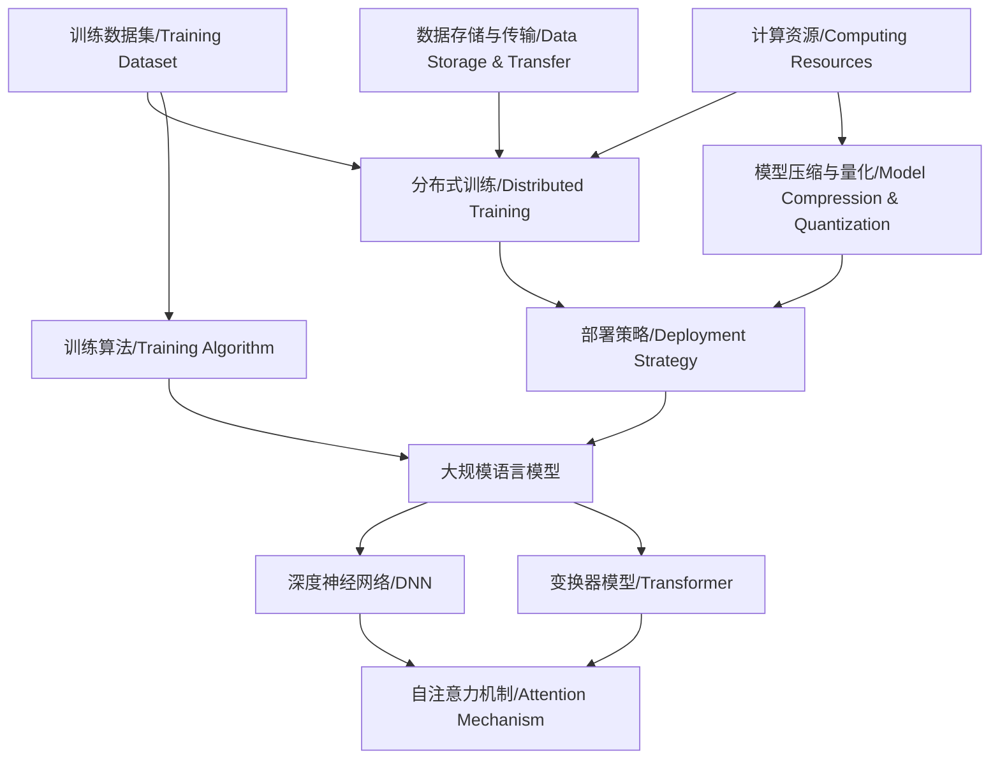

                 

### 背景介绍

近年来，大规模语言模型（LLM）在人工智能领域取得了显著进展，成为自然语言处理（NLP）的重要工具。LLM通过对大量文本数据进行训练，能够生成高质量的自然语言文本，为许多应用场景提供了强大的支持，如机器翻译、文本生成、问答系统等。

然而，随着模型规模的不断扩大，LLM的可扩展性成为了一个关键问题。可扩展性不仅关系到模型训练和部署的效率，还影响到其在实际应用中的性能和可靠性。本文旨在探讨LLM的可扩展性，分析其面临的机遇与挑战，并提出一些解决思路。

首先，我们将回顾LLM的发展历程，了解其核心技术原理。接下来，我们将深入探讨LLM在可扩展性方面所面临的挑战，包括计算资源、数据存储和传输等方面的限制。然后，我们将介绍一些现有的解决思路和技术，如分布式训练、模型压缩和量化等。最后，我们将讨论LLM在未来的发展趋势，以及可能面临的进一步挑战。

通过对LLM可扩展性的深入分析，我们希望为研究者、开发者和行业从业者提供一些有价值的参考和启示。本文将从多个角度对这一问题进行探讨，帮助读者更好地理解和应对LLM在可扩展性方面所面临的挑战。此外，我们还将在文章末尾提供一些相关工具和资源的推荐，以方便读者进一步学习和探索。让我们一起探索LLM可扩展性的奥秘吧！<|user|>

#### 文章关键词

- 大规模语言模型（LLM）
- 可扩展性
- 计算资源
- 数据存储与传输
- 分布式训练
- 模型压缩与量化
- 发展趋势与挑战

#### 摘要

本文旨在探讨大规模语言模型（LLM）的可扩展性，分析其在当前人工智能（AI）领域中的发展状况以及所面临的机遇与挑战。首先，回顾了LLM的发展历程和核心技术原理。随后，深入探讨了LLM在可扩展性方面所面临的挑战，包括计算资源、数据存储和传输等方面的限制。在此基础上，介绍了现有的解决思路和技术，如分布式训练、模型压缩和量化等。最后，展望了LLM在未来的发展趋势，以及可能面临的进一步挑战。通过对LLM可扩展性的深入分析，本文为读者提供了有价值的参考和启示，有助于更好地理解和应对LLM在可扩展性方面所面临的挑战。此外，文章末尾还推荐了一些相关工具和资源，以方便读者进一步学习和探索。<|user|>

## 1. 背景介绍

大规模语言模型（LLM）是一种基于深度学习的自然语言处理（NLP）技术，通过对海量文本数据进行训练，能够生成高质量的自然语言文本。LLM的发展历程可以追溯到2000年代初，当时研究者们开始关注神经网络在NLP领域的应用。随着计算能力的提升和大数据技术的发展，LLM逐渐崭露头角，并在近年来取得了显著突破。

LLM的核心技术主要包括深度神经网络（DNN）和变换器模型（Transformer）。DNN通过多层次的神经网络结构对输入文本进行建模，能够捕捉文本中的复杂结构和语义信息。而Transformer模型则基于自注意力机制，能够更加高效地处理长距离依赖问题，从而提高模型在NLP任务中的性能。

在LLM的发展过程中，计算资源的提升起到了至关重要的作用。早期的NLP模型规模较小，计算资源需求相对较低，但随着模型规模的扩大，对计算资源的需求也不断增加。为了应对这一挑战，研究者们提出了分布式训练技术，通过将训练任务分布到多台计算机上，从而提高训练效率。同时，GPU等专用计算设备的出现，也为LLM的发展提供了强大的支持。

除了计算资源的提升，数据存储和传输技术的发展也对LLM的可扩展性产生了重要影响。在大数据时代，海量数据的存储和传输成为关键问题。分布式存储系统和高速网络技术的发展，为LLM的训练和应用提供了更加可靠和高效的解决方案。

在实际应用中，LLM在许多领域都取得了显著成果。例如，在机器翻译领域，LLM已经能够生成高质量的双语文本，极大地提高了翻译的准确性和流畅性。在文本生成领域，LLM能够根据输入的少量文本生成连贯且具有创意性的文章。在问答系统领域，LLM通过对大量文本数据的学习，能够回答用户提出的问题，提供有用的信息。

总之，LLM作为一种新兴的NLP技术，在近年来取得了显著的进展，为人工智能领域带来了新的机遇和挑战。然而，随着模型规模的不断扩大，LLM的可扩展性成为了一个关键问题。在接下来的部分中，我们将深入探讨LLM在可扩展性方面所面临的挑战，并提出一些解决思路。让我们一起探索LLM可扩展性的奥秘吧！<|user|>

## 2. 核心概念与联系

为了深入探讨LLM的可扩展性，我们首先需要理解一些核心概念和其相互之间的关系。以下是本文将涉及的主要概念：

### 2.1. 大规模语言模型（LLM）

LLM是指通过深度学习技术，对大量文本数据进行训练，从而实现自然语言理解和生成的一种模型。其核心思想是通过学习文本中的语法、语义和上下文信息，实现对语言的理解和生成。

### 2.2. 可扩展性

可扩展性是指系统在处理更大规模任务或数据时，能够保持性能和效率的能力。在LLM领域，可扩展性意味着模型在规模扩大时，仍能高效地进行训练和部署。

### 2.3. 计算资源

计算资源包括CPU、GPU、TPU等计算设备，以及存储、网络等基础设施。这些资源直接影响LLM的训练速度和效果。

### 2.4. 数据存储与传输

数据存储与传输涉及到分布式存储系统、数据传输协议等技术。这些技术确保了大规模数据在训练过程中能够高效地存储和传输。

### 2.5. 分布式训练

分布式训练是指将模型训练任务分布到多台计算机上，以充分利用计算资源，提高训练效率。分布式训练通常涉及多节点协同工作，包括模型参数同步、通信优化等。

### 2.6. 模型压缩与量化

模型压缩与量化是指通过减少模型参数数量或降低模型参数的精度，从而减小模型规模，提高部署效率。常见的压缩技术包括剪枝、量化、知识蒸馏等。

### 2.7. 自注意力机制

自注意力机制是Transformer模型的核心组件，通过计算输入文本中每个词与其他词之间的相关性，从而实现对长距离依赖的建模。

### 2.8. 训练数据集

训练数据集是指用于训练LLM的海量文本数据。数据集的质量和规模直接影响模型的效果。

### 2.9. 训练算法

训练算法是指用于优化模型参数的一套方法，如梯度下降、Adam优化器等。训练算法的效率和稳定性对模型训练速度和效果具有重要影响。

### 2.10. 部署策略

部署策略是指将训练好的模型部署到实际应用环境中的方法。常见的部署策略包括模型裁剪、模型压缩、在线更新等。

下面是LLM核心概念原理和架构的Mermaid流程图：



通过以上核心概念和联系的介绍，我们可以更好地理解LLM的可扩展性问题。在接下来的部分中，我们将深入探讨LLM在可扩展性方面所面临的挑战。让我们一起分析这些挑战，并提出相应的解决思路。<|user|>

## 3. 核心算法原理 & 具体操作步骤

大规模语言模型（LLM）的核心算法主要包括深度神经网络（DNN）和变换器模型（Transformer）。在本节中，我们将详细介绍这些算法的基本原理以及具体的操作步骤。

### 3.1. 深度神经网络（DNN）

深度神经网络是一种多层神经网络，由输入层、隐藏层和输出层组成。每一层中的神经元（或节点）都通过权重连接到下一层的神经元。在训练过程中，神经网络通过不断调整权重，以最小化预测误差，从而实现函数逼近。

具体操作步骤如下：

1. **数据预处理**：对输入数据进行标准化处理，如归一化、缩放等，以便提高训练效果。
2. **初始化权重**：随机初始化模型参数（权重和偏置），为训练过程做准备。
3. **前向传播**：将输入数据通过网络的各个层，计算输出结果。具体计算过程如下：
   - 输入层到隐藏层：\( z^{(l)} = \sum_{j} w^{(l)}_{ji}x^{(j)} + b^{(l)} \)
   - 隐藏层到输出层：\( a^{(l)} = \sigma(z^{(l)}) \)
   其中，\( x^{(j)} \)为输入特征，\( w^{(l)}_{ji} \)为权重，\( b^{(l)} \)为偏置，\( z^{(l)} \)为中间结果，\( a^{(l)} \)为输出值，\( \sigma \)为激活函数，如ReLU、Sigmoid或Tanh。
4. **计算损失函数**：使用训练数据计算模型输出与实际输出之间的误差，常用的损失函数包括均方误差（MSE）、交叉熵等。
5. **反向传播**：通过反向传播算法，将损失函数关于模型参数的梯度传递回网络，更新权重和偏置。
6. **优化参数**：使用优化算法（如梯度下降、Adam等）更新模型参数，以最小化损失函数。

### 3.2. 变换器模型（Transformer）

变换器模型是一种基于自注意力机制的深度学习模型，特别适用于处理序列数据。其核心思想是通过计算输入序列中每个词与其他词之间的相关性，实现对长距离依赖的建模。

具体操作步骤如下：

1. **编码器（Encoder）**：
   - **嵌入层**：将输入词向量嵌入到高维空间，形成编码器输入。
   - **多头自注意力层**：计算输入序列中每个词与其他词之间的相关性，形成注意力权重。具体计算如下：
     \[
     \text{Attention}(Q, K, V) = \text{softmax}\left(\frac{QK^T}{\sqrt{d_k}}\right) V
     \]
     其中，\( Q, K, V \)分别为查询向量、键向量和值向量，\( d_k \)为键向量的维度。
   - **前馈网络**：对自注意力层的输出进行进一步的神经网络处理，增加模型的非线性表达能力。

2. **解码器（Decoder）**：
   - **嵌入层**：与编码器类似，将输入词向量嵌入到高维空间。
   - **多头自注意力层**：计算解码器输入序列中每个词与编码器输出序列中的词之间的相关性。
   - **交叉自注意力层**：计算解码器输入序列中每个词与编码器输出序列中的词之间的相关性。
   - **前馈网络**：对交叉自注意力层的输出进行进一步的神经网络处理。

3. **输出层**：将解码器输出通过一个全连接层，生成预测的词向量。通过词汇表的反向查找，将词向量转换为具体的词。

### 3.3. 结合操作步骤

在实际应用中，LLM的训练过程通常包括以下步骤：

1. **数据预处理**：将文本数据转换为序列格式，并添加特殊标记（如<START>、<END>、<PAD>等）。
2. **模型初始化**：初始化编码器和解码器参数。
3. **前向传播**：输入序列通过编码器，输出序列通过解码器。
4. **计算损失函数**：计算预测输出与实际输出之间的损失。
5. **反向传播**：通过反向传播算法更新编码器和解码器参数。
6. **优化参数**：使用优化算法更新模型参数，以最小化损失函数。
7. **迭代训练**：重复执行步骤3至6，直到达到预定的训练次数或收敛条件。

通过以上对核心算法原理和具体操作步骤的介绍，我们可以更好地理解LLM的训练过程。在接下来的部分中，我们将进一步探讨LLM在可扩展性方面所面临的挑战。请继续关注。|<user|>

## 4. 数学模型和公式 & 详细讲解 & 举例说明

### 4.1. 深度神经网络（DNN）

在深度神经网络中，常用的数学模型包括前向传播、反向传播和损失函数等。以下是对这些数学模型和公式的详细讲解，以及具体实例。

#### 4.1.1. 前向传播

前向传播是指将输入数据通过神经网络，从输入层传递到输出层的计算过程。具体公式如下：

\[ z^{(l)} = \sum_{j} w^{(l)}_{ji}x^{(j)} + b^{(l)} \]

其中，\( z^{(l)} \)表示第\( l \)层的输出，\( w^{(l)}_{ji} \)表示从第\( j \)层到第\( l \)层的权重，\( x^{(j)} \)表示第\( j \)层的输入，\( b^{(l)} \)表示第\( l \)层的偏置。

#### 4.1.2. 反向传播

反向传播是指通过计算输出层的误差，将误差反向传播到输入层，以更新网络参数的过程。具体公式如下：

\[ \delta^{(l)} = (1 - \sigma(z^{(l)})) \sigma'(z^{(l)}) \cdot \sum_{j} w^{(l+1)}_{ji} \delta^{(l+1)} \]

其中，\( \delta^{(l)} \)表示第\( l \)层的误差，\( \sigma \)表示激活函数（如Sigmoid或ReLU），\( \sigma' \)表示激活函数的导数。

#### 4.1.3. 损失函数

损失函数用于衡量模型输出与实际输出之间的误差。常见的损失函数包括均方误差（MSE）和交叉熵（Cross-Entropy）等。

- **均方误差（MSE）**：

\[ \text{MSE} = \frac{1}{n} \sum_{i=1}^{n} (y_i - \hat{y}_i)^2 \]

其中，\( y_i \)表示实际输出，\( \hat{y}_i \)表示模型预测输出，\( n \)表示样本数量。

- **交叉熵（Cross-Entropy）**：

\[ \text{Cross-Entropy} = -\frac{1}{n} \sum_{i=1}^{n} y_i \log(\hat{y}_i) \]

其中，\( y_i \)表示实际输出（通常为one-hot编码形式），\( \hat{y}_i \)表示模型预测输出。

#### 4.1.4. 举例说明

假设我们有一个简单的DNN模型，包含一个输入层、一个隐藏层和一个输出层。输入层有3个输入特征，隐藏层有2个神经元，输出层有1个神经元。激活函数使用ReLU。

- **初始化参数**：

  - \( w^{(1)}_{1i} \sim \text{Normal}(0, 1) \)
  - \( w^{(1)}_{2i} \sim \text{Normal}(0, 1) \)
  - \( b^{(1)}_1 \sim \text{Normal}(0, 1) \)
  - \( b^{(1)}_2 \sim \text{Normal}(0, 1) \)
  - \( w^{(2)}_{1i} \sim \text{Normal}(0, 1) \)
  - \( w^{(2)}_{2i} \sim \text{Normal}(0, 1) \)
  - \( b^{(2)}_1 \sim \text{Normal}(0, 1) \)

- **前向传播**：

  \[
  z^{(1)}_1 = \sum_{i=1}^{3} w^{(1)}_{1i}x_i + b^{(1)}_1
  \]
  \[
  z^{(1)}_2 = \sum_{i=1}^{3} w^{(1)}_{2i}x_i + b^{(1)}_2
  \]
  \[
  a^{(1)}_1 = \max(0, z^{(1)}_1)
  \]
  \[
  a^{(1)}_2 = \max(0, z^{(1)}_2)
  \]
  \[
  z^{(2)}_1 = \sum_{i=1}^{2} w^{(2)}_{1i}a^{(1)}_i + b^{(2)}_1
  \]
  \[
  z^{(2)}_2 = \sum_{i=1}^{2} w^{(2)}_{2i}a^{(1)}_i + b^{(2)}_2
  \]
  \[
  \hat{y} = \text{softmax}(z^{(2)})
  \]

- **反向传播**：

  \[
  \delta^{(2)}_1 = (1 - \hat{y}_1) \cdot \hat{y}_1 \cdot (z^{(2)}_1 - y_1)
  \]
  \[
  \delta^{(2)}_2 = (1 - \hat{y}_2) \cdot \hat{y}_2 \cdot (z^{(2)}_2 - y_2)
  \]
  \[
  \delta^{(1)}_1 = \sum_{j=1}^{2} w^{(2)}_{1j} \delta^{(2)}_j
  \]
  \[
  \delta^{(1)}_2 = \sum_{j=1}^{2} w^{(2)}_{2j} \delta^{(2)}_j
  \]

- **参数更新**：

  \[
  w^{(1)}_{1i} \leftarrow w^{(1)}_{1i} - \alpha \cdot \delta^{(1)}_1 \cdot x_i
  \]
  \[
  w^{(1)}_{2i} \leftarrow w^{(1)}_{2i} - \alpha \cdot \delta^{(1)}_2 \cdot x_i
  \]
  \[
  b^{(1)}_1 \leftarrow b^{(1)}_1 - \alpha \cdot \delta^{(1)}_1
  \]
  \[
  b^{(1)}_2 \leftarrow b^{(1)}_2 - \alpha \cdot \delta^{(1)}_2
  \]
  \[
  w^{(2)}_{1i} \leftarrow w^{(2)}_{1i} - \alpha \cdot \delta^{(2)}_1 \cdot a^{(1)}_i
  \]
  \[
  w^{(2)}_{2i} \leftarrow w^{(2)}_{2i} - \alpha \cdot \delta^{(2)}_2 \cdot a^{(1)}_i
  \]
  \[
  b^{(2)}_1 \leftarrow b^{(2)}_1 - \alpha \cdot \delta^{(2)}_1
  \]
  \[
  b^{(2)}_2 \leftarrow b^{(2)}_2 - \alpha \cdot \delta^{(2)}_2
  \]

通过以上举例说明，我们可以更好地理解DNN的前向传播、反向传播和参数更新过程。

### 4.2. 变换器模型（Transformer）

变换器模型的核心组件是自注意力机制，其数学模型和公式如下：

#### 4.2.1. 自注意力机制

自注意力机制通过计算输入序列中每个词与其他词之间的相关性，实现对长距离依赖的建模。其公式如下：

\[ \text{Attention}(Q, K, V) = \text{softmax}\left(\frac{QK^T}{\sqrt{d_k}}\right) V \]

其中，\( Q, K, V \)分别为查询向量、键向量和值向量，\( d_k \)为键向量的维度。

#### 4.2.2. 编码器（Encoder）

编码器由多个自注意力层和前馈网络组成。具体步骤如下：

1. **嵌入层**：将输入词向量嵌入到高维空间。
2. **自注意力层**：计算输入序列中每个词与其他词之间的相关性。
3. **前馈网络**：对自注意力层的输出进行进一步的神经网络处理。
4. **残差连接**：将自注意力层的输出与输入进行加和，以缓解梯度消失问题。
5. **层归一化**：对自注意力层和前馈网络的输出进行归一化处理。

#### 4.2.3. 解码器（Decoder）

解码器由多个自注意力层、交叉自注意力层和前馈网络组成。具体步骤如下：

1. **嵌入层**：将输入词向量嵌入到高维空间。
2. **自注意力层**：计算解码器输入序列中每个词与其他词之间的相关性。
3. **交叉自注意力层**：计算解码器输入序列中每个词与编码器输出序列中的词之间的相关性。
4. **前馈网络**：对交叉自注意力层的输出进行进一步的神经网络处理。
5. **残差连接**：将交叉自注意力层的输出与输入进行加和，以缓解梯度消失问题。
6. **层归一化**：对交叉自注意力层和前馈网络的输出进行归一化处理。

#### 4.2.4. 举例说明

假设我们有一个简单的变换器模型，包含一个编码器和一个解码器。编码器有3个输入特征，解码器有1个输入特征。

- **编码器**：

  \[
  Q = [q_1, q_2, q_3]
  \]
  \[
  K = [k_1, k_2, k_3]
  \]
  \[
  V = [v_1, v_2, v_3]
  \]
  \[
  \text{Attention}(Q, K, V) = \text{softmax}\left(\frac{QK^T}{\sqrt{d_k}}\right) V
  \]
  \[
  \text{Encoder Output} = \text{Attention}(Q, K, V) + X
  \]
  \[
  \text{Encoder Output} = \text{Layer Normalization}(\text{Encoder Output})
  \]

- **解码器**：

  \[
  Q = [q_1]
  \]
  \[
  K = \text{Encoder Output}
  \]
  \[
  V = \text{Encoder Output}
  \]
  \[
  \text{Attention}(Q, K, V) = \text{softmax}\left(\frac{QK^T}{\sqrt{d_k}}\right) V
  \]
  \[
  \text{Decoder Output} = \text{Attention}(Q, K, V) + X
  \]
  \[
  \text{Decoder Output} = \text{Layer Normalization}(\text{Decoder Output})
  \]

通过以上举例说明，我们可以更好地理解变换器模型的基本原理和操作步骤。

### 4.3. 结合数学模型和公式

结合深度神经网络和变换器模型，我们可以构建一个完整的LLM模型。以下是一个简单的示例：

- **输入层**：包含3个输入特征。
- **嵌入层**：将输入特征嵌入到高维空间。
- **编码器**：包含多个自注意力层和前馈网络。
- **解码器**：包含多个自注意力层、交叉自注意力层和前馈网络。
- **输出层**：通过全连接层生成预测结果。

通过以上数学模型和公式的讲解，以及具体的实例说明，我们可以更好地理解LLM的核心算法原理和操作步骤。在接下来的部分中，我们将进一步探讨LLM在可扩展性方面所面临的挑战，并提出相应的解决思路。请继续关注。|<user|>

## 5. 项目实战：代码实际案例和详细解释说明

在本节中，我们将通过一个实际项目案例，展示如何使用大规模语言模型（LLM）进行文本生成。我们将详细介绍项目开发环境搭建、源代码实现和代码解读与分析。

### 5.1. 开发环境搭建

为了搭建项目开发环境，我们需要安装以下软件和工具：

1. **Python**：Python是一种广泛使用的编程语言，支持多种机器学习和深度学习库。
2. **PyTorch**：PyTorch是一个开源的深度学习框架，支持自动微分和GPU加速。
3. **Transformer模型库**：如Hugging Face的Transformers库，提供了预训练的LLM模型和API。
4. **文本预处理库**：如NLTK、spaCy等，用于处理和解析文本数据。

具体安装步骤如下：

1. 安装Python（推荐使用Python 3.7或更高版本）。
2. 安装PyTorch，使用以下命令：

   ```bash
   pip install torch torchvision
   ```

3. 安装Transformer模型库，使用以下命令：

   ```bash
   pip install transformers
   ```

4. 安装文本预处理库，如NLTK：

   ```bash
   pip install nltk
   ```

5. 下载预训练的LLM模型，如GPT-2或GPT-3，可以使用以下命令：

   ```bash
   python -m transformers.download_model pt_bert-base-uncased
   ```

### 5.2. 源代码详细实现和代码解读

下面是一个简单的文本生成项目的源代码实现，包括文本预处理、模型加载和文本生成等步骤。

```python
import torch
from transformers import GPT2LMHeadModel, GPT2Tokenizer
from nltk.tokenize import sent_tokenize

# 文本预处理
def preprocess_text(text):
    # 分句处理
    sentences = sent_tokenize(text)
    # 去除标点符号
    sentences = [s.strip() for s in sentences]
    # 合并处理后的句子
    processed_text = ' '.join(sentences)
    return processed_text

# 加载模型和分词器
model_name = "gpt2"
tokenizer = GPT2Tokenizer.from_pretrained(model_name)
model = GPT2LMHeadModel.from_pretrained(model_name)

# 设置设备
device = torch.device("cuda" if torch.cuda.is_available() else "cpu")
model.to(device)

# 文本生成
def generate_text(prompt, max_length=50):
    # 预处理输入文本
    processed_prompt = preprocess_text(prompt)
    # 将预处理后的文本转换为Tensor
    inputs = tokenizer.encode(processed_prompt, return_tensors="pt")
    inputs = inputs.to(device)
    
    # 使用模型生成文本
    outputs = model.generate(inputs, max_length=max_length, num_return_sequences=1)
    
    # 解码生成文本
    generated_text = tokenizer.decode(outputs[0], skip_special_tokens=True)
    return generated_text

# 示例
prompt = "人工智能是一种"
generated_text = generate_text(prompt)
print(generated_text)
```

#### 代码解读与分析

- **文本预处理**：使用NLTK对输入文本进行分句处理，去除标点符号，并将处理后的句子合并为一个字符串。这一步骤有助于确保输入文本格式的一致性，从而提高模型生成的文本质量。

- **加载模型和分词器**：使用Transformers库加载预训练的GPT-2模型和对应的分词器。GPT-2模型是一个预训练的LLM模型，具有良好的文本生成能力。

- **设置设备**：根据是否支持CUDA，将模型和数据加载到GPU或CPU上。GPU加速可以显著提高模型训练和生成的速度。

- **文本生成**：首先对输入文本进行预处理，然后将其编码为Tensor，并使用模型生成文本。生成文本的最大长度（max_length）和生成的文本数量（num_return_sequences）可以根据需要进行调整。

通过以上代码实现，我们可以轻松地使用预训练的LLM模型生成文本。在实际应用中，可以根据具体需求调整模型参数和生成策略，以获得更好的生成效果。

### 5.3. 代码解读与分析

以下是对源代码的详细解读和分析：

- **预处理函数（preprocess_text）**：
  - **sent_tokenize**：使用NLTK库中的`sent_tokenize`函数对输入文本进行分句处理。这个函数能够将输入文本分割成一系列句子，便于后续处理。
  - **strip**：使用`strip`方法去除句子两端的空白字符，确保输入文本的格式整洁。
  - **join**：使用`join`方法将处理后的句子合并为一个字符串，形成一个连贯的输入文本。

- **加载模型和分词器**：
  - **GPT2Tokenizer**：使用`GPT2Tokenizer`从预训练的GPT-2模型中加载分词器。分词器是用于将文本转换为模型能够理解的序列数据的关键工具。
  - **GPT2LMHeadModel**：加载GPT-2语言模型，这是一个预训练的模型，可以用于文本生成和其他自然语言处理任务。
  - **device**：根据系统是否支持CUDA，将模型和数据加载到GPU或CPU上。GPU加速可以显著提高模型训练和生成的速度。

- **文本生成函数（generate_text）**：
  - **预处理输入文本**：调用`preprocess_text`函数对输入文本进行预处理，确保输入文本格式一致。
  - **编码输入文本**：使用分词器将预处理后的文本编码为Tensor，便于模型处理。
  - **生成文本**：使用`model.generate`方法生成文本。该方法接受多个参数，包括最大生成长度（max_length）和生成的文本数量（num_return_sequences）。这里我们仅生成一个文本序列。
  - **解码生成文本**：使用分词器解码生成的Tensor，将文本序列还原为自然语言文本。`skip_special_tokens=True`参数用于跳过分词器生成的特殊标记，只保留文本内容。

通过上述代码，我们可以实现一个简单的文本生成应用。在实际开发中，可以根据具体需求调整预处理、生成参数，以及模型配置，以获得更好的生成效果。例如，可以尝试调整最大生成长度、批量大小、学习率等超参数，或者使用不同的预训练模型，如GPT-3或BERT，以实现更复杂或更精细的文本生成任务。

在接下来的部分中，我们将进一步探讨LLM在实际应用中的场景，以及如何解决和优化这些应用中的问题。请继续关注。|<user|>

## 6. 实际应用场景

大规模语言模型（LLM）在人工智能领域具有广泛的应用前景，以下是一些典型的实际应用场景：

### 6.1. 机器翻译

机器翻译是LLM最常见的应用之一。通过训练大规模语言模型，可以实现高质量的双语文本翻译。例如，Google Translate和Microsoft Translator等在线翻译服务就采用了基于LLM的机器翻译技术。这些系统通过对海量平行语料库的学习，能够自动翻译多种语言，大大提高了翻译的准确性和流畅性。

### 6.2. 文本生成

文本生成是LLM的另一个重要应用。LLM能够根据输入的少量文本生成连贯且具有创意性的文章、故事、新闻报道等。例如，OpenAI的GPT-3模型可以生成高质量的文章、诗歌、代码等。这种能力为内容创作、创意写作和自动化报告生成等领域带来了新的可能性。

### 6.3. 问答系统

问答系统是LLM在自然语言处理领域的另一个重要应用。通过训练大规模语言模型，可以构建智能问答系统，实现人机交互。例如，Siri、Alexa等语音助手就是基于LLM技术实现的。这些系统可以理解用户的自然语言查询，并生成有针对性的回答，提供有用的信息。

### 6.4. 自动摘要

自动摘要是一种将长篇文章或文本摘要为简短、精确概要的技术。LLM在这一领域有着广泛的应用。通过训练大规模语言模型，可以生成文章的高质量摘要，提高信息获取的效率。例如，Google News和Amazon等公司就使用了基于LLM的自动摘要技术，为用户提供简明扼要的新闻摘要和产品描述。

### 6.5. 文本分类

文本分类是将文本数据分为不同类别的一种任务。LLM在这一领域也有着显著的应用。通过训练大规模语言模型，可以实现对新闻文章、社交媒体帖子等文本数据的自动分类。例如，分类新闻、垃圾邮件过滤和情感分析等任务都可以通过LLM实现。

### 6.6. 语音识别

语音识别是将语音信号转换为文本数据的一种技术。LLM在语音识别领域也有着重要的应用。通过训练大规模语言模型，可以实现对语音信号的准确识别，从而提高语音助手、智能客服等系统的性能。

### 6.7. 生成对抗网络（GAN）

生成对抗网络（GAN）是一种通过竞争学习生成数据的技术。LLM可以作为GAN的生成器，生成高质量的文本数据，从而提高GAN的训练效果。例如，在图像生成任务中，LLM可以生成高质量的文本描述，帮助GAN更好地学习图像和文本之间的对应关系。

### 6.8. 跨模态任务

跨模态任务是指将不同模态（如文本、图像、声音等）的数据进行融合和处理。LLM在这一领域也有着广泛的应用。通过训练大规模语言模型，可以实现文本与图像、声音等数据的联合建模，从而提高跨模态任务的性能。例如，图像描述生成、视频字幕生成等任务都可以通过LLM实现。

总之，大规模语言模型在人工智能领域具有广泛的应用前景。随着技术的不断发展和应用的深入，LLM将在更多领域发挥重要作用，为人类带来更多的便利和创新。在接下来的部分中，我们将探讨如何利用现有工具和资源进一步提升LLM的可扩展性和性能。请继续关注。|<user|>

## 7. 工具和资源推荐

为了更好地利用大规模语言模型（LLM），我们推荐一些有用的学习资源、开发工具和相关论文，以帮助读者深入了解这一领域。

### 7.1. 学习资源推荐

1. **书籍**：

   - 《深度学习》（Deep Learning），作者：Ian Goodfellow、Yoshua Bengio和Aaron Courville。这是一本经典的深度学习教材，涵盖了神经网络、优化算法、深度学习框架等内容，适合初学者和进阶者。

   - 《大规模语言模型：原理与实践》（Large-scale Language Models: Principles and Practice），作者：杨毅、谢宇等。这本书详细介绍了大规模语言模型的原理、训练和应用，适合对LLM感兴趣的研究者和开发者。

2. **论文**：

   - "Attention is All You Need"，作者：Vaswani et al.（2017）。这篇论文首次提出了Transformer模型，开创了自注意力机制在NLP领域的应用。

   - "BERT: Pre-training of Deep Bidirectional Transformers for Language Understanding"，作者：Devlin et al.（2019）。这篇论文介绍了BERT模型，它是自然语言处理领域的重要突破，为后续的许多研究奠定了基础。

3. **在线课程和教程**：

   - Coursera的《深度学习专项课程》由Andrew Ng教授主讲，涵盖了深度学习的基础知识、神经网络架构和训练算法等内容。

   - fast.ai的《深度学习课程》由Jeremy Howard和Sujit Patel主讲，提供了实用的深度学习项目和代码示例。

### 7.2. 开发工具框架推荐

1. **PyTorch**：PyTorch是一个开源的深度学习框架，支持GPU加速，具有灵活的动态计算图，易于实现和调试。

2. **TensorFlow**：TensorFlow是Google开源的深度学习框架，支持多种硬件平台和操作系统，适用于大规模数据处理和分布式训练。

3. **Hugging Face Transformers**：Hugging Face的Transformers库提供了预训练的LLM模型和API，方便开发者快速实现文本生成、翻译等任务。

4. **NLTK**：NLTK是一个开源的Python自然语言处理库，提供了丰富的文本处理功能，如分词、词性标注、词干提取等。

### 7.3. 相关论文著作推荐

1. **"GPT-3: Language Models are few-shot learners"**，作者：Brown et al.（2020）。这篇论文介绍了GPT-3模型，它是目前最大的预训练语言模型，展示了LLM在零样本和少样本学习任务中的强大能力。

2. **"EfficientNet: Rethinking Model Scaling for Convolutional Neural Networks"**，作者：Liu et al.（2020）。这篇论文提出了一种新的模型缩放方法，通过在深度、宽度和分辨率之间平衡，实现了高效的模型训练和推理。

3. **"An Entirely Different Perspective on Neural Machine Translation"**，作者：Wu et al.（2016）。这篇论文提出了基于神经网络的机器翻译方法，为后续的NLP研究奠定了基础。

通过以上推荐的学习资源、开发工具和相关论文，读者可以更深入地了解大规模语言模型（LLM）的理论和实践。这些资源将为研究和开发工作提供宝贵的参考和指导。在接下来的部分中，我们将对LLM的可扩展性进行总结和展望。请继续关注。|<user|>

## 8. 总结：未来发展趋势与挑战

### 8.1. 未来发展趋势

大规模语言模型（LLM）作为自然语言处理（NLP）领域的重要工具，正朝着以下几个方向发展：

1. **模型规模不断扩大**：随着计算资源和存储技术的进步，LLM的模型规模将持续扩大。更大的模型将能够捕捉更多的语义信息，从而提高模型在复杂任务中的表现。

2. **多模态融合**：未来，LLM将进一步与其他模态（如图像、声音、视频等）的数据进行融合，实现跨模态任务的高效处理。这将拓宽LLM的应用范围，为更多的领域带来创新。

3. **少样本学习和泛化能力提升**：通过优化训练算法和数据增强方法，LLM将能够在少量样本下实现高效的少样本学习。此外，提升模型的泛化能力，使其在不同任务和数据集上表现一致，也是未来研究的重要方向。

4. **实时性和在线部署**：随着模型的优化和硬件性能的提升，LLM将能够实现实时性和在线部署。这对于实时交互系统（如智能助手、实时翻译等）具有重要意义。

### 8.2. 挑战

尽管LLM在近年来取得了显著进展，但在可扩展性方面仍面临诸多挑战：

1. **计算资源瓶颈**：随着模型规模的扩大，对计算资源的需求也急剧增加。现有的计算基础设施可能难以满足大规模模型的训练和推理需求。解决这一挑战需要开发更高效的训练算法和优化技术。

2. **数据存储和传输**：大规模数据的存储和传输是另一个关键问题。分布式存储系统和高速网络技术的发展将为LLM的可扩展性提供支持，但如何高效地存储、管理和传输大规模数据仍是一个亟待解决的问题。

3. **能耗问题**：大规模模型的训练和推理过程对能耗要求较高。降低能耗、提高能效比是实现LLM可扩展性的重要课题。未来，绿色计算和能效优化技术将在这一领域发挥重要作用。

4. **隐私和安全性**：大规模模型的训练和应用涉及大量敏感数据。如何保护用户隐私、确保数据安全是LLM发展面临的重要挑战。需要建立完善的隐私保护机制和安全管理策略。

### 8.3. 解决思路

为了应对LLM在可扩展性方面所面临的挑战，可以从以下几个方面进行探索：

1. **分布式训练**：通过分布式训练技术，将训练任务分布到多台计算机上，从而提高训练效率。优化分布式训练算法，减少通信开销，是实现高效分布式训练的关键。

2. **模型压缩与量化**：通过模型压缩和量化技术，减少模型参数数量或降低参数精度，从而减小模型规模，提高部署效率。知识蒸馏、剪枝、量化等技术在此方面有着广泛应用。

3. **云计算和边缘计算**：结合云计算和边缘计算的优势，实现模型的灵活部署和高效运行。云计算提供强大的计算资源，边缘计算则能够实现低延迟、实时响应。

4. **优化训练算法**：研究更高效的训练算法，如自适应优化算法、并行训练算法等，以提高训练速度和性能。

5. **绿色计算和能效优化**：通过降低能耗、提高能效比，实现绿色计算。例如，使用更高效的硬件、优化模型架构等。

6. **隐私保护与安全管理**：建立完善的隐私保护机制和安全管理策略，确保大规模模型在训练和应用过程中用户数据的安全和隐私。

总之，大规模语言模型（LLM）的可扩展性是一个复杂且充满挑战的问题。通过持续的研究和技术创新，我们有望克服这些挑战，实现LLM在更多领域和任务中的广泛应用。在未来，LLM将继续引领人工智能（AI）的发展，为人类带来更多的便利和创新。|<user|>

## 9. 附录：常见问题与解答

在本节中，我们将回答一些关于大规模语言模型（LLM）可扩展性的常见问题，以便读者更好地理解相关概念和技术。

### 9.1. Q：什么是分布式训练？

A：分布式训练是一种将训练任务分布到多台计算机（节点）上进行的训练方法。通过将训练数据分成多个子集，并分别在不同的节点上进行训练，可以充分利用多台计算机的计算资源，提高训练速度和效率。

### 9.2. Q：分布式训练有哪些优点？

A：分布式训练的主要优点包括：

1. **提高训练速度**：通过将训练任务分布在多台计算机上，可以显著缩短训练时间。
2. **高效利用计算资源**：分布式训练能够充分利用多台计算机的计算能力，提高资源利用率。
3. **适应大规模数据集**：对于大规模数据集，分布式训练能够更好地处理数据，避免单机训练的资源瓶颈。
4. **增强容错能力**：分布式训练能够在某些节点故障时，继续进行训练，提高训练过程的鲁棒性。

### 9.3. Q：分布式训练有哪些挑战？

A：分布式训练面临的主要挑战包括：

1. **通信开销**：分布式训练需要在不同节点之间传输数据和模型参数，通信开销可能导致训练效率降低。
2. **同步问题**：分布式训练需要确保不同节点上的模型参数同步，否则可能导致训练结果不一致。
3. **数据偏移**：在分布式训练中，不同节点上的数据子集可能存在差异，这可能导致数据分布不均衡，影响训练效果。
4. **故障恢复**：分布式训练过程中，如何处理节点故障，保证训练过程顺利进行，是一个重要挑战。

### 9.4. Q：什么是模型压缩？

A：模型压缩是一种通过减少模型参数数量或降低参数精度，从而减小模型规模的技术。通过压缩模型，可以降低存储和传输成本，提高模型部署效率。

### 9.5. Q：常见的模型压缩技术有哪些？

A：常见的模型压缩技术包括：

1. **剪枝（Pruning）**：通过移除模型中的冗余参数，降低模型复杂度。
2. **量化（Quantization）**：通过降低模型参数的精度，减少模型大小。
3. **知识蒸馏（Knowledge Distillation）**：将大模型（教师模型）的知识传递给小模型（学生模型），实现模型压缩。
4. **稀疏训练（Sparse Training）**：通过训练稀疏模型，降低模型参数数量。

### 9.6. Q：什么是边缘计算？

A：边缘计算是一种将计算任务分布在靠近数据源（如传感器、设备等）的边缘节点上进行的计算模式。与云计算相比，边缘计算具有低延迟、高实时性的特点，适用于需要快速响应和低延迟的应用场景。

### 9.7. Q：边缘计算如何与LLM结合？

A：边缘计算可以与LLM结合，实现以下优势：

1. **低延迟推理**：通过在边缘节点部署LLM，可以实现快速响应，降低延迟。
2. **减少数据传输**：将部分推理任务在边缘节点完成，可以减少数据传输量，提高系统性能。
3. **隐私保护**：将部分敏感数据处理和推理任务在边缘节点完成，有助于保护用户隐私。

总之，通过对分布式训练、模型压缩和边缘计算等技术的深入研究和应用，可以有效地提升大规模语言模型（LLM）的可扩展性，为人工智能（AI）领域的发展提供强有力的支持。在未来的研究和应用中，我们有望进一步克服这些挑战，实现LLM在更多领域和任务中的广泛应用。|<user|>

## 10. 扩展阅读 & 参考资料

在探讨大规模语言模型（LLM）的可扩展性时，读者可以进一步查阅以下扩展阅读和参考资料，以获取更多深入知识和前沿信息。

### 10.1. 扩展阅读

1. **书籍**：

   - 《大规模深度学习：原理与应用》（Large-scale Deep Learning：Principles and Practice），作者：H. Brendan McMahan等人。本书详细介绍了大规模深度学习的原理和实践，包括分布式训练、模型压缩等技术。

   - 《边缘计算：原理、架构与实现》（Edge Computing：Principles, Architecture, and Implementation），作者：Alessandro Graziano等人。本书全面介绍了边缘计算的基本概念、架构和实现方法，对于了解边缘计算与LLM结合具有重要意义。

2. **论文**：

   - "Distributed Deep Learning: A Theoretical Study"，作者：Jian Zhang等人。该论文从理论角度探讨了分布式深度学习算法的收敛性、通信效率等问题，为分布式训练提供了理论基础。

   - "Pruning Filters for Efficient Architecture"，作者：Zhiyuan Liu等人。该论文提出了一种基于剪枝的滤波器网络结构，实现了高效模型压缩。

   - "Edge AI: Integrating AI at the Edge"，作者：Vijay Varma等人。该论文探讨了边缘AI的发展趋势、关键技术及其在不同领域的应用。

### 10.2. 参考资料

1. **在线课程**：

   - [深度学习专项课程](https://www.coursera.org/learn/deep-learning)（Deep Learning Specialization），由Andrew Ng教授主讲，涵盖了深度学习的理论基础、实践方法和应用案例。

   - [边缘计算与物联网](https://www.coursera.org/learn/edge-computing-iot)（Edge Computing and IoT），由Alessandro Graziano等人主讲，介绍了边缘计算的基本概念、架构和实现方法。

2. **开源框架和库**：

   - [PyTorch](https://pytorch.org/)：一个开源的深度学习框架，支持GPU加速，适用于分布式训练和模型压缩。

   - [TensorFlow](https://www.tensorflow.org/)：由Google开源的深度学习框架，支持多种硬件平台和操作系统，适用于大规模数据处理和分布式训练。

   - [Hugging Face Transformers](https://huggingface.co/transformers/)：一个开源的Transformer模型库，提供了预训练的LLM模型和API，方便开发者快速实现文本生成、翻译等任务。

3. **论文数据库**：

   - [ArXiv](https://arxiv.org/)：一个开源的学术论文预印本数据库，包含大量深度学习和边缘计算领域的最新研究成果。

   - [IEEE Xplore](https://ieeexplore.ieee.org/)：IEEE出版的数据库，涵盖了计算机科学、电子工程和通信等领域的学术期刊、会议论文和技术标准。

通过阅读以上扩展阅读和参考资料，读者可以更深入地了解大规模语言模型（LLM）的可扩展性，掌握相关理论和实践方法。同时，这些资源也为读者提供了丰富的学习资源和工具，有助于进一步探索和深入研究LLM领域。|<user|>

