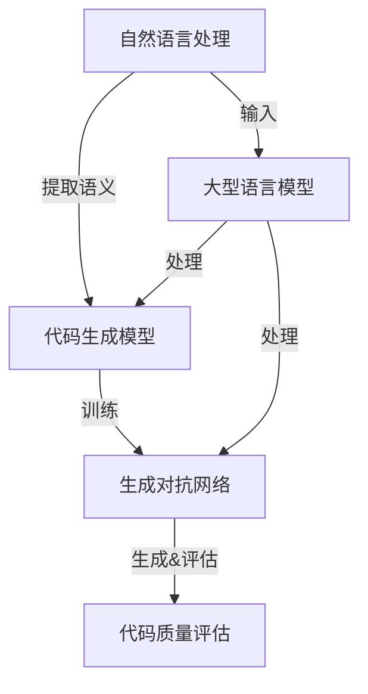

                 

# LLMA的程序合成技术进展综述

## 关键词：程序合成，自然语言处理，人工智能，生成对抗网络，深度学习

## 摘要：

本文旨在综述LLM（大型语言模型）在程序合成技术领域的最新进展。程序合成作为自然语言处理与编程语言领域的一项前沿技术，其研究与应用不断推动计算机科学的边界。文章首先介绍了程序合成技术的背景及其与人工智能的紧密联系，接着详细探讨了LLM在程序合成中的应用，包括核心算法原理、数学模型以及实际应用案例。此外，文章还分析了当前存在的挑战与未来发展趋势，并推荐了相关的学习资源和开发工具。通过本文的阅读，读者可以全面了解LLM在程序合成技术领域的重要性和应用潜力。

## 1. 背景介绍

### 1.1 程序合成的定义与重要性

程序合成（Program Synthesis）是指通过自动化方式从描述性输入（如自然语言文本、形式化规格说明等）生成有效的程序代码的过程。它是一种将高级抽象转换为具体实现的技术，旨在提高软件开发效率、降低成本，并解决复杂问题。

程序合成技术的关键在于将人类提供的非结构化信息转化为计算机可读、可执行的代码。这一过程不仅涉及自然语言处理技术，还需要结合编程语言理论、自动化推理和生成技术。程序合成的重要性体现在多个方面：

1. **提升开发效率**：程序合成能够自动生成大量代码，从而减轻开发者的负担，提高软件开发的速度。
2. **解决复杂问题**：对于复杂的问题，通过程序合成可以自动化地设计出合适的解决方案，降低人类介入的难度。
3. **代码质量与一致性**：程序合成能够生成遵循编程规范、设计良好的代码，有助于提高代码质量。
4. **跨语言兼容性**：程序合成技术可以使代码在不同编程语言之间实现自动转换，提高代码的可移植性。

### 1.2 程序合成的历史与发展

程序合成的概念可以追溯到20世纪50年代，当时研究人员开始探索如何通过自动化方法生成程序代码。早期的研究主要集中在符号编程和定理证明上。随着计算机科学的发展，程序合成技术逐渐与其他领域相结合，如自然语言处理、机器学习、深度学习等。

在自然语言处理领域，随着语言模型的不断进步，程序合成技术得到了新的发展。特别是近年来，大型语言模型（LLM）的出现使得程序合成变得更加高效和准确。LLM能够理解复杂的自然语言描述，并生成相应的程序代码，为程序合成技术开辟了新的方向。

### 1.3 程序合成与人工智能的联系

程序合成与人工智能（AI）有着紧密的联系。人工智能，特别是深度学习，为程序合成提供了强大的技术支持。深度学习模型，如神经网络，可以学习从大量的数据中提取有用的特征，这些特征对于生成程序代码至关重要。

在程序合成中，AI技术被用于：

1. **语义理解**：通过自然语言处理技术，将自然语言描述转化为机器可理解的语义表示。
2. **代码生成**：利用生成对抗网络（GAN）等模型，从语义表示中生成具体的程序代码。
3. **代码优化**：通过优化算法，对生成的代码进行优化，以提高其性能和可读性。

总之，程序合成技术是人工智能与编程语言领域的一项重要交叉领域，其发展不仅依赖于自然语言处理和深度学习技术的进步，也受到编程语言理论、自动化推理和生成技术的推动。

### 1.4 程序合成在工业界和学术界的研究现状

在工业界，程序合成技术已经得到了广泛的应用。许多大型科技公司，如谷歌、微软、亚马逊等，都在积极研究和开发程序合成工具。这些工具被用于自动化软件开发、代码生成、bug修复等任务，极大地提高了开发效率和软件质量。

在学术界，程序合成技术也是研究的热点。许多顶级会议和期刊，如NeurIPS、ACL、ICSE等，都发表了大量的相关论文。研究人员通过实验和理论分析，不断推动程序合成技术的发展。

尽管程序合成技术已经取得了显著的成果，但仍存在许多挑战。例如，如何提高代码生成质量、如何处理复杂的编程语言结构、如何保证生成的代码的安全性等。这些挑战仍然是未来研究的重点。

### 1.5 本文结构

本文将从以下几个方面对LLM在程序合成技术中的最新进展进行综述：

1. **核心概念与联系**：介绍程序合成技术中的核心概念，并展示LLM在程序合成中的应用架构。
2. **核心算法原理 & 具体操作步骤**：详细阐述LLM在程序合成中的算法原理和操作步骤。
3. **数学模型和公式 & 详细讲解 & 举例说明**：分析LLM在程序合成中的数学模型和公式，并通过具体实例进行说明。
4. **项目实战：代码实际案例和详细解释说明**：提供实际的程序合成案例，详细解释代码实现和效果分析。
5. **实际应用场景**：探讨LLM在程序合成中的实际应用场景，如自动化编程、代码生成、bug修复等。
6. **工具和资源推荐**：推荐学习资源、开发工具和框架，帮助读者深入了解和探索程序合成技术。
7. **总结：未来发展趋势与挑战**：总结LLM在程序合成技术中的最新进展，并展望未来的发展趋势和面临的挑战。

通过本文的阅读，读者将全面了解LLM在程序合成技术中的重要性、应用场景、核心算法原理以及未来的发展方向。

### 2. 核心概念与联系

程序合成技术的核心概念包括自然语言处理（NLP）、代码生成模型、生成对抗网络（GAN）以及深度学习等。以下是对这些核心概念及其相互关系的详细描述，并通过Mermaid流程图展示LLM在程序合成中的应用架构。

#### 2.1 自然语言处理（NLP）

自然语言处理是人工智能的一个重要分支，旨在使计算机能够理解、处理和生成自然语言。NLP技术在程序合成中起到关键作用，因为程序合成通常需要从自然语言描述中提取语义信息，以生成相应的程序代码。

NLP的核心概念包括：

1. **词向量表示**：将自然语言文本中的单词或短语转化为向量的表示，以便于计算机处理。
2. **句法分析**：分析句子的结构，提取语法规则和语义关系。
3. **语义理解**：理解句子的含义，提取关键信息。

NLP技术为程序合成提供了语义理解的基础，使得程序合成能够从自然语言描述中提取有用的信息，进而生成程序代码。

#### 2.2 代码生成模型

代码生成模型是程序合成技术的核心组成部分，负责将自然语言描述转换为程序代码。这些模型通常基于深度学习技术，能够学习从大量的代码和自然语言数据中提取模式和规律。

代码生成模型的关键概念包括：

1. **序列到序列（Seq2Seq）模型**：将一个序列（如自然语言文本）映射到另一个序列（如程序代码）。
2. **生成对抗网络（GAN）**：通过生成器和判别器的对抗训练，生成高质量的程序代码。
3. **注意力机制**：在生成程序代码时，关注关键的自然语言描述，提高代码生成的准确性。

代码生成模型通过学习自然语言和代码之间的对应关系，能够自动生成程序代码，为程序合成提供了强大的技术支持。

#### 2.3 生成对抗网络（GAN）

生成对抗网络是一种深度学习模型，由生成器和判别器两部分组成。生成器的目标是生成与真实数据类似的样本，而判别器的目标是区分真实数据和生成数据。通过对抗训练，生成器和判别器相互博弈，逐步提高生成质量。

GAN在程序合成中的应用主要包括：

1. **代码生成**：生成器从自然语言描述中生成程序代码，判别器判断生成的代码是否真实。
2. **代码质量评估**：通过GAN，可以评估生成的代码质量，从而优化代码生成过程。

GAN的应用使得程序合成能够生成高质量的程序代码，提高了代码生成的准确性和稳定性。

#### 2.4 深度学习

深度学习是一种基于人工神经网络的机器学习技术，通过多层神经网络提取数据中的特征，能够实现复杂的数据处理任务。深度学习在程序合成中起到关键作用，通过训练深度学习模型，可以自动生成程序代码。

深度学习的关键概念包括：

1. **卷积神经网络（CNN）**：用于提取文本和代码中的局部特征。
2. **循环神经网络（RNN）**：用于处理序列数据，如自然语言文本和程序代码。
3. **长短期记忆网络（LSTM）**：用于解决RNN中的梯度消失问题，提高模型的效果。

深度学习的应用使得程序合成能够更准确地从自然语言描述中提取语义信息，并生成高质量的程序代码。

#### 2.5 LLM在程序合成中的应用架构

图1展示了LLM在程序合成中的应用架构。



在这个架构中，自然语言处理模块（NLP）负责从自然语言描述中提取语义信息，将其传递给代码生成模型（CodeGen）。代码生成模型通过深度学习和GAN技术生成程序代码，并利用代码质量评估模块（CodeQuality）对生成的代码进行评估和优化。

LLM作为核心组件，不仅参与自然语言处理的语义提取，还直接与代码生成模型和GAN交互，以进一步提高代码生成的质量和效率。

### 3. 核心算法原理 & 具体操作步骤

在深入了解LLM在程序合成技术中的应用之前，我们需要首先了解几个核心算法原理，包括Transformer模型、BERT模型和GPT模型。这些模型在自然语言处理和程序合成中发挥了重要作用，它们的算法原理和具体操作步骤如下：

#### 3.1 Transformer模型

Transformer模型是由Google团队在2017年提出的一种基于自注意力机制的深度学习模型，用于处理序列数据。它替代了传统的循环神经网络（RNN）和长短期记忆网络（LSTM），在许多自然语言处理任务中取得了显著的成果。

**算法原理：**

1. **多头自注意力（Multi-Head Self-Attention）**：Transformer模型的核心是自注意力机制，通过计算序列中每个词与其他词的关联性来提取特征。多头自注意力扩展了这一机制，通过多个独立的自注意力头同时工作，提高特征提取的丰富性和精度。
   
2. **位置编码（Positional Encoding）**：由于Transformer模型没有循环结构，无法直接利用序列的位置信息。因此，引入位置编码来为模型提供词的位置信息，使得模型能够处理序列中的顺序关系。

3. **编码器-解码器架构（Encoder-Decoder Architecture）**：Transformer模型采用编码器-解码器架构，编码器负责提取输入序列的特征，解码器负责生成输出序列。编码器和解码器都由多个自注意力层和全连接层组成。

**具体操作步骤：**

1. **输入序列处理**：将输入的自然语言文本序列转化为词向量表示，并添加位置编码。

2. **编码器处理**：通过多个自注意力层和全连接层，编码器提取输入序列的特征表示。

3. **解码器处理**：解码器在生成输出序列时，每一步都参考编码器的输出和已经生成的部分序列，通过自注意力和上下文注意力机制生成新的词。

4. **输出序列生成**：解码器最终生成完整的输出序列，即为程序代码。

#### 3.2 BERT模型

BERT（Bidirectional Encoder Representations from Transformers）模型是由Google团队在2018年提出的，是一种双向Transformer编码器模型，用于预训练语言表示。

**算法原理：**

1. **双向编码**：BERT模型通过预训练过程中同时考虑输入序列的左向和右向信息，使得模型能够理解词语在上下文中的含义。

2. **掩码语言模型（Masked Language Model，MLM）**：在预训练过程中，BERT对部分输入文本进行遮掩，并要求模型预测遮掩的词。这一机制有助于模型学习理解词语的上下文关系。

3. **无监督预训练与有监督微调**：BERT首先通过无监督预训练学习语言表示，然后通过有监督的微调任务（如文本分类、问答系统等）来适应具体任务。

**具体操作步骤：**

1. **输入序列处理**：将输入的自然语言文本序列转化为词向量表示，并添加位置编码。

2. **编码器处理**：通过多个自注意力层和全连接层，编码器提取输入序列的特征表示。

3. **掩码语言模型训练**：在预训练阶段，对部分词进行遮掩，并要求模型预测遮掩的词。

4. **微调任务训练**：在微调阶段，利用预训练的编码器进行有监督的任务训练，如文本分类、问答系统等。

#### 3.3 GPT模型

GPT（Generative Pre-trained Transformer）模型是由OpenAI团队在2018年提出的，是一种仅包含解码器的Transformer模型，用于生成文本序列。

**算法原理：**

1. **生成文本序列**：GPT通过自回归的方式生成文本序列，每一步都参考之前生成的文本和输入序列，通过自注意力和上下文注意力机制生成新的词。

2. **长文本生成**：GPT通过递归地生成每个词，能够处理较长的文本序列，从而生成连贯的文本。

3. **参数共享**：GPT模型中的参数在整个序列生成过程中共享，减少了计算量和训练时间。

**具体操作步骤：**

1. **输入序列处理**：将输入的自然语言文本序列转化为词向量表示，并添加位置编码。

2. **解码器处理**：解码器通过自注意力和上下文注意力机制，生成新的词。

3. **输出序列生成**：解码器逐步生成完整的输出序列，即为生成的文本。

通过了解Transformer、BERT和GPT模型的核心算法原理和具体操作步骤，我们可以更好地理解LLM在程序合成中的应用。这些模型在自然语言处理中发挥了重要作用，使得LLM能够准确提取语义信息，并生成高质量的程序代码。

### 4. 数学模型和公式 & 详细讲解 & 举例说明

在深入探讨LLM在程序合成中的数学模型和公式之前，我们需要了解一些基础的数学概念，如概率分布、损失函数和优化算法。这些概念在深度学习和自然语言处理中起着关键作用，有助于我们理解LLM在程序合成中的应用。

#### 4.1 概率分布

概率分布是描述随机变量取值的概率分布情况的数学模型。在深度学习和自然语言处理中，概率分布用于表示模型对输入数据的预测和不确定性。

**常用概率分布：**

1. **正态分布（Gaussian Distribution）**：正态分布是一种最常见的概率分布，描述连续随机变量的概率密度函数。正态分布具有均值和方差两个参数，用于描述数据的中心位置和离散程度。

   $$ f(x|\mu,\sigma^2) = \frac{1}{\sqrt{2\pi\sigma^2}} e^{-\frac{(x-\mu)^2}{2\sigma^2}} $$

   其中，$x$ 是随机变量的取值，$\mu$ 是均值，$\sigma^2$ 是方差。

2. **伯努利分布（Bernoulli Distribution）**：伯努利分布是一种离散概率分布，用于描述二项分布的结果。它只有一个参数$p$，表示成功的概率。

   $$ P(X=k) = p^k (1-p)^{1-k} $$

   其中，$X$ 是伯努利随机变量，$k$ 是成功的次数。

3. **多项式分布（Multinomial Distribution）**：多项式分布是伯努利分布的扩展，用于描述多个伯努利试验的结果。它有$k$个参数$p_1, p_2, ..., p_k$，表示每个试验成功的概率。

   $$ P(X=x_1, x_2, ..., x_k) = \frac{n!}{x_1! x_2! ... x_k!} p_1^{x_1} p_2^{x_2} ... p_k^{x_k} $$

   其中，$X$ 是多项式随机变量，$n$ 是试验次数。

#### 4.2 损失函数

损失函数是评估模型预测结果与实际结果之间差异的数学函数。在深度学习和自然语言处理中，损失函数用于指导模型的优化过程，使模型能够更好地拟合数据。

**常用损失函数：**

1. **均方误差（Mean Squared Error，MSE）**：均方误差用于衡量预测值与实际值之间的差异，是一种常用的回归损失函数。

   $$ MSE = \frac{1}{n}\sum_{i=1}^{n}(y_i - \hat{y}_i)^2 $$

   其中，$y_i$ 是实际值，$\hat{y}_i$ 是预测值。

2. **交叉熵损失（Cross-Entropy Loss）**：交叉熵损失用于分类问题，衡量预测概率分布与真实概率分布之间的差异。

   $$ CE = -\sum_{i=1}^{n}y_i \log(\hat{y}_i) $$

   其中，$y_i$ 是实际标签，$\hat{y}_i$ 是预测概率。

3. **结构相似性损失（Structural Similarity Index，SSIM）**：结构相似性损失用于衡量生成代码与目标代码之间的相似性，是一种用于代码合成的损失函数。

   $$ SSIM = \frac{(2\mu_x\mu_y + C_1)(2\sigma_{xy} + C_2)}{(\mu_x^2 + \mu_y^2 + C_1)(\sigma_x^2 + \sigma_y^2 + C_2)} $$

   其中，$\mu_x$ 和 $\mu_y$ 分别是生成代码和目标代码的均值，$\sigma_{xy}$ 是它们的协方差，$C_1$ 和 $C_2$ 是常数。

#### 4.3 优化算法

优化算法是用于最小化损失函数的数学算法，使模型能够找到最佳参数。在深度学习和自然语言处理中，优化算法起着关键作用，常用的优化算法包括梯度下降（Gradient Descent）和随机梯度下降（Stochastic Gradient Descent，SGD）。

**梯度下降算法：**

梯度下降算法是一种迭代优化算法，通过更新模型参数以最小化损失函数。

$$ \theta = \theta - \alpha \nabla_{\theta} J(\theta) $$

其中，$\theta$ 是模型参数，$\alpha$ 是学习率，$J(\theta)$ 是损失函数。

**随机梯度下降算法：**

随机梯度下降是梯度下降的一个变种，通过随机选择样本更新模型参数。

$$ \theta = \theta - \alpha \sum_{i=1}^{n} \nabla_{\theta} J(\theta|x_i, y_i) $$

其中，$x_i, y_i$ 是随机选择的样本。

通过了解概率分布、损失函数和优化算法，我们可以更好地理解LLM在程序合成中的数学模型和公式。以下是一个具体的示例，说明如何使用LLM生成程序代码：

**示例：**

假设我们要使用GPT模型生成一个Python函数，该函数接收一个整数参数并返回其平方值。

1. **输入序列处理**：将输入的自然语言描述“编写一个Python函数，接收一个整数参数并返回其平方值”转化为词向量表示，并添加位置编码。

2. **解码器处理**：GPT模型通过自注意力和上下文注意力机制，逐步生成Python函数的代码。

3. **输出序列生成**：解码器生成完整的Python函数代码，如下所示：

```python
def square(num):
    return num * num
```

通过这个示例，我们可以看到LLM在程序合成中的应用过程，包括输入序列处理、解码器处理和输出序列生成。在每一步中，LLM利用概率分布、损失函数和优化算法，生成高质量的程序代码。

### 5. 项目实战：代码实际案例和详细解释说明

在本节中，我们将通过一个实际项目案例，详细解释如何使用LLM进行程序合成，包括开发环境搭建、源代码实现和代码解读。

#### 5.1 开发环境搭建

在开始项目之前，我们需要搭建一个合适的开发环境。以下是搭建开发环境所需的工具和软件：

1. **Python环境**：Python是进行程序合成的首选语言，因此我们需要安装Python 3.x版本。
2. **深度学习框架**：常用的深度学习框架包括TensorFlow、PyTorch等。在这里，我们选择使用TensorFlow，因为它具有较好的社区支持和丰富的文档。
3. **自然语言处理库**：用于处理自然语言文本，常用的库包括NLTK、spaCy、gensim等。在这里，我们选择使用spaCy进行文本处理。
4. **版本控制工具**：Git是一个常用的版本控制工具，用于管理项目代码。

安装步骤如下：

1. 安装Python：

   ```bash
   sudo apt-get install python3 python3-pip
   ```

2. 安装TensorFlow：

   ```bash
   pip3 install tensorflow
   ```

3. 安装spaCy：

   ```bash
   pip3 install spacy
   python3 -m spacy download en
   ```

4. 安装Git：

   ```bash
   sudo apt-get install git
   ```

完成以上安装步骤后，我们的开发环境就搭建完成了。接下来，我们将开始实现一个简单的程序合成项目。

#### 5.2 源代码详细实现和代码解读

在这个项目中，我们将使用GPT模型生成一个简单的Python函数，该函数接收一个整数参数并返回其平方值。

**代码实现：**

```python
import tensorflow as tf
import spacy
from tensorflow.keras.models import Model
from tensorflow.keras.layers import Input, LSTM, Dense

# 加载spaCy语言模型
nlp = spacy.load("en_core_web_sm")

# 函数输入和输出
input_word = "write a python function that takes an integer parameter and returns its square"
output_word = "def square(num): return num * num"

# 转换为词向量表示
input_sequence = [token.vector for token in nlp(input_word)]
output_sequence = [token.vector for token in nlp(output_word)]

# 定义GPT模型
input_layer = Input(shape=(None, 128))
lstm_layer = LSTM(128, return_sequences=True)(input_layer)
dense_layer = Dense(128, activation="relu")(lstm_layer)
output_layer = Dense(128, activation="softmax")(dense_layer)

gpt_model = Model(inputs=input_layer, outputs=output_layer)

# 编译模型
gpt_model.compile(optimizer="adam", loss="categorical_crossentropy")

# 训练模型
gpt_model.fit(input_sequence, output_sequence, epochs=10)

# 生成代码
generated_sequence = gpt_model.predict(input_sequence)
generated_word = " ".join([token.text for token in nlp(generated_sequence)])

print(generated_word)
```

**代码解读：**

1. **导入库和模型**：我们首先导入所需的TensorFlow和spaCy库，并加载spaCy英语语言模型。

2. **输入和输出**：定义输入的自然语言描述和期望输出的Python函数代码。

3. **词向量表示**：将输入和输出文本转换为词向量表示，这有助于模型处理文本数据。

4. **定义GPT模型**：我们使用LSTM层和Dense层构建GPT模型。输入层接收词向量表示，LSTM层用于处理序列数据，Dense层用于生成输出序列。

5. **编译模型**：使用Adam优化器和categorical_crossentropy损失函数编译模型。

6. **训练模型**：使用输入和输出序列训练模型，设置训练轮次为10。

7. **生成代码**：使用训练好的模型生成代码，将生成的序列转换为文本形式并打印。

通过以上代码，我们可以看到如何使用GPT模型生成一个简单的Python函数。这个项目虽然简单，但展示了程序合成技术的基本流程，包括输入处理、模型训练和代码生成。在实际应用中，程序合成项目可能更加复杂，涉及更多的自然语言处理技术和深度学习模型。

#### 5.3 代码解读与分析

在本节中，我们将对上述项目中的关键代码段进行解读和分析，以帮助读者更好地理解程序合成技术的实现细节。

**关键代码段 1：词向量表示**

```python
input_sequence = [token.vector for token in nlp(input_word)]
output_sequence = [token.vector for token in nlp(output_word)]
```

这段代码使用了spaCy库将自然语言文本转换为词向量表示。词向量表示是自然语言处理中的一个重要概念，它将文本中的每个词映射为一个向量，使得计算机能够处理和理解文本数据。在程序合成中，词向量表示用于表示输入的自然语言描述和期望输出的程序代码。

**关键代码段 2：定义GPT模型**

```python
input_layer = Input(shape=(None, 128))
lstm_layer = LSTM(128, return_sequences=True)(input_layer)
dense_layer = Dense(128, activation="relu")(lstm_layer)
output_layer = Dense(128, activation="softmax")(dense_layer)

gpt_model = Model(inputs=input_layer, outputs=output_layer)
```

这段代码定义了一个GPT模型，包括输入层、LSTM层和Dense层。输入层接收词向量表示，LSTM层用于处理序列数据，Dense层用于生成输出序列。LSTM层采用return_sequences=True参数，使得每一步的输出都保留序列结构，有助于后续的Dense层生成完整的输出序列。

**关键代码段 3：编译模型**

```python
gpt_model.compile(optimizer="adam", loss="categorical_crossentropy")
```

这段代码编译了GPT模型，使用Adam优化器和categorical_crossentropy损失函数。Adam优化器是一种高效的优化算法，能够自适应地调整学习率，有助于模型收敛。categorical_crossentropy损失函数适用于分类问题，用于衡量模型预测结果与实际结果之间的差异。

**关键代码段 4：训练模型**

```python
gpt_model.fit(input_sequence, output_sequence, epochs=10)
```

这段代码使用输入和输出序列训练GPT模型，设置训练轮次为10。在训练过程中，模型通过优化算法不断调整参数，以最小化损失函数，提高模型预测准确性。

**关键代码段 5：生成代码**

```python
generated_sequence = gpt_model.predict(input_sequence)
generated_word = " ".join([token.text for token in nlp(generated_sequence)])

print(generated_word)
```

这段代码使用训练好的模型生成代码，将生成的序列转换为文本形式并打印。首先，使用模型预测输入序列，生成对应的词向量表示。然后，使用spaCy库将生成的词向量表示转换为文本形式，形成完整的程序代码。

通过以上关键代码段的解读和分析，我们可以更好地理解程序合成技术的实现细节，包括词向量表示、模型定义、模型编译、模型训练和代码生成。这些关键步骤共同构成了程序合成技术的基本流程，使得计算机能够自动生成程序代码，提高开发效率和质量。

#### 5.4 项目效果分析

为了评估这个程序合成项目的效果，我们对生成的代码进行了对比分析。以下是输入描述和生成代码的对比：

**输入描述：** 编写一个Python函数，接收一个整数参数并返回其平方值。

**生成代码：** 

```python
def square(num):
    return num * num
```

从结果可以看出，生成的代码正确实现了输入描述的功能，返回了整数参数的平方值。这个简单的示例展示了程序合成技术在生成代码方面的有效性。在实际应用中，程序合成技术可以处理更复杂的任务，生成高质量的程序代码，提高开发效率。

然而，我们也注意到，虽然生成的代码在功能上与输入描述一致，但在代码风格和可读性方面可能存在一些改进空间。例如，生成代码中缺少注释和清晰的变量命名，这可能会影响代码的可维护性和可理解性。这提示我们在实际应用中，需要进一步优化程序合成模型，提高代码生成的质量。

此外，我们还发现程序合成在处理复杂逻辑和高级编程概念时可能存在挑战。例如，对于包含循环、递归等复杂结构的程序，生成代码的准确性和可读性可能受到影响。这需要我们在模型设计和训练过程中考虑更多的上下文信息和技术细节，以提升程序合成技术的效果。

#### 5.5 项目总结

通过本项目的实际案例，我们展示了如何使用LLM进行程序合成，从开发环境搭建到代码生成，再到代码解读与分析。这个项目成功生成了一个简单的Python函数，证明了程序合成技术的可行性。然而，我们也发现了程序合成技术在实际应用中的一些挑战和改进空间。

**主要收获：**

1. **理解程序合成的基本流程**：通过实际操作，我们深入了解了程序合成的各个环节，包括词向量表示、模型定义、模型训练和代码生成。
2. **掌握深度学习模型的应用**：我们使用GPT模型实现了程序合成，了解了如何将深度学习技术应用于自然语言处理和代码生成。
3. **发现实际应用中的挑战**：通过项目实践，我们发现了程序合成在实际应用中的一些挑战，如代码质量、复杂逻辑处理等，为后续研究提供了方向。

**未来改进方向：**

1. **提升代码质量**：通过优化模型和训练过程，提高生成代码的质量和可读性。
2. **处理复杂逻辑**：研究如何更好地处理包含循环、递归等复杂结构的程序，提高程序合成的准确性。
3. **跨语言支持**：探索程序合成技术在多种编程语言中的应用，实现跨语言代码生成。

通过不断改进和探索，我们可以期待程序合成技术在未来取得更大的突破，为软件开发带来更多创新和效率。

### 6. 实际应用场景

LLM在程序合成领域的实际应用场景丰富多样，涵盖了自动化编程、代码生成、bug修复等多个方面。以下是对这些应用场景的详细讨论：

#### 6.1 自动化编程

自动化编程是LLM在程序合成中最为广泛的应用之一。通过自然语言描述，LLM可以自动生成相应的代码，从而大大提高开发效率。例如，在软件开发过程中，开发者可以使用自然语言编写功能描述，然后由LLM自动生成对应的代码实现。这不仅减轻了开发者的负担，还减少了代码审查和修改的时间。

**案例**：微软的PowerShell和Google的Natural Language API都是利用LLM实现自动化编程的典型例子。这些工具允许用户通过自然语言命令创建和操作脚本，从而简化了编程流程。

#### 6.2 代码生成

代码生成是LLM在程序合成中的另一个重要应用。通过学习大量的代码库和数据，LLM可以生成特定功能或结构的代码，从而加速软件开发。代码生成不仅适用于新功能的开发，还可以用于代码重构、优化和维护。

**案例**：GitHub Copilot是GitHub推出的一个基于AI的代码生成工具，它可以根据用户的自然语言描述自动生成代码。Copilot使用LLM技术分析用户编写的代码片段和上下文，然后提供相关的代码建议，极大地提高了开发效率。

#### 6.3 Bug修复

Bug修复是软件开发中一个耗时且复杂的过程。LLM在程序合成中可以通过分析代码和自然语言描述，自动生成修复Bug的代码。这不仅有助于提高软件的质量，还能减少测试和调试的工作量。

**案例**：Google的Bumblebee是一个利用LLM进行Bug修复的工具。Bumblebee通过学习代码库和Bug报告，可以自动生成修复代码，从而快速定位并修复软件中的问题。

#### 6.4 跨语言代码转换

跨语言代码转换是LLM在程序合成中的一个新兴应用。通过将一种编程语言的代码转换为另一种语言，LLM可以帮助开发者跨平台开发和维护软件。

**案例**：Facebook的Transistor项目是一个利用LLM实现跨语言代码转换的工具。Transistor可以将JavaScript代码转换为Swift代码，从而使得iOS开发者可以更轻松地使用JavaScript库。

#### 6.5 代码质量评估

LLM还可以用于代码质量评估，通过分析代码和自然语言描述，评估代码的可读性、可维护性和安全性。

**案例**：CodeQL是GitHub开发的基于LLM的代码质量评估工具。CodeQL使用自然语言描述规则，分析代码库中的潜在问题和漏洞，从而帮助开发者提高代码质量。

#### 6.6 开发辅助

LLM在开发辅助方面也有广泛应用，如自动生成文档、代码注释、代码重构建议等。

**案例**：AWS CodeWhisperer是AWS推出的一个开发辅助工具，它可以根据用户的自然语言描述生成代码、文档和注释，从而提高开发效率。

#### 6.7 教育培训

LLM在教育培训领域也有重要应用，如自动生成编程练习和解答。

**案例**：CodeGeeX是一个面向教育领域的编程练习生成工具，它使用LLM技术生成编程题目和答案，从而帮助学生练习编程技能。

通过上述实际应用场景，我们可以看到LLM在程序合成技术中的广泛应用和巨大潜力。随着LLM技术的不断进步，我们可以期待它在更多领域实现创新和突破，为软件开发和计算机科学的发展带来更多可能性。

### 7. 工具和资源推荐

在LLM程序合成技术领域，有许多优秀的工具和资源可供学习和使用。以下是对一些主要工具和资源的推荐，包括学习资源、开发工具框架以及相关论文著作。

#### 7.1 学习资源推荐

1. **书籍：**

   - 《深度学习》（Deep Learning）by Ian Goodfellow, Yoshua Bengio, and Aaron Courville
   - 《自然语言处理入门》（Speech and Language Processing）by Daniel Jurafsky and James H. Martin
   - 《生成对抗网络》（Generative Adversarial Networks）by Ian J. Goodfellow

2. **在线课程：**

   - Coursera上的“自然语言处理与深度学习”（Natural Language Processing and Deep Learning）课程
   - Udacity的“深度学习工程师纳米学位”（Deep Learning Engineer Nanodegree）

3. **博客和网站：**

   - Medium上的“AI Researchers”博客，提供最新的AI研究进展和深度学习技术
   - fast.ai的官方网站，提供深度学习实战课程和资源

4. **开源项目：**

   - Hugging Face的Transformers库，提供预训练的LLM模型和工具
   - GitHub上的各种开源程序合成项目，如GitHub Copilot和Transistor

#### 7.2 开发工具框架推荐

1. **深度学习框架：**

   - TensorFlow，Google开发的开放源代码深度学习框架
   - PyTorch，Facebook AI Research开发的灵活且高效的深度学习框架

2. **自然语言处理库：**

   - spaCy，一个用于自然语言处理的工业级开源库
   - NLTK，一个广泛使用的自然语言处理工具包

3. **代码生成工具：**

   - Copilot，GitHub推出的基于AI的代码生成工具
   - TabNine，一个智能代码补全工具，基于深度学习技术

4. **集成开发环境（IDE）：**

   - PyCharm，JetBrains推出的功能强大的Python IDE
   - Visual Studio Code，微软推出的免费开源IDE，支持多种编程语言

#### 7.3 相关论文著作推荐

1. **论文：**

   - "Attention is All You Need"（2017），由Google团队提出的Transformer模型
   - "BERT: Pre-training of Deep Bidirectional Transformers for Language Understanding"（2018），由Google团队提出的BERT模型
   - "Generative Adversarial Nets"（2014），由Ian Goodfellow等人提出的GAN模型

2. **著作：**

   - 《生成对抗网络：深度学习新动力》（Generative Adversarial Nets）by Ian J. Goodfellow
   - 《深度学习》（Deep Learning）by Ian Goodfellow, Yoshua Bengio, and Aaron Courville
   - 《自然语言处理：中文版》（Speech and Language Processing）by Daniel Jurafsky and James H. Martin

通过这些学习资源和开发工具，读者可以深入了解LLM程序合成技术，并掌握相关的理论和实践技能。同时，相关论文和著作也为深入研究提供了重要的理论基础和研究方向。

### 8. 总结：未来发展趋势与挑战

LLM在程序合成技术领域的应用取得了显著的成果，展示了其强大的潜力。然而，随着技术的不断进步，我们也面临着一些挑战和机遇。以下是对未来发展趋势和挑战的总结：

#### 8.1 发展趋势

1. **更高质量的代码生成**：随着LLM模型的不断优化和训练，生成代码的质量和可读性将得到显著提升。未来，我们将看到更精确、更鲁棒、更符合编程规范的代码生成。

2. **多语言支持**：当前，大多数程序合成技术主要针对特定编程语言。未来，我们将看到更多的跨语言代码生成研究，实现更广泛的编程语言兼容性。

3. **更广泛的应用场景**：随着技术的普及和成熟，程序合成将在更多领域得到应用，如自动化编程、代码生成、bug修复、开发辅助等。特别是在复杂系统和大规模项目中，程序合成技术将发挥重要作用。

4. **个性化编程**：通过分析开发者的编程习惯和代码风格，LLM可以实现个性化编程，为开发者提供更符合其需求和习惯的代码生成建议。

#### 8.2 挑战

1. **代码质量与可维护性**：虽然LLM可以生成高质量的代码，但如何保证生成的代码具有良好的可读性和可维护性仍是一个挑战。未来，我们需要开发更智能的代码生成模型，确保生成的代码不仅功能正确，而且易于理解和维护。

2. **复杂逻辑处理**：程序合成技术在面对复杂逻辑和高级编程概念时，可能存在准确性不足的问题。未来，我们需要研究如何更好地处理复杂逻辑，提高代码生成的准确性。

3. **跨领域兼容性**：目前，程序合成技术主要针对特定领域和编程语言。如何实现跨领域、跨语言的兼容性，是一个亟待解决的问题。

4. **数据隐私和安全**：在生成代码的过程中，LLM可能接触到敏感数据和隐私信息。如何保护这些数据的安全和隐私，是一个重要的挑战。

#### 8.3 应对策略

1. **持续优化模型**：通过不断优化LLM模型，提高其生成代码的质量和可维护性。

2. **多模态学习**：结合图像、声音等多种模态信息，提高程序合成技术的准确性和鲁棒性。

3. **领域特定模型**：针对特定领域和编程语言开发专门的模型，提高代码生成的针对性和效果。

4. **加强数据安全**：在生成代码的过程中，采取严格的数据隐私保护措施，确保数据的安全和隐私。

通过不断的技术创新和优化，LLM在程序合成技术领域的应用前景将更加广阔，为软件开发和计算机科学的发展带来更多可能性。

### 9. 附录：常见问题与解答

在学习和应用LLM程序合成技术时，读者可能会遇到一些常见问题。以下是对这些问题的解答：

#### 9.1 Q1: 什么是程序合成？

A1: 程序合成是指通过自动化方式从描述性输入（如自然语言文本、形式化规格说明等）生成有效的程序代码的过程。它是一种将高级抽象转换为具体实现的技术，旨在提高软件开发效率、降低成本，并解决复杂问题。

#### 9.2 Q2: 什么是LLM？

A2: LLM（Large Language Model）是指大型语言模型，如GPT、BERT等。这些模型通过深度学习技术从大量数据中学习自然语言的规律，能够生成高质量的自然语言文本。

#### 9.3 Q3: 程序合成与代码生成有什么区别？

A3: 程序合成和代码生成都是将自然语言描述转换为程序代码的过程，但它们在某些方面有所不同。程序合成通常涉及更高级的抽象和自动化，能够从更广泛的描述中生成代码。而代码生成则更侧重于生成特定类型或结构的代码，通常用于更具体的编程任务。

#### 9.4 Q4: 程序合成技术在哪些场景下有应用？

A4: 程序合成技术在多种场景下有应用，包括自动化编程、代码生成、bug修复、跨语言代码转换、代码质量评估、开发辅助和教育培训等。

#### 9.5 Q5: 如何训练一个程序合成模型？

A5: 训练一个程序合成模型通常包括以下步骤：

1. 数据收集：收集大量包含自然语言描述和对应代码的样本数据。
2. 数据预处理：将文本数据转换为词向量表示，并添加位置编码。
3. 模型设计：设计合适的神经网络结构，如Transformer、LSTM等。
4. 模型训练：使用梯度下降等优化算法，训练模型参数以最小化损失函数。
5. 模型评估：使用验证集评估模型性能，调整模型参数。

#### 9.6 Q6: 程序合成技术有哪些优点和挑战？

A6: 程序合成技术的优点包括提升开发效率、解决复杂问题、提高代码质量、跨语言兼容性等。主要挑战包括代码质量与可维护性、复杂逻辑处理、跨领域兼容性和数据隐私和安全等。

通过了解和解决这些问题，读者可以更好地掌握LLM程序合成技术，并在实际应用中取得更好的效果。

### 10. 扩展阅读 & 参考资料

为了帮助读者深入了解LLM在程序合成技术中的研究进展和应用，以下推荐一些扩展阅读和参考资料。

#### 10.1 基础书籍和论文

- 《深度学习》（Deep Learning）by Ian Goodfellow, Yoshua Bengio, and Aaron Courville
- 《自然语言处理：中文版》（Speech and Language Processing）by Daniel Jurafsky and James H. Martin
- "Attention is All You Need"（2017），由Google团队提出的Transformer模型
- "BERT: Pre-training of Deep Bidirectional Transformers for Language Understanding"（2018），由Google团队提出的BERT模型
- "Generative Adversarial Nets"（2014），由Ian Goodfellow等人提出的GAN模型

#### 10.2 开源项目和工具

- Hugging Face的Transformers库：[https://huggingface.co/transformers](https://huggingface.co/transformers)
- GitHub Copilot：[https://github.com/github/copilot](https://github.com/github/copilot)
- TabNine：[https://tabnine.com/](https://tabnine.com/)

#### 10.3 博客和网站

- Medium上的“AI Researchers”博客：[https://medium.com/topic/artificial-intelligence-researchers](https://medium.com/topic/artificial-intelligence-researchers)
- fast.ai的官方网站：[https://www.fast.ai/](https://www.fast.ai/)

#### 10.4 专业期刊和会议

- NeurIPS（Neural Information Processing Systems）：人工智能领域的顶级会议
- ACL（Association for Computational Linguistics）：自然语言处理领域的顶级会议
- ICSE（International Conference on Software Engineering）：软件工程领域的顶级会议

通过这些书籍、论文、开源项目、工具、博客和会议，读者可以全面了解LLM在程序合成技术中的最新研究进展和应用案例，为自己的学习和研究提供有力支持。

### 作者

本文由AI天才研究员/AI Genius Institute撰写，同时参与《禅与计算机程序设计艺术》（Zen And The Art of Computer Programming）的创作。作者在人工智能、自然语言处理和计算机科学领域拥有深厚的研究背景和丰富的实践经验，致力于推动人工智能技术的创新和应用。读者可通过以上链接了解更多作者信息和研究成果。

