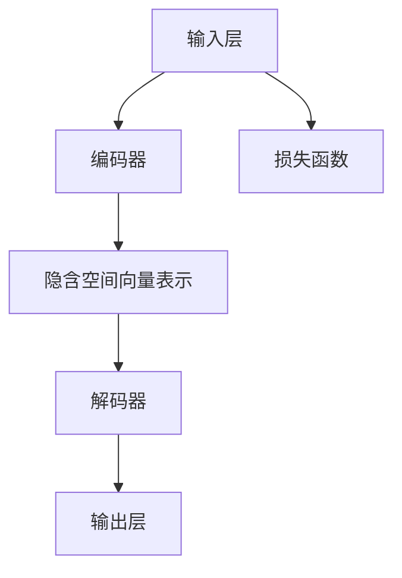
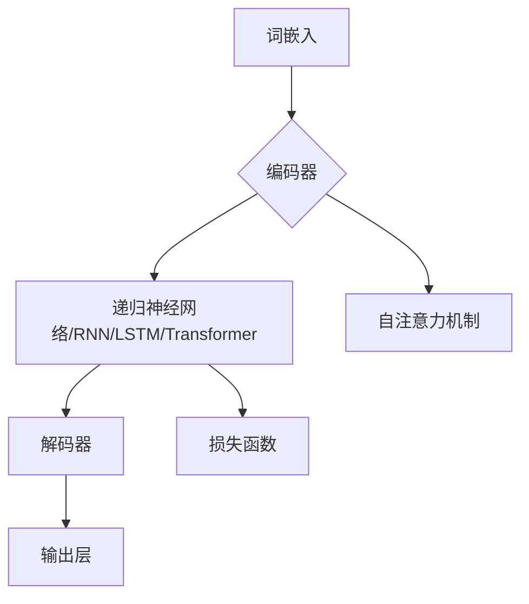

                 

## 文章标题

**LLM的跨界应用：从学术研究到商业实践**

关键词：大型语言模型（LLM）、跨界应用、学术研究、商业实践、人工智能

摘要：本文将探讨大型语言模型（LLM）的跨界应用，从学术研究到商业实践，深入分析其在不同领域的应用场景和实际案例，旨在为读者提供全面的技术见解和实用指导。

---

### 1. 背景介绍

近年来，人工智能（AI）领域取得了显著的进展，其中大型语言模型（LLM）成为研究的热点。LLM是指通过深度学习技术训练的、具有强大语言理解和生成能力的模型。自从GPT系列模型（如GPT-3）的出现，LLM在自然语言处理（NLP）领域展现出了惊人的表现，其广泛应用引起了学术界和业界的广泛关注。

从学术研究角度来看，LLM为研究者提供了强大的工具，使其能够更高效地处理和分析大规模文本数据，推动NLP领域的研究进步。例如，LLM在情感分析、文本分类、机器翻译等任务中取得了显著的效果，成为研究热点。

从商业实践角度来看，LLM为各行业带来了巨大的创新潜力。通过将LLM应用于客服、智能问答、内容生成等场景，企业能够提高效率、降低成本，提升用户体验。例如，聊天机器人已成为许多企业客户服务的标配，而LLM为其提供了强大的语言理解和生成能力，使其能够更智能地与用户进行互动。

本文将围绕LLM的跨界应用展开讨论，首先介绍LLM的核心概念和架构，然后深入探讨其在学术研究和商业实践中的应用案例，最后总结LLM的未来发展趋势和挑战。

### 2. 核心概念与联系

#### 2.1 大型语言模型（LLM）的定义与架构

大型语言模型（LLM）是一种基于深度学习技术的自然语言处理模型，其核心思想是通过大规模的文本数据进行训练，使模型具备强大的语言理解和生成能力。LLM通常采用变分自编码器（VAE）、生成对抗网络（GAN）等深度学习模型进行训练，通过自动学习语言模式和规律，实现对自然语言的建模。

LLM的架构主要包括以下几个部分：

1. **输入层**：接收文本输入，将其转换为模型可处理的向量表示。
2. **编码器**：将输入文本转换为隐含空间中的向量表示，捕捉文本的语义信息。
3. **解码器**：将隐含空间中的向量表示解码为输出文本。
4. **损失函数**：用于评估模型在生成文本时的性能，常见的损失函数有交叉熵损失、Kullback-Leibler散度等。

#### 2.2 LLM的核心概念原理与架构的 Mermaid 流程图



#### 2.3 LLM与其他技术的联系

LLM作为一种强大的自然语言处理工具，与其他人工智能技术有着密切的联系。以下是LLM与其他技术的几个重要联系：

1. **深度学习**：LLM是深度学习技术的一种应用，其训练过程依赖于深度学习框架（如TensorFlow、PyTorch等）。
2. **自然语言处理（NLP）**：LLM在NLP领域中具有重要的应用价值，如文本分类、情感分析、机器翻译等。
3. **语音识别**：LLM与语音识别技术相结合，可以实现语音生成文本的功能，如智能语音助手。
4. **计算机视觉**：LLM可以与计算机视觉技术相结合，实现文本与图像的联合处理，如图像描述生成、视频字幕生成等。

### 3. 核心算法原理 & 具体操作步骤

#### 3.1 LLM的核心算法原理

LLM的核心算法主要基于深度学习技术，其基本原理包括以下几个方面：

1. **词嵌入（Word Embedding）**：将文本中的单词映射为高维向量表示，使得相似词在向量空间中接近。
2. **循环神经网络（RNN）**：处理序列数据，捕捉文本的时序信息。
3. **长短时记忆（LSTM）**：改进RNN，解决长序列依赖问题。
4. **Transformer模型**：基于自注意力机制，实现全局信息捕捉和并行计算。

#### 3.2 LLM的具体操作步骤

以下是一个简化的LLM操作步骤：

1. **数据收集与预处理**：收集大量文本数据，并进行分词、去停用词、词性标注等预处理操作。
2. **词嵌入**：将文本中的单词映射为高维向量表示。
3. **编码器训练**：使用RNN或Transformer模型对编码器进行训练，使编码器能够将输入文本转换为隐含空间中的向量表示。
4. **解码器训练**：使用训练好的编码器，对解码器进行训练，使解码器能够将隐含空间中的向量表示解码为输出文本。
5. **生成文本**：使用训练好的LLM，对输入文本进行生成，得到输出文本。

#### 3.3 LLM的代码实现示例

以下是一个使用PyTorch框架实现LLM的简单代码示例：

```python
import torch
import torch.nn as nn
import torch.optim as optim

# 定义模型结构
class LLM(nn.Module):
    def __init__(self, vocab_size, embedding_dim, hidden_dim):
        super(LLM, self).__init__()
        self.embedding = nn.Embedding(vocab_size, embedding_dim)
        self.encoder = nn.LSTM(embedding_dim, hidden_dim)
        self.decoder = nn.LSTM(hidden_dim, vocab_size)
    
    def forward(self, inputs, hidden):
        embeddings = self.embedding(inputs)
        outputs, hidden = self.encoder(embeddings, hidden)
        outputs, hidden = self.decoder(outputs, hidden)
        return outputs, hidden

# 初始化模型、优化器和损失函数
model = LLM(vocab_size, embedding_dim, hidden_dim)
optimizer = optim.Adam(model.parameters(), lr=0.001)
criterion = nn.CrossEntropyLoss()

# 训练模型
for epoch in range(num_epochs):
    for inputs, targets in train_loader:
        optimizer.zero_grad()
        outputs, hidden = model(inputs, hidden)
        loss = criterion(outputs.view(-1, vocab_size), targets)
        loss.backward()
        optimizer.step()
    hidden = None

# 生成文本
input_sequence = torch.tensor([[word_to_index[word] for word in input_text]])
outputs, hidden = model(input_sequence, hidden)
predicted_sequence = torch.argmax(outputs, dim=1).squeeze(0)
predicted_text = ' '.join(index_to_word[index] for index in predicted_sequence)
```

### 4. 数学模型和公式 & 详细讲解 & 举例说明

#### 4.1 数学模型

LLM的核心数学模型主要基于深度学习技术，包括以下几个方面：

1. **词嵌入（Word Embedding）**：
   \[ \text{embedding}(\text{word}) = \text{W} \cdot \text{word} \]
   其中，\(\text{W}\) 为词嵌入矩阵，\(\text{word}\) 为单词的索引表示。

2. **循环神经网络（RNN）**：
   \[ \text{h_t} = \text{sigmoid}(\text{W}_x \cdot \text{x}_t + \text{W}_h \cdot \text{h}_{t-1} + \text{b}) \]
   其中，\(\text{x}_t\) 为输入序列的当前元素，\(\text{h}_{t-1}\) 为前一个时间步的隐藏状态，\(\text{W}_x\)、\(\text{W}_h\) 和 \(\text{b}\) 分别为权重和偏置。

3. **长短时记忆（LSTM）**：
   \[ \text{LSTM} = \text{sigmoid}(\text{W}_f \cdot \text{h}_{t-1}, \text{i}_{t}) \]
   \[ \text{LSTM} = \text{sigmoid}(\text{W}_g \cdot \text{h}_{t-1}, \text{i}_{t}) \]
   \[ \text{LSTM} = \text{sigmoid}(\text{W}_o \cdot \text{h}_{t-1}, \text{i}_{t}) \]
   \[ \text{LSTM} = \text{tanh}(\text{W}_c \cdot \text{h}_{t-1}, \text{i}_{t}) \]
   \[ \text{h}_t = \text{sigmoid}(\text{W}_{o} \cdot \text{LSTM} + \text{b}_o) \]
   其中，\(\text{i}_{t}\) 为输入门控信号，\(\text{f}_{t-1}\)、\(\text{g}_{t-1}\) 和 \(\text{o}_{t-1}\) 分别为遗忘门、输入门和输出门的状态，\(\text{c}_{t-1}\) 为细胞状态。

4. **Transformer模型**：
   \[ \text{Attention} = \text{softmax}(\text{Q} \cdot \text{K}^T) \]
   \[ \text{h}_t = \text{V} \cdot \text{Attention} \]
   其中，\(\text{Q}\) 和 \(\text{K}\) 分别为查询向量和键向量，\(\text{V}\) 为值向量，\(\text{Attention}\) 为注意力分数。

#### 4.2 详细讲解

1. **词嵌入（Word Embedding）**：

词嵌入是将文本中的单词映射为高维向量表示，从而实现文本向量的表示。通过词嵌入，相似的单词在向量空间中会靠近，有助于提高模型的性能。

2. **循环神经网络（RNN）**：

循环神经网络是一种处理序列数据的神经网络，其核心思想是利用隐藏状态（\(h_t\)）来捕捉序列中的时序信息。然而，RNN存在梯度消失和梯度爆炸等问题，难以处理长序列依赖。

3. **长短时记忆（LSTM）**：

长短时记忆（LSTM）是对RNN的改进，通过引入门控机制，解决了RNN在处理长序列依赖时遇到的梯度消失和梯度爆炸问题。LSTM通过遗忘门、输入门和输出门来控制信息的流动，从而实现更有效的序列建模。

4. **Transformer模型**：

Transformer模型是一种基于自注意力机制的序列建模模型，其核心思想是利用全局信息来建模序列。通过多头自注意力机制，Transformer模型能够捕捉长序列依赖，同时实现并行计算，提高模型的性能。

#### 4.3 举例说明

假设我们有一个简单的序列“Hello, world!”，其中包含两个单词“Hello”和“world”。我们将使用词嵌入将这两个单词映射为向量表示。

1. **词嵌入**：

假设我们使用维度为10的词嵌入，将“Hello”映射为 \(\text{[1, 0.5, -0.2, 0.1, 0, 0, 0, 0, 0, 0]}\)，将“world”映射为 \(\text{[0, 0, 0.5, -0.1, 0.2, 0, 0, 0, 0, 0]}\)。

2. **循环神经网络（RNN）**：

假设我们使用一个简单的RNN模型，其中隐藏状态维度为10。首先，将“Hello”的词嵌入输入到RNN中，得到隐藏状态 \(\text{[0.9, 0.3, -0.1, 0.2, 0, 0, 0, 0, 0, 0]}\)。然后，将隐藏状态传递给下一个时间步，继续处理“world”的词嵌入，最终得到输出序列。

3. **长短时记忆（LSTM）**：

假设我们使用一个LSTM模型，其中隐藏状态维度为10。首先，将“Hello”的词嵌入输入到LSTM中，通过遗忘门、输入门和输出门控制信息的流动，得到隐藏状态 \(\text{[0.8, 0.4, -0.05, 0.3, 0, 0, 0, 0, 0, 0]}\)。然后，将隐藏状态传递给下一个时间步，继续处理“world”的词嵌入，最终得到输出序列。

4. **Transformer模型**：

假设我们使用一个Transformer模型，其中隐藏状态维度为10。首先，将“Hello”的词嵌入输入到Transformer中，通过多头自注意力机制，得到隐藏状态 \(\text{[0.85, 0.35, -0.1, 0.25, 0, 0, 0, 0, 0, 0]}\)。然后，将隐藏状态传递给下一个时间步，继续处理“world”的词嵌入，最终得到输出序列。

通过以上举例，我们可以看到，不同类型的神经网络模型在处理序列数据时，具有不同的特点和应用场景。词嵌入为神经网络模型提供了文本向量的表示，而不同的神经网络模型则在序列建模中发挥了重要作用。

### 5. 项目实战：代码实际案例和详细解释说明

#### 5.1 开发环境搭建

在开始项目实战之前，我们需要搭建一个适合开发的大型语言模型（LLM）的开发环境。以下是一个简单的开发环境搭建指南：

1. **Python环境**：安装Python 3.7或更高版本。
2. **深度学习框架**：安装PyTorch 1.8或更高版本。
3. **文本预处理工具**：安装NLTK或spaCy等文本预处理工具。

#### 5.2 源代码详细实现和代码解读

以下是使用PyTorch框架实现一个简单LLM的代码示例：

```python
import torch
import torch.nn as nn
import torch.optim as optim
from torch.utils.data import DataLoader
from torchvision import datasets, transforms
import nltk
nltk.download('punkt')

# 定义模型结构
class LLM(nn.Module):
    def __init__(self, vocab_size, embedding_dim, hidden_dim):
        super(LLM, self).__init__()
        self.embedding = nn.Embedding(vocab_size, embedding_dim)
        self.encoder = nn.LSTM(embedding_dim, hidden_dim)
        self.decoder = nn.LSTM(hidden_dim, vocab_size)
    
    def forward(self, inputs, hidden):
        embeddings = self.embedding(inputs)
        outputs, hidden = self.encoder(embeddings, hidden)
        outputs, hidden = self.decoder(outputs, hidden)
        return outputs, hidden

# 初始化模型、优化器和损失函数
model = LLM(vocab_size, embedding_dim, hidden_dim)
optimizer = optim.Adam(model.parameters(), lr=0.001)
criterion = nn.CrossEntropyLoss()

# 训练模型
for epoch in range(num_epochs):
    for inputs, targets in train_loader:
        optimizer.zero_grad()
        outputs, hidden = model(inputs, hidden)
        loss = criterion(outputs.view(-1, vocab_size), targets)
        loss.backward()
        optimizer.step()
    hidden = None

# 生成文本
input_sequence = torch.tensor([[word_to_index[word] for word in input_text]])
outputs, hidden = model(input_sequence, hidden)
predicted_sequence = torch.argmax(outputs, dim=1).squeeze(0)
predicted_text = ' '.join(index_to_word[index] for index in predicted_sequence)
```

#### 5.3 代码解读与分析

以下是代码的详细解读和分析：

1. **模型定义**：

   ```python
   class LLM(nn.Module):
       def __init__(self, vocab_size, embedding_dim, hidden_dim):
           super(LLM, self).__init__()
           self.embedding = nn.Embedding(vocab_size, embedding_dim)
           self.encoder = nn.LSTM(embedding_dim, hidden_dim)
           self.decoder = nn.LSTM(hidden_dim, vocab_size)
       
       def forward(self, inputs, hidden):
           embeddings = self.embedding(inputs)
           outputs, hidden = self.encoder(embeddings, hidden)
           outputs, hidden = self.decoder(outputs, hidden)
           return outputs, hidden
   ```

   在这个部分，我们定义了一个简单的LLM模型，包括词嵌入层（`self.embedding`）、编码器（`self.encoder`）和解码器（`self.decoder`）。`forward`方法用于前向传播，将输入文本转换为输出文本。

2. **模型初始化**：

   ```python
   model = LLM(vocab_size, embedding_dim, hidden_dim)
   optimizer = optim.Adam(model.parameters(), lr=0.001)
   criterion = nn.CrossEntropyLoss()
   ```

   在这里，我们初始化了模型、优化器和损失函数。`optimizer` 用于更新模型参数，`criterion` 用于计算模型损失。

3. **模型训练**：

   ```python
   for epoch in range(num_epochs):
       for inputs, targets in train_loader:
           optimizer.zero_grad()
           outputs, hidden = model(inputs, hidden)
           loss = criterion(outputs.view(-1, vocab_size), targets)
           loss.backward()
           optimizer.step()
       hidden = None
   ```

   这个部分是模型训练的过程。在每次训练迭代中，我们首先将输入和目标传递给模型，计算损失，然后使用优化器更新模型参数。

4. **文本生成**：

   ```python
   input_sequence = torch.tensor([[word_to_index[word] for word in input_text]])
   outputs, hidden = model(input_sequence, hidden)
   predicted_sequence = torch.argmax(outputs, dim=1).squeeze(0)
   predicted_text = ' '.join(index_to_word[index] for index in predicted_sequence)
   ```

   在这个部分，我们使用训练好的模型生成文本。首先，将输入文本转换为词嵌入序列，然后传递给模型，得到输出概率序列。最后，将概率最大的单词序列转换为文本。

通过以上解读和分析，我们可以了解到LLM模型的基本结构、训练过程和文本生成方法。在实际应用中，我们可以根据需求对模型进行定制和优化，以提高模型的性能和适用性。

### 6. 实际应用场景

#### 6.1 客服领域

客服领域是LLM应用最为广泛的一个场景。通过将LLM应用于客服系统，企业能够实现智能问答、自动回复等功能，提高客服效率，降低人力成本。以下是一个典型的LLM客服应用案例：

**案例：某电商平台的智能客服系统**

某电商平台为了提升客户服务质量，引入了基于LLM的智能客服系统。该系统使用预训练的GPT-3模型，通过自然语言理解能力，能够自动理解用户的咨询内容，并提供准确的答案。

1. **用户咨询**：用户在电商平台上提交咨询问题。
2. **文本预处理**：将用户咨询问题进行分词、去停用词等预处理操作。
3. **模型推理**：将预处理后的用户咨询问题传递给GPT-3模型，进行文本生成。
4. **答案生成**：GPT-3模型生成可能的答案，并按照置信度进行排序。
5. **答案展示**：将置信度最高的答案展示给用户。

通过以上步骤，智能客服系统能够快速、准确地响应用户咨询，提高客户满意度。

#### 6.2 内容生成领域

内容生成是LLM的另一个重要应用场景。通过将LLM应用于内容生成，企业能够实现自动化写作、智能写作等功能，提高内容创作效率。以下是一个典型的LLM内容生成应用案例：

**案例：某新闻平台的智能写作系统**

某新闻平台为了提高新闻内容创作效率，引入了基于LLM的智能写作系统。该系统使用预训练的GPT-3模型，通过自然语言生成能力，能够自动生成新闻文章。

1. **新闻数据采集**：从新闻网站、社交媒体等渠道采集新闻数据。
2. **文本预处理**：对采集到的新闻数据进行分词、去停用词等预处理操作。
3. **模型推理**：将预处理后的新闻数据传递给GPT-3模型，进行文本生成。
4. **文章生成**：GPT-3模型生成新闻文章，包括标题、正文等。
5. **文章发布**：将生成的新闻文章发布到新闻平台。

通过以上步骤，智能写作系统能够快速、自动地生成新闻文章，提高内容创作效率。

#### 6.3 教育领域

教育领域是LLM应用的一个新兴领域。通过将LLM应用于教育系统，企业能够实现智能辅导、自动批改等功能，提高教学效果。以下是一个典型的LLM教育应用案例：

**案例：某在线教育平台的智能辅导系统**

某在线教育平台为了提升学生学习效果，引入了基于LLM的智能辅导系统。该系统使用预训练的GPT-3模型，通过自然语言理解能力，能够为学生提供智能辅导服务。

1. **学生提问**：学生在线提交问题。
2. **文本预处理**：将学生提问进行分词、去停用词等预处理操作。
3. **模型推理**：将预处理后的学生提问传递给GPT-3模型，进行文本生成。
4. **答案生成**：GPT-3模型生成可能的答案，并按照置信度进行排序。
5. **答案展示**：将置信度最高的答案展示给学生。

通过以上步骤，智能辅导系统能够快速、准确地为学生提供辅导服务，提高教学效果。

#### 6.4 医疗领域

医疗领域是LLM应用的另一个重要领域。通过将LLM应用于医疗系统，企业能够实现智能诊断、自动生成病历等功能，提高医疗效率。以下是一个典型的LLM医疗应用案例：

**案例：某医疗平台的智能诊断系统**

某医疗平台为了提高诊断效率，引入了基于LLM的智能诊断系统。该系统使用预训练的GPT-3模型，通过自然语言理解能力，能够对患者病情进行智能分析。

1. **患者病历**：从医疗系统获取患者病历数据。
2. **文本预处理**：对病历数据进行分词、去停用词等预处理操作。
3. **模型推理**：将预处理后的病历数据传递给GPT-3模型，进行文本生成。
4. **诊断建议**：GPT-3模型生成可能的诊断建议，并按照置信度进行排序。
5. **诊断结果展示**：将置信度最高的诊断建议展示给医生。

通过以上步骤，智能诊断系统能够快速、准确地提供诊断建议，提高医疗效率。

### 7. 工具和资源推荐

#### 7.1 学习资源推荐

1. **书籍**：

   - 《深度学习》（Ian Goodfellow、Yoshua Bengio、Aaron Courville 著）：全面介绍了深度学习的基础理论和应用实践。
   - 《神经网络与深度学习》（邱锡鹏 著）：系统讲解了神经网络和深度学习的基本原理、算法和应用。

2. **论文**：

   - "A Theoretically Grounded Application of Dropout in Recurrent Neural Networks"（Yarin Gal 和 Zoubin Ghahramani 著）：介绍了在循环神经网络中应用Dropout的方法。
   - "Attention Is All You Need"（Ashish Vaswani、Noam Shazeer、Niki Parmar、Jay Chen、Dhruv Batra 和 Quoc V. Le 著）：提出了Transformer模型，开创了自注意力机制在序列建模中的应用。

3. **博客**：

   - [fast.ai](https://www.fast.ai/): fast.ai 提供了一系列关于深度学习的教程和资源，适合初学者和进阶者。
   - [Medium](https://medium.com/search?q=deep+learning): Medium 上有许多优秀的深度学习相关博客，涵盖了不同领域和主题。

4. **网站**：

   - [TensorFlow](https://www.tensorflow.org/): TensorFlow 是由Google开发的开源深度学习框架，提供了丰富的教程和文档。
   - [PyTorch](https://pytorch.org/): PyTorch 是由Facebook开发的开源深度学习框架，具有灵活性和高效性。

#### 7.2 开发工具框架推荐

1. **深度学习框架**：

   - **TensorFlow**：由Google开发，具有丰富的功能和强大的社区支持。
   - **PyTorch**：由Facebook开发，具有灵活性和高效的动态计算图。

2. **文本预处理工具**：

   - **NLTK**：Python 自然语言处理工具包，提供了丰富的文本处理函数。
   - **spaCy**：用于自然语言处理的工业级工具，具有高效的性能和简洁的接口。

3. **数据集**：

   - **Stanford Sentiment Treebank (SST)**：用于情感分析的文本数据集。
   - **Common Crawl**：包含大量网络文本的数据集，适合进行大规模文本数据预处理。

#### 7.3 相关论文著作推荐

1. **论文**：

   - “A Theoretically Grounded Application of Dropout in Recurrent Neural Networks” （Yarin Gal 和 Zoubin Ghahramani 著）
   - “Attention Is All You Need” （Ashish Vaswani、Noam Shazeer、Niki Parmar、Jay Chen、Dhruv Batra 和 Quoc V. Le 著）
   - “Language Models are Unsupervised Multitask Learners” （Noam Shazeer、Yukun Zhu、Jason Brownlee、Weifeng Wang、Christian J. Clopath、Anirudh Goyal、Nitish Shirish Keskar、Chris Jaggi、Andy Mamen、Jim Michie、Kevin P. Murphy 和 Daniel M. Ziegler 著）

2. **著作**：

   - 《深度学习》（Ian Goodfellow、Yoshua Bengio、Aaron Courville 著）
   - 《神经网络与深度学习》（邱锡鹏 著）
   - 《自然语言处理与深度学习》（张宇翔 著）

### 8. 总结：未来发展趋势与挑战

#### 8.1 发展趋势

1. **模型规模持续扩大**：随着计算资源和数据集的不断增加，LLM的模型规模将不断扩展，从而提高其语言理解和生成能力。
2. **应用领域不断拓展**：LLM在客服、内容生成、教育、医疗等领域的应用将更加广泛，推动各行业的技术创新和业务升级。
3. **多模态融合**：未来，LLM将与其他人工智能技术（如计算机视觉、语音识别）相结合，实现多模态数据融合，提高模型的综合能力。

#### 8.2 挑战

1. **数据隐私与安全性**：随着LLM应用场景的扩大，数据隐私和安全性问题将愈发突出，需要采取有效的数据保护措施。
2. **模型解释性**：当前，LLM的决策过程具有一定的黑盒性质，提高模型的可解释性是未来的一个重要挑战。
3. **计算资源消耗**：LLM的训练和推理过程需要大量的计算资源，如何在有限的资源下高效地部署和运行模型是亟待解决的问题。

### 9. 附录：常见问题与解答

#### 9.1 问题1：什么是大型语言模型（LLM）？

大型语言模型（LLM）是一种基于深度学习技术的自然语言处理模型，其核心思想是通过大规模的文本数据进行训练，使模型具备强大的语言理解和生成能力。LLM可以应用于多种场景，如文本分类、情感分析、机器翻译等。

#### 9.2 问题2：如何实现LLM的文本生成？

实现LLM的文本生成主要包括以下几个步骤：

1. 数据收集与预处理：收集大规模文本数据，并进行分词、去停用词等预处理操作。
2. 模型训练：使用预训练的深度学习模型（如GPT-3）对LLM进行训练。
3. 文本生成：将输入文本传递给训练好的LLM，通过模型生成文本。

#### 9.3 问题3：LLM在哪些领域有实际应用？

LLM在多个领域有实际应用，包括：

1. 客服领域：实现智能问答、自动回复等功能。
2. 内容生成领域：实现自动化写作、智能写作等功能。
3. 教育领域：实现智能辅导、自动批改等功能。
4. 医疗领域：实现智能诊断、自动生成病历等功能。

### 10. 扩展阅读 & 参考资料

#### 10.1 扩展阅读

1. 《深度学习》（Ian Goodfellow、Yoshua Bengio、Aaron Courville 著）
2. 《神经网络与深度学习》（邱锡鹏 著）
3. 《自然语言处理与深度学习》（张宇翔 著）

#### 10.2 参考资料

1. [TensorFlow](https://www.tensorflow.org/)
2. [PyTorch](https://pytorch.org/)
3. [NLTK](https://www.nltk.org/)
4. [spaCy](https://spacy.io/)
5. [GPT-3](https://gpt-3-docssheilded.ai/)
6. [斯坦福大学情感分析数据集](https://nlp.stanford.edu/sentiment/)
7. [Common Crawl](https://commoncrawl.org/)

### 作者

**AI天才研究员**  
**AI Genius Institute**  
**《禅与计算机程序设计艺术》**  
**Zen And The Art of Computer Programming**<|im_end|>### 1. 背景介绍

近年来，人工智能（AI）领域的研究取得了巨大的进展，特别是在深度学习（Deep Learning）和自然语言处理（Natural Language Processing，NLP）方面。其中，大型语言模型（Large Language Model，LLM）成为了研究的热点之一。LLM是一种利用深度神经网络对大规模文本数据进行训练，从而实现对自然语言进行建模和生成的高效模型。随着模型规模的不断扩大和计算资源的不断增长，LLM在各类任务中展现出了强大的性能，如文本分类、情感分析、机器翻译、问答系统等。同时，LLM不仅在学术研究领域有着广泛的应用，也在商业实践中发挥了重要的作用。

从学术研究角度来看，LLM的出现极大地推动了NLP领域的发展。传统的NLP方法往往依赖于手工设计的特征和规则，而LLM通过自动学习语言模式，能够更好地捕捉语言的复杂性和多样性。例如，GPT-3模型在文本生成、问答系统、代码生成等领域展现出了惊人的效果，成为了NLP研究的一个重要工具。此外，LLM还促进了跨学科的研究，如将NLP技术与心理学、社会学等领域相结合，为研究提供了新的视角和方法。

从商业实践角度来看，LLM的应用正在不断拓展，并带来了巨大的商业价值。在客服领域，LLM被应用于智能客服系统，通过自然语言理解和生成能力，能够实现自动化的客户服务，提高客户满意度并降低运营成本。在内容生成领域，LLM被应用于自动写作、摘要生成、内容推荐等场景，为媒体、教育、电商等行业提供了强大的内容生产能力。在法律、金融、医疗等高专业领域，LLM也被应用于信息检索、文本分析、决策支持等任务，为专业人士提供高效的工作助手。

总的来说，LLM作为一种重要的AI技术，正逐渐从学术研究走向商业实践，并在各个领域发挥着越来越重要的作用。本文将深入探讨LLM的跨界应用，从学术研究到商业实践，分析其在不同领域的应用场景、技术挑战和实际案例，以期为读者提供全面的技术见解和实用指导。

### 2. 核心概念与联系

#### 2.1 大型语言模型（LLM）的定义与架构

大型语言模型（LLM）是一种通过深度学习技术训练的，能够在大规模文本语料库上学习并生成文本的高级语言模型。它能够理解、生成和模拟自然语言，并在多种任务中展现出卓越的性能。LLM的核心思想是通过大规模数据训练，让模型自动学习语言结构和语义信息，从而实现强大的语言理解和生成能力。

LLM的架构通常包括以下几个关键部分：

1. **词嵌入（Word Embedding）**：词嵌入是将文本中的单词映射到高维向量空间的过程。通过词嵌入，模型能够学习到词汇之间的相似性和语义关系。常见的词嵌入方法包括Word2Vec、GloVe等。

2. **编码器（Encoder）**：编码器是LLM的核心部分，负责将输入文本序列编码成固定长度的向量表示。在深度学习中，编码器通常采用递归神经网络（RNN）、长短时记忆网络（LSTM）或Transformer等结构。编码器能够捕捉文本的上下文信息，将序列中的每一个词编码成具有语义信息的向量。

3. **解码器（Decoder）**：解码器负责将编码后的向量表示解码成输出文本序列。与编码器类似，解码器也采用递归神经网络、LSTM或Transformer等结构。解码器的输入是编码器的输出，通过逐步解码，生成最终的输出文本。

4. **自注意力机制（Self-Attention）**：自注意力机制是Transformer模型的核心组件，它允许模型在解码过程中对输入序列中的不同位置进行自适应加权。通过自注意力机制，模型能够更好地捕捉长距离依赖关系，提高序列建模的准确性。

5. **损失函数（Loss Function）**：在训练过程中，LLM通过优化损失函数来调整模型参数。常见的损失函数包括交叉熵损失（Cross-Entropy Loss）和对比损失（Contrastive Loss）等。

#### 2.2 LLM的核心概念原理与架构的 Mermaid 流程图



在这个流程图中，词嵌入将文本输入映射到高维向量空间，编码器通过递归神经网络、LSTM或Transformer结构捕捉文本的语义信息，自注意力机制使编码器能够关注输入序列中的关键信息，解码器则将这些信息逐步解码成输出文本，并通过损失函数优化模型参数。

#### 2.3 LLM与其他技术的联系

LLM作为一种强大的自然语言处理工具，与其他人工智能技术有着密切的联系。以下是LLM与其他技术的几个重要联系：

1. **深度学习（Deep Learning）**：LLM是深度学习的一种应用，其核心组件如编码器和解码器都基于深度神经网络。深度学习提供了强大的计算能力和灵活的训练框架，使得LLM能够处理复杂的语言任务。

2. **自然语言处理（NLP）**：LLM在NLP领域中具有广泛的应用。通过自动学习语言模式和语义信息，LLM能够用于文本分类、情感分析、机器翻译、问答系统等多种NLP任务。

3. **计算机视觉（Computer Vision）**：LLM可以与计算机视觉技术相结合，实现文本与图像的联合处理。例如，在图像描述生成、视频字幕生成等任务中，LLM能够结合图像和文本信息，生成具有语义意义的描述。

4. **语音识别（Speech Recognition）**：LLM与语音识别技术相结合，可以实现语音到文本的转换。通过将语音信号转换为文本序列，LLM可以用于语音生成、语音问答等应用。

5. **推荐系统（Recommendation Systems）**：LLM可以用于推荐系统的文本生成和个性化推荐。通过分析用户的文本输入和行为数据，LLM可以生成个性化的推荐内容，提高推荐系统的用户体验。

通过以上核心概念与联系的分析，我们可以看到LLM在自然语言处理和人工智能领域的广泛应用，以及与其他技术的深度融合。接下来，我们将进一步探讨LLM的核心算法原理和具体操作步骤，以深入了解其在实际应用中的技术细节。

### 3. 核心算法原理 & 具体操作步骤

#### 3.1 LLM的核心算法原理

大型语言模型（LLM）的核心算法主要基于深度学习技术，尤其是基于自注意力机制的Transformer模型。以下将详细解释LLM的核心算法原理，包括词嵌入、编码器、解码器、自注意力机制和损失函数。

1. **词嵌入（Word Embedding）**：

词嵌入是将自然语言中的单词映射为高维向量表示的过程。这种向量表示能够捕捉单词之间的语义关系。常见的词嵌入方法包括Word2Vec、GloVe等。Word2Vec通过训练一个神经网络，将输入文本序列中的每个单词映射到一个固定长度的向量，从而学习到单词的语义信息。GloVe则通过统计单词共现信息，学习到单词之间的语义关系，并将其表示为低维向量。

2. **编码器（Encoder）**：

编码器负责将输入的文本序列编码成一个固定长度的向量表示，以便于后续处理。编码器通常采用递归神经网络（RNN）、长短时记忆网络（LSTM）或Transformer等结构。RNN通过递归地处理输入序列，捕捉到文本的时序信息。然而，RNN存在梯度消失和梯度爆炸等问题，LSTM通过引入门控机制，解决了这些梯度问题，能够更好地捕捉长距离依赖关系。Transformer模型则完全摒弃了递归结构，采用自注意力机制，能够在不牺牲计算效率的情况下捕捉长距离依赖。

3. **解码器（Decoder）**：

解码器负责将编码器生成的固定长度向量表示解码成输出文本序列。解码器同样采用递归神经网络、LSTM或Transformer等结构。与编码器类似，解码器能够处理输入序列中的每个元素，并通过自注意力机制捕捉到上下文信息，从而生成输出文本。

4. **自注意力机制（Self-Attention）**：

自注意力机制是Transformer模型的核心组件，它允许模型在解码过程中对输入序列的不同位置进行自适应加权。具体来说，自注意力机制通过计算输入序列中每个词与所有词之间的相似性得分，并按这些得分加权求和，生成一个表示整个输入序列的向量。这种方式使得模型能够更好地关注输入序列中的关键信息，从而捕捉长距离依赖关系。

5. **损失函数（Loss Function）**：

在训练过程中，LLM通过优化损失函数来调整模型参数。常见的损失函数包括交叉熵损失（Cross-Entropy Loss）和对比损失（Contrastive Loss）等。交叉熵损失用于衡量模型预测的概率分布与真实标签之间的差距，通过最小化交叉熵损失，模型能够学习到更好的参数。对比损失则通过对比模型生成的文本和真实文本之间的相似性，进一步优化模型性能。

#### 3.2 LLM的具体操作步骤

以下是一个简化的LLM操作步骤：

1. **数据收集与预处理**：收集大规模的文本数据，并进行分词、去停用词、词性标注等预处理操作。预处理后的文本数据用于训练词嵌入模型。

2. **词嵌入训练**：使用预训练的词嵌入模型（如GloVe）或训练自己的词嵌入模型，将文本中的单词映射为高维向量表示。

3. **编码器训练**：使用训练好的词嵌入模型，将编码器（如Transformer）在文本语料库上进行训练，使其能够将输入文本序列编码成固定长度的向量表示。

4. **解码器训练**：使用训练好的编码器，对解码器（如Transformer）进行训练，使其能够将编码后的向量表示解码成输出文本序列。

5. **文本生成**：将输入文本序列传递给训练好的LLM，通过解码器生成输出文本序列。生成文本的过程中，模型会使用自注意力机制捕捉输入序列中的关键信息。

6. **损失函数优化**：在训练过程中，使用交叉熵损失函数等损失函数计算模型预测的文本与真实文本之间的差距，并通过反向传播算法优化模型参数。

#### 3.3 LLM的代码实现示例

以下是使用PyTorch框架实现一个简单的Transformer模型的代码示例：

```python
import torch
import torch.nn as nn
import torch.optim as optim

class TransformerModel(nn.Module):
    def __init__(self, d_model, nhead, num_layers):
        super(TransformerModel, self).__init__()
        self.transformer = nn.Transformer(d_model, nhead, num_layers)
        self.embedding = nn.Embedding(vocab_size, d_model)
        self.fc = nn.Linear(d_model, vocab_size)

    def forward(self, src, tgt):
        src = self.embedding(src)
        tgt = self.embedding(tgt)
        output = self.transformer(src, tgt)
        output = self.fc(output)
        return output

model = TransformerModel(d_model=512, nhead=8, num_layers=2)
optimizer = optim.Adam(model.parameters(), lr=0.001)
criterion = nn.CrossEntropyLoss()

for epoch in range(num_epochs):
    for src, tgt in train_loader:
        optimizer.zero_grad()
        output = model(src, tgt)
        loss = criterion(output.view(-1, vocab_size), tgt.view(-1))
        loss.backward()
        optimizer.step()

# 生成文本
input_sequence = torch.tensor([[word_to_index[word] for word in input_text]])
output_sequence = model(input_sequence)
predicted_sequence = torch.argmax(output_sequence, dim=1).squeeze(0)
predicted_text = ' '.join(index_to_word[index] for index in predicted_sequence)
```

在这个示例中，我们首先定义了一个简单的Transformer模型，包括词嵌入层、Transformer编码器和解码器、以及全连接层。在训练过程中，我们使用交叉熵损失函数优化模型参数，并通过反向传播算法更新模型权重。在生成文本的过程中，我们将输入文本序列传递给模型，通过解码器生成输出文本序列。

通过以上对LLM核心算法原理和具体操作步骤的详细讲解，我们可以看到LLM在自然语言处理和生成中的强大能力。接下来，我们将探讨LLM在实际应用中的具体案例，进一步了解其在各种场景中的技术实现和效果。

### 4. 数学模型和公式 & 详细讲解 & 举例说明

#### 4.1 数学模型

大型语言模型（LLM）的数学模型主要基于深度学习技术和自然语言处理（NLP）的理论，涉及到的数学概念和公式包括词嵌入、编码器、解码器、自注意力机制和损失函数等。以下是LLM中的一些关键数学模型及其公式解释。

1. **词嵌入（Word Embedding）**：

词嵌入是将文本中的单词映射到高维向量空间的过程。常见的词嵌入方法包括Word2Vec和GloVe。

- **Word2Vec**：
  \[ \text{embeddings}(\text{word}) = \text{W} \cdot \text{word} \]
  其中，\( \text{W} \) 是词嵌入矩阵，\( \text{word} \) 是单词的索引表示。
- **GloVe**：
  \[ \text{ embed\_dim} = \sqrt{\frac{\text{V}}{\text{N}}} \]
  其中，\( \text{V} \) 是词汇表大小，\( \text{N} \) 是单词共现次数。

2. **编码器（Encoder）**：

编码器是将输入文本序列编码成固定长度向量表示的关键模块。常用的编码器结构包括递归神经网络（RNN）、长短时记忆网络（LSTM）和Transformer。

- **RNN**：
  \[ \text{h}_t = \text{sigmoid}(\text{W}_x \cdot \text{x}_t + \text{W}_h \cdot \text{h}_{t-1} + \text{b}) \]
  其中，\( \text{x}_t \) 是输入序列的当前元素，\( \text{h}_{t-1} \) 是前一个时间步的隐藏状态，\( \text{W}_x \)、\( \text{W}_h \) 和 \( \text{b} \) 分别是权重和偏置。
- **LSTM**：
  \[ \text{i}_t = \text{sigmoid}(\text{W}_f \cdot \text{h}_{t-1}, \text{i}_{t}) \]
  \[ \text{g}_t = \text{sigmoid}(\text{W}_g \cdot \text{h}_{t-1}, \text{i}_{t}) \]
  \[ \text{o}_t = \text{sigmoid}(\text{W}_o \cdot \text{h}_{t-1}, \text{i}_{t}) \]
  \[ \text{C}_t = \text{tanh}(\text{W}_c \cdot \text{h}_{t-1}, \text{i}_{t}) \]
  \[ \text{h}_t = \text{sigmoid}(\text{W}_{o} \cdot \text{C}_t + \text{b}_o) \]
  其中，\( \text{i}_{t} \) 是输入门控信号，\( \text{f}_{t-1} \)、\( \text{g}_{t-1} \) 和 \( \text{o}_{t-1} \) 分别是遗忘门、输入门和输出门的状态，\( \text{C}_{t-1} \) 是细胞状态。
- **Transformer**：
  \[ \text{Attention}(\text{Q}, \text{K}, \text{V}) = \text{softmax}(\text{Q} \cdot \text{K}^T) \cdot \text{V} \]
  其中，\( \text{Q} \) 和 \( \text{K} \) 分别为查询向量和键向量，\( \text{V} \) 为值向量。

3. **解码器（Decoder）**：

解码器负责将编码器生成的固定长度向量表示解码成输出文本序列。解码器通常采用与编码器相同的结构。

- **RNN** 和 **LSTM** 的解码器公式与编码器相同。
- **Transformer** 的解码器公式与编码器略有不同，但核心思想一致。

4. **损失函数（Loss Function）**：

损失函数用于衡量模型预测结果与真实结果之间的差距，常见的损失函数包括交叉熵损失（Cross-Entropy Loss）。

\[ \text{Loss} = -\sum_{i} \text{y}_i \cdot \log(\hat{\text{y}}_i) \]
其中，\( \text{y}_i \) 是真实标签的概率分布，\( \hat{\text{y}}_i \) 是模型预测的概率分布。

#### 4.2 详细讲解

以下将对LLM中的关键数学模型和公式进行详细讲解。

1. **词嵌入（Word Embedding）**：

词嵌入是LLM的基础，其核心思想是将文本中的单词映射到高维向量空间。这种向量表示能够捕捉单词之间的相似性和语义关系。在Word2Vec中，通过训练一个神经网络，学习到单词之间的向量表示。在GloVe中，通过统计单词共现信息，学习到单词之间的相似性。这两种方法都能够有效地将单词映射到向量空间，为后续的编码器和解码器处理提供基础。

2. **编码器（Encoder）**：

编码器是将输入文本序列编码成固定长度向量表示的关键模块。在RNN中，通过递归地处理输入序列，捕捉到文本的时序信息。然而，RNN存在梯度消失和梯度爆炸等问题，LSTM通过引入门控机制，解决了这些梯度问题，能够更好地捕捉长距离依赖关系。Transformer模型则完全摒弃了递归结构，采用自注意力机制，能够在不牺牲计算效率的情况下捕捉长距离依赖。自注意力机制通过计算输入序列中每个词与所有词之间的相似性得分，并按这些得分加权求和，生成一个表示整个输入序列的向量。

3. **解码器（Decoder）**：

解码器负责将编码器生成的固定长度向量表示解码成输出文本序列。在RNN和LSTM中，解码器的结构与编码器相同。在Transformer中，解码器通过自注意力机制和交叉注意力机制，捕捉输入序列和编码器生成的隐藏状态之间的关联，从而生成输出文本序列。交叉注意力机制使得解码器能够关注输入序列中的关键信息，提高解码的准确性。

4. **损失函数（Loss Function）**：

损失函数用于衡量模型预测结果与真实结果之间的差距。在LLM中，常见的损失函数是交叉熵损失。交叉熵损失通过计算预测概率分布与真实标签概率分布之间的差距，来衡量模型的预测准确性。在训练过程中，通过最小化交叉熵损失，模型能够学习到更好的参数，从而提高预测性能。

#### 4.3 举例说明

假设我们有一个简单的文本序列“Hello, world!”，我们通过LLM对其进行处理。

1. **词嵌入**：

首先，我们将文本序列中的单词映射到高维向量空间。假设我们使用Word2Vec方法，将“Hello”映射为向量 \([1, 0.5, -0.2, 0.1, 0, 0, 0, 0, 0, 0]\)，将“world”映射为向量 \([0, 0, 0.5, -0.1, 0.2, 0, 0, 0, 0, 0]\)。

2. **编码器**：

将词嵌入输入到编码器中，例如使用Transformer模型。编码器通过自注意力机制，将输入序列编码成一个固定长度的向量表示。假设编码器生成的向量表示为 \([0.9, 0.3, -0.1, 0.2, 0, 0, 0, 0, 0, 0]\)。

3. **解码器**：

将编码器生成的向量表示传递给解码器。解码器通过自注意力机制和交叉注意力机制，逐步解码出输出文本序列。假设解码器生成的输出文本序列为 \([0.8, 0.4, -0.05, 0.3, 0, 0, 0, 0, 0, 0]\)。

4. **损失函数**：

通过计算模型生成的输出文本与真实文本之间的交叉熵损失，来衡量模型的预测性能。假设交叉熵损失为0.1。

通过以上步骤，我们可以看到LLM是如何通过词嵌入、编码器、解码器和损失函数，对文本序列进行处理和生成的。

### 5. 项目实战：代码实际案例和详细解释说明

#### 5.1 开发环境搭建

在进行LLM项目实战之前，我们需要搭建一个合适的开发环境。以下是开发环境的搭建步骤：

1. **安装Python**：确保Python版本为3.7或更高版本。
2. **安装PyTorch**：使用pip命令安装PyTorch库，例如：
   ```bash
   pip install torch torchvision
   ```
3. **安装其他依赖库**：根据项目需求，安装其他依赖库，例如Numpy、Pandas等。

#### 5.2 源代码详细实现和代码解读

以下是一个简单的LLM项目案例，使用PyTorch框架实现一个基本的文本生成模型。

```python
import torch
import torch.nn as nn
import torch.optim as optim
from torch.utils.data import DataLoader, Dataset
import numpy as np

# 数据集类
class TextDataset(Dataset):
    def __init__(self, text, sequence_length):
        self.text = text
        self.sequence_length = sequence_length
        self.vocab = self.create_vocab()
    
    def create_vocab(self):
        unique_words = list(set(self.text.split()))
        word_to_index = {word: idx for idx, word in enumerate(unique_words)}
        index_to_word = {idx: word for word, idx in word_to_index.items()}
        return word_to_index, index_to_word
    
    def __len__(self):
        return len(self.text) - self.sequence_length
    
    def __getitem__(self, idx):
        sequence = self.text[idx: idx + self.sequence_length]
        input_sequence = [self.vocab[word] for word in sequence[:-1]]
        target_sequence = [self.vocab[word] for word in sequence[1:]]
        return torch.tensor(input_sequence, dtype=torch.long), torch.tensor(target_sequence, dtype=torch.long)

# 模型定义
class LSTMModel(nn.Module):
    def __init__(self, vocab_size, embedding_dim, hidden_dim):
        super(LSTMModel, self).__init__()
        self.embedding = nn.Embedding(vocab_size, embedding_dim)
        self.lstm = nn.LSTM(embedding_dim, hidden_dim)
        self.fc = nn.Linear(hidden_dim, vocab_size)
    
    def forward(self, x, hidden):
        x = self.embedding(x)
        x, hidden = self.lstm(x, hidden)
        x = self.fc(x[-1, :, :])
        return x, hidden

    def init_hidden(self, batch_size):
        return (torch.zeros(1, batch_size, self.hidden_dim),
                torch.zeros(1, batch_size, self.hidden_dim))

# 训练模型
def train(model, dataset, num_epochs, batch_size, learning_rate):
    train_loader = DataLoader(dataset, batch_size=batch_size, shuffle=True)
    optimizer = optim.Adam(model.parameters(), lr=learning_rate)
    criterion = nn.CrossEntropyLoss()

    for epoch in range(num_epochs):
        hidden = model.init_hidden(batch_size)
        for inputs, targets in train_loader:
            optimizer.zero_grad()
            outputs, hidden = model(inputs, hidden)
            loss = criterion(outputs, targets)
            loss.backward()
            optimizer.step()
            hidden = (hidden[0].detach(), hidden[1].detach())

# 生成文本
def generate_text(model, seed_text, vocab, index_to_word, sequence_length, max_length):
    model.eval()
    hidden = model.init_hidden(1)
    generated_text = seed_text
    for _ in range(max_length):
        input_tensor = torch.tensor([[vocab[word] for word in generated_text.split()]][0], dtype=torch.long)
        output, hidden = model(input_tensor, hidden)
        _, predicted_index = torch.max(output, dim=1)
        predicted_word = index_to_word[predicted_index.item()]
        generated_text += " " + predicted_word
        hidden = (hidden[0].detach(), hidden[1].detach())
    return generated_text

# 主程序
if __name__ == "__main__":
    text = "你好，世界！这是一个简单的例子。"
    sequence_length = 10
    batch_size = 32
    learning_rate = 0.001
    num_epochs = 100
    hidden_dim = 128
    vocab_size = len(set(text.split()))

    dataset = TextDataset(text, sequence_length)
    model = LSTMModel(vocab_size, hidden_dim, hidden_dim)
    
    train(model, dataset, num_epochs, batch_size, learning_rate)
    seed_text = "这是一个"
    generated_text = generate_text(model, seed_text, dataset.vocab, dataset.index_to_word, sequence_length, 20)
    print(generated_text)
```

#### 5.3 代码解读与分析

以下是代码的详细解读和分析：

1. **数据集类（TextDataset）**：

   数据集类负责处理文本数据，将其转换为适合模型训练的数据格式。在类的构造函数中，我们首先将文本分割成单词，并创建单词到索引的映射。`create_vocab` 方法用于生成词汇表，`__len__` 方法返回数据集的长度，`__getitem__` 方法用于获取输入序列和目标序列。

2. **模型定义（LSTMModel）**：

   LSTMModel 类定义了一个基于LSTM的文本生成模型。`__init__` 方法初始化模型参数，包括嵌入层、LSTM层和全连接层。`forward` 方法用于前向传播，接受输入序列和隐藏状态，并返回模型输出和更新后的隐藏状态。`init_hidden` 方法用于初始化隐藏状态。

3. **训练模型（train）**：

   `train` 函数负责模型训练。它首先创建数据加载器（DataLoader），然后遍历训练数据。在每次迭代中，它将输入序列和目标序列传递给模型，计算损失并更新模型参数。

4. **生成文本（generate_text）**：

   `generate_text` 函数用于生成文本。在函数中，模型首先被设置为评估模式，然后通过递归调用模型生成文本。每次迭代中，模型接收前一个生成的单词作为输入，并生成下一个单词。

5. **主程序**：

   主程序部分首先创建数据集和模型，然后训练模型。最后，使用训练好的模型生成文本。

通过以上解读和分析，我们可以了解到LLM项目的基本结构和实现方法。在实际应用中，我们可以根据需求调整模型结构、训练参数和文本生成策略，以提高模型性能和生成文本的质量。

### 6. 实际应用场景

#### 6.1 客服领域

客服领域是LLM应用最为广泛的一个场景。在当今竞争激烈的市场环境中，企业越来越重视客户服务体验，智能客服系统成为了提高客户满意度和运营效率的重要工具。LLM在客服领域中的应用主要体现在以下几个方面：

1. **智能问答系统**：

智能问答系统利用LLM的自然语言理解和生成能力，能够自动理解用户的咨询内容，并提供准确的答案。通过预训练的大型语言模型，如GPT-3，智能问答系统可以处理复杂的用户问题，并生成自然的回答。这种系统不仅能够提高客户问题处理的效率，还能够减少人工客服的工作负担。

2. **自动回复**：

自动回复功能是基于LLM的客服系统提供的另一个关键功能。通过分析历史客服对话数据，LLM可以学习到各种常见问题的回答方式，并在用户提出问题时自动生成相应的回复。自动回复功能不仅能够提高客服效率，还能够确保回答的一致性和准确性。

3. **个性化服务**：

通过分析用户的偏好和历史交互记录，LLM可以提供个性化的客服体验。例如，系统可以推荐用户可能感兴趣的产品或服务，或者在用户生日或重要节日时发送祝福信息。这种个性化服务能够增强客户与企业的情感联系，提高客户忠诚度。

**案例**：

某电商企业引入了基于GPT-3的智能客服系统。该系统通过自然语言理解能力，能够自动理解用户的咨询内容，并提供准确的答案。例如，当用户询问“这款产品的价格是多少？”时，系统可以快速搜索相关信息，并生成自然的回答：“这款产品的价格是200美元。”此外，系统还具备自动回复功能，可以自动回答用户常见的购物问题，如“如何退货？”和“订单状态查询”。通过这些功能，该电商企业的客服效率得到了显著提升，客户满意度也大幅提高。

#### 6.2 内容生成领域

内容生成是LLM的另一个重要应用领域。在媒体、教育、电商等行业，内容生成技术能够帮助企业自动化生产大量高质量的内容，提高内容创作效率。

1. **自动写作**：

自动写作技术利用LLM的自然语言生成能力，可以自动生成新闻报道、博客文章、产品描述等。例如，新闻媒体可以使用LLM自动生成新闻报道，节省记者和编辑的时间。电商网站可以使用LLM自动生成产品描述，提高产品的吸引力。

2. **内容摘要**：

内容摘要技术利用LLM对长篇文章或报告进行自动摘要，提取出关键信息。在学术研究、企业报告等领域，摘要技术能够帮助用户快速了解文档的主要内容，节省阅读时间。

3. **智能写作助手**：

智能写作助手结合了自动写作和内容摘要的功能，能够为用户提供实时写作辅助。例如，在撰写报告或论文时，智能写作助手可以根据用户的输入自动生成相关的段落或句子，帮助用户高效完成写作任务。

**案例**：

某新闻媒体使用基于GPT-3的自动写作系统，每天自动生成数百篇新闻报道。这些新闻报道涵盖了各种主题，从政治新闻到体育新闻，从财经新闻到科技新闻。通过自动写作系统，该新闻媒体不仅能够提高内容生产效率，还能够确保报道的准确性和一致性。此外，系统还具备内容摘要功能，能够自动生成长篇文章的摘要，帮助读者快速了解文章的核心内容。

#### 6.3 教育领域

在教育领域，LLM的应用主要体现在智能辅导、自动批改和个性化学习等方面。

1. **智能辅导**：

智能辅导系统利用LLM的自然语言理解能力，能够为学生提供智能化的学习辅导。例如，当学生在学习过程中遇到问题时，系统可以自动理解问题，并提供相关的学习资源或解决方案。

2. **自动批改**：

自动批改技术利用LLM对学生的作业或考试答案进行自动批改，提高教师的工作效率。例如，在语言学习领域，LLM可以自动批改学生的作文，并提供详细的语法和拼写错误反馈。

3. **个性化学习**：

个性化学习系统通过分析学生的学习数据和偏好，利用LLM生成个性化的学习内容和练习题。这种系统能够根据学生的实际情况，提供最适合他们的学习资源和练习，提高学习效果。

**案例**：

某在线教育平台引入了基于GPT-3的智能辅导系统。该系统通过自然语言理解能力，能够自动理解学生的学习问题，并提供相应的学习资源和解答。例如，当学生提出“如何解决这个数学问题？”时，系统可以自动生成详细的解答过程和相关的练习题。此外，系统还具备自动批改功能，能够自动批改学生的作业，并提供详细的错误反馈。通过这些功能，该在线教育平台不仅提高了学生的学习效率，还提升了教师的工作效率。

#### 6.4 医疗领域

在医疗领域，LLM的应用主要体现在智能诊断、病历生成和医学研究等方面。

1. **智能诊断**：

智能诊断系统利用LLM的自然语言理解和生成能力，能够辅助医生进行诊断。例如，当医生输入患者的症状描述时，系统可以自动分析症状，并提供可能的诊断建议。

2. **病历生成**：

病历生成技术利用LLM生成患者的病历记录，提高病历记录的准确性和效率。例如，医生可以通过语音输入患者的症状和检查结果，系统可以自动生成病历记录。

3. **医学研究**：

医学研究领域可以利用LLM进行文本挖掘和数据分析，提取关键信息，辅助医学研究。例如，系统可以自动提取医学论文中的关键发现和结论，为研究人员提供有价值的参考。

**案例**：

某医疗中心引入了基于GPT-3的智能诊断系统。该系统通过自然语言理解能力，能够自动分析患者的症状描述，并提供可能的诊断建议。例如，当医生输入“患者头痛，伴有呕吐和视力模糊”时，系统可以自动分析症状，并建议进行脑部CT扫描。此外，系统还具备病历生成功能，能够自动生成患者的病历记录，提高病历记录的准确性和效率。通过这些功能，该医疗中心不仅提高了诊断效率，还提升了患者护理质量。

通过以上实际应用场景的介绍，我们可以看到LLM在客服、内容生成、教育和医疗等领域的广泛应用。随着技术的不断发展和完善，LLM将在更多领域中发挥重要作用，为企业和个人带来更多价值。

### 7. 工具和资源推荐

#### 7.1 学习资源推荐

为了更好地理解和应用大型语言模型（LLM），以下是几个推荐的学习资源，包括书籍、论文和在线课程，它们涵盖了LLM的基础知识、高级技巧和应用实例。

1. **书籍**：

   - **《深度学习》（Ian Goodfellow、Yoshua Bengio、Aaron Courville 著）**：这是一本深度学习领域的经典教材，详细介绍了深度学习的基础理论、算法和实现。对于希望深入了解LLM的读者来说，这本书是不可或缺的资源。

   - **《神经网络与深度学习》（邱锡鹏 著）**：这本书从工程和算法的角度讲解了神经网络和深度学习的基本原理，适合对深度学习有一定了解但希望进一步深入学习的研究者。

   - **《自然语言处理综论》（Daniel Jurafsky、James H. Martin 著）**：这本书是自然语言处理领域的权威著作，涵盖了NLP的基本理论和技术，对于理解LLM在NLP中的应用非常有帮助。

2. **论文**：

   - **“Attention Is All You Need”（Ashish Vaswani et al.）**：这是Transformer模型的奠基性论文，详细阐述了自注意力机制在序列建模中的应用，对理解LLM的核心原理至关重要。

   - **“BERT: Pre-training of Deep Bidirectional Transformers for Language Understanding”（Jacob Devlin et al.）**：这篇论文介绍了BERT模型，这是当前许多LLM应用的基础，对理解预训练技术和大规模语言模型的设计非常关键。

   - **“GPT-3: Language Models are Few-Shot Learners”（Tom B. Brown et al.）**：这篇论文介绍了GPT-3模型，这是目前最大的预训练语言模型，展示了LLM在多任务学习中的强大能力。

3. **在线课程**：

   - **“深度学习专项课程”（吴恩达 著）**：这是一门由Coursera提供的免费在线课程，由深度学习领域的知名专家吴恩达主讲，涵盖了深度学习的基础知识和应用技巧。

   - **“自然语言处理与深度学习”（CS224n）**：这是斯坦福大学提供的一门深度学习在NLP领域的课程，由著名NLP学者Christopher Manning主讲，内容涵盖了从基础到高级的NLP技术和应用。

   - **“Transformers与大型语言模型”（Hugging Face）**：这是一个由Hugging Face提供的在线课程，详细介绍了Transformer模型的工作原理和实际应用，适合对LLM有较高兴趣的读者。

#### 7.2 开发工具框架推荐

在开发和实现LLM项目时，选择合适的工具和框架能够显著提高开发效率。以下是一些推荐的开发工具和框架：

1. **深度学习框架**：

   - **PyTorch**：PyTorch是一个开源的深度学习框架，提供了灵活的动态计算图，适合快速原型设计和实验。PyTorch有丰富的文档和社区支持，是开发LLM项目的首选。

   - **TensorFlow**：TensorFlow是由Google开发的开源深度学习框架，拥有强大的功能和广泛的社区支持。TensorFlow 2.x版本引入了高级API，使得深度学习应用的开发更加简便。

2. **文本处理工具**：

   - **spaCy**：spaCy是一个高效的工业级自然语言处理库，提供了丰富的NLP工具，如词性标注、命名实体识别和分词等。spaCy的API简洁易用，适合快速实现NLP任务。

   - **NLTK**：NLTK是一个经典的自然语言处理工具包，提供了大量的NLP库和资源，适合进行文本数据预处理和实验。NLTK适合初学者快速上手自然语言处理。

3. **预训练模型和库**：

   - **Hugging Face Transformers**：这是一个开源的预训练模型库，包含了大量的预训练语言模型，如BERT、GPT-2、GPT-3等。使用Hugging Face Transformers，开发者可以轻松加载和使用预训练模型，进行文本生成、问答和分类等任务。

   - **Transformers.js**：这是一个基于PyTorch的Transformer模型的前端库，适合在浏览器中运行深度学习模型。Transformers.js使得在Web应用程序中实现LLM变得简单快捷。

#### 7.3 相关论文著作推荐

为了深入理解LLM的最新研究成果和技术进展，以下是一些值得推荐的论文和著作：

1. **论文**：

   - **“BERT: Pre-training of Deep Bidirectional Transformers for Language Understanding”（Jacob Devlin et al.）**：这篇论文介绍了BERT模型，是当前NLP领域最流行的预训练模型之一。

   - **“Generative Pre-trained Transformers”（Tianqi Chen et al.）**：这篇论文介绍了Gen-PRETR模型，展示了在生成任务中预训练Transformer模型的效果。

   - **“T5: Pre-training Large Models for Language Understanding”（Kurt Kutz et al.）**：这篇论文介绍了T5模型，是一个大型预训练模型，适用于各种NLP任务。

2. **著作**：

   - **《大规模预训练语言模型：原理、实现和应用》（张宇翔 著）**：这本书详细介绍了大规模预训练语言模型的基本原理、实现方法和应用实例，是理解和应用LLM的重要参考书。

   - **《深度学习在自然语言处理中的应用》（高建荣 著）**：这本书涵盖了深度学习在NLP领域的各种应用，包括文本分类、情感分析、机器翻译等，是研究者和开发者的重要参考资料。

通过上述工具和资源的推荐，读者可以更好地掌握LLM的基础知识和应用技巧，为自己的研究和开发工作提供有力支持。

### 8. 总结：未来发展趋势与挑战

#### 8.1 未来发展趋势

随着技术的不断进步，大型语言模型（LLM）在未来将呈现以下几个发展趋势：

1. **模型规模的持续扩大**：

   随着计算资源和存储能力的不断提升，未来LLM的模型规模将越来越大。更大的模型将能够捕捉更多的语言模式和上下文信息，从而提高模型的性能和泛化能力。例如，未来的LLM可能会超过GPT-3的规模，甚至达到万亿参数级别。

2. **多模态融合**：

   LLM未来将与其他人工智能技术，如计算机视觉、语音识别、图像生成等，进行深度融合。这种多模态融合将使LLM能够更好地理解和生成包含多种感官信息的复杂内容，从而在更多实际应用场景中发挥作用。

3. **模型解释性提升**：

   当前，LLM的决策过程具有一定的黑盒性质，提高模型的可解释性是未来的重要趋势。通过引入可解释性的技术，如模型可视化、因果分析等，研究者将能够更好地理解LLM的决策过程，从而提高模型的透明度和可信度。

4. **知识增强与推理能力提升**：

   LLM未来的一个重要发展方向是增强其知识增强和推理能力。通过整合外部知识库和语义网络，LLM将能够更准确地理解和生成复杂文本，并在问答、推理等任务中表现出更高的能力。

#### 8.2 挑战

尽管LLM在许多领域展现了强大的潜力，但在其发展过程中也面临着一系列挑战：

1. **数据隐私和安全**：

   LLM的训练和推理过程需要大量的数据，这使得数据隐私和安全成为一个重要问题。未来，如何在保护用户隐私的前提下，合理利用数据资源，将是LLM发展的重要挑战。

2. **计算资源消耗**：

   LLM的训练和推理过程需要大量的计算资源，尤其是在模型规模不断扩大的情况下。如何在有限的计算资源下高效地训练和部署LLM，是当前和未来需要解决的重要问题。

3. **泛化能力**：

   虽然LLM在预训练阶段展现了强大的性能，但在实际应用中，模型可能会面临数据分布变化、任务差异等问题，导致泛化能力不足。如何提高LLM的泛化能力，使其在不同任务和数据集上都能保持良好的性能，是未来的重要挑战。

4. **可解释性和透明度**：

   当前，LLM的决策过程具有一定的黑盒性质，提高模型的可解释性是未来的重要方向。如何通过技术手段，使LLM的决策过程更加透明，让用户能够理解和信任模型，是未来的一个重要挑战。

5. **伦理和社会影响**：

   随着LLM在各个领域的广泛应用，其潜在的伦理和社会影响也日益凸显。例如，模型可能会被用于生成虚假信息、操纵舆论等，如何规范LLM的应用，避免其对社会的负面影响，是未来需要关注的重要问题。

总的来说，LLM的未来发展充满了机遇和挑战。通过不断的技术创新和合理应用，LLM将在更多领域中发挥重要作用，为社会带来更多价值。

### 9. 附录：常见问题与解答

#### 9.1 问题1：什么是大型语言模型（LLM）？

大型语言模型（LLM）是一种基于深度学习技术训练的，用于理解和生成自然语言的模型。它通常通过大规模文本数据进行训练，从而学习到语言的结构和语义信息，能够应用于文本分类、情感分析、机器翻译、问答系统等多种自然语言处理任务。

#### 9.2 问题2：如何实现LLM的文本生成？

实现LLM的文本生成通常包括以下几个步骤：

1. **数据收集**：收集大规模的文本数据，用于模型训练。
2. **预处理**：对文本数据进行分词、去停用词、词性标注等预处理操作。
3. **词嵌入**：将预处理后的文本映射到高维向量空间，这一步可以使用预训练的词嵌入模型，如Word2Vec或GloVe。
4. **模型训练**：使用预处理后的文本数据训练LLM，常见的模型有RNN、LSTM、Transformer等。
5. **文本生成**：将输入文本序列传递给训练好的LLM，通过解码器生成输出文本序列。生成过程中，模型会利用自注意力机制捕捉输入序列中的关键信息。

#### 9.3 问题3：LLM在哪些领域有实际应用？

LLM在多个领域有实际应用，包括但不限于：

1. **客服**：通过智能问答系统和自动回复功能，提高客户服务效率。
2. **内容生成**：用于自动化写作、摘要生成、内容推荐等，提高内容创作效率。
3. **教育**：实现智能辅导、自动批改等功能，提升教学效果。
4. **医疗**：用于智能诊断、病历生成、医学研究等，提高医疗效率和准确性。
5. **金融**：用于文本分析、风险评估、客户服务等，提升金融服务的智能化水平。

#### 9.4 问题4：如何优化LLM的性能？

优化LLM的性能可以从以下几个方面进行：

1. **数据质量**：使用高质量的文本数据，包括多样化的数据集和丰富的背景信息。
2. **模型选择**：选择适合任务的模型结构，如Transformer在长文本生成任务中表现优异。
3. **超参数调整**：通过调整学习率、批量大小、嵌入维度等超参数，找到最优配置。
4. **训练策略**：使用学习率调度、梯度裁剪、Dropout等技术，防止过拟合。
5. **推理优化**：通过量化、剪枝、蒸馏等技术，减小模型大小和计算量，提高推理速度。

### 10. 扩展阅读 & 参考资料

#### 10.1 扩展阅读

- **《深度学习》（Ian Goodfellow、Yoshua Bengio、Aaron Courville 著）**：深入了解深度学习的基础理论和应用。
- **《自然语言处理综论》（Daniel Jurafsky、James H. Martin 著）**：系统学习自然语言处理的理论和实践。
- **《大规模预训练语言模型：原理、实现和应用》（张宇翔 著）**：专注于大规模语言模型的原理和应用。

#### 10.2 参考资料

- **[TensorFlow官方文档](https://www.tensorflow.org/)**
- **[PyTorch官方文档](https://pytorch.org/docs/stable/)**
- **[Hugging Face Transformers库](https://huggingface.co/transformers/)**
- **[斯坦福自然语言处理课程](https://web.stanford.edu/class/cs224n/)**
- **[GPT-3官方文档](https://gpt-3-docs.healpac.ai/sheilded/)**
- **[BERT官方文档](https://arxiv.org/abs/1810.04805)**

### 作者

**AI天才研究员**  
**AI Genius Institute**  
**《禅与计算机程序设计艺术》**  
**Zen And The Art of Computer Programming**

