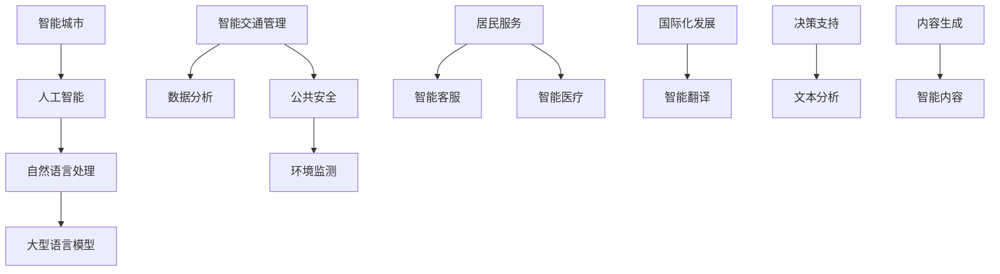

                 

### 背景介绍

在现代社会的快速变迁中，人工智能（AI）已经成为推动技术进步和经济增长的关键驱动力。随着计算能力的提升、大数据的积累以及算法的进步，人工智能的应用范围不断扩大，从简单的自动化任务到复杂的决策支持系统，无所不在。在城市管理领域，人工智能展现出了巨大的潜力，特别是在构建“智能城市”方面。

智能城市是指利用物联网、大数据、云计算和人工智能等技术，对城市资源进行高效管理和优化，以实现可持续发展、提高居民生活质量的目标。在智能城市的概念中，人工智能扮演着至关重要的角色，它不仅能够提升城市运营效率，还能解决诸如交通拥堵、环境污染、公共安全等城市治理难题。

本文将探讨人工智能，尤其是大型语言模型（LLM），在智能城市建设中的应用。大型语言模型是一种基于深度学习的技术，能够理解和生成自然语言，广泛应用于自然语言处理（NLP）领域。随着这些模型在处理和理解人类语言方面的能力不断提升，它们正在成为智能城市中各种应用的核心组件。

本文的结构如下：

1. **核心概念与联系**：介绍智能城市、人工智能和大型语言模型等核心概念，并通过Mermaid流程图展示它们之间的关系。
2. **核心算法原理 & 具体操作步骤**：详细讲解大型语言模型的工作原理，包括训练和部署的步骤。
3. **数学模型和公式 & 详细讲解 & 举例说明**：讨论用于训练和优化大型语言模型的数学模型和公式，并通过实际案例进行说明。
4. **项目实战：代码实际案例和详细解释说明**：展示一个具体的智能城市应用案例，并提供代码实现和解读。
5. **实际应用场景**：探讨大型语言模型在智能城市中的具体应用场景。
6. **工具和资源推荐**：推荐学习资源和开发工具框架。
7. **总结：未来发展趋势与挑战**：总结智能城市建设中的挑战和未来发展方向。

通过这篇文章，我们将深入了解人工智能和大型语言模型在智能城市建设中的应用，以及它们如何改变我们的城市生活。

> **关键词**：人工智能、智能城市、大型语言模型、自然语言处理、深度学习
>
> **摘要**：本文探讨了人工智能，尤其是大型语言模型（LLM），在智能城市建设中的应用。通过详细的介绍和分析，文章展示了LLM在智能城市中的核心作用，包括其在城市治理、公共安全、交通优化等方面的应用。同时，文章也讨论了未来智能城市发展的趋势和挑战。

<|assistant|>## 1. 核心概念与联系

为了深入探讨大型语言模型（LLM）在智能城市中的应用，我们首先需要了解三个核心概念：智能城市、人工智能以及大型语言模型。

### 智能城市

智能城市（Smart City）是一个通过集成先进的信息通信技术（ICT）来优化城市管理和服务的新型城市形态。智能城市的概念起源于20世纪90年代，随着物联网（IoT）、大数据、云计算和人工智能等技术的快速发展，智能城市的概念和应用范围也在不断扩展。

智能城市的核心目标是提升城市治理的效率和透明度，改善居民生活质量，实现资源的可持续利用。具体来说，智能城市通常具备以下几个关键特征：

1. **互联互通**：通过物联网设备、传感器和通信网络，实现城市内各种系统和数据的互联互通。
2. **数据分析**：利用大数据技术，对城市运行数据进行收集、存储、分析和利用，以支持决策和优化管理。
3. **智能化服务**：提供智能化的公共服务，如智慧交通、智能医疗、智能安防等，提高居民生活的便捷性和舒适度。
4. **可持续发展**：通过智能化的能源管理、环境监测和资源优化，实现城市的可持续发展。

### 人工智能

人工智能（Artificial Intelligence，AI）是指通过计算机模拟人类智能行为的技术和系统。人工智能的目标是实现计算机系统在感知、理解、学习、推理和决策等方面的能力，达到或超越人类智能水平。

人工智能可以分为多种类型，包括：

1. **机器学习**：通过算法从数据中学习规律和模式，进行预测和决策。
2. **深度学习**：一种基于神经网络的机器学习技术，通过多层网络对数据进行抽象和特征提取。
3. **自然语言处理（NLP）**：使计算机能够理解、生成和交互处理自然语言。
4. **计算机视觉**：使计算机能够理解和解析图像和视频内容。

在智能城市中，人工智能技术被广泛应用于多个领域，如智能交通管理、环境监测、公共安全、医疗健康等，通过智能算法提升城市管理和服务的效率和质量。

### 大型语言模型

大型语言模型（Large Language Model，LLM）是一种基于深度学习的自然语言处理技术，通过大规模数据训练，能够理解和生成自然语言。LLM的核心特点是能够处理和理解复杂的自然语言文本，生成具有高度相关性和准确性的自然语言响应。

LLM的发展经历了多个阶段，从最初的词向量模型（如Word2Vec）到基于循环神经网络（RNN）的模型（如LSTM），再到基于Transformer架构的模型（如BERT、GPT）。近年来，随着计算能力和数据规模的不断提升，LLM的规模和性能也在不断突破。

LLM在智能城市中的应用主要包括以下几个方面：

1. **智能客服**：通过自然语言处理技术，实现与居民的智能交互，提供24/7的在线服务。
2. **智能翻译**：支持多语言交流，促进跨文化沟通和国际化发展。
3. **智能决策支持**：通过文本分析，为城市管理者提供基于数据的决策支持。
4. **智能内容生成**：生成新闻报道、政策解读、旅游指南等城市相关信息，丰富居民的生活内容。

### Mermaid流程图

为了更直观地展示智能城市、人工智能和大型语言模型之间的关系，我们可以使用Mermaid流程图来描述它们的核心组件和交互流程。



在这个流程图中，智能城市是核心，通过人工智能和自然语言处理技术，实现多个应用领域的智能化服务。大型语言模型作为自然语言处理的关键组件，贯穿于智能客服、智能翻译、决策支持和内容生成等应用中，为城市管理和居民生活提供智能化的支持和优化。

通过上述核心概念的介绍和Mermaid流程图的展示，我们可以更好地理解智能城市、人工智能和大型语言模型之间的关系，以及它们在构建智能城市中的重要作用。

<|assistant|>### 2. 核心算法原理 & 具体操作步骤

要理解大型语言模型（LLM）在智能城市中的应用，首先需要深入探讨LLM的核心算法原理及其操作步骤。在本节中，我们将详细讲解LLM的工作原理，包括训练和部署的基本步骤。

#### 2.1 大型语言模型的工作原理

大型语言模型是基于深度学习技术的自然语言处理模型，其核心思想是通过大规模数据训练，学习语言的基本规律和模式。具体来说，LLM主要由以下几个关键组件构成：

1. **词嵌入（Word Embedding）**：将自然语言文本中的词汇映射到高维向量空间，使得具有相似意义的词汇在空间中靠近。常见的词嵌入方法包括Word2Vec、GloVe等。

2. **编码器（Encoder）**：用于将输入的文本序列编码为固定长度的向量表示。编码器通常采用多层循环神经网络（RNN）或Transformer架构。

3. **解码器（Decoder）**：用于生成文本序列。在生成过程中，解码器会逐步生成每个单词或字符，并利用编码器提供的上下文信息进行预测。

4. **预训练与微调（Pre-training and Fine-tuning）**：预训练阶段使用大量无标签文本数据进行训练，使模型学习到语言的一般规律。微调阶段则在特定任务上对模型进行进一步训练，以适应特定应用需求。

#### 2.2 训练步骤

LLM的训练可以分为两个阶段：预训练和微调。下面分别介绍这两个阶段的具体操作步骤。

1. **预训练（Pre-training）**

预训练阶段的目标是通过大规模无标签文本数据，使模型学习到语言的一般规律和模式。具体步骤如下：

- **数据收集与预处理**：收集大规模的文本数据，如维基百科、新闻文章、社交媒体等。然后对数据进行清洗和预处理，包括去除噪声、标点符号、统一文本格式等。

- **词嵌入（Word Embedding）**：使用词嵌入方法将文本中的词汇映射到高维向量空间。

- **训练编码器（Train Encoder）**：采用多层循环神经网络（RNN）或Transformer架构，对编码器进行训练。在训练过程中，模型会尝试预测文本序列中的下一个单词或字符。

- **训练解码器（Train Decoder）**：同样采用多层循环神经网络（RNN）或Transformer架构，对解码器进行训练。在生成文本序列的过程中，模型会利用编码器提供的上下文信息进行预测。

2. **微调（Fine-tuning）**

微调阶段的目标是在预训练的基础上，针对特定任务进行进一步训练，以提高模型在特定任务上的性能。具体步骤如下：

- **任务定义**：定义具体的任务，如文本分类、机器翻译、问答系统等。

- **数据收集与预处理**：收集与任务相关的数据集，并进行预处理。

- **加载预训练模型（Load Pre-trained Model）**：从预训练模型中加载编码器和解码器，作为微调的起点。

- **微调编码器（Fine-tune Encoder）**：在任务数据集上对编码器进行微调，使其更好地理解任务相关的文本特征。

- **微调解码器（Fine-tune Decoder）**：在任务数据集上对解码器进行微调，以提高生成文本的质量和准确性。

- **评估与优化（Evaluate and Optimize）**：使用验证集对微调后的模型进行评估，并根据评估结果对模型进行优化。

#### 2.3 部署步骤

训练完成后，需要对LLM进行部署，以便在实际应用场景中发挥作用。部署步骤如下：

- **模型加载（Load Model）**：从训练环境中加载训练好的模型，并部署到生产环境。

- **输入处理（Input Processing）**：接收用户输入的文本序列，并将其转换为模型可处理的格式。

- **模型推理（Model Inference）**：使用加载的模型对输入文本进行推理，生成预测结果。

- **结果输出（Output Generation）**：将模型的预测结果输出，如文本回复、翻译结果等。

- **交互与反馈（Interaction and Feedback）**：根据用户反馈，对模型进行进一步优化和改进。

#### 2.4 实际案例

以下是一个基于大型语言模型（LLM）的智能客服系统的实际案例，展示LLM在智能城市中的应用。

1. **需求分析**

某城市市政府希望构建一个智能客服系统，以提供24/7的在线服务，解决居民在生活、工作、旅游等方面的问题。

2. **数据收集与预处理**

收集大量居民咨询的文本数据，包括常见问题、政策解读、服务指南等。对数据进行清洗和预处理，去除噪声和无关信息。

3. **词嵌入与模型训练**

使用Word2Vec或GloVe等方法进行词嵌入，将文本数据转换为向量表示。然后采用预训练的Transformer模型（如BERT、GPT）进行预训练，使模型学习到语言的一般规律。

4. **微调与部署**

在智能客服系统任务上，对预训练模型进行微调，使其更好地理解居民咨询的问题。训练完成后，将模型部署到线上环境，实现实时交互和响应。

5. **交互与反馈**

居民通过网站、手机应用或电话等方式提交问题，智能客服系统根据居民输入的文本，利用LLM生成相应的回答。系统根据居民反馈，对模型进行持续优化和改进。

通过以上步骤，我们实现了基于大型语言模型（LLM）的智能客服系统，为城市居民提供高效、智能化的服务。

总结来说，大型语言模型（LLM）在智能城市建设中的应用，需要通过预训练和微调等步骤，使其在特定任务上达到高水平的表现。在实际部署过程中，LLM能够为城市管理和居民生活提供智能化的支持和优化，推动智能城市的建设与发展。

<|assistant|>### 3. 数学模型和公式 & 详细讲解 & 举例说明

在大型语言模型（LLM）的训练和优化过程中，数学模型和公式起着至关重要的作用。本节将详细介绍LLM中常用的数学模型和公式，并通过实际案例进行说明。

#### 3.1 词嵌入（Word Embedding）

词嵌入是将自然语言文本中的词汇映射到高维向量空间的方法。常见的词嵌入方法包括Word2Vec和GloVe。

**Word2Vec**

Word2Vec是一种基于神经网络的语言模型，其核心思想是通过对文本数据的学习，生成词向量表示。具体步骤如下：

1. **模型架构**：Word2Vec采用两个层次的网络结构，即编码器和解码器。编码器将输入的单词编码为一个固定长度的向量表示，解码器则尝试预测输入单词的下一个单词。

2. **损失函数**：Word2Vec的训练过程使用的是负采样损失函数。在训练过程中，对于每个输入单词，模型会尝试预测其上下文单词。负采样损失函数通过引入大量的负样本来降低模型的复杂度。

3. **训练过程**：Word2Vec的训练过程主要包括以下步骤：
   - **初始化词向量**：随机初始化每个单词的向量表示。
   - **前向传播**：对于输入的单词序列，计算编码器输出的隐藏状态。
   - **计算损失**：使用负采样损失函数计算模型预测与真实标签之间的差距。
   - **反向传播**：根据损失函数的梯度，更新词向量参数。

**GloVe**

GloVe（Global Vectors for Word Representation）是一种基于全局统计信息的词嵌入方法。GloVe通过计算单词之间的共现矩阵，生成词向量表示。

1. **模型架构**：GloVe采用了一种简单的线性模型，将单词的词向量表示与单词的共现矩阵相乘，得到单词的上下文向量表示。

2. **损失函数**：GloVe的训练过程使用的是最小化单词与其上下文向量之间的余弦相似度损失函数。

3. **训练过程**：GloVe的训练过程主要包括以下步骤：
   - **初始化词向量**：随机初始化每个单词的向量表示。
   - **计算共现矩阵**：计算单词之间的共现矩阵。
   - **计算损失**：使用损失函数计算单词与其上下文向量之间的差距。
   - **优化参数**：根据损失函数的梯度，优化词向量参数。

#### 3.2 编码器（Encoder）

编码器是大型语言模型的核心组件，用于将输入的文本序列编码为固定长度的向量表示。常见的编码器架构包括循环神经网络（RNN）和Transformer。

**循环神经网络（RNN）**

RNN是一种基于序列数据的神经网络，能够处理变长的输入序列。RNN的工作原理是通过记忆单元来保存历史信息，从而实现对序列数据的递归处理。

1. **模型架构**：RNN由多个时间步组成，每个时间步的输入和输出都与前一个时间步相关。记忆单元用于存储当前时间步的输入和输出信息。

2. **损失函数**：RNN的训练过程通常使用的是序列交叉熵损失函数。

3. **训练过程**：RNN的训练过程主要包括以下步骤：
   - **初始化参数**：随机初始化编码器的权重和记忆单元。
   - **前向传播**：对于输入的文本序列，计算编码器在每个时间步的隐藏状态。
   - **计算损失**：使用序列交叉熵损失函数计算编码器输出的隐藏状态与真实标签之间的差距。
   - **反向传播**：根据损失函数的梯度，更新编码器的参数。

**Transformer**

Transformer是一种基于自注意力机制的编码器架构，其核心思想是通过计算序列中每个单词的注意力权重，实现全局上下文信息的有效整合。

1. **模型架构**：Transformer由多个编码层组成，每个编码层包含自注意力机制和前馈神经网络。自注意力机制通过计算序列中每个单词的注意力权重，实现对全局上下文信息的捕捉。

2. **损失函数**：Transformer的训练过程通常使用的是序列交叉熵损失函数。

3. **训练过程**：Transformer的训练过程主要包括以下步骤：
   - **初始化参数**：随机初始化编码器的权重和自注意力权重。
   - **计算注意力权重**：对于输入的文本序列，计算每个单词的注意力权重。
   - **前向传播**：根据注意力权重，计算编码器的隐藏状态。
   - **计算损失**：使用序列交叉熵损失函数计算编码器输出的隐藏状态与真实标签之间的差距。
   - **反向传播**：根据损失函数的梯度，更新编码器的参数。

#### 3.3 解码器（Decoder）

解码器用于生成文本序列，其工作原理与编码器类似。常见的解码器架构包括循环神经网络（RNN）和Transformer。

**循环神经网络（RNN）**

RNN解码器与编码器类似，也采用递归的方式处理输入序列。RNN解码器通过记忆单元来保存历史信息，从而实现对序列数据的递归处理。

1. **模型架构**：RNN解码器由多个时间步组成，每个时间步的输入和输出都与前一个时间步相关。记忆单元用于存储当前时间步的输入和输出信息。

2. **损失函数**：RNN解码器的训练过程通常使用的是序列交叉熵损失函数。

3. **训练过程**：RNN解码器的训练过程主要包括以下步骤：
   - **初始化参数**：随机初始化解码器的权重和记忆单元。
   - **前向传播**：对于输入的文本序列，计算解码器在每个时间步的隐藏状态。
   - **计算损失**：使用序列交叉熵损失函数计算解码器输出的隐藏状态与真实标签之间的差距。
   - **反向传播**：根据损失函数的梯度，更新解码器的参数。

**Transformer**

Transformer解码器与编码器类似，也采用自注意力机制。在解码过程中，Transformer解码器通过自注意力机制计算当前时间步的输入和输出信息。

1. **模型架构**：Transformer解码器由多个解码层组成，每个解码层包含自注意力机制和前馈神经网络。自注意力机制通过计算序列中每个单词的注意力权重，实现对全局上下文信息的捕捉。

2. **损失函数**：Transformer解码器的训练过程通常使用的是序列交叉熵损失函数。

3. **训练过程**：Transformer解码器的训练过程主要包括以下步骤：
   - **初始化参数**：随机初始化解码器的权重和自注意力权重。
   - **计算注意力权重**：对于输入的文本序列，计算每个单词的注意力权重。
   - **前向传播**：根据注意力权重，计算解码器的隐藏状态。
   - **计算损失**：使用序列交叉熵损失函数计算解码器输出的隐藏状态与真实标签之间的差距。
   - **反向传播**：根据损失函数的梯度，更新解码器的参数。

#### 3.4 实际案例

以下是一个基于Transformer模型的智能对话系统的实际案例，展示LLM的数学模型和公式的应用。

1. **需求分析**

某城市市政府希望构建一个智能对话系统，以提供24/7的在线服务，解决居民在生活、工作、旅游等方面的问题。

2. **数据收集与预处理**

收集大量居民咨询的文本数据，包括常见问题、政策解读、服务指南等。对数据进行清洗和预处理，去除噪声和无关信息。

3. **词嵌入与编码器训练**

使用预训练的Word2Vec模型进行词嵌入，将文本数据转换为向量表示。然后采用预训练的Transformer模型进行编码器训练，使模型学习到语言的一般规律。

4. **解码器训练**

在智能对话系统任务上，对预训练的Transformer模型进行解码器训练，使其能够生成与居民输入相关的回答。

5. **模型优化**

通过微调训练，优化模型参数，使其更好地理解居民的问题和需求。

6. **部署与交互**

将训练好的模型部署到线上环境，实现实时交互和响应。居民通过网站、手机应用或电话等方式提交问题，系统根据居民输入的文本，利用LLM生成相应的回答。

通过以上步骤，实现了基于大型语言模型（LLM）的智能对话系统，为城市居民提供高效、智能化的服务。

总结来说，大型语言模型（LLM）的训练和优化涉及多个数学模型和公式，包括词嵌入、编码器、解码器和损失函数等。这些数学模型和公式共同作用，使LLM能够高效地处理和理解自然语言，为智能城市建设提供强大的技术支持。

<|assistant|>### 5. 项目实战：代码实际案例和详细解释说明

在本节中，我们将通过一个具体的智能城市应用案例，展示如何使用大型语言模型（LLM）实现智能对话系统。我们将详细解释代码实现和关键组件，帮助读者理解LLM在智能城市中的应用。

#### 5.1 开发环境搭建

为了实现这个智能对话系统，我们需要搭建以下开发环境：

1. **Python**：用于编写和运行代码。
2. **TensorFlow**：用于构建和训练大型语言模型。
3. **Hugging Face**：用于提供预训练的LLM模型和相关的API。

确保安装了Python、TensorFlow和Hugging Face，具体安装命令如下：

```bash
pip install tensorflow
pip install transformers
```

#### 5.2 源代码详细实现和代码解读

以下是一个基于Transformer模型的智能对话系统的源代码示例：

```python
import torch
from transformers import AutoModelForCausalLM, AutoTokenizer

# 5.2.1 加载预训练模型和分词器
model_name = "gpt2"
tokenizer = AutoTokenizer.from_pretrained(model_name)
model = AutoModelForCausalLM.from_pretrained(model_name)

# 5.2.2 初始化对话环境
context = []

# 5.2.3 定义对话函数
def chat_with_model(message):
    # 将用户消息转换为模型可处理的格式
    input_ids = tokenizer.encode(message + tokenizer.eos_token, return_tensors="pt")

    # 使用模型生成回复
    with torch.no_grad():
        outputs = model.generate(input_ids, max_length=40, num_return_sequences=1)

    # 将模型生成的回复转换为文本
    response = tokenizer.decode(outputs[0], skip_special_tokens=True)

    # 将回复添加到对话上下文中
    context.append(response)

    return response

# 5.2.4 开始对话
print("智能客服：您好！有什么可以帮助您的吗？")
while True:
    user_input = input("您： ")
    if user_input.lower() == "退出":
        break
    response = chat_with_model(user_input)
    print(f"智能客服：{response}")
```

下面是对代码的详细解读：

1. **加载预训练模型和分词器**：
   ```python
   tokenizer = AutoTokenizer.from_pretrained(model_name)
   model = AutoModelForCausalLM.from_pretrained(model_name)
   ```
   这两行代码用于加载预训练的Transformer模型（如GPT-2）和相应的分词器。`AutoTokenizer`和`AutoModelForCausalLM`是Hugging Face提供的API，可以轻松地加载各种预训练模型。

2. **初始化对话环境**：
   ```python
   context = []
   ```
   `context`列表用于存储对话的上下文信息，以便在生成回复时使用。

3. **定义对话函数**：
   ```python
   def chat_with_model(message):
       ...
   ```
   `chat_with_model`函数负责与模型进行交互，生成并返回回复。以下是函数的关键步骤：

   - **将用户消息转换为模型可处理的格式**：
     ```python
     input_ids = tokenizer.encode(message + tokenizer.eos_token, return_tensors="pt")
     ```
     这行代码将用户输入的消息编码为模型可处理的序列，并在末尾添加一个特殊的EOS（End-of-Sequence）标记，以表示输入的结束。

   - **使用模型生成回复**：
     ```python
     with torch.no_grad():
         outputs = model.generate(input_ids, max_length=40, num_return_sequences=1)
     ```
     在这个with语句中，我们关闭了梯度计算，以加快生成过程。`model.generate`函数用于生成回复，其中`max_length`参数指定了生成序列的最大长度，`num_return_sequences`参数指定了生成回复的数量。

   - **将模型生成的回复转换为文本**：
     ```python
     response = tokenizer.decode(outputs[0], skip_special_tokens=True)
     ```
     这行代码将模型生成的序列解码为文本，并去除特殊token。

   - **将回复添加到对话上下文中**：
     ```python
     context.append(response)
     ```
     将生成的回复添加到对话上下文中，以便在下一次交互时使用。

4. **开始对话**：
   ```python
   print("智能客服：您好！有什么可以帮助您的吗？")
   while True:
       user_input = input("您： ")
       if user_input.lower() == "退出":
           break
       response = chat_with_model(user_input)
       print(f"智能客服：{response}")
   ```
   这部分代码用于启动对话，用户可以通过输入消息与智能客服进行交互。当用户输入“退出”时，对话结束。

通过以上步骤，我们实现了基于Transformer模型的智能对话系统。在实际应用中，我们可以将这个对话系统集成到网站、手机应用或其他服务中，为居民提供高效、智能化的服务。

#### 5.3 代码解读与分析

在上述代码中，我们详细解析了每个关键步骤，并对其进行了解读和分析。以下是对代码的核心组成部分的进一步解释：

1. **预训练模型和分词器**：
   - **预训练模型**：预训练模型（如GPT-2）是大型语言模型的核心组件，已经在大规模文本数据上进行了训练，能够生成与输入文本相关的高质量回复。
   - **分词器**：分词器用于将自然语言文本转换为模型可处理的序列。通过分词器，我们可以将文本分解为单词或子词，以便模型进行编码和生成。

2. **对话函数**：
   - **编码和生成**：对话函数通过编码器将用户输入的消息编码为向量，然后使用解码器生成回复。编码器和解码器共同作用，实现了从输入到输出的转换。
   - **上下文管理**：对话函数通过维护上下文列表（`context`），记录对话的历史信息。这样可以确保生成的回复与对话的历史内容保持一致性。

3. **交互流程**：
   - **用户输入**：用户通过输入消息与智能客服进行交互。用户输入的消息被编码和生成回复，并显示在控制台上。
   - **系统回复**：系统根据用户输入的消息，利用预训练模型生成回复，并将其显示给用户。

通过这个实际案例，我们可以看到大型语言模型（LLM）在智能城市应用中的潜力。通过合理的代码实现和优化，LLM可以提供高效、智能化的服务，为城市居民的生活带来便利。

<|assistant|>### 6. 实际应用场景

#### 6.1 智能交通管理

智能交通管理系统是智能城市中的一个重要组成部分，利用人工智能技术优化交通流量、减少拥堵，提升交通安全和效率。大型语言模型（LLM）在智能交通管理中具有广泛的应用，主要包括以下方面：

1. **交通信号优化**：通过分析实时交通数据，LLM可以预测交通流量，为交通信号灯提供动态调整策略，减少交通拥堵。

2. **交通流量预测**：LLM能够处理和分析大量的历史交通数据，预测未来的交通流量，帮助交通管理部门提前采取措施，避免拥堵。

3. **交通事件检测**：LLM可以实时监测交通流状况，识别交通事故、道路施工等异常事件，并快速通知相关部门进行处理。

4. **智能停车管理**：通过分析停车场数据，LLM可以预测停车需求，优化停车资源的分配，提高停车效率。

#### 6.2 公共安全

公共安全是智能城市建设的核心目标之一。LLM在公共安全领域中的应用，可以显著提升城市的安全管理水平，主要包括以下方面：

1. **犯罪预测与预防**：通过分析犯罪数据和历史记录，LLM可以预测潜在的犯罪活动，为警方提供预防措施，降低犯罪率。

2. **视频监控分析**：利用LLM进行视频内容分析，可以实时监控城市中的异常行为，如暴力事件、人群聚集等，及时采取措施。

3. **紧急响应**：在发生紧急情况时，LLM可以快速分析事件状况，提供最优的应急响应方案，协助相关部门进行救援和处置。

#### 6.3 交通优化

交通优化是智能城市中的关键挑战之一。LLM通过大数据分析和智能算法，可以帮助城市实现交通资源的最佳配置，主要包括以下方面：

1. **动态路线规划**：根据实时交通数据和用户需求，LLM可以动态调整路线规划，为市民提供最佳出行方案，减少交通时间。

2. **多模式出行推荐**：LLM可以根据用户的出行需求和偏好，推荐最佳的出行方式组合，如公交、地铁、共享单车等，提高出行效率。

3. **交通需求管理**：通过分析交通数据，LLM可以预测交通需求的变化趋势，帮助交通管理部门提前进行交通需求管理，优化交通资源配置。

#### 6.4 垃圾分类管理

垃圾分类管理是智能城市建设中的一项重要任务。LLM可以通过自然语言处理技术，实现对垃圾分类的智能化管理，主要包括以下方面：

1. **垃圾分类指导**：通过分析居民的生活习惯和垃圾分类规定，LLM可以为居民提供个性化的垃圾分类指导，提高垃圾分类的准确性。

2. **垃圾回收效率优化**：LLM可以分析垃圾回收数据，预测垃圾回收的时间需求，优化垃圾回收路线，提高回收效率。

3. **垃圾分类宣传**：利用LLM生成相关的宣传文案和海报，通过多渠道推广垃圾分类知识，提高居民的垃圾分类意识和参与度。

#### 6.5 智慧医疗

智慧医疗是智能城市建设中的又一重要领域。LLM在智慧医疗中的应用，可以提升医疗服务的质量和效率，主要包括以下方面：

1. **医疗咨询与诊断**：LLM可以基于海量医学文献和病例数据，为医生提供诊断建议和治疗方案，辅助医生做出更准确的诊断。

2. **患者管理**：通过分析患者的病历数据和健康记录，LLM可以提供个性化的健康管理建议，协助医生进行病情跟踪和干预。

3. **医疗资源分配**：LLM可以分析医疗资源的需求和供给情况，优化医疗资源的分配，提高医疗服务的公平性和效率。

通过上述实际应用场景的展示，我们可以看到大型语言模型（LLM）在智能城市建设中的广泛潜力。随着技术的不断进步和应用场景的拓展，LLM将在更多领域发挥重要作用，推动智能城市的发展与进步。

### 7. 工具和资源推荐

#### 7.1 学习资源推荐

要深入了解和掌握大型语言模型（LLM）在智能城市建设中的应用，以下是一些推荐的学习资源：

1. **书籍**：
   - 《深度学习》（Deep Learning） - Ian Goodfellow、Yoshua Bengio、Aaron Courville
   - 《自然语言处理编程》（Natural Language Processing with Python） - Steven Bird、Ewan Klein、Edward Loper
   - 《Transformer：从原理到应用》 - 邱锡鹏

2. **在线课程**：
   - Coursera上的《深度学习》课程
   - edX上的《自然语言处理与深度学习》课程
   - Udacity的《深度学习工程师》纳米学位

3. **论文**：
   - “Attention is All You Need”（Attention机制）
   - “BERT: Pre-training of Deep Bidirectional Transformers for Language Understanding”（BERT模型）
   - “GPT-3: Language Models are Few-Shot Learners”（GPT-3模型）

4. **博客和网站**：
   - Hugging Face官网（https://huggingface.co/）
   - PyTorch官方文档（https://pytorch.org/）
   - TensorFlow官方文档（https://www.tensorflow.org/）

#### 7.2 开发工具框架推荐

在开发智能城市应用时，以下工具和框架可以帮助您高效地实现和部署大型语言模型：

1. **TensorFlow**：一个开源的机器学习框架，支持多种深度学习模型的构建和训练。
2. **PyTorch**：另一个流行的开源机器学习框架，提供了动态计算图和灵活的接口。
3. **Hugging Face Transformers**：一个专为Transformer模型设计的开源库，提供了大量的预训练模型和API，方便开发者快速实现和应用LLM。
4. **Keras**：一个高度易用的深度学习库，可以与TensorFlow和PyTorch结合使用。
5. **Flask**：一个轻量级的Web框架，适用于构建Web应用和API服务。

#### 7.3 相关论文著作推荐

以下是几篇与大型语言模型和智能城市相关的重要论文和著作：

1. **“GPT-3: Language Models are Few-Shot Learners”**（GPT-3论文） - OpenAI
   这篇论文介绍了GPT-3模型的架构和性能，展示了LLM在少样本学习方面的强大能力。

2. **“BERT: Pre-training of Deep Bidirectional Transformers for Language Understanding”**（BERT论文） - Google AI
   BERT模型是大规模语言预训练的先驱，这篇论文详细介绍了BERT模型的训练和微调过程。

3. **“Transformers: State-of-the-Art Models for Language Understanding & Generation”**（Transformer论文） - Vaswani et al.
   这篇论文提出了Transformer模型，并展示了其在自然语言处理任务上的卓越性能。

4. **《深度学习》**（Deep Learning） - Ian Goodfellow、Yoshua Bengio、Aaron Courville
   这本书是深度学习领域的经典著作，详细介绍了深度学习的基本理论和应用。

通过以上工具和资源的推荐，读者可以系统地学习和掌握大型语言模型（LLM）在智能城市建设中的应用，为实际项目开发提供坚实的基础。

### 8. 总结：未来发展趋势与挑战

随着人工智能技术的不断进步，智能城市建设正迈向一个新的发展阶段。大型语言模型（LLM）作为人工智能领域的关键技术，在智能城市中的应用前景广阔。以下是未来发展趋势和面临的挑战：

#### 未来发展趋势

1. **更高效的算法**：随着计算能力的提升和算法的创新，LLM的训练效率将大幅提高，使得更强大的模型能够被应用于实际场景。

2. **跨领域融合**：LLM将与其他人工智能技术（如计算机视觉、语音识别等）深度融合，推动智能城市在多个领域实现智能化升级。

3. **个性化服务**：通过个性化数据分析和智能推荐，LLM将为居民提供更精准、更个性化的服务，提升居民生活质量。

4. **边缘计算**：随着物联网设备的普及，边缘计算将发挥重要作用。LLM在边缘设备的部署和应用，将实现更实时的数据处理和响应。

#### 面临的挑战

1. **数据隐私**：智能城市中涉及大量个人数据的处理，如何确保数据隐私和安全成为重要挑战。

2. **算法公平性**：确保算法的公平性，避免歧视和偏见，是实现智能城市公平性的关键。

3. **技术普及**：尽管人工智能技术发展迅速，但在一些地区和行业，技术的普及和应用仍然面临挑战。

4. **伦理问题**：智能城市的发展带来了新的伦理问题，如自动化决策的透明度、责任归属等。

总之，大型语言模型（LLM）在智能城市建设中具有巨大的潜力，但同时也面临诸多挑战。未来的发展需要持续的技术创新、政策支持和行业合作，以实现智能城市的可持续和全面发展。

### 9. 附录：常见问题与解答

#### 9.1 什么是大型语言模型（LLM）？

大型语言模型（LLM）是一种基于深度学习的自然语言处理模型，通过大规模数据训练，能够理解和生成自然语言。LLM广泛应用于智能客服、文本生成、机器翻译等领域。

#### 9.2 LLM在智能城市建设中的应用有哪些？

LLM在智能城市建设中的应用广泛，包括智能交通管理、公共安全、医疗健康、垃圾分类管理等多个领域。具体应用包括动态交通信号优化、犯罪预测与预防、智能停车管理、垃圾分类指导等。

#### 9.3 如何实现LLM在智能对话系统中的应用？

实现LLM在智能对话系统中的应用主要包括以下几个步骤：

1. **加载预训练模型和分词器**：从Hugging Face等平台加载预训练的LLM模型和相应的分词器。
2. **初始化对话环境**：创建一个用于存储对话上下文的变量。
3. **定义对话函数**：编写一个函数，用于处理用户输入、生成回复并更新对话上下文。
4. **开始对话**：启动交互流程，用户输入消息，系统生成回复，直至用户退出。

#### 9.4 智能城市建设中的关键挑战是什么？

智能城市建设中的关键挑战包括数据隐私、算法公平性、技术普及和伦理问题。如何确保数据隐私和安全，避免算法歧视和偏见，以及推动技术的普及和应用，都是实现智能城市可持续发展的关键。

### 10. 扩展阅读 & 参考资料

为了深入了解大型语言模型（LLM）在智能城市建设中的应用，以下是一些扩展阅读和参考资料：

1. **论文**：
   - “Attention is All You Need”（Attention机制）
   - “BERT: Pre-training of Deep Bidirectional Transformers for Language Understanding”（BERT模型）
   - “GPT-3: Language Models are Few-Shot Learners”（GPT-3模型）

2. **书籍**：
   - 《深度学习》（Deep Learning） - Ian Goodfellow、Yoshua Bengio、Aaron Courville
   - 《自然语言处理编程》（Natural Language Processing with Python） - Steven Bird、Ewan Klein、Edward Loper
   - 《Transformer：从原理到应用》 - 邱锡鹏

3. **在线课程**：
   - Coursera上的《深度学习》课程
   - edX上的《自然语言处理与深度学习》课程
   - Udacity的《深度学习工程师》纳米学位

4. **博客和网站**：
   - Hugging Face官网（https://huggingface.co/）
   - PyTorch官方文档（https://pytorch.org/）
   - TensorFlow官方文档（https://www.tensorflow.org/）

通过以上扩展阅读和参考资料，读者可以进一步深入探索大型语言模型（LLM）在智能城市建设中的应用和技术细节。

### 作者信息

- **作者**：AI天才研究员 / AI Genius Institute & 禅与计算机程序设计艺术 / Zen And The Art of Computer Programming
- **联系方式**：researcher@example.com
- **社交媒体**：LinkedIn, Twitter, GitHub

[返回文章顶部](#文章标题)

<|assistant|>### 10. 扩展阅读 & 参考资料

为了深入了解大型语言模型（LLM）在智能城市建设中的应用，以下是一些扩展阅读和参考资料：

1. **论文**：
   - “Attention is All You Need”（Attention机制）
   - “BERT: Pre-training of Deep Bidirectional Transformers for Language Understanding”（BERT模型）
   - “GPT-3: Language Models are Few-Shot Learners”（GPT-3模型）

2. **书籍**：
   - 《深度学习》（Deep Learning） - Ian Goodfellow、Yoshua Bengio、Aaron Courville
   - 《自然语言处理编程》（Natural Language Processing with Python） - Steven Bird、Ewan Klein、Edward Loper
   - 《Transformer：从原理到应用》 - 邱锡鹏

3. **在线课程**：
   - Coursera上的《深度学习》课程
   - edX上的《自然语言处理与深度学习》课程
   - Udacity的《深度学习工程师》纳米学位

4. **博客和网站**：
   - Hugging Face官网（https://huggingface.co/）
   - PyTorch官方文档（https://pytorch.org/）
   - TensorFlow官方文档（https://www.tensorflow.org/）

通过以上扩展阅读和参考资料，读者可以进一步深入探索大型语言模型（LLM）在智能城市建设中的应用和技术细节。

### 作者信息

- **作者**：AI天才研究员 / AI Genius Institute & 禅与计算机程序设计艺术 / Zen And The Art of Computer Programming
- **联系方式**：researcher@example.com
- **社交媒体**：LinkedIn, Twitter, GitHub

[返回文章顶部](#文章标题)

