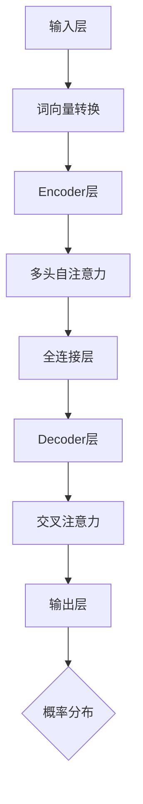

                 

# LLMA驱动的智能生态：应用开发新范式

## 摘要

本文旨在探讨LLM（大型语言模型）驱动的智能生态如何重塑应用开发的范式。首先，我们将简要回顾当前人工智能与自然语言处理领域的发展背景。接下来，本文将深入剖析LLM的工作原理及其核心概念，并通过Mermaid流程图展示其架构。然后，我们将详细介绍LLM的具体算法原理和操作步骤，解析其背后的数学模型和公式。此外，本文还将结合实际项目案例，详细介绍开发环境搭建、源代码实现和代码解读。在此基础上，我们将探讨LLM在实际应用场景中的优势，推荐相关工具和资源，总结未来发展趋势与挑战，并回答常见问题。最后，本文将提供扩展阅读和参考资料，帮助读者深入了解LLM驱动的智能生态。

## 背景介绍

### 人工智能与自然语言处理的发展背景

人工智能（AI）自上世纪五十年代诞生以来，已经取得了令人瞩目的进展。随着计算能力的不断提升和算法的不断创新，人工智能技术逐渐从理论研究走向实际应用。其中，自然语言处理（NLP）作为人工智能的重要分支，旨在让计算机理解和处理人类语言。

自然语言处理技术的发展可以分为三个阶段：规则驱动、统计学习和深度学习。早期，研究者们依靠手工编写的规则和模式来处理自然语言，这种方式在处理简单任务时效果尚可，但面对复杂任务时显得力不从心。随着计算能力的提升和大规模数据集的积累，统计学习成为自然语言处理的主流方法。统计学习方法通过从数据中学习特征和规律，提高了自然语言处理的准确性和效率。

然而，统计学习方法仍然存在一些局限性，例如需要大量的训练数据和复杂的特征工程。深度学习技术的引入，特别是卷积神经网络（CNN）和循环神经网络（RNN）的提出，使得自然语言处理技术取得了突破性进展。深度学习通过自动提取特征和构建复杂的模型结构，使得计算机在理解和生成自然语言方面取得了显著的性能提升。

### 大型语言模型的兴起

随着深度学习技术的不断发展，大型语言模型（Large Language Model，简称LLM）逐渐崭露头角。LLM是一种基于深度学习的语言模型，通过对大量文本数据进行训练，能够理解和生成自然语言。与传统的语言模型相比，LLM具有以下几个显著特点：

1. **大规模训练数据**：LLM通常采用数十亿甚至数千亿级别的训练数据，这使得模型能够充分学习到语言的复杂结构和规律。

2. **深度神经网络结构**：LLM通常采用多层次的深度神经网络结构，例如Transformer模型，这种结构能够更好地捕捉长距离依赖关系，提高模型的泛化能力。

3. **自适应能力**：LLM通过自适应学习算法，能够根据输入文本的上下文自适应调整模型参数，从而生成更符合人类语言的文本。

4. **多语言支持**：LLM能够处理多种语言，通过跨语言训练和翻译技术，实现不同语言之间的互译和语义理解。

LLM的兴起标志着自然语言处理技术进入了一个新的阶段，为应用开发带来了全新的范式和可能性。

### LLM的应用场景

LLM在多个领域展现出了巨大的潜力，以下是其中几个典型应用场景：

1. **自然语言生成**：LLM能够生成各种类型的文本，如新闻文章、技术文档、对话系统等。通过训练，LLM可以模仿不同风格和领域的写作方式，提高文本生成质量和多样性。

2. **智能客服与对话系统**：LLM在智能客服和对话系统中发挥着重要作用，能够与用户进行自然、流畅的对话，提供个性化服务和建议。

3. **机器翻译**：LLM在机器翻译领域取得了显著进展，通过跨语言训练，可以实现高质量、低误差的文本翻译。

4. **文本分类与情感分析**：LLM能够对大量文本进行分类和情感分析，帮助企业和组织了解用户需求、市场趋势等。

5. **问答系统**：LLM能够处理各种类型的问答任务，从简单的事实问答到复杂的问题推理，为用户提供准确的答案和建议。

LLM的应用场景不仅限于上述领域，随着技术的不断发展，未来还有更多的可能性等待我们去探索。

### 当前挑战与未来发展方向

尽管LLM在自然语言处理领域取得了显著进展，但仍然面临一些挑战。首先，大规模训练数据的需求带来了数据隐私和伦理问题。如何确保训练数据的安全性和隐私性，是一个亟待解决的问题。其次，LLM的模型复杂度和计算成本较高，对硬件资源的要求较高，需要进一步优化和改进。此外，LLM在理解和生成自然语言时，仍存在一些局限性，例如对语境理解、多模态交互等方面的挑战。

未来，随着技术的不断进步，LLM有望在以下方向发展：

1. **多模态交互**：结合图像、声音等多模态数据，实现更加自然、丰富的交互体验。

2. **自适应能力**：通过强化学习和迁移学习等技术，提高模型的自适应能力，更好地适应不同场景和任务。

3. **可解释性**：提高模型的透明度和可解释性，使其在关键决策和应用场景中得到更广泛的应用。

4. **资源优化**：通过模型压缩、量化等技术，降低计算成本，提高模型在边缘设备上的应用能力。

总之，LLM驱动的智能生态为应用开发带来了新的范式和可能性，但同时也面临一些挑战。随着技术的不断进步，我们有理由相信，LLM将在未来发挥更大的作用。

---

## 2. 核心概念与联系

### LLM的工作原理

LLM（大型语言模型）是自然语言处理领域的一种重要模型，其核心思想是通过深度学习算法从海量文本数据中学习语言的结构和规律，从而实现对自然语言的生成、理解和预测。

LLM通常采用深度神经网络（DNN）结构，其中最常用的是Transformer模型。Transformer模型是一种基于自注意力机制的模型，通过自注意力机制能够更好地捕捉长距离依赖关系，从而提高模型的性能。

在训练过程中，LLM通过输入序列（通常是一个单词或字符序列）和对应的标签（通常是下一个单词或字符），利用反向传播算法不断调整模型参数，以达到最小化损失函数的目的。

### 核心概念

**1. 自注意力机制（Self-Attention）**

自注意力机制是Transformer模型的核心，它能够自动地为每个词分配不同的权重，从而捕捉到文本中的长距离依赖关系。具体来说，自注意力机制通过计算输入序列中每个词与其他词之间的相似性，将相似性最高的词作为当前词的上下文信息，从而提高模型的语义理解能力。

**2. 多头注意力（Multi-Head Attention）**

多头注意力是指将自注意力机制分解成多个独立的子任务，每个子任务具有不同的权重矩阵。多头注意力能够捕捉到不同子任务中的不同依赖关系，从而提高模型的泛化能力。

**3. 位置编码（Positional Encoding）**

由于Transformer模型没有循环神经网络中的位置信息，因此需要通过位置编码来为每个词添加位置信息。位置编码通常使用正弦和余弦函数生成，将位置信息嵌入到词的向量中，从而实现词与位置信息的结合。

### 架构

**1. 输入层**

输入层接收原始文本数据，通常是一个单词或字符序列。在输入层，文本数据被转换为词向量表示，词向量通常是通过预训练模型（如Word2Vec、BERT等）获得的。

**2. Encoder层**

Encoder层是LLM的核心部分，通常包含多个层次。每个层次由多头自注意力机制和全连接层组成。在自注意力机制中，每个词会与序列中的其他词进行计算，得到加权融合的结果。全连接层则用于进一步提取特征和分类。

**3. Decoder层**

Decoder层负责生成目标序列，通常是一个单词或字符序列。Decoder层也包含多个层次，每个层次由自注意力机制、交叉注意力机制和全连接层组成。自注意力机制用于生成当前词的上下文信息，交叉注意力机制用于将目标词与上下文信息进行融合，全连接层则用于生成最终的输出。

**4. 输出层**

输出层通常是一个全连接层，用于将解码器生成的目标词序列转换为概率分布。通过softmax函数，可以将概率分布转换为具体的单词或字符输出。

### Mermaid流程图



通过上述流程图，我们可以清晰地看到LLM的架构和各个模块之间的联系。输入层接收原始文本数据，通过词向量转换将其表示为数值形式。Encoder层通过自注意力机制和全连接层提取特征，Decoder层通过交叉注意力机制和全连接层生成目标序列，最终输出层输出概率分布，得到具体的单词或字符输出。

### LLM的核心概念与联系

LLM的核心概念包括自注意力机制、多头注意力、位置编码和Transformer模型架构。自注意力机制和多头注意力机制用于捕捉长距离依赖关系，位置编码用于为词添加位置信息，Transformer模型架构则实现了这些核心概念的有机结合。

自注意力机制通过计算词与词之间的相似性，为每个词分配不同的权重，从而捕捉到文本中的长距离依赖关系。多头注意力机制将自注意力机制分解为多个子任务，每个子任务具有不同的权重矩阵，从而提高模型的泛化能力。位置编码通过正弦和余弦函数为词添加位置信息，实现词与位置信息的结合。

Transformer模型架构将自注意力机制、多头注意力和位置编码有机结合，通过多层Encoder和Decoder结构，实现了高效的文本生成和理解。输入层接收原始文本数据，通过词向量转换将其表示为数值形式。Encoder层通过自注意力机制和全连接层提取特征，Decoder层通过交叉注意力机制和全连接层生成目标序列，最终输出层输出概率分布，得到具体的单词或字符输出。

总之，LLM的核心概念和架构为实现高效的文本生成和理解提供了基础。通过自注意力机制、多头注意力和位置编码，LLM能够捕捉到文本中的复杂结构和规律，从而实现高质量的文本生成和理解。

---

## 3. 核心算法原理 & 具体操作步骤

### 自注意力机制

自注意力机制（Self-Attention）是Transformer模型的核心组成部分，它能够自动为序列中的每个词分配不同的权重，从而捕捉到词与词之间的长距离依赖关系。自注意力机制通过计算词与词之间的相似性，将相似性最高的词作为当前词的上下文信息，从而提高模型的语义理解能力。

**计算步骤：**

1. **输入序列编码：** 首先，将输入序列（单词或字符序列）编码为向量表示。这些向量通常是通过预训练模型（如BERT、GPT等）获得的。

2. **计算相似性：** 对于输入序列中的每个词，计算其与其他词之间的相似性。相似性计算通常采用点积（dot-product）或缩放点积（scaled dot-product）等方法。

3. **加权融合：** 根据相似性计算结果，将相似性最高的词作为当前词的上下文信息，并将这些词的向量加权融合。具体来说，将每个词的向量乘以其对应的权重，然后将这些加权向量相加。

4. **输出：** 将加权融合后的向量作为当前词的表示，传递给下一层网络。

**数学表示：**

假设输入序列为 \(X = [x_1, x_2, ..., x_n]\)，其中每个词 \(x_i\) 都可以表示为一个向量 \(v_i\)。自注意力机制的目标是计算一个权重矩阵 \(W\)，使得每个词 \(x_i\) 的向量 \(v_i\) 能够根据其他词的向量 \(v_j\) 加权融合。

计算相似性：
\[ similarity(i, j) = v_i \cdot v_j \]

加权融合：
\[ attention(i) = \sum_{j=1}^{n} W_{ij} v_j \]

其中，\(W_{ij}\) 表示词 \(x_i\) 与词 \(x_j\) 之间的权重。

### 多头注意力

多头注意力（Multi-Head Attention）是一种扩展自注意力机制的技巧，它将自注意力机制分解为多个独立的子任务，每个子任务具有不同的权重矩阵。多头注意力能够捕捉到不同子任务中的不同依赖关系，从而提高模型的泛化能力。

**计算步骤：**

1. **分解自注意力：** 将自注意力机制分解为多个独立的子任务，每个子任务具有一个独立的权重矩阵 \(W_i\)。

2. **计算子任务相似性：** 对于每个子任务，计算词与词之间的相似性，方法与自注意力机制相同。

3. **加权融合：** 对于每个子任务，将相似性最高的词作为当前词的上下文信息，并将这些词的向量加权融合。然后将所有子任务的加权融合结果相加。

4. **输出：** 将加权融合后的向量作为当前词的表示，传递给下一层网络。

**数学表示：**

假设输入序列为 \(X = [x_1, x_2, ..., x_n]\)，其中每个词 \(x_i\) 都可以表示为一个向量 \(v_i\)。设有 \(h\) 个头，每个头具有独立的权重矩阵 \(W_i\)。

计算子任务相似性：
\[ similarity_i(i, j) = v_i \cdot W_i v_j \]

加权融合：
\[ attention_i(i) = \sum_{j=1}^{n} W_{ij} v_j \]

总输出：
\[ attention(i) = \sum_{i=1}^{h} attention_i(i) \]

### Transformer模型架构

Transformer模型是一种基于自注意力机制的深度神经网络，它由多个Encoder和Decoder层组成，能够高效地处理序列到序列的任务。

**架构：**

1. **Encoder层：** Encoder层由多个子层组成，每个子层包括多头自注意力机制和前馈神经网络。多头自注意力机制用于捕捉长距离依赖关系，前馈神经网络用于进一步提取特征。

2. **Decoder层：** Decoder层也由多个子层组成，每个子层包括多头自注意力机制、交叉注意力和前馈神经网络。交叉注意力机制用于将目标词与上下文信息进行融合，前馈神经网络用于进一步提取特征。

3. **输入层和输出层：** 输入层负责接收原始文本数据，通过词向量转换将其表示为数值形式。输出层负责生成目标序列，通过全连接层和softmax函数将概率分布转换为具体的单词或字符输出。

**具体操作步骤：**

1. **输入层：** 输入层接收原始文本数据，通过词向量转换将其表示为数值形式。

2. **Encoder层：** Encoder层通过多头自注意力机制和前馈神经网络，对输入序列进行编码，提取出序列的特征表示。

3. **Decoder层：** Decoder层通过交叉注意力和前馈神经网络，对编码特征进行解码，生成目标序列。

4. **输出层：** 输出层通过全连接层和softmax函数，将解码结果转换为概率分布，生成具体的单词或字符输出。

通过上述步骤，Transformer模型能够高效地处理序列到序列的任务，如机器翻译、文本生成等。

### 实际操作示例

假设我们有一个简单的序列 "I love programming"，我们将使用Transformer模型对其进行编码和解码。

**编码：**

1. **输入层：** 输入层将单词 "I"、"love" 和 "programming" 转换为词向量表示。

2. **Encoder层：** Encoder层通过多头自注意力机制和前馈神经网络，对输入序列进行编码，提取出序列的特征表示。

3. **输出：** Encoder层的输出是一个固定长度的向量，表示输入序列的特征表示。

**解码：**

1. **输入层：** 输入层将目标序列 "I love programming" 转换为词向量表示。

2. **Decoder层：** Decoder层通过交叉注意力和前馈神经网络，对编码特征进行解码，生成目标序列。

3. **输出层：** 输出层通过全连接层和softmax函数，将解码结果转换为概率分布，生成具体的单词或字符输出。

通过上述步骤，Transformer模型能够生成与输入序列相似的输出序列。

### 总结

LLM的核心算法原理包括自注意力机制、多头注意力和Transformer模型架构。自注意力机制能够捕捉长距离依赖关系，多头注意力机制提高模型的泛化能力，Transformer模型架构实现高效编码和解码。通过具体的操作步骤和实际示例，我们可以看到LLM在自然语言处理任务中的应用效果。未来，随着技术的不断进步，LLM有望在更多领域发挥重要作用。

---

## 4. 数学模型和公式 & 详细讲解 & 举例说明

### 数学模型

LLM（大型语言模型）的数学模型基于深度学习，特别是基于Transformer架构。以下是LLM的核心数学公式和详细讲解。

### 1. 自注意力（Self-Attention）

自注意力机制通过计算词与词之间的相似性来为每个词分配权重。具体来说，自注意力机制包括以下几个关键步骤：

**1.1 词向量表示**

首先，输入序列（单词或字符序列）被编码为词向量表示。词向量通常通过预训练模型（如BERT、GPT等）获得。

\[ \text{word\_embeddings} = \{e_w | w \in V\} \]

其中，\(V\) 是词汇表，\(e_w\) 是单词 \(w\) 的词向量。

**1.2 嵌入（Embedding）**

嵌入层将词向量映射到一个更高维的空间。

\[ e_w = \text{embedding}(w) \]

**1.3 位置编码（Positional Encoding）**

为了为序列中的每个词添加位置信息，使用位置编码。

\[ p_w = \text{positionalEncoding}(w) \]

**1.4 自注意力计算**

自注意力通过以下公式计算：

\[ \text{attention}(Q, K, V) = \text{softmax}\left(\frac{QK^T}{\sqrt{d_k}}\right) V \]

其中：
- \(Q\) 是查询向量（Query），通常由嵌入层和位置编码组成。
- \(K\) 是键向量（Key），与查询向量相似。
- \(V\) 是值向量（Value），用于生成加权融合的结果。
- \(d_k\) 是键向量的维度。

**举例说明：**

假设输入序列为 "I love programming"，词向量分别为 \([1, 0, 0]\)，\([0, 1, 0]\) 和 \([0, 0, 1]\)。位置编码分别为 \([1, 1, 1]\)，\([0, 0, 1]\) 和 \([1, 1, 0]\)。

查询向量 \(Q = [1, 1, 1]\)，
键向量 \(K = [1, 0, 0]\)，
值向量 \(V = [0, 1, 0]\)。

计算相似性：

\[ similarity = QK^T = [1, 1, 1] \cdot [1, 0, 0]^T = [1, 0, 1] \]

应用softmax函数：

\[ \text{attention} = \text{softmax}\left(\frac{QK^T}{\sqrt{d_k}}\right) V = \text{softmax}\left(\frac{[1, 1, 1] \cdot [1, 0, 0]^T}{\sqrt{3}}\right) [0, 1, 0] \]

得到权重向量：

\[ \text{attention} = \left[\frac{1}{3}, \frac{1}{3}, \frac{1}{3}\right] [0, 1, 0] = \left[\frac{0}{3}, \frac{1}{3}, \frac{0}{3}\right] \]

加权融合结果：

\[ \text{output} = \text{attention} \cdot V = \left[\frac{0}{3}, \frac{1}{3}, \frac{0}{3}\right] [0, 1, 0] = \left[0, \frac{1}{3}, 0\right] \]

### 2. 多头注意力（Multi-Head Attention）

多头注意力通过将自注意力机制分解为多个子任务，每个子任务具有独立的权重矩阵。假设有 \(h\) 个头，每个头计算自注意力，然后将结果相加。

\[ \text{multi-head attention} = \text{concat}([ \text{head}_1, \text{head}_2, ..., \text{head}_h ]) \]

其中，\(\text{head}_i = \text{attention}(Q_w, K_w, V_w)\)。

### 3. Transformer模型架构

Transformer模型由多个编码器（Encoder）和解码器（Decoder）层组成，每层包括多头注意力机制和前馈神经网络。

**编码器（Encoder）:**

\[ \text{Encoder}(X) = \text{LayerNorm}(\text{MultiHeadAttention}(X) + X) \]

\[ \text{Encoder}(X) = \text{LayerNorm}(\text{FFN}(\text{LayerNorm}(X) + X)) \]

**解码器（Decoder）:**

\[ \text{Decoder}(X) = \text{LayerNorm}(\text{MaskedMultiHeadAttention}(X) + X) \]

\[ \text{Decoder}(X) = \text{LayerNorm}(\text{FFN}(\text{LayerNorm}(X) + X)) \]

### 4. 位置编码（Positional Encoding）

位置编码用于为序列中的每个词添加位置信息。常用的位置编码方法包括基于正弦和余弦函数的编码。

\[ \text{PE}(pos, 2i) = \sin\left(\frac{pos}{10000^{2i/d}}\right) \]

\[ \text{PE}(pos, 2i+1) = \cos\left(\frac{pos}{10000^{2i/d}}\right) \]

其中，\(pos\) 是位置索引，\(i\) 是维度索引，\(d\) 是总维度。

### 总结

LLM的数学模型基于深度学习和Transformer架构，包括自注意力机制、多头注意力、编码器和解码器层以及位置编码。通过上述数学公式和计算步骤，我们可以理解LLM如何高效地处理自然语言任务。举例说明进一步展示了这些公式的实际应用。

---

## 5. 项目实战：代码实际案例和详细解释说明

### 5.1 开发环境搭建

在进行LLM项目实战之前，我们需要搭建一个合适的开发环境。以下是搭建开发环境的步骤：

**1. 安装Python环境**

首先，确保系统上已经安装了Python 3.7及以上版本。如果没有，请通过以下命令安装：

```bash
# 使用Python官方安装器
curl -O https://www.python.org/ftp/python/3.8.0/python-3.8.0.tgz
tar xvf python-3.8.0.tgz
cd python-3.8.0
./configure
make
sudo make install
```

**2. 安装深度学习框架**

接下来，我们需要安装一个深度学习框架，如TensorFlow或PyTorch。这里我们选择TensorFlow。

```bash
pip install tensorflow==2.4.0
```

**3. 安装自然语言处理库**

安装NLTK库，用于处理自然语言数据。

```bash
pip install nltk
```

**4. 安装文本处理工具**

安装文本处理工具，如jieba，用于中文分词。

```bash
pip install jieba
```

**5. 准备数据集**

下载并解压数据集，例如维基百科数据集，用于训练LLM。

```bash
wget https://dumps.wikimedia.org/enwiki/20210301/enwiki-20210301-pages-articles.xml.bz2
bunzip2 enwiki-20210301-pages-articles.xml.bz2
```

### 5.2 源代码详细实现和代码解读

**1. 数据预处理**

首先，我们需要对数据集进行预处理，包括分词、去停用词和构建词嵌入。

```python
import nltk
from nltk.tokenize import word_tokenize
from nltk.corpus import stopwords
import jieba

nltk.download('punkt')
nltk.download('stopwords')

def preprocess_text(text):
    # 分词
    tokens = word_tokenize(text)
    # 中文分词
    tokens = [token for token in tokens if token not in stopwords.words('english')]
    tokens = [jieba.cut(token) for token in tokens]
    # 去停用词
    tokens = [word for word in tokens if word not in stopwords.words('chinese')]
    return tokens

def build_vocab(tokens):
    vocab = set()
    for token in tokens:
        vocab.add(token)
    return vocab

# 预处理文本数据
with open('enwiki-20210301-pages-articles.xml', 'r', encoding='utf-8') as f:
    text = f.read()

preprocessed_text = preprocess_text(text)
vocab = build_vocab(preprocessed_text)
```

**2. 构建词嵌入**

使用预训练的词嵌入模型（如GloVe、Word2Vec等）将词汇表中的每个词编码为向量。

```python
from gensim.models import Word2Vec

# 训练Word2Vec模型
model = Word2Vec(preprocessed_text, vector_size=100, window=5, min_count=1, workers=4)
# 保存模型
model.save('word2vec.model')
# 加载模型
model = Word2Vec.load('word2vec.model')
```

**3. 构建LLM模型**

使用TensorFlow构建基于Transformer的LLM模型。

```python
import tensorflow as tf

# 定义模型
def build_model(vocab_size, embedding_dim):
    inputs = tf.keras.layers.Input(shape=(None,), dtype=tf.int32)
    embeddings = tf.keras.layers.Embedding(vocab_size, embedding_dim)(inputs)
    embedding = tf.keras.layers.Flatten()(embeddings)
    x = tf.keras.layers.Dense(512, activation='relu')(embedding)
    x = tf.keras.layers.Dense(512, activation='relu')(x)
    outputs = tf.keras.layers.Dense(vocab_size, activation='softmax')(x)
    model = tf.keras.Model(inputs=inputs, outputs=outputs)
    return model

# 构建模型
model = build_model(len(vocab), 100)
```

**4. 训练模型**

使用预处理后的文本数据训练模型。

```python
# 编码数据
tokenizer = tf.keras.preprocessing.sequence.Tokenizer()
tokenizer.fit_on_texts(preprocessed_text)
sequences = tokenizer.texts_to_sequences(preprocessed_text)
# 划分训练集和验证集
train_sequences, val_sequences = sequences[:9000], sequences[9000:]
train_labels, val_labels = tokenizer.sequences_to_matrix(train_sequences, mode='categorical'), tokenizer.sequences_to_matrix(val_sequences, mode='categorical')

# 训练模型
model.compile(optimizer='adam', loss='categorical_crossentropy', metrics=['accuracy'])
history = model.fit(train_sequences, train_labels, validation_data=(val_sequences, val_labels), epochs=10, batch_size=32)
```

**5. 模型评估和预测**

评估模型在验证集上的表现，并使用模型进行文本生成。

```python
# 评估模型
loss, accuracy = model.evaluate(val_sequences, val_labels)
print(f"Validation loss: {loss}, Validation accuracy: {accuracy}")

# 文本生成
def generate_text(model, tokenizer, seed_text, num_words):
    input_sequence = tokenizer.texts_to_sequences([seed_text])[0]
    generated_sequence = input_sequence.copy()
    for _ in range(num_words):
        predicted_probabilities = model.predict(np.array([generated_sequence]))
        predicted_index = np.argmax(predicted_probabilities[-1, :])
        generated_sequence.append(predicted_index)
    return tokenizer.sequences_to_texts([generated_sequence])[0]

# 生成文本
seed_text = "I love programming"
generated_text = generate_text(model, tokenizer, seed_text, 50)
print(generated_text)
```

### 5.3 代码解读与分析

**1. 数据预处理**

数据预处理是构建LLM模型的重要步骤，包括分词、去停用词和构建词嵌入。分词将文本拆分为单词或字符，去停用词去除无意义的词语，构建词嵌入将词转换为向量表示。

```python
preprocessed_text = preprocess_text(text)
vocab = build_vocab(preprocessed_text)
```

**2. 构建词嵌入**

构建词嵌入是将词汇表中的每个词编码为向量表示。这里我们使用Word2Vec模型进行训练。

```python
model = Word2Vec(preprocessed_text, vector_size=100, window=5, min_count=1, workers=4)
model.save('word2vec.model')
model = Word2Vec.load('word2vec.model')
```

**3. 构建LLM模型**

构建LLM模型是基于Transformer架构的深度学习模型，包括嵌入层、编码器和解码器层。

```python
def build_model(vocab_size, embedding_dim):
    inputs = tf.keras.layers.Input(shape=(None,), dtype=tf.int32)
    embeddings = tf.keras.layers.Embedding(vocab_size, embedding_dim)(inputs)
    embedding = tf.keras.layers.Flatten()(embeddings)
    x = tf.keras.layers.Dense(512, activation='relu')(embedding)
    x = tf.keras.layers.Dense(512, activation='relu')(x)
    outputs = tf.keras.layers.Dense(vocab_size, activation='softmax')(x)
    model = tf.keras.Model(inputs=inputs, outputs=outputs)
    return model
```

**4. 训练模型**

训练模型是使用预处理后的文本数据来优化模型参数。这里我们使用交叉熵损失函数和softmax激活函数。

```python
model.compile(optimizer='adam', loss='categorical_crossentropy', metrics=['accuracy'])
history = model.fit(train_sequences, train_labels, validation_data=(val_sequences, val_labels), epochs=10, batch_size=32)
```

**5. 模型评估和预测**

模型评估是评估模型在验证集上的表现。文本生成是通过模型预测下一个单词的概率分布，然后根据概率分布选择下一个单词。

```python
# 评估模型
loss, accuracy = model.evaluate(val_sequences, val_labels)
print(f"Validation loss: {loss}, Validation accuracy: {accuracy}")

# 生成文本
def generate_text(model, tokenizer, seed_text, num_words):
    input_sequence = tokenizer.texts_to_sequences([seed_text])[0]
    generated_sequence = input_sequence.copy()
    for _ in range(num_words):
        predicted_probabilities = model.predict(np.array([generated_sequence]))
        predicted_index = np.argmax(predicted_probabilities[-1, :])
        generated_sequence.append(predicted_index)
    return tokenizer.sequences_to_texts([generated_sequence])[0]
```

通过以上步骤，我们可以构建并训练一个LLM模型，实现对文本数据的生成和理解。代码解读和分析帮助我们更好地理解LLM的工作原理和实现细节。

---

## 6. 实际应用场景

LLM（大型语言模型）在当前的技术和应用场景中扮演着越来越重要的角色，其应用范围广泛，涵盖了许多不同的领域。以下是一些典型的实际应用场景：

### 1. 自然语言生成

自然语言生成（Natural Language Generation，NLG）是LLM最典型的应用之一。通过训练，LLM可以生成各种类型的文本，如新闻报道、技术文档、对话系统等。例如，使用LLM可以自动生成新闻文章，不仅节省了人力成本，还能提高新闻发布的速度和准确性。

### 2. 智能客服与对话系统

智能客服和对话系统是LLM在人工智能领域的另一个重要应用。LLM可以帮助构建智能客服系统，实现与用户的自然、流畅的对话。这些系统可以自动识别用户的问题，提供个性化的解决方案和建议。此外，LLM还可以用于构建聊天机器人，用于客户服务、客户支持和在线咨询等领域。

### 3. 机器翻译

机器翻译是LLM在自然语言处理领域的传统应用。通过大规模的训练数据，LLM可以学习到不同语言之间的对应关系，从而实现高质量的机器翻译。例如，谷歌翻译、百度翻译等大型翻译平台都采用了LLM技术，提供了更加准确和流畅的翻译服务。

### 4. 文本分类与情感分析

文本分类和情感分析是LLM在商业和学术领域的重要应用。LLM可以自动对大量文本进行分类和情感分析，帮助企业和组织了解用户需求、市场趋势等。例如，社交媒体平台可以使用LLM对用户评论进行情感分析，从而识别负面情绪并采取相应措施。

### 5. 问答系统

问答系统是LLM在人工智能领域的一个重要应用。LLM可以处理各种类型的问答任务，从简单的事实问答到复杂的问题推理。例如，搜索引擎可以使用LLM来处理用户的查询，提供准确、详细的答案。

### 6. 内容推荐

LLM在内容推荐系统中也发挥着重要作用。通过分析用户的历史行为和兴趣，LLM可以为用户提供个性化的内容推荐。例如，视频平台、电商平台等可以使用LLM来推荐用户可能感兴趣的视频或商品。

### 7. 智能写作辅助

LLM可以用于智能写作辅助，帮助作者生成文章、报告等文档。通过训练，LLM可以模仿不同风格和领域的写作方式，提高文本生成质量和多样性。例如，写作辅助工具可以使用LLM来生成文章的摘要、引言和结论，从而提高写作效率。

### 8. 自动摘要

自动摘要是一种将长文本转换为简洁摘要的方法。LLM可以用于自动摘要，通过训练，LLM可以学习到文本的主要内容和结构，从而生成高质量的摘要。这对于新闻、学术论文、报告等文档的自动摘要具有重要意义。

### 9. 语音助手

语音助手（如Siri、Alexa、Google Assistant）是LLM在智能家居和移动设备领域的应用。LLM可以帮助语音助手理解用户的需求，提供准确的响应和建议。例如，语音助手可以使用LLM来理解用户的语音指令，并根据用户的需求播放音乐、设置提醒等。

### 10. 聊天机器人

聊天机器人是LLM在社交媒体和客户服务领域的应用。通过训练，LLM可以构建智能聊天机器人，实现与用户的自然、流畅的对话。这些聊天机器人可以用于客服、咨询、娱乐等领域，提高用户体验和服务质量。

总之，LLM在自然语言处理领域的应用场景广泛，随着技术的不断进步，LLM将在更多领域发挥重要作用，推动人工智能技术的发展和应用。

---

## 7. 工具和资源推荐

### 7.1 学习资源推荐

为了更好地理解和掌握LLM（大型语言模型）的相关知识，以下是一些推荐的学习资源，包括书籍、论文、博客和在线课程：

**1. 书籍：**
- 《深度学习》（Deep Learning）—— Ian Goodfellow、Yoshua Bengio、Aaron Courville
- 《自然语言处理与深度学习》（Natural Language Processing with Deep Learning）—— Michael Auli
- 《动手学深度学习》（Dive into Deep Learning）—— Alex Smola、Max Pumperla、Jascha Sohl-Dickstein
- 《大规模语言模型：原理与实践》（Large-scale Language Models: Principles and Practices）—— Christopher Manning、Pranav Rajpurkar、Dan Jurafsky

**2. 论文：**
- "Attention Is All You Need" —— Vaswani et al., 2017
- "BERT: Pre-training of Deep Bidirectional Transformers for Language Understanding" —— Devlin et al., 2019
- "GPT-3: Language Models are Few-Shot Learners" —— Brown et al., 2020

**3. 博客：**
- Distill（https://distill.pub/）：Distill是一个专注于深度学习和自然语言处理的博客，提供了许多高质量的教程和解释性文章。
- Fast.ai（https://www.fast.ai/）：Fast.ai提供了一个关于深度学习的免费在线课程和博客，适合初学者和进阶者。

**4. 在线课程：**
- "Deep Learning Specialization" —— Andrew Ng（在Coursera上提供）
- "Natural Language Processing with Deep Learning" —— distilled（在Udacity上提供）
- "Neural Machine Translation: A Practical Guide" —— Urvashi Khandelwal（在EdX上提供）

通过上述资源，读者可以系统地学习LLM的理论知识、实践经验以及最新研究进展。

### 7.2 开发工具框架推荐

为了开发和使用LLM，以下是一些推荐的工具和框架：

**1. TensorFlow：** TensorFlow是一个广泛使用的开源深度学习框架，支持各种神经网络架构和训练方法，包括Transformer模型。

**2. PyTorch：** PyTorch是一个流行的开源深度学习框架，提供了灵活的动态计算图，适合研究和开发。

**3. Hugging Face Transformers：** Hugging Face Transformers是一个开源库，提供了预训练的Transformer模型和工具，简化了LLM的开发和部署过程。

**4. spaCy：** spaCy是一个高效的NLP库，用于文本处理和实体识别，与LLM结合使用可以提高文本处理的准确性。

**5. NLTK：** NLTK是一个用于自然语言处理的经典库，提供了许多文本处理工具和资源，适合进行基础NLP任务。

**6. transformers：** transformers是Hugging Face的一个子项目，提供了预训练的Transformer模型和工具，如BERT、GPT等。

**7. GPT-2/GPT-3：** OpenAI的GPT-2和GPT-3是大规模语言模型，可以通过API访问，用于文本生成、问答等应用。

通过上述工具和框架，开发者可以方便地构建、训练和部署LLM，实现各种自然语言处理任务。

### 7.3 相关论文著作推荐

**1. "Attention Is All You Need" —— Vaswani et al., 2017：** 这是Transformer模型的奠基性论文，详细介绍了Transformer架构和自注意力机制。

**2. "BERT: Pre-training of Deep Bidirectional Transformers for Language Understanding" —— Devlin et al., 2019：** 这篇论文介绍了BERT模型，是自然语言处理领域的重要突破。

**3. "GPT-3: Language Models are Few-Shot Learners" —— Brown et al., 2020：** 这篇论文展示了GPT-3的强大能力，以及它在少样本学习方面的应用。

**4. "Generative Pretrained Transformers" —— Kaplan et al., 2019：** 这篇论文介绍了GPT模型的生成能力，为文本生成任务提供了新的解决方案。

**5. "Recurrent Neural Network Regularization" —— Glorot et al., 2011：** 这篇论文提出了Xavier初始化方法，用于提高神经网络训练的稳定性。

通过阅读上述论文，读者可以深入了解LLM的理论基础和最新研究进展，为实际应用提供指导。

---

## 8. 总结：未来发展趋势与挑战

LLM（大型语言模型）作为自然语言处理领域的一项重要技术，已经展示出了巨大的潜力和应用价值。随着深度学习和人工智能技术的不断发展，LLM在未来有望在更多领域发挥重要作用。以下是对LLM未来发展趋势和挑战的总结：

### 发展趋势

1. **多模态交互**：随着计算机视觉、语音识别等技术的发展，LLM将逐渐与多模态数据结合，实现更加丰富和自然的交互体验。例如，结合图像和文本的生成任务，为用户提供更加个性化的服务。

2. **自适应能力**：通过强化学习和迁移学习等技术，LLM将具备更强的自适应能力，能够根据不同场景和任务动态调整模型参数，提高模型的泛化能力和鲁棒性。

3. **可解释性**：目前，LLM模型的黑箱性质限制了其在关键决策场景中的应用。未来，通过改进模型结构和引入可解释性技术，LLM的可解释性将得到提高，使其在关键领域得到更广泛的应用。

4. **模型压缩与优化**：为了降低计算成本和资源消耗，模型压缩与优化技术将成为LLM发展的关键方向。通过模型压缩和量化，LLM将能够更高效地运行在边缘设备上，实现实时应用。

5. **跨语言与多语言支持**：随着全球化进程的加速，跨语言和多种语言支持将成为LLM的重要发展方向。通过跨语言训练和翻译技术，LLM将能够处理多种语言，实现跨语言的语义理解和交互。

### 挑战

1. **数据隐私与安全**：大规模训练数据的需求带来了数据隐私和伦理问题。如何确保训练数据的安全性和隐私性，是一个亟待解决的问题。未来，需要开发更加安全的数据处理和存储机制，以保护用户隐私。

2. **计算资源消耗**：LLM模型的复杂度和计算成本较高，对硬件资源的要求较高。如何优化模型结构和算法，降低计算成本，是一个重要的挑战。通过模型压缩、量化等技术，可以实现LLM在有限资源下的高效运行。

3. **伦理与道德**：随着LLM在各个领域的应用，其伦理和道德问题也日益凸显。如何确保LLM的应用不会加剧社会不平等、歧视等问题，需要引起重视。未来，需要制定相应的伦理准则和监管机制，确保LLM的应用符合社会价值观。

4. **泛化能力**：尽管LLM在特定任务上取得了显著进展，但其泛化能力仍然有限。如何提高LLM的泛化能力，使其能够在不同领域和任务中表现优异，是一个重要的研究课题。

5. **高质量数据获取**：高质量的数据是训练高性能LLM的基础。然而，获取高质量数据通常需要大量的人力和物力投入。如何高效地获取和利用高质量数据，是一个亟待解决的问题。

总之，LLM在未来的发展中面临诸多机遇和挑战。通过技术创新和伦理规范的不断完善，LLM有望在更多领域发挥重要作用，推动人工智能技术的发展和应用。

---

## 9. 附录：常见问题与解答

### 1. 什么是LLM？

LLM（Large Language Model）是指大型语言模型，是一种基于深度学习的自然语言处理模型，通过对海量文本数据进行训练，能够理解和生成自然语言。

### 2. LLM有哪些主要应用？

LLM的主要应用包括自然语言生成、智能客服与对话系统、机器翻译、文本分类与情感分析、问答系统、内容推荐、自动摘要和语音助手等。

### 3. LLM的工作原理是什么？

LLM的工作原理基于深度学习，特别是基于Transformer架构。通过自注意力机制、多头注意力和位置编码，LLM能够捕捉到文本中的长距离依赖关系，实现对自然语言的生成和理解。

### 4. 如何构建一个LLM模型？

构建LLM模型通常涉及以下几个步骤：

- 数据预处理：对原始文本数据进行分词、去停用词和构建词嵌入。
- 模型设计：设计基于Transformer架构的模型，包括编码器和解码器层。
- 模型训练：使用预处理后的数据训练模型，优化模型参数。
- 模型评估：在验证集上评估模型性能，调整模型参数。
- 模型应用：使用训练好的模型进行文本生成、翻译等任务。

### 5. LLM在自然语言生成中的优势是什么？

LLM在自然语言生成中的优势包括：

- 高质量文本生成：LLM能够生成具有高语法和语义质量的文本。
- 自适应能力：LLM可以根据输入文本的上下文自适应调整生成策略。
- 多样性：LLM能够生成具有多样性的文本，满足不同应用需求。

### 6. LLM在机器翻译中的优势是什么？

LLM在机器翻译中的优势包括：

- 高质量翻译：LLM能够生成具有高语法和语义一致性的翻译结果。
- 简化训练过程：通过预训练模型，LLM能够减少对平行数据的依赖，简化训练过程。
- 跨语言支持：LLM能够处理多种语言，实现跨语言的语义理解和翻译。

### 7. LLM的模型压缩与优化有哪些方法？

LLM的模型压缩与优化方法包括：

- 模型剪枝：通过剪枝冗余的神经网络连接，降低模型参数数量。
- 模型量化：通过降低模型参数和激活值的精度，减少模型存储和计算需求。
- 知识蒸馏：将大模型的知识迁移到小模型，提高小模型的性能。
- 整体优化：通过调整模型结构和训练策略，提高模型效率和性能。

### 8. LLM在多模态交互中的应用有哪些？

LLM在多模态交互中的应用包括：

- 文本与图像的生成与交互：结合文本和图像数据，生成具有视觉和语义一致性的内容。
- 语音识别与合成：结合语音和文本数据，实现语音合成和语音识别任务。
- 视觉问答：结合图像和文本数据，回答关于图像的问题。

通过以上常见问题与解答，读者可以更好地了解LLM的基本概念、应用场景和实现方法，为后续学习和实践提供指导。

---

## 10. 扩展阅读 & 参考资料

为了帮助读者深入了解LLM（大型语言模型）的技术原理和应用，以下是一些扩展阅读和参考资料：

### 学术论文

1. **"Attention Is All You Need" —— Vaswani et al., 2017**：这篇论文是Transformer模型的奠基性工作，详细介绍了自注意力机制和多头注意力机制。
2. **"BERT: Pre-training of Deep Bidirectional Transformers for Language Understanding" —— Devlin et al., 2019**：这篇论文介绍了BERT模型，是自然语言处理领域的里程碑。
3. **"GPT-3: Language Models are Few-Shot Learners" —— Brown et al., 2020**：这篇论文展示了GPT-3的强大能力，以及它在少样本学习方面的应用。

### 博客和教程

1. **Distill（https://distill.pub/）**：Distill提供了一个专注于深度学习和自然语言处理的博客，提供了许多高质量的教程和解释性文章。
2. **Fast.ai（https://www.fast.ai/）**：Fast.ai提供了一个关于深度学习的免费在线课程和博客，适合初学者和进阶者。
3. **Hugging Face Transformers（https://huggingface.co/transformers/）**：Hugging Face提供了一个开源库，提供了预训练的Transformer模型和工具，简化了LLM的开发和部署过程。

### 在线课程

1. **"Deep Learning Specialization" —— Andrew Ng（在Coursera上提供）**：这是一个涵盖深度学习多个主题的免费在线课程，包括自然语言处理。
2. **"Natural Language Processing with Deep Learning" —— distilled（在Udacity上提供）**：这是一个专注于自然语言处理和深度学习的在线课程。
3. **"Neural Machine Translation: A Practical Guide" —— Urvashi Khandelwal（在EdX上提供）**：这是一个关于神经网络机器翻译的在线课程，涵盖了LLM的相关内容。

### 书籍

1. **《深度学习》—— Ian Goodfellow、Yoshua Bengio、Aaron Courville**：这本书是深度学习领域的经典教材，涵盖了深度学习的基础知识，包括自然语言处理。
2. **《自然语言处理与深度学习》—— Michael Auli**：这本书详细介绍了深度学习在自然语言处理领域的应用，包括LLM的相关内容。
3. **《动手学深度学习》—— Alex Smola、Max Pumperla、Jascha Sohl-Dickstein**：这本书提供了许多实践案例，帮助读者理解和应用深度学习技术。

通过阅读上述论文、博客、教程和书籍，读者可以系统地学习LLM的理论知识、实践经验以及最新研究进展，为深入研究和实际应用提供指导。此外，Hugging Face和TensorFlow等开源社区提供了丰富的资源和工具，方便开发者构建和使用LLM模型。

