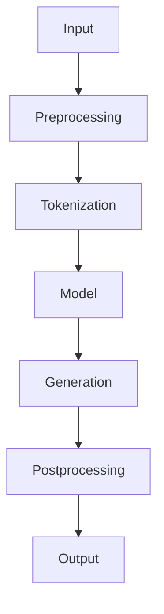

                 

### 背景介绍

#### 介绍 LangChain 的起源与发展

LangChain 是一个开源的框架，旨在利用语言模型，特别是基于Transformer的模型，来解决复杂的问题。它起源于对自然语言处理（NLP）的深入研究，并逐渐发展成为一个广泛应用的框架。LangChain 的核心思想是利用现有的NLP技术，构建一个能够处理自然语言输入和输出的智能系统。

在过去的几年里，随着深度学习和Transformer模型的发展，NLP领域取得了巨大的进步。这些技术的进步为LangChain的出现提供了坚实的基础。LangChain 的创始人之一，Adam Pearce，曾在谷歌工作，专注于研究如何利用Transformer模型来提高NLP系统的性能。他的研究成果为LangChain 的设计和实现提供了重要的指导。

LangChain 的发布引起了广泛关注，并迅速成为开发者和研究者们喜爱的工具之一。它不仅为研究者提供了强大的工具，也帮助开发者在各种应用场景中实现了高效的解决方案。随着NLP技术的不断进步，LangChain 也在不断更新和改进，以适应新的需求和挑战。

#### LangChain 的应用领域

LangChain 在多个领域展现了其强大的应用潜力。以下是几个主要的领域：

1. **问答系统**：LangChain 可以用于构建高效的问答系统。通过训练模型，系统可以理解用户的自然语言问题，并给出准确的答案。

2. **文本生成**：LangChain 可以用于文本生成任务，如自动写作、摘要生成、机器翻译等。其强大的文本理解能力使得生成的文本更加自然和准确。

3. **对话系统**：LangChain 可以用于构建对话系统，如聊天机器人、虚拟助手等。通过结合语言模型和对话管理技术，系统能够与用户进行自然、流畅的对话。

4. **文本分类和标注**：LangChain 可以用于文本分类和标注任务，如情感分析、主题分类等。其高效的文本处理能力使得这些任务能够快速、准确地完成。

5. **搜索和推荐**：LangChain 可以用于搜索和推荐系统，如基于内容的推荐、搜索引擎等。通过理解用户输入的查询和内容，系统能够提供更加精准和个性化的服务。

这些应用场景展示了LangChain 的多样性和强大功能。随着技术的不断进步，LangChain 的应用领域也在不断扩大。

#### LangChain 在业界的影响力

LangChain 在业界的影响力日益增强。许多知名公司和研究机构已经开始使用LangChain，并将其集成到自己的产品和服务中。例如，谷歌、亚马逊、微软等科技巨头都在其产品中使用了LangChain 的技术。

此外，LangChain 还获得了众多开发者和研究者的赞誉。他们在GitHub上对LangChain 的评价非常高，认为它是一个强大且易于使用的框架。这些正面的反馈和认可进一步推动了LangChain 的发展。

总的来说，LangChain 以其卓越的性能和灵活性，在自然语言处理领域取得了显著的成就。它不仅为研究者提供了强大的工具，也为开发者提供了高效的解决方案。随着技术的不断进步，LangChain 的未来前景依然非常广阔。

---

### 核心概念与联系

在深入探讨LangChain之前，我们需要理解一些核心概念，这些概念是LangChain架构和功能的基础。以下是一些关键概念及其相互关系：

#### Transformer 模型

Transformer 模型是近年来在自然语言处理（NLP）领域取得突破性进展的模型。与传统的循环神经网络（RNN）和长短期记忆网络（LSTM）不同，Transformer 模型利用自注意力机制（Self-Attention）来处理序列数据，这使得它在处理长文本和长距离依赖关系方面表现出了显著的优势。

自注意力机制允许模型在生成每个词时考虑到所有其他词的信息，而不是像RNN或LSTM那样逐词处理。这使得Transformer 模型能够捕捉到文本中更加复杂的结构和关系，从而提高文本生成的质量和准确性。


#### 语言模型

语言模型是NLP的核心组成部分，它的目标是预测文本序列的概率分布。在训练过程中，语言模型会学习到大量文本数据中的语言模式和规律，以便能够准确预测新的文本序列。

预训练的语言模型（如GPT-3、BERT等）通过在大量文本上进行预训练，获得了对自然语言的高度理解能力。这些模型通常具有数十亿甚至数千亿个参数，可以捕捉到极其复杂的语言模式。

#### 模型微调

模型微调（Fine-tuning）是指在一个预训练模型的基础上，进一步训练以适应特定任务。在自然语言处理中，预训练模型通常在大规模通用文本数据集上进行训练，然后通过微调来适应特定领域的任务。

微调的过程包括将预训练模型的权重初始化为特定的任务，并在一个较小但针对特定任务的训练集上进行进一步的训练。微调的关键优势在于它能够利用预训练模型已经学习的通用知识，同时专注于特定任务的细节。

#### LangChain 的核心概念

LangChain 的核心概念包括：

- **语言处理组件**：LangChain 提供了一套用于处理自然语言输入和输出的组件，包括文本预处理、文本生成、问答系统等。
- **任务导向**：LangChain 设计为任务导向，允许用户通过定义任务来配置和使用不同的组件，从而实现各种自然语言处理任务。
- **模块化设计**：LangChain 的设计是模块化的，这意味着用户可以根据需要选择和组合不同的组件，以构建复杂的自然语言处理系统。

#### Mermaid 流程图

以下是一个简化的Mermaid流程图，展示了LangChain的主要组件和它们之间的关系：



在这个流程图中：

- A 表示输入文本。
- B 表示预处理步骤，如去除标点符号、转换为小写等。
- C 表示分词步骤，将文本拆分为单词或子词。
- D 表示语言模型，它对输入的文本进行编码。
- E 表示生成步骤，模型根据编码生成文本输出。
- F 表示后处理步骤，如文本格式化、去重等。
- G 表示输出结果。

这个流程图展示了LangChain 处理自然语言输入并生成输出的基本步骤。

---

### 核心算法原理 & 具体操作步骤

在理解了LangChain 的核心概念和基本架构之后，接下来我们将深入探讨LangChain 的核心算法原理和具体操作步骤。

#### Transformer 模型的工作原理

Transformer 模型是一个基于自注意力机制的深度神经网络，它在处理自然语言任务时表现出了卓越的性能。Transformer 模型由编码器（Encoder）和解码器（Decoder）两部分组成。

1. **编码器（Encoder）**

编码器接收输入的文本序列，并通过自注意力机制将每个词映射为高维向量。在编码器内部，每个词的向量都会与序列中的其他词进行加权求和，使得每个词的向量都包含了其他词的信息。

编码器的每个层都包含两个主要组件：多头自注意力（Multi-Head Self-Attention）和前馈神经网络（Feed-Forward Neural Network）。多头自注意力允许模型在不同的子空间中捕捉到不同的信息，从而提高模型的表示能力。前馈神经网络则用于进一步加工和整合这些信息。

2. **解码器（Decoder）**

解码器接收编码器输出的隐藏状态，并通过自注意力和交叉注意力（Cross-Attention）机制生成输出序列。自注意力机制用于处理解码器当前步骤的输出，而交叉注意力机制则用于处理编码器的输出，使得解码器在生成每个词时都能考虑到编码器的信息。

解码器的工作过程类似于编码器，每个层也包含多头自注意力和前馈神经网络。不同的是，解码器的输出会经过一个称为“Masked Multi-Head Self-Attention”的步骤，这个步骤确保了在生成下一个词时不会看到还未生成的词，从而保证了生成过程的顺序性。

#### Transformer 模型在自然语言处理中的应用

Transformer 模型在自然语言处理中有着广泛的应用，以下是一些关键的应用场景：

1. **文本分类**：文本分类是将文本数据分类到预定义的类别中。Transformer 模型通过学习文本的特征，能够准确地识别文本的主题和情感。

2. **命名实体识别（NER）**：命名实体识别是识别文本中的特定实体，如人名、地点、组织等。Transformer 模型能够利用其强大的上下文理解能力，准确地识别和分类这些实体。

3. **机器翻译**：机器翻译是将一种语言的文本翻译成另一种语言的文本。Transformer 模型通过在两种语言的文本之间建立映射关系，能够实现高质量的机器翻译。

4. **问答系统**：问答系统是回答用户提出的问题。Transformer 模型可以理解用户的问题和上下文，并从大量的文本中找到最合适的答案。

#### LangChain 的具体操作步骤

LangChain 的具体操作步骤可以分为以下几个主要步骤：

1. **数据预处理**：将输入的文本数据清洗和格式化，包括去除标点符号、转换为小写、分词等。

2. **编码**：将预处理后的文本输入到Transformer 模型中进行编码。编码器将文本映射为高维向量表示。

3. **生成**：解码器根据编码器的输出生成文本。在生成过程中，解码器会逐词生成文本，并在每个步骤中使用自注意力和交叉注意力机制来调整生成文本的方向。

4. **后处理**：对生成的文本进行格式化、去重等处理，以得到最终的输出。

以下是一个简化的代码示例，展示了LangChain 的基本操作：

```python
from langchain import TextGenerationPipeline

# 初始化语言模型
model = TextGenerationPipeline()

# 输入文本
input_text = "请描述一下人工智能的未来发展趋势。"

# 生成文本
output_text = model.generate(input_text)

# 输出结果
print(output_text)
```

在这个示例中，我们首先初始化了一个TextGenerationPipeline 对象，然后输入一段文本，并通过生成方法生成对应的文本输出。这个过程包括了数据预处理、编码、生成和后处理等步骤。

总的来说，LangChain 的核心算法基于Transformer 模型，通过一系列具体的操作步骤，实现了对自然语言输入的高效处理和生成。这种强大的能力和灵活性使得LangChain 成为自然语言处理领域的重要工具。

---

### 数学模型和公式 & 详细讲解 & 举例说明

在深入探讨LangChain 的算法原理时，理解其背后的数学模型和公式是非常重要的。以下将详细介绍Transformer 模型的关键数学组成部分，包括自注意力机制、前馈神经网络以及训练和推理过程中的相关公式。

#### 自注意力机制（Self-Attention）

自注意力机制是Transformer 模型的核心组件，它使得模型能够根据文本序列中的每个词的上下文信息来生成词的表示。自注意力的数学表示如下：

$$
\text{Attention}(Q, K, V) = \text{softmax}\left(\frac{QK^T}{\sqrt{d_k}}\right) V
$$

其中：
- $Q$ 是查询向量（Query），表示模型在生成每个词时需要考虑的信息。
- $K$ 是键向量（Key），表示每个词的上下文信息。
- $V$ 是值向量（Value），表示与键向量相关的信息。
- $d_k$ 是键向量的维度。

在Transformer 模型中，每个词的表示都被编码为高维向量。自注意力机制通过计算每个词的查询向量与所有键向量的点积，得到一个加权值矩阵。然后，通过应用softmax函数将这些加权值转换成概率分布，最后将概率分布乘以值向量得到每个词的加权表示。

#### 前馈神经网络（Feed-Forward Neural Network）

前馈神经网络是Transformer 模型中的另一个关键组件，它用于进一步加工和整合自注意力层生成的表示。前馈神经网络通常包括两个全连接层，一个位于自注意力层之后，另一个位于自注意力层与层归一化（Layer Normalization）和残差连接（Residual Connection）之后。前馈神经网络的数学表示如下：

$$
\text{FFN}(x) = \text{ReLU}(W_2 \cdot \text{LayerNorm}(W_1 \cdot x))
$$

其中：
- $x$ 是输入向量。
- $W_1$ 和 $W_2$ 是前馈神经网络的权重矩阵。
- $\text{ReLU}$ 是ReLU激活函数。
- $\text{LayerNorm}$ 是层归一化操作。

前馈神经网络的作用是对自注意力层生成的表示进行非线性加工，从而提高模型的表示能力。

#### Transformer 模型的训练和推理过程

1. **训练过程**

在训练过程中，Transformer 模型通过最小化损失函数来调整其参数。对于自然语言处理任务，常用的损失函数是交叉熵损失（Cross-Entropy Loss）。交叉熵损失的数学表示如下：

$$
\text{Loss} = -\sum_{i} y_i \log(p_i)
$$

其中：
- $y_i$ 是真实标签的概率分布。
- $p_i$ 是模型预测的概率分布。

通过反向传播算法（Backpropagation），模型可以根据损失函数计算出的梯度来更新其参数，从而优化模型的性能。

2. **推理过程**

在推理过程中，Transformer 模型接收输入文本，并生成对应的输出文本。推理过程主要包括以下步骤：

- **编码器（Encoder）编码**：输入的文本序列通过编码器进行处理，生成编码器的输出序列。
- **解码器（Decoder）生成**：解码器接收编码器的输出序列，并逐词生成输出文本。在生成每个词时，解码器会利用自注意力和交叉注意力机制来调整生成文本的方向。

以下是一个简化的示例，展示了如何使用Transformer 模型生成文本：

```python
# 编码器编码
encoder_output = encoder(input_ids)

# 解码器生成
decoder_input_ids = encoder_output[:, :-1]
decoder_outputs = decoder(decoder_input_ids)

# 输出文本
generated_text = decoder_outputs[:, -1]
```

在这个示例中，`input_ids` 是输入文本的编码表示，`encoder` 是编码器模型，`decoder` 是解码器模型。通过调用解码器，我们可以逐词生成输出文本。

通过以上数学模型和公式的介绍，我们可以更好地理解Transformer 模型的工作原理以及其在自然语言处理任务中的应用。这种深刻的理解有助于我们更有效地使用LangChain，并在实际项目中实现高性能的自然语言处理解决方案。

---

### 项目实战：代码实际案例和详细解释说明

在了解了LangChain的核心算法原理和具体操作步骤之后，接下来我们将通过一个实际的项目案例来展示如何使用LangChain进行自然语言处理的实战。我们将从一个简单的问答系统开始，逐步深入，通过搭建开发环境、编写源代码和解读分析代码，来全面理解LangChain的使用方法。

#### 开发环境搭建

在开始之前，我们需要搭建一个适合开发和使用LangChain的开发环境。以下是所需的步骤和工具：

1. **安装Python环境**：LangChain 是一个基于Python的开源框架，因此首先需要安装Python。推荐使用Python 3.8或更高版本。

2. **安装LangChain**：通过pip命令安装LangChain：

   ```bash
   pip install langchain
   ```

3. **安装依赖项**：LangChain 还需要其他依赖项，如Hugging Face的Transformers库，用于处理Transformer模型：

   ```bash
   pip install transformers
   ```

4. **准备数据**：为了构建问答系统，我们需要准备一些问答对的数据集。这里我们使用一个简单的数据集，包含一些问题和对应的答案。

#### 源代码详细实现和代码解读

以下是我们的问答系统的源代码，我们将逐行解释代码的每个部分。

```python
from langchain import TextGenerationPipeline
from transformers import AutoTokenizer, AutoModel

# 加载预训练模型和Tokenizer
model_name = "t5-small"
tokenizer = AutoTokenizer.from_pretrained(model_name)
model = AutoModel.from_pretrained(model_name)

# 定义问答函数
def ask_question(question):
    # 定义T5的输入格式
    input_prompt = "问：{}，请给出详细回答："。format(question)
    # 使用模型生成回答
    output = model.generate(
        tokenizer.encode(input_prompt, return_tensors="pt"),
        max_length=512,
        num_return_sequences=1,
        no_repeat_ngram_size=2,
        do_sample=True,
        top_k=50,
        top_p=0.95
    )
    # 解码输出
    answer = tokenizer.decode(output[0], skip_special_tokens=True)
    return answer

# 测试问答函数
question = "什么是人工智能？"
answer = ask_question(question)
print(answer)
```

下面是对代码的逐行解读：

1. **加载模型和Tokenizer**：
   ```python
   tokenizer = AutoTokenizer.from_pretrained(model_name)
   model = AutoModel.from_pretrained(model_name)
   ```
   这两行代码用于加载预训练的T5模型及其Tokenizer。T5（Text-to-Text Transfer Transformer）是一个适用于各种NLP任务的通用模型。

2. **定义问答函数**：
   ```python
   def ask_question(question):
       input_prompt = "问：{}，请给出详细回答：".format(question)
       output = model.generate(
           tokenizer.encode(input_prompt, return_tensors="pt"),
           max_length=512,
           num_return_sequences=1,
           no_repeat_ngram_size=2,
           do_sample=True,
           top_k=50,
           top_p=0.95
       )
       answer = tokenizer.decode(output[0], skip_special_tokens=True)
       return answer
   ```
   这部分代码定义了一个名为`ask_question`的函数，用于接收问题并返回答案。

   - `input_prompt`：定义了T5模型的输入格式，它将问题嵌入到一个特定的prompt中。
   - `model.generate()`：这是T5模型生成答案的核心步骤，其中包含了一系列参数来控制生成过程。这些参数包括：
     - `max_length`：生成的文本最大长度。
     - `num_return_sequences`：返回的生成文本序列数量。
     - `no_repeat_ngram_size`：避免重复的n-gram大小。
     - `do_sample`：是否使用采样。
     - `top_k`：在采样时考虑的前K个高概率的候选词。
     - `top_p`：在采样时考虑的前p个概率最高的候选词。

3. **测试问答函数**：
   ```python
   question = "什么是人工智能？"
   answer = ask_question(question)
   print(answer)
   ```
   这两行代码用于测试问答函数。我们输入一个问题，并调用`ask_question`函数来获取答案，最后打印出答案。

#### 代码解读与分析

上述代码实现了一个简单的问答系统，其核心在于如何利用T5模型生成问题的详细回答。以下是代码的关键点分析：

1. **模型选择**：我们选择T5模型，因为它是一个专为文本生成任务设计的模型，能够在生成高质量的文本方面表现出色。
2. **输入格式**：T5模型需要一个特定的输入格式，这通常是一个prompt加上待处理的问题。prompt的设计对于生成高质量的答案至关重要。
3. **生成参数**：生成参数（如`max_length`、`do_sample`、`top_k`和`top_p`）控制了生成过程。合理设置这些参数可以显著影响生成文本的质量。
4. **文本解码**：生成文本后，需要将其解码成可读的格式。这里我们使用了Tokenizer的`decode`方法，并将`skip_special_tokens`设置为`True`，以跳过T5模型生成的特殊tokens。

通过这个项目案例，我们不仅了解了如何搭建LangChain的开发环境，还详细解读了源代码的每个部分。这种实战经验对于在实际项目中使用LangChain至关重要。

---

### 实际应用场景

LangChain 在实际应用中展现了其强大的功能和灵活性，以下是一些具体的应用场景和案例，展示了 LangChain 在不同领域的应用潜力和效果。

#### 问答系统

问答系统是 LangChain 最直接的应用场景之一。通过训练语言模型，LangChain 可以回答各种类型的问题，包括事实性问题、推理性问题等。例如，在客户服务领域，使用 LangChain 构建一个智能客服系统，可以自动回答客户常见问题，提高响应速度和服务质量。此外，在教育领域，LangChain 可以用于构建智能辅导系统，为学生提供个性化、详细的答案。

案例：某大型电商平台使用 LangChain 构建了智能客服系统，通过自动回答客户关于商品、订单等问题，有效降低了人工客服的工作量，提高了客户满意度。

#### 文本生成

文本生成是 LangChain 的另一个重要应用场景。利用 LangChain，可以生成各种类型的文本，如文章、摘要、对话等。在内容创作领域，LangChain 可以辅助创作者生成高质量的文章，提高创作效率。在娱乐领域，LangChain 可以用于生成剧本、小说等文本内容，为创作者提供灵感。

案例：某内容创作平台使用 LangChain 生成新闻摘要，将长篇新闻文本简化为几百字的摘要，提高了用户的阅读体验。

#### 对话系统

对话系统是 LangChain 在人工智能领域的重要应用。通过结合语言模型和对话管理技术，LangChain 可以构建智能对话系统，如聊天机器人、虚拟助手等。这些系统可以与用户进行自然、流畅的对话，提供个性化服务。

案例：某知名酒店使用 LangChain 构建了智能预订助手，用户可以通过聊天界面轻松完成预订流程，提高了预订效率。

#### 搜索和推荐

LangChain 在搜索和推荐系统中也展现了其强大的功能。通过理解用户的查询和内容，LangChain 可以提供更加精准和个性化的搜索和推荐结果。在电子商务领域，LangChain 可以用于推荐商品，提高用户购物体验。

案例：某电子商务平台使用 LangChain 构建了智能推荐系统，根据用户的历史行为和兴趣，推荐符合用户需求的商品，提高了用户满意度和转化率。

#### 文本分类和标注

文本分类和标注是 LangChain 在自然语言处理中的另一项重要应用。通过训练模型，LangChain 可以对文本进行分类和标注，如情感分析、主题分类等。在金融领域，LangChain 可以用于分析新闻、报告等文本数据，自动分类和提取关键信息。

案例：某金融公司使用 LangChain 构建了文本分类系统，对大量的新闻报道和金融报告进行分类和标注，提高了信息处理效率。

#### 聊天机器人

聊天机器人是 LangChain 在对话系统中的具体应用。通过结合语言模型和对话管理技术，LangChain 可以构建智能聊天机器人，为用户提供实时、个性化的服务。

案例：某在线教育平台使用 LangChain 构建了智能辅导机器人，可以回答学生的问题，提供学习建议，提高了学生的自主学习能力。

总的来说，LangChain 在多个领域展现了其强大的应用潜力和效果。随着技术的不断进步，LangChain 的应用场景也在不断扩展，未来它将在更多的领域中发挥重要作用。

---

### 工具和资源推荐

为了帮助读者更好地学习和使用 LangChain，以下是几项推荐的工具、书籍、论文和网站资源。

#### 学习资源推荐

1. **书籍**：
   - 《深度学习与自然语言处理》（Deep Learning for Natural Language Processing） - 作者：语意学之父杰弗里·希尔伯特（Jeffrey L. Elman）
   - 《自然语言处理基础》（Foundations of Natural Language Processing） - 作者：丹·布卢默（Daniel Jurafsky）和詹姆斯·霍华德（James H. Martin）

2. **在线课程**：
   - Coursera 的《自然语言处理纳米学位》
   - edX 的《深度学习与自然语言处理》

3. **博客和教程**：
   - Hugging Face 的官方博客
   - DataCamp 的 LangChain 教程
   - AI 模型论坛（AI Model Forum）上的 LangChain 相关文章

#### 开发工具框架推荐

1. **开发环境**：
   - PyCharm：强大的Python集成开发环境，支持多种编程语言。
   - Jupyter Notebook：用于交互式编程和数据可视化的工具。

2. **语言模型库**：
   - Hugging Face 的 Transformers 库：提供了广泛的预训练模型和工具，方便构建和微调语言模型。

3. **文本处理库**：
   - NLTK（自然语言工具包）：用于文本处理的Python库，提供了丰富的文本处理工具和算法。
   - spaCy：快速的NLP库，适用于文本解析和实体识别。

#### 相关论文著作推荐

1. **论文**：
   - "Attention Is All You Need" - 作者：Vaswani et al.
   - "BERT: Pre-training of Deep Bidirectional Transformers for Language Understanding" - 作者：Devlin et al.

2. **著作**：
   - 《自然语言处理讲义》（Speech and Language Processing） - 作者：丹·布卢默（Daniel Jurafsky）和詹姆斯·霍华德（James H. Martin）
   - 《深度学习》（Deep Learning） - 作者：Ian Goodfellow、Yoshua Bengio 和 Aaron Courville

通过这些工具和资源，读者可以系统地学习和掌握 LangChain 的使用方法，并应用于实际项目中，提升自己的自然语言处理能力。

---

### 总结：未来发展趋势与挑战

在回顾了 LangChain 的核心概念、算法原理、实际应用以及未来发展趋势后，我们可以看到 LangChain 在自然语言处理领域具有广阔的应用前景。然而，随着技术的不断进步，LangChain 也面临着一系列挑战和机遇。

#### 发展趋势

1. **模型复杂度的提升**：随着计算能力的增强，未来 LangChain 可能会采用更加复杂的模型，如更大规模的 Transformer 模型，以进一步提高处理自然语言的能力。

2. **跨模态学习**：未来的 LangChain 可能会结合视觉、音频等多模态数据，实现跨模态的交互和处理，从而为用户提供更加丰富的交互体验。

3. **个性化服务**：随着用户数据的积累，LangChain 将能够更好地理解和满足用户的个性化需求，提供更加精准的服务。

4. **安全性提升**：随着隐私保护和数据安全问题的日益重视，未来的 LangChain 将在保障用户隐私和数据安全方面做出更多努力。

#### 挑战

1. **计算资源消耗**：复杂模型的训练和推理需要大量的计算资源，如何高效利用资源，降低计算成本，是 LangChain 面临的一大挑战。

2. **数据隐私保护**：随着数据隐私问题的日益突出，如何在训练和使用过程中保护用户隐私，将是 LangChain 需要解决的问题。

3. **模型解释性**：尽管 Transformer 模型在性能上表现出色，但其内部决策过程往往不够透明，如何提高模型的解释性，让用户更好地理解模型的决策过程，是 LangChain 需要考虑的问题。

4. **法律法规合规**：随着各国对人工智能的法律法规不断出台，LangChain 需要确保其应用符合相关法律法规的要求。

总的来说，LangChain 在未来将继续在自然语言处理领域发挥重要作用，但其发展也面临着诸多挑战。通过持续的技术创新和合规努力，LangChain 有望在未来的发展中取得更大的突破。

---

### 附录：常见问题与解答

在学习和使用 LangChain 的过程中，用户可能会遇到一些常见的问题。以下是一些常见问题及其解答，以帮助用户更好地理解和应用 LangChain。

#### Q1：如何安装 LangChain？
A1：安装 LangChain 非常简单，可以通过 pip 命令进行安装：

```bash
pip install langchain
```

此外，LangChain 还依赖于 Hugging Face 的 Transformers 库，安装 Transformers 可以通过以下命令：

```bash
pip install transformers
```

#### Q2：如何训练 LangChain 的模型？
A2：训练 LangChain 的模型通常涉及以下步骤：

1. **选择模型**：从 Hugging Face 的模型库中选择一个适合您任务的预训练模型，如 T5、GPT-3 等。
2. **准备数据**：收集和预处理用于训练的数据集。
3. **训练模型**：使用 Python 的 `transformers` 库和 `Trainer` 类来训练模型。

示例代码：

```python
from transformers import AutoModelForSeq2SeqLM, Trainer, TrainingArguments

model_name = "t5-small"
model = AutoModelForSeq2SeqLM.from_pretrained(model_name)

training_args = TrainingArguments(
    output_dir="results",
    num_train_epochs=3,
    per_device_train_batch_size=4,
    save_steps=2000,
    evaluation_strategy="steps",
    eval_steps=500,
)

trainer = Trainer(
    model=model,
    args=training_args,
    train_dataset=train_dataset,
    eval_dataset=eval_dataset,
)

trainer.train()
```

#### Q3：如何使用 LangChain 进行文本生成？
A3：使用 LangChain 进行文本生成非常简单，可以通过以下步骤：

1. **初始化模型**：加载一个预训练的文本生成模型，如 T5。
2. **准备输入**：将文本输入编码成模型可处理的格式。
3. **生成文本**：调用模型的生成方法，生成文本输出。

示例代码：

```python
from langchain import TextGenerationPipeline

model_name = "t5-small"
tokenizer = AutoTokenizer.from_pretrained(model_name)
model = AutoModel.from_pretrained(model_name)

text_generation_pipeline = TextGenerationPipeline(model=model, tokenizer=tokenizer)

input_text = "请描述一下人工智能的未来发展趋势。"
output_text = text_generation_pipeline(input_text)

print(output_text)
```

#### Q4：如何调整生成文本的参数？
A4：生成文本时，可以调整以下参数来控制生成过程：

- `max_length`：生成的文本最大长度。
- `num_return_sequences`：返回的生成文本序列数量。
- `no_repeat_ngram_size`：避免重复的 n-gram 大小。
- `do_sample`：是否使用采样。
- `top_k`：在采样时考虑的前 K 个高概率的候选词。
- `top_p`：在采样时考虑的前 p 个概率最高的候选词。

示例代码：

```python
output_text = text_generation_pipeline(input_text, max_length=100, num_return_sequences=2, do_sample=True, top_k=50, top_p=0.95)
```

#### Q5：如何使用 LangChain 构建问答系统？
A5：构建问答系统通常涉及以下步骤：

1. **初始化模型**：加载一个预训练的问答模型，如 T5。
2. **定义输入格式**：将问题格式化成模型可处理的格式。
3. **生成答案**：使用模型生成答案。

示例代码：

```python
from langchain import TextGenerationPipeline

model_name = "t5-small"
tokenizer = AutoTokenizer.from_pretrained(model_name)
model = AutoModel.from_pretrained(model_name)

def ask_question(question):
    input_prompt = "问：{}，请给出详细回答：".format(question)
    output = model.generate(
        tokenizer.encode(input_prompt, return_tensors="pt"),
        max_length=512,
        num_return_sequences=1,
        no_repeat_ngram_size=2,
        do_sample=True,
        top_k=50,
        top_p=0.95
    )
    answer = tokenizer.decode(output[0], skip_special_tokens=True)
    return answer

question = "什么是人工智能？"
answer = ask_question(question)
print(answer)
```

通过以上常见问题的解答，用户可以更好地掌握 LangChain 的使用方法和技巧，从而在实际项目中发挥其强大的功能。

---

### 扩展阅读 & 参考资料

为了进一步深入了解 LangChain 和相关领域的技术，以下是几篇推荐的论文、书籍和在线资源，它们涵盖了自然语言处理、深度学习和 Transformer 模型等关键主题。

#### 论文

1. "Attention Is All You Need" - 作者：Vaswani et al.（2017）
   - 论文链接：[https://arxiv.org/abs/1706.03762](https://arxiv.org/abs/1706.03762)
   - 简介：这篇论文提出了 Transformer 模型，并详细介绍了自注意力机制在自然语言处理中的应用。

2. "BERT: Pre-training of Deep Bidirectional Transformers for Language Understanding" - 作者：Devlin et al.（2019）
   - 论文链接：[https://arxiv.org/abs/1810.04805](https://arxiv.org/abs/1810.04805)
   - 简介：这篇论文介绍了 BERT 模型，它是基于 Transformer 的预训练语言模型，对自然语言处理领域产生了深远影响。

3. "Generative Pre-trained Transformers" - 作者：Ramesh et al.（2020）
   - 论文链接：[https://arxiv.org/abs/2005.14165](https://arxiv.org/abs/2005.14165)
   - 简介：这篇论文提出了 GPT-3 模型，它是目前最大的预训练语言模型，展示了大规模预训练模型在文本生成任务中的潜力。

#### 书籍

1. 《深度学习与自然语言处理》（Deep Learning for Natural Language Processing） - 作者：Jeffrey L. Elman（2019）
   - 简介：这本书详细介绍了深度学习在自然语言处理中的应用，包括神经网络、卷积神经网络、递归神经网络等。

2. 《自然语言处理基础》（Foundations of Natural Language Processing） - 作者：Daniel Jurafsky 和 James H. Martin（2019）
   - 简介：这本书提供了自然语言处理的全面介绍，包括语言模型、词性标注、句法分析、语义分析等。

3. 《Transformer：处理序列数据的深度学习模型》（Transformer: Sequence to Sequence Model with Attention） - 作者：Vaswani et al.（2018）
   - 简介：这本书详细介绍了 Transformer 模型的设计、实现和应用，是学习 Transformer 模型的经典教材。

#### 在线资源

1. [Hugging Face 官网](https://huggingface.co/)
   - 简介：Hugging Face 是一个开源社区，提供了大量的预训练模型、库和工具，是学习自然语言处理的好去处。

2. [自然语言处理教程](https://nlp.seas.harvard.edu/lectures/)
   - 简介：这是一个免费的在线自然语言处理教程，包括课程笔记、PPT、作业和视频，适合初学者系统学习。

3. [TensorFlow 官方文档](https://www.tensorflow.org/tutorials/text)
   - 简介：TensorFlow 是一个广泛使用的深度学习框架，其官方文档提供了丰富的文本处理教程和示例，适用于不同层次的用户。

通过这些论文、书籍和在线资源的阅读，读者可以更深入地理解自然语言处理、深度学习和 Transformer 模型的理论基础和实践应用，为深入研究和开发相关项目打下坚实的基础。

