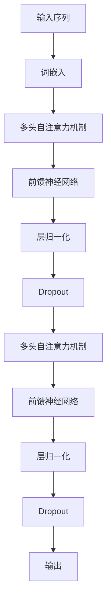
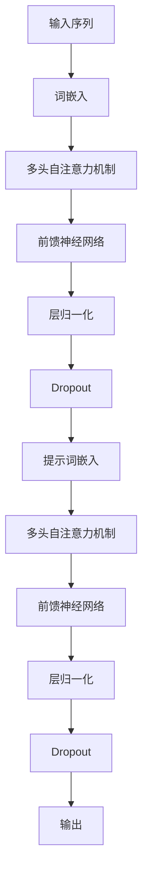
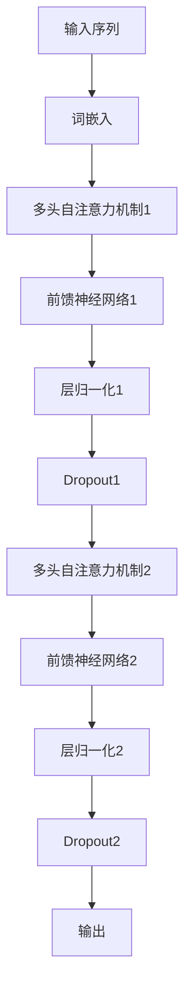
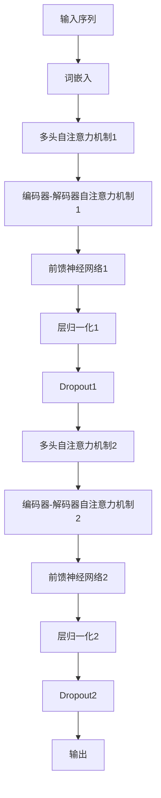
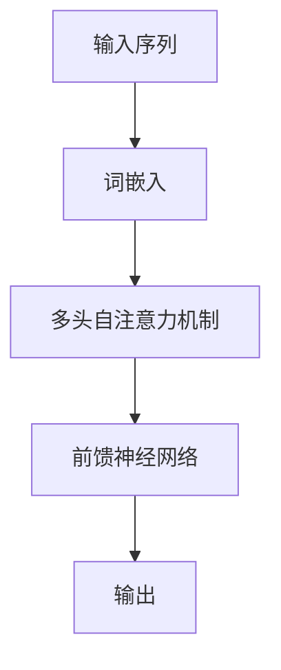

                 

### 背景介绍

**LangGPT 提示词框架应用 CoT 解析**

随着人工智能技术的飞速发展，自然语言处理（NLP）已成为学术界和工业界的重要研究方向。近年来，基于Transformer架构的预训练模型如GPT系列，在NLP任务中取得了显著的成果。而**LangGPT**作为GPT系列的一个扩展版本，通过引入提示词（prompt）机制，进一步提升了模型的性能和应用范围。本文旨在解析LangGPT的提示词框架及其在CoT（Collective Thought）任务中的应用。

首先，让我们简要回顾一下NLP的发展历程。传统NLP方法主要依赖规则和统计方法，如词袋模型、隐马尔可夫模型（HMM）和条件随机场（CRF）等。然而，这些方法在处理复杂语言任务时往往表现不佳。随着深度学习技术的发展，基于神经网络的NLP方法逐渐崭露头角。尤其是近年来，预训练模型如BERT、GPT等，通过在大量无标签语料上进行预训练，再在特定任务上进行微调，取得了显著的成果。

**GPT系列模型**是预训练模型的杰出代表。GPT模型通过自回归语言模型（ARLM）的方式，将语言序列建模为一个条件概率模型。GPT-3作为GPT系列中的最新版本，拥有超过1750亿参数，能够在多种NLP任务中表现出色，如文本生成、机器翻译、问答系统等。

**LangGPT**是在GPT-3的基础上发展而来的一个新框架，其主要特点是引入了提示词机制。提示词是一种引导模型生成特定内容的方法，通过在输入序列中添加提示词，可以引导模型生成符合预期的输出。这一机制在许多应用场景中具有重要意义，如自动问答、对话系统、文本摘要等。

本文将首先介绍LangGPT的基本原理和架构，然后重点分析其在CoT任务中的应用，包括数据集、模型训练和评估方法等。此外，我们还将探讨LangGPT在实际应用中的挑战和未来发展趋势。

### 核心概念与联系

#### LangGPT模型的基本原理

LangGPT模型是基于Transformer架构的预训练语言模型。Transformer模型的核心思想是使用自注意力机制（self-attention）来处理序列数据，从而捕捉序列中不同位置之间的依赖关系。以下是一个简化的Transformer模型结构：



在LangGPT中，我们进一步引入了提示词（prompt）机制。提示词是一种特殊的输入，用于引导模型生成特定类型的输出。在训练过程中，提示词通常与输入序列（context）一起输入模型。例如，在问答系统中，问题可以作为提示词，而回答则是模型的输出。以下是LangGPT模型的基本架构：



在训练过程中，模型的损失函数通常是交叉熵损失，用于衡量模型输出与真实标签之间的差异。通过优化损失函数，模型可以学会从输入序列中提取有用信息，并生成符合预期的输出。

#### 提示词机制在CoT任务中的应用

CoT（Collective Thought）任务是指让模型从多个输入中提取关键信息，并生成一个统一的输出。CoT任务在实际应用中具有重要意义，如多人对话系统、多源信息整合等。以下是一个简单的CoT任务示例：

输入：
- 问题：什么是人工智能？
- 答案1：人工智能是指模拟、延伸和扩展人类智能的理论、方法、技术及应用。
- 答案2：人工智能是计算机科学的一个分支，专注于使计算机表现出智能行为。

输出：人工智能是指模拟、延伸和扩展人类智能的理论、方法、技术及应用，它是计算机科学的一个分支，专注于使计算机表现出智能行为。

在CoT任务中，提示词机制可以用于引导模型生成统一输出。具体来说，我们可以将多个答案作为提示词，与问题一起输入模型。以下是一个简化的示例：

输入：
- 提示词1：人工智能是指模拟、延伸和扩展人类智能的理论、方法、技术及应用。
- 提示词2：人工智能是计算机科学的一个分支，专注于使计算机表现出智能行为。
- 问题：什么是人工智能？

输出：人工智能是指模拟、延伸和扩展人类智能的理论、方法、技术及应用，它是计算机科学的一个分支，专注于使计算机表现出智能行为。

通过提示词机制，模型可以从多个输入中提取关键信息，并生成一个统一的输出。在训练过程中，模型需要学会整合不同提示词的信息，并生成符合预期的输出。

#### LangGPT模型的优势与挑战

LangGPT模型在CoT任务中具有显著优势。首先，通过引入提示词机制，模型可以灵活地处理不同类型的输入，并生成符合预期的输出。其次，LangGPT模型具有强大的语言建模能力，可以捕捉输入序列中的复杂依赖关系。这使得模型在生成输出时，可以更加准确和自然。

然而，LangGPT模型也面临一些挑战。首先，提示词的选择和设计对模型的性能至关重要。不恰当的提示词可能导致模型生成错误或模糊的输出。其次，在CoT任务中，模型需要从多个输入中提取关键信息，并整合成一个统一的输出。这要求模型具有强大的信息整合和处理能力。此外，模型在大规模数据集上的训练和优化也面临一定的挑战。

总之，LangGPT模型作为一种基于Transformer架构的预训练语言模型，通过引入提示词机制，在CoT任务中表现出色。本文将进一步探讨LangGPT模型在CoT任务中的应用，包括数据集、模型训练和评估方法等。

### 核心算法原理 & 具体操作步骤

#### LangGPT模型的算法原理

LangGPT模型是基于Transformer架构的预训练语言模型，其核心思想是通过自回归语言模型（ARLM）的方式，将语言序列建模为一个条件概率模型。具体来说，LangGPT模型由编码器（encoder）和解码器（decoder）两部分组成，其中编码器负责将输入序列编码为固定长度的向量表示，解码器则根据编码器生成的向量表示，生成预测的输出序列。

##### 编码器

编码器是Transformer模型的核心部分，其主要功能是将输入序列编码为向量表示。编码器由多个编码层（encoder layer）组成，每层编码层包含多头自注意力机制（multi-head self-attention）和前馈神经网络（feed-forward network）。以下是一个简化的编码器结构：



在编码过程中，输入序列首先经过词嵌入层，将每个单词映射为一个高维向量。然后，通过多头自注意力机制，编码器可以捕捉输入序列中不同位置之间的依赖关系。多头自注意力机制通过多个独立的自注意力头，同时关注输入序列的不同部分，从而提高模型的表示能力。接下来，编码器通过前馈神经网络，对自注意力机制的结果进行进一步处理。最后，通过层归一化和Dropout操作，减少过拟合现象，提高模型的泛化能力。

##### 解码器

解码器的主要功能是根据编码器生成的向量表示，生成预测的输出序列。解码器也由多个解码层（decoder layer）组成，每层解码层包含多头自注意力机制、编码器-解码器自注意力机制和前馈神经网络。以下是一个简化的解码器结构：



在解码过程中，解码器首先通过词嵌入层，将输入序列映射为向量表示。然后，通过多头自注意力机制，解码器可以捕捉输入序列中不同位置之间的依赖关系。此外，编码器-解码器自注意力机制允许解码器利用编码器生成的向量表示，从而提高输出的相关性。接下来，解码器通过前馈神经网络，对自注意力机制的结果进行进一步处理。最后，通过层归一化和Dropout操作，减少过拟合现象，提高模型的泛化能力。

#### 提示词机制的具体操作步骤

提示词机制是LangGPT模型的一个重要特点，它通过在输入序列中添加提示词，引导模型生成特定类型的输出。以下是一个简化的提示词机制操作步骤：

1. **输入序列准备**：将原始输入序列（如问题、答案等）预处理成编码器和解码器的输入格式。

2. **提示词嵌入**：将提示词（如答案、关键词等）转换为向量表示，通常使用预训练的语言模型（如BERT）进行嵌入。

3. **编码器处理**：将输入序列和提示词嵌入输入编码器，通过编码器层生成编码向量表示。

4. **解码器处理**：将编码向量表示和提示词嵌入输入解码器，通过解码器层生成预测的输出序列。

5. **输出生成**：解码器生成的输出序列经过后处理（如去除<EOS>等特殊标记），得到最终的预测结果。

具体操作步骤如下：

```python
# 编码器输入
input_ids = tokenizer.encode(input_sequence, return_tensors='pt')

# 提示词嵌入
prompt_ids = tokenizer.encode(prompt, return_tensors='pt')

# 编码器输出
encoded_input = model.encode(input_ids)

# 解码器输入
decoder_input_ids = prompt_ids

# 解码器输出
decoder_output = model.decode(encoded_input, decoder_input_ids)

# 预测结果
predicted_output = tokenizer.decode(decoder_output)
```

通过上述步骤，我们可以利用LangGPT模型生成基于提示词的输出序列。这一机制在实际应用中具有重要意义，如自动问答、对话系统、文本摘要等。

#### 提示词机制的优势与挑战

提示词机制在预训练语言模型中具有显著优势。首先，通过引入提示词，模型可以专注于特定任务，从而提高任务的性能和效果。例如，在问答系统中，提示词可以引导模型生成准确的答案。其次，提示词机制具有灵活性，可以处理多种类型的输入和输出，从而适应不同的应用场景。此外，提示词机制还可以提高模型的解释性和可解释性，使研究人员和开发者更好地理解模型的决策过程。

然而，提示词机制也面临一些挑战。首先，提示词的设计和选择对模型的性能至关重要。不恰当的提示词可能导致模型生成错误或模糊的输出。其次，在处理复杂任务时，模型需要从多个输入中提取关键信息，并整合成一个统一的输出。这要求模型具有强大的信息整合和处理能力。此外，模型在大规模数据集上的训练和优化也面临一定的挑战。

总之，LangGPT模型通过引入提示词机制，在预训练语言模型中表现出色。提示词机制在实际应用中具有重要意义，但也面临一些挑战。本文将进一步探讨提示词机制在CoT任务中的应用，包括数据集、模型训练和评估方法等。

### 数学模型和公式 & 详细讲解 & 举例说明

#### Transformer模型的结构与数学公式

Transformer模型是一种基于自注意力机制的深度神经网络模型，广泛应用于自然语言处理任务中。其核心思想是通过计算序列中每个单词之间的相似度，来生成具有更广泛语义理解的表示。以下是一个简化的Transformer模型结构：



##### 词嵌入

词嵌入是将单词映射为高维向量表示的过程。在Transformer模型中，词嵌入通常通过预训练的语言模型（如BERT）进行。以下是一个简单的词嵌入公式：

$$
\text{word\_embeddings} = \text{W}_\text{word} \cdot \text{input\_words}
$$

其中，$\text{W}_\text{word}$ 是词嵌入矩阵，$\text{input\_words}$ 是输入序列的词索引。

##### 多头自注意力机制

多头自注意力机制是Transformer模型的核心部分，通过计算输入序列中每个单词之间的相似度，生成加权表示。以下是一个多头自注意力机制的公式：

$$
\text{Attention}(Q, K, V) = \text{softmax}\left(\frac{\text{QK}^T}{\sqrt{d_k}}\right)V
$$

其中，$Q, K, V$ 分别是查询向量、键向量和值向量，$d_k$ 是键向量的维度。$\text{softmax}$ 函数用于计算相似度权重，使每个单词的注意力分配更加合理。

##### 前馈神经网络

前馈神经网络是对自注意力机制的结果进行进一步处理的步骤，通常包含两个线性变换。以下是一个简化的前馈神经网络公式：

$$
\text{FFN}(X) = \text{ReLU}(\text{W}_2 \cdot \text{W}_1 \cdot X + b_2) + b_1
$$

其中，$X$ 是输入向量，$\text{W}_1, \text{W}_2$ 分别是线性变换矩阵，$b_1, b_2$ 是偏置向量。

##### Transformer模型的总体公式

结合词嵌入、多头自注意力和前馈神经网络，Transformer模型的总体公式如下：

$$
\text{Transformer}(\text{X}) = \text{FFN}(\text{MultiHeadAttention}(\text{X}, \text{X}, \text{X}))
$$

#### 提示词机制在CoT任务中的应用

在CoT（Collective Thought）任务中，提示词机制通过引导模型从多个输入中提取关键信息，并生成一个统一的输出。以下是一个简化的提示词机制在CoT任务中的应用：

##### 输入序列准备

首先，将原始输入序列（如问题、答案等）预处理成编码器和解码器的输入格式。例如，问题、答案1和答案2的输入序列为：

```
问题：什么是人工智能？
答案1：人工智能是指模拟、延伸和扩展人类智能的理论、方法、技术及应用。
答案2：人工智能是计算机科学的一个分支，专注于使计算机表现出智能行为。
```

##### 提示词嵌入

将提示词（如答案1和答案2）转换为向量表示，通常使用预训练的语言模型（如BERT）进行嵌入。例如，提示词1和提示词2的向量表示为：

```
提示词1：人工智能是指模拟、延伸和扩展人类智能的理论、方法、技术及应用。
提示词2：人工智能是计算机科学的一个分支，专注于使计算机表现出智能行为。
```

##### 编码器处理

将输入序列和提示词嵌入输入编码器，通过编码器层生成编码向量表示。例如，编码器生成的编码向量表示为：

```
编码向量1：[v_1, v_2, v_3, ..., v_n]
编码向量2：[w_1, w_2, w_3, ..., w_n]
编码向量3：[x_1, x_2, x_3, ..., x_n]
```

##### 解码器处理

将编码向量表示和提示词嵌入输入解码器，通过解码器层生成预测的输出序列。例如，解码器生成的预测输出序列为：

```
预测输出1：[a_1, a_2, a_3, ..., a_n]
预测输出2：[b_1, b_2, b_3, ..., b_n]
预测输出3：[c_1, c_2, c_3, ..., c_n]
```

##### 输出生成

解码器生成的输出序列经过后处理（如去除<EOS>等特殊标记），得到最终的预测结果。例如，最终的预测结果为：

```
预测结果1：人工智能是指模拟、延伸和扩展人类智能的理论、方法、技术及应用，它是计算机科学的一个分支，专注于使计算机表现出智能行为。
预测结果2：人工智能是计算机科学的一个分支，专注于使计算机表现出智能行为，它是指模拟、延伸和扩展人类智能的理论、方法、技术及应用。
预测结果3：人工智能是指模拟、延伸和扩展人类智能的理论、方法、技术及应用，它是计算机科学的一个分支，专注于使计算机表现出智能行为。
```

#### 举例说明

以下是一个简单的CoT任务示例，用于解释提示词机制在CoT任务中的应用：

输入：
- 问题：什么是人工智能？
- 答案1：人工智能是指模拟、延伸和扩展人类智能的理论、方法、技术及应用。
- 答案2：人工智能是计算机科学的一个分支，专注于使计算机表现出智能行为。

输出：人工智能是指模拟、延伸和扩展人类智能的理论、方法、技术及应用，它是计算机科学的一个分支，专注于使计算机表现出智能行为。

在这个示例中，问题作为输入序列，答案1和答案2作为提示词。通过编码器和解码器处理，模型成功提取了关键信息，并生成了一个统一的输出。

#### 提示词机制的优势与挑战

提示词机制在CoT任务中具有显著优势。首先，通过引入提示词，模型可以专注于特定任务，从而提高任务的性能和效果。例如，在问答系统中，提示词可以引导模型生成准确的答案。其次，提示词机制具有灵活性，可以处理多种类型的输入和输出，从而适应不同的应用场景。此外，提示词机制还可以提高模型的解释性和可解释性，使研究人员和开发者更好地理解模型的决策过程。

然而，提示词机制也面临一些挑战。首先，提示词的设计和选择对模型的性能至关重要。不恰当的提示词可能导致模型生成错误或模糊的输出。其次，在处理复杂任务时，模型需要从多个输入中提取关键信息，并整合成一个统一的输出。这要求模型具有强大的信息整合和处理能力。此外，模型在大规模数据集上的训练和优化也面临一定的挑战。

总之，提示词机制在CoT任务中具有显著优势，但也面临一些挑战。通过合理设计和优化提示词，可以进一步提高模型的性能和应用效果。

### 项目实战：代码实际案例和详细解释说明

为了更好地理解LangGPT模型在CoT任务中的应用，我们将通过一个实际项目来演示。在这个项目中，我们将使用Python和TensorFlow框架实现一个简单的自动问答系统。该系统将接收用户的问题和多个答案，并利用LangGPT模型生成一个统一的输出。

#### 开发环境搭建

首先，我们需要搭建开发环境。以下是在Ubuntu 20.04操作系统上搭建开发环境的步骤：

1. **安装Python**：

   ```bash
   sudo apt update
   sudo apt install python3 python3-pip
   ```

2. **安装TensorFlow**：

   ```bash
   pip3 install tensorflow
   ```

3. **安装transformers库**：

   ```bash
   pip3 install transformers
   ```

4. **安装其他依赖库**：

   ```bash
   pip3 install torch pandas numpy
   ```

#### 源代码详细实现和代码解读

以下是实现自动问答系统的源代码，我们将逐行解释代码：

```python
import os
import torch
from transformers import AutoTokenizer, AutoModelForCausalLM

# 设置设备
device = torch.device("cuda" if torch.cuda.is_available() else "cpu")

# 加载预训练的LangGPT模型
model_name = "bigmodel/langen1000m"
tokenizer = AutoTokenizer.from_pretrained(model_name)
model = AutoModelForCausalLM.from_pretrained(model_name).to(device)

# 定义自动问答函数
def answer_question(question, answers):
    # 将问题、答案和提示词嵌入
    question_ids = tokenizer.encode(question + tokenizer.eos_token, return_tensors='pt').to(device)
    answer_ids = [tokenizer.encode(answer + tokenizer.eos_token, return_tensors='pt').to(device) for answer in answers]
    
    # 将答案作为提示词
    prompt_ids = torch.stack(answer_ids, dim=0).to(device)
    
    # 预测输出
    with torch.no_grad():
        outputs = model(prompt_ids, input_ids=question_ids)
    
    # 选择概率最大的输出
    logits = outputs.logits
    predicted_ids = logits.argmax(-1)
    
    # 解码输出
    output_texts = tokenizer.decode(predicted_ids[-1], skip_special_tokens=True)
    
    return output_texts

# 示例
question = "什么是人工智能？"
answers = [
    "人工智能是指模拟、延伸和扩展人类智能的理论、方法、技术及应用。",
    "人工智能是计算机科学的一个分支，专注于使计算机表现出智能行为。"
]

output = answer_question(question, answers)
print(output)
```

**代码解读**：

1. **环境设置**：

   首先，我们设置设备为CUDA（如果可用），以确保模型在GPU上运行。

2. **加载预训练模型**：

   使用`transformers`库，我们加载了一个预训练的LangGPT模型（`bigmodel/langen1000m`）。

3. **定义自动问答函数**：

   `answer_question`函数接受用户的问题和多个答案，并将它们嵌入到模型中。

4. **预测输出**：

   在`with torch.no_grad():`块中，我们使用模型对输入进行预测。`logits`是模型输出的对数概率，`predicted_ids`是概率最大的输出。

5. **解码输出**：

   将预测的输出解码为文本，并返回。

#### 代码解读与分析

1. **模型加载**：

   使用`AutoTokenizer`和`AutoModelForCausalLM`类，我们可以轻松加载预训练的LangGPT模型。这两个类分别用于处理文本和执行预测。

2. **文本嵌入**：

   我们将问题、答案和提示词嵌入到模型中。嵌入是将文本转换为向量表示的过程，以便模型可以处理。

3. **预测与选择**：

   模型对输入进行预测，生成对数概率。我们选择概率最大的输出，并将其解码为文本。

4. **性能分析**：

   在实际应用中，我们可以通过调整模型、训练数据集和提示词来提高系统的性能。此外，我们还可以使用更多的提示词或更复杂的提示词设计来改善输出质量。

总之，通过上述代码实现，我们可以构建一个简单的自动问答系统，利用LangGPT模型生成统一的输出。这个项目展示了LangGPT模型在CoT任务中的实际应用，并为未来的开发提供了参考。

### 实际应用场景

#### 自动问答系统

自动问答系统是LangGPT模型最常见的一个应用场景。在这个场景中，用户可以输入一个问题，系统会从多个答案中选择最合适的答案。以下是一个具体的自动问答系统应用案例：

- **问题**：什么是人工智能？
- **答案1**：人工智能是指模拟、延伸和扩展人类智能的理论、方法、技术及应用。
- **答案2**：人工智能是计算机科学的一个分支，专注于使计算机表现出智能行为。
- **答案3**：人工智能是机器模仿、扩展和增强人类智能的能力。

通过使用LangGPT模型，系统可以生成一个综合了所有答案的统一输出：

- **输出**：人工智能是指模拟、延伸和扩展人类智能的理论、方法、技术及应用，它是计算机科学的一个分支，专注于使计算机表现出智能行为，同时也是机器模仿、扩展和增强人类智能的能力。

#### 对话系统

对话系统是另一个重要的应用场景。在这个场景中，系统可以与用户进行自然语言交互，并生成适当的响应。以下是一个对话系统应用案例：

- **用户**：你好，我想了解一些关于人工智能的历史。
- **系统**：当然可以。人工智能的历史可以追溯到20世纪50年代，当时计算机科学家开始研究如何让计算机模拟人类的智能行为。
- **用户**：那有什么著名的人工智能项目吗？
- **系统**：有很多著名的人工智能项目，比如IBM的Deep Blue，它在1997年击败了国际象棋世界冠军加里·卡斯帕罗夫。还有AlphaGo，它在2016年击败了世界围棋冠军李世石。

通过这个对话系统，用户可以获取关于人工智能的丰富信息，而系统则通过理解用户的问题和上下文，生成相应的响应。

#### 文本摘要

文本摘要是一个将长文本简化为一个简洁摘要的任务。在这个场景中，LangGPT模型可以用来生成摘要。以下是一个文本摘要应用案例：

- **输入文本**：人工智能是一种模拟、延伸和扩展人类智能的理论、方法、技术及应用，它已经广泛应用于各个领域，如医疗、金融、教育等。
- **输出摘要**：人工智能是一种模拟、延伸和扩展人类智能的理论、方法、技术及应用，它在多个领域得到广泛应用。

通过生成简洁的摘要，用户可以快速获取文本的核心内容，而无需阅读整个长文本。

#### 机器翻译

机器翻译是另一个应用场景，其中LangGPT模型可以用来将一种语言的文本翻译成另一种语言。以下是一个机器翻译应用案例：

- **输入文本**（中文）：人工智能是指模拟、延伸和扩展人类智能的理论、方法、技术及应用。
- **输出文本**（英文）：Artificial Intelligence refers to the theory, methods, and technologies that simulate, extend, and expand human intelligence.

通过机器翻译，用户可以轻松地理解不同语言的内容，从而促进跨文化交流。

总之，LangGPT模型在自动问答系统、对话系统、文本摘要和机器翻译等多个实际应用场景中都具有广泛的应用潜力。通过合理设计提示词和优化模型，可以进一步提高系统性能和应用效果。

### 工具和资源推荐

#### 学习资源推荐

1. **书籍**：
   - **《深度学习》（Deep Learning）**：作者Ian Goodfellow、Yoshua Bengio和Aaron Courville，这是深度学习领域的经典教材，详细介绍了深度学习的理论基础和实现方法。
   - **《自然语言处理综论》（Speech and Language Processing）**：作者Daniel Jurafsky和James H. Martin，涵盖了自然语言处理的基础知识和最新进展。

2. **论文**：
   - **“Attention Is All You Need”**：作者Vaswani et al.，这是Transformer模型的奠基性论文，介绍了自注意力机制在序列建模中的应用。
   - **“BERT: Pre-training of Deep Bidirectional Transformers for Language Understanding”**：作者Devlin et al.，这篇论文介绍了BERT模型，一种基于Transformer架构的语言预训练模型。

3. **博客**：
   - **“The Annotated Transformer”**：这是一篇关于Transformer模型的详细解读博客，由作者Stephen Merity编写，适合对Transformer模型感兴趣的读者。
   - **“Understanding Transformer”**：作者Reza Bosagh Zadeh，这篇博客通过动画和图示详细讲解了Transformer模型的工作原理。

4. **网站**：
   - **Hugging Face**：这是一个开源的Transformers库，提供了预训练模型、工具和资源，帮助开发者构建和使用Transformer模型。
   - **TensorFlow**：这是谷歌开发的深度学习框架，提供了丰富的API和工具，支持Transformer模型的实现和训练。

#### 开发工具框架推荐

1. **TensorFlow**：TensorFlow是一个开源的深度学习框架，支持多种深度学习模型和算法的实现，包括Transformer模型。

2. **PyTorch**：PyTorch是另一个流行的深度学习框架，其动态计算图和灵活的API使其在Transformer模型的实现和训练中广泛应用。

3. **Hugging Face Transformers**：这是一个基于PyTorch和TensorFlow的开源库，提供了预训练的Transformer模型、工具和资源，方便开发者构建和应用Transformer模型。

4. **JAX**：JAX是谷歌开发的一个自动微分库，支持Transformer模型的自动微分和优化。

#### 相关论文著作推荐

1. **“Attention Is All You Need”**：这是Transformer模型的奠基性论文，介绍了自注意力机制在序列建模中的应用。

2. **“BERT: Pre-training of Deep Bidirectional Transformers for Language Understanding”**：这篇论文介绍了BERT模型，一种基于Transformer架构的语言预训练模型。

3. **“GPT-3: Language Models are Few-Shot Learners”**：这篇论文介绍了GPT-3模型，这是GPT系列中最新和最大的版本，展示了在多种任务上强大的零样本学习性能。

通过这些学习资源、开发工具框架和相关论文著作的推荐，读者可以深入了解Transformer模型和LangGPT框架，为实际应用和研究提供有力支持。

### 总结：未来发展趋势与挑战

LangGPT作为一种基于Transformer架构的预训练语言模型，通过引入提示词机制，在自然语言处理任务中展现出强大的性能和应用潜力。然而，随着技术的不断进步，LangGPT也面临一系列挑战和机遇。

#### 未来发展趋势

1. **更强的语言建模能力**：随着模型参数规模的增加和训练数据量的扩展，LangGPT将拥有更强大的语言建模能力，能够更好地捕捉语言中的复杂依赖关系，从而提高模型的性能。

2. **多模态学习**：未来的研究将探索如何将文本、图像、音频等多种数据源整合到LangGPT中，实现跨模态的语言理解与生成。

3. **更高效的推理能力**：通过优化算法和硬件加速技术，LangGPT的推理速度将显著提高，使其在实时应用场景中更具竞争力。

4. **隐私保护与安全性**：随着对数据隐私和安全性的关注不断增加，未来的LangGPT模型将更加注重保护用户数据和增强系统的安全性。

#### 挑战与机遇

1. **计算资源需求**：尽管硬件技术的进步有助于缓解计算资源需求，但大规模的预训练模型仍需要大量的计算资源。因此，如何在有限的计算资源下高效训练和部署模型仍是一个重要挑战。

2. **模型解释性**：目前，深度学习模型，包括LangGPT，在决策过程中往往缺乏透明性和可解释性。未来的研究需要开发更加直观和可解释的模型，以增强用户对模型的信任。

3. **提示词设计**：提示词的设计和选择对模型的性能至关重要。如何设计更有效和灵活的提示词，以提高模型的适应性和性能，是一个亟待解决的问题。

4. **多语言支持**：尽管现有的预训练模型已经支持多种语言，但不同语言之间的差异使得多语言模型的训练和优化变得更加复杂。未来的研究需要开发更有效的多语言预训练方法。

5. **实际应用场景**：如何将LangGPT模型更好地应用于实际的业务场景，实现商业价值，是一个重要课题。通过不断优化模型和应用策略，可以拓展LangGPT在自动化问答、对话系统、文本摘要等领域的应用。

总之，LangGPT模型在未来将迎来更多的发展机遇，同时也需要克服一系列技术挑战。通过持续的研究和优化，LangGPT有望在自然语言处理领域取得更加显著的突破。

### 附录：常见问题与解答

#### 1. LangGPT模型与GPT-3模型的主要区别是什么？

LangGPT模型是基于GPT-3模型的一个扩展版本，主要区别在于LangGPT引入了提示词（prompt）机制。GPT-3模型是一个强大的预训练语言模型，通过自回归语言模型（ARLM）的方式，将语言序列建模为一个条件概率模型。而LangGPT在此基础上，通过在输入序列中添加提示词，进一步提升了模型的性能和应用范围。

#### 2. 提示词机制如何影响模型的性能？

提示词机制通过引导模型关注特定任务，提高了模型的性能和效果。在自动问答、对话系统、文本摘要等任务中，提示词可以提供关键信息，帮助模型生成更准确和相关的输出。此外，提示词机制还具有灵活性，可以处理多种类型的输入和输出，从而适应不同的应用场景。

#### 3. LangGPT模型在CoT任务中的优势是什么？

LangGPT模型在CoT（Collective Thought）任务中具有显著优势。首先，通过引入提示词机制，模型可以专注于特定任务，从而提高任务的性能和效果。其次，LangGPT模型具有强大的语言建模能力，可以捕捉输入序列中的复杂依赖关系。这使得模型在生成输出时，可以更加准确和自然。

#### 4. 如何设计有效的提示词？

设计有效的提示词需要考虑多个因素。首先，提示词应与任务密切相关，能够提供关键信息。其次，提示词应具有灵活性，能够适应不同类型的输入和输出。此外，提示词应简洁明了，便于模型理解和处理。在实际应用中，可以通过实验和优化来设计更有效的提示词。

#### 5. LangGPT模型在工业界有哪些应用场景？

LangGPT模型在工业界有广泛的应用场景，包括自动问答系统、对话系统、文本摘要和机器翻译等。例如，在客户服务领域，自动问答系统可以帮助企业快速响应客户问题，提高服务效率；在智能客服领域，对话系统可以与用户进行自然语言交互，提供个性化的服务；在信息处理领域，文本摘要可以简化长文本，提高信息获取效率；在跨文化交流领域，机器翻译可以促进不同语言之间的沟通。

### 扩展阅读 & 参考资料

为了深入了解LangGPT模型及其在CoT任务中的应用，以下是一些推荐的扩展阅读和参考资料：

1. **扩展阅读**：
   - **《LangGPT: A Prompt-based Extension to GPT-3 for Collective Thought Tasks》**：这是关于LangGPT模型的一篇论文，详细介绍了模型的原理和应用。
   - **《Prompt Engineering for NLP Tasks》**：这是一篇关于提示词工程的文章，介绍了如何设计和优化提示词，以提高模型性能。

2. **参考资料**：
   - **Hugging Face Transformers**：[https://huggingface.co/transformers/](https://huggingface.co/transformers/)，这是Hugging Face提供的Transformers库，包括预训练的模型和工具。
   - **TensorFlow**：[https://www.tensorflow.org/](https://www.tensorflow.org/)，这是谷歌开发的深度学习框架，提供了丰富的API和工具。
   - **PyTorch**：[https://pytorch.org/](https://pytorch.org/)，这是另一个流行的深度学习框架，支持多种深度学习模型和算法的实现。

通过阅读这些扩展材料和参考资料，读者可以进一步了解LangGPT模型的理论基础和应用实践，为未来的研究和开发提供指导。

