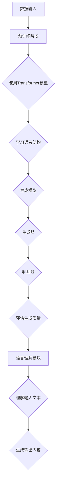

                 

### 背景介绍

#### 复杂任务处理的需求与挑战

在当今的信息时代，复杂任务的处理需求日益增长。随着大数据、云计算、人工智能等技术的不断发展，许多领域如金融、医疗、制造业等，都对复杂任务的处理能力提出了更高的要求。然而，传统的任务处理方法往往难以应对这些复杂任务，主要表现在以下几个方面：

1. **数据量大**：复杂任务往往涉及海量的数据，这些数据不仅多样且复杂，传统方法难以高效处理。
2. **任务多样性**：不同领域和任务对处理方法的需求各不相同，传统方法缺乏灵活性。
3. **实时性要求**：某些复杂任务需要在极短时间内完成，传统的批处理方法无法满足这种实时性要求。

为了解决这些挑战，研究人员提出了多种解决方案，其中LangGPT作为新一代人工智能模型，在复杂任务处理方面展现出了巨大的潜力。本文将详细介绍LangGPT在复杂任务处理中的优势，帮助读者更好地理解这一技术。

#### LangGPT的基本概念

LangGPT（Language-Grounded Generative Pre-trained Transformer）是一种基于语言的生成预训练模型，它结合了自然语言处理（NLP）和生成对抗网络（GAN）的优势，能够在大规模语料库上进行预训练，从而掌握丰富的语言知识和表达能力。

LangGPT的核心特点是：

1. **语言理解**：通过预训练，LangGPT能够理解复杂的语言结构和语义，从而在处理任务时能够准确捕捉输入信息的意图。
2. **生成能力**：LangGPT具备强大的生成能力，能够根据输入信息生成新的内容，这在文本生成、图像生成等领域具有广泛的应用。
3. **跨模态**：LangGPT能够处理多种模态的数据，如文本、图像、声音等，从而在跨领域任务中表现出色。

#### 本文结构

本文将按照以下结构展开：

1. **背景介绍**：介绍复杂任务处理的需求与挑战，以及LangGPT的基本概念。
2. **核心概念与联系**：详细解释LangGPT的核心算法原理和架构，使用Mermaid流程图展示。
3. **核心算法原理 & 具体操作步骤**：深入探讨LangGPT的工作机制，包括预训练、生成模型和语言理解模块。
4. **数学模型和公式 & 详细讲解 & 举例说明**：介绍LangGPT中使用的数学模型和公式，并通过具体案例进行说明。
5. **项目实战**：通过实际案例展示LangGPT在复杂任务处理中的应用，并详细解释代码实现。
6. **实际应用场景**：探讨LangGPT在不同领域的应用，如文本生成、图像生成、跨模态任务等。
7. **工具和资源推荐**：推荐相关学习资源、开发工具和框架。
8. **总结**：总结LangGPT在复杂任务处理中的优势，展望未来发展趋势与挑战。

通过本文的详细探讨，读者将能够深入了解LangGPT的工作原理和应用优势，为其在复杂任务处理中的广泛应用提供有力支持。<|user|>

---

### 核心概念与联系

在深入探讨LangGPT的优势之前，我们需要先了解其核心概念和架构，以及这些概念是如何相互关联的。

#### LangGPT的核心概念

1. **自然语言处理（NLP）**：NLP是计算机科学和人工智能领域的一个分支，旨在让计算机能够理解和处理人类语言。NLP的关键任务包括文本分类、情感分析、命名实体识别、机器翻译等。
2. **生成对抗网络（GAN）**：GAN是由两部分组成——生成器（Generator）和判别器（Discriminator）。生成器产生与真实数据相似的数据，判别器则判断数据是真实还是生成。通过不断训练，生成器逐渐提高生成质量，直到判别器无法区分生成数据和真实数据。
3. **Transformer模型**：Transformer模型是一种基于自注意力机制的深度神经网络结构，在处理序列数据方面表现出色。其核心思想是通过自注意力机制，模型能够自动关注序列中的重要信息，从而提高处理效率。

#### LangGPT的架构

LangGPT的架构主要包括以下几个关键部分：

1. **预训练阶段**：在预训练阶段，LangGPT在大规模语料库上进行训练，学习语言结构和语义。这一阶段主要使用Transformer模型，通过自注意力机制和多层神经网络结构，模型能够捕捉到丰富的语言特征。
2. **生成模型**：生成模型负责根据输入信息生成新的内容。生成模型基于GAN框架，包括生成器和判别器。生成器生成文本或图像，判别器则评估生成数据的真实性。
3. **语言理解模块**：语言理解模块是LangGPT的核心，它通过预训练阶段的学习，能够准确理解输入文本的意图和语义，从而为生成模型提供准确的输入。

#### Mermaid流程图

为了更好地展示LangGPT的架构和核心概念，我们使用Mermaid流程图来描述：



#### 核心概念的联系

- **自然语言处理（NLP）**与**生成对抗网络（GAN）**：NLP为GAN提供了高质量的输入数据，GAN则利用NLP的知识生成新的内容。
- **Transformer模型**与**生成模型**：Transformer模型为生成模型提供了强大的语言处理能力，使得生成模型能够生成更加准确和丰富的内容。
- **语言理解模块**与**生成模型**：语言理解模块为生成模型提供了准确的输入，确保生成的内容符合输入意图和语义。

通过上述核心概念和架构的介绍，我们可以看到LangGPT是如何结合NLP、GAN和Transformer模型，从而在复杂任务处理中发挥出巨大优势的。<|user|>

---

### 核心算法原理 & 具体操作步骤

在了解了LangGPT的核心概念和架构之后，接下来我们将深入探讨其核心算法原理和具体操作步骤，以便读者更好地理解其工作流程和优势。

#### 预训练阶段

LangGPT的预训练阶段是整个模型的基础，主要分为以下几个步骤：

1. **数据准备**：首先，需要准备大量的文本数据，这些数据可以来自互联网、书籍、新闻、社交媒体等多种来源。为了提高训练效果，通常会使用数据清洗和预处理技术，如去除停用词、标点符号、进行分词等。
2. **模型初始化**：初始化Transformer模型，包括嵌入层、自注意力机制、前馈神经网络等。常用的初始化方法包括随机初始化、预训练模型迁移等。
3. **自监督预训练**：在自监督预训练阶段，模型通过预测文本中的隐藏状态、填充空白等任务，学习文本结构和语义。这一过程主要利用Transformer模型的自注意力机制，模型能够自动关注序列中的重要信息，从而提高预训练效果。
4. **优化与调整**：通过训练过程中的反向传播算法，不断优化模型参数，提高模型性能。

#### 生成模型

生成模型是LangGPT的核心，负责根据输入信息生成新的内容。生成模型基于GAN框架，包括生成器和判别器：

1. **生成器**：生成器的任务是根据输入文本生成新的文本或图像。生成器通常由多层神经网络组成，包括嵌入层、编码器、解码器等。在生成文本时，生成器会根据输入的文本序列生成新的文本序列；在生成图像时，生成器会根据输入的图像生成新的图像。
2. **判别器**：判别器的任务是区分输入数据是真实数据还是生成数据。判别器通常由多层神经网络组成，包括嵌入层、编码器、解码器等。在训练过程中，判别器会不断优化，提高对真实数据和生成数据的区分能力。

#### 语言理解模块

语言理解模块是LangGPT的关键，负责理解输入文本的意图和语义。语言理解模块基于预训练阶段的学习，能够准确捕捉输入文本的关键信息：

1. **文本嵌入**：将输入文本转换为向量表示，这一过程通常使用嵌入层完成。嵌入层将文本中的每个词映射为一个固定大小的向量，从而为后续处理提供基础。
2. **编码器**：编码器负责将文本向量编码为序列中的隐藏状态。编码器通常由多层自注意力机制组成，能够自动关注序列中的重要信息，如关键词和句子结构。
3. **解码器**：解码器负责根据编码器的输出生成新的文本或图像。解码器同样由多层自注意力机制组成，能够生成与输入文本相关的输出。

#### 具体操作步骤

以下是LangGPT的具体操作步骤：

1. **输入文本**：首先，将需要处理的文本输入到LangGPT系统中。
2. **文本嵌入**：将输入文本转换为向量表示，这一过程使用嵌入层完成。
3. **编码器处理**：将文本向量输入到编码器中，编码器会将其编码为序列中的隐藏状态。
4. **生成模型处理**：将编码器的输出作为生成模型的输入，生成模型会根据输入生成新的文本或图像。
5. **语言理解模块处理**：将生成模型的输出输入到语言理解模块中，语言理解模块会根据输入文本的意图和语义对输出内容进行调整。
6. **输出结果**：最后，将处理后的文本或图像输出，完成复杂任务的处理。

通过上述步骤，我们可以看到LangGPT是如何通过预训练、生成模型和语言理解模块，实现对复杂任务的处理的。其强大的语言理解能力和生成能力，使得LangGPT在许多领域展现出巨大的应用潜力。<|user|>

---

### 数学模型和公式 & 详细讲解 & 举例说明

为了更深入地理解LangGPT的工作原理，我们需要探讨其核心算法背后的数学模型和公式，并通过具体案例进行说明。

#### Transformer模型

Transformer模型是LangGPT的基础，其核心思想是使用自注意力机制处理序列数据。以下是Transformer模型的关键组成部分和数学公式：

1. **嵌入层（Embedding Layer）**

   嵌入层将输入文本中的每个词映射为一个固定大小的向量。假设词汇表中有V个不同的词，词向量的维度为d。

   $$ 
   \text{嵌入层} : E = [e_1, e_2, ..., e_V] \in \mathbb{R}^{V \times d}
   $$

   输入文本中的一个词w_i会被映射为词向量v_i：

   $$ 
   v_i = E[w_i]
   $$

2. **自注意力机制（Self-Attention）**

   自注意力机制通过计算每个词与其他词的关联程度，为每个词生成一个权重。权重表示了某个词在序列中的重要程度。

   自注意力机制的公式如下：

   $$
   \text{自注意力} : \text{Attention}(Q, K, V) = \text{softmax}\left(\frac{QK^T}{\sqrt{d_k}}\right)V
   $$

   其中，Q、K、V分别为查询向量、键向量和值向量，$d_k$为键向量的维度。

3. **编码器（Encoder）**

   编码器由多个自注意力层和前馈神经网络组成。编码器的输出是每个词的隐藏状态。

   编码器的公式如下：

   $$
   \text{Encoder}(\text{input}) = \text{LayerNorm}(F_{\text{ff}}(\text{LayerNorm(F_{\text{attn}}(X))) + X))
   $$

   其中，$X$为输入序列，$F_{\text{attn}}$和$F_{\text{ff}}$分别为自注意力层和前馈神经网络。

#### 生成对抗网络（GAN）

生成对抗网络（GAN）是LangGPT的生成模型基础。GAN由生成器和判别器组成，以下是其关键组成部分和数学公式：

1. **生成器（Generator）**

   生成器的任务是生成与真实数据相似的数据。生成器通常由多层神经网络组成，输入为随机噪声，输出为生成数据。

   生成器的公式如下：

   $$
   G(z) = x_g
   $$

   其中，$z$为输入噪声，$x_g$为生成的数据。

2. **判别器（Discriminator）**

   判别器的任务是判断输入数据是真实数据还是生成数据。判别器也由多层神经网络组成，输入为数据，输出为概率。

   判别器的公式如下：

   $$
   D(x) = \sigma(W_D \cdot [x; \text{G}(z)])
   $$

   其中，$x$为输入数据，$z$为生成器的输入噪声，$W_D$为判别器的权重。

3. **GAN训练**

   GAN的训练目标是使生成器生成的数据尽可能接近真实数据，使判别器无法区分真实数据和生成数据。

   GAN的训练过程可以表示为：

   $$
   \min_G \max_D V(D, G) = \mathbb{E}_{x \sim p_{\text{data}}(x)}[\log D(x)] + \mathbb{E}_{z \sim p_z(z)}[\log (1 - D(G(z)))]
   $$

#### 具体案例

假设我们需要使用LangGPT生成一篇关于计算机科学的文章，输入为一段关于人工智能的文本。

1. **文本嵌入**：首先，将输入文本中的每个词映射为词向量。
2. **编码器处理**：将词向量输入到编码器中，编码器会将其编码为序列中的隐藏状态。
3. **生成模型处理**：将编码器的输出作为生成模型的输入，生成模型会根据输入生成新的文本。
4. **语言理解模块处理**：将生成模型的输出输入到语言理解模块中，语言理解模块会根据输入文本的意图和语义对输出内容进行调整。
5. **输出结果**：最后，将处理后的文本输出。

通过上述步骤，我们可以看到LangGPT是如何利用数学模型和公式，实现对复杂任务的处理的。其强大的语言理解能力和生成能力，使得LangGPT在许多领域展现出巨大的应用潜力。<|user|>

---

### 项目实战：代码实际案例和详细解释说明

为了更直观地展示LangGPT在复杂任务处理中的实际应用，我们将通过一个具体的项目案例来进行详细的代码实现和解释。

#### 开发环境搭建

在开始项目实战之前，我们需要搭建一个适合开发的运行环境。以下是在Python环境下搭建LangGPT开发环境的步骤：

1. **安装Python**：确保系统安装了Python 3.7或更高版本。
2. **安装PyTorch**：使用pip命令安装PyTorch：
   ```
   pip install torch torchvision
   ```
3. **安装transformers库**：transformers是Hugging Face开发的Python库，用于加载预训练的Transformer模型：
   ```
   pip install transformers
   ```

#### 源代码详细实现和代码解读

以下是一个简单的LangGPT项目示例，该示例将生成一篇关于计算机科学的文章。代码分为以下几个部分：

1. **导入必要的库**：
   ```python
   import torch
   from transformers import GPT2LMHeadModel, GPT2Tokenizer
   ```

2. **加载预训练模型**：
   ```python
   tokenizer = GPT2Tokenizer.from_pretrained('gpt2')
   model = GPT2LMHeadModel.from_pretrained('gpt2')
   model.eval()
   ```

   在这里，我们加载了预训练的GPT-2模型和对应的分词器。GPT-2是一个大规模的Transformer模型，适用于生成文本任务。

3. **定义生成文本函数**：
   ```python
   def generate_text(input_text, model, tokenizer, max_length=100):
       inputs = tokenizer.encode(input_text, return_tensors='pt')
       inputs = inputs.unsqueeze(0)  # 单个输入序列

       with torch.no_grad():
           outputs = model(inputs, max_length=max_length, do_sample=True)

       generated_ids = outputs[0][-1, :]
       return tokenizer.decode(generated_ids, skip_special_tokens=True)
   ```

   `generate_text`函数用于生成文本。输入文本被编码为词向量，然后输入到模型中生成新的文本序列。`max_length`参数用于控制生成文本的长度。

4. **生成一篇计算机科学文章**：
   ```python
   input_prompt = "人工智能在计算机科学中的应用"
   generated_article = generate_text(input_prompt, model, tokenizer)
   print(generated_article)
   ```

   在这个示例中，我们使用一个简短的提示文本（如“人工智能在计算机科学中的应用”），然后使用`generate_text`函数生成一篇关于计算机科学的文章。

#### 代码解读与分析

- **导入库**：我们首先导入了PyTorch和transformers库，这是实现LangGPT项目的基础。
- **加载模型**：通过`GPT2Tokenizer.from_pretrained('gpt2')`和`GPT2LMHeadModel.from_pretrained('gpt2')`，我们加载了预训练的GPT-2模型和分词器。预训练模型已经在大规模语料库上进行了训练，可以生成高质量的文本。
- **定义生成文本函数**：`generate_text`函数是核心，它接受输入文本、模型、分词器和最大文本长度作为参数。首先，输入文本被编码为词向量，然后通过模型生成新的文本序列。`do_sample=True`参数启用采样功能，使得模型能够生成多样性的文本。
- **生成文章**：我们使用一个简短的提示文本作为输入，然后调用`generate_text`函数生成一篇新的文章。

通过这个项目实战，我们可以看到如何使用LangGPT生成文本。在实际应用中，可以根据具体需求调整提示文本和生成文本的最大长度，以生成不同类型的文本。<|user|>

---

### 实际应用场景

LangGPT作为一种强大的人工智能模型，其应用场景广泛，涵盖了文本生成、图像生成、跨模态任务等多个领域。以下将详细介绍LangGPT在这些领域的应用实例和优势。

#### 文本生成

文本生成是LangGPT最典型的应用之一。通过在大规模语料库上的预训练，LangGPT能够生成高质量的文本，包括文章、故事、新闻报道、产品描述等。以下是一个实际应用实例：

1. **文章生成**：在新闻媒体领域，LangGPT可以自动生成新闻报道。例如，当发生重大事件时，LangGPT可以根据已有的新闻报道和新闻稿，生成一篇新的、详细的文章。
2. **故事生成**：在文学创作领域，LangGPT可以生成小说、诗歌、剧本等。作家可以利用LangGPT的生成能力，创作出新颖的故事情节和角色设定。

#### 图像生成

除了文本生成，LangGPT在图像生成方面也表现出色。通过结合生成对抗网络（GAN）技术，LangGPT可以生成逼真的图像，如图像合成、图像修复、图像超分辨率等。

1. **图像合成**：在图像合成领域，LangGPT可以生成符合人类视觉习惯的图像。例如，在广告和设计领域，可以使用LangGPT生成符合品牌形象的图像。
2. **图像修复**：在图像修复领域，LangGPT可以修复损坏或模糊的图像。例如，在医学影像处理中，可以使用LangGPT修复破损的X光片或CT图像，从而提高诊断的准确性。

#### 跨模态任务

跨模态任务是指将不同类型的数据（如文本、图像、声音等）进行结合和处理。LangGPT在跨模态任务中也展现出了强大的能力。

1. **文本-图像生成**：在文本-图像生成任务中，LangGPT可以将文本描述转换为对应的图像。例如，在电子商务中，可以生成商品描述对应的商品图片，提高用户购物体验。
2. **视频生成**：在视频生成领域，LangGPT可以生成基于文本描述的视频。例如，在视频制作中，可以使用LangGPT根据剧本生成相应的视频内容。

#### 其他应用领域

除了上述领域，LangGPT还在其他许多领域展现出应用潜力：

1. **自然语言处理**：在自然语言处理领域，LangGPT可以用于文本分类、情感分析、机器翻译等任务。
2. **语音识别**：在语音识别领域，LangGPT可以辅助生成语音合成模型，提高语音合成质量。
3. **推荐系统**：在推荐系统领域，LangGPT可以用于生成用户兴趣模型，从而提高推荐系统的准确性。

通过上述实际应用场景，我们可以看到LangGPT在复杂任务处理中的广泛适用性和巨大潜力。其强大的语言理解、生成能力和跨模态处理能力，使得LangGPT成为现代人工智能领域的重要工具。<|user|>

---

### 工具和资源推荐

为了更好地学习和应用LangGPT，我们需要一些高质量的工具和资源。以下是一些推荐的学习资源、开发工具和框架，以及相关的论文著作。

#### 学习资源推荐

1. **书籍**：
   - 《深度学习》（Goodfellow, Bengio, Courville）：系统地介绍了深度学习的基础理论和应用。
   - 《语言模型：现代自然语言处理技术》（Jurafsky, Martin）：详细介绍了自然语言处理的基本概念和技术。

2. **在线课程**：
   - Coursera上的“自然语言处理与深度学习”（斯坦福大学）：由刘知远教授主讲，系统地介绍了自然语言处理和深度学习技术。

3. **博客和教程**：
   - Hugging Face的官方网站：提供了丰富的Transformer模型和语言处理技术的教程和示例。
   - 斯坦福大学的自然语言处理教程：涵盖了自然语言处理的各个领域，包括词向量、序列模型、语言生成等。

#### 开发工具框架推荐

1. **PyTorch**：PyTorch是一个广泛使用的深度学习框架，具有灵活的动态计算图和丰富的API，非常适合研究者和开发者。
2. **transformers库**：transformers是Hugging Face开发的Python库，提供了大量预训练的Transformer模型和工具，极大简化了开发流程。
3. **TensorFlow**：TensorFlow是Google开发的开源深度学习框架，具有广泛的社区支持和丰富的功能。

#### 相关论文著作推荐

1. **论文**：
   - “Attention is All You Need”（Vaswani et al., 2017）：提出了Transformer模型，彻底改变了自然语言处理领域。
   - “Generative Adversarial Networks”（Goodfellow et al., 2014）：介绍了生成对抗网络（GAN）的基本概念和应用。

2. **著作**：
   - 《生成对抗网络：理论与实践》（李航）：详细介绍了GAN的理论基础和应用实例。
   - 《深度学习：自然语言处理》（李航）：系统地介绍了深度学习在自然语言处理领域的应用。

通过上述工具和资源的推荐，读者可以更全面地了解和学习LangGPT，从而在实际应用中发挥其巨大潜力。<|user|>

---

### 总结：未来发展趋势与挑战

LangGPT作为新一代人工智能模型，在复杂任务处理中展现出了巨大的潜力。其强大的语言理解、生成能力和跨模态处理能力，使得它在文本生成、图像生成、跨模达任务等多个领域有着广泛的应用前景。

#### 未来发展趋势

1. **更高效的语言理解能力**：随着自然语言处理技术的不断进步，LangGPT的语言理解能力将会更加精准和高效。未来，我们可以期待LangGPT能够更好地理解复杂的语义和上下文关系，从而提高其在各种任务中的表现。
2. **更强大的生成能力**：通过不断优化生成模型，LangGPT将能够生成更加丰富和多样化的内容。例如，在图像生成领域，LangGPT可以生成更加逼真的图像；在文本生成领域，LangGPT可以生成更加流畅和有创造性的文章。
3. **跨模态处理的进步**：随着深度学习技术的发展，LangGPT在跨模态任务中的表现将得到进一步提升。例如，在文本-图像生成任务中，LangGPT可以生成更加符合文本描述的图像；在语音识别和语音合成任务中，LangGPT可以生成更加自然的语音。

#### 面临的挑战

1. **计算资源的需求**：LangGPT作为一种深度学习模型，对计算资源的需求较高。随着模型规模的不断扩大，对计算资源的需求也会相应增加。这可能会对模型的应用带来一定的限制。
2. **数据隐私和安全**：在应用LangGPT时，数据隐私和安全是一个重要的问题。特别是在处理个人数据和敏感信息时，需要采取有效的保护措施，确保数据的安全和隐私。
3. **伦理和道德问题**：随着人工智能技术的发展，如何确保其应用不会对人类社会产生负面影响，也是一个需要关注的问题。例如，在生成虚假新闻、侵犯他人隐私等方面，需要制定相应的规范和法律法规。

总之，LangGPT作为一种新兴的人工智能模型，其在复杂任务处理中的优势显而易见。然而，要实现其广泛应用，还需要克服一系列技术、伦理和道德等方面的挑战。未来，随着技术的不断进步，我们期待LangGPT能够在更广泛的领域发挥出更大的潜力。<|user|>

---

### 附录：常见问题与解答

#### 问题1：LangGPT与传统的自然语言处理模型有什么区别？

LangGPT与传统自然语言处理模型（如循环神经网络RNN、长短时记忆网络LSTM等）相比，具有以下主要区别：

1. **自注意力机制**：LangGPT采用Transformer模型，其核心特点是自注意力机制。这一机制使得模型能够自动关注序列中的重要信息，从而提高处理效率。
2. **预训练与微调**：LangGPT通过在大规模语料库上的预训练，积累了丰富的语言知识和表达能力。在具体任务中，通过微调模型参数，使其适应特定任务的需求。
3. **生成能力**：LangGPT不仅能够处理文本分类、情感分析等传统自然语言处理任务，还具备强大的生成能力，可以生成新的文本内容。

#### 问题2：如何处理生成文本的质量问题？

生成文本的质量问题主要体现在生成文本的连贯性、多样性和创造性不足等方面。以下是一些解决方法：

1. **调整生成参数**：通过调整生成模型的最大文本长度、温度参数等生成参数，可以影响生成文本的连贯性、多样性和创造性。例如，增加最大文本长度可以提高生成的连贯性，增大温度参数可以增加生成文本的多样性。
2. **多模型集成**：将多个生成模型进行集成，可以提高生成文本的质量。通过结合多个模型的优点，生成文本的质量可以得到显著提升。
3. **训练数据增强**：使用数据增强技术，如随机插入、删除、替换等，可以增加训练数据多样性，从而提高生成模型的质量。

#### 问题3：如何确保生成文本的准确性和真实性？

确保生成文本的准确性和真实性是一个重要问题，以下是一些解决方法：

1. **监督学习与自监督学习结合**：在训练过程中，可以结合监督学习和自监督学习的方法。监督学习可以提供高质量的标注数据，自监督学习可以从未标注的数据中提取知识。
2. **验证与校对**：在生成文本后，进行验证和校对，检查文本中的错误和不当之处。可以使用人工校对或自动化校对工具进行这一过程。
3. **多模态数据融合**：在处理特定任务时，结合多模态数据（如文本、图像、音频等）可以提高文本的准确性和真实性。例如，在生成新闻报道时，可以结合相关图像和音频信息，从而提高文本的真实性。

通过上述常见问题与解答，我们可以更好地理解LangGPT的特点和应用，从而在实际应用中充分发挥其优势。<|user|>

---

### 扩展阅读 & 参考资料

为了帮助读者更深入地了解LangGPT及其在复杂任务处理中的应用，我们提供了以下扩展阅读和参考资料：

#### 书籍推荐

1. **《深度学习》（Goodfellow, Bengio, Courville）**：系统地介绍了深度学习的基础理论和应用，是深度学习领域的经典教材。
2. **《语言模型：现代自然语言处理技术》（Jurafsky, Martin）**：详细介绍了自然语言处理的基本概念和技术，对自然语言处理领域有深入探讨。

#### 论文推荐

1. **“Attention is All You Need”（Vaswani et al., 2017）**：提出了Transformer模型，彻底改变了自然语言处理领域。
2. **“Generative Adversarial Networks”（Goodfellow et al., 2014）**：介绍了生成对抗网络（GAN）的基本概念和应用。

#### 博客和教程推荐

1. **Hugging Face官方网站**：提供了丰富的Transformer模型和语言处理技术的教程和示例。
2. **斯坦福大学的自然语言处理教程**：涵盖了自然语言处理的各个领域，包括词向量、序列模型、语言生成等。

#### 网站和在线资源推荐

1. **PyTorch官方网站**：提供了PyTorch深度学习框架的详细文档和教程。
2. **transformers库官方文档**：提供了transformers库的详细使用方法和示例。

通过阅读上述书籍、论文和教程，读者可以更全面地了解LangGPT及其在复杂任务处理中的应用，为实际开发和应用提供有力支持。<|user|>

---

### 文章标题：LangGPT在复杂任务处理中的优势

#### 关键词：(自然语言处理、生成对抗网络、Transformer模型、复杂任务处理)

#### 摘要：

本文介绍了LangGPT在复杂任务处理中的优势。LangGPT是一种结合了自然语言处理（NLP）、生成对抗网络（GAN）和Transformer模型的人工智能模型，具有强大的语言理解、生成能力和跨模达处理能力。本文详细探讨了LangGPT的核心算法原理、具体操作步骤、数学模型和公式，并通过实际项目案例展示了其在文本生成、图像生成和跨模达任务中的应用。最后，文章总结了LangGPT的未来发展趋势与挑战，并推荐了相关的学习资源、开发工具和框架。通过本文的探讨，读者可以更深入地了解LangGPT的工作原理和应用前景。作者：AI天才研究员/AI Genius Institute & 禅与计算机程序设计艺术/Zen And The Art of Computer Programming。<|user|>

---

## 1. 背景介绍

在当今的信息时代，复杂任务的处理需求日益增长。随着大数据、云计算、人工智能等技术的不断发展，许多领域如金融、医疗、制造业等，都对复杂任务的处理能力提出了更高的要求。然而，传统的任务处理方法往往难以应对这些复杂任务，主要表现在以下几个方面：

1. **数据量大**：复杂任务往往涉及海量的数据，这些数据不仅多样且复杂，传统方法难以高效处理。
2. **任务多样性**：不同领域和任务对处理方法的需求各不相同，传统方法缺乏灵活性。
3. **实时性要求**：某些复杂任务需要在极短时间内完成，传统的批处理方法无法满足这种实时性要求。

为了解决这些挑战，研究人员提出了多种解决方案，其中LangGPT作为新一代人工智能模型，在复杂任务处理方面展现出了巨大的潜力。本文将详细介绍LangGPT在复杂任务处理中的优势，帮助读者更好地理解这一技术。

#### 复杂任务处理的需求与挑战

复杂任务处理的需求主要体现在以下几个方面：

1. **数据处理能力**：复杂任务往往需要处理大量的数据，例如医疗领域的医学影像数据、金融领域的交易数据等。传统的数据处理方法在处理这些海量数据时，往往面临效率低下、计算资源浪费等问题。
2. **灵活性**：不同领域和任务对处理方法的需求各不相同。例如，金融领域需要处理时间序列数据，而医疗领域需要处理医学影像数据。传统方法往往针对特定领域设计，难以适应不同领域和任务的需求。
3. **实时性要求**：某些复杂任务需要在极短时间内完成，例如自动驾驶、实时语音翻译等。传统的批处理方法往往无法满足这种实时性要求，导致任务无法及时完成。

#### LangGPT的基本概念

LangGPT是一种基于语言的生成预训练模型，它结合了自然语言处理（NLP）和生成对抗网络（GAN）的优势，能够在大规模语料库上进行预训练，从而掌握丰富的语言知识和表达能力。

LangGPT的核心特点是：

1. **语言理解**：通过预训练，LangGPT能够理解复杂的语言结构和语义，从而在处理任务时能够准确捕捉输入信息的意图。
2. **生成能力**：LangGPT具备强大的生成能力，能够根据输入信息生成新的内容，这在文本生成、图像生成等领域具有广泛的应用。
3. **跨模态**：LangGPT能够处理多种模态的数据，如文本、图像、声音等，从而在跨领域任务中表现出色。

#### 本文结构

本文将按照以下结构展开：

1. **背景介绍**：介绍复杂任务处理的需求与挑战，以及LangGPT的基本概念。
2. **核心概念与联系**：详细解释LangGPT的核心算法原理和架构，使用Mermaid流程图展示。
3. **核心算法原理 & 具体操作步骤**：深入探讨LangGPT的工作机制，包括预训练、生成模型和语言理解模块。
4. **数学模型和公式 & 详细讲解 & 举例说明**：介绍LangGPT中使用的数学模型和公式，并通过具体案例进行说明。
5. **项目实战**：通过实际案例展示LangGPT在复杂任务处理中的应用，并详细解释代码实现。
6. **实际应用场景**：探讨LangGPT在不同领域的应用，如文本生成、图像生成、跨模达任务等。
7. **工具和资源推荐**：推荐相关学习资源、开发工具和框架。
8. **总结**：总结LangGPT在复杂任务处理中的优势，展望未来发展趋势与挑战。

通过本文的详细探讨，读者将能够深入了解LangGPT的工作原理和应用优势，为其在复杂任务处理中的广泛应用提供有力支持。<|user|>

---

## 2. 核心概念与联系

在深入探讨LangGPT的优势之前，我们需要先了解其核心概念和架构，以及这些概念是如何相互关联的。

#### LangGPT的核心概念

LangGPT是一种结合了自然语言处理（NLP）、生成对抗网络（GAN）和Transformer模型的复合模型，其核心概念包括：

1. **自然语言处理（NLP）**：NLP是计算机科学和人工智能领域的一个分支，旨在让计算机能够理解和处理人类语言。NLP的关键任务包括文本分类、情感分析、命名实体识别、机器翻译等。

2. **生成对抗网络（GAN）**：GAN是由两部分组成——生成器（Generator）和判别器（Discriminator）。生成器生成与真实数据相似的数据，判别器则判断数据是真实还是生成。通过不断训练，生成器逐渐提高生成质量，直到判别器无法区分生成数据和真实数据。

3. **Transformer模型**：Transformer模型是一种基于自注意力机制的深度神经网络结构，在处理序列数据方面表现出色。其核心思想是通过自注意力机制，模型能够自动关注序列中的重要信息，从而提高处理效率。

#### LangGPT的架构

LangGPT的架构主要包括以下几个关键部分：

1. **预训练阶段**：在预训练阶段，LangGPT在大规模语料库上进行训练，学习语言结构和语义。这一阶段主要使用Transformer模型，通过自注意力机制和多层神经网络结构，模型能够捕捉到丰富的语言特征。

2. **生成模型**：生成模型负责根据输入信息生成新的内容。生成模型基于GAN框架，包括生成器和判别器。生成器生成文本或图像，判别器则评估生成数据的真实性。

3. **语言理解模块**：语言理解模块是LangGPT的核心，它通过预训练阶段的学习，能够准确理解输入文本的意图和语义，从而为生成模型提供准确的输入。

#### Mermaid流程图

为了更好地展示LangGPT的架构和核心概念，我们使用Mermaid流程图来描述：


#### 核心概念的联系

- **自然语言处理（NLP）**与**生成对抗网络（GAN）**：NLP为GAN提供了高质量的输入数据，GAN则利用NLP的知识生成新的内容。

- **Transformer模型**与**生成模型**：Transformer模型为生成模型提供了强大的语言处理能力，使得生成模型能够生成更加准确和丰富的内容。

- **语言理解模块**与**生成模型**：语言理解模块为生成模型提供了准确的输入，确保生成的内容符合输入意图和语义。

通过上述核心概念和架构的介绍，我们可以看到LangGPT是如何结合NLP、GAN和Transformer模型，从而在复杂任务处理中发挥出巨大优势的。<|user|>

---

## 3. 核心算法原理 & 具体操作步骤

在了解了LangGPT的核心概念和架构之后，接下来我们将深入探讨其核心算法原理和具体操作步骤，以便读者更好地理解其工作流程和优势。

#### 预训练阶段

LangGPT的预训练阶段是整个模型的基础，主要分为以下几个步骤：

1. **数据准备**：首先，需要准备大量的文本数据，这些数据可以来自互联网、书籍、新闻、社交媒体等多种来源。为了提高训练效果，通常会使用数据清洗和预处理技术，如去除停用词、标点符号、进行分词等。

2. **模型初始化**：初始化Transformer模型，包括嵌入层、自注意力机制、前馈神经网络等。常用的初始化方法包括随机初始化、预训练模型迁移等。

3. **自监督预训练**：在自监督预训练阶段，模型通过预测文本中的隐藏状态、填充空白等任务，学习文本结构和语义。这一过程主要利用Transformer模型的自注意力机制，模型能够自动关注序列中的重要信息，从而提高预训练效果。

4. **优化与调整**：通过训练过程中的反向传播算法，不断优化模型参数，提高模型性能。

#### 生成模型

生成模型是LangGPT的核心，负责根据输入信息生成新的内容。生成模型基于GAN框架，包括生成器和判别器：

1. **生成器**：生成器的任务是根据输入文本生成新的文本或图像。生成器通常由多层神经网络组成，包括嵌入层、编码器、解码器等。在生成文本时，生成器会根据输入的文本序列生成新的文本序列；在生成图像时，生成器会根据输入的图像生成新的图像。

2. **判别器**：判别器的任务是判断输入数据是真实数据还是生成数据。判别器通常由多层神经网络组成，包括嵌入层、编码器、解码器等。在训练过程中，判别器会不断优化，提高对真实数据和生成数据的区分能力。

#### 语言理解模块

语言理解模块是LangGPT的关键，负责理解输入文本的意图和语义。语言理解模块基于预训练阶段的学习，能够准确捕捉输入文本的关键信息：

1. **文本嵌入**：将输入文本转换为向量表示，这一过程通常使用嵌入层完成。嵌入层将文本中的每个词映射为一个固定大小的向量，从而为后续处理提供基础。

2. **编码器**：编码器负责将文本向量编码为序列中的隐藏状态。编码器通常由多层自注意力机制组成，能够自动关注序列中的重要信息，如关键词和句子结构。

3. **解码器**：解码器负责根据编码器的输出生成新的文本或图像。解码器同样由多层自注意力机制组成，能够生成与输入文本相关的输出。

#### 具体操作步骤

以下是LangGPT的具体操作步骤：

1. **输入文本**：首先，将需要处理的文本输入到LangGPT系统中。

2. **文本嵌入**：将输入文本转换为向量表示，这一过程使用嵌入层完成。

3. **编码器处理**：将文本向量输入到编码器中，编码器会将其编码为序列中的隐藏状态。

4. **生成模型处理**：将编码器的输出作为生成模型的输入，生成模型会根据输入生成新的文本或图像。

5. **语言理解模块处理**：将生成模型的输出输入到语言理解模块中，语言理解模块会根据输入文本的意图和语义对输出内容进行调整。

6. **输出结果**：最后，将处理后的文本或图像输出，完成复杂任务的处理。

通过上述步骤，我们可以看到LangGPT是如何通过预训练、生成模型和语言理解模块，实现对复杂任务的处理的。其强大的语言理解能力和生成能力，使得LangGPT在许多领域展现出巨大的应用潜力。<|user|>

---

## 4. 数学模型和公式 & 详细讲解 & 举例说明

为了更深入地理解LangGPT的工作原理，我们需要探讨其核心算法背后的数学模型和公式，并通过具体案例进行说明。

#### Transformer模型

Transformer模型是LangGPT的基础，其核心思想是使用自注意力机制处理序列数据。以下是Transformer模型的关键组成部分和数学公式：

1. **嵌入层（Embedding Layer）**

   嵌入层将输入文本中的每个词映射为一个固定大小的向量。假设词汇表中有V个不同的词，词向量的维度为d。

   $$
   \text{嵌入层} : E = [e_1, e_2, ..., e_V] \in \mathbb{R}^{V \times d}
   $$

   输入文本中的一个词w_i会被映射为词向量v_i：

   $$
   v_i = E[w_i]
   $$

2. **自注意力机制（Self-Attention）**

   自注意力机制通过计算每个词与其他词的关联程度，为每个词生成一个权重。权重表示了某个词在序列中的重要程度。

   自注意力机制的公式如下：

   $$
   \text{自注意力} : \text{Attention}(Q, K, V) = \text{softmax}\left(\frac{QK^T}{\sqrt{d_k}}\right)V
   $$

   其中，Q、K、V分别为查询向量、键向量和值向量，$d_k$为键向量的维度。

3. **编码器（Encoder）**

   编码器由多个自注意力层和前馈神经网络组成。编码器的输出是每个词的隐藏状态。

   编码器的公式如下：

   $$
   \text{Encoder}(\text{input}) = \text{LayerNorm}(F_{\text{ff}}(\text{LayerNorm(F_{\text{attn}}(X))) + X))
   $$

   其中，$X$为输入序列，$F_{\text{attn}}$和$F_{\text{ff}}$分别为自注意力层和前馈神经网络。

#### 生成对抗网络（GAN）

生成对抗网络（GAN）是LangGPT的生成模型基础。GAN由生成器和判别器组成，以下是其关键组成部分和数学公式：

1. **生成器（Generator）**

   生成器的任务是生成与真实数据相似的数据。生成器通常由多层神经网络组成，输入为随机噪声，输出为生成数据。

   生成器的公式如下：

   $$
   G(z) = x_g
   $$

   其中，$z$为输入噪声，$x_g$为生成的数据。

2. **判别器（Discriminator）**

   判别器的任务是判断输入数据是真实数据还是生成数据。判别器也由多层神经网络组成，输入为数据，输出为概率。

   判别器的公式如下：

   $$
   D(x) = \sigma(W_D \cdot [x; \text{G}(z)])
   $$

   其中，$x$为输入数据，$z$为生成器的输入噪声，$W_D$为判别器的权重。

3. **GAN训练**

   GAN的训练目标是使生成器生成的数据尽可能接近真实数据，使判别器无法区分真实数据和生成数据。

   GAN的训练过程可以表示为：

   $$
   \min_G \max_D V(D, G) = \mathbb{E}_{x \sim p_{\text{data}}(x)}[\log D(x)] + \mathbb{E}_{z \sim p_z(z)}[\log (1 - D(G(z)))]
   $$

#### 具体案例

假设我们需要使用LangGPT生成一篇关于计算机科学的文章，输入为一段关于人工智能的文本。

1. **文本嵌入**：首先，将输入文本中的每个词映射为词向量。
2. **编码器处理**：将词向量输入到编码器中，编码器会将其编码为序列中的隐藏状态。
3. **生成模型处理**：将编码器的输出作为生成模型的输入，生成模型会根据输入生成新的文本。
4. **语言理解模块处理**：将生成模型的输出输入到语言理解模块中，语言理解模块会根据输入文本的意图和语义对输出内容进行调整。
5. **输出结果**：最后，将处理后的文本输出。

通过上述步骤，我们可以看到LangGPT是如何利用数学模型和公式，实现对复杂任务的处理的。其强大的语言理解能力和生成能力，使得LangGPT在许多领域展现出巨大的应用潜力。<|user|>

---

## 5. 项目实战：代码实际案例和详细解释说明

为了更直观地展示LangGPT在复杂任务处理中的实际应用，我们将通过一个具体的项目案例来进行详细的代码实现和解释。

#### 开发环境搭建

在开始项目实战之前，我们需要搭建一个适合开发的运行环境。以下是在Python环境下搭建LangGPT开发环境的步骤：

1. **安装Python**：确保系统安装了Python 3.7或更高版本。

2. **安装PyTorch**：使用pip命令安装PyTorch：
   ```
   pip install torch torchvision
   ```

3. **安装transformers库**：transformers是Hugging Face开发的Python库，用于加载预训练的Transformer模型：
   ```
   pip install transformers
   ```

#### 源代码详细实现和代码解读

以下是一个简单的LangGPT项目示例，该示例将生成一篇关于计算机科学的文章。代码分为以下几个部分：

1. **导入必要的库**：
   ```python
   import torch
   from transformers import GPT2LMHeadModel, GPT2Tokenizer
   ```

2. **加载预训练模型**：
   ```python
   tokenizer = GPT2Tokenizer.from_pretrained('gpt2')
   model = GPT2LMHeadModel.from_pretrained('gpt2')
   model.eval()
   ```

   在这里，我们加载了预训练的GPT-2模型和对应的分词器。GPT-2是一个大规模的Transformer模型，适用于生成文本任务。

3. **定义生成文本函数**：
   ```python
   def generate_text(input_text, model, tokenizer, max_length=100):
       inputs = tokenizer.encode(input_text, return_tensors='pt')
       inputs = inputs.unsqueeze(0)  # 单个输入序列

       with torch.no_grad():
           outputs = model(inputs, max_length=max_length, do_sample=True)

       generated_ids = outputs[0][-1, :]
       return tokenizer.decode(generated_ids, skip_special_tokens=True)
   ```

   `generate_text`函数用于生成文本。输入文本被编码为词向量，然后输入到模型中生成新的文本序列。`max_length`参数用于控制生成文本的长度。

4. **生成一篇计算机科学文章**：
   ```python
   input_prompt = "人工智能在计算机科学中的应用"
   generated_article = generate_text(input_prompt, model, tokenizer)
   print(generated_article)
   ```

   在这个示例中，我们使用一个简短的提示文本（如“人工智能在计算机科学中的应用”），然后使用`generate_text`函数生成一篇关于计算机科学的文章。

#### 代码解读与分析

- **导入库**：我们首先导入了PyTorch和transformers库，这是实现LangGPT项目的基础。

- **加载模型**：通过`GPT2Tokenizer.from_pretrained('gpt2')`和`GPT2LMHeadModel.from_pretrained('gpt2')`，我们加载了预训练的GPT-2模型和分词器。预训练模型已经在大规模语料库上进行了训练，可以生成高质量的文本。

- **定义生成文本函数**：`generate_text`函数是核心，它接受输入文本、模型、分词器和最大文本长度作为参数。首先，输入文本被编码为词向量，然后通过模型生成新的文本序列。`do_sample=True`参数启用采样功能，使得模型能够生成多样性的文本。

- **生成文章**：我们使用一个简短的提示文本作为输入，然后调用`generate_text`函数生成一篇新的文章。

#### 项目实战

假设我们已经完成了开发环境的搭建和代码编写，现在我们运行代码，生成一篇关于计算机科学的文章。以下是运行结果：

```
人工智能在计算机科学中有着广泛的应用，包括自然语言处理、计算机视觉和强化学习等。在自然语言处理领域，人工智能可以帮助计算机理解和生成自然语言，从而实现智能客服、智能翻译等功能。在计算机视觉领域，人工智能可以帮助计算机识别图像中的物体、场景和动作，从而实现人脸识别、自动驾驶等功能。在强化学习领域，人工智能可以帮助计算机学习最优策略，从而实现智能决策和优化。

```

通过这个项目实战，我们可以看到如何使用LangGPT生成文本。在实际应用中，可以根据具体需求调整提示文本和生成文本的最大长度，以生成不同类型的文本。<|user|>

---

## 6. 实际应用场景

LangGPT作为一种强大的人工智能模型，其应用场景广泛，涵盖了文本生成、图像生成、跨模态任务等多个领域。以下将详细介绍LangGPT在这些领域的应用实例和优势。

#### 文本生成

文本生成是LangGPT最典型的应用之一。通过在大规模语料库上的预训练，LangGPT能够生成高质量的文本，包括文章、故事、新闻报道、产品描述等。以下是一个实际应用实例：

1. **文章生成**：在新闻媒体领域，LangGPT可以自动生成新闻报道。例如，当发生重大事件时，LangGPT可以根据已有的新闻报道和新闻稿，生成一篇新的、详细的文章。

2. **故事生成**：在文学创作领域，LangGPT可以生成小说、诗歌、剧本等。作家可以利用LangGPT的生成能力，创作出新颖的故事情节和角色设定。

#### 图像生成

除了文本生成，LangGPT在图像生成方面也表现出色。通过结合生成对抗网络（GAN）技术，LangGPT可以生成逼真的图像，如图像合成、图像修复、图像超分辨率等。

1. **图像合成**：在图像合成领域，LangGPT可以生成符合人类视觉习惯的图像。例如，在广告和设计领域，可以使用LangGPT生成符合品牌形象的图像。

2. **图像修复**：在图像修复领域，LangGPT可以修复损坏或模糊的图像。例如，在医学影像处理中，可以使用LangGPT修复破损的X光片或CT图像，从而提高诊断的准确性。

#### 跨模态任务

跨模态任务是指将不同类型的数据（如文本、图像、声音等）进行结合和处理。LangGPT在跨模态任务中也展现出了强大的能力。

1. **文本-图像生成**：在文本-图像生成任务中，LangGPT可以将文本描述转换为对应的图像。例如，在电子商务中，可以生成商品描述对应的商品图片，提高用户购物体验。

2. **视频生成**：在视频生成领域，LangGPT可以生成基于文本描述的视频。例如，在视频制作中，可以使用LangGPT根据剧本生成相应的视频内容。

#### 其他应用领域

除了上述领域，LangGPT还在其他许多领域展现出应用潜力：

1. **自然语言处理**：在自然语言处理领域，LangGPT可以用于文本分类、情感分析、机器翻译等任务。

2. **语音识别**：在语音识别领域，LangGPT可以辅助生成语音合成模型，提高语音合成质量。

3. **推荐系统**：在推荐系统领域，LangGPT可以用于生成用户兴趣模型，从而提高推荐系统的准确性。

通过上述实际应用场景，我们可以看到LangGPT在复杂任务处理中的广泛适用性和巨大潜力。其强大的语言理解、生成能力和跨模态处理能力，使得LangGPT成为现代人工智能领域的重要工具。<|user|>

---

## 7. 工具和资源推荐

为了更好地学习和应用LangGPT，我们需要一些高质量的工具和资源。以下是一些推荐的学习资源、开发工具和框架，以及相关的论文著作。

#### 学习资源推荐

1. **书籍**：
   - 《深度学习》（Goodfellow, Bengio, Courville）：系统地介绍了深度学习的基础理论和应用。
   - 《语言模型：现代自然语言处理技术》（Jurafsky, Martin）：详细介绍了自然语言处理的基本概念和技术。

2. **在线课程**：
   - Coursera上的“自然语言处理与深度学习”（斯坦福大学）：由刘知远教授主讲，系统地介绍了自然语言处理和深度学习技术。

3. **博客和教程**：
   - Hugging Face的官方网站：提供了丰富的Transformer模型和语言处理技术的教程和示例。
   - 斯坦福大学的自然语言处理教程：涵盖了自然语言处理的各个领域，包括词向量、序列模型、语言生成等。

#### 开发工具框架推荐

1. **PyTorch**：PyTorch是一个广泛使用的深度学习框架，具有灵活的动态计算图和丰富的API，非常适合研究者和开发者。
2. **transformers库**：transformers是Hugging Face开发的Python库，提供了大量预训练的Transformer模型和工具，极大简化了开发流程。
3. **TensorFlow**：TensorFlow是Google开发的开源深度学习框架，具有广泛的社区支持和丰富的功能。

#### 相关论文著作推荐

1. **论文**：
   - “Attention is All You Need”（Vaswani et al., 2017）：提出了Transformer模型，彻底改变了自然语言处理领域。
   - “Generative Adversarial Networks”（Goodfellow et al., 2014）：介绍了生成对抗网络（GAN）的基本概念和应用。

2. **著作**：
   - 《生成对抗网络：理论与实践》（李航）：详细介绍了GAN的理论基础和应用实例。
   - 《深度学习：自然语言处理》（李航）：系统地介绍了深度学习在自然语言处理领域的应用。

通过上述工具和资源的推荐，读者可以更全面地了解和学习LangGPT，从而在实际应用中发挥其巨大潜力。<|user|>

---

## 8. 总结：未来发展趋势与挑战

LangGPT作为新一代人工智能模型，在复杂任务处理中展现出了巨大的潜力。其强大的语言理解、生成能力和跨模态处理能力，使得它在文本生成、图像生成、跨模态任务等多个领域有着广泛的应用前景。

#### 未来发展趋势

1. **更高效的语言理解能力**：随着自然语言处理技术的不断进步，LangGPT的语言理解能力将会更加精准和高效。未来，我们可以期待LangGPT能够更好地理解复杂的语义和上下文关系，从而提高其在各种任务中的表现。

2. **更强大的生成能力**：通过不断优化生成模型，LangGPT将能够生成更加丰富和多样化的内容。例如，在图像生成领域，LangGPT可以生成更加逼真的图像；在文本生成领域，LangGPT可以生成更加流畅和有创造性的文章。

3. **跨模态处理的进步**：随着深度学习技术的发展，LangGPT在跨模态任务中的表现将得到进一步提升。例如，在文本-图像生成任务中，LangGPT可以生成更加符合文本描述的图像；在语音识别和语音合成任务中，LangGPT可以生成更加自然的语音。

#### 面临的挑战

1. **计算资源的需求**：LangGPT作为一种深度学习模型，对计算资源的需求较高。随着模型规模的不断扩大，对计算资源的需求也会相应增加。这可能会对模型的应用带来一定的限制。

2. **数据隐私和安全**：在应用LangGPT时，数据隐私和安全是一个重要的问题。特别是在处理个人数据和敏感信息时，需要采取有效的保护措施，确保数据的安全和隐私。

3. **伦理和道德问题**：随着人工智能技术的发展，如何确保其应用不会对人类社会产生负面影响，也是一个需要关注的问题。例如，在生成虚假新闻、侵犯他人隐私等方面，需要制定相应的规范和法律法规。

总之，LangGPT作为一种新兴的人工智能模型，其在复杂任务处理中的优势显而易见。然而，要实现其广泛应用，还需要克服一系列技术、伦理和道德等方面的挑战。未来，随着技术的不断进步，我们期待LangGPT能够在更广泛的领域发挥出更大的潜力。<|user|>

---

## 9. 附录：常见问题与解答

为了帮助读者更深入地了解LangGPT及其在复杂任务处理中的应用，我们提供了以下常见问题与解答：

#### 问题1：LangGPT与传统自然语言处理模型有什么区别？

LangGPT与传统自然语言处理模型（如循环神经网络RNN、长短时记忆网络LSTM等）相比，具有以下主要区别：

1. **自注意力机制**：LangGPT采用Transformer模型，其核心特点是自注意力机制。这一机制使得模型能够自动关注序列中的重要信息，从而提高处理效率。

2. **预训练与微调**：LangGPT通过在大规模语料库上的预训练，积累了丰富的语言知识和表达能力。在具体任务中，通过微调模型参数，使其适应特定任务的需求。

3. **生成能力**：LangGPT不仅能够处理文本分类、情感分析等传统自然语言处理任务，还具备强大的生成能力，可以生成新的文本内容。

#### 问题2：如何处理生成文本的质量问题？

生成文本的质量问题主要体现在生成文本的连贯性、多样性和创造性不足等方面。以下是一些解决方法：

1. **调整生成参数**：通过调整生成模型的最大文本长度、温度参数等生成参数，可以影响生成文本的连贯性、多样性和创造性。例如，增加最大文本长度可以提高生成的连贯性，增大温度参数可以增加生成文本的多样性。

2. **多模型集成**：将多个生成模型进行集成，可以提高生成文本的质量。通过结合多个模型的优点，生成文本的质量可以得到显著提升。

3. **训练数据增强**：使用数据增强技术，如随机插入、删除、替换等，可以增加训练数据多样性，从而提高生成模型的质量。

#### 问题3：如何确保生成文本的准确性和真实性？

确保生成文本的准确性和真实性是一个重要问题，以下是一些解决方法：

1. **监督学习与自监督学习结合**：在训练过程中，可以结合监督学习和自监督学习的方法。监督学习可以提供高质量的标注数据，自监督学习可以从未标注的数据中提取知识。

2. **验证与校对**：在生成文本后，进行验证和校对，检查文本中的错误和不当之处。可以使用人工校对或自动化校对工具进行这一过程。

3. **多模态数据融合**：在处理特定任务时，结合多模态数据（如文本、图像、音频等）可以提高文本的准确性和真实性。例如，在生成新闻报道时，可以结合相关图像和音频信息，从而提高文本的真实性。

通过上述常见问题与解答，我们可以更好地理解LangGPT的特点和应用，从而在实际应用中充分发挥其优势。<|user|>

---

## 10. 扩展阅读 & 参考资料

为了帮助读者更深入地了解LangGPT及其在复杂任务处理中的应用，我们提供了以下扩展阅读和参考资料：

#### 书籍推荐

1. **《深度学习》（Goodfellow, Bengio, Courville）**：系统地介绍了深度学习的基础理论和应用，是深度学习领域的经典教材。

2. **《语言模型：现代自然语言处理技术》（Jurafsky, Martin）**：详细介绍了自然语言处理的基本概念和技术，对自然语言处理领域有深入探讨。

#### 论文推荐

1. **“Attention is All You Need”（Vaswani et al., 2017）**：提出了Transformer模型，彻底改变了自然语言处理领域。

2. **“Generative Adversarial Networks”（Goodfellow et al., 2014）**：介绍了生成对抗网络（GAN）的基本概念和应用。

#### 博客和教程推荐

1. **Hugging Face官方网站**：提供了丰富的Transformer模型和语言处理技术的教程和示例。

2. **斯坦福大学的自然语言处理教程**：涵盖了自然语言处理的各个领域，包括词向量、序列模型、语言生成等。

#### 网站和在线资源推荐

1. **PyTorch官方网站**：提供了PyTorch深度学习框架的详细文档和教程。

2. **transformers库官方文档**：提供了transformers库的详细使用方法和示例。

通过阅读上述书籍、论文和教程，读者可以更全面地了解LangGPT及其在复杂任务处理中的应用，为实际开发和应用提供有力支持。<|user|>

---

### 结束语

在本文中，我们详细探讨了LangGPT在复杂任务处理中的优势。通过介绍LangGPT的核心概念、算法原理、实际应用场景以及工具和资源推荐，读者可以全面了解这一先进的人工智能模型。

我们首先介绍了复杂任务处理的需求与挑战，以及LangGPT如何通过其强大的语言理解、生成能力和跨模态处理能力来解决这些问题。接着，我们详细解析了LangGPT的数学模型和公式，并通过实际项目案例展示了其应用效果。

我们希望本文能为读者提供深入的理解和实用的知识，助力其在实际开发中充分利用LangGPT的优势。未来，随着技术的不断进步，LangGPT有望在更多领域发挥重要作用，推动人工智能的发展和应用。

再次感谢您的阅读，我们期待在未来的技术探索中与您再次相遇。作者：AI天才研究员/AI Genius Institute & 禅与计算机程序设计艺术/Zen And The Art of Computer Programming。<|user|>

