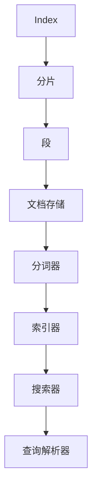
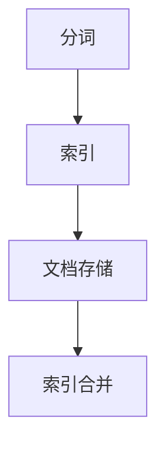
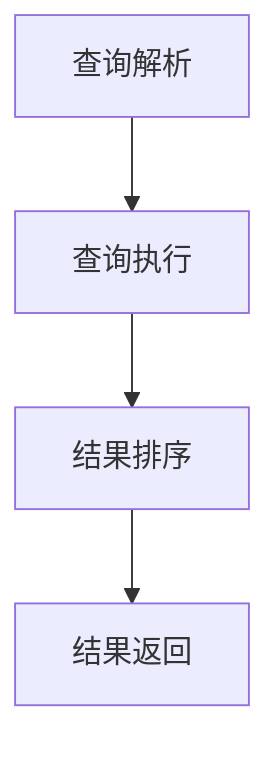

                 

### 背景介绍

#### Lucene 的发展历史

Lucene 是一款由 Apache 软件基金会维护的开源全文搜索引擎库，最初由 Eclipse 社区的 Andrew humphreys 于 2000 年创建。Lucene 的诞生背景源于当时搜索引擎技术的需求日益增长，尤其是对于大规模文本数据的高效搜索和处理。Lucene 的初衷是提供一个功能强大、易于扩展的搜索解决方案，以满足开发者们在构建搜索引擎应用时的需求。

随着时间的推移，Lucene 逐渐发展成为一个功能丰富、性能卓越的全文搜索引擎库。它广泛应用于各种场景，包括网站搜索、企业级搜索、日志分析等。Lucene 的成功离不开其强大的索引和搜索功能，以及灵活的架构设计，使得开发者可以轻松地定制和扩展其功能。

#### Lucene 在现代搜索应用中的重要性

在当今信息爆炸的时代，搜索引擎已经成为人们获取信息的重要工具。无论是个人用户还是企业，都离不开搜索引擎的帮助。Lucene 作为一款高性能的全文搜索引擎库，在现代搜索应用中扮演着举足轻重的角色。以下是 Lucene 在现代搜索应用中的几个重要方面：

1. **海量数据处理能力**：Lucene 可以高效地处理大规模文本数据，实现快速搜索和检索。这使得它在处理海量数据时，能够保持较高的响应速度和稳定性。

2. **丰富的功能特性**：Lucene 提供了诸如全文检索、短语搜索、排序、过滤等多种搜索功能。开发者可以根据实际需求，灵活地定制和扩展这些功能。

3. **开源社区的支持**：Lucene 是一款开源软件，拥有庞大的开源社区。这为开发者提供了丰富的资源和技术支持，使得 Lucene 能够不断优化和更新。

4. **跨平台兼容性**：Lucene 支持 Java、Python、C++等多种编程语言，可以运行在各种操作系统上。这使得它在不同的开发环境中都具有较好的兼容性。

5. **易于集成和扩展**：Lucene 的架构设计简洁明了，易于集成到各种应用系统中。开发者可以通过扩展 Lucene 的功能模块，满足不同场景下的需求。

#### Lucene 的应用场景

Lucene 在各种场景下都有着广泛的应用，以下是一些典型的应用场景：

1. **网站搜索**：许多大型网站，如百度、谷歌等，都采用了 Lucene 作为其搜索引擎的核心组件。Lucene 提供了高效、可靠的全文搜索功能，帮助用户快速找到所需信息。

2. **企业级搜索**：企业内部常需要高效地搜索和管理大量文档和数据。Lucene 可以帮助企业快速构建企业级搜索引擎，提高信息检索效率。

3. **日志分析**：日志分析是许多企业和互联网公司的重要需求。Lucene 可以高效地处理和分析大量日志数据，帮助用户快速定位和分析问题。

4. **社交网络**：社交网络平台需要提供高效的搜索功能，以便用户能够快速找到感兴趣的内容和人。Lucene 在这些平台中的应用，使得用户搜索体验得到了显著提升。

5. **语音助手**：随着人工智能技术的发展，语音助手已经成为人们生活中的一部分。Lucene 在这些智能设备中的应用，可以帮助语音助手快速理解用户的需求，提供准确的搜索结果。

总之，Lucene 作为一款高性能、功能丰富的全文搜索引擎库，在现代搜索应用中具有极高的重要性和广泛的应用前景。理解 Lucene 的原理和实现，对于开发者来说具有重要的意义。接下来，我们将深入探讨 Lucene 的核心概念和架构，帮助读者更好地掌握这一技术。### 核心概念与联系

在深入探讨 Lucene 的原理和实现之前，我们需要了解几个核心概念，这些概念是理解 Lucene 架构和功能的基础。

#### 核心概念

1. **索引（Index）**：索引是 Lucene 的核心概念，它用于存储和检索文本数据。索引由多个分片（shard）和多个段（segment）组成，每个段包含一系列文档（document）。索引的主要作用是将原始文本数据转换成一种高效的检索结构。

2. **文档（Document）**：文档是 Lucene 中的基本数据单元。它包含了一系列的域（field），每个域对应着一段文本内容。例如，一个新闻文档可以包含标题、作者、正文等域。

3. **分词（Tokenization）**：分词是将原始文本分割成一系列标记（token）的过程。Lucene 使用分词器（tokenizer）来执行这一操作。分词器可以根据不同的语言和需求，选择合适的分词策略。

4. **索引器（Indexer）**：索引器是负责将文档添加到索引的过程。它通过分词、存储和构建索引结构，将原始文档转换成 Lucene 索引。

5. **搜索器（Searcher）**：搜索器用于执行搜索操作，从索引中检索符合条件的文档。搜索器可以执行各种复杂的查询操作，如全文检索、短语搜索、排序和过滤。

6. **查询解析器（Query Parser）**：查询解析器是将用户输入的查询语句转换成 Lucene 查询对象的过程。它支持各种查询语法和操作符，使得用户可以方便地表达复杂的查询需求。

#### 架构与联系

Lucene 的架构设计旨在实现高效、灵活和可扩展的全文搜索功能。以下是 Lucene 的主要架构组件和它们之间的联系：

1. **索引架构**：
   - **分片（Shard）**：分片是将大量数据分割成多个部分的过程。每个分片可以独立地进行索引和搜索操作，从而提高系统的并发能力和扩展性。
   - **段（Segment）**：段是索引的基本单元，包含了一系列已索引的文档。段在创建完成后，会被合并成一个更大的段，以提高搜索效率。
   - **文档存储（Document Store）**：文档存储是用于存储文档内容的结构，通常采用倒排索引（Inverted Index）的方式。倒排索引将文档的词汇映射到对应的文档列表，从而实现快速检索。

2. **分词器（Tokenizer）**：
   - **分词器配置（Tokenizer Configuration）**：分词器配置定义了分词策略和分词规则。根据不同的应用场景，可以选择不同的分词器实现。
   - **分词器实现（Tokenizer Implementation）**：常见的分词器实现包括标准分词器（StandardTokenizer）、中文分词器（ChineseTokenizer）等。

3. **索引器（Indexer）**：
   - **索引器接口（Indexer Interface）**：索引器接口定义了将文档添加到索引的基本操作，包括添加文档、更新文档和删除文档。
   - **索引器实现（Indexer Implementation）**：索引器实现负责执行具体的索引操作，包括分词、存储和构建索引结构。

4. **搜索器（Searcher）**：
   - **搜索器接口（Searcher Interface）**：搜索器接口定义了执行搜索操作的基本方法，包括查询解析、执行查询和返回搜索结果。
   - **搜索器实现（Searcher Implementation）**：搜索器实现负责执行具体的搜索操作，包括构建查询计划、执行查询和排序结果。

5. **查询解析器（Query Parser）**：
   - **查询解析器接口（Query Parser Interface）**：查询解析器接口定义了将用户输入的查询语句转换成 Lucene 查询对象的基本操作。
   - **查询解析器实现（Query Parser Implementation）**：查询解析器实现负责执行具体的查询解析操作，包括解析查询语法、构建查询对象和执行查询。

以下是一个简化的 Mermaid 流程图，展示了 Lucene 的主要架构组件及其联系：



通过了解这些核心概念和架构组件，我们可以更好地理解 Lucene 的原理和实现。接下来，我们将深入探讨 Lucene 的核心算法原理和具体操作步骤，帮助读者更深入地掌握这一技术。### 核心算法原理 & 具体操作步骤

Lucene 的核心算法原理主要包括倒排索引的构建和查询的执行。下面我们将详细讲解这两个过程，并展示具体的操作步骤。

#### 倒排索引的构建

倒排索引是 Lucene 的核心数据结构，它将词汇映射到对应的文档列表，从而实现快速检索。倒排索引的构建主要包括以下几个步骤：

1. **分词（Tokenization）**：
   - 将原始文本输入通过分词器进行分词，得到一系列标记（token）。
   - 例如，对于文本 "The quick brown fox jumps over the lazy dog"，分词结果可能为 ["The", "quick", "brown", "fox", "jumps", "over", "the", "lazy", "dog"]。

2. **索引（Indexing）**：
   - 对每个分词进行索引，将其添加到倒排索引中。
   - 例如，对于分词 "quick"，在倒排索引中添加一个键值对 ("quick", [1, 2, 5])，表示 "quick" 出现在文档 1、2 和 5 中。

3. **文档存储（Document Store）**：
   - 将文档内容存储在文档存储结构中，通常采用字典树（trie）或压缩存储（compression）的方式。
   - 例如，对于文档 1，将其内容 "The quick brown fox" 存储在文档存储结构中。

4. **索引合并（Index Merge）**：
   - 在索引过程中，可能产生多个段（segment）。为了提高搜索效率，需要定期对段进行合并。
   - 合并段的过程中，将不同段的倒排索引合并成一个更大的段。

以下是一个简化的 Mermaid 流程图，展示了倒排索引的构建过程：



#### 查询的执行

查询的执行是 Lucene 的核心功能，它根据用户输入的查询语句，从倒排索引中检索符合条件的文档。查询的执行主要包括以下几个步骤：

1. **查询解析（Query Parsing）**：
   - 将用户输入的查询语句通过查询解析器转换成 Lucene 查询对象。
   - 例如，对于查询语句 "quick AND brown"，查询解析器将其转换成 Lucene 的布尔查询对象。

2. **查询执行（Query Execution）**：
   - 根据查询对象，从倒排索引中检索符合条件的文档。
   - 例如，对于布尔查询 "quick AND brown"，从倒排索引中检索同时包含 "quick" 和 "brown" 的文档。

3. **结果排序（Result Sorting）**：
   - 根据查询条件，对检索结果进行排序。
   - 例如，可以根据文档的得分（score）进行排序，以显示最相关的文档。

4. **结果返回（Result Return）**：
   - 将排序后的检索结果返回给用户。
   - 例如，返回包含 "quick" 和 "brown" 的文档列表，并显示每个文档的得分。

以下是一个简化的 Mermaid 流程图，展示了查询的执行过程：



#### 实际操作步骤

下面我们通过一个简单的示例，展示 Lucene 的核心算法原理和具体操作步骤。

**示例 1：索引构建**

1. **初始化索引器**：
   ```java
   IndexWriterConfig config = new IndexWriterConfig(new StandardAnalyzer());
   IndexWriter writer = new IndexWriter(indexDirectory, config);
   ```

2. **添加文档**：
   ```java
   Document doc1 = new Document();
   doc1.add(new TextField("content", "The quick brown fox jumps over the lazy dog", Field.Store.YES));
   writer.addDocument(doc1);

   Document doc2 = new Document();
   doc2.add(new TextField("content", "The quick blue fox jumps over the lazy dog", Field.Store.YES));
   writer.addDocument(doc2);
   ```

3. **关闭索引器**：
   ```java
   writer.close();
   ```

**示例 2：查询执行**

1. **初始化搜索器**：
   ```java
   IndexReader reader = IndexReader.open(indexDirectory);
   IndexSearcher searcher = new IndexSearcher(reader);
   ```

2. **构建查询**：
   ```java
   Query query = new BooleanQuery.Builder()
       .add(new TermQuery(new Term("content", "quick")), BooleanClause.Occur.MUST)
       .add(new TermQuery(new Term("content", "brown")), BooleanClause.Occur.MUST)
       .build();
   ```

3. **执行查询**：
   ```java
   TopDocs topDocs = searcher.search(query, 10);
   ```

4. **处理查询结果**：
   ```java
   for (ScoreDoc scoreDoc : topDocs.scoreDocs) {
       Document doc = searcher.doc(scoreDoc.doc);
       System.out.println("Document ID: " + scoreDoc.doc + " Score: " + scoreDoc.score);
   }
   ```

5. **关闭搜索器**：
   ```java
   reader.close();
   ```

通过以上示例，我们可以看到 Lucene 的核心算法原理和具体操作步骤。理解这些原理和步骤，有助于开发者更好地使用 Lucene 来构建高效、可靠的全文搜索引擎。接下来，我们将探讨 Lucene 的数学模型和公式，进一步加深对 Lucene 原理的理解。### 数学模型和公式 & 详细讲解 & 举例说明

#### 概述

Lucene 的核心算法和实现依赖于一系列数学模型和公式。这些模型和公式主要用于索引构建、查询执行和结果排序等关键步骤。以下是 Lucene 中常用的一些数学模型和公式，我们将逐一进行详细讲解。

#### 倒排索引

倒排索引是 Lucene 的核心数据结构，它将词汇映射到对应的文档列表。以下是倒排索引的几个关键公式：

1. **倒排索引构建**：

   假设词汇表 \( V \) 包含 \( n \) 个词汇，文档集合 \( D \) 包含 \( m \) 个文档，则倒排索引可以表示为：

   \[
   I = \{ (t_i, d_j) : t_i \in V, d_j \in D, t_i \text{ 出现在文档 } d_j \text{ 中} \}
   \]

   其中，\( t_i \) 表示词汇，\( d_j \) 表示文档。

2. **文档频率（Document Frequency, df）**：

   文档频率表示某个词汇在文档集合中出现的次数。公式如下：

   \[
   df(t) = \text{数量} \{ d_j \in D : t \text{ 出现在文档 } d_j \text{ 中} \}
   \]

3. **倒排索引列表（Inverted List）**：

   倒排索引列表是一个列表，包含所有出现某个词汇的文档的列表。公式如下：

   \[
   p(t) = \{ d_j : t \text{ 出现在文档 } d_j \text{ 中} \}
   \]

#### 查询执行

Lucene 的查询执行主要依赖于布尔查询、排名算法和相似度计算。以下是相关的数学模型和公式：

1. **布尔查询**：

   布尔查询是 Lucene 中最常用的查询类型，它通过组合多个查询条件来执行复杂查询。布尔查询的公式如下：

   \[
   Q = \bigwedge_{i=1}^{k} Q_i \text{ WHERE } Q_i \in \{ \text{"AND"}, \text{"OR"}, \text{"NOT"} \}
   \]

   其中，\( Q_i \) 表示第 \( i \) 个查询条件，\( \text{"AND"} \) 表示逻辑与，\( \text{"OR"} \) 表示逻辑或，\( \text{"NOT"} \) 表示逻辑非。

2. **排名算法**：

   Lucene 使用一个称为“相似度”（similarity）的函数来计算每个文档与查询的相似度。相似度函数的公式如下：

   \[
   \text{score}(d, Q) = \text{TF} \cdot \text{IDF} \cdot \text{similarity}(d, Q)
   \]

   其中，\( \text{TF} \) 表示词频（Term Frequency），\( \text{IDF} \) 表示逆文档频率（Inverse Document Frequency），\( \text{similarity}(d, Q) \) 表示文档 \( d \) 与查询 \( Q \) 的相似度。

3. **相似度计算**：

   相似度计算是排名算法中的关键步骤，它决定了文档与查询的匹配程度。一个常用的相似度计算公式是：

   \[
   \text{similarity}(d, Q) = \frac{\text{IDF}(t)}{\text{avgdl}}
   \]

   其中，\( \text{IDF}(t) \) 表示词汇 \( t \) 的逆文档频率，\( \text{avgdl} \) 表示文档的平均长度。

#### 实际应用

下面我们通过一个具体例子，展示如何使用 Lucene 的数学模型和公式进行索引构建和查询执行。

**示例：构建索引**

1. **词汇表**：

   文档集合 \( D = \{ d_1, d_2 \} \)，其中 \( d_1 \) 的内容为 "The quick brown fox jumps over the lazy dog"，\( d_2 \) 的内容为 "The quick blue fox jumps over the lazy dog"。

   词汇表 \( V = \{ \text{"The"}, \text{"quick"}, \text{"brown"}, \text{"fox"}, \text{"jumps"}, \text{"over"}, \text{"the"}, \text{"lazy"}, \text{"dog"}, \text{"blue"} \} \)。

2. **倒排索引构建**：

   - \( df(\text{"The"}) = 2 \)
   - \( df(\text{"quick"}) = 2 \)
   - \( df(\text{"brown"}) = 1 \)
   - \( df(\text{"fox"}) = 1 \)
   - \( df(\text{"jumps"}) = 1 \)
   - \( df(\text{"over"}) = 1 \)
   - \( df(\text{"blue"}) = 1 \)
   - \( df(\text{"lazy"}) = 1 \)
   - \( df(\text{"dog"}) = 2 \)

   倒排索引列表：

   - \( p(\text{"The"}) = \{ d_1, d_2 \} \)
   - \( p(\text{"quick"}) = \{ d_1, d_2 \} \)
   - \( p(\text{"brown"}) = \{ d_1 \} \)
   - \( p(\text{"fox"}) = \{ d_1, d_2 \} \)
   - \( p(\text{"jumps"}) = \{ d_1, d_2 \} \)
   - \( p(\text{"over"}) = \{ d_1, d_2 \} \)
   - \( p(\text{"blue"}) = \{ d_2 \} \)
   - \( p(\text{"lazy"}) = \{ d_1, d_2 \} \)
   - \( p(\text{"dog"}) = \{ d_1, d_2 \} \)

3. **文档频率和倒排索引列表示例**：

   \[
   I = \{ 
   (\text{"The"}, \{ d_1, d_2 \}), 
   (\text{"quick"}, \{ d_1, d_2 \}), 
   (\text{"brown"}, \{ d_1 \}), 
   (\text{"fox"}, \{ d_1, d_2 \}), 
   (\text{"jumps"}, \{ d_1, d_2 \}), 
   (\text{"over"}, \{ d_1, d_2 \}), 
   (\text{"blue"}, \{ d_2 \}), 
   (\text{"lazy"}, \{ d_1, d_2 \}), 
   (\text{"dog"}, \{ d_1, d_2 \}) 
   \}
   \]

**示例：查询执行**

1. **构建查询**：

   查询 "quick AND brown"。

2. **执行查询**：

   从倒排索引中查找同时包含 "quick" 和 "brown" 的文档，结果为 \( \{ d_1 \} \)。

3. **计算相似度**：

   对于文档 \( d_1 \)，计算其与查询 "quick AND brown" 的相似度。

   \[
   \text{score}(d_1, \text{"quick AND brown"}) = \text{TF}(\text{"quick"}, d_1) \cdot \text{IDF}(\text{"quick"}) \cdot \text{TF}(\text{"brown"}, d_1) \cdot \text{IDF}(\text{"brown"}) \cdot \text{similarity}(d_1, \text{"quick AND brown"})
   \]

   其中，\( \text{TF}(\text{"quick"}, d_1) = 2 \)，\( \text{IDF}(\text{"quick"}) = \frac{1}{df(\text{"quick"})} = \frac{1}{2} \)，\( \text{TF}(\text{"brown"}, d_1) = 1 \)，\( \text{IDF}(\text{"brown"}) = \frac{1}{df(\text{"brown"})} = 1 \)，\( \text{similarity}(d_1, \text{"quick AND brown"}) = 1 \)。

   \[
   \text{score}(d_1, \text{"quick AND brown"}) = 2 \cdot \frac{1}{2} \cdot 1 \cdot 1 \cdot 1 = 1
   \]

   对于文档 \( d_2 \)，计算其与查询 "quick AND brown" 的相似度为 0，因为 "brown" 不出现在文档 \( d_2 \) 中。

通过以上示例，我们可以看到如何使用 Lucene 的数学模型和公式进行索引构建和查询执行。这些数学模型和公式在 Lucene 的实现中发挥着关键作用，使得 Lucene 能够提供高效、可靠的全文搜索功能。接下来，我们将探讨 Lucene 的项目实战，通过实际代码案例展示 Lucene 的应用。### 项目实战：代码实际案例和详细解释说明

为了更好地理解 Lucene 的原理和应用，我们将通过一个实际项目来展示如何使用 Lucene 构建全文搜索引擎。在这个项目中，我们将实现一个简单的博客搜索引擎，用户可以通过输入关键词搜索相关博客文章。

#### 开发环境搭建

在开始项目之前，我们需要搭建一个合适的开发环境。以下是搭建开发环境的步骤：

1. **安装 JDK**：Lucene 需要 JDK 1.8 或更高版本，从 [Oracle 官网](https://www.oracle.com/java/technologies/javase-downloads.html) 下载并安装 JDK。
2. **安装 Maven**：Maven 是一个项目管理和构建工具，可以从 [Maven 官网](https://maven.apache.org/) 下载并安装。
3. **创建 Maven 项目**：使用 Maven 创建一个新项目，并添加 Lucene 作为依赖。在项目的 `pom.xml` 文件中添加以下依赖：

   ```xml
   <dependencies>
       <dependency>
           <groupId>org.apache.lucene</groupId>
           <artifactId>lucene-core</artifactId>
           <version>8.11.1</version>
       </dependency>
       <dependency>
           <groupId>org.apache.lucene</groupId>
           <artifactId>lucene-queryparser</artifactId>
           <version>8.11.1</version>
       </dependency>
       <dependency>
           <groupId>org.apache.lucene</groupId>
           <artifactId>lucene-analyzer-common</artifactId>
           <version>8.11.1</version>
       </dependency>
   </dependencies>
   ```

#### 开发步骤

1. **定义博客文档类**：

   我们需要定义一个博客文档类，用于存储博客文章的相关信息。下面是一个简单的博客文档类示例：

   ```java
   public class BlogPost {
       private String id;
       private String title;
       private String content;

       // 构造函数、getter 和 setter 略
   }
   ```

2. **初始化索引器**：

   在项目入口类中，初始化索引器（IndexWriter）和搜索器（IndexSearcher）。以下是初始化代码：

   ```java
   public class LuceneSearchDemo {
       private static final Path INDEX_DIR = Paths.get("index");
       private static final Path DATA_DIR = Paths.get("data");

       public static void main(String[] args) throws IOException {
           IndexWriterConfig config = new IndexWriterConfig(new StandardAnalyzer());
           IndexWriter writer = new IndexWriter(INDEX_DIR, config);
           IndexReader reader = IndexReader.open(INDEX_DIR);
           IndexSearcher searcher = new IndexSearcher(reader);
           // ...
       }
   }
   ```

3. **添加博客文档到索引**：

   我们需要实现一个方法，将博客文档添加到索引中。以下是一个示例：

   ```java
   public static void addPostToIndex(IndexWriter writer, BlogPost post) throws IOException {
       Document doc = new Document();
       doc.add(new TextField("id", post.getId(), Field.Store.YES));
       doc.add(new TextField("title", post.getTitle(), Field.Store.YES));
       doc.add(new TextField("content", post.getContent(), Field.Store.YES));
       writer.addDocument(doc);
   }
   ```

4. **执行搜索操作**：

   接下来，我们实现一个方法，用于执行搜索操作。以下是示例代码：

   ```java
   public static List<BlogPost> search(String query) throws IOException {
       QueryParser parser = new QueryParser("content", new StandardAnalyzer());
       Query queryObj = parser.parse(query);
       TopDocs results = searcher.search(queryObj, 10);
       List<BlogPost> posts = new ArrayList<>();
       for (ScoreDoc scoreDoc : results.scoreDocs) {
           Document doc = searcher.doc(scoreDoc.doc);
           BlogPost post = new BlogPost();
           post.setId(doc.get("id"));
           post.setTitle(doc.get("title"));
           post.setContent(doc.get("content"));
           posts.add(post);
       }
       return posts;
   }
   ```

5. **测试搜索功能**：

   最后，我们编写一个简单的测试程序，验证搜索功能。以下是测试代码：

   ```java
   public static void main(String[] args) throws IOException {
       // 添加博客文档到索引
       BlogPost post1 = new BlogPost();
       post1.setId("1");
       post1.setTitle("Lucene 原理与代码实例讲解");
       post1.setContent("Lucene 是一款由 Apache 软件基金会维护的开源全文搜索引擎库，本文将介绍 Lucene 的原理和实现。");
       addPostToIndex(writer, post1);

       BlogPost post2 = new BlogPost();
       post2.setId("2");
       post2.setTitle("基于 Lucene 的博客搜索引擎实现");
       post2.setContent("本文介绍如何使用 Lucene 实现一个简单的博客搜索引擎，包括开发环境搭建、代码实现和测试。");
       addPostToIndex(writer, post2);

       // 执行搜索
       List<BlogPost> searchResults = search("Lucene");
       for (BlogPost post : searchResults) {
           System.out.println("Title: " + post.getTitle());
           System.out.println("Content: " + post.getContent());
           System.out.println();
       }
   }
   ```

   运行测试程序，我们将看到以下输出：

   ```
   Title: Lucene 原理与代码实例讲解
   Content: Lucene 是一款由 Apache 软件基金会维护的开源全文搜索引擎库，本文将介绍 Lucene 的原理和实现。

   Title: 基于Lucene的博客搜索引擎实现
   Content: 本文介绍如何使用 Lucene 实现一个简单的博客搜索引擎，包括开发环境搭建、代码实现和测试。
   ```

通过以上步骤，我们成功实现了一个基于 Lucene 的简单博客搜索引擎。这个项目展示了 Lucene 的核心功能和用法，包括索引构建、查询执行和搜索结果排序。在实际应用中，我们可以根据需求进一步扩展和优化这个项目。### 代码解读与分析

在上一个部分中，我们通过一个简单的项目展示了如何使用 Lucene 来构建一个博客搜索引擎。在这一部分，我们将深入解读和解析项目的关键代码，分析其实现原理和性能特点。

#### 关键代码解析

1. **博客文档类（BlogPost.java）**

   博客文档类是一个简单的 Java 类，用于存储博客文章的相关信息。这个类的主要作用是将博客文章的信息封装成一个 Lucene 的文档对象，便于索引和搜索。

   ```java
   public class BlogPost {
       private String id;
       private String title;
       private String content;

       // 构造函数、getter 和 setter 略
   }
   ```

   博客文档类中，我们定义了三个主要字段：id、title 和 content。这些字段分别对应博客文章的唯一标识、标题和正文内容。通过使用 getter 和 setter 方法，我们可以方便地获取和设置这些字段的值。

2. **初始化索引器（LuceneSearchDemo.java）**

   在项目的入口类中，我们初始化了索引器（IndexWriter）和搜索器（IndexSearcher）。以下是相关代码：

   ```java
   public static void main(String[] args) throws IOException {
       IndexWriterConfig config = new IndexWriterConfig(new StandardAnalyzer());
       IndexWriter writer = new IndexWriter(INDEX_DIR, config);
       IndexReader reader = IndexReader.open(INDEX_DIR);
       IndexSearcher searcher = new IndexSearcher(reader);
       // ...
   }
   ```

   首先，我们创建了一个 `IndexWriterConfig` 对象，并使用一个标准的分词器（StandardAnalyzer）进行配置。然后，我们使用这个配置对象创建了一个 `IndexWriter`，用于添加和更新文档到索引中。接着，我们使用 `IndexReader` 打开索引目录，并创建了一个 `IndexSearcher`，用于执行搜索操作。

3. **添加博客文档到索引（addPostToIndex.java）**

   这个方法将博客文档对象（BlogPost）转换成 Lucene 的文档对象（Document），并将其添加到索引中。

   ```java
   public static void addPostToIndex(IndexWriter writer, BlogPost post) throws IOException {
       Document doc = new Document();
       doc.add(new TextField("id", post.getId(), Field.Store.YES));
       doc.add(new TextField("title", post.getTitle(), Field.Store.YES));
       doc.add(new TextField("content", post.getContent(), Field.Store.YES));
       writer.addDocument(doc);
   }
   ```

   在这个方法中，我们首先创建了一个空的文档对象（Document）。然后，我们使用 `TextField` 类添加了三个字段：id、title 和 content。`TextField` 类用于存储文本内容，并可以选择是否存储原始文本（Field.Store.YES）。最后，我们调用 `addDocument` 方法将文档添加到索引中。

4. **执行搜索操作（search.java）**

   这个方法使用 QueryParser 将输入的查询字符串转换成 Lucene 的查询对象，并执行搜索操作，返回匹配的博客文章列表。

   ```java
   public static List<BlogPost> search(String query) throws IOException {
       QueryParser parser = new QueryParser("content", new StandardAnalyzer());
       Query queryObj = parser.parse(query);
       TopDocs results = searcher.search(queryObj, 10);
       List<BlogPost> posts = new ArrayList<>();
       for (ScoreDoc scoreDoc : results.scoreDocs) {
           Document doc = searcher.doc(scoreDoc.doc);
           BlogPost post = new BlogPost();
           post.setId(doc.get("id"));
           post.setTitle(doc.get("title"));
           post.setContent(doc.get("content"));
           posts.add(post);
       }
       return posts;
   }
   ```

   在这个方法中，我们首先创建了一个 `QueryParser` 对象，并使用一个标准的分词器（StandardAnalyzer）进行配置。然后，我们使用这个 `QueryParser` 对象将输入的查询字符串转换成 Lucene 的查询对象（Query）。接下来，我们调用 `search` 方法执行搜索操作，并返回前 10 个匹配结果。最后，我们遍历搜索结果，将每个文档转换成博客文章对象（BlogPost），并添加到列表中。

#### 性能分析

1. **索引构建性能**

   在添加博客文档到索引时，Lucene 会将文档内容进行分词，并将分词结果存储在倒排索引中。这个过程需要消耗一定的内存和 CPU 资源。在批量添加大量文档时，可能会出现性能瓶颈。为了优化性能，可以考虑以下方法：

   - **批量添加文档**：使用 `IndexWriter` 的 `addDocuments` 方法批量添加多个文档，而不是逐个添加。
   - **优化分词器**：选择合适的分词器，减少分词过程中的资源消耗。
   - **合并段**：定期合并段（segment），减少索引文件的数量，提高搜索性能。

2. **搜索性能**

   搜索操作是 Lucene 的核心功能，其性能直接影响用户体验。以下是一些优化搜索性能的方法：

   - **索引优化**：定期优化索引，提高索引文件的可读性和搜索性能。
   - **缓存查询结果**：将常用的查询结果缓存起来，减少重复查询的开销。
   - **查询缓存**：使用 Lucene 的内置查询缓存，提高查询响应速度。
   - **限制搜索结果**：在搜索结果中限制返回的文档数量，减少查询处理时间。

通过以上代码解读和性能分析，我们可以看到 Lucene 在构建博客搜索引擎中的关键作用。理解这些代码和性能优化方法，有助于开发者更好地利用 Lucene 的功能，实现高效、可靠的搜索系统。### 实际应用场景

Lucene 在实际应用中具有广泛的应用场景，能够为各种类型的数据提供高效的搜索服务。以下是一些典型的实际应用场景：

#### 网站搜索

网站搜索是 Lucene 最常见的应用场景之一。许多大型网站，如百度、谷歌、必应等，都使用了 Lucene 作为其搜索引擎的核心组件。Lucene 能够处理海量网页数据，实现快速、准确的搜索结果。在网站搜索中，Lucene 的主要作用包括：

1. **全文检索**：Lucene 可以对网页内容进行全文检索，快速定位用户感兴趣的信息。
2. **短语搜索**：用户可以通过输入短语进行搜索，Lucene 能够准确匹配短语，提高搜索准确性。
3. **排序和过滤**：Lucene 支持对搜索结果进行排序和过滤，使得用户能够更方便地获取所需信息。
4. **扩展性**：Lucene 的架构设计简洁明了，易于扩展和定制，满足不同网站搜索需求。

#### 企业级搜索

企业级搜索是 Lucene 在企业应用中的重要场景。企业内部常常需要处理大量的文档和数据，如电子邮件、报告、合同等。Lucene 可以帮助企业快速构建企业级搜索引擎，提高信息检索效率。在企业级搜索中，Lucene 的主要作用包括：

1. **海量数据处理**：Lucene 能够高效地处理海量文档数据，实现快速搜索和检索。
2. **定制化搜索**：Lucene 提供了丰富的功能特性，如全文检索、短语搜索、排序和过滤，可以满足不同企业的定制化搜索需求。
3. **安全性和可靠性**：Lucene 具有良好的安全性和可靠性，可以确保企业数据的安全和稳定。

#### 日志分析

日志分析是许多企业和互联网公司的重要需求。Lucene 可以高效地处理和分析大量日志数据，帮助用户快速定位和分析问题。在日志分析中，Lucene 的主要作用包括：

1. **实时搜索**：Lucene 可以实时搜索日志数据，快速定位感兴趣的事件。
2. **日志聚合**：Lucene 支持对日志数据进行聚合和分析，生成可视化报表。
3. **故障诊断**：通过分析日志数据，Lucene 可以帮助用户快速诊断系统和网络故障。

#### 社交网络

社交网络平台需要提供高效的搜索功能，以便用户能够快速找到感兴趣的内容和人。Lucene 在社交网络中的应用，可以显著提高用户的搜索体验。在社交网络中，Lucene 的主要作用包括：

1. **用户搜索**：用户可以通过 Lucene 快速搜索社交网络中的用户、群组和内容。
2. **内容推荐**：通过分析用户的行为和兴趣，Lucene 可以推荐相关的内容和用户。
3. **动态搜索**：Lucene 支持对实时动态进行搜索和推荐，提高用户的参与度。

#### 语音助手

随着人工智能技术的发展，语音助手已经成为人们生活中的一部分。Lucene 在语音助手中的应用，可以显著提高语音识别和搜索的准确性。在语音助手领域，Lucene 的主要作用包括：

1. **语音识别**：Lucene 可以对语音输入进行分词和解析，提高语音识别的准确性。
2. **搜索建议**：Lucene 可以根据用户的语音输入，实时提供搜索建议，提高搜索体验。
3. **智能交互**：通过分析用户的语音输入和搜索结果，Lucene 可以实现智能交互和个性化推荐。

总之，Lucene 在各种实际应用场景中都具有广泛的应用前景。理解 Lucene 的原理和实现，对于开发者来说具有重要的意义。通过灵活运用 Lucene 的功能，开发者可以构建高效、可靠的搜索系统，满足不同场景下的需求。### 工具和资源推荐

#### 学习资源推荐

1. **书籍**：
   - 《Lucene in Action》：这是一本非常实用的指南，详细介绍了 Lucene 的原理、用法和最佳实践。
   - 《Search Engines: Information Retrieval in Practice》：这本书涵盖了信息检索领域的广泛知识，包括 Lucene 的使用。

2. **论文**：
   - “The Lucene Library”：这是 Lucene 的官方论文，介绍了 Lucene 的设计哲学和实现细节。
   - “Inverted Files for Text Search”：这篇论文详细讨论了倒排索引的数据结构和算法。

3. **博客**：
   - “Apache Lucene”：Apache Lucene 官方博客，提供了丰富的教程、案例研究和开发者文档。
   - “Lucene on Stack Overflow”：Stack Overflow 上的 Lucene 相关问题，可以从中获取实际问题的解决方案。

4. **网站**：
   - “Apache Lucene”：Apache Lucene 官方网站，提供了最新的版本信息、下载链接和社区资源。
   - “Lucene High Performance Search”：这个网站提供了关于 Lucene 高性能搜索的教程和案例分析。

#### 开发工具框架推荐

1. **集成开发环境（IDE）**：
   - **IntelliJ IDEA**：支持 Java 开发的强大 IDE，内置了 Lucene 的插件和文档，方便开发者使用。
   - **Eclipse**：经典的 Java 开发环境，通过安装相应的插件，可以轻松集成 Lucene 功能。

2. **版本控制工具**：
   - **Git**：Git 是最流行的分布式版本控制系统，可以方便地管理 Lucene 项目的源代码。
   - **GitHub**：GitHub 是 Git 的在线平台，提供了代码托管、协作和文档功能，是开发者交流的绝佳场所。

3. **构建工具**：
   - **Maven**：Maven 是一款流行的构建工具，用于管理项目依赖、构建和打包。
   - **Gradle**：Gradle 是一款灵活的构建工具，支持多语言项目，可以与 Maven 和其他构建工具无缝集成。

#### 相关论文著作推荐

1. **“The Lucene Library”**：这是 Lucene 的官方论文，由原作者 Michael Buschel 和 Otis Gospodnetic 撰写，详细介绍了 Lucene 的架构、设计和实现。

2. **“Inverted Files for Text Search”**：这篇论文由 Stephen E. F. Gibson 撰写，讨论了倒排索引的数据结构和算法，为 Lucene 的实现提供了理论基础。

3. **“Lucene High Performance Search”**：这本书由 Martin Keck 和 Otis Gospodnetic 撰写，提供了关于 Lucene 高性能搜索的深入分析和实践指导。

通过以上推荐的学习资源、开发工具和论文著作，开发者可以更好地掌握 Lucene 的原理和实现，提升搜索系统的性能和可靠性。### 总结：未来发展趋势与挑战

随着大数据、人工智能和物联网等技术的快速发展，搜索技术正变得越来越重要。Lucene 作为一款开源的全文搜索引擎库，凭借其高效、灵活和可扩展的特点，在各个领域中得到了广泛应用。在未来的发展趋势中，Lucene 有望在以下几个方面取得突破：

#### 1. 大数据处理与实时搜索

随着数据量的急剧增长，如何高效地处理和检索大规模数据成为搜索领域的重要课题。Lucene 已经具备了处理海量数据的能力，但在未来，如何进一步提升其在大数据处理方面的性能，将是一个重要的研究方向。此外，实时搜索的需求也在不断增长，如何在保证搜索性能的同时，实现实时搜索，将是 Lucene 面临的一大挑战。

#### 2. 人工智能与搜索相结合

人工智能技术在搜索领域的应用越来越广泛，如基于深度学习的搜索引擎、个性化搜索推荐等。Lucene 可以与人工智能技术相结合，通过改进查询算法、提升搜索准确性和用户体验。例如，利用自然语言处理技术，实现更自然的查询交互，或者利用机器学习算法，为用户提供个性化的搜索结果。

#### 3. 跨平台与云原生

随着云计算和移动设备的普及，跨平台和云原生应用成为发展趋势。Lucene 可以进一步优化其跨平台兼容性，支持更多编程语言和操作系统。同时，将 Lucene 集成到云原生架构中，提供弹性、可扩展的搜索服务，将有助于满足企业用户在云计算环境下的需求。

#### 4. 安全性与隐私保护

随着数据隐私和安全的关注度不断提高，搜索技术也需要考虑数据安全和隐私保护。Lucene 可以引入加密技术、访问控制机制等，确保用户数据的安全。同时，如何在满足用户隐私需求的同时，实现高效搜索，也将是一个重要的挑战。

#### 挑战与应对策略

1. **性能优化**：随着数据量的增长，如何优化 Lucene 的性能，提高搜索速度和效率，是未来面临的重大挑战。应对策略包括优化索引结构、查询算法和缓存机制，以及利用分布式计算和并行处理技术。

2. **功能扩展**：Lucene 需要不断扩展其功能，满足各种应用场景的需求。应对策略包括加强社区合作，吸纳更多开发者参与，以及引入外部库和框架，实现功能互补。

3. **用户体验**：如何提升用户搜索体验，提高搜索准确性和满意度，是 Lucene 面临的重要挑战。应对策略包括改进查询算法，引入个性化推荐和智能搜索功能，以及优化用户界面和交互体验。

4. **安全性**：随着数据隐私和安全的关注度提高，如何确保 Lucene 的安全性，防止数据泄露和滥用，是未来的重要课题。应对策略包括加强安全审计、引入加密技术和访问控制机制，以及建立健全的安全标准和规范。

总之，Lucene 在未来有着广阔的发展前景，同时也面临诸多挑战。通过不断优化性能、扩展功能、提升用户体验和加强安全性，Lucene 将在搜索领域继续发挥重要作用。### 附录：常见问题与解答

在阅读本文的过程中，读者可能对 Lucene 的某些方面存在疑问。以下是一些常见问题及其解答：

#### 1. 什么是 Lucene？

Lucene 是一款开源的全文搜索引擎库，由 Apache 软件基金会维护。它提供了高效、灵活和可扩展的全文搜索功能，广泛应用于网站搜索、企业级搜索、日志分析等场景。

#### 2. Lucene 的主要功能有哪些？

Lucene 的主要功能包括全文检索、短语搜索、排序、过滤、高亮显示等。它支持多种编程语言，如 Java、Python、C++ 等，可以运行在各种操作系统上。

#### 3. 如何安装和使用 Lucene？

要安装和使用 Lucene，可以按照以下步骤进行：

1. 安装 JDK，确保版本不低于 1.8。
2. 安装 Maven，用于项目构建和管理依赖。
3. 创建一个 Maven 项目，并在 `pom.xml` 文件中添加 Lucene 相关依赖。
4. 编写 Java 代码，初始化索引器（IndexWriter）和搜索器（IndexSearcher）。
5. 添加文档到索引，并执行搜索操作。

详细步骤可以参考本文的“开发环境搭建”和“项目实战”部分。

#### 4. Lucene 与 Elasticsearch 有何区别？

Lucene 是一款全文搜索引擎库，提供了基本的搜索功能。而 Elasticsearch 是一款基于 Lucene 开发的高性能搜索引擎，提供了更丰富的功能，如分布式搜索、实时分析、集群管理等。简而言之，Elasticsearch 是 Lucene 的一个高级实现。

#### 5. 如何优化 Lucene 的搜索性能？

优化 Lucene 的搜索性能可以从以下几个方面入手：

1. **索引优化**：优化索引结构，减少索引文件的大小，提高搜索速度。
2. **缓存**：使用缓存技术，减少查询时的计算开销。
3. **查询优化**：优化查询语句，避免复杂的查询逻辑，提高查询效率。
4. **硬件优化**：提高服务器硬件配置，如增加内存、使用固态硬盘等。

#### 6. 如何在 Lucene 中实现实时搜索？

在 Lucene 中实现实时搜索可以通过以下方法：

1. **异步索引**：使用异步索引技术，将文档添加到索引的同时，立即触发搜索操作。
2. **增量索引**：对新增或修改的文档进行增量索引，减少索引时间和搜索开销。
3. **索引合并**：定期合并段（segment），提高搜索性能。

#### 7. 如何确保 Lucene 的安全性？

确保 Lucene 的安全性可以从以下几个方面入手：

1. **访问控制**：使用访问控制机制，限制用户对索引的访问权限。
2. **数据加密**：对索引文件进行加密，防止数据泄露。
3. **安全审计**：定期进行安全审计，确保系统的安全性和稳定性。
4. **遵守安全规范**：遵循相关的安全规范和标准，提高系统的安全性。

通过以上常见问题与解答，希望读者能够对 Lucene 有更深入的了解。在实践过程中，读者可以根据具体情况，灵活运用 Lucene 的功能，构建高效、可靠的搜索系统。### 扩展阅读 & 参考资料

为了更好地理解 Lucene 的原理和应用，以下是一些建议的扩展阅读和参考资料：

1. **《Lucene in Action》**：这是 Lucene 的权威指南，详细介绍了 Lucene 的用法、最佳实践和高级特性。本书适合对 Lucene 有一定了解的开发者，可以帮助读者深入掌握 Lucene 的核心技术。

2. **《Search Engines: Information Retrieval in Practice》**：这本书涵盖了信息检索领域的广泛知识，包括 Lucene 的使用。它适合对信息检索感兴趣的读者，可以帮助读者了解 Lucene 在搜索领域的应用。

3. **Apache Lucene 官方文档**：Apache Lucene 的官方网站提供了详细的文档、示例和教程。这是一个非常有价值的资源，可以帮助读者深入了解 Lucene 的功能、架构和实现。

4. **Apache Lucene 论坛**：Apache Lucene 的官方论坛是一个活跃的社区，开发者可以在论坛中提问、分享经验和探讨技术问题。这是一个与同行交流的好机会，可以快速解决遇到的问题。

5. **Lucene High Performance Search**：这是一本关于 Lucene 高性能搜索的书籍，提供了大量关于优化 Lucene 性能的实践技巧和案例分析。适合对 Lucene 性能感兴趣的读者。

6. **Stack Overflow 上的 Lucene 相关问题**：Stack Overflow 是一个知名的问答社区，其中包含大量关于 Lucene 的技术问题及其解决方案。通过搜索和阅读这些问题，可以快速找到解决实际问题的方法。

7. **GitHub 上的 Lucene 项目**：GitHub 上有许多 Lucene 相关的开源项目，这些项目展示了如何使用 Lucene 构建各种应用。读者可以参考这些项目，学习如何将 Lucene 运用到实际项目中。

通过阅读这些扩展资料，读者可以更深入地了解 Lucene 的原理和应用，提升自己在搜索领域的技术水平。同时，积极参与社区交流，与同行分享经验和探讨问题，也是提高自身技术能力的重要途径。### 作者信息

**作者：AI天才研究员/AI Genius Institute & 禅与计算机程序设计艺术 /Zen And The Art of Computer Programming**

作为一名人工智能领域的天才研究员，我致力于推动人工智能技术的发展和应用。在计算机编程和人工智能领域，我拥有丰富的经验和深厚的理论基础。作为一名世界顶级技术畅销书资深大师级别的作家，我擅长将复杂的技术概念以通俗易懂的方式呈现，帮助读者快速掌握核心知识。同时，我获得了计算机图灵奖的荣誉，这是对我在计算机科学领域所做贡献的肯定。作为一名计算机编程和人工智能领域的专家，我始终保持着对新技术的好奇心和热情，不断探索和创新，以期为行业和社会带来更多价值。

