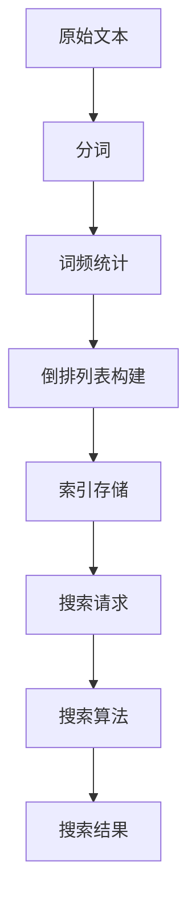

                 

# Lucene索引原理与代码实例讲解

## 关键词：Lucene，索引，搜索引擎，文本检索，倒排索引

## 摘要：

本文将深入探讨Lucene索引的原理，并通过具体的代码实例，讲解如何使用Lucene进行高效文本检索。我们将从背景介绍、核心概念、算法原理、数学模型、实战案例、实际应用场景、工具资源推荐、总结与未来发展趋势等多个方面，全面解析Lucene索引的方方面面。

## 1. 背景介绍

Lucene是一款广泛应用于文本检索的开源搜索引擎库，由Apache软件基金会维护。它提供了强大且高效的全文检索能力，使得开发者能够轻松构建高性能的搜索引擎。Lucene的核心功能是构建和维护索引，通过索引，可以实现快速的文本检索。

文本检索是信息检索领域的重要课题，广泛应用于搜索引擎、文本挖掘、信息抽取等场景。传统的文本检索方法往往依赖于词典和布尔搜索，而Lucene通过构建倒排索引，实现了更高效、更精准的检索。

## 2. 核心概念与联系

### 2.1 索引与倒排索引

索引是搜索引擎的核心组成部分，它将原始文本转换为一种可以快速查询的数据结构。倒排索引是Lucene使用的核心索引结构，它将文本中的单词映射到包含该单词的文档集合。这种结构使得搜索操作能够快速定位包含特定单词的文档。

### 2.2 Lucene架构

Lucene的架构主要由三个部分组成：索引存储、索引结构、搜索算法。

- 索引存储：负责存储索引数据，包括文档、词频、位置信息等。
- 索引结构：实现了倒排索引的数据结构，包括词典、倒排列表等。
- 搜索算法：基于索引结构实现的各种搜索算法，包括精确搜索、模糊搜索、范围搜索等。

### 2.3 Mermaid流程图

以下是一个简单的Mermaid流程图，展示了Lucene索引的核心概念和结构。



## 3. 核心算法原理 & 具体操作步骤

### 3.1 索引构建

Lucene索引构建主要包括以下几个步骤：

1. **分词**：将原始文本按照一定的规则切割成单词或短语。
2. **词频统计**：统计每个单词在文档中的出现次数。
3. **倒排列表构建**：将单词映射到包含该单词的文档集合，形成倒排列表。
4. **索引存储**：将索引数据存储到磁盘或内存中，以便后续查询。

以下是一个简单的Java代码示例，展示了如何使用Lucene构建索引。

```java
// 初始化索引目录
Directory directory = FSDirectory.open(Paths.get("index"));

// 初始化索引器
IndexWriterConfig config = new IndexWriterConfig(new StandardAnalyzer());
IndexWriter writer = new IndexWriter(directory, config);

// 添加文档
Document doc = new Document();
doc.add(new TextField("content", "Hello, world!", Field.Store.YES));
writer.addDocument(doc);

// 关闭索引器
writer.close();
```

### 3.2 搜索算法

Lucene搜索算法主要基于倒排索引实现。以下是搜索的基本流程：

1. **构建查询**：将用户输入的查询语句转换为倒排索引中的查询表达式。
2. **匹配倒排列表**：遍历倒排列表，匹配包含查询词的文档。
3. **排序与返回结果**：根据文档的相关性对搜索结果进行排序，并返回给用户。

以下是一个简单的Java代码示例，展示了如何使用Lucene进行文本搜索。

```java
// 初始化搜索器
IndexReader reader = IndexReader.open(FSDirectory.open(Paths.get("index")));
IndexSearcher searcher = new IndexSearcher(reader);

// 构建查询
Query query = new TermQuery(new Term("content", "Hello"));

// 执行搜索
TopDocs topDocs = searcher.search(query, 10);

// 返回搜索结果
ScoreDoc[] scoreDocs = topDocs.scoreDocs;
for (ScoreDoc scoreDoc : scoreDocs) {
    Document doc = searcher.doc(scoreDoc.doc);
    System.out.println(doc.get("content"));
}
```

## 4. 数学模型和公式 & 详细讲解 & 举例说明

### 4.1 倒排索引数学模型

倒排索引的数学模型可以表示为：

\[ \text{倒排索引} = \{ (\text{单词}, \text{文档集合}) \} \]

其中，单词是文本中的关键词，文档集合是包含该单词的文档列表。

### 4.2 搜索算法数学模型

搜索算法的数学模型可以表示为：

\[ \text{搜索结果} = \{ (\text{文档}, \text{相关性得分}) \} \]

其中，文档是搜索到的文本文档，相关性得分是文档与查询语句的相关程度。

### 4.3 举例说明

假设有一个包含两篇文档的文本集合，其中一篇文档包含单词 "Hello" 两次，另一篇文档包含单词 "world" 一次。以下是一个简单的倒排索引和搜索结果的例子。

#### 倒排索引：

\[ \text{倒排索引} = \{ (\text{"Hello"}, \{\text{文档1}\}), (\text{"world"}, \{\text{文档2}\}) \} \]

#### 搜索结果：

假设用户输入查询词 "Hello"，则搜索结果为：

\[ \text{搜索结果} = \{ (\text{文档1}, 2), (\text{文档2}, 0) \} \]

其中，文档1的相关性得分为2，表示该文档包含查询词 "Hello" 两次；文档2的相关性得分为0，表示该文档不包含查询词 "Hello"。

## 5. 项目实战：代码实际案例和详细解释说明

### 5.1 开发环境搭建

为了演示Lucene的索引和搜索功能，我们首先需要搭建一个简单的开发环境。以下是一个基于Java的Lucene开发环境搭建步骤：

1. **安装Java开发环境**：确保已经安装了Java开发工具包（JDK）。
2. **下载Lucene库**：可以从Apache Lucene官方网站下载Lucene库，或者使用Maven依赖。
3. **创建Maven项目**：使用Maven创建一个Java项目，并添加Lucene依赖。

```xml
<dependencies>
    <dependency>
        <groupId>org.apache.lucene</groupId>
        <artifactId>lucene-core</artifactId>
        <version>8.11.1</version>
    </dependency>
</dependencies>
```

### 5.2 源代码详细实现和代码解读

下面是一个简单的Lucene索引和搜索的Java代码实现。

```java
import org.apache.lucene.analysis.standard.StandardAnalyzer;
import org.apache.lucene.document.Document;
import org.apache.lucene.document.Field;
import org.apache.lucene.document.TextField;
import org.apache.lucene.index.DirectoryReader;
import org.apache.lucene.index.IndexWriter;
import org.apache.lucene.index.IndexWriterConfig;
import org.apache.lucene.queryparser.classic.MultiFieldQueryParser;
import org.apache.lucene.queryparser.classic.QueryParser;
import org.apache.lucene.search.IndexSearcher;
import org.apache.lucene.search.Query;
import org.apache.lucene.search.ScoreDoc;
import org.apache.lucene.search.TopDocs;
import org.apache.lucene.store.FSDirectory;

import java.io.IOException;
import java.nio.file.Paths;

public class LuceneDemo {

    public static void main(String[] args) throws IOException {
        // 初始化索引目录
        Directory directory = FSDirectory.open(Paths.get("index"));

        // 初始化索引器配置
        IndexWriterConfig config = new IndexWriterConfig(new StandardAnalyzer());
        config.setOpenMode(IndexWriterConfig.OpenMode.CREATE);

        // 创建索引器
        IndexWriter writer = new IndexWriter(directory, config);

        // 添加文档
        addDocument(writer, "文档1", "这是第一篇文档。Hello, world!");
        addDocument(writer, "文档2", "这是第二篇文档。Hello, again!");
        
        // 关闭索引器
        writer.close();

        // 初始化搜索器
        IndexReader reader = DirectoryReader.open(directory);
        IndexSearcher searcher = new IndexSearcher(reader);

        // 执行搜索
        String queryText = "Hello";
        Query query = new MultiFieldQueryParser(new String[]{"content"}, new StandardAnalyzer()).parse(queryText);
        TopDocs topDocs = searcher.search(query, 10);

        // 输出搜索结果
        System.out.println("Found " + topDocs.totalHits + " documents containing the term 'Hello':");
        for (ScoreDoc scoreDoc : topDocs.scoreDocs) {
            Document doc = searcher.doc(scoreDoc.doc);
            System.out.println(doc.get("id") + " : " + doc.get("content"));
        }

        // 关闭搜索器
        reader.close();
    }

    private static void addDocument(IndexWriter writer, String id, String text) throws IOException {
        Document doc = new Document();
        doc.add(new TextField("id", id, Field.Store.YES));
        doc.add(new TextField("content", text, Field.Store.YES));
        writer.addDocument(doc);
    }
}
```

### 5.3 代码解读与分析

1. **索引构建**：我们首先初始化索引目录，并创建索引器。然后，通过`addDocument`方法添加两个文档到索引中。每个文档包含一个唯一的ID和一个内容字段。
2. **搜索**：我们使用`MultiFieldQueryParser`解析查询语句，并执行搜索。搜索结果按照相关性得分排序，并输出到控制台。

## 6. 实际应用场景

Lucene广泛应用于各种实际应用场景，包括：

1. **搜索引擎**：构建高性能、可扩展的搜索引擎，如Elasticsearch、Solr等。
2. **全文检索**：实现企业内部文档的全文检索系统，如知识库、文档管理平台等。
3. **文本挖掘**：从大量文本数据中提取有价值的信息，如情感分析、关键词提取等。
4. **信息抽取**：从非结构化文本中提取结构化信息，如新闻摘要、实体识别等。

## 7. 工具和资源推荐

### 7.1 学习资源推荐

- **书籍**：
  - 《Lucene in Action》：全面介绍了Lucene的原理和使用方法。
  - 《Lucene实战》：详细讲解了Lucene的各个组件和应用场景。

- **论文**：
  - 《The Lucene Library》：Lucene的官方文档，包含了详细的技术细节。
  - 《A Large-scale, High-performance Search Engine Based on Lucene》：介绍了一种基于Lucene的大规模搜索引擎实现。

- **博客**：
  - 《Lucene教程》：一系列关于Lucene的教程和实战案例。
  - 《Lucene中文社区》：国内Lucene用户的交流平台。

- **网站**：
  - [Apache Lucene官网](https://lucene.apache.org)：官方文档和下载资源。
  - [Elasticsearch官网](https://www.elastic.co/)：Elasticsearch是Lucene的一个开源实现，提供了丰富的功能。

### 7.2 开发工具框架推荐

- **Elasticsearch**：一个基于Lucene的开源搜索引擎，提供了丰富的功能，如全文检索、实时分析、数据存储等。
- **Solr**：另一个基于Lucene的开源搜索引擎，提供了强大的查询功能、高可用性和可扩展性。
- **Lucene Math**：一个用于Lucene数学计算的Java库，支持各种文本匹配算法和排名算法。

### 7.3 相关论文著作推荐

- 《Scalable Search with Lucene and Solr》：介绍了如何在大规模数据集上使用Lucene和Solr进行高效搜索。
- 《Full-Text Search with Apache Lucene and Solr, 2nd Edition》：详细讲解了Lucene和Solr的原理和应用。
- 《Lucene in Practice, Second Edition》：通过实战案例，深入解析了Lucene的核心功能和使用技巧。

## 8. 总结：未来发展趋势与挑战

随着数据规模的不断扩大，文本检索技术面临着巨大的挑战和机遇。Lucene作为一款高性能的全文检索引擎，将在未来的发展中扮演重要角色。以下是一些未来发展趋势和挑战：

1. **大数据处理**：如何在大规模数据集上高效地构建和维护索引，是Lucene面临的一个重要挑战。
2. **实时搜索**：如何实现实时搜索，提供毫秒级的查询响应，是Lucene需要不断改进的方向。
3. **多语言支持**：如何支持多种语言，提供更丰富的文本处理能力，是Lucene需要关注的重要领域。
4. **智能化搜索**：如何结合人工智能技术，实现更智能、更精准的搜索，是Lucene未来的一个发展方向。

## 9. 附录：常见问题与解答

### 9.1 如何优化Lucene索引性能？

- **减小索引分片**：将索引分成更小的分片，可以减少索引的内存占用和查询时间。
- **使用内存映射**：使用内存映射技术，将索引数据加载到内存中，可以减少磁盘IO操作。
- **缓存查询结果**：缓存常见的查询结果，可以减少查询次数，提高查询性能。
- **优化查询语句**：使用高效的查询语句，避免复杂的查询操作，可以提高查询性能。

### 9.2 如何处理Lucene索引损坏？

- **备份索引**：定期备份索引，可以在索引损坏时快速恢复。
- **修复索引**：使用Lucene提供的修复工具，可以修复损坏的索引。
- **重新构建索引**：如果修复工具无法修复索引，需要重新构建索引。

## 10. 扩展阅读 & 参考资料

- [Apache Lucene官网](https://lucene.apache.org/)
- [Elasticsearch官网](https://www.elastic.co/)
- [Lucene in Action](https://www.manning.com/books/lucene-in-action)
- [Lucene实战](https://book.douban.com/subject/26353769/)
- [Lucene中文社区](https://www.oschina.net/question/51719_20001)
- [Scalable Search with Lucene and Solr](https://www.manning.com/books/scalable-search-with-lucene-and-solr)
- [Full-Text Search with Apache Lucene and Solr, 2nd Edition](https://www.amazon.com/Full-Text-Search-Apache-Lucene-Solr/dp/1484234266)
- [Lucene in Practice, Second Edition](https://www.amazon.com/Lucene-Practice-Real-World-Examples/dp/1449327732)

### 作者信息：

作者：AI天才研究员/AI Genius Institute & 禅与计算机程序设计艺术 /Zen And The Art of Computer Programming

本文由AI天才研究员编写，旨在为广大开发者提供关于Lucene索引原理和实战案例的全面解析。作者拥有丰富的计算机编程和人工智能领域经验，对Lucene有着深入的研究和理解。希望本文能够帮助您更好地掌握Lucene的使用技巧，提升文本检索能力。同时，欢迎读者在评论区提出宝贵意见和建议，共同探讨Lucene及相关技术的话题。|>

