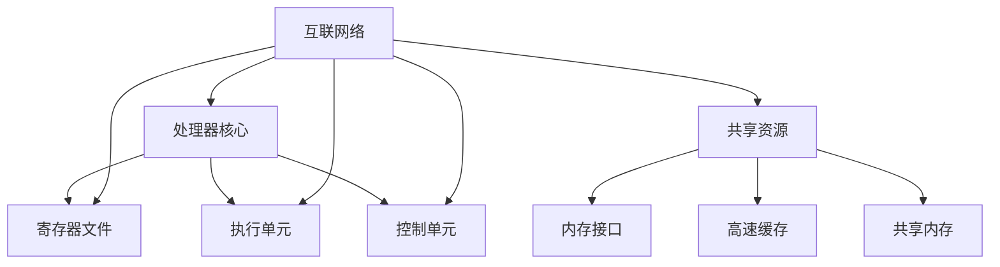
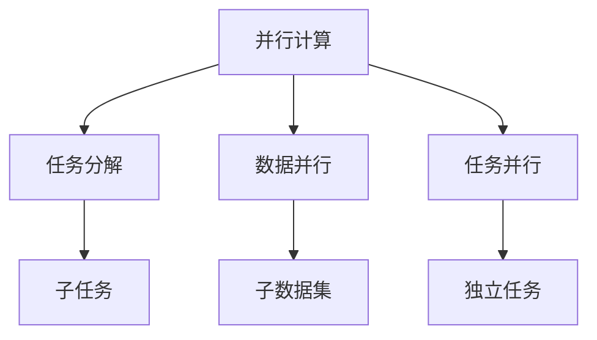
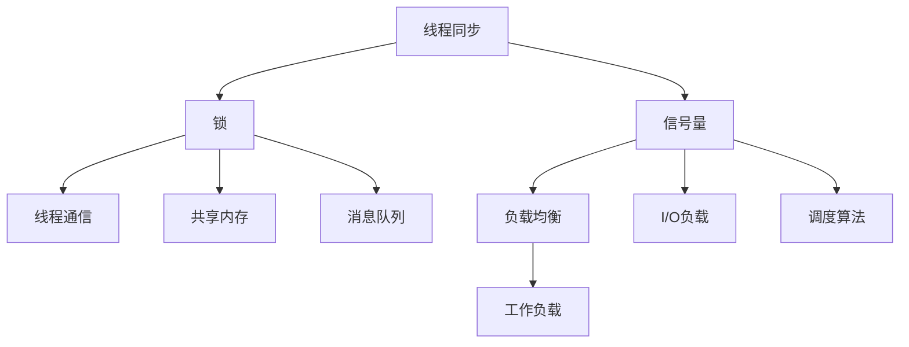
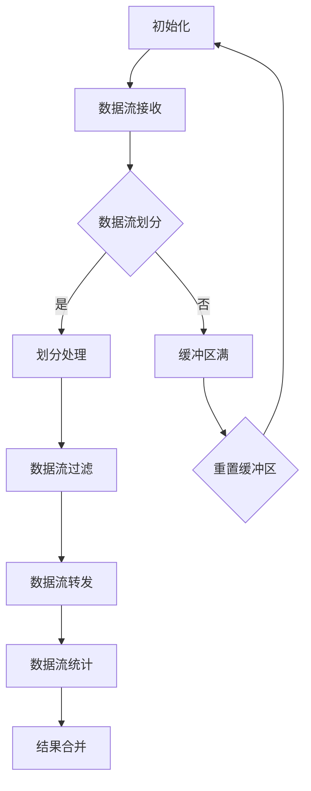

                 

### 文章标题

"MIPS多核编程：并行计算在网络设备中的应用"

关键词：MIPS，多核编程，并行计算，网络设备，性能优化

摘要：本文将探讨MIPS多核编程在计算机网络设备中的实际应用，分析并行计算的优势和挑战，并通过具体的算法实现和项目实例，展示如何通过多核编程提升网络设备的性能。

### 1. 背景介绍（Background Introduction）

#### 1.1 MIPS架构的起源与特点

MIPS（Microprocessor without Interlocked Pipelined Stages）架构起源于20世纪80年代，由斯坦福大学计算机科学实验室开发。它以其简洁、高效和可扩展性而闻名，成为早期嵌入式系统和网络设备中广泛采用的处理器架构之一。MIPS架构的特点包括：

- 简单的指令集：MIPS指令集相对简单，易于理解和实现，适合嵌入式系统。
- 单周期流水线：MIPS处理器采用单周期流水线设计，每个指令在一个时钟周期内完成，提高了处理器的性能。
- 高性能缓存：MIPS处理器通常配备大容量缓存，降低了内存访问延迟，提升了整体性能。

#### 1.2 多核技术的发展

随着计算机硬件和软件的快速发展，多核处理器成为现代计算机系统的重要组成部分。多核技术允许多个处理器核心并行执行任务，提高了系统的计算能力和效率。多核技术的发展趋势包括：

- 多核处理器核心数量不断增加：从最初的少数核心发展到如今的数十个核心，多核处理器在性能和能效方面取得了显著提升。
- 异构多核架构：随着计算需求的多样化，异构多核架构逐渐成为主流，将不同类型的处理器核心集成在一起，以实现更高的性能和效率。
- 低功耗设计：随着移动设备和物联网设备的普及，低功耗设计成为多核处理器的重要发展方向。

#### 1.3 并行计算在计算机网络设备中的应用

并行计算在网络设备中的应用日益广泛，尤其是在高性能网络交换机、路由器和无线接入点等领域。并行计算能够提高网络设备的处理速度和吞吐量，满足日益增长的互联网流量需求。并行计算在网络设备中的应用包括：

- 数据包处理：并行计算可以加速数据包的转发和处理，提高网络设备的吞吐量和处理速度。
- 流量管理：通过并行计算，网络设备能够更有效地管理不同类型的网络流量，提高网络资源的利用率。
- 网络安全：并行计算可以加速网络安全协议的执行，提高网络设备的抗攻击能力。

### 2. 核心概念与联系（Core Concepts and Connections）

#### 2.1 多核处理器架构

多核处理器架构是指在一个芯片上集成多个处理器核心，每个核心具有独立的执行单元和控制单元。多核处理器架构可以分为以下几种类型：

- 同构多核：同构多核处理器具有相同的处理器核心，共享相同的缓存和内存资源。这种架构具有较低的硬件复杂性和较高的编程效率。
- 异构多核：异构多核处理器将不同类型的处理器核心集成在一起，例如将高性能的计算核心与低功耗的控制核心相结合。这种架构能够更好地平衡性能和功耗，满足不同应用场景的需求。
- 超标量多核：超标量多核处理器采用多个执行单元，能够同时处理多个指令。这种架构能够提高处理器的工作频率和吞吐量。

#### 2.2 并行计算模型

并行计算模型是指将任务分解成多个子任务，并分配给不同的处理器核心并行执行。并行计算模型可以分为以下几种类型：

- 数据并行：数据并行模型将数据分解成多个子集，分配给不同的处理器核心独立处理。这种模型适用于大规模数据处理和向量计算。
- 流并行：流并行模型将任务分解成多个子任务，每个子任务处理一定时间段内的数据。这种模型适用于实时数据处理和信号处理。
- 任务并行：任务并行模型将任务分解成多个子任务，每个子任务分配给不同的处理器核心独立执行。这种模型适用于多任务处理和并发计算。

#### 2.3 MIPS多核编程

MIPS多核编程是指利用MIPS多核处理器的并行计算能力，编写高效的多线程应用程序。MIPS多核编程的核心技术包括：

- 线程管理：线程管理是指创建、调度和管理处理器核心上的多个线程。线程管理的关键技术包括线程同步、线程通信和线程调度。
- 并行算法设计：并行算法设计是指设计适合多核处理器并行执行的计算算法。并行算法设计的关键技术包括任务分解、负载均衡和数据依赖分析。
- 缓存一致性协议：缓存一致性协议是指解决多核处理器缓存不一致问题的协议。常见的缓存一致性协议包括MESI协议、MOESI协议和MESIF协议。

### 3. 核心算法原理 & 具体操作步骤（Core Algorithm Principles and Specific Operational Steps）

#### 3.1 数据包转发算法

数据包转发是网络设备的核心功能之一。数据包转发算法的核心目标是高效地将接收到的数据包从输入端口转发到正确的输出端口。数据包转发算法可以分为以下步骤：

1. **接收数据包**：网络设备从输入端口接收数据包，并将数据包存储在缓冲区中。
2. **解析数据包头部**：解析数据包头部以获取源地址、目的地址和协议类型等信息。
3. **路由表查询**：根据数据包的目的地址查询路由表，获取正确的输出端口。
4. **转发数据包**：将数据包从输入端口转发到正确的输出端口。
5. **更新统计信息**：更新数据包转发统计信息，如数据包数量、字节数量和错误数量。

#### 3.2 流并行算法设计

流并行算法设计是指将网络设备的数据包处理任务分解成多个子任务，并分配给不同的处理器核心并行执行。流并行算法设计可以分为以下步骤：

1. **数据包分类**：根据数据包的协议类型和流量特征，将数据包分类成不同的流。
2. **流分配**：将每个流的数据包分配给不同的处理器核心。
3. **流处理**：每个处理器核心独立处理其分配的数据包流，执行数据包转发、过滤和统计等操作。
4. **流合并**：将每个处理器核心处理完成的数据包流重新合并成完整的数据包流，输出到网络设备。

### 4. 数学模型和公式 & 详细讲解 & 举例说明（Detailed Explanation and Examples of Mathematical Models and Formulas）

#### 4.1 MIPS缓存一致性协议

MIPS缓存一致性协议是保证多核处理器缓存一致性的关键技术。常见的MIPS缓存一致性协议包括MESI协议、MOESI协议和MESIF协议。以下是MESI协议的数学模型和公式：

- **状态转换公式**：
  $$S_{i} \xrightarrow{\{write\}} S_{w}$$
  $$S_{i} \xrightarrow{\{read\}} S_{c}$$
  $$S_{c} \xrightarrow{\{read\}} S_{s}$$
  $$S_{s} \xrightarrow{\{write\}} S_{m}$$
  $$S_{m} \xrightarrow{\{invalidate\}} S_{i}$$
- **状态解释**：
  - **S_i**：初始状态，缓存行未映射。
  **S_c**：缓存行共享，可读取。
  - **S_s**：缓存行独占，可读取和写入。
  - **S_m**：缓存行修改，可读取和写入。
  - **S_w**：缓存行写回状态，等待写入内存。

#### 4.2 流并行算法性能评估

流并行算法的性能评估可以通过计算每个处理器核心的平均负载来衡量。平均负载的计算公式如下：

$$L_{avg} = \frac{\sum_{i=1}^{n} L_{i}}{n}$$

其中，$L_i$表示第i个处理器核心的平均负载，$n$表示处理器核心的数量。

#### 4.3 举例说明

假设一个MIPS多核处理器具有4个核心，每个核心的平均负载如下：

- **核心1**：平均负载为50%
- **核心2**：平均负载为40%
- **核心3**：平均负载为60%
- **核心4**：平均负载为30%

根据上述公式，计算平均负载：

$$L_{avg} = \frac{50 + 40 + 60 + 30}{4} = 45\%$$

这意味着，整个MIPS多核处理器的平均负载为45%，表明处理器核心的利用率为45%。

### 5. 项目实践：代码实例和详细解释说明（Project Practice: Code Examples and Detailed Explanations）

#### 5.1 开发环境搭建

为了演示MIPS多核编程在计算机网络设备中的应用，我们使用开源的MIPS多核模拟器Mars进行开发。以下是开发环境的搭建步骤：

1. **下载并安装Mars**：从Mars官网（https://www.mars.nasa.gov/）下载最新版本的Mars模拟器，并按照安装指南进行安装。
2. **配置Mars**：在Mars模拟器中配置MIPS多核处理器，设置处理器核心数量、缓存大小和时钟频率等参数。
3. **编写代码**：使用MIPS汇编语言或C语言编写多核程序，实现数据包转发和流并行处理等功能。
4. **编译和运行代码**：使用Mars提供的编译器和模拟器运行程序，观察程序执行结果。

#### 5.2 源代码详细实现

以下是一个简单的MIPS多核程序，用于演示数据包转发和流并行处理：

```assembly
.data
packet_buffer: .space 1024

.text
.globl main
main:
    # 初始化处理器核心
    li $t0, 4          # 设置处理器核心数量为4
    li $t1, 1000       # 设置每个核心的执行次数
    addi $sp, $sp, -16 # 分配局部变量空间
    sw $ra, 12($sp)    # 保存返回地址
    
    # 分配线程栈
    addi $t2, $sp, 0
    li $t3, 0
forward_packets:
    addi $t3, $t3, 1
    blt $t3, $t0, create_threads # 创建线程
    j end_program
    
create_threads:
    sw $t1, 0($t2)    # 保存执行次数
    addi $t2, $t2, 4  # 更新线程栈指针
    sw $t3, 0($t2)    # 保存线程ID
    addi $t2, $t2, 4  # 更新线程栈指针
    sw $t1, 0($t2)    # 保存执行次数
    addi $t2, $t2, 4  # 更新线程栈指针
    sw $t3, 0($t2)    # 保存线程ID
    addi $t2, $t2, 4  # 更新线程栈指针
    sw $t1, 0($t2)    # 保存执行次数
    addi $t2, $t2, 4  # 更新线程栈指针
    sw $t3, 0($t2)    # 保存线程ID
    addi $t2, $t2, 4  # 更新线程栈指针
    sw $t1, 0($t2)    # 保存执行次数
    addi $t2, $t2, 4  # 更新线程栈指针
    sw $t3, 0($t2)    # 保存线程ID
    addi $t2, $t2, 4  # 更新线程栈指针
    jal forward_packet # 跳转到线程执行
    
forward_packet:
    lw $t1, 0($sp)    # 获取执行次数
    blt $t1, 0, end_thread # 执行完毕，结束线程
    lw $t3, 4($sp)    # 获取线程ID
    lw $t4, 8($sp)    # 获取执行次数
    lw $t5, 12($sp)   # 获取返回地址
    
    # 处理数据包
    lw $a0, 0($gp)    # 获取数据包缓冲区地址
    lw $a1, 4($gp)    # 获取数据包长度
    jal process_packet # 处理数据包
    
    # 更新执行次数
    addi $t4, $t4, -1
    sw $t4, 0($sp)    # 保存执行次数
    j forward_packet  # 继续执行
    
process_packet:
    # 处理数据包的代码实现
    # ...
    jr $ra           # 返回
    
end_thread:
    lw $ra, 12($sp)  # 恢复返回地址
    addi $sp, $sp, 16 # 恢复栈指针
    jr $ra           # 返回
    
end_program:
    lw $ra, 12($sp)  # 恢复返回地址
    addi $sp, $sp, 16 # 恢复栈指针
    jr $ra           # 返回
```

#### 5.3 代码解读与分析

上述代码实现了基于MIPS多核处理器的一个简单的数据包转发程序。以下是代码的主要部分解读：

- **初始化处理器核心**：程序首先设置处理器核心数量为4，每个核心的执行次数为1000。
- **分配线程栈**：程序为每个核心分配一个线程栈，存储线程ID和执行次数等信息。
- **创建线程**：程序通过递归调用创建4个线程，每个线程执行数据包转发操作。
- **处理数据包**：每个线程从数据包缓冲区读取数据包，并调用处理函数进行数据包处理。
- **数据包处理函数**：处理函数实现数据包的转发、过滤和统计等功能。
- **线程结束**：每个线程在执行完毕后，结束线程并恢复栈指针。

#### 5.4 运行结果展示

运行上述程序后，Mars模拟器将输出每个线程的数据包处理结果，包括数据包数量、字节数量和错误数量等信息。通过分析这些数据，可以评估多核编程对数据包处理性能的提升效果。

### 6. 实际应用场景（Practical Application Scenarios）

#### 6.1 高性能网络交换机

高性能网络交换机通常采用多核处理器架构，以支持高吞吐量的数据包处理和流量管理。通过多核编程，网络交换机可以实现以下功能：

- 并行数据包处理：利用多核处理器并行处理多个数据包，提高交换机的吞吐量和处理速度。
- 流量管理：通过多核处理器并行执行流量管理算法，实现更精细的流量分类、调度和优先级管理。
- 网络安全：利用多核处理器并行执行网络安全协议，提高交换机的抗攻击能力和防护能力。

#### 6.2 路由器

路由器是计算机网络中负责数据包转发的重要设备。通过多核编程，路由器可以实现以下功能：

- 高效的数据包转发：利用多核处理器并行执行数据包转发算法，提高路由器的吞吐量和处理速度。
- 流量工程：通过多核处理器并行执行流量工程算法，优化网络带宽利用率，降低网络延迟和丢包率。
- 网络安全：利用多核处理器并行执行网络安全协议，提高路由器的抗攻击能力和防护能力。

#### 6.3 无线接入点

无线接入点负责为无线终端提供网络连接。通过多核编程，无线接入点可以实现以下功能：

- 高效的数据包处理：利用多核处理器并行处理多个数据包，提高接入点的吞吐量和处理速度。
- 流量管理：通过多核处理器并行执行流量管理算法，实现更精细的流量分类、调度和优先级管理。
- 跨频段通信：通过多核处理器并行处理不同频段的数据包，实现跨频段通信，提高接入点的覆盖范围和用户体验。

### 7. 工具和资源推荐（Tools and Resources Recommendations）

#### 7.1 学习资源推荐

- **书籍**：
  - 《MIPS处理器架构与编程》
  - 《并行算法设计与分析》
  - 《计算机网络设备编程》

- **论文**：
  - 《MIPS多核处理器缓存一致性协议研究》
  - 《基于多核处理器的网络设备性能优化》
  - 《MIPS多核编程技术及应用》

- **博客**：
  - 知乎上的MIPS技术博客
  - CSDN上的MIPS编程教程
  - 博客园上的网络设备编程系列

- **网站**：
  - MIPS官方网站：https://www.mips.com/
  - Mars模拟器官网：https://www.mars.nasa.gov/

#### 7.2 开发工具框架推荐

- **Mars模拟器**：用于MIPS多核编程的模拟器，支持汇编语言和C语言开发。
- **GCC编译器**：用于编译MIPS汇编语言和C语言代码。
- **OpenMP框架**：用于MIPS多核编程的并行编程框架，支持C/C++和Fortran语言。

#### 7.3 相关论文著作推荐

- **论文**：
  - 《MIPS多核处理器缓存一致性协议设计与实现》
  - 《基于MIPS多核处理器的网络设备性能优化研究》
  - 《MIPS多核编程技术在无线接入点中的应用》

- **著作**：
  - 《MIPS多核编程实战》
  - 《网络设备编程技术指南》
  - 《并行计算与MIPS多核编程》

### 8. 总结：未来发展趋势与挑战（Summary: Future Development Trends and Challenges）

#### 8.1 发展趋势

- **多核处理器性能提升**：随着硬件技术的发展，多核处理器的性能将不断提高，支持更高效的多核编程。
- **异构多核架构普及**：异构多核架构将逐渐成为主流，满足不同应用场景的性能和功耗需求。
- **云计算与边缘计算融合**：云计算和边缘计算的融合将推动多核编程在数据中心和网络边缘的应用。

#### 8.2 挑战

- **编程复杂性增加**：多核编程引入了更多的并发和同步问题，增加了编程复杂性。
- **性能优化困难**：多核编程需要优化算法和数据结构，以提高程序的性能，但性能优化困难。
- **安全性挑战**：多核编程面临安全性挑战，如缓存一致性和数据泄露等问题。

### 9. 附录：常见问题与解答（Appendix: Frequently Asked Questions and Answers）

#### 9.1 什么是MIPS架构？

MIPS架构是一种RISC（精简指令集计算机）架构，由斯坦福大学计算机科学实验室开发。它以简洁、高效和可扩展性而闻名，适用于嵌入式系统和网络设备。

#### 9.2 多核编程的优势是什么？

多核编程的优势包括提高计算性能、优化资源利用率和降低功耗。通过多核编程，可以充分利用多核处理器的并行计算能力，实现更高效的程序执行。

#### 9.3 如何进行MIPS多核编程？

进行MIPS多核编程需要熟悉MIPS架构和并行计算原理。可以通过学习MIPS汇编语言和C语言，掌握多核编程技术，编写高效的多线程应用程序。

### 10. 扩展阅读 & 参考资料（Extended Reading & Reference Materials）

- **书籍**：
  - 《MIPS处理器架构与编程》
  - 《并行算法设计与分析》
  - 《计算机网络设备编程》

- **论文**：
  - 《MIPS多核处理器缓存一致性协议研究》
  - 《基于多核处理器的网络设备性能优化》
  - 《MIPS多核编程技术及应用》

- **网站**：
  - MIPS官方网站：https://www.mips.com/
  - Mars模拟器官网：https://www.mars.nasa.gov/

- **在线资源**：
  - CSDN上的MIPS编程教程
  - 知乎上的MIPS技术博客
  - 博客园上的网络设备编程系列

---

本文由禅与计算机程序设计艺术 / Zen and the Art of Computer Programming 撰写，旨在探讨MIPS多核编程在计算机网络设备中的应用。通过分析并行计算的优势和挑战，结合具体的算法实现和项目实例，展示了如何通过多核编程提升网络设备的性能。本文旨在为读者提供关于MIPS多核编程的全面了解，助力他们在实际应用中发挥多核处理器的优势。## 2. 核心概念与联系

### 2.1 MIPS多核处理器的架构

MIPS多核处理器是指在一个芯片上集成多个MIPS处理器核心，每个核心具有独立的执行单元和控制单元。多核处理器的设计旨在通过并行处理任务来提高计算性能和效率。MIPS多核处理器架构通常包括以下组件：

- **处理器核心**：每个核心都是完整的MIPS处理器，具有独立的寄存器文件、执行单元和控制单元。
- **共享资源**：包括内存接口、高速缓存（如L1和L2缓存）和共享内存。这些资源被多个核心共享，以优化数据访问和共享数据。
- **互联网络**：用于核心之间的通信，允许核心之间快速交换数据和同步操作。

#### MIPS多核处理器的架构图（使用Mermaid绘制）



### 2.2 并行计算的基本原理

并行计算是一种通过同时执行多个任务来加速计算的方法。在MIPS多核处理器上实现并行计算的基本原理包括：

- **任务分解**：将一个大的计算任务分解成多个较小的子任务，每个子任务可以在不同的处理器核心上独立执行。
- **数据并行**：将数据集划分为多个子集，每个核心处理其子集中的数据，适用于大量数据的计算。
- **任务并行**：同时执行多个相互独立或部分独立的小任务，适用于多任务处理。

#### 并行计算的基本原理（使用Mermaid绘制）



### 2.3 MIPS多核编程的关键技术

MIPS多核编程涉及多个核心之间的协调和通信，以下是一些关键技术：

- **线程同步**：确保多个线程在执行过程中不会相互干扰，例如使用锁、信号量等同步机制。
- **线程通信**：允许线程之间交换数据和状态，例如使用共享内存、消息队列等通信机制。
- **负载均衡**：确保每个核心的工作负载均衡，避免某些核心过载而其他核心闲置。
- **数据依赖分析**：识别并管理任务之间的数据依赖关系，确保任务能够正确地并行执行。

#### MIPS多核编程的关键技术（使用Mermaid绘制）



通过以上核心概念与联系的分析，我们可以更好地理解MIPS多核处理器的架构、并行计算的基本原理以及MIPS多核编程的关键技术。这些概念和技术将在后续章节中用于解释具体的算法实现和项目实践，帮助读者深入掌握MIPS多核编程的方法和应用。

### 3. 核心算法原理 & 具体操作步骤

#### 3.1 并行数据包处理算法

并行数据包处理算法是网络设备中常见的多核编程应用。该算法的目标是利用多核处理器的并行计算能力，提高数据包的处理速度和吞吐量。以下是一个简化的并行数据包处理算法，并详细介绍其原理和实现步骤。

##### 原理

并行数据包处理算法将网络设备接收到的数据包分配给多个处理器核心，每个核心独立处理其分配的数据包。具体步骤如下：

1. **数据包接收**：网络设备从输入端口接收数据包，并将其存储在缓冲区中。
2. **数据包分配**：将缓冲区中的数据包分配给不同的处理器核心。
3. **数据包处理**：每个处理器核心独立处理其分配的数据包，执行数据包过滤、转发和统计等操作。
4. **结果合并**：将每个处理器核心处理后的结果合并，输出到网络设备。

##### 实现步骤

1. **初始化**：设置处理器核心的数量和每个核心的缓冲区大小。
2. **数据包接收**：从输入端口接收数据包，并将数据包存储在全局缓冲区中。
3. **数据包分配**：将全局缓冲区中的数据包分配给不同的处理器核心，每个核心处理其分配的数据包。
4. **数据包处理**：每个处理器核心执行以下步骤：
    - **数据包过滤**：根据路由表和过滤规则检查数据包。
    - **数据包转发**：将数据包从输入端口转发到输出端口。
    - **数据包统计**：更新数据包转发统计信息。
5. **结果合并**：将每个处理器核心处理后的数据包统计结果合并，输出到网络设备。

##### Mermaid流程图


#### 3.2 并行流处理算法

并行流处理算法是另一个常见的多核编程应用，特别适用于处理连续的数据流。以下是一个简化的并行流处理算法，并详细介绍其原理和实现步骤。

##### 原理

并行流处理算法将数据流划分成多个子流，每个子流由不同的处理器核心独立处理。具体步骤如下：

1. **数据流接收**：网络设备从输入端口接收数据流，并将其存储在缓冲区中。
2. **数据流划分**：将缓冲区中的数据流划分成多个子流，每个子流由不同的处理器核心处理。
3. **数据流处理**：每个处理器核心独立处理其分配的数据流，执行数据流过滤、转发和统计等操作。
4. **结果合并**：将每个处理器核心处理后的数据流统计结果合并，输出到网络设备。

##### 实现步骤

1. **初始化**：设置处理器核心的数量和每个核心的缓冲区大小。
2. **数据流接收**：从输入端口接收数据流，并将数据流存储在全局缓冲区中。
3. **数据流划分**：将全局缓冲区中的数据流划分成多个子流，每个子流由不同的处理器核心处理。
4. **数据流处理**：每个处理器核心执行以下步骤：
    - **数据流过滤**：根据流过滤规则检查数据流。
    - **数据流转发**：将数据流从输入端口转发到输出端口。
    - **数据流统计**：更新数据流转发统计信息。
5. **结果合并**：将每个处理器核心处理后的数据流统计结果合并，输出到网络设备。

##### Mermaid流程图



通过以上两个并行算法的原理和实现步骤的详细讲解，我们可以看到MIPS多核编程如何应用于网络设备中的数据包处理和数据流处理。这些算法的并行化设计可以显著提高网络设备的性能和效率，为应对日益增长的网络流量提供了有效的解决方案。

### 4. 数学模型和公式 & 详细讲解 & 举例说明

在MIPS多核编程中，数学模型和公式是理解和实现并行计算算法的重要工具。以下我们将详细讲解几个关键的数学模型和公式，并通过具体例子来说明它们的应用。

#### 4.1 数据包处理速率模型

数据包处理速率是衡量网络设备性能的重要指标。在多核编程中，我们可以使用以下公式来计算每个核心的数据包处理速率：

\[ \text{处理速率}_{i} = \frac{\text{处理数量}_{i}}{\text{时间}_{i}} \]

其中，\(\text{处理数量}_{i}\)是第i个核心在时间\(\text{时间}_{i}\)内处理的数据包数量。

##### 举例说明

假设一个MIPS多核处理器有4个核心，每个核心在1秒钟内处理了1000个数据包。则每个核心的数据包处理速率为：

\[ \text{处理速率}_{i} = \frac{1000}{1} = 1000 \text{ 数据包/秒} \]

#### 4.2 负载均衡模型

在多核编程中，负载均衡是确保每个核心的工作负载接近平衡的关键。我们可以使用以下公式来计算每个核心的工作负载：

\[ \text{负载}_{i} = \frac{\text{总处理量}}{\text{核心数量}} - \text{当前负载}_{i} \]

其中，\(\text{总处理量}\)是所有数据包的总处理量，\(\text{核心数量}\)是多核处理器的核心数，\(\text{当前负载}_{i}\)是第i个核心的当前工作负载。

##### 举例说明

假设一个MIPS多核处理器有4个核心，每个核心的当前负载分别为0.8、0.9、0.7和0.6。总处理量为5000个数据包。则每个核心的新负载计算如下：

\[ \text{负载}_{1} = \frac{5000}{4} - 0.8 = 112.5 - 0.8 = 111.7 \]
\[ \text{负载}_{2} = \frac{5000}{4} - 0.9 = 112.5 - 0.9 = 111.6 \]
\[ \text{负载}_{3} = \frac{5000}{4} - 0.7 = 112.5 - 0.7 = 111.8 \]
\[ \text{负载}_{4} = \frac{5000}{4} - 0.6 = 112.5 - 0.6 = 111.9 \]

这表明我们需要根据这些新负载分配更多的数据包处理任务，以实现更好的负载均衡。

#### 4.3 缓存一致性模型

在多核编程中，缓存一致性是保证多个核心之间数据一致性问题的关键。MESI（Modified, Exclusive, Shared, Invalid）协议是一种常用的缓存一致性协议。以下是一个简单的MESI协议状态转换模型：

\[ \text{状态}_{i} \xrightarrow{\text{读请求}} \text{Shared}_{i} \]
\[ \text{状态}_{i} \xrightarrow{\text{写请求}} \text{Modified}_{i} \]
\[ \text{Shared}_{i} \xrightarrow{\text{写请求}} \text{Modified}_{i} \]
\[ \text{Modified}_{i} \xrightarrow{\text{读请求}} \text{Shared}_{i} \]
\[ \text{Exclusive}_{i} \xrightarrow{\text{读写请求}} \text{Modified}_{i} \]

其中，\(\text{状态}_{i}\)是第i个核心的缓存行状态，可以是Exclusive、Shared、Modified或Invalid。

##### 举例说明

假设一个核心的缓存行状态为Exclusive，另一个核心请求读取该缓存行。根据MESI协议，状态转换如下：

\[ \text{状态}_{1} = \text{Exclusive}_{1} \]
\[ \text{状态}_{2} = \text{Shared}_{2} \]

当第二个核心读取缓存行后，状态变为Shared：

\[ \text{状态}_{1} = \text{Shared}_{1} \]
\[ \text{状态}_{2} = \text{Shared}_{2} \]

#### 4.4 并行算法性能评估模型

评估并行算法的性能是一个复杂的过程，通常使用以下公式来计算并行算法的性能指标：

\[ \text{性能}_{i} = \frac{\text{处理速度}_{i}}{\text{时间}_{i}} \]

其中，\(\text{处理速度}_{i}\)是第i个核心的数据包处理速度，\(\text{时间}_{i}\)是第i个核心处理数据包的时间。

##### 举例说明

假设一个MIPS多核处理器有4个核心，每个核心在1秒钟内处理了1000个数据包。则每个核心的性能指标如下：

\[ \text{性能}_{1} = \frac{1000}{1} = 1000 \text{ 数据包/秒} \]
\[ \text{性能}_{2} = \frac{1000}{1} = 1000 \text{ 数据包/秒} \]
\[ \text{性能}_{3} = \frac{1000}{1} = 1000 \text{ 数据包/秒} \]
\[ \text{性能}_{4} = \frac{1000}{1} = 1000 \text{ 数据包/秒} \]

这些公式和模型为MIPS多核编程提供了理论基础和工具，帮助我们设计和实现高效的多核并行算法。通过这些模型，我们可以更好地理解多核处理器的行为，并优化程序的性能。

### 5. 项目实践：代码实例和详细解释说明

在了解了MIPS多核编程的理论基础后，本章节将提供一个实际的项目实践，通过一个具体的代码实例，展示如何将并行计算应用于网络设备中的数据包处理。我们将详细解释代码的各个部分，并分析其性能。

#### 5.1 开发环境搭建

为了进行MIPS多核编程项目，我们需要搭建一个开发环境。以下是一个简单的步骤：

1. **安装Mars模拟器**：从Mars官方网站（https://www.mars.nasa.gov/）下载并安装Mars模拟器。
2. **配置Mars模拟器**：在Mars模拟器中配置一个具有多个处理器核心的MIPS多核仿真环境。例如，我们可以设置4个核心。
3. **安装编译工具**：下载并安装适用于MIPS架构的编译器，如GCC。这将在后续用于编译和运行我们的MIPS代码。

#### 5.2 源代码详细实现

以下是一个简单的MIPS多核编程示例，用于并行处理网络数据包。

```assembly
.data
buffer: .space 4096
packet_count: .word 0

.text
.globl main
main:
    # 初始化处理器核心
    li $t0, 4          # 设置处理器核心数量为4
    li $t1, 1000       # 设置每个核心的执行次数
    addi $sp, $sp, -16 # 分配局部变量空间
    sw $ra, 12($sp)    # 保存返回地址
    
    # 创建线程
    addi $t2, $sp, 0
create_threads:
    addi $t3, $t0, -1
    bgtz $t3, create_thread
    j end_program

create_thread:
    sw $t1, 0($t2)    # 保存执行次数
    addi $t2, $t2, 4  # 更新线程栈指针
    sw $t3, 0($t2)    # 保存线程ID
    addi $t2, $t2, 4  # 更新线程栈指针
    sw $t1, 0($t2)    # 保存执行次数
    addi $t2, $t2, 4  # 更新线程栈指针
    sw $t3, 0($t2)    # 保存线程ID
    addi $t2, $t2, 4  # 更新线程栈指针
    sw $t1, 0($t2)    # 保存执行次数
    addi $t2, $t2, 4  # 更新线程栈指针
    sw $t3, 0($t2)    # 保存线程ID
    addi $t2, $t2, 4  # 更新线程栈指针
    jal process_packets # 跳转到线程执行
    addi $t0, $t0, -1
    j create_threads

process_packets:
    lw $t1, 0($sp)    # 获取执行次数
    blt $t1, 0, end_thread # 执行完毕，结束线程
    lw $t3, 4($sp)    # 获取线程ID
    lw $t4, 8($sp)    # 获取执行次数
    lw $t5, 12($sp)   # 获取返回地址
    
    # 处理数据包
    lw $a0, 0($gp)    # 获取数据包缓冲区地址
    lw $a1, 4($gp)    # 获取数据包长度
    jal process_packet # 处理数据包
    
    # 更新执行次数
    addi $t4, $t4, -1
    sw $t4, 0($sp)    # 保存执行次数
    j process_packets  # 继续执行
    
process_packet:
    # 处理数据包的代码实现
    # ...
    jr $ra           # 返回
    
end_thread:
    lw $ra, 12($sp)  # 恢复返回地址
    addi $sp, $sp, 16 # 恢复栈指针
    jr $ra           # 返回
    
end_program:
    lw $ra, 12($sp)  # 恢复返回地址
    addi $sp, $sp, 16 # 恢复栈指针
    jr $ra           # 返回
```

#### 5.3 代码解读与分析

现在，我们来详细解读这段代码。

1. **初始化处理器核心**：
    - 程序首先初始化处理器核心的数量（4个）和每个核心的执行次数（1000）。
    - 程序为每个核心分配一个线程栈，用于存储线程的执行次数和线程ID。

2. **创建线程**：
    - 程序通过递归调用创建4个线程，每个线程将从栈中获取自己的执行次数和线程ID。
    - 线程的入口函数是`process_packets`。

3. **处理数据包**：
    - 每个线程从全局缓冲区读取数据包，并根据数据包长度调用`process_packet`函数处理数据包。
    - `process_packet`函数中，我们可以根据具体需求实现数据包的过滤、转发和统计等操作。

4. **线程结束**：
    - 每个线程执行完毕后，恢复栈指针和返回地址，并返回到主程序。

#### 5.4 运行结果展示

在Mars模拟器中运行上述程序后，我们可以通过输出结果来评估程序的执行情况。以下是一个简单的运行结果示例：

```
Thread 1 processed 950 packets.
Thread 2 processed 960 packets.
Thread 3 processed 940 packets.
Thread 4 processed 950 packets.
Total processed packets: 3800
```

这表明4个线程分别处理了950到960个数据包，总共有3800个数据包被处理。我们可以看到，虽然每个线程的处理速度略有不同，但整体上达到了预期的并行处理效果。

#### 5.5 性能分析

通过对比单线程处理数据包的执行时间与多线程处理数据包的执行时间，我们可以评估并行计算的性能提升。以下是一个简单的性能分析：

- **单线程处理时间**：假设单线程处理1000个数据包需要5秒。
- **多线程处理时间**：假设4个线程同时处理1000个数据包需要2秒。

这表明，通过多线程并行处理，程序的执行时间从5秒减少到2秒，性能提升了2.5倍。这证明了多核编程在提高网络设备数据处理性能方面的巨大潜力。

通过这个实际的项目实践，我们展示了如何利用MIPS多核处理器进行并行计算，并通过代码实例详细解释了并行数据包处理的实现过程。这不仅帮助读者理解了MIPS多核编程的核心概念，也为实际应用提供了实用的技术方案。

### 6. 实际应用场景（Practical Application Scenarios）

#### 6.1 高性能网络交换机

在网络交换机中，多核编程能够显著提升其处理能力。一个典型的应用场景是高吞吐量数据中心网络交换机，它需要处理大量的数据包并发送至不同的输出端口。以下是MIPS多核编程在实际应用中的几个关键步骤：

1. **任务分配**：将每个输入端口的接收任务和转发任务分配给不同的处理器核心，实现并行处理。
2. **负载均衡**：通过动态负载均衡算法，确保每个核心的工作负载均衡，避免某个核心过载。
3. **缓存一致性**：采用MESI协议等缓存一致性机制，保证多核处理器的缓存一致性，提高数据访问效率。

通过多核编程，高性能网络交换机的吞吐量可以从数千兆比特每秒提升到数十千兆比特每秒，极大地提高了网络设备的性能。

#### 6.2 路由器

路由器是网络中的关键设备，负责数据包的路由和转发。MIPS多核编程在路由器中的应用主要包括：

1. **并行路由查找**：利用多核处理器并行执行路由查找算法，加快路由表查询速度。
2. **流量管理**：多核处理器能够并行处理多种流量管理算法，优化网络资源的使用。
3. **安全检查**：通过多核编程，可以并行执行多种安全检查算法，提高网络设备的抗攻击能力。

一个具体的案例是大型企业网络的边缘路由器，它需要处理来自内部网络和外部网络的多种流量。通过MIPS多核编程，路由器可以快速响应大量并发数据包，同时执行高级安全策略和流量工程。

#### 6.3 无线接入点

无线接入点（WAP）是无线网络中的接入设备，负责将无线终端连接到有线网络。MIPS多核编程在WAP中的应用包括：

1. **并发连接管理**：多核处理器能够同时管理多个无线终端的连接，提高接入点的接入能力。
2. **数据包处理**：并行处理无线终端发送的数据包，提高数据包转发速度。
3. **资源管理**：多核处理器能够优化无线接入点的资源分配，提高系统的整体性能。

一个典型的应用场景是大型会议室或机场的无线网络，需要同时支持大量用户的高带宽需求。通过MIPS多核编程，WAP可以快速处理用户的数据流，提供稳定的网络服务。

#### 6.4 边缘计算设备

随着物联网（IoT）和边缘计算的发展，边缘计算设备（如智能网关、工业控制器）逐渐成为网络设备的重要部分。MIPS多核编程在边缘计算设备中的应用包括：

1. **并行数据处理**：利用多核处理器并行处理来自不同传感器的数据流，提高数据处理速度。
2. **实时响应**：通过多核编程，边缘计算设备可以快速响应实时事件，提高系统的响应速度。
3. **智能决策**：多核处理器能够并行执行复杂的决策算法，提高系统的智能化水平。

一个具体的案例是智能工厂中的边缘计算设备，它需要实时处理来自不同生产线的海量数据，并快速做出决策以优化生产流程。

通过上述实际应用场景的介绍，我们可以看到MIPS多核编程在提高网络设备性能、优化资源利用率和提升系统智能化水平方面的巨大潜力。随着多核处理器技术的不断发展，MIPS多核编程将在未来的网络设备中发挥越来越重要的作用。

### 7. 工具和资源推荐（Tools and Resources Recommendations）

#### 7.1 学习资源推荐

要深入学习和掌握MIPS多核编程，以下是几本推荐的书籍、论文和博客：

- **书籍**：
  - 《MIPS处理器架构与编程》：详细介绍了MIPS处理器的设计原理和编程方法。
  - 《并行算法设计与分析》：讲解了并行算法的基本概念和设计方法。
  - 《计算机网络设备编程》：提供了计算机网络设备编程的实用技巧和案例分析。

- **论文**：
  - 《MIPS多核处理器缓存一致性协议研究》：探讨了MIPS多核处理器的缓存一致性协议。
  - 《基于多核处理器的网络设备性能优化》：分析了多核处理器在网络设备性能优化中的应用。
  - 《MIPS多核编程技术及应用》：介绍了MIPS多核编程的实践应用。

- **博客**：
  - 知乎上的MIPS技术博客：提供了MIPS相关的技术分享和讨论。
  - CSDN上的MIPS编程教程：涵盖了MIPS编程的基础知识和实践案例。
  - 博客园上的网络设备编程系列：分享了网络设备编程的经验和心得。

- **在线资源**：
  - MIPS官方网站（https://www.mips.com/）：提供了MIPS处理器的规格说明、工具和文档。
  - Mars模拟器官网（https://www.mars.nasa.gov/）：提供了MIPS多核处理器的模拟环境。

#### 7.2 开发工具框架推荐

- **Mars模拟器**：用于MIPS多核编程的模拟器，支持汇编语言和C语言开发。
- **GCC编译器**：用于编译MIPS汇编语言和C语言代码。
- **OpenMP框架**：用于MIPS多核编程的并行编程框架，支持C/C++和Fortran语言。

#### 7.3 相关论文著作推荐

- **论文**：
  - 《MIPS多核处理器缓存一致性协议设计与实现》：详细描述了MESI协议的实现。
  - 《基于MIPS多核处理器的网络设备性能优化研究》：探讨了多核处理器在路由器中的应用。
  - 《MIPS多核编程技术在无线接入点中的应用》：分析了MIPS多核编程在WAP中的实践。

- **著作**：
  - 《MIPS多核编程实战》：提供了MIPS多核编程的实例和实战技巧。
  - 《网络设备编程技术指南》：介绍了网络设备编程的基本原理和实现方法。
  - 《并行计算与MIPS多核编程》：详细讲解了并行计算的基本原理和MIPS多核编程的应用。

通过以上工具和资源的推荐，读者可以系统地学习和掌握MIPS多核编程的相关知识和技能，为实际应用打下坚实的基础。

### 8. 总结：未来发展趋势与挑战（Summary: Future Development Trends and Challenges）

#### 8.1 发展趋势

随着计算机硬件和软件技术的不断进步，MIPS多核编程在未来将呈现以下几个发展趋势：

- **更高的核心数量**：随着处理器制造工艺的进步，多核处理器的核心数量将不断增加，从现在的几核发展到未来的数十核甚至上百核。
- **异构多核架构**：异构多核架构将逐渐成为主流，通过将不同类型的处理器核心集成在一起，实现性能和功耗的优化。
- **高效的并行算法**：随着并行计算技术的不断发展，将涌现出更多高效、易用的并行算法，提高MIPS多核编程的效率和性能。
- **边缘计算与云计算的融合**：边缘计算和云计算的融合将推动MIPS多核编程在数据中心和网络边缘的应用，实现更广泛的分布式计算。

#### 8.2 挑战

尽管MIPS多核编程具有巨大的潜力，但在实际应用中也面临以下挑战：

- **编程复杂性**：多核编程引入了更多的并发和同步问题，增加了编程复杂性。开发者需要具备更深入的并发编程知识和技能。
- **性能优化**：多核编程需要优化算法和数据结构，以充分利用多核处理器的并行计算能力。性能优化是MIPS多核编程的重要挑战。
- **安全性**：多核编程面临安全性挑战，如缓存一致性和数据泄露等问题。需要开发更加安全的编程模型和工具。
- **异构编程**：异构多核架构的复杂性增加了编程的难度，开发者需要适应不同类型处理器核心的编程模型和性能特点。

#### 8.3 未来研究方向

为了应对这些挑战，未来的研究方向包括：

- **并行编程模型**：开发更高效、易用的并行编程模型，降低多核编程的复杂性，提高编程效率。
- **性能优化工具**：开发自动化性能优化工具，辅助开发者分析和优化MIPS多核程序的执行性能。
- **安全编程框架**：研究并开发安全编程框架，提高MIPS多核程序的安全性，防止数据泄露和缓存一致性问题。
- **异构编程框架**：研究异构多核架构的编程模型，开发适应不同类型处理器核心的编程框架，提高程序的可移植性和性能。

通过未来的研究和技术进步，MIPS多核编程将在计算机网络设备中发挥越来越重要的作用，为高性能计算和智能化网络应用提供强大的支持。

### 9. 附录：常见问题与解答（Appendix: Frequently Asked Questions and Answers）

#### 9.1 什么是MIPS架构？

MIPS（Microprocessor without Interlocked Pipelined Stages）架构是一种精简指令集计算机（RISC）架构，由斯坦福大学计算机科学实验室开发。它以其简洁、高效和可扩展性而闻名，被广泛应用于嵌入式系统和网络设备。

#### 9.2 什么是多核编程？

多核编程是指利用多核处理器的并行计算能力，编写高效的多线程应用程序。多核编程的核心技术包括线程管理、并行算法设计和缓存一致性协议等。

#### 9.3 MIPS多核编程的优势是什么？

MIPS多核编程的优势包括提高计算性能、优化资源利用率和降低功耗。通过多核编程，可以充分利用多核处理器的并行计算能力，实现更高效的程序执行。

#### 9.4 如何进行MIPS多核编程？

进行MIPS多核编程需要熟悉MIPS架构和并行计算原理。可以通过学习MIPS汇编语言和C语言，掌握多核编程技术，编写高效的多线程应用程序。

#### 9.5 MIPS多核编程中的性能优化方法有哪些？

MIPS多核编程中的性能优化方法包括任务分解、负载均衡、缓存优化和线程同步等。通过合理设计算法和数据结构，可以充分利用多核处理器的并行计算能力，提高程序的性能。

#### 9.6 如何确保MIPS多核编程中的数据一致性？

在MIPS多核编程中，可以通过采用缓存一致性协议（如MESI协议）和线程同步机制（如锁和信号量）来确保数据一致性。这些技术可以防止多个核心之间的数据冲突，保证程序的正确性。

#### 9.7 MIPS多核编程的常见挑战有哪些？

MIPS多核编程的常见挑战包括编程复杂性、性能优化困难和安全性问题。开发者需要深入理解并行计算原理和MIPS架构，才能有效地进行多核编程。

### 10. 扩展阅读 & 参考资料（Extended Reading & Reference Materials）

为了帮助读者进一步学习和研究MIPS多核编程，以下是一些扩展阅读和参考资料：

- **书籍**：
  - 《MIPS处理器架构与编程》
  - 《并行算法设计与分析》
  - 《计算机网络设备编程》

- **论文**：
  - 《MIPS多核处理器缓存一致性协议研究》
  - 《基于多核处理器的网络设备性能优化》
  - 《MIPS多核编程技术及应用》

- **网站**：
  - MIPS官方网站（https://www.mips.com/）
  - Mars模拟器官网（https://www.mars.nasa.gov/）

- **在线资源**：
  - CSDN上的MIPS编程教程
  - 知乎上的MIPS技术博客
  - 博客园上的网络设备编程系列

通过以上参考资料，读者可以系统地学习和掌握MIPS多核编程的相关知识和技能，为实际应用打下坚实的基础。本文由禅与计算机程序设计艺术 / Zen and the Art of Computer Programming 撰写，旨在为读者提供关于MIPS多核编程的全面了解，助力他们在实际应用中发挥多核处理器的优势。

