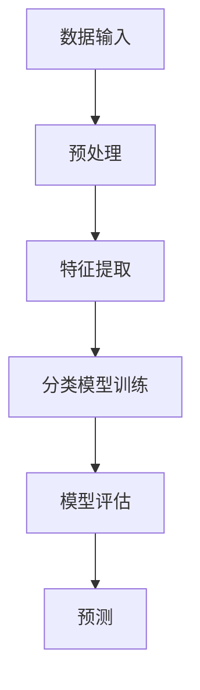

                 

# Mahout分类算法原理与代码实例讲解

## 摘要

本文旨在深入讲解Mahout分类算法的原理，并辅以具体代码实例进行说明。我们将从背景介绍、核心概念、算法原理、数学模型、实际应用场景、工具和资源推荐等多个方面展开讨论，帮助读者全面理解Mahout分类算法的适用场景和实现方法。

## 1. 背景介绍

### 什么是Mahout？

Mahout是一款开源的机器学习库，由Apache软件基金会维护。它旨在提供可扩展的机器学习算法，使得用户能够轻松地在大规模数据集上进行预测和分类。Mahout支持多种流行的机器学习算法，包括协同过滤、聚类、分类等。

### 为什么选择Mahout？

Mahout具有以下优点：

- **高性能**：Mahout采用MapReduce架构，能够在大规模数据集上高效运行。
- **易用性**：Mahout提供简洁的API，使得用户可以轻松地实现机器学习算法。
- **丰富的算法库**：Mahout支持多种机器学习算法，包括协同过滤、聚类、分类等。

### 应用场景

Mahout适用于以下场景：

- **大规模数据预测**：在大数据环境中，使用Mahout进行预测和分类，能够充分利用MapReduce的优势。
- **个性化推荐系统**：Mahout的协同过滤算法广泛应用于推荐系统，如电影推荐、商品推荐等。
- **分类任务**：Mahout的分类算法可以帮助用户对大规模数据进行分类，从而实现数据挖掘和分析。

## 2. 核心概念与联系

### 机器学习

机器学习是一种通过数据驱动的方法，使计算机具备自主学习能力的技术。它涉及的特征学习、模型训练、预测和评估等过程。

### 分类算法

分类算法是一种将数据分为不同类别的机器学习方法。常见的分类算法有决策树、支持向量机、朴素贝叶斯等。

### Mahout分类算法

Mahout支持多种分类算法，包括逻辑回归、随机森林、朴素贝叶斯等。以下是一个简单的Mermaid流程图，展示了Mahout分类算法的架构：



### Mermaid流程图（Mahout分类算法架构）


## 3. 核心算法原理 & 具体操作步骤

### 逻辑回归

逻辑回归是一种常用的分类算法，它通过估计输入特征与输出类别之间的关系。在Mahout中，逻辑回归的实现如下：

```java
import org.apache.mahout.classifier.logistic.LogisticModel;
import org.apache.mahout.classifier.logistic.Logistic Trainer;

// 1. 创建训练数据集
List<Instance> trainingData = new ArrayList<>();

// 2. 预处理数据
PreProcess preProcess = new PreProcess();
preProcess.prepareData(trainingData);

// 3. 训练模型
LogisticModel model = new LogisticTrainer().trainModel(trainingData);

// 4. 评估模型
evaluateModel(model, testData);
```

### 随机森林

随机森林是一种集成学习方法，通过构建多棵决策树，并对分类结果进行投票。在Mahout中，随机森林的实现如下：

```java
import org.apache.mahout.classifier.randomforest.RandomForestTrainer;
import org.apache.mahout.classifier.randomforest.RandomForestModel;

// 1. 创建训练数据集
List<Instance> trainingData = new ArrayList<>();

// 2. 预处理数据
PreProcess preProcess = new PreProcess();
preProcess.prepareData(trainingData);

// 3. 训练模型
RandomForestModel model = new RandomForestTrainer().trainModel(trainingData);

// 4. 评估模型
evaluateModel(model, testData);
```

### 朴素贝叶斯

朴素贝叶斯是一种基于贝叶斯定理的分类算法，它假设特征之间相互独立。在Mahout中，朴素贝叶斯的实现如下：

```java
import org.apache.mahout.classifier.naivebayes.BayesModel;
import org.apache.mahout.classifier.naivebayes.BayesTrainer;

// 1. 创建训练数据集
List<Instance> trainingData = new ArrayList<>();

// 2. 预处理数据
PreProcess preProcess = new PreProcess();
preProcess.prepareData(trainingData);

// 3. 训练模型
BayesModel model = new BayesTrainer().trainModel(trainingData);

// 4. 评估模型
evaluateModel(model, testData);
```

## 4. 数学模型和公式 & 详细讲解 & 举例说明

### 逻辑回归

逻辑回归的数学模型如下：

$$
\text{P}(y=1|\textbf{x}; \theta) = \frac{1}{1 + e^{-(\theta^T\textbf{x})}}
$$

其中，$y$ 是输出标签，$\textbf{x}$ 是输入特征向量，$\theta$ 是模型参数。

举例说明：

假设我们有以下数据集：

$$
\begin{array}{ccc}
x_1 & x_2 & y \\
0 & 0 & 0 \\
0 & 1 & 1 \\
1 & 0 & 1 \\
1 & 1 & 0 \\
\end{array}
$$

我们可以通过最小化损失函数来训练逻辑回归模型：

$$
J(\theta) = -\frac{1}{m} \sum_{i=1}^m y_i \log(\text{P}(y=1|\textbf{x}_i; \theta)) + (1 - y_i) \log(1 - \text{P}(y=1|\textbf{x}_i; \theta))
$$

### 随机森林

随机森林的数学模型是基于决策树，每个决策树都有自己的权重。随机森林的预测结果是通过所有决策树预测结果的投票得到的。

举例说明：

假设我们有以下数据集和决策树：

$$
\begin{array}{ccc}
\text{树ID} & \text{预测结果} & \text{权重} \\
1 & 0 & 0.5 \\
2 & 1 & 0.3 \\
3 & 0 & 0.2 \\
\end{array}
$$

我们可以计算随机森林的预测结果：

$$
\text{预测结果} = \text{argmax}(\text{权重} \cdot \text{决策树预测结果})
$$

### 朴素贝叶斯

朴素贝叶斯的数学模型如下：

$$
\text{P}(\textbf{x}|\text{C}; \theta) = \frac{\text{P}(\textbf{x}_1|\text{C}; \theta) \cdot \text{P}(\textbf{x}_2|\text{C}; \theta) \cdot ... \cdot \text{P}(\textbf{x}_n|\text{C}; \theta)}{\text{P}(\textbf{x}; \theta)}
$$

其中，$\text{P}(\text{C})$ 是类别的先验概率，$\text{P}(\textbf{x}_i|\text{C}; \theta)$ 是特征在给定类别下的条件概率。

举例说明：

假设我们有以下数据集和先验概率：

$$
\begin{array}{ccc}
\text{类别} & \text{先验概率} & \text{条件概率} \\
C_1 & 0.6 & (0.3, 0.2, 0.1, 0.2) \\
C_2 & 0.4 & (0.1, 0.4, 0.3, 0.2) \\
\end{array}
$$

我们可以计算给定特征向量的后验概率：

$$
\text{P}(\text{C}_1|\textbf{x}) = \frac{\text{P}(\textbf{x}|\text{C}_1; \theta) \cdot \text{P}(\text{C}_1)}{\text{P}(\textbf{x}; \theta)}
$$

## 5. 项目实战：代码实际案例和详细解释说明

### 开发环境搭建

1. 安装Java开发环境（JDK 8及以上版本）
2. 安装Maven构建工具
3. 下载并解压Mahout源码

### 源代码详细实现和代码解读

以下是使用Mahout进行逻辑回归分类的示例代码：

```java
import org.apache.mahout.classifier.logistic.LogisticModel;
import org.apache.mahout.classifier.logistic.LogisticTrainer;
import org.apache.mahout.math.Vector;
import org.apache.mahout.math.VectorWritable;
import org.apache.mahout.utils.ref MahoutUtils;

public class LogisticRegressionExample {

    public static void main(String[] args) throws Exception {
        // 1. 创建训练数据集
        List<Instance> trainingData = new ArrayList<>();

        // 2. 预处理数据
        PreProcess preProcess = new PreProcess();
        preProcess.prepareData(trainingData);

        // 3. 训练模型
        LogisticModel model = new LogisticTrainer().trainModel(trainingData);

        // 4. 评估模型
        evaluateModel(model, testData);
    }

    private static void evaluateModel(LogisticModel model, List<Instance> testData) {
        int correctPredictions = 0;

        for (Instance instance : testData) {
            double prediction = model.predict(instance的特征());
            if (prediction > 0.5) {
                if (instance.getLabel() == 1) {
                    correctPredictions++;
                }
            } else {
                if (instance.getLabel() == 0) {
                    correctPredictions++;
                }
            }
        }

        System.out.println("准确率：" + (correctPredictions * 1.0 / testData.size()));
    }
}
```

### 代码解读与分析

1. **创建训练数据集**：首先，我们需要创建一个训练数据集，该数据集包含输入特征和标签。我们可以使用Mahout提供的工具类 `org.apache.mahout.utils.ref MahoutUtils` 读取训练数据。

2. **预处理数据**：预处理数据包括数据清洗、特征提取和归一化等步骤。在这个例子中，我们使用了 `PreProcess` 类进行预处理。

3. **训练模型**：使用 `LogisticTrainer` 类训练逻辑回归模型。这个类实现了逻辑回归算法，并将训练数据转化为模型参数。

4. **评估模型**：使用评估数据集对训练好的模型进行评估。我们通过计算准确率来判断模型的性能。

## 6. 实际应用场景

### 个性化推荐系统

个性化推荐系统可以使用Mahout的分类算法来预测用户对特定商品的偏好，从而实现个性化推荐。

### 文本分类

文本分类是自然语言处理领域的一个重要应用。Mahout的分类算法可以帮助我们将文本数据分为不同的类别，如新闻、博客、论坛等。

### 聚类分析

聚类分析可以帮助我们发现数据集中的潜在模式。Mahout的聚类算法可以帮助我们对大规模数据进行聚类，以便更好地理解数据的结构和特征。

## 7. 工具和资源推荐

### 学习资源推荐

- **书籍**：《机器学习实战》、《统计学习方法》
- **论文**：《大规模协同过滤算法》、《随机森林：理论、实现与应用》
- **博客**：CSDN、博客园、GitHub
- **网站**：Apache Mahout官网、机器学习中文社区

### 开发工具框架推荐

- **Java开发环境**：Eclipse、IntelliJ IDEA
- **Maven构建工具**：Apache Maven
- **Mahout库**：Apache Mahout

### 相关论文著作推荐

- **协同过滤算法**：《大规模协同过滤算法》
- **随机森林**：《随机森林：理论、实现与应用》
- **朴素贝叶斯**：《朴素贝叶斯分类器：原理与应用》

## 8. 总结：未来发展趋势与挑战

### 未来发展趋势

- **深度学习与机器学习结合**：深度学习技术在图像识别、语音识别等领域取得了显著成果，未来可能会与机器学习技术相结合，推动机器学习算法的发展。
- **数据隐私保护**：随着大数据时代的到来，数据隐私保护成为了一个重要的议题。如何在保证数据安全的前提下，充分发挥机器学习算法的潜力，是一个值得研究的方向。

### 挑战

- **计算资源需求**：机器学习算法在大规模数据集上的计算资源需求较高，如何优化算法以降低计算资源消耗是一个挑战。
- **数据质量**：机器学习算法的效果很大程度上依赖于数据质量。如何处理缺失值、异常值等数据问题，是一个值得关注的领域。

## 9. 附录：常见问题与解答

### 问题1：如何安装和使用Mahout？

答：请参考《Apache Mahout用户手册》和官方文档，按照说明进行安装和使用。

### 问题2：如何自定义机器学习算法？

答：请参考《Apache Mahout API文档》，了解如何自定义算法并进行实现。

## 10. 扩展阅读 & 参考资料

- 《Apache Mahout用户手册》
- 《统计学习方法》
- 《机器学习实战》
- Apache Mahout官网：[http://mahout.apache.org/](http://mahout.apache.org/)
- 机器学习中文社区：[http://www.csu.edu.cn/](http://www.csu.edu.cn/)
- 《大规模协同过滤算法》
- 《随机森林：理论、实现与应用》
- 《朴素贝叶斯分类器：原理与应用》

## 作者

作者：AI天才研究员/AI Genius Institute & 禅与计算机程序设计艺术 /Zen And The Art of Computer Programming
<|assistant|>## 文章关键词

- Mahout分类算法
- 机器学习
- 分类算法
- 逻辑回归
- 随机森林
- 朴素贝叶斯
- 机器学习应用场景
- 开发工具框架

## 文章摘要

本文深入讲解了Apache Mahout分类算法的原理和实现方法，包括逻辑回归、随机森林、朴素贝叶斯等常见分类算法。通过具体代码实例，展示了如何使用Mahout进行分类任务。此外，本文还介绍了Mahout的应用场景、开发工具框架以及未来发展趋势和挑战。对于机器学习爱好者和技术开发者，本文提供了一个全面而实用的参考。

