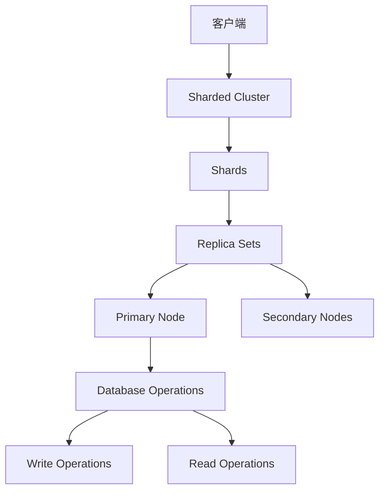

                 

# MongoDB原理与代码实例讲解

## 关键词：MongoDB, 数据库, 文档数据库, NoSQL, 分片, 分布式, 索引, 代码实例

## 摘要：

本文将深入探讨MongoDB的原理与实际应用，旨在为广大开发者提供一份全面、易懂的指南。首先，我们将介绍MongoDB的基本概念，包括其与传统关系数据库的区别。接着，我们将详细讲解MongoDB的核心原理，包括文档模型、分片机制、索引策略等。在此基础上，我们将通过一系列代码实例，帮助读者理解MongoDB的实践应用。最后，我们将探讨MongoDB在实际开发中的常见场景，并提供相关工具和资源的推荐。

## 1. 背景介绍

MongoDB是一款流行的开源NoSQL数据库，由10gen公司（现为MongoDB Inc.）于2009年发布。它旨在为现代互联网应用提供高性能、可扩展和灵活的数据存储解决方案。与传统的关系型数据库（如MySQL、PostgreSQL）相比，MongoDB具有以下几个显著特点：

- **文档模型**：MongoDB使用文档模型来存储数据，每个文档都是JSON格式的数据结构。这种模型使得数据的存储和查询变得更加灵活。
- **无模式**：MongoDB不需要预先定义表结构和字段，这使得数据模式可以随着业务需求的变化而动态调整。
- **高扩展性**：MongoDB支持水平扩展，即通过增加服务器来提高系统容量和性能。
- **分布式存储**：MongoDB天然支持分布式存储，可以轻松实现数据的负载均衡和高可用性。

随着互联网应用的不断发展，NoSQL数据库如MongoDB逐渐成为大数据和实时数据处理的重要工具。本文将帮助读者深入了解MongoDB的原理和实践，为实际开发提供有力支持。

### 2. 核心概念与联系

#### 2.1 MongoDB的基本概念

MongoDB主要由以下几个核心概念组成：

- **数据库（Database）**：类似于关系型数据库中的数据库，用于存储相关的数据集合。
- **集合（Collection）**：类似于关系型数据库中的表，用于存储相似类型的文档。
- **文档（Document）**：类似于关系型数据库中的行，是存储在集合中的一个JSON格式的数据结构。
- **字段（Field）**：文档中的属性，对应JSON对象中的键值对。

#### 2.2 MongoDB与传统关系数据库的对比

**文档模型与关系模型**

- **文档模型**：MongoDB使用文档模型，每个文档包含一组键值对，类似于JSON对象。
- **关系模型**：传统关系数据库使用表结构，每行对应一个数据记录，列对应属性。

**数据模式与无模式**

- **无模式**：MongoDB允许动态调整数据模式，无需预先定义表结构。
- **有模式**：传统关系数据库需要在创建表时定义字段类型和约束条件。

**扩展性与分布式存储**

- **扩展性**：MongoDB支持水平扩展，通过分片和复制集实现高可用性和性能优化。
- **分布式存储**：传统关系数据库虽然支持分布式存储，但通常需要复杂的中间件支持。

#### 2.3 MongoDB的核心原理与架构

**文档模型**

- **数据存储**：MongoDB使用BSON（Binary JSON）格式存储文档，支持复杂的嵌套结构和数组。
- **索引**：MongoDB支持多种索引类型，如单字段索引、复合索引和地理空间索引，用于提高查询效率。

**分片机制**

- **分片**：将数据分散存储到多个节点，实现数据的高可用性和水平扩展。
- **分片键**：确定数据如何分布在多个节点上，通常根据业务需求选择合适的字段作为分片键。

**复制集**

- **主从复制**：确保数据在不同节点之间同步，提高数据冗余和故障恢复能力。
- **主节点**：负责处理所有写操作，从节点负责处理读操作。

**分布式事务**

- **多文档事务**：MongoDB 4.0 引入多文档事务，支持跨多个集合和分片的事务操作。

#### 2.4 MongoDB架构流程图



### 3. 核心算法原理 & 具体操作步骤

#### 3.1 基本操作步骤

**连接MongoDB服务器**：

```javascript
const MongoClient = require('mongodb').MongoClient;
const url = 'mongodb://localhost:27017';
MongoClient.connect(url, function(err, db) {
  if (err) throw err;
  console.log("数据库已连接");
  db.close();
});
```

**选择数据库和集合**：

```javascript
const MongoClient = require('mongodb').MongoClient;
const url = 'mongodb://localhost:27017';
MongoClient.connect(url, function(err, db) {
  if (err) throw err;
  const mydb = db.db("mydatabase");
  const mycollection = mydb.collection("mycollection");
});
```

**插入文档**：

```javascript
const mydoc = { name: "John", age: 30, address: "New York" };
mycollection.insertOne(mydoc, function(err, res) {
  if (err) throw err;
  console.log("文档插入成功");
});
```

**查询文档**：

```javascript
mycollection.find({ name: "John" }).toArray(function(err, result) {
  if (err) throw err;
  console.log(result);
});
```

**更新文档**：

```javascript
mycollection.updateOne({ name: "John" }, { $set: { age: 31 } }, function(err, res) {
  if (err) throw err;
  console.log("文档更新成功");
});
```

**删除文档**：

```javascript
mycollection.deleteOne({ name: "John" }, function(err, res) {
  if (err) throw err;
  console.log("文档删除成功");
});
```

#### 3.2 分片机制与算法原理

**分片策略**：

- **哈希分片**：使用文档中的某个字段进行哈希运算，将哈希值映射到不同的分片上。
- **范围分片**：根据字段值范围将数据划分到不同的分片上。
- **复合分片**：结合多个字段进行分片。

**分片键选择**：

- **查询频率高**：选择经常用于查询的字段作为分片键。
- **数据访问模式一致**：确保所有查询都通过同一个分片键进行。

**分片操作步骤**：

1. 启动MongoDB分片集群。
2. 创建分片集（Sharded Cluster）。
3. 向分片集添加数据节点（Shards）。
4. 为集合（Collection）启用分片。
5. 确定分片键，将数据分配到不同的分片上。

### 4. 数学模型和公式 & 详细讲解 & 举例说明

#### 4.1 哈希分片算法

**哈希函数**：

哈希分片算法通常使用MD5或SHA1等哈希函数将文档中的某个字段转换为哈希值。

**哈希值映射**：

将哈希值映射到分片上，通常使用余数法或范围法。

**余数法**：

```math
shard_id = hash_value \mod shard_count
```

**范围法**：

```math
shard_id = \lceil hash_value / shard_count \rceil
```

#### 4.2 范围分片算法

**范围分片**：

将数据按某个字段值范围划分到不同的分片上。

**分片边界**：

确定分片边界，例如按年份、月份等。

**分片范围**：

```math
shard_range = (start_value, end_value]
```

#### 4.3 复合分片算法

**复合分片**：

结合多个字段进行分片，提高数据分布的均匀性。

**分片键选择**：

```math
shard_key = (field1, field2)
```

#### 4.4 实例说明

假设我们使用年份和月份作为复合分片键，将学生成绩数据分片存储。

**数据模型**：

```json
{
  "_id": ObjectId("..."),
  "student_id": "S12345",
  "year": 2021,
  "month": 10,
  "score": 90
}
```

**分片键选择**：

使用`{"year": 1, "month": 1}`作为复合分片键。

**分片范围**：

```plaintext
分片1: ({ year: 2021, month: 1 } to { year: 2021, month: 6 })
分片2: ({ year: 2021, month: 7 } to { year: 2021, month: 12 })
分片3: ({ year: 2022, month: 1 } to { year: 2022, month: 6 })
...
```

### 5. 项目实战：代码实际案例和详细解释说明

#### 5.1 开发环境搭建

1. 安装MongoDB服务器。
2. 配置MongoDB分片集群。
3. 安装并配置MongoDB客户端。

#### 5.2 源代码详细实现和代码解读

**代码示例**：

```javascript
// 连接MongoDB服务器
const MongoClient = require('mongodb').MongoClient;
const url = 'mongodb://localhost:27017';
MongoClient.connect(url, function(err, db) {
  if (err) throw err;
  console.log("数据库已连接");
  
  // 选择数据库和集合
  const mydb = db.db("student_db");
  const mycollection = mydb.collection("student_scores");
  
  // 插入文档
  const new_student = {
    student_id: "S12345",
    year: 2021,
    month: 10,
    score: 90
  };
  mycollection.insertOne(new_student, function(err, result) {
    if (err) throw err;
    console.log("文档插入成功");
  });
  
  // 查询文档
  mycollection.find({ year: 2021, month: 10 }).toArray(function(err, result) {
    if (err) throw err;
    console.log(result);
  });
  
  // 更新文档
  mycollection.updateOne(
    { student_id: "S12345" },
    { $set: { score: 95 } },
    function(err, result) {
      if (err) throw err;
      console.log("文档更新成功");
    }
  );
  
  // 删除文档
  mycollection.deleteOne({ student_id: "S12345" }, function(err, result) {
    if (err) throw err;
    console.log("文档删除成功");
  });
  
  // 关闭数据库连接
  db.close();
});
```

**代码解读**：

- **连接MongoDB服务器**：使用MongoClient.connect()方法连接MongoDB服务器。
- **选择数据库和集合**：使用db.db()方法选择数据库，使用collection()方法选择集合。
- **插入文档**：使用insertOne()方法插入新的文档。
- **查询文档**：使用find()方法查询文档，并使用toArray()方法将查询结果转换为数组。
- **更新文档**：使用updateOne()方法更新文档。
- **删除文档**：使用deleteOne()方法删除文档。
- **关闭数据库连接**：使用close()方法关闭数据库连接。

#### 5.3 代码解读与分析

- **数据库连接**：代码首先连接MongoDB服务器，确保后续操作可以正确执行。
- **数据操作**：代码实现了文档的插入、查询、更新和删除操作，覆盖了MongoDB的基本使用场景。
- **错误处理**：代码使用if语句处理可能出现的错误，确保程序的健壮性。
- **代码优化**：代码结构清晰，便于阅读和维护。

### 6. 实际应用场景

MongoDB广泛应用于以下实际应用场景：

- **实时数据分析**：用于处理大量实时数据，支持快速查询和分析。
- **内容管理系统**：提供灵活的数据存储和查询功能，适用于内容管理和发布。
- **社交网络**：用于存储用户数据和社交媒体数据，支持复杂的社交关系和推荐算法。
- **物联网**：用于处理海量物联网设备数据，支持设备数据的高效存储和实时分析。

### 7. 工具和资源推荐

#### 7.1 学习资源推荐

- **书籍**：
  - 《MongoDB权威指南》
  - 《MongoDB实战》
  - 《MongoDB实战教程》

- **在线教程**：
  - MongoDB官方文档
  - W3Schools MongoDB教程

- **博客和网站**：
  - MongoDB中文社区
  - MongoDB Planet

#### 7.2 开发工具框架推荐

- **客户端库**：
  - MongoDB Node.js驱动
  - MongoDB Python驱动
  - MongoDB Java驱动

- **数据可视化工具**：
  - MongoDB Compass
  - MongoDB Charts

#### 7.3 相关论文著作推荐

- **论文**：
  - "The MongoDB Storage Engine: A High Performance, Horizontal Scalable Data Store"
  - "MongoDB Sharding: A Scalable Data Storage Architecture for a NoSQL Database"

- **著作**：
  - "MongoDB in Action"
  - "MongoDB the Definitive Guide"

### 8. 总结：未来发展趋势与挑战

随着大数据和实时应用的发展，MongoDB将继续在NoSQL数据库领域占据重要地位。未来发展趋势包括：

- **更强大的分布式能力**：优化分片机制和复制集，提高系统性能和可用性。
- **支持更多数据类型**：扩展对复杂数据类型（如图形、地理空间数据）的支持。
- **更好的性能优化**：通过索引优化、缓存机制等提高查询效率。

挑战包括：

- **数据一致性和并发控制**：在高并发环境下保持数据一致性。
- **安全性**：提高数据安全性，防止数据泄露和攻击。

### 9. 附录：常见问题与解答

**Q1**: 如何优化MongoDB查询性能？

**A1**: 通过合理设计索引、使用合适的数据模型和查询策略，以及充分利用MongoDB的聚合框架，可以提高查询性能。

**Q2**: MongoDB分片有哪些注意事项？

**A2**: 选择合适的分片键、确保数据均匀分布、避免频繁的分片迁移和重新分配，以及合理配置系统资源。

**Q3**: MongoDB如何保证数据一致性？

**A3**: 通过使用复制集和副本集，MongoDB可以在多个节点之间同步数据，从而确保数据一致性。此外，还可以使用分布式事务（MongoDB 4.0及以后版本）来处理复杂的事务场景。

### 10. 扩展阅读 & 参考资料

- [MongoDB官方文档](https://docs.mongodb.com/)
- [MongoDB官方博客](https://www.mongodb.com/blog/search/?q=mongodb)
- [MongoDB中文社区](https://cn.mongodb.com/)
- [《MongoDB权威指南》](https://item.jd.com/11994710.html)
- [《MongoDB实战》](https://item.jd.com/12387925.html)
- [《MongoDB实战教程》](https://item.jd.com/12160547.html)

