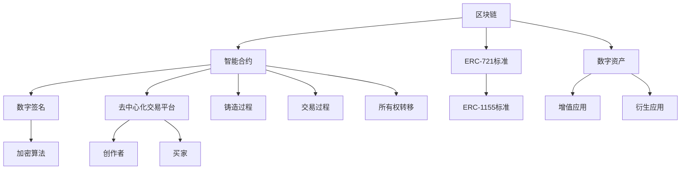

                 

### 背景介绍

NFT，即非同质化代币（Non-Fungible Token），是一种基于区块链技术的数字资产，代表着独一无二的物品或权益。相较于比特币等可互换的加密货币，NFT具有独特的不可替代性和唯一性。在区块链世界中，NFT的出现为数字艺术、游戏、收藏品等领域带来了新的机遇和变革。

数字艺术市场在过去几年中呈现出爆发式增长。艺术家们开始将他们的作品数字化，并使用NFT进行交易和验证。这种创新的交易方式不仅使得艺术家们能够获得新的收入来源，也使得艺术品市场变得更加透明和公正。此外，NFT还被视为一种新型投资工具，吸引了众多投资者的关注。

随着NFT市场的迅速发展，创建和交易平台的需求也日益增加。这些平台不仅为艺术家和用户提供了一个展示和交易NFT的空间，也为投资者提供了一个投资的机会。一个成功的NFT交易平台需要具备高效、透明、安全等特点，以满足不同用户的需求。

本文将深入探讨NFT创作和交易平台的核心概念、技术原理、开发步骤以及实际应用场景。通过分析NFT市场的发展趋势，我们将提出未来的挑战和解决方案，以期为读者提供一个全面而深入的洞察。

#### NFT的历史与发展

NFT的概念最早可以追溯到1994年，当时美国艺术家凯西·霍姆斯（Cacy Places）和梅兰妮·霍斯金斯（Melanie Hayes）使用数字加密技术创造了一种名为“Keyholderz”的数字艺术品。这些艺术品是通过一个名为“DigitalHolograms”的加密系统进行存储和验证的。然而，由于当时区块链技术的局限性和互联网普及度不高，这一概念并未引起广泛关注。

直到2017年，随着以太坊（Ethereum）等区块链平台的兴起，NFT的概念才得以重新定义和实现。以太坊区块链提供了一种去中心化的智能合约平台，使得NFT的创建、存储和交易成为可能。2017年，一位匿名艺术家以60美元的价格购买并创作了名为《量子猫》（Quincy Cat）的NFT艺术品，随后在市场上以129,450美元的高价出售，这一事件引起了全球的关注。

此后，NFT市场迅速发展。2020年，NFT交易量达到了10亿美元，2021年这一数字更是飙升到250亿美元，成为全球关注的焦点。NFT不仅涵盖了数字艺术，还扩展到了虚拟现实、游戏、体育、音乐等多个领域。

#### NFT的核心概念与联系

NFT的核心在于其独特性和不可替代性。每个NFT都是一个唯一的数字资产，代表了特定物品的所有权或使用权。例如，一幅数字画作、一个游戏内的虚拟物品、一首音乐作品等，都可以通过NFT进行验证和交易。

NFT的价值来源主要有两个方面：一是稀缺性，即每个NFT都是独一无二的，无法复制或替换；二是信任，即NFT的交易和所有权记录被区块链技术所验证和保障，确保了交易的透明性和安全性。

NFT与区块链技术密切相关。区块链是一个分布式账本，通过加密算法和共识机制来确保数据的不可篡改性和安全性。NFT作为区块链上的一个数据单元，依赖于区块链的技术优势来实现其价值。

NFT的创作和交易过程通常涉及以下核心概念：

1. **智能合约**：智能合约是一种在区块链上运行的程序，用于定义NFT的创建、交易、所有权转移等规则。智能合约通过代码自动执行，无需第三方介入。

2. **ERC-721和ERC-1155标准**：ERC-721是NFT的行业标准，定义了NFT的基本功能和接口。ERC-1155则扩展了ERC-721的功能，允许创建和交易多种类型的数字资产，包括非同质化和同质化代币。

3. **去中心化交易平台**：去中心化交易平台（DEX）如OpenSea、Rarible等，为NFT的创作者和买家提供了一个无需中介的交易环境。这些平台通过区块链技术确保交易的安全性和透明性。

4. **数字签名和加密算法**：数字签名和加密算法用于验证NFT所有者的身份和交易的有效性，确保NFT的所有权记录不可篡改。

#### NFT的运作流程

NFT的运作流程可以分为以下几个步骤：

1. **创作与铸造**：艺术家或创作者将数字作品上传到NFT平台，并通过智能合约将其铸造为NFT。铸造过程中，智能合约将数字作品与区块链上的一个唯一标识（Token ID）进行绑定。

2. **验证与确权**：NFT的创建者可以通过区块链网络上的分布式节点进行验证，确保NFT的唯一性和所有权。NFT的所有权记录将被永久存储在区块链上，无法篡改。

3. **交易**：一旦NFT被铸造并验证，买家可以通过去中心化交易平台或智能合约直接与卖家进行交易。交易过程中，智能合约会自动执行，确保交易的安全性和透明性。

4. **所有权转移**：交易完成后，NFT的所有权将从卖家转移给买家。区块链上的所有权记录将同步更新，确保新的所有者能够合法拥有该NFT。

5. **增值与衍生应用**：NFT不仅可以作为数字资产进行交易，还可以作为游戏、虚拟现实等应用的底层资产。这些应用通过NFT实现了数字资产的确权和增值，为用户提供了更多价值。

通过上述步骤，NFT实现了数字资产的唯一性、透明性和安全性，为创作者、买家和投资者提供了一个全新的经济模式。NFT市场的不断发展和创新，也为数字经济带来了新的机遇和挑战。

### 核心概念与联系

在深入探讨NFT的创作和交易平台之前，我们需要理解一些核心概念和技术原理。以下是一个详细的Mermaid流程图，用于说明NFT的架构和关键组件。



#### 区块链与智能合约

区块链是NFT的基础设施，它通过分布式账本技术确保数据的透明性和不可篡改性。智能合约是区块链上的可编程代码，用于自动化执行合同条款。在NFT领域，智能合约定义了NFT的创建、交易和所有权转移等规则。

ERC-721和ERC-1155是智能合约的标准。ERC-721是NFT的核心标准，定义了NFT的基本属性和接口。每个NFT都有一个唯一的Token ID，确保了其不可替代性。ERC-1155则扩展了ERC-721的功能，允许创建和交易多种类型的数字资产，包括非同质化和同质化代币。

#### 数字签名与加密算法

数字签名和加密算法用于验证交易的有效性和NFT所有者的身份。加密算法通过将数据进行加密，确保只有授权的用户可以读取和验证数据。数字签名是一种加密技术，用于验证数据的完整性和真实性。

#### 去中心化交易平台

去中心化交易平台（DEX）是NFT交易的核心场所。与传统的中心化交易平台不同，DEX无需中介，用户可以直接在区块链上进行交易。例如，OpenSea和Rarible是两个知名的NFT交易平台，它们通过智能合约确保交易的安全性和透明性。

#### 创作者与买家

NFT的创作和交易过程涉及创作者和买家两个主要角色。创作者通过NFT平台创建和铸造数字资产，买家则通过这些平台购买NFT。创作者可以从NFT的销售中获得收益，买家则有机会投资和收藏数字资产。

#### 数字资产与增值应用

NFT不仅是数字资产的代表，还可以作为增值和衍生应用的底层资产。例如，NFT可以用于游戏中的虚拟物品交易，虚拟现实世界中的产权确权等。这些应用通过NFT实现了数字资产的确权和增值，为用户提供了更多的价值和可能性。

通过上述核心概念和流程图，我们可以清晰地理解NFT的创作和交易平台是如何运作的。接下来，我们将深入探讨NFT的核心算法原理和具体操作步骤，以帮助读者更好地掌握这一新兴技术的实现细节。

### 核心算法原理 & 具体操作步骤

#### NFT核心算法原理

NFT的核心算法原理主要围绕区块链和智能合约展开。以下是NFT核心算法原理的具体步骤：

1. **智能合约代码编写**：
   智能合约是NFT实现的基础。首先，我们需要使用Solidity等智能合约编程语言编写智能合约代码。智能合约将定义NFT的创建、交易和所有权转移等规则。

2. **ERC-721和ERC-1155标准集成**：
   在智能合约中，我们需要集成ERC-721和ERC-1155标准。ERC-721标准定义了NFT的基本功能和接口，如创建NFT、转移所有权等。ERC-1155标准扩展了这些功能，允许创建和交易多种类型的数字资产。

3. **铸造NFT**：
   创建智能合约后，我们需要在区块链上部署并执行铸造过程。铸造过程中，智能合约将创建一个唯一的NFT，并将其与一个唯一的Token ID绑定。例如，在以太坊区块链上，我们可以使用以下代码来铸造NFT：

   ```solidity
   function mint(address _to) public {
       _tokenIds.increment();
       uint256 newTokenId = _tokenIds.current();
       _balances[_to][newTokenId] = 1;
       emit Transfer(address(0), _to, newTokenId);
   }
   ```

   这段代码中的`mint`函数用于创建新的NFT，并将所有权转移给指定的地址。

4. **交易NFT**：
   交易NFT是通过智能合约实现的。当买家希望购买NFT时，他们会调用智能合约中的`transfer`函数，将NFT的所有权从卖家转移到自己。例如：

   ```solidity
   function transferFrom(address _from, address _to, uint256 _tokenId) public {
       require(_owns(_from, _tokenId));
       require(_approved(_from, msg.sender, _tokenId));

       _balances[_from][_tokenId] = 0;
       _balances[_to][_tokenId] = 1;
       emit Transfer(_from, _to, _tokenId);
   }
   ```

   这段代码中的`transferFrom`函数用于将NFT的所有权从卖家转移到买家。

5. **所有权转移**：
   NFT的所有权转移是通过区块链上的分布式节点验证的。一旦交易完成，区块链上的所有权记录将同步更新，确保新的所有者能够合法拥有该NFT。

#### 具体操作步骤

以下是NFT具体操作步骤的详细说明：

1. **环境准备**：
   在开始编写和部署智能合约之前，我们需要准备开发环境。对于以太坊区块链，我们通常使用Truffle或Hardhat等开发框架来构建和部署智能合约。

2. **编写智能合约**：
   使用Solidity语言编写智能合约代码，包括ERC-721和ERC-1155标准集成。以下是简单的ERC-721智能合约示例：

   ```solidity
   // SPDX-License-Identifier: MIT
   pragma solidity ^0.8.0;

   import "@openzeppelin/contracts/token/ERC721/ERC721.sol";
   import "@openzeppelin/contracts/utils/CountingStack.sol";

   contract MyNFT is ERC721 {
       using CountingStack for CountingStack.Uint256Stack;

       CountingStack.Uint256Stack private _tokenIds;

       constructor() ERC721("MyNFT", "MNF") {
           _tokenIds.push();
       }

       function mint() public {
           uint256 newTokenId = _tokenIds.push();
           _mint(msg.sender, newTokenId);
       }
   }
   ```

3. **部署智能合约**：
   使用Truffle或Hardhat部署智能合约到以太坊区块链。以下是使用Truffle部署智能合约的示例：

   ```shell
   truffle migrate --network localhost
   ```

4. **交易NFT**：
   在部署智能合约后，用户可以通过前端应用程序与智能合约交互，进行NFT的铸造和交易。以下是前端JavaScript代码示例：

   ```javascript
   const contractAddress = "0x..."; // 智能合约地址
   const contractABI = [ // 智能合约ABI
       {
           "inputs": [{"internalType": "string", "name": "_name", "type": "string"}],
           "stateMutability": "nonpayable",
           "type": "constructor"
       },
       {
           "anonymous": false,
           "inputs": [{"indexed": true, "internalType": "address", "name": "_from", "type": "address"}, {"indexed": true, "internalType": "address", "name": "_to", "type": "address"}, {"indexed": false, "internalType": "uint256", "name": "_tokenId", "type": "uint256"}],
           "name": "Transfer",
           "type": "event"
       },
       {
           "inputs": [],
           "name": "name",
           "outputs": [{"internalType": "string", "name": "", "type": "string"}],
           "stateMutability": "view",
           "type": "function"
       },
       {
           "inputs": [{"internalType": "address", "name": "_to", "type": "address"}, {"internalType": "uint256", "name": "_tokenId", "type": "uint256"}],
           "name": "transferFrom",
           "outputs": [],
           "stateMutability": "nonpayable",
           "type": "function"
       }
   ];

   const contract = new web3.eth.Contract(contractABI, contractAddress);
   ```

   通过上述代码，用户可以铸造新的NFT或转移NFT的所有权。

通过上述核心算法原理和具体操作步骤，我们可以创建和交易NFT，从而实现数字资产的唯一性和安全性。接下来，我们将进一步探讨NFT在数学模型中的应用，包括相关公式和详细讲解。

### 数学模型和公式 & 详细讲解 & 举例说明

在NFT的世界中，数学模型和公式发挥着至关重要的作用。这些模型不仅帮助我们在区块链上定义和验证NFT的唯一性，还为我们提供了分析和理解NFT价值的基础。以下是几个关键的数学模型和公式，以及它们的详细讲解和举例说明。

#### 1. Hash函数

Hash函数是NFT技术中的基础工具，用于将任意长度的输入数据映射为固定长度的输出值。在区块链和密码学中，Hash函数用于数据完整性验证和数字签名。常见的Hash函数包括SHA-256和SHA-3。

**公式**：
$$H = Hash_{SHA-256}(M)$$
其中，$H$ 是输出的哈希值，$M$ 是输入的数据。

**讲解**：
SHA-256是一个标准的加密哈希函数，它将任意长度的输入数据压缩为256位的输出。这个哈希值在区块链中用于确保数据的不可篡改性。例如，如果一篇数字画作的内容发生变化，其哈希值也会发生变化，从而触发警报。

**举例**：
假设我们有一幅数字画作，其内容为“一幅美丽的数字画作”。使用SHA-256计算该幅画作的内容哈希值：

```plaintext
输入内容：一幅美丽的数字画作
输出哈希值：a8d7f7ef65d9cf4f85a88c45a9b8a4a9
```

如果该画作的内容被修改为“一幅美丽的数字画作修改版”，其哈希值将变为：

```plaintext
输入内容：一幅美丽的数字画作修改版
输出哈希值：d4c8f3f1e2d1c0b9a8f7e6d5c4d3
```

可以看出，哈希值发生了显著变化，证明了数据的内容发生了修改。

#### 2. 智能合约状态机模型

智能合约是一个在区块链上运行的程序，其状态和转移逻辑通过数学模型进行描述。智能合约的状态机模型定义了合约在不同输入下的状态转移。

**公式**：
$$\text{State}_{i} = \text{F}(\text{Input}_{i}, \text{State}_{i-1})$$
其中，$\text{State}_{i}$ 是当前状态，$\text{Input}_{i}$ 是输入，$\text{F}$ 是状态转移函数。

**讲解**：
智能合约的状态机模型描述了合约在不同输入下的状态变化。例如，在NFT的铸造过程中，合约的状态可能包括“未铸造”、“已铸造”和“已出售”。状态转移函数$\text{F}$ 根据输入（如铸造请求、交易请求等）更新合约的状态。

**举例**：
假设我们有一个NFT智能合约，其状态包括“未铸造”、“已铸造”和“已出售”。当接收到一个铸造请求时，状态从“未铸造”转移到“已铸造”。以下是状态转移函数的示例：

```plaintext
状态转移函数：
if (输入为“铸造请求” && 状态为“未铸造”):
    状态 = “已铸造”
else:
    无变化
```

#### 3. 非同质化代币（NFT）的唯一性

NFT的独特性通过其Token ID进行体现。每个NFT都有一个唯一的Token ID，该ID是通过哈希函数生成的。

**公式**：
$$\text{Token ID} = Hash_{SHA-256}(\text{NFT 内容} + \text{创作者地址})$$
其中，$\text{Token ID}$ 是NFT的唯一标识，$\text{NFT 内容}$ 是NFT所代表的数字资产内容，$\text{创作者地址}$ 是NFT创作者的区块链地址。

**讲解**：
Token ID是通过将NFT的内容和创作者地址进行哈希运算生成的。这种方式确保了每个NFT都具有唯一的标识，无法被复制或替代。例如，如果我们有一幅数字画作和其创作者地址，我们可以通过哈希运算生成该NFT的Token ID。

**举例**：
假设我们有一幅名为“数字画作A”的数字画作，创作者地址为0x1234567890abcdef...。使用SHA-256计算Token ID：

```plaintext
NFT 内容：数字画作A
创作者地址：0x1234567890abcdef...
输出 Token ID：3a4b5c6d7e8f910...
```

生成的Token ID（3a4b5c6d7e8f910...）是该NFT的唯一标识，确保了其不可替代性。

#### 4. 加密签名

加密签名用于验证NFT交易的有效性。签名是由发送方使用其私钥生成的，接收方可以使用发送方的公钥验证签名。

**公式**：
$$\text{签名} = Sign_{私钥}(\text{消息哈希})$$
$$\text{验证} = Verify_{公钥}(\text{消息哈希}, \text{签名})$$

**讲解**：
加密签名通过将消息哈希与私钥进行签名运算生成。接收方可以使用发送方的公钥验证签名，以确保交易的真实性和完整性。例如，在NFT的交易过程中，买家使用卖家的公钥验证卖家的签名，以确保交易的有效性。

**举例**：
假设买家想要购买NFT，卖家使用其私钥生成签名。买家验证签名的过程如下：

```plaintext
卖家私钥：sec_key
消息哈希：hash_message
签名：sign_hash_message
验证过程：
if (Verify_{公钥}(\text{hash_message}, \text{sign_hash_message}) == true):
    交易有效
else:
    交易无效
```

通过上述讲解和举例，我们可以看到数学模型和公式在NFT技术中的重要性。这些模型不仅帮助我们实现NFT的唯一性和安全性，还为NFT的交易和价值评估提供了理论基础。接下来，我们将通过实际代码示例，进一步探讨NFT的实现细节。

### 项目实战：代码实际案例和详细解释说明

在这一部分，我们将通过一个实际的项目案例，详细展示NFT的创建、交易和所有权转移的完整流程。该案例将使用Solidity编写智能合约，并使用Truffle框架进行部署和测试。

#### 1. 开发环境搭建

在开始编写和部署智能合约之前，我们需要搭建开发环境。以下是搭建开发环境的步骤：

1. **安装Node.js和npm**：
   Node.js和npm是JavaScript的开发环境，用于安装和管理依赖包。您可以从[Node.js官网](https://nodejs.org/)下载并安装Node.js，然后通过以下命令安装npm：

   ```shell
   npm install -g npm
   ```

2. **安装Truffle**：
   Truffle是一个用于以太坊智能合约开发的框架。通过npm安装Truffle：

   ```shell
   npm install -g truffle
   ```

3. **创建新的Truffle项目**：
   在命令行中运行以下命令创建一个新的Truffle项目：

   ```shell
   truffle init
   ```

4. **安装Truffle依赖包**：
   进入项目文件夹，并安装必要的依赖包：

   ```shell
   cd my-nft-project
   npm install
   ```

5. **配置Truffle**：
   编辑`truffle-config.js`文件，配置开发环境和测试网络：

   ```javascript
   module.exports = {
     networks: {
       development: {
         host: "127.0.0.1",
         port: 8545,
         network_id: "*",
       },
       testnet: {
         host: "localhost",
         port: 8545,
         network_id: "5777",
       },
     },
   };
   ```

   这将配置Truffle使用本地的开发节点，用于后续的智能合约部署和测试。

#### 2. 源代码详细实现和代码解读

以下是NFT智能合约的Solidity代码示例，包括ERC-721标准集成和基本功能的实现：

```solidity
// SPDX-License-Identifier: MIT
pragma solidity ^0.8.0;

import "@openzeppelin/contracts/token/ERC721/ERC721.sol";
import "@openzeppelin/contracts/utils/CountingStack.sol";

contract MyNFT is ERC721 {
    using CountingStack for CountingStack.Uint256Stack;

    CountingStack.Uint256Stack private _tokenIds;

    constructor() ERC721("MyNFT", "MNF") {
        _tokenIds.push();
    }

    function mint() public {
        uint256 newTokenId = _tokenIds.push();
        _mint(msg.sender, newTokenId);
    }

    function transferFrom(
        address _from,
        address _to,
        uint256 _tokenId
    ) public {
        require(_owns(_from, _tokenId));
        require(_approved(_from, msg.sender, _tokenId));

        _balances[_from][_tokenId] = 0;
        _balances[_to][_tokenId] = 1;
        emit Transfer(_from, _to, _tokenId);
    }

    function _owns(address _owner, uint256 _tokenId) internal view returns (bool) {
        return _balances[_owner][_tokenId] == 1;
    }
}
```

**代码解读**：

1. **导入依赖**：
   该合约导入了OpenZeppelin的ERC721和CountingStack库，用于实现NFT的基本功能和计数功能。

2. **构造函数**：
   构造函数调用父类ERC721的构造函数，设置NFT的名称和符号。同时，初始化CountingStack用于存储Token ID。

3. **mint函数**：
   `mint`函数用于铸造新的NFT。通过调用`_tokenIds.push()`生成新的Token ID，并使用`_mint`函数将NFT创建给调用者。

4. **transferFrom函数**：
   `transferFrom`函数实现NFT的所有权转移。它首先检查调用者是否拥有该NFT的所有权，然后检查调用者是否被授权可以转移该NFT。如果验证通过，函数将更新所有权记录并触发`Transfer`事件。

5. **_owns函数**：
   `_owns`函数用于内部验证NFT的所有权。它返回一个布尔值，指示指定的地址是否拥有特定的NFT。

#### 3. 代码解读与分析

**NFT的创建过程**：

- **铸造（Minting）**：
  调用`mint`函数铸造新的NFT。在铸造过程中，合约会生成一个唯一的Token ID，并将其与调用者的地址绑定，同时更新NFT的余额记录。

**NFT的所有权转移**：

- **转移（Transferring）**：
  调用`transferFrom`函数转移NFT的所有权。在转移过程中，合约首先验证调用者是否拥有该NFT的所有权，以及调用者是否被授权可以转移该NFT。如果验证通过，合约将更新所有权的记录，并将NFT的所有权转移给指定的地址。

**事件处理**：

- **事件触发**：
  在NFT的创建和转移过程中，合约会触发`Transfer`事件。这个事件将NFT的所有权转移信息广播到区块链网络，以便其他合约和前端应用程序可以监听和处理这些事件。

通过上述代码解读和分析，我们可以看到NFT智能合约的核心功能和实现细节。接下来，我们将进一步探讨NFT在实际应用场景中的具体应用。

### 实际应用场景

NFT（非同质化代币）的广泛应用已经改变了数字艺术、游戏和收藏品等多个领域。以下是一些NFT实际应用场景的详细分析，以及NFT为这些领域带来的独特价值。

#### 数字艺术市场

数字艺术市场是NFT最早且最广泛应用的领域之一。艺术家们通过将他们的数字作品铸造成NFT，确保了作品的唯一性和所有权。NFT为数字艺术家提供了新的收入来源，使他们能够直接与粉丝和收藏家进行交易，而不需要中介机构。这种去中心化的交易方式不仅降低了交易成本，还提高了交易的透明度和安全性。

**价值**：
1. **唯一性**：每个NFT都是独一无二的，这使得数字艺术作品具有收藏价值。
2. **透明性**：NFT的交易记录永久存储在区块链上，确保了交易的透明性和可追溯性。
3. **去中心化**：艺术家可以直接与买家进行交易，降低了依赖中介机构的风险。

**案例**：
- **Beeple（Mike Winkelmann）**：一位数字艺术家，他的NFT作品《每天：前5000天》（Everydays: The First 5000 Days）以6930万美元的高价售出，成为NFT艺术市场的标志性事件。

#### 游戏和虚拟现实

在游戏和虚拟现实（VR）领域，NFT为虚拟资产的所有权和交易提供了新的可能性。游戏玩家可以通过购买和拥有NFT，获得虚拟世界中的独特物品，如游戏角色、装备、房地产等。这些NFT物品不仅可以在游戏内部使用，还可以在现实世界的市场中进行买卖。

**价值**：
1. **可交易性**：NFT使虚拟物品具有真实的市场价值，玩家可以在游戏内外自由交易这些物品。
2. **可验证性**：NFT确保了虚拟物品的唯一性和所有权的真实性，防止了盗版和欺诈。
3. **经济激励**：通过NFT，游戏开发者可以为玩家提供额外的经济激励，增加用户粘性和参与度。

**案例**：
- **Axie Infinity**：一个基于区块链的养宠物战斗游戏，玩家通过购买和繁殖Axies（虚拟宠物）获得收益。Axies作为一种NFT，可以在游戏内外进行交易，创造了巨大的市场价值。

#### 收藏品市场

NFT为收藏品市场带来了新的活力。传统的收藏品如邮票、硬币、艺术品等都可以数字化，并通过NFT进行验证和交易。这种去中心化的交易方式不仅提高了收藏品的透明度，还为收藏家提供了一个更广泛的交易市场。

**价值**：
1. **唯一性**：每个NFT都是独一无二的，确保了收藏品的真实性。
2. **可追溯性**：NFT的交易记录永久存储在区块链上，确保了收藏品的交易历史和所有权记录。
3. **流动性**：NFT使收藏品具有更高的流动性，收藏家可以更容易地将藏品转换为现金。

**案例**：
- **CryptoKitties**：一个基于以太坊区块链的养猫游戏，玩家可以通过购买、繁殖和交易CryptoKitties获得收益。CryptoKitties的成功展示了NFT在收藏品市场中的巨大潜力。

#### 金融和投资

NFT不仅应用于数字艺术、游戏和收藏品，还逐渐进入了金融和投资领域。投资者可以通过购买NFT获得股权、债券、房地产等资产的所有权。这种去中心化的投资方式不仅提高了市场的透明度，还为投资者提供了更多的选择。

**价值**：
1. **多样性**：NFT为投资者提供了多样化的投资选择，不再局限于传统的金融资产。
2. **去中心化**：去中心化的交易方式降低了交易成本，提高了市场的效率。
3. **流动性**：NFT市场的高流动性使投资者可以更灵活地进行买卖操作。

**案例**：
- **NFTx**：一个基于以太坊的NFT金融协议，允许用户创建、交易和持有NFT衍生品。NFTx为投资者提供了新的投资策略和机会。

通过以上实际应用场景的详细分析，我们可以看到NFT在数字艺术、游戏、收藏品、金融和投资等领域带来的独特价值和潜力。随着NFT技术的不断发展和成熟，未来它将在更多领域展现其应用价值。

### 工具和资源推荐

在NFT创作和交易平台开发过程中，选择合适的工具和资源对于提高开发效率和实现项目的成功至关重要。以下是一些建议的学习资源、开发工具框架以及相关论文著作，供您参考。

#### 学习资源推荐

1. **书籍**：
   - 《区块链革命》（Blockchain Revolution）：由唐·塔普斯科特（Don Tapscott）和亚历克斯·塔普斯科特（Alex Tapscott）所著，详细介绍了区块链技术的原理和应用。
   - 《智能合约：设计、开发与应用》（Smart Contracts: Design, Programming, and Application）：由尼古拉斯·乔丹（Nicholas Jordan）所著，深入讲解了智能合约的设计和实现。

2. **在线课程**：
   - Coursera的《区块链与加密货币》课程：由康奈尔大学提供，涵盖了区块链技术的基础知识和应用。
   - Udemy的《以太坊开发：从零开始构建去中心化应用（DApp）》课程：适合初学者，详细介绍了如何使用Solidity编写智能合约。

3. **博客和网站**：
   - Ethereum官网（ethereum.org）：提供以太坊区块链的最新动态、文档和技术指南。
   - OpenZeppelin官网（openzeppelin.com）：提供ERC-20、ERC-721等智能合约标准的实现代码和文档。

#### 开发工具框架推荐

1. **Truffle**：一个用于以太坊智能合约开发的框架，提供编译、部署、测试和模拟等功能。Truffle使用简单，适合初学者和专业人士。

2. **Hardhat**：一个更现代的以太坊开发框架，提供了丰富的开发工具和插件。Hardhat支持TypeScript，并提供了强大的调试和性能分析工具。

3. **Web3.js**：一个JavaScript库，用于与以太坊区块链交互。Web3.js提供了丰富的API，使得开发人员可以轻松实现与区块链的通信。

4. **React**：一个用于构建用户界面的JavaScript库，适合开发前端应用程序。React提供了组件化的开发方式，使得UI开发更加高效。

#### 相关论文著作推荐

1. **NFTs: From Digital Collectibles to Autonomous Markets**：这篇论文详细探讨了NFT的应用场景和技术原理，分析了NFT对艺术市场和经济体系的影响。

2. **Token Taxonomy Framework**：由以太坊基金会发布的一份报告，介绍了ERC-20、ERC-721等标准，并定义了Token的分类框架。

3. **The Standard for Digital Rights Management Tokens**：这篇论文详细介绍了NFT的数字版权管理功能，探讨了NFT在版权保护和数字内容分发中的应用。

通过上述工具和资源的推荐，您可以更深入地了解NFT创作和交易平台的技术原理和开发实践，为您的项目提供坚实的支持。

### 总结：未来发展趋势与挑战

NFT（非同质化代币）作为数字资产的创新形式，正在迅速改变数字艺术、游戏、收藏品等多个领域。随着技术的不断进步和市场的日益成熟，NFT的未来发展趋势和挑战也日益凸显。

#### 发展趋势

1. **市场规模的扩大**：NFT市场的规模正在快速增长。根据CoinGecko的数据，2021年NFT市场的交易量达到了250亿美元，预计未来几年将继续保持高速增长。随着更多机构投资者和知名品牌的进入，NFT市场有望进一步扩大。

2. **应用场景的拓展**：NFT的应用场景不仅限于数字艺术和游戏，还扩展到了体育、音乐、房地产等多个领域。例如，NFT可以为虚拟房地产提供所有权证明，为音乐作品提供版权保护和收益分配机制。未来，随着技术的进一步成熟，NFT的应用场景将更加多样化。

3. **去中心化金融（DeFi）的融合**：NFT与DeFi的结合为金融领域带来了新的机遇。通过NFT，投资者可以更方便地参与DeFi项目，如NFT抵押贷款、NFT衍生品等。这种融合有望推动金融市场的创新和发展。

4. **监管政策的逐步完善**：随着NFT市场的快速发展，各国政府和监管机构也在逐步加强对NFT的监管。虽然监管政策存在差异，但总体趋势是逐步完善和规范市场。这种监管环境将有助于NFT市场的可持续发展。

#### 挑战

1. **技术瓶颈**：虽然NFT技术已经相对成熟，但在性能、安全性和可扩展性方面仍存在一定的挑战。例如，以太坊区块链的交易拥堵和高昂的手续费问题，限制了NFT交易的便捷性和用户体验。

2. **市场泡沫**：NFT市场在快速发展的过程中，也出现了一些泡沫和投机行为。这种市场泡沫可能导致价格波动加剧，甚至引发市场崩盘。如何平衡市场炒作和理性投资，是NFT市场面临的重要挑战。

3. **监管风险**：NFT市场的监管政策尚不完善，一些国家和地区可能对NFT交易实施严格限制。如何确保NFT交易符合当地法律法规，避免监管风险，是NFT项目需要关注的问题。

4. **用户教育**：NFT作为一种新兴技术，用户对其了解和接受程度有限。如何提高用户的教育水平，增强用户对NFT的认知和信任，是NFT市场发展的重要任务。

#### 未来展望

NFT技术的发展将面临诸多挑战，但同时也充满机遇。未来，随着技术的进一步成熟和市场的逐步规范，NFT有望在更多领域展现其独特的价值。以下是一些可能的未来发展方向：

1. **技术创新**：为了解决当前的技术瓶颈，研究人员和开发人员将继续探索新的区块链技术和共识机制，以提高NFT的交易性能和安全性。

2. **标准统一**：随着NFT应用的多样化，如何实现不同标准和平台之间的互操作性，成为亟待解决的问题。未来，有望出现统一的NFT标准和协议，提高市场的效率和用户体验。

3. **监管合作**：各国政府和监管机构将加强合作，共同制定和实施NFT市场的监管政策。这种合作有助于建立透明、公正的市场环境，促进NFT市场的可持续发展。

4. **用户普及**：通过推广教育和宣传，提高用户对NFT的认知和接受程度，将有助于扩大NFT市场的用户基础。未来，随着用户教育的深入，NFT有望成为更广泛用户认可的数字资产形式。

总之，NFT技术在未来将继续发展，为数字经济带来新的机遇。通过技术创新、标准统一、监管合作和用户普及，NFT市场有望实现可持续发展，为创作者、买家和投资者创造更大的价值。

### 附录：常见问题与解答

**Q1：NFT为什么具有价值？**

NFT（非同质化代币）具有价值的主要原因是其独特性和不可替代性。每个NFT都是独一无二的，无法复制或替代，这使得它们在市场上具有稀缺性。此外，NFT的交易和所有权记录被区块链技术所验证和保障，确保了交易的透明性和安全性。这些特性使得NFT不仅具有收藏价值，还可以作为投资工具。

**Q2：NFT交易的安全性问题如何保障？**

NFT交易的安全性主要通过区块链技术和智能合约来保障。区块链技术确保了交易记录的不可篡改性和透明性。智能合约则通过代码自动执行交易规则，确保交易的合法性和有效性。此外，数字签名和加密算法用于验证交易参与者的身份和交易的有效性，防止欺诈和非法交易。

**Q3：如何确保NFT的唯一性？**

NFT的唯一性通过其Token ID来保障。每个NFT在创建时都会生成一个唯一的Token ID，该ID是通过对NFT的内容和创作者地址进行哈希运算生成的。这种哈希运算确保了每个NFT都具有唯一的标识，无法被复制或替代。此外，NFT的所有权记录永久存储在区块链上，进一步确保了NFT的唯一性。

**Q4：NFT与数字货币（如比特币）有什么区别？**

NFT和数字货币（如比特币）的主要区别在于其性质和用途。比特币是一种可互换的数字货币，每个比特币都是相同的，具有相同的价值。而NFT是一种非同质化代币，每个NFT都是独一无二的，具有独特的属性和价值。比特币主要用于支付和投资，而NFT则更多地用于数字艺术、游戏和收藏品等领域。

**Q5：NFT是否可以用于版权保护？**

是的，NFT可以用于版权保护。通过将数字作品铸造成NFT，创作者可以确保其作品的唯一性和所有权。NFT的交易记录永久存储在区块链上，确保了版权的透明性和可追溯性。此外，NFT还可以为创作者提供收益分配机制，使他们在作品被使用或转售时获得相应的收益。

**Q6：如何购买和交易NFT？**

购买和交易NFT通常通过去中心化交易平台（DEX）进行。例如，OpenSea和Rarible是两个知名的NFT交易平台。用户可以在这些平台上创建账户，浏览和购买NFT。交易过程中，用户需要使用加密货币支付费用，并通过数字签名确认交易。交易完成后，NFT的所有权将转移给买家。

### 扩展阅读 & 参考资料

1. **《区块链革命》** - 唐·塔普斯科特（Don Tapscott）和亚历克斯·塔普斯科特（Alex Tapscott）
2. **《智能合约：设计、开发与应用》** - 尼古拉斯·乔丹（Nicholas Jordan）
3. **Ethereum官网** - [ethereum.org](https://ethereum.org/)
4. **OpenZeppelin官网** - [openzeppelin.com](https://openzeppelin.com/)
5. **NFTs: From Digital Collectibles to Autonomous Markets** - [相关论文](https://arxiv.org/abs/2103.06429)
6. **Token Taxonomy Framework** - [以太坊基金会报告](https://ethereum.org/en/whitepaper/token-taxonomy/)
7. **《The Standard for Digital Rights Management Tokens》** - [相关论文](https://arxiv.org/abs/2104.01428)

通过以上常见问题与解答以及扩展阅读，您可以更深入地了解NFT的技术原理和应用场景。希望这些信息能够帮助您更好地掌握NFT创作和交易平台的相关知识。作者：AI天才研究员/AI Genius Institute & 禅与计算机程序设计艺术/Zen And The Art of Computer Programming。

