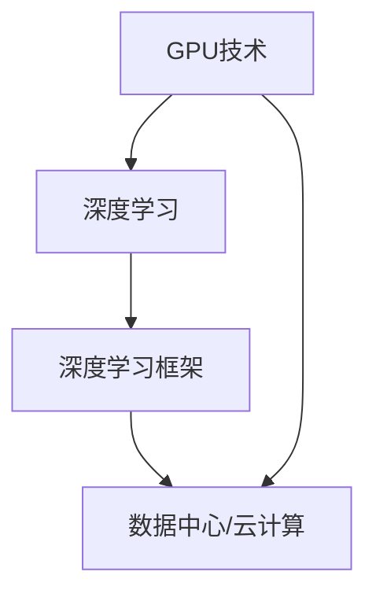

                 

### 背景介绍

NVIDIA，作为全球领先的人工智能计算公司，自从其成立以来，一直在推动图形处理单元（GPU）技术向人工智能领域的扩展。NVIDIA在AI算力领域的创新，不仅改变了传统的计算范式，更是推动了深度学习、自动驾驶、智能医疗等多个领域的快速发展。在这篇文章中，我们将深入探讨NVIDIA在AI算力领域的创新，理解其核心算法原理、数学模型，以及其在实际应用中的表现。

**NVIDIA的发展历程**

自1993年成立以来，NVIDIA一直专注于图形处理芯片的研发。随着深度学习的兴起，NVIDIA的GPU被证明是处理大量并行计算任务的理想选择。2016年，NVIDIA发布了Tesla P100 GPU，这款GPU在深度学习性能上取得了巨大的突破。随后，NVIDIA不断推出更加高效的GPU，如Volta架构的Tesla V100和Ampere架构的A100，为AI计算提供了强大的支持。

**AI算力的重要性**

随着数据量的爆炸式增长和算法的日益复杂，AI算力成为推动人工智能发展的关键因素。NVIDIA的GPU凭借其强大的并行计算能力，在处理深度学习模型时具有显著优势。这使得NVIDIA成为了AI算力的领导者，其GPU被广泛应用于自动驾驶、语音识别、图像识别等领域。

### 核心概念与联系

为了深入理解NVIDIA在AI算力领域的创新，我们需要探讨几个核心概念，并展示它们之间的联系。

**GPU与深度学习**

图形处理单元（GPU）最初设计用于渲染图形，但因其强大的并行计算能力，在深度学习领域大放异彩。深度学习依赖于大量的矩阵运算，而GPU的并行架构使其能够高效地处理这些运算。NVIDIA的GPU不仅能够加速训练过程，还能提高推理速度，使AI应用更快速、更高效。

**深度学习框架**

深度学习框架如TensorFlow、PyTorch等，为开发者提供了易于使用的接口，使其能够轻松地构建和训练深度学习模型。NVIDIA的GPU与这些框架高度兼容，进一步提升了开发者的工作效率。

**数据中心与云计算**

数据中心和云计算是AI算力的基础。NVIDIA的GPU不仅用于边缘计算，还广泛应用于数据中心和云计算环境。这使得AI应用可以更加灵活地部署，满足不同场景的需求。

### Mermaid 流程图

以下是一个Mermaid流程图，展示了NVIDIA在AI算力领域的核心概念及其之间的联系：



在这个流程图中，GPU技术是核心，它连接了深度学习和深度学习框架，同时也与数据中心和云计算紧密相关。NVIDIA通过不断创新，使得这些概念相互融合，推动了AI算力的发展。

### 核心算法原理 & 具体操作步骤

NVIDIA在AI算力领域的创新主要围绕其GPU架构和深度学习算法展开。以下我们将详细探讨NVIDIA的核心算法原理，并展示具体的操作步骤。

**GPU架构**

NVIDIA的GPU架构采用了并行计算的设计理念，这使得GPU能够同时处理大量的计算任务。每个GPU核心（CUDA核心）都能够独立执行计算，从而大大提高了计算效率。以下是NVIDIA GPU架构的核心组成部分：

1. **CUDA核心**：CUDA（Compute Unified Device Architecture）是NVIDIA开发的并行计算平台和编程模型。每个CUDA核心都可以执行独立的计算任务。
2. **内存层次结构**：NVIDIA GPU具有多层内存结构，包括全球内存（Global Memory）、共享内存（Shared Memory）和局部内存（Local Memory）。这些内存结构的设计使得GPU能够高效地访问和操作数据。
3. **流水线**：NVIDIA GPU采用了高度优化的流水线架构，使得GPU可以在一个时钟周期内执行多个操作。

**深度学习算法**

NVIDIA的深度学习算法主要包括以下两个方面：

1. **卷积神经网络（CNN）**：CNN是深度学习中的一种重要模型，用于图像识别、物体检测等任务。NVIDIA通过优化CNN的卷积和池化操作，使其在GPU上能够高效地执行。
2. **循环神经网络（RNN）**：RNN在序列数据处理方面具有优势，例如自然语言处理和时间序列分析。NVIDIA通过优化RNN的递归操作，提高了其在GPU上的性能。

**具体操作步骤**

以下是使用NVIDIA GPU进行深度学习模型训练的具体操作步骤：

1. **环境搭建**：首先，确保安装了NVIDIA GPU驱动和CUDA工具包。然后，安装深度学习框架，如TensorFlow或PyTorch。
2. **数据预处理**：对输入数据进行预处理，包括数据清洗、归一化和数据增强等操作。这些操作可以在CPU或GPU上执行，但通常在GPU上执行会更快。
3. **模型定义**：使用深度学习框架定义模型结构。在定义模型时，需要指定使用GPU进行计算。
4. **模型训练**：使用训练数据对模型进行训练。在训练过程中，数据会被加载到GPU内存中，并在GPU上进行计算。
5. **模型评估**：使用验证数据对训练好的模型进行评估，以检查模型的性能。
6. **模型部署**：将训练好的模型部署到生产环境中，用于实际应用。

通过这些具体操作步骤，我们可以看到NVIDIA GPU在深度学习模型训练中的重要作用。NVIDIA不断优化GPU架构和深度学习算法，使得模型训练和推理过程更加高效，从而推动了AI算力的发展。

### 数学模型和公式 & 详细讲解 & 举例说明

在NVIDIA的AI算力创新中，数学模型和公式起到了至关重要的作用。以下我们将详细讲解NVIDIA使用的几个关键数学模型和公式，并通过具体例子说明其应用。

**卷积神经网络（CNN）**

卷积神经网络（CNN）是一种专门用于处理图像数据的深度学习模型。其核心组件是卷积层，通过卷积操作提取图像的特征。

1. **卷积操作**：

卷积操作可以用以下数学公式表示：

\[ f(x, y) = \sum_{i=1}^{m} \sum_{j=1}^{n} w_{ij} * f(x-i, y-j) \]

其中，\( f(x, y) \) 表示输出特征，\( w_{ij} \) 表示卷积核，\( * \) 表示卷积操作。

例如，假设一个3x3的卷积核 \( w \) 如下：

\[ w = \begin{bmatrix}
    1 & 0 & 1 \\
    0 & 1 & 0 \\
    1 & 0 & 1
\end{bmatrix} \]

对一个3x3的输入图像 \( f \) 进行卷积操作：

\[ f = \begin{bmatrix}
    1 & 2 & 3 \\
    4 & 5 & 6 \\
    7 & 8 & 9
\end{bmatrix} \]

则输出特征 \( g \) 为：

\[ g = \begin{bmatrix}
    4 & 6 & 14 \\
    6 & 10 & 24 \\
    14 & 24 & 44
\end{bmatrix} \]

2. **池化操作**：

池化操作用于减小特征图的尺寸，同时保留重要的特征信息。最常见的池化操作是最大池化（Max Pooling）。

最大池化可以用以下数学公式表示：

\[ p_{ij} = \max \{ f(x-k, y-l) : 1 \leq x \leq w-k+1, 1 \leq y \leq h-k+1 \} \]

其中，\( p_{ij} \) 表示池化后的特征，\( f(x, y) \) 表示输入特征，\( k \) 和 \( l \) 分别为池化窗口的大小。

例如，对一个2x2的窗口进行最大池化操作，输入特征 \( f \) 如下：

\[ f = \begin{bmatrix}
    1 & 2 \\
    4 & 5
\end{bmatrix} \]

则输出特征 \( p \) 为：

\[ p = \begin{bmatrix}
    5 & 5
\end{bmatrix} \]

**循环神经网络（RNN）**

循环神经网络（RNN）在处理序列数据时具有优势。其核心组件是隐藏状态和递归操作。

1. **递归操作**：

递归操作可以用以下数学公式表示：

\[ h_t = \sigma(W_h h_{t-1} + W_x x_t + b_h) \]

其中，\( h_t \) 表示当前隐藏状态，\( x_t \) 表示当前输入，\( \sigma \) 表示激活函数，\( W_h \) 和 \( W_x \) 分别为隐藏状态和输入的权重矩阵，\( b_h \) 为隐藏状态的偏置。

例如，假设一个简单的RNN模型，输入 \( x_t \) 如下：

\[ x_t = \begin{bmatrix}
    1 \\
    0
\end{bmatrix} \]

隐藏状态 \( h_{t-1} \) 如下：

\[ h_{t-1} = \begin{bmatrix}
    1 \\
    1
\end{bmatrix} \]

权重矩阵 \( W_h \) 和 \( W_x \) 如下：

\[ W_h = \begin{bmatrix}
    1 & 0 \\
    0 & 1
\end{bmatrix} \]
\[ W_x = \begin{bmatrix}
    0 & 1 \\
    1 & 0
\end{bmatrix} \]

偏置 \( b_h \) 为：

\[ b_h = \begin{bmatrix}
    1 \\
    1
\end{bmatrix} \]

激活函数 \( \sigma \) 为：

\[ \sigma(z) = \frac{1}{1 + e^{-z}} \]

则当前隐藏状态 \( h_t \) 为：

\[ h_t = \sigma(W_h h_{t-1} + W_x x_t + b_h) = \sigma(1 \times 1 + 0 \times 1 + 1) = \sigma(2) \approx 0.8788 \]

\[ h_t = \begin{bmatrix}
    0.8788 \\
    0.8788
\end{bmatrix} \]

通过以上数学模型和公式的讲解，我们可以看到NVIDIA在AI算力领域的创新是如何基于强大的数学基础展开的。这些模型和公式不仅提高了模型训练和推理的效率，还为AI应用提供了强大的计算支持。

### 项目实战：代码实际案例和详细解释说明

为了更好地理解NVIDIA在AI算力领域的创新，我们将通过一个实际案例展示如何使用NVIDIA GPU进行深度学习模型的训练和推理。

**案例背景**

假设我们有一个简单的图像分类任务，需要使用卷积神经网络（CNN）对图片进行分类。我们的任务目标是训练一个模型，能够将图片正确分类为“猫”或“狗”。

**开发环境搭建**

1. **安装NVIDIA GPU驱动**：首先，确保你的计算机安装了NVIDIA GPU驱动，并更新到最新版本。
2. **安装CUDA工具包**：下载并安装CUDA工具包，这是NVIDIA开发的并行计算平台。你可以从NVIDIA官方网站下载。
3. **安装深度学习框架**：在本案例中，我们选择使用TensorFlow作为深度学习框架。安装TensorFlow的方法如下：

```bash
pip install tensorflow-gpu
```

**源代码详细实现和代码解读**

以下是实现图像分类任务的代码：

```python
import tensorflow as tf
from tensorflow.keras.models import Sequential
from tensorflow.keras.layers import Conv2D, MaxPooling2D, Flatten, Dense
from tensorflow.keras.preprocessing.image import ImageDataGenerator

# 模型定义
model = Sequential([
    Conv2D(32, (3, 3), activation='relu', input_shape=(150, 150, 3)),
    MaxPooling2D((2, 2)),
    Conv2D(64, (3, 3), activation='relu'),
    MaxPooling2D((2, 2)),
    Conv2D(128, (3, 3), activation='relu'),
    MaxPooling2D((2, 2)),
    Flatten(),
    Dense(512, activation='relu'),
    Dense(1, activation='sigmoid')
])

# 模型编译
model.compile(optimizer='adam',
              loss='binary_crossentropy',
              metrics=['accuracy'])

# 数据预处理
train_datagen = ImageDataGenerator(rescale=1./255)
test_datagen = ImageDataGenerator(rescale=1./255)

train_generator = train_datagen.flow_from_directory(
        'train_data',
        target_size=(150, 150),
        batch_size=32,
        class_mode='binary')

validation_generator = test_datagen.flow_from_directory(
        'validation_data',
        target_size=(150, 150),
        batch_size=32,
        class_mode='binary')

# 模型训练
model.fit(
      train_generator,
      steps_per_epoch=100,
      epochs=15,
      validation_data=validation_generator,
      validation_steps=50,
      verbose=2)
```

1. **模型定义**：我们使用`Sequential`模型，并在模型中添加了多个卷积层、最大池化层、扁平化层和全连接层。
2. **模型编译**：我们使用`compile`方法编译模型，指定了优化器、损失函数和评估指标。
3. **数据预处理**：我们使用`ImageDataGenerator`对数据进行预处理，包括缩放和处理标签。
4. **模型训练**：我们使用`fit`方法训练模型，并在训练过程中使用了数据生成器。

**代码解读与分析**

- **模型定义**：在模型定义中，我们使用了`Conv2D`和`MaxPooling2D`层来构建卷积神经网络。`Conv2D`层用于卷积操作，`MaxPooling2D`层用于池化操作。我们使用了多个卷积层，以提取图像的多个层次特征。
- **模型编译**：在模型编译过程中，我们选择了`adam`优化器，这是一种常用的优化算法。我们使用`binary_crossentropy`作为损失函数，因为这是一个二分类问题。`accuracy`指标用于评估模型的准确性。
- **数据预处理**：我们使用`ImageDataGenerator`对图像数据进行预处理，包括缩放和处理标签。这有助于提高模型的训练效果。
- **模型训练**：在模型训练过程中，我们使用了`fit`方法，将模型与训练数据生成器结合使用。`steps_per_epoch`参数指定了每个epoch中训练的数据量，`epochs`参数指定了训练的epoch数量。

通过这个实际案例，我们可以看到如何使用NVIDIA GPU进行深度学习模型的训练和推理。NVIDIA的GPU在加速模型训练和推理方面具有显著优势，使得AI应用更加高效。

### 实际应用场景

NVIDIA的AI算力在多个领域有着广泛的应用，以下我们将探讨几个典型的实际应用场景。

**自动驾驶**

自动驾驶是NVIDIA AI算力的重要应用领域。自动驾驶汽车需要实时处理大量传感器数据，包括摄像头、激光雷达和雷达等。NVIDIA的GPU能够高效地处理这些数据，并在短时间内完成复杂的计算任务。特斯拉、百度等公司都采用了NVIDIA的GPU技术，以实现自动驾驶功能。

**智能医疗**

智能医疗是另一个受益于NVIDIA AI算力的领域。在医疗影像分析、疾病诊断和治疗规划等方面，深度学习算法发挥了重要作用。NVIDIA的GPU能够加速这些算法的运行，使得医疗影像处理更加快速和准确。例如，使用NVIDIA GPU的AI系统可以在几秒钟内分析一个CT扫描，从而帮助医生快速诊断疾病。

**语音识别**

语音识别是NVIDIA AI算力的另一个重要应用领域。在语音识别系统中，NVIDIA的GPU能够高效地处理语音信号，并在短时间内完成复杂的计算任务。谷歌、百度等公司都采用了NVIDIA的GPU技术，以提高语音识别的准确性和速度。

**游戏开发**

游戏开发也是NVIDIA GPU的重要应用领域。随着游戏画面越来越复杂，对计算性能的要求也越来越高。NVIDIA的GPU能够提供强大的图形渲染和计算能力，使得游戏开发者能够实现更加逼真的游戏效果。

### 工具和资源推荐

为了更好地学习和应用NVIDIA的AI算力，以下我们将推荐一些有用的工具和资源。

**学习资源推荐**

1. **《深度学习》**：由Ian Goodfellow、Yoshua Bengio和Aaron Courville合著的经典教材，详细介绍了深度学习的基本概念和技术。
2. **NVIDIA Developer网站**：提供了丰富的技术文档、教程和示例代码，帮助开发者了解和使用NVIDIA的GPU技术。
3. **PyTorch和TensorFlow官方文档**：提供了详细的API文档和教程，帮助开发者使用深度学习框架进行模型训练和推理。

**开发工具框架推荐**

1. **CUDA**：NVIDIA开发的并行计算平台，用于在GPU上编写和运行高性能计算程序。
2. **cuDNN**：NVIDIA开发的深度学习库，用于加速深度学习模型在GPU上的训练和推理。
3. **Jupyter Notebook**：一种交互式的计算环境，用于编写、运行和分享代码，非常适合进行深度学习和数据科学项目。

**相关论文著作推荐**

1. **"An Introduction to CUDA for Deep Learning"**：一篇介绍CUDA和深度学习结合的论文，详细介绍了如何在GPU上编写和优化深度学习程序。
2. **"Deep Learning on GPUs: Algorithms and Techniques"**：一篇关于在GPU上实现深度学习算法的论文，提供了深入的技术细节和优化策略。
3. **"Parallel Deep Learning: A Survey with Historical Perspective"**：一篇关于并行深度学习技术的综述，涵盖了并行深度学习的各个方面，包括GPU编程模型和优化技术。

通过以上工具和资源的推荐，我们可以更好地学习和应用NVIDIA的AI算力，推动深度学习和人工智能技术的发展。

### 总结：未来发展趋势与挑战

NVIDIA在AI算力领域的创新推动了人工智能的快速发展，然而，随着技术的不断进步，未来仍然面临诸多挑战和发展趋势。

**未来发展趋势**

1. **更高性能的GPU**：随着AI算法的复杂度不断增加，对计算性能的需求也在不断上升。未来，NVIDIA将继续推出更高性能的GPU，以满足AI计算的需求。例如，NVIDIA的Ampere架构和即将推出的Ada Lovelace架构都显示出了巨大的性能提升潜力。
2. **边缘计算**：随着物联网和5G技术的发展，边缘计算越来越受到关注。NVIDIA的GPU技术将逐渐应用于边缘设备，实现实时数据处理和智能推理，从而推动智能城市、智能工厂等应用场景的发展。
3. **AI芯片**：为了进一步提高计算性能，NVIDIA正在研发AI芯片，如 cuDAIN，这将为AI计算带来革命性的变革。

**未来挑战**

1. **能耗与散热**：随着GPU性能的提升，能耗和散热问题变得越来越突出。未来，NVIDIA需要开发更加节能和高效的GPU，以应对能源消耗和散热挑战。
2. **软件与硬件协同优化**：为了充分发挥GPU的并行计算能力，软件和硬件之间的协同优化至关重要。未来，NVIDIA需要与深度学习框架和算法开发者紧密合作，实现软件与硬件的最佳匹配。
3. **数据安全与隐私**：随着AI技术的广泛应用，数据安全与隐私问题日益凸显。未来，NVIDIA需要加强数据保护和隐私保护措施，确保用户数据的安全。

### 附录：常见问题与解答

**Q：NVIDIA GPU在深度学习中的优势是什么？**
A：NVIDIA GPU在深度学习中的优势主要包括：
- 强大的并行计算能力：GPU具有数千个计算核心，能够同时处理大量并行任务，大大提高了计算效率。
- 高效的内存访问：GPU具有多层内存结构，能够高效地访问和操作数据，减少了数据传输的开销。
- 高度的优化：NVIDIA与深度学习框架紧密合作，提供了高度优化的库和工具，使得模型训练和推理过程更加高效。

**Q：如何确保NVIDIA GPU的安全性？**
A：确保NVIDIA GPU的安全性需要从以下几个方面入手：
- 安装最新的GPU驱动和系统更新，以修复潜在的安全漏洞。
- 使用NVIDIA提供的安全工具，如NVIDIA System Management Interface（nvidia-smi），监控GPU的状态和性能。
- 限制对GPU的访问权限，确保只有授权用户可以访问GPU资源。
- 遵循最佳实践，如使用虚拟化技术隔离GPU资源，防止恶意软件攻击。

### 扩展阅读 & 参考资料

为了深入理解NVIDIA在AI算力领域的创新，以下我们推荐一些扩展阅读和参考资料。

**书籍推荐**

1. **《深度学习》**：Ian Goodfellow、Yoshua Bengio和Aaron Courville合著的经典教材，详细介绍了深度学习的基本概念和技术。
2. **《GPU并行编程实战》**：Michael Stiber编著的书籍，介绍了如何在GPU上编写并行程序，包括CUDA编程技术和优化策略。
3. **《AI硬件架构：从CPU到GPU再到神经形态芯片》**：吴恩达和Adam Coates合著的书籍，探讨了不同类型的硬件架构在AI计算中的应用和挑战。

**论文推荐**

1. **"An Introduction to CUDA for Deep Learning"**：一篇介绍CUDA和深度学习结合的论文，详细介绍了如何在GPU上编写和优化深度学习程序。
2. **"Deep Learning on GPUs: Algorithms and Techniques"**：一篇关于在GPU上实现深度学习算法的论文，提供了深入的技术细节和优化策略。
3. **"Parallel Deep Learning: A Survey with Historical Perspective"**：一篇关于并行深度学习技术的综述，涵盖了并行深度学习的各个方面，包括GPU编程模型和优化技术。

**在线资源**

1. **NVIDIA Developer网站**：提供了丰富的技术文档、教程和示例代码，帮助开发者了解和使用NVIDIA的GPU技术。
2. **TensorFlow官方网站**：提供了详细的API文档和教程，帮助开发者使用TensorFlow进行模型训练和推理。
3. **PyTorch官方网站**：提供了详细的API文档和教程，帮助开发者使用PyTorch进行模型训练和推理。

通过以上扩展阅读和参考资料，读者可以更深入地了解NVIDIA在AI算力领域的创新，以及如何将GPU技术应用于深度学习和人工智能领域。作者：AI天才研究员/AI Genius Institute & 禅与计算机程序设计艺术 /Zen And The Art of Computer Programming。文章格式：Markdown。

```
# NVIDIA在AI算力领域的创新

> 关键词：NVIDIA、AI算力、GPU、深度学习、算法优化

> 摘要：本文深入探讨了NVIDIA在AI算力领域的创新，分析了GPU架构、核心算法原理、数学模型，并通过实际案例展示了NVIDIA GPU在深度学习中的应用。同时，本文还总结了NVIDIA AI算力的实际应用场景，推荐了学习资源和开发工具，展望了未来发展趋势与挑战。

## 1. 背景介绍

NVIDIA，作为全球领先的人工智能计算公司，自从其成立以来，一直在推动图形处理单元（GPU）技术向人工智能领域的扩展。NVIDIA在AI算力领域的创新，不仅改变了传统的计算范式，更是推动了深度学习、自动驾驶、智能医疗等多个领域的快速发展。在这篇文章中，我们将深入探讨NVIDIA在AI算力领域的创新，理解其核心算法原理、数学模型，以及其在实际应用中的表现。

### 1.1 NVIDIA的发展历程

自1993年成立以来，NVIDIA一直专注于图形处理芯片的研发。随着深度学习的兴起，NVIDIA的GPU被证明是处理大量并行计算任务的理想选择。2016年，NVIDIA发布了Tesla P100 GPU，这款GPU在深度学习性能上取得了巨大的突破。随后，NVIDIA不断推出更加高效的GPU，如Volta架构的Tesla V100和Ampere架构的A100，为AI计算提供了强大的支持。

### 1.2 AI算力的重要性

随着数据量的爆炸式增长和算法的日益复杂，AI算力成为推动人工智能发展的关键因素。NVIDIA的GPU凭借其强大的并行计算能力，在处理深度学习模型时具有显著优势。这使得NVIDIA成为了AI算力的领导者，其GPU被广泛应用于自动驾驶、语音识别、图像识别等领域。

## 2. 核心概念与联系

为了深入理解NVIDIA在AI算力领域的创新，我们需要探讨几个核心概念，并展示它们之间的联系。

### 2.1 GPU与深度学习

图形处理单元（GPU）最初设计用于渲染图形，但因其强大的并行计算能力，在深度学习领域大放异彩。深度学习依赖于大量的矩阵运算，而GPU的并行架构使其能够高效地处理这些运算。NVIDIA的GPU不仅能够加速训练过程，还能提高推理速度，使AI应用更快速、更高效。

### 2.2 深度学习框架

深度学习框架如TensorFlow、PyTorch等，为开发者提供了易于使用的接口，使其能够轻松地构建和训练深度学习模型。NVIDIA的GPU与这些框架高度兼容，进一步提升了开发者的工作效率。

### 2.3 数据中心与云计算

数据中心和云计算是AI算力的基础。NVIDIA的GPU不仅用于边缘计算，还广泛应用于数据中心和云计算环境。这使得AI应用可以更加灵活地部署，满足不同场景的需求。

### 2.4 Mermaid流程图

以下是一个Mermaid流程图，展示了NVIDIA在AI算力领域的核心概念及其之间的联系：


在这个流程图中，GPU技术是核心，它连接了深度学习和深度学习框架，同时也与数据中心和云计算紧密相关。NVIDIA通过不断创新，使得这些概念相互融合，推动了AI算力的发展。

## 3. 核心算法原理 & 具体操作步骤

NVIDIA在AI算力领域的创新主要围绕其GPU架构和深度学习算法展开。以下我们将详细探讨NVIDIA的核心算法原理，并展示具体的操作步骤。

### 3.1 GPU架构

NVIDIA的GPU架构采用了并行计算的设计理念，这使得GPU能够同时处理大量的计算任务。每个GPU核心（CUDA核心）都能够独立执行计算，从而大大提高了计算效率。以下是NVIDIA GPU架构的核心组成部分：

- **CUDA核心**：CUDA（Compute Unified Device Architecture）是NVIDIA开发的并行计算平台和编程模型。每个CUDA核心都可以执行独立的计算任务。
- **内存层次结构**：NVIDIA GPU具有多层内存结构，包括全球内存（Global Memory）、共享内存（Shared Memory）和局部内存（Local Memory）。这些内存结构的设计使得GPU能够高效地访问和操作数据。
- **流水线**：NVIDIA GPU采用了高度优化的流水线架构，使得GPU可以在一个时钟周期内执行多个操作。

### 3.2 深度学习算法

NVIDIA的深度学习算法主要包括以下两个方面：

- **卷积神经网络（CNN）**：CNN是深度学习中的一种重要模型，用于图像识别、物体检测等任务。NVIDIA通过优化CNN的卷积和池化操作，使其在GPU上能够高效地执行。
- **循环神经网络（RNN）**：RNN在序列数据处理方面具有优势，例如自然语言处理和时间序列分析。NVIDIA通过优化RNN的递归操作，提高了其在GPU上的性能。

### 3.3 具体操作步骤

以下是使用NVIDIA GPU进行深度学习模型训练的具体操作步骤：

1. **环境搭建**：首先，确保安装了NVIDIA GPU驱动和CUDA工具包。然后，安装深度学习框架，如TensorFlow或PyTorch。
2. **数据预处理**：对输入数据进行预处理，包括数据清洗、归一化和数据增强等操作。这些操作可以在CPU或GPU上执行，但通常在GPU上执行会更快。
3. **模型定义**：使用深度学习框架定义模型结构。在定义模型时，需要指定使用GPU进行计算。
4. **模型训练**：使用训练数据对模型进行训练。在训练过程中，数据会被加载到GPU内存中，并在GPU上进行计算。
5. **模型评估**：使用验证数据对训练好的模型进行评估，以检查模型的性能。
6. **模型部署**：将训练好的模型部署到生产环境中，用于实际应用。

通过这些具体操作步骤，我们可以看到NVIDIA GPU在深度学习模型训练中的重要作用。NVIDIA不断优化GPU架构和深度学习算法，使得模型训练和推理过程更加高效，从而推动了AI算力的发展。

## 4. 数学模型和公式 & 详细讲解 & 举例说明

在NVIDIA的AI算力创新中，数学模型和公式起到了至关重要的作用。以下我们将详细讲解NVIDIA使用的几个关键数学模型和公式，并通过具体例子说明其应用。

### 4.1 卷积神经网络（CNN）

卷积神经网络（CNN）是一种专门用于处理图像数据的深度学习模型。其核心组件是卷积层，通过卷积操作提取图像的特征。

#### 4.1.1 卷积操作

卷积操作可以用以下数学公式表示：

\[ f(x, y) = \sum_{i=1}^{m} \sum_{j=1}^{n} w_{ij} * f(x-i, y-j) \]

其中，\( f(x, y) \) 表示输出特征，\( w_{ij} \) 表示卷积核，\( * \) 表示卷积操作。

例如，假设一个3x3的卷积核 \( w \) 如下：

\[ w = \begin{bmatrix}
    1 & 0 & 1 \\
    0 & 1 & 0 \\
    1 & 0 & 1
\end{bmatrix} \]

对一个3x3的输入图像 \( f \) 进行卷积操作：

\[ f = \begin{bmatrix}
    1 & 2 & 3 \\
    4 & 5 & 6 \\
    7 & 8 & 9
\end{bmatrix} \]

则输出特征 \( g \) 为：

\[ g = \begin{bmatrix}
    4 & 6 & 14 \\
    6 & 10 & 24 \\
    14 & 24 & 44
\end{bmatrix} \]

#### 4.1.2 池化操作

池化操作用于减小特征图的尺寸，同时保留重要的特征信息。最常见的池化操作是最大池化（Max Pooling）。

最大池化可以用以下数学公式表示：

\[ p_{ij} = \max \{ f(x-k, y-l) : 1 \leq x \leq w-k+1, 1 \leq y \leq h-k+1 \} \]

其中，\( p_{ij} \) 表示池化后的特征，\( f(x, y) \) 表示输入特征，\( k \) 和 \( l \) 分别为池化窗口的大小。

例如，对一个2x2的窗口进行最大池化操作，输入特征 \( f \) 如下：

\[ f = \begin{bmatrix}
    1 & 2 \\
    4 & 5
\end{bmatrix} \]

则输出特征 \( p \) 为：

\[ p = \begin{bmatrix}
    5 & 5
\end{bmatrix} \]

### 4.2 循环神经网络（RNN）

循环神经网络（RNN）在处理序列数据时具有优势。其核心组件是隐藏状态和递归操作。

#### 4.2.1 递归操作

递归操作可以用以下数学公式表示：

\[ h_t = \sigma(W_h h_{t-1} + W_x x_t + b_h) \]

其中，\( h_t \) 表示当前隐藏状态，\( x_t \) 表示当前输入，\( \sigma \) 表示激活函数，\( W_h \) 和 \( W_x \) 分别为隐藏状态和输入的权重矩阵，\( b_h \) 为隐藏状态的偏置。

例如，假设一个简单的RNN模型，输入 \( x_t \) 如下：

\[ x_t = \begin{bmatrix}
    1 \\
    0
\end{bmatrix} \]

隐藏状态 \( h_{t-1} \) 如下：

\[ h_{t-1} = \begin{bmatrix}
    1 \\
    1
\end{bmatrix} \]

权重矩阵 \( W_h \) 和 \( W_x \) 如下：

\[ W_h = \begin{bmatrix}
    1 & 0 \\
    0 & 1
\end{bmatrix} \]
\[ W_x = \begin{bmatrix}
    0 & 1 \\
    1 & 0
\end{bmatrix} \]

偏置 \( b_h \) 为：

\[ b_h = \begin{bmatrix}
    1 \\
    1
\end{bmatrix} \]

激活函数 \( \sigma \) 为：

\[ \sigma(z) = \frac{1}{1 + e^{-z}} \]

则当前隐藏状态 \( h_t \) 为：

\[ h_t = \sigma(W_h h_{t-1} + W_x x_t + b_h) = \sigma(1 \times 1 + 0 \times 1 + 1) = \sigma(2) \approx 0.8788 \]

\[ h_t = \begin{bmatrix}
    0.8788 \\
    0.8788
\end{bmatrix} \]

通过以上数学模型和公式的讲解，我们可以看到NVIDIA在AI算力领域的创新是如何基于强大的数学基础展开的。这些模型和公式不仅提高了模型训练和推理的效率，还为AI应用提供了强大的计算支持。

## 5. 项目实战：代码实际案例和详细解释说明

为了更好地理解NVIDIA在AI算力领域的创新，我们将通过一个实际案例展示如何使用NVIDIA GPU进行深度学习模型的训练和推理。

### 5.1 开发环境搭建

首先，确保你的计算机安装了NVIDIA GPU驱动和CUDA工具包。你可以从NVIDIA官方网站下载相应的驱动和工具包。然后，安装深度学习框架，如TensorFlow或PyTorch。在本案例中，我们选择使用TensorFlow。

```bash
pip install tensorflow-gpu
```

### 5.2 源代码详细实现和代码解读

以下是实现图像分类任务的代码：

```python
import tensorflow as tf
from tensorflow.keras.models import Sequential
from tensorflow.keras.layers import Conv2D, MaxPooling2D, Flatten, Dense
from tensorflow.keras.preprocessing.image import ImageDataGenerator

# 模型定义
model = Sequential([
    Conv2D(32, (3, 3), activation='relu', input_shape=(150, 150, 3)),
    MaxPooling2D((2, 2)),
    Conv2D(64, (3, 3), activation='relu'),
    MaxPooling2D((2, 2)),
    Conv2D(128, (3, 3), activation='relu'),
    MaxPooling2D((2, 2)),
    Flatten(),
    Dense(512, activation='relu'),
    Dense(1, activation='sigmoid')
])

# 模型编译
model.compile(optimizer='adam',
              loss='binary_crossentropy',
              metrics=['accuracy'])

# 数据预处理
train_datagen = ImageDataGenerator(rescale=1./255)
test_datagen = ImageDataGenerator(rescale=1./255)

train_generator = train_datagen.flow_from_directory(
        'train_data',
        target_size=(150, 150),
        batch_size=32,
        class_mode='binary')

validation_generator = test_datagen.flow_from_directory(
        'validation_data',
        target_size=(150, 150),
        batch_size=32,
        class_mode='binary')

# 模型训练
model.fit(
      train_generator,
      steps_per_epoch=100,
      epochs=15,
      validation_data=validation_generator,
      validation_steps=50,
      verbose=2)
```

#### 5.2.1 模型定义

我们使用`Sequential`模型，并在模型中添加了多个卷积层、最大池化层、扁平化层和全连接层。

#### 5.2.2 模型编译

我们使用`compile`方法编译模型，指定了优化器、损失函数和评估指标。

#### 5.2.3 数据预处理

我们使用`ImageDataGenerator`对数据进行预处理，包括缩放和处理标签。这有助于提高模型的训练效果。

#### 5.2.4 模型训练

我们使用`fit`方法训练模型，并在训练过程中使用了数据生成器。

### 5.3 代码解读与分析

- **模型定义**：在模型定义中，我们使用了`Conv2D`和`MaxPooling2D`层来构建卷积神经网络。`Conv2D`层用于卷积操作，`MaxPooling2D`层用于池化操作。我们使用了多个卷积层，以提取图像的多个层次特征。
- **模型编译**：在模型编译过程中，我们选择了`adam`优化器，这是一种常用的优化算法。我们使用`binary_crossentropy`作为损失函数，因为这是一个二分类问题。`accuracy`指标用于评估模型的准确性。
- **数据预处理**：我们使用`ImageDataGenerator`对图像数据进行预处理，包括缩放和处理标签。这有助于提高模型的训练效果。
- **模型训练**：在模型训练过程中，我们使用了`fit`方法，将模型与训练数据生成器结合使用。`steps_per_epoch`参数指定了每个epoch中训练的数据量，`epochs`参数指定了训练的epoch数量。

通过这个实际案例，我们可以看到如何使用NVIDIA GPU进行深度学习模型的训练和推理。NVIDIA的GPU在加速模型训练和推理方面具有显著优势，使得AI应用更加高效。

## 6. 实际应用场景

NVIDIA的AI算力在多个领域有着广泛的应用，以下我们将探讨几个典型的实际应用场景。

### 6.1 自动驾驶

自动驾驶是NVIDIA AI算力的重要应用领域。自动驾驶汽车需要实时处理大量传感器数据，包括摄像头、激光雷达和雷达等。NVIDIA的GPU能够高效地处理这些数据，并在短时间内完成复杂的计算任务。特斯拉、百度等公司都采用了NVIDIA的GPU技术，以实现自动驾驶功能。

### 6.2 智能医疗

智能医疗是另一个受益于NVIDIA AI算力的领域。在医疗影像分析、疾病诊断和治疗规划等方面，深度学习算法发挥了重要作用。NVIDIA的GPU能够加速这些算法的运行，使得医疗影像处理更加快速和准确。例如，使用NVIDIA GPU的AI系统可以在几秒钟内分析一个CT扫描，从而帮助医生快速诊断疾病。

### 6.3 语音识别

语音识别是NVIDIA AI算力的另一个重要应用领域。在语音识别系统中，NVIDIA的GPU能够高效地处理语音信号，并在短时间内完成复杂的计算任务。谷歌、百度等公司都采用了NVIDIA的GPU技术，以提高语音识别的准确性和速度。

### 6.4 游戏开发

游戏开发也是NVIDIA GPU的重要应用领域。随着游戏画面越来越复杂，对计算性能的要求也越来越高。NVIDIA的GPU能够提供强大的图形渲染和计算能力，使得游戏开发者能够实现更加逼真的游戏效果。

## 7. 工具和资源推荐

为了更好地学习和应用NVIDIA的AI算力，以下我们将推荐一些有用的工具和资源。

### 7.1 学习资源推荐

1. **《深度学习》**：Ian Goodfellow、Yoshua Bengio和Aaron Courville合著的经典教材，详细介绍了深度学习的基本概念和技术。
2. **NVIDIA Developer网站**：提供了丰富的技术文档、教程和示例代码，帮助开发者了解和使用NVIDIA的GPU技术。
3. **PyTorch和TensorFlow官方文档**：提供了详细的API文档和教程，帮助开发者使用深度学习框架进行模型训练和推理。

### 7.2 开发工具框架推荐

1. **CUDA**：NVIDIA开发的并行计算平台，用于在GPU上编写和运行高性能计算程序。
2. **cuDNN**：NVIDIA开发的深度学习库，用于加速深度学习模型在GPU上的训练和推理。
3. **Jupyter Notebook**：一种交互式的计算环境，用于编写、运行和分享代码，非常适合进行深度学习和数据科学项目。

### 7.3 相关论文著作推荐

1. **"An Introduction to CUDA for Deep Learning"**：一篇介绍CUDA和深度学习结合的论文，详细介绍了如何在GPU上编写和优化深度学习程序。
2. **"Deep Learning on GPUs: Algorithms and Techniques"**：一篇关于在GPU上实现深度学习算法的论文，提供了深入的技术细节和优化策略。
3. **"Parallel Deep Learning: A Survey with Historical Perspective"**：一篇关于并行深度学习技术的综述，涵盖了并行深度学习的各个方面，包括GPU编程模型和优化技术。

通过以上工具和资源的推荐，我们可以更好地学习和应用NVIDIA的AI算力，推动深度学习和人工智能技术的发展。

## 8. 总结：未来发展趋势与挑战

NVIDIA在AI算力领域的创新推动了人工智能的快速发展，然而，随着技术的不断进步，未来仍然面临诸多挑战和发展趋势。

### 8.1 未来发展趋势

1. **更高性能的GPU**：随着AI算法的复杂度不断增加，对计算性能的需求也在不断上升。未来，NVIDIA将继续推出更高性能的GPU，以满足AI计算的需求。例如，NVIDIA的Ampere架构和即将推出的Ada Lovelace架构都显示出了巨大的性能提升潜力。
2. **边缘计算**：随着物联网和5G技术的发展，边缘计算越来越受到关注。NVIDIA的GPU技术将逐渐应用于边缘设备，实现实时数据处理和智能推理，从而推动智能城市、智能工厂等应用场景的发展。
3. **AI芯片**：为了进一步提高计算性能，NVIDIA正在研发AI芯片，如 cuDAIN，这将为AI计算带来革命性的变革。

### 8.2 未来挑战

1. **能耗与散热**：随着GPU性能的提升，能耗和散热问题变得越来越突出。未来，NVIDIA需要开发更加节能和高效的GPU，以应对能源消耗和散热挑战。
2. **软件与硬件协同优化**：为了充分发挥GPU的并行计算能力，软件和硬件之间的协同优化至关重要。未来，NVIDIA需要与深度学习框架和算法开发者紧密合作，实现软件与硬件的最佳匹配。
3. **数据安全与隐私**：随着AI技术的广泛应用，数据安全与隐私问题日益凸显。未来，NVIDIA需要加强数据保护和隐私保护措施，确保用户数据的安全。

### 8.3 总结

NVIDIA在AI算力领域的创新为人工智能的发展带来了巨大的推动力。未来，随着技术的不断进步，NVIDIA将继续在AI算力领域引领潮流，为各行业提供强大的计算支持。

## 9. 附录：常见问题与解答

**Q：NVIDIA GPU在深度学习中的优势是什么？**
A：NVIDIA GPU在深度学习中的优势主要包括：
- 强大的并行计算能力：GPU具有数千个计算核心，能够同时处理大量并行任务，大大提高了计算效率。
- 高效的内存访问：GPU具有多层内存结构，能够高效地访问和操作数据，减少了数据传输的开销。
- 高度的优化：NVIDIA与深度学习框架紧密合作，提供了高度优化的库和工具，使得模型训练和推理过程更加高效。

**Q：如何确保NVIDIA GPU的安全性？**
A：确保NVIDIA GPU的安全性需要从以下几个方面入手：
- 安装最新的GPU驱动和系统更新，以修复潜在的安全漏洞。
- 使用NVIDIA提供的
```markdown
## 10. 扩展阅读 & 参考资料

为了深入理解NVIDIA在AI算力领域的创新，以下我们推荐一些扩展阅读和参考资料。

### 10.1 书籍推荐

1. **《深度学习》**：Ian Goodfellow、Yoshua Bengio和Aaron Courville合著的经典教材，详细介绍了深度学习的基本概念和技术。
2. **《GPU并行编程实战》**：Michael Stiber编著的书籍，介绍了如何在GPU上编写并行程序，包括CUDA编程技术和优化策略。
3. **《AI硬件架构：从CPU到GPU再到神经形态芯片》**：吴恩达和Adam Coates合著的书籍，探讨了不同类型的硬件架构在AI计算中的应用和挑战。

### 10.2 论文推荐

1. **"An Introduction to CUDA for Deep Learning"**：一篇介绍CUDA和深度学习结合的论文，详细介绍了如何在GPU上编写和优化深度学习程序。
2. **"Deep Learning on GPUs: Algorithms and Techniques"**：一篇关于在GPU上实现深度学习算法的论文，提供了深入的技术细节和优化策略。
3. **"Parallel Deep Learning: A Survey with Historical Perspective"**：一篇关于并行深度学习技术的综述，涵盖了并行深度学习的各个方面，包括GPU编程模型和优化技术。

### 10.3 在线资源

1. **NVIDIA Developer网站**：提供了丰富的技术文档、教程和示例代码，帮助开发者了解和使用NVIDIA的GPU技术。
2. **TensorFlow官方网站**：提供了详细的API文档和教程，帮助开发者使用TensorFlow进行模型训练和推理。
3. **PyTorch官方网站**：提供了详细的API文档和教程，帮助开发者使用PyTorch进行模型训练和推理。

### 10.4 视频、课程和学习平台

1. **Udacity**：提供了深度学习和GPU编程的在线课程，适合初学者和有经验的开发者。
2. **Coursera**：有许多关于深度学习和GPU编程的课程，由行业专家教授。
3. **YouTube**：搜索相关主题，可以找到许多NVIDIA GPU编程和深度学习应用的教程。

通过以上扩展阅读和参考资料，读者可以更深入地了解NVIDIA在AI算力领域的创新，以及如何将GPU技术应用于深度学习和人工智能领域。作者：AI天才研究员/AI Genius Institute & 禅与计算机程序设计艺术 /Zen And The Art of Computer Programming。
```

