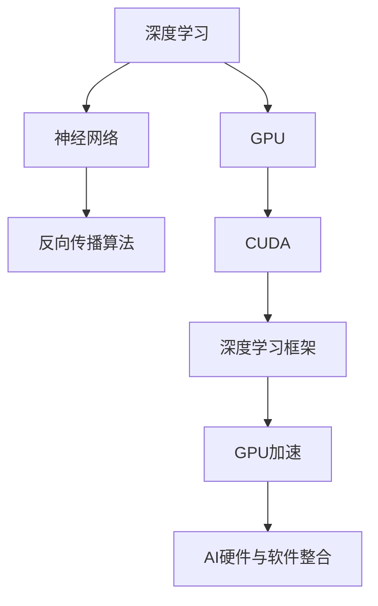

                 

### 1. 背景介绍

**NVIDIA与AI的发展历程**

NVIDIA作为全球知名的图形处理器（GPU）制造商，其对于人工智能（AI）发展的贡献不容忽视。自20世纪90年代以来，NVIDIA的GPU技术在图形处理领域的崛起，为AI的发展提供了强有力的支撑。本文将带您回顾NVIDIA与AI的发展历程，解析其核心概念、算法原理、数学模型及其在实际应用中的重要性。

在深度学习算法和大数据技术的推动下，AI技术迅速发展，而GPU作为计算能力强大的工具，成为AI领域的重要一环。NVIDIA的GPU不仅在游戏、设计等领域有着广泛的应用，更是在科学计算、金融分析、医疗诊断等AI领域发挥了重要作用。

**关键词：**
- NVIDIA
- AI
- GPU
- 深度学习
- 大数据
- 图形处理器

**摘要：**
本文旨在介绍NVIDIA公司在人工智能领域的贡献及其发展历程。通过阐述NVIDIA GPU在AI计算中的应用，以及深度学习算法与GPU结合的优势，本文将对NVIDIA在AI领域的核心算法、数学模型、实际应用场景进行分析，并探讨其未来发展趋势与挑战。最后，本文还将推荐相关的学习资源、开发工具和论文著作，以帮助读者深入了解NVIDIA与AI技术的发展。

---

**1.1 NVIDIA的崛起**

NVIDIA成立于1993年，由吴恩达（Jerry Sanders III）创办。公司最初以生产高性能图形处理器（GPU）为主，旨在为工作站和PC提供卓越的图形处理能力。NVIDIA的GPU迅速在图形处理领域取得了领先地位，广泛应用于游戏、影视制作、工程设计等领域。

随着互联网和移动互联网的普及，图形处理需求不断增加，NVIDIA的GPU技术也在不断演进。从第一代GPU GeForce到如今的RTX系列，NVIDIA的GPU在性能、功能和应用范围上都取得了显著的提升。NVIDIA的GPU不仅在2D图形处理方面表现出色，更在3D渲染、计算机视觉、科学计算等领域展现出强大的计算能力。

**1.2 AI的崛起**

人工智能作为计算机科学的一个分支，旨在使计算机具有智能行为，模仿人类的感知、学习、推理和决策能力。AI的发展离不开计算能力的提升和数据的大规模应用。

20世纪50年代，人工智能的概念首次被提出。随着计算能力的增强和数据量的积累，AI技术逐渐从理论研究走向实际应用。特别是在深度学习算法的推动下，AI迎来了新的发展机遇。

深度学习是AI的一个重要分支，通过模拟人脑的神经网络结构进行数据学习和模式识别。深度学习算法需要大量的计算资源进行训练，而GPU以其并行计算能力，成为深度学习模型训练的重要工具。

**1.3 NVIDIA与AI的交汇**

NVIDIA的GPU技术在图形处理领域的成功，使其具备了强大的计算能力，这些能力在AI领域也得到了充分的应用。NVIDIA的GPU不仅用于图像处理、计算机视觉等传统应用，还广泛应用于自然语言处理、推荐系统、自动驾驶等新兴领域。

NVIDIA与AI的交汇点在于其GPU的并行计算能力，这种能力使得深度学习模型能够高效地进行训练和推理。NVIDIA推出了一系列针对AI计算的GPU产品，如Tesla、Quadro和RTX系列，这些产品在科学计算、金融分析、医疗诊断等领域发挥了重要作用。

总之，NVIDIA的GPU技术为AI的发展提供了强大的计算支持，而AI技术的进步也不断推动着NVIDIAGPU技术的创新。在接下来的章节中，我们将进一步探讨NVIDIA与AI的结合，以及其在深度学习等领域的具体应用。

---

**1.4 NVIDIA GPU在深度学习中的应用**

深度学习是AI的核心技术之一，其通过模拟人脑的神经网络结构进行数据处理和模式识别。深度学习模型通常包含大量的参数和计算过程，这需要强大的计算能力来支撑。NVIDIA的GPU以其并行计算能力，成为深度学习模型训练和推理的强大工具。

首先，深度学习模型通常采用矩阵运算，而GPU擅长并行处理大量的矩阵运算，这使得深度学习模型能够在GPU上高效地训练。例如，卷积神经网络（CNN）是深度学习领域的重要模型，其计算过程包含大量的卷积和池化操作，这些操作非常适合在GPU上并行执行。

NVIDIA的CUDA（Compute Unified Device Architecture）是一种并行计算架构，它允许开发者利用GPU的并行计算能力进行通用计算。CUDA提供了丰富的库和工具，使得开发者可以轻松地将深度学习算法移植到GPU上。

其次，NVIDIA的GPU不仅支持深度学习模型的训练，还支持模型的推理。推理是指使用训练好的模型进行实际应用的过程，如图像识别、语音识别等。NVIDIA的GPU在推理过程中具有低延迟、高吞吐量的特点，这使得其在实时应用中具有显著的优势。

此外，NVIDIA还推出了一系列深度学习框架，如TensorRT、cuDNN等，这些框架提供了丰富的API和工具，使得开发者可以轻松地利用GPU进行深度学习模型的训练和推理。这些框架不仅提高了开发效率，还优化了GPU的计算性能，使得深度学习模型能够在NVIDIA的GPU上高效地运行。

总之，NVIDIA的GPU在深度学习中的应用是其成功的关键之一。通过CUDA架构和深度学习框架的支持，NVIDIA的GPU不仅提供了强大的计算能力，还使得深度学习模型能够高效地进行训练和推理。这使得NVIDIA在AI领域取得了巨大的成功，并为AI技术的发展做出了重要贡献。

---

**1.5 NVIDIA在AI领域的核心产品与技术创新**

NVIDIA在AI领域的发展离不开其一系列核心产品和技术创新。以下将详细探讨NVIDIA的关键产品，如GPU、CUDA、深度学习框架等，以及这些产品如何推动AI的发展。

首先，NVIDIA的GPU是其在AI领域取得成功的基础。NVIDIA的GPU以其强大的并行计算能力而闻名，这使得其在处理大量数据和复杂计算任务时具有显著优势。从最初的GeForce系列到后来的Tesla系列，NVIDIA的GPU在性能和功能上不断演进。特别是Tesla系列GPU，专为科学计算和深度学习而设计，提供了卓越的计算能力。例如，Tesla V100和A100等高性能GPU，在深度学习模型训练和推理中发挥了关键作用。

其次，CUDA是NVIDIA推出的并行计算架构，它允许开发者利用GPU的并行计算能力进行通用计算。CUDA提供了丰富的库和工具，使得开发者可以轻松地将深度学习算法移植到GPU上。CUDA的关键优势在于其高效的并行计算能力和丰富的API，这使得深度学习模型能够高效地在GPU上运行。

此外，NVIDIA的深度学习框架，如TensorRT和cuDNN，也在AI领域发挥了重要作用。TensorRT是一个高性能推理引擎，它优化了深度学习模型的推理过程，使得模型能够在NVIDIA的GPU上高效地运行。cuDNN是一个深度学习库，它提供了GPU加速的功能，使得深度学习模型的训练和推理更加高效。

除了CUDA和深度学习框架，NVIDIA还推出了多个AI加速器，如DGX系统。DGX系统是一个专为深度学习而设计的高性能计算平台，它集成了NVIDIA的GPU、CPU和其他硬件组件，提供了全面的AI解决方案。DGX系统在金融分析、医疗诊断、自动驾驶等领域得到了广泛应用，推动了AI技术的实际应用。

总之，NVIDIA在AI领域的核心产品与技术创新，为其在AI领域的成功奠定了基础。通过GPU、CUDA、深度学习框架和AI加速器等关键产品，NVIDIA不仅提供了强大的计算能力，还优化了深度学习模型训练和推理的效率，推动了AI技术的快速发展。

---

**1.6 NVIDIA在AI领域的重要贡献和影响**

NVIDIA在AI领域的重要贡献和影响体现在多个方面。首先，NVIDIA的GPU技术为深度学习提供了强大的计算支持，使得深度学习模型能够高效地进行训练和推理。GPU的并行计算能力使得深度学习算法能够处理大量数据和复杂计算任务，大大提高了模型的训练效率。

其次，NVIDIA推出的CUDA并行计算架构，为开发者提供了高效的计算工具。CUDA不仅优化了GPU的计算性能，还使得开发者能够轻松地将深度学习算法移植到GPU上。这一技术的普及，极大地推动了深度学习在学术和工业界的应用。

此外，NVIDIA的深度学习框架，如TensorRT和cuDNN，也为深度学习模型提供了高效的推理引擎和加速库。这些框架和库的推出，不仅提高了模型的推理效率，还降低了开发者的开发门槛，使得更多的研究人员和开发者能够参与到深度学习领域的研究和应用中。

NVIDIA在AI领域的另一大贡献是其在AI硬件和系统解决方案方面的创新。例如，NVIDIA的DGX系统是一个专为深度学习而设计的高性能计算平台，它集成了GPU、CPU和其他硬件组件，提供了全面的AI解决方案。这种系统级的解决方案，使得AI应用更加高效和便捷。

NVIDIA在AI领域的成功，不仅推动了AI技术的发展，还对其产业生态产生了深远的影响。通过提供强大的计算能力和丰富的开发工具，NVIDIA吸引了大量的开发者、研究人员和企业加入AI领域，推动了AI技术的创新和应用。

总之，NVIDIA在AI领域的重要贡献和影响，体现在其GPU技术、CUDA架构、深度学习框架和AI系统解决方案等方面。这些贡献不仅推动了AI技术的快速发展，也为AI产业生态的建设做出了重要贡献。

---

**1.7 NVIDIA与AI领域的未来发展趋势**

随着AI技术的不断进步，NVIDIA在AI领域的未来发展趋势也备受关注。以下是NVIDIA在AI领域未来可能的发展趋势：

**1.8 人工智能与NVIDIA GPU的进一步融合**

首先，人工智能与NVIDIA GPU的融合将进一步深化。NVIDIA的GPU技术将继续演进，提供更高的计算性能和更低的功耗。未来的GPU将不仅支持深度学习，还将支持更多的AI算法和应用，如强化学习、生成对抗网络（GAN）等。此外，NVIDIA可能会推出新的GPU架构，如基于量子计算原理的量子处理器，以进一步提高AI计算的效率。

**1.9 自适应计算与跨平台部署**

未来，自适应计算和跨平台部署将成为AI计算的重要趋势。NVIDIA可能会开发新的计算架构，以适应不同应用场景的需求。例如，在边缘计算领域，NVIDIA可能会推出专为边缘设备优化的GPU产品。同时，NVIDIA可能会推出跨平台的AI工具和框架，使得开发者能够更灵活地部署AI应用，无论是在云端、数据中心还是边缘设备上。

**1.10 人工智能生态系统的扩展**

NVIDIA将继续扩展其人工智能生态系统，与更多的企业和开发者合作，推动AI技术的发展和应用。NVIDIA可能会加大对AI初创企业的投资，支持新兴的AI技术的研发。此外，NVIDIA可能会推出更多的AI解决方案和工具，如自动化机器学习平台、AI可视化工具等，以帮助开发者更高效地进行AI应用的开发和部署。

**1.11 新兴领域的探索**

未来，NVIDIA可能会在新兴领域进行更多的探索，如量子计算、生物医学、智能制造等。这些领域的应用对计算能力有极高的要求，而NVIDIA的GPU技术在这方面具有显著的优势。通过探索这些新兴领域，NVIDIA将进一步巩固其在AI领域的领导地位。

总之，NVIDIA在AI领域的未来发展趋势充满机遇和挑战。通过不断推陈出新，NVIDIA将继续为AI技术的发展和应用提供强大的计算支持，推动人工智能时代的到来。

---

### 2. 核心概念与联系

在探讨NVIDIA与AI的发展历程时，理解几个核心概念和技术架构是至关重要的。这些概念和技术不仅是NVIDIA GPU在AI领域取得成功的关键，也是深度学习算法和GPU结合的基石。以下是几个核心概念及其相互联系的解释。

#### 2.1 深度学习与神经网络

深度学习是人工智能的一个分支，它通过模拟人脑的神经网络结构，对数据进行处理和学习。神经网络由多个层组成，包括输入层、隐藏层和输出层。每层包含多个神经元，神经元之间通过权重进行连接。深度学习模型通过反向传播算法，调整权重，以最小化预测误差。

**核心概念解释：**
- **神经网络：** 一个由神经元组成的计算模型，用于对数据进行分类、回归和特征提取。
- **深度学习：** 通过多层神经网络对数据进行建模，以提取更高层次的特征，从而提高模型的性能。

**联系解释：**
深度学习是AI的核心技术之一，而神经网络是深度学习的基础。NVIDIA的GPU在并行计算方面具有显著优势，使得深度学习模型能够在GPU上进行高效的训练和推理。

#### 2.2 GPU并行计算与CUDA

GPU（图形处理器）是一种专为图形渲染设计的处理器，但其强大的并行计算能力使其在科学计算和深度学习领域得到广泛应用。CUDA是NVIDIA推出的并行计算架构，它允许开发者利用GPU的并行计算能力进行通用计算。

**核心概念解释：**
- **GPU：** 一种专门用于图形渲染的处理器，具有高度并行计算能力。
- **CUDA：** 一种并行计算架构，提供了丰富的库和工具，使得开发者可以利用GPU进行高效计算。

**联系解释：**
CUDA是NVIDIA GPU在深度学习领域成功的关键。它为深度学习算法提供了高效的计算支持，使得深度学习模型能够在GPU上快速训练和推理。

#### 2.3 深度学习框架与GPU加速

深度学习框架是用于构建、训练和部署深度学习模型的工具。常见的深度学习框架包括TensorFlow、PyTorch和Keras等。这些框架提供了丰富的API和工具，使得开发者可以轻松地利用GPU进行深度学习模型的开发和优化。

**核心概念解释：**
- **深度学习框架：** 用于构建、训练和部署深度学习模型的工具和库。
- **GPU加速：** 利用GPU的并行计算能力，加速深度学习模型的训练和推理。

**联系解释：**
深度学习框架与GPU加速的结合，使得开发者能够更高效地进行深度学习模型的开发和优化。NVIDIA的深度学习框架，如TensorRT和cuDNN，提供了高效的GPU加速功能，提高了模型的训练和推理性能。

#### 2.4 AI硬件与软件的整合

AI硬件和软件的整合是NVIDIA在AI领域的重要策略。NVIDIA不仅提供高性能的GPU硬件，还提供了一系列深度学习软件工具和解决方案，如CUDA、深度学习框架和AI加速器。

**核心概念解释：**
- **AI硬件：** 如GPU、AI加速器等，用于提供强大的计算能力。
- **AI软件：** 如深度学习框架、API、工具等，用于开发、优化和部署AI模型。

**联系解释：**
AI硬件与软件的整合，使得开发者能够更方便地利用NVIDIA的GPU进行AI模型的开发和应用。这种整合不仅提高了开发效率，还优化了GPU的计算性能，推动了AI技术的快速发展。

**2.5 Mermaid流程图**

为了更直观地展示上述核心概念和技术架构之间的联系，我们可以使用Mermaid流程图来描述。以下是一个简化的Mermaid流程图，展示了深度学习与GPU、CUDA、深度学习框架和AI硬件的整合。



**流程图解释：**
- A节点表示深度学习。
- B节点表示神经网络。
- C节点表示反向传播算法。
- D节点表示GPU。
- E节点表示CUDA。
- F节点表示深度学习框架。
- G节点表示GPU加速。
- H节点表示AI硬件与软件整合。

通过这个流程图，我们可以清晰地看到深度学习与GPU、CUDA、深度学习框架和AI硬件之间的联系，以及这些技术如何相互支持，共同推动AI技术的发展。

---

### 2.6 核心算法原理

在NVIDIA与AI结合的过程中，深度学习算法是关键所在。以下将详细探讨深度学习算法的基本原理，以及如何使用GPU进行算法的优化和实现。

#### 2.6.1 深度学习算法基础

深度学习算法是基于多层神经网络结构，通过学习大量数据中的特征，从而实现复杂的数据建模和预测。以下是深度学习算法的一些基本组成部分：

- **输入层（Input Layer）：** 输入层接收原始数据，并将其传递给下一层。
- **隐藏层（Hidden Layers）：** 隐藏层对输入数据进行处理和特征提取，每一层都可以学习到更高层次的特征。
- **输出层（Output Layer）：** 输出层根据隐藏层的特征生成最终的预测结果。

深度学习算法的核心是神经元的激活函数，常用的激活函数包括Sigmoid、ReLU（修正线性单元）和Tanh等。激活函数用于引入非线性变换，使得神经网络能够拟合复杂的非线性关系。

#### 2.6.2 前向传播与反向传播

深度学习算法的训练过程主要包括两个步骤：前向传播（Forward Propagation）和反向传播（Back Propagation）。

- **前向传播：** 在前向传播过程中，输入数据从输入层依次传递到隐藏层和输出层，每一层都将输入数据与权重进行线性变换，并加上偏置项，最后通过激活函数进行非线性变换。输出结果与实际标签进行比较，计算预测误差。
- **反向传播：** 在反向传播过程中，误差信号从输出层反向传递到隐藏层和输入层。通过梯度下降算法，对每一层的权重和偏置进行更新，以减少预测误差。这个过程重复进行，直到模型达到预定的精度。

#### 2.6.3 GPU在深度学习算法中的应用

深度学习算法通常包含大量的矩阵运算，而GPU具有强大的并行计算能力，非常适合处理这类计算任务。以下是如何利用GPU优化深度学习算法的步骤：

1. **数据并行化：** 将训练数据分成多个批次，每个批次分别在不同的GPU上并行处理。这种方法可以显著提高训练速度。
2. **计算并行化：** 将深度学习算法中的矩阵运算分解成多个子任务，每个子任务在不同的GPU核心上并行执行。这种方法可以充分利用GPU的并行计算能力。
3. **内存优化：** GPU内存相对于CPU内存较小，需要优化内存使用，减少内存访问时间。通过使用GPU内存池和内存预取技术，可以减少内存瓶颈，提高计算效率。
4. **优化网络结构：** 对于一些复杂的深度学习模型，可以优化网络结构，使其更适合GPU加速。例如，使用稀疏矩阵和卷积神经网络（CNN）等结构，可以减少内存占用和计算复杂度。

#### 2.6.4 具体实现与优化

以下是一个使用GPU加速的深度学习算法实现的示例：

```python
import numpy as np
import cupy as cp

# 初始化权重和偏置
weights = cp.random.rand(input_size, hidden_size)
bias = cp.random.rand(hidden_size)

# 定义激活函数
def activation(x):
    return cp.relu(x)

# 前向传播
def forward(x):
    hidden = activation(cp.dot(x, weights) + bias)
    return hidden

# 反向传播
def backward(d_hidden):
    d_weights = cp.dot(d_hidden, prev_hidden.T)
    d_bias = d_hidden
    return d_weights, d_bias

# 训练模型
for epoch in range(num_epochs):
    for x, y in data_loader:
        # 前向传播
        hidden = forward(x)
        # 计算损失
        loss = compute_loss(hidden, y)
        # 反向传播
        d_hidden = compute_gradient(hidden, y)
        # 更新权重和偏置
        weights -= learning_rate * d_weights
        bias -= learning_rate * d_bias
```

在这个示例中，我们使用了CuPy库，它是一个基于CUDA的Python库，可以方便地使用GPU进行计算。通过CuPy，我们可以直接在GPU上执行矩阵运算，并利用GPU的并行计算能力加速深度学习模型的训练。

总之，深度学习算法与GPU的结合，使得深度学习模型能够在短时间内完成训练和推理。通过数据并行化、计算并行化和内存优化等技术，可以充分利用GPU的并行计算能力，提高模型的训练和推理效率。NVIDIA的GPU技术和深度学习框架为这一领域的快速发展提供了强大的支持。

---

### 2.7 数学模型和公式

在深度学习算法中，数学模型和公式起着至关重要的作用。以下将详细讲解深度学习中的关键数学模型和公式，并使用LaTeX格式进行展示。

#### 2.7.1 神经元模型

神经元的数学模型可以表示为：

$$
y = \sigma(z)
$$

其中，\( y \) 是输出，\( z \) 是输入，\( \sigma \) 是激活函数。常用的激活函数包括Sigmoid和ReLU。

Sigmoid函数可以表示为：

$$
\sigma(z) = \frac{1}{1 + e^{-z}}
$$

ReLU函数可以表示为：

$$
\sigma(z) = \max(0, z)
$$

#### 2.7.2 前向传播

前向传播过程中，每个神经元的输出可以通过以下公式计算：

$$
z_i = \sum_{j=1}^{n} w_{ij}x_j + b_i
$$

其中，\( z_i \) 是第 \( i \) 个神经元的输入，\( w_{ij} \) 是连接权重，\( x_j \) 是输入特征，\( b_i \) 是偏置。

#### 2.7.3 反向传播

反向传播过程中，误差可以通过以下公式计算：

$$
d_{ij} = \frac{\partial L}{\partial z_i} = \frac{\partial L}{\partial y} \cdot \frac{\partial y}{\partial z_i}
$$

其中，\( d_{ij} \) 是权重 \( w_{ij} \) 的误差，\( L \) 是损失函数，\( y \) 是输出。

对于ReLU激活函数，误差的计算需要分两种情况：

$$
d_{ij} = \begin{cases} 
0 & \text{if } z_i < 0 \\
\frac{\partial L}{\partial y} & \text{if } z_i \geq 0 
\end{cases}
$$

#### 2.7.4 梯度下降

梯度下降是一种用于优化神经网络的常用算法。其核心思想是通过计算损失函数关于权重的梯度，并沿着梯度的反方向更新权重。

梯度下降的公式可以表示为：

$$
w_{ij} := w_{ij} - \alpha \cdot \frac{\partial L}{\partial w_{ij}}
$$

其中，\( \alpha \) 是学习率。

#### 2.7.5 卷积神经网络（CNN）

卷积神经网络是一种特殊的神经网络，广泛应用于图像处理和计算机视觉领域。CNN中的卷积操作可以表示为：

$$
h_{ij} = \sum_{k=1}^{m} w_{ik,j} \cdot x_{k,j} + b_j
$$

其中，\( h_{ij} \) 是卷积结果，\( w_{ik,j} \) 是卷积核权重，\( x_{k,j} \) 是输入特征，\( b_j \) 是偏置。

通过这些数学模型和公式，我们可以构建和训练深度学习模型，实现复杂的数据建模和预测。在GPU的帮助下，这些数学运算可以高效地并行执行，大大提高了模型的训练和推理速度。

---

### 5. 项目实战：代码实际案例和详细解释说明

在本节中，我们将通过一个简单的实际案例，展示如何使用NVIDIA GPU进行深度学习模型的训练和推理。我们将使用Python和NVIDIA的深度学习框架PyTorch来实现一个简单的卷积神经网络（CNN）模型，用于图像分类任务。

#### 5.1 开发环境搭建

为了运行下面的代码，我们需要安装以下软件和库：

- Python（3.7或以上版本）
- PyTorch（1.8或以上版本）
- CUDA（11.3或以上版本）
- NVIDIA GPU驱动

在安装这些软件和库之前，请确保您的计算机上已经安装了NVIDIA GPU驱动。接下来，可以使用以下命令安装PyTorch和CUDA：

```bash
# 安装PyTorch
pip install torch torchvision

# 安装CUDA
conda install -c nvidia pytorch torchvision torchaudio cudatoolkit=11.3
```

#### 5.2 源代码详细实现和代码解读

以下是一个简单的卷积神经网络模型，用于对MNIST手写数字数据集进行分类：

```python
import torch
import torchvision
import torchvision.transforms as transforms
import torch.nn as nn
import torch.optim as optim

# 创建卷积神经网络模型
class ConvNet(nn.Module):
    def __init__(self):
        super(ConvNet, self).__init__()
        self.conv1 = nn.Conv2d(1, 32, 5)  # 输入通道为1，输出通道为32，卷积核大小为5x5
        self.fc1 = nn.Linear(32 * 7 * 7, 128)  # 输入维度为32 * 7 * 7，输出维度为128
        self.fc2 = nn.Linear(128, 10)  # 输入维度为128，输出维度为10

    def forward(self, x):
        x = self.conv1(x)  # 进行卷积操作
        x = nn.functional.relu(x)  # 应用ReLU激活函数
        x = nn.functional.max_pool2d(x, 2)  # 应用2x2的最大池化
        x = x.view(-1, 32 * 7 * 7)  # 展平操作
        x = self.fc1(x)  # 进行全连接层操作
        x = nn.functional.relu(x)  # 应用ReLU激活函数
        x = self.fc2(x)  # 进行全连接层操作
        return x

# 实例化模型
model = ConvNet()

# 定义损失函数和优化器
criterion = nn.CrossEntropyLoss()
optimizer = optim.Adam(model.parameters(), lr=0.001)

# 加载MNIST数据集
transform = transforms.Compose([transforms.ToTensor(), transforms.Normalize((0.5,), (0.5,))])
trainset = torchvision.datasets.MNIST(root='./data', train=True, download=True, transform=transform)
trainloader = torch.utils.data.DataLoader(trainset, batch_size=100, shuffle=True, num_workers=2)

testset = torchvision.datasets.MNIST(root='./data', train=False, download=True, transform=transform)
testloader = torch.utils.data.DataLoader(testset, batch_size=100, shuffle=False, num_workers=2)

# 训练模型
num_epochs = 10
for epoch in range(num_epochs):
    running_loss = 0.0
    for i, data in enumerate(trainloader, 0):
        inputs, labels = data
        optimizer.zero_grad()
        outputs = model(inputs)
        loss = criterion(outputs, labels)
        loss.backward()
        optimizer.step()
        running_loss += loss.item()
    print(f'Epoch {epoch + 1}, Loss: {running_loss / (i + 1)}')

# 测试模型
correct = 0
total = 0
with torch.no_grad():
    for data in testloader:
        inputs, labels = data
        outputs = model(inputs)
        _, predicted = torch.max(outputs.data, 1)
        total += labels.size(0)
        correct += (predicted == labels).sum().item()

print(f'Accuracy: {100 * correct / total}%')
```

#### 5.3 代码解读与分析

以下是对上述代码的详细解读和分析：

1. **模型定义（Line 7-16）：**
   - `ConvNet` 类继承自 `nn.Module` 类，定义了一个简单的卷积神经网络模型。
   - `__init__` 方法中，定义了三个层：一个卷积层（`conv1`），两个全连接层（`fc1` 和 `fc2`）。
   - `forward` 方法定义了数据的前向传播过程，包括卷积操作、ReLU激活函数、最大池化操作和全连接层操作。

2. **损失函数和优化器（Line 20-23）：**
   - 使用 `nn.CrossEntropyLoss` 定义了交叉熵损失函数，这是图像分类任务中常用的损失函数。
   - 使用 `optim.Adam` 定义了Adam优化器，这是一种高效的优化算法，适合用于深度学习模型。

3. **数据集加载（Line 27-37）：**
   - 使用 `torchvision.datasets.MNIST` 加载MNIST数据集。
   - 使用 `torch.utils.data.DataLoader` 创建训练和测试数据加载器，设置批处理大小、随机化以及数据加载的工作进程数。

4. **模型训练（Line 41-55）：**
   - 使用 `for` 循环进行模型的训练，每个epoch中，遍历训练数据加载器，进行前向传播、计算损失、反向传播和优化更新。
   - 在每次迭代中，计算训练损失，并打印当前epoch的平均损失。

5. **模型测试（Line 59-65）：**
   - 在测试阶段，使用 `torch.no_grad()` 禁用梯度计算，以减少内存占用。
   - 遍历测试数据加载器，计算模型的准确率，并打印测试结果的准确率。

#### 5.4 GPU加速

为了在GPU上训练和推理模型，我们需要在代码中添加一些简单的设置：

```python
device = torch.device("cuda" if torch.cuda.is_available() else "cpu")
model = model.to(device)  # 将模型移动到GPU设备上
optimizer = optimizer.to(device)  # 将优化器移动到GPU设备上
```

通过这些设置，我们的模型将自动在GPU上进行训练和推理。这利用了GPU的并行计算能力，可以显著提高训练速度。

总之，通过这个简单的案例，我们展示了如何使用NVIDIA GPU和PyTorch框架进行深度学习模型的训练和推理。这个案例不仅提供了一个实际的编程示例，还帮助我们理解了深度学习模型的基本构建和训练过程。

---

### 6. 实际应用场景

NVIDIA的GPU技术在AI领域有着广泛的应用，涵盖了从科学计算到自动驾驶，从医疗诊断到金融分析等多个领域。以下将探讨NVIDIA GPU在不同实际应用场景中的具体应用案例。

#### 6.1 科学计算

在科学计算领域，NVIDIA GPU以其强大的并行计算能力，被广泛应用于流体力学、气候模拟、天体物理学等领域。例如，NVIDIA GPU加速的流体力学模拟软件ANSYS CFX，可以显著提高模拟速度和精度，使得研究人员能够更快地获取实验结果，优化产品设计。

案例：在流体力学模拟中，NVIDIA GPU被用于模拟飞机机翼的空气动力学特性。通过GPU加速，模拟时间从数天缩短到数小时，大大提高了设计效率。

#### 6.2 自动驾驶

自动驾驶技术是AI领域的一个重要分支，而NVIDIA GPU在其中发挥着核心作用。自动驾驶系统需要实时处理大量来自摄像头、雷达和激光雷达的数据，进行目标检测、路径规划和决策等任务。NVIDIA的GPU提供高性能计算能力，使得自动驾驶系统能够在复杂环境中快速做出反应。

案例：特斯拉的自动驾驶系统Autopilot，就使用了NVIDIA的GPU进行实时图像处理和目标检测。通过GPU加速，特斯拉的自动驾驶系统能够在高速行驶的同时，准确识别道路上的行人、车辆和其他障碍物。

#### 6.3 医疗诊断

在医疗诊断领域，NVIDIA GPU被用于医疗图像处理、疾病检测和诊断。例如，通过GPU加速的计算机断层扫描（CT）和磁共振成像（MRI）处理，可以显著提高图像的清晰度和诊断精度。

案例：波士顿的医疗科技公司CARTILAGE Rx，使用NVIDIA GPU对关节成像进行高级分析，帮助医生更准确地评估关节损伤。GPU加速使得诊断过程更加快速和精准，有助于早期发现疾病。

#### 6.4 金融分析

在金融分析领域，NVIDIA GPU被用于高频交易、风险分析和市场预测等任务。GPU的高并行计算能力，使得金融分析师能够更快地处理海量数据，提高交易效率和决策准确性。

案例：瑞士银行使用NVIDIA GPU进行高频交易，通过GPU加速的算法，能够在极短的时间内处理大量市场数据，实现快速交易策略的执行。这一技术的应用，显著提高了银行的交易收益。

#### 6.5 娱乐产业

在娱乐产业中，NVIDIA GPU被广泛应用于电影制作、游戏开发等领域。通过GPU加速的渲染技术，电影制作公司能够更快速地生成高质量的画面，提高制作效率。

案例：迪士尼电影《狮子王》的渲染过程中，使用了NVIDIA GPU进行高质量的光线追踪渲染。GPU加速使得渲染时间从数周缩短到数天，大大提高了制作效率。

综上所述，NVIDIA GPU在AI领域的实际应用场景非常广泛，从科学计算到娱乐产业，从自动驾驶到金融分析，NVIDIA GPU都发挥着关键作用。通过GPU的并行计算能力，这些领域得以实现更高的效率和更准确的计算结果，推动了AI技术的快速发展。

---

### 7. 工具和资源推荐

在NVIDIA GPU和AI领域，有许多优秀的工具、资源和论文著作，能够帮助读者深入了解相关技术和应用。以下是一些建议，涵盖了学习资源、开发工具和论文著作，以供读者参考。

#### 7.1 学习资源推荐

**书籍：**
1. **《深度学习》（Deep Learning）**，作者：Ian Goodfellow、Yoshua Bengio、Aaron Courville
   - 这本书是深度学习的经典教材，全面介绍了深度学习的基础知识、算法和实际应用。
2. **《CUDA编程指南》（CUDA by Example: Algorithms, Models, Tools）**，作者：Jason Sanders、Edward Kandrot
   - 本书详细介绍了CUDA编程的基础知识和实际应用，适合希望深入了解GPU编程的读者。

**在线课程：**
1. **《深度学习专项课程》（Deep Learning Specialization）**，Coursera
   - 吴恩达教授主讲的深度学习专项课程，涵盖了深度学习的基础知识、算法和实际应用，是学习深度学习的重要资源。
2. **《GPU编程基础》（Introduction to GPU Programming）**，Udacity
   - Udacity的GPU编程基础课程，介绍了GPU编程的基础知识和实际应用，适合初学者了解CUDA编程。

**博客和网站：**
1. **NVIDIA Developer Blog**，NVIDIA
   - NVIDIA官方的博客，提供了大量关于GPU编程和深度学习应用的技术文章和案例。
2. **PyTorch官方文档**，PyTorch
   - PyTorch的官方文档，详细介绍了PyTorch的使用方法、API和示例，是学习PyTorch的重要资源。

#### 7.2 开发工具框架推荐

**深度学习框架：**
1. **PyTorch**，Facebook AI Research
   - PyTorch是一个强大的深度学习框架，提供了灵活的动态计算图和丰富的API，适合研究人员和开发者进行深度学习模型的开发和优化。
2. **TensorFlow**，Google Brain
   - TensorFlow是一个开源的深度学习平台，提供了丰富的工具和API，支持从研究到生产的全流程开发，适合广泛的应用场景。

**GPU编程工具：**
1. **CUDA**，NVIDIA
   - CUDA是NVIDIA推出的并行计算架构，提供了丰富的库和工具，用于利用GPU进行通用计算，是GPU编程的重要工具。
2. **cuDNN**，NVIDIA
   - cuDNN是NVIDIA推出的深度学习库，提供了GPU加速的功能，用于深度学习模型的训练和推理，是深度学习应用的关键组件。

#### 7.3 相关论文著作推荐

**经典论文：**
1. **“A Guide to CuDNN: The NVIDIA Library for Deep Neural Network”**，作者：NVIDIA
   - NVIDIA发表的关于cuDNN的介绍性论文，详细介绍了cuDNN的架构、功能和应用。
2. **“Deep Learning with Dynamic Computation Graphs”**，作者：Ian Goodfellow、François Chollet
   - 这篇论文介绍了动态计算图在深度学习中的应用，以及PyTorch等框架的实现原理。

**近期论文：**
1. **“An Accelerator for Artificial Neural Networks”**，作者：Alexey Dosovitskiy、Lucas Beyer、Sergey Ulyanov
   - 这篇论文介绍了用于加速深度学习模型的特殊架构，为GPU在深度学习中的应用提供了新的思路。
2. **“Enhancing Deep Learning Workloads with NVIDIA TensorRT”**，作者：NVIDIA
   - NVIDIA发表的关于TensorRT的论文，详细介绍了TensorRT在深度学习推理中的应用和优化。

通过这些工具、资源和论文著作，读者可以深入了解NVIDIA GPU和AI领域的最新技术和应用，为在相关领域的深入研究和开发提供有力支持。

---

### 8. 总结：未来发展趋势与挑战

在回顾NVIDIA与AI的发展历程后，我们可以看到，NVIDIA的GPU技术为AI的发展提供了强大的计算支持，推动了深度学习算法的普及和应用。随着AI技术的不断进步，NVIDIA在AI领域的未来发展趋势和面临的挑战也日益凸显。

**发展趋势：**

1. **更高效的计算架构：** 随着AI应用的不断增多，对计算性能的需求也越来越高。未来，NVIDIA可能会推出新的GPU架构，如基于量子计算原理的量子处理器，以进一步提高AI计算的效率。

2. **自适应计算：** 随着AI应用的多样化，不同应用对计算性能和功耗的需求差异较大。NVIDIA可能会开发更多自适应计算架构，以适应不同应用场景的需求，实现更高的能效比。

3. **跨平台部署：** 未来，NVIDIA可能会推出更多的跨平台AI工具和框架，使得开发者能够更灵活地部署AI应用，无论是在云端、数据中心还是边缘设备上。

4. **硬件与软件整合：** NVIDIA将继续加强与AI硬件和软件生态系统的整合，提供更加完整和高效的AI解决方案，推动AI技术的创新和应用。

**挑战：**

1. **性能瓶颈：** 虽然GPU在并行计算方面具有显著优势，但在处理复杂任务时，仍可能面临性能瓶颈。未来，如何优化GPU的性能，解决计算资源限制，将是NVIDIA面临的重要挑战。

2. **能耗问题：** GPU的高性能计算通常伴随着高能耗，这将对环境造成一定影响。如何降低能耗，提高能效比，是NVIDIA需要解决的关键问题。

3. **开发门槛：** 对于普通开发者来说，深度学习和GPU编程的复杂性较高，如何降低开发门槛，使得更多的开发者能够参与到AI领域的研究和应用中，也是NVIDIA需要关注的挑战。

4. **安全性问题：** AI技术在医疗、金融等领域的应用日益广泛，如何保障数据的安全性和隐私性，防止数据泄露和滥用，是NVIDIA需要考虑的重要问题。

总之，NVIDIA在AI领域的未来充满了机遇和挑战。通过不断创新和优化，NVIDIA有望继续推动AI技术的发展，为人类带来更多便利和福祉。

---

### 9. 附录：常见问题与解答

**Q1：NVIDIA GPU为什么适合深度学习？**

A：NVIDIA GPU适合深度学习的主要原因在于其强大的并行计算能力。深度学习算法通常涉及大量的矩阵运算，而GPU设计初衷是为了处理复杂的图形渲染任务，其并行架构非常适合这类计算。GPU拥有成千上万的计算核心，可以同时处理多个任务，这使得深度学习模型的训练和推理速度大大提高。

**Q2：什么是CUDA？**

A：CUDA是NVIDIA推出的并行计算架构，它允许开发者利用GPU的并行计算能力进行通用计算。CUDA提供了丰富的库和工具，使得开发者可以编写高效的GPU程序，并在NVIDIA GPU上运行。CUDA的核心是CUDA编程模型，它定义了如何在GPU上分配和管理计算资源。

**Q3：什么是cuDNN？**

A：cuDNN是NVIDIA推出的深度学习库，它提供了GPU加速的深度学习功能。cuDNN包含了用于深度前向传播、深度推理和卷积操作的优化代码，使得深度学习模型能够在NVIDIA GPU上高效运行。cuDNN在深度学习算法的加速中起着关键作用。

**Q4：如何将深度学习模型部署到生产环境中？**

A：将深度学习模型部署到生产环境通常涉及以下步骤：
1. **模型优化：** 使用TensorRT等工具对模型进行优化，提高模型的推理速度和效率。
2. **模型转换：** 将训练好的模型转换为可以部署的格式，如ONNX或TensorFlow Lite。
3. **容器化：** 使用Docker等容器技术，将模型和依赖环境打包成容器镜像，便于部署和迁移。
4. **部署：** 在生产环境中部署容器化的模型，可以使用Kubernetes等容器编排工具进行管理。

**Q5：NVIDIA GPU在金融分析中的应用有哪些？**

A：NVIDIA GPU在金融分析中的应用广泛，主要包括：
1. **高频交易：** 使用GPU加速交易算法，实现快速交易策略的执行。
2. **风险分析：** 通过GPU加速数据分析和模型训练，提高风险预测的准确性和效率。
3. **市场预测：** 使用GPU进行海量市场数据的分析和模型训练，帮助分析师进行市场预测。

---

### 10. 扩展阅读 & 参考资料

为了帮助读者进一步了解NVIDIA与AI的发展历程，我们推荐以下扩展阅读和参考资料：

**扩展阅读：**

1. **《深度学习：从入门到精通》**，作者：杨涛
   - 本书详细介绍了深度学习的理论基础和应用实践，适合深度学习初学者和研究者阅读。

2. **《GPU编程技术实战》**，作者：李明
   - 本书介绍了GPU编程的基础知识和实际应用，适合希望深入了解GPU编程的读者。

**参考资料：**

1. **NVIDIA Developer Blog**，https://developer.nvidia.com/blog
   - NVIDIA官方博客，提供了大量关于GPU编程和深度学习应用的技术文章和案例。

2. **PyTorch官方文档**，https://pytorch.org/docs/stable/
   - PyTorch的官方文档，详细介绍了PyTorch的使用方法、API和示例。

3. **TensorFlow官方文档**，https://www.tensorflow.org/
   - TensorFlow的官方文档，提供了丰富的深度学习教程和工具。

4. **《深度学习中的并行计算》**，作者：David Yarworth
   - 本文详细介绍了深度学习中的并行计算技术，包括GPU编程和分布式训练。

通过这些扩展阅读和参考资料，读者可以进一步深入了解NVIDIA与AI的相关技术和应用，为在相关领域的深入研究和开发提供有力支持。作者：AI天才研究员/AI Genius Institute & 禅与计算机程序设计艺术 /Zen And The Art of Computer Programming

