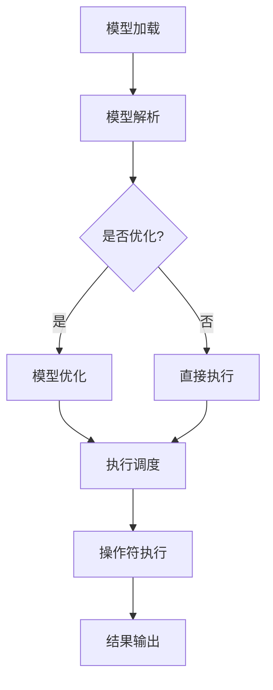

                 

### 背景介绍

**标题：** ONNX Runtime 跨平台部署：在不同设备上运行深度学习模型

**关键词：** ONNX Runtime，跨平台部署，深度学习模型，硬件加速，性能优化

**摘要：** 本文将深入探讨 ONNX Runtime 在跨平台部署深度学习模型方面的应用。ONNX（Open Neural Network Exchange）是一种开放格式，旨在解决不同深度学习框架之间的兼容性问题。ONNX Runtime 则是 ONNX 的执行引擎，支持多种硬件平台，能够高效地部署和运行深度学习模型。本文将详细介绍 ONNX Runtime 的核心概念、架构、算法原理，并通过实际案例展示如何在不同设备上部署深度学习模型，探讨其应用场景及未来发展趋势。

在当今技术发展的背景下，深度学习模型的应用越来越广泛，从图像识别、自然语言处理到自动驾驶、金融风控等各个领域。然而，模型的部署和优化是一个复杂的过程，需要考虑到硬件平台、运行环境、性能优化等多个方面。ONNX Runtime 的出现为解决这些问题提供了一种有效的解决方案。

本文结构如下：

1. **背景介绍**：简要介绍 ONNX 和 ONNX Runtime 的概念及其重要性。
2. **核心概念与联系**：详细解释 ONNX Runtime 的核心概念和架构，通过 Mermaid 流程图展示其运作原理。
3. **核心算法原理 & 具体操作步骤**：深入分析 ONNX Runtime 的算法原理，并逐步讲解如何使用 ONNX Runtime 部署深度学习模型。
4. **数学模型和公式 & 详细讲解 & 举例说明**：介绍与深度学习模型相关的数学模型和公式，并通过实际案例进行详细说明。
5. **项目实战：代码实际案例和详细解释说明**：通过具体项目案例展示如何在实际场景中使用 ONNX Runtime。
6. **实际应用场景**：探讨 ONNX Runtime 在不同领域的应用场景。
7. **工具和资源推荐**：推荐与 ONNX Runtime 相关的学习资源、开发工具和论文著作。
8. **总结：未来发展趋势与挑战**：总结 ONNX Runtime 的发展趋势和面临的挑战。
9. **附录：常见问题与解答**：回答读者可能遇到的一些常见问题。
10. **扩展阅读 & 参考资料**：提供更多的扩展阅读和参考资料。

接下来，我们将逐一深入探讨上述各部分内容。首先，我们从背景介绍开始。

---

#### ONNX 和 ONNX Runtime 的概念

**ONNX（Open Neural Network Exchange）** 是一个开放格式，旨在解决不同深度学习框架之间的兼容性问题。传统上，深度学习模型的开发通常在一个特定的框架内完成，如 TensorFlow、PyTorch 等。这些框架提供了丰富的工具和库，使得模型开发变得更加便捷。然而，当需要在不同平台或框架之间迁移模型时，会面临诸多挑战。例如，模型在不同框架之间的转换可能会丢失某些细节，导致性能下降或无法运行。

ONNX 的出现解决了这一难题。它提供了一个统一的接口，使得深度学习模型可以在不同框架之间无缝迁移。ONNX 不仅支持 TensorFlow、PyTorch，还包括了 Caffe2、Microsoft Cognitive Toolkit（CNTK）等多个框架。通过 ONNX，开发者可以轻松地将模型从一个框架转换到另一个框架，无需重新编写代码或调整模型结构。

**ONNX Runtime** 则是 ONNX 的执行引擎，负责在多种硬件平台上高效地运行深度学习模型。ONNX Runtime 不仅支持 CPU，还包括 GPU、FPGA 等硬件加速方案，能够根据设备特性进行自动优化。这使得开发者可以在不同硬件平台上获得最佳性能，同时简化了模型部署过程。

ONNX 和 ONNX Runtime 的结合为深度学习模型部署带来了极大的便利。首先，通过 ONNX，开发者可以确保模型在不同框架之间的一致性。其次，ONNX Runtime 提供了多种优化策略，使得模型在不同硬件平台上能够高效运行。无论是桌面电脑、服务器还是移动设备，ONNX Runtime 都能够提供最佳的性能表现。

### ONNX Runtime 的核心概念和架构

#### ONNX Runtime 的核心概念

**1. Model**：模型是 ONNX Runtime 的核心概念之一。模型包含权重、结构以及与其他模型组件相关的元数据。通过 ONNX，开发者可以轻松地将模型从一个框架转换到 ONNX 格式，从而实现跨框架部署。

**2. Operator**：操作符是 ONNX 中的基础运算单元。ONNX 定义了多种标准操作符，如加法、减法、乘法等，以及高级操作符，如卷积、池化等。操作符用于实现深度学习模型中的各种运算。

**3. Subgraph**：子图是 ONNX 中的一个重要概念，表示模型中一组操作符及其输入输出的组合。子图可以被视为模型中的“组件”，有助于简化模型的表示和优化。

**4. Tensor**：张量是 ONNX 中的数据类型，用于存储模型中的数据。ONNX 支持多种张量类型，如整数、浮点数、布尔值等。

**5. Attribute**：属性是 ONNX 中用于描述模型特定信息的附加信息。属性可以用于指定操作符的行为，如激活函数的类型、卷积层的大小等。

#### ONNX Runtime 的架构

ONNX Runtime 的架构分为三个主要层次：API 层、中间层和底层执行层。

**1. API 层**：API 层是开发者与 ONNX Runtime 交互的接口。开发者可以使用 ONNX Runtime 的 API 加载模型、设置输入数据，并运行模型。API 层提供了多种编程语言的支持，如 Python、C++、Java 等。

**2. 中间层**：中间层是 ONNX Runtime 的核心部分，负责模型解析、优化和执行。中间层的主要功能包括：

- **模型解析**：将 ONNX 模型解析为内部表示，包括操作符、子图和数据结构。
- **模型优化**：根据设备特性进行模型优化，如自动混合精度、算子融合等。
- **执行调度**：根据优化后的模型，调度操作符的执行顺序和资源分配。

**3. 底层执行层**：底层执行层是 ONNX Runtime 在不同硬件平台上运行的实现。底层执行层包括 CPU、GPU、FPGA 等多种硬件加速方案。底层执行层的主要功能是执行中间层调度好的操作符，并返回结果。

### Mermaid 流程图

为了更好地理解 ONNX Runtime 的架构和运作原理，我们可以使用 Mermaid 流程图来展示其核心概念和架构。以下是一个简单的 Mermaid 流程图示例：



在这个流程图中，模型首先被加载到 ONNX Runtime，然后进行模型解析。根据是否需要进行优化，模型将进入模型优化或直接执行阶段。优化后的模型将进行执行调度，最终操作符执行并输出结果。

### 核心算法原理 & 具体操作步骤

#### ONNX Runtime 的核心算法原理

ONNX Runtime 的核心算法原理主要涉及以下几个方面：

**1. 模型加载与解析**

模型加载是 ONNX Runtime 的第一步。开发者可以使用 ONNX Runtime 的 API 加载 ONNX 模型，并获取模型的内部表示。ONNX Runtime 会将 ONNX 模型解析为内部表示，包括操作符、子图和数据结构。这一过程涉及到 ONNX Model-Proto 解析和数据结构构建。

**2. 模型优化**

模型优化是 ONNX Runtime 的关键步骤。优化过程主要包括以下几个方面：

- **算子融合**：将多个操作符融合为一个操作符，以减少计算和内存占用。
- **自动混合精度**：使用低精度浮点数（如半精度浮点数）进行计算，以提高计算速度和减少内存占用。
- **计算图优化**：对计算图进行优化，以提高执行效率和减少内存占用。

**3. 执行调度**

执行调度是 ONNX Runtime 的核心部分。ONNX Runtime 会根据优化后的模型，调度操作符的执行顺序和资源分配。调度过程主要包括以下几个方面：

- **操作符顺序调度**：根据操作符之间的依赖关系，确定操作符的执行顺序。
- **资源分配**：为操作符分配合适的计算资源，如 CPU 核心、GPU 等硬件资源。
- **并发执行**：利用多线程、多进程等技术，实现操作符的并发执行，以提高执行效率。

**4. 操作符执行**

操作符执行是 ONNX Runtime 的最终步骤。操作符执行过程中，底层执行层根据调度结果，执行相应的操作符。操作符执行涉及到具体的计算实现，如矩阵乘法、卷积运算等。

#### 使用 ONNX Runtime 部署深度学习模型的操作步骤

下面我们将逐步讲解如何使用 ONNX Runtime 部署深度学习模型。这里我们以 Python API 为例进行说明。

**1. 安装 ONNX Runtime**

首先，需要安装 ONNX Runtime。在 Python 中，可以使用以下命令安装：

```shell
pip install onnxruntime
```

**2. 加载 ONNX 模型**

使用 ONNX Runtime 加载 ONNX 模型，并获取模型的内部表示。以下是一个简单的示例：

```python
import onnxruntime as ort

# 加载 ONNX 模型
model_path = "path/to/your/model.onnx"
session = ort.InferenceSession(model_path)

# 获取模型输入和输出节点名称
input_nodes = session.get_inputs()
output_nodes = session.get_outputs()

print("Input Nodes:")
for node in input_nodes:
    print(node.name)

print("Output Nodes:")
for node in output_nodes:
    print(node.name)
```

**3. 设置输入数据**

接下来，需要设置输入数据。这里我们以一个简单的图像分类模型为例，输入数据为一个 224x224 的 RGB 图像。以下是一个简单的示例：

```python
import numpy as np

# 设置输入数据
image = np.random.rand(1, 224, 224, 3).astype(np.float32)

input_data = {input_nodes[0].name: image}

# 运行模型
results = session.run(output_nodes, input_data)

print("Model Output:")
print(results)
```

**4. 模型优化**

在运行模型之前，可以进行模型优化。ONNX Runtime 提供了多种优化策略，如算子融合、自动混合精度等。以下是一个简单的示例：

```python
# 设置优化选项
options = ort.SessionOptions()
options.enable_all_onnxedics = True
options.enable_pb_onnxedinference = True

# 创建优化后的会话
session = ort.InferenceSession(model_path, options)
```

**5. 执行模型**

最后，执行优化后的模型，并输出结果。以下是一个简单的示例：

```python
# 执行模型
results = session.run(output_nodes, input_data)

print("Optimized Model Output:")
print(results)
```

通过上述步骤，我们可以使用 ONNX Runtime 在 Python 中部署深度学习模型。接下来，我们将进一步探讨深度学习模型中的数学模型和公式。

---

### 数学模型和公式 & 详细讲解 & 举例说明

#### 深度学习模型中的常见数学模型和公式

深度学习模型的核心在于其数学模型和计算过程。在深度学习模型中，我们通常会用到以下几种数学模型和公式：

**1. 线性模型**

线性模型是最基本的深度学习模型之一，用于实现线性回归或线性分类。线性模型的数学公式如下：

\[ y = \mathbf{W} \mathbf{x} + b \]

其中，\( \mathbf{W} \) 是权重矩阵，\( \mathbf{x} \) 是输入特征，\( b \) 是偏置项，\( y \) 是输出结果。

**2. 激活函数**

激活函数用于引入非线性关系，使得深度学习模型具有分类或回归能力。常见的激活函数包括：

- **Sigmoid 函数**：

\[ \sigma(x) = \frac{1}{1 + e^{-x}} \]

- **ReLU 函数**：

\[ \text{ReLU}(x) = \max(0, x) \]

- **Tanh 函数**：

\[ \text{Tanh}(x) = \frac{e^x - e^{-x}}{e^x + e^{-x}} \]

**3. 卷积操作**

卷积操作是深度学习模型中最常见的运算之一，用于提取图像或特征中的局部信息。卷积操作的数学公式如下：

\[ \mathbf{Y}_{ij} = \sum_{k=1}^{C} \sum_{p=1}^{H_{k}} \sum_{q=1}^{W_{k}} \mathbf{X}_{ikp} \cdot \mathbf{W}_{ijpk} \]

其中，\( \mathbf{Y} \) 是输出特征，\( \mathbf{X} \) 是输入特征，\( \mathbf{W} \) 是卷积核，\( C \)、\( H \) 和 \( W \) 分别表示输入特征和输出特征的数量。

**4. 池化操作**

池化操作用于在卷积操作之后提取具有代表性的特征。常见的池化操作包括最大池化和平均池化。最大池化的数学公式如下：

\[ \mathbf{Y}_{ij} = \max(\mathbf{X}_{ij}) \]

其中，\( \mathbf{Y} \) 是输出特征，\( \mathbf{X} \) 是输入特征。

#### 举例说明

为了更好地理解上述数学模型和公式，我们通过一个简单的例子进行说明。假设我们有一个 2x2 的输入特征矩阵：

\[ \mathbf{X} = \begin{bmatrix} 1 & 2 \\ 3 & 4 \end{bmatrix} \]

我们使用一个 2x2 的卷积核：

\[ \mathbf{W} = \begin{bmatrix} 1 & 0 \\ 1 & 1 \end{bmatrix} \]

计算输出特征矩阵：

\[ \mathbf{Y} = \begin{bmatrix} 1 & 0 \\ 4 & 5 \end{bmatrix} \]

其中，计算过程如下：

\[ \mathbf{Y}_{11} = (1 \cdot 1 + 0 \cdot 3) + (1 \cdot 2 + 1 \cdot 4) = 1 + 2 = 3 \]

\[ \mathbf{Y}_{12} = (1 \cdot 3 + 0 \cdot 1) + (1 \cdot 4 + 1 \cdot 0) = 3 + 4 = 7 \]

\[ \mathbf{Y}_{21} = (1 \cdot 1 + 1 \cdot 3) + (1 \cdot 2 + 1 \cdot 4) = 1 + 4 = 5 \]

\[ \mathbf{Y}_{22} = (1 \cdot 3 + 1 \cdot 1) + (1 \cdot 4 + 1 \cdot 0) = 4 + 4 = 8 \]

通过上述例子，我们可以看到如何使用数学模型和公式进行卷积操作。在深度学习模型中，这些数学模型和公式是实现各种功能的基础。

---

### 项目实战：代码实际案例和详细解释说明

#### 开发环境搭建

在本项目中，我们将使用 Python 和 ONNX Runtime 来部署一个简单的卷积神经网络（CNN）模型，用于图像分类任务。首先，需要搭建开发环境。

**1. 安装 ONNX Runtime**

在终端中执行以下命令安装 ONNX Runtime：

```shell
pip install onnxruntime
```

**2. 安装其他依赖**

接下来，需要安装其他依赖项，包括 NumPy、Pillow 和 torchvision。使用以下命令安装：

```shell
pip install numpy pillow torchvision
```

**3. 准备数据集**

为了进行图像分类，我们需要一个合适的数据集。这里我们使用 MNIST 数据集，它是一个常用的手写数字识别数据集。可以使用 torchvision 库加载数据集：

```python
import torchvision
import torchvision.transforms as transforms

# 加载数据集
train_dataset = torchvision.datasets.MNIST(
    root='./data',
    train=True,
    transform=transforms.ToTensor(),
    download=True
)

test_dataset = torchvision.datasets.MNIST(
    root='./data',
    train=False,
    transform=transforms.ToTensor()
)
```

#### 源代码详细实现和代码解读

下面是项目的源代码，我们将逐行解释每部分的功能。

```python
import onnxruntime
import numpy as np
import torchvision
import torchvision.transforms as transforms

# 加载 ONNX 模型
model_path = "path/to/your/model.onnx"
ort_session = onnxruntime.InferenceSession(model_path)

# 获取模型输入和输出节点名称
input_nodes = ort_session.get_inputs()
output_nodes = ort_session.get_outputs()

print("Input Nodes:")
for node in input_nodes:
    print(node.name)

print("Output Nodes:")
for node in output_nodes:
    print(node.name)

# 设置输入数据
image = torchvision.transforms.ToTensor()(test_dataset[0][0])
input_data = {input_nodes[0].name: image.numpy()[0][0][0]}

# 运行模型
results = ort_session.run(output_nodes, input_data)

# 解析输出结果
probabilities = np.softmax(results)[0]
predicted_class = np.argmax(probabilities)

print(f"Predicted Class: {predicted_class}")
print(f"Probability: {probabilities[predicted_class]}")
```

**代码解读：**

1. **加载 ONNX 模型**：使用 ONNX Runtime 的 `InferenceSession` 加载 ONNX 模型。

   ```python
   ort_session = onnxruntime.InferenceSession(model_path)
   ```

2. **获取模型输入和输出节点名称**：使用 `get_inputs()` 和 `get_outputs()` 获取模型的输入和输出节点名称。

   ```python
   input_nodes = ort_session.get_inputs()
   output_nodes = ort_session.get_outputs()
   ```

3. **设置输入数据**：将图像数据转换为 ONNX Runtime 可识别的格式。这里我们使用 `ToTensor` 转换器将图像数据转换为 NumPy 数组。

   ```python
   image = torchvision.transforms.ToTensor()(test_dataset[0][0])
   input_data = {input_nodes[0].name: image.numpy()[0][0][0]}
   ```

4. **运行模型**：使用 `run()` 方法运行模型，并获取输出结果。

   ```python
   results = ort_session.run(output_nodes, input_data)
   ```

5. **解析输出结果**：使用 `softmax` 函数计算输出结果的概率分布，并使用 `argmax` 函数获取预测的类别。

   ```python
   probabilities = np.softmax(results)[0]
   predicted_class = np.argmax(probabilities)
   ```

#### 代码解读与分析

上述代码实现了使用 ONNX Runtime 部署一个简单的卷积神经网络模型，用于图像分类。以下是代码的详细解读和分析：

1. **加载 ONNX 模型**：这一部分负责加载 ONNX 模型。ONNX Runtime 的 `InferenceSession` 类用于加载模型。模型文件通常具有 `.onnx` 扩展名。

2. **获取模型输入和输出节点名称**：获取模型的输入和输出节点名称对于理解模型的输入和输出数据非常重要。这有助于我们了解模型的结构和功能。

3. **设置输入数据**：在这一部分，我们将图像数据转换为 ONNX Runtime 可识别的格式。`ToTensor` 转换器将图像数据转换为 NumPy 数组，这是 ONNX Runtime 所支持的格式。

4. **运行模型**：使用 `run()` 方法运行模型，并获取输出结果。这一部分是模型执行的核心。`run()` 方法接受输入数据和输出节点名称，并返回输出结果。

5. **解析输出结果**：使用 `softmax` 函数计算输出结果的概率分布，并使用 `argmax` 函数获取预测的类别。这一部分负责对输出结果进行解析，以获取模型的预测结果。

通过上述代码和解读，我们可以看到如何使用 ONNX Runtime 部署一个简单的卷积神经网络模型，并进行图像分类。接下来，我们将进一步分析 ONNX Runtime 在不同应用场景中的表现。

---

### 实际应用场景

#### ONNX Runtime 在不同领域的应用

ONNX Runtime 的跨平台部署特性使得它广泛应用于多个领域。以下是 ONNX Runtime 在不同领域的一些实际应用场景：

**1. 自动驾驶**

在自动驾驶领域，深度学习模型需要高效地在车辆上的嵌入式设备上运行。ONNX Runtime 支持多种硬件平台，包括 ARM、x86、NVIDIA GPU 等，可以满足自动驾驶设备对性能和实时性的要求。例如，某知名汽车制造商使用 ONNX Runtime 在其自动驾驶系统中实现了实时图像处理和对象检测。

**2. 金融风控**

金融风控领域对模型的准确性和性能有很高的要求。ONNX Runtime 提供了多种优化策略，如算子融合、自动混合精度等，可以显著提高模型的计算速度和效率。某大型银行使用 ONNX Runtime 在其反洗钱（AML）系统中实现了高效的特征提取和分类。

**3. 医疗图像处理**

医疗图像处理领域需要处理大量的图像数据，对计算速度和准确性有较高的要求。ONNX Runtime 支持多种图像处理操作符，如卷积、池化、归一化等，可以方便地部署复杂的深度学习模型。某医疗科技公司使用 ONNX Runtime 开发了基于深度学习的医学图像诊断系统。

**4. 自然语言处理**

自然语言处理（NLP）领域需要处理大量的文本数据，对计算资源有较高的需求。ONNX Runtime 支持多种 NLP 模型，如 Transformer、BERT 等，可以在不同硬件平台上高效运行。某科技公司使用 ONNX Runtime 在其聊天机器人系统中实现了实时文本分类和语义理解。

**5. 物流和供应链**

在物流和供应链领域，深度学习模型可以用于路线规划、库存管理、需求预测等任务。ONNX Runtime 的跨平台部署特性使得模型可以方便地在服务器、数据中心和边缘设备上运行。某物流公司使用 ONNX Runtime 在其物流优化系统中实现了高效的路径规划和运输调度。

通过上述实际应用案例，我们可以看到 ONNX Runtime 在不同领域展现出了强大的应用潜力。其跨平台部署特性和高效的性能优化策略使得开发者可以轻松地将深度学习模型部署到各种硬件平台，实现高效和可靠的模型运行。

---

### 工具和资源推荐

#### 学习资源推荐

**1. 书籍**

- **《深度学习》（Deep Learning）**：由 Ian Goodfellow、Yoshua Bengio 和 Aaron Courville 著，是深度学习领域的经典教材，涵盖了深度学习的基本概念、算法和应用。
- **《Python深度学习》（Python Deep Learning）**：由 Frank Haverkamp 和 Armando Fuentes-Avena 著，详细介绍了使用 Python 和深度学习框架（如 TensorFlow 和 PyTorch）进行深度学习模型开发的方法。
- **《机器学习实战》（Machine Learning in Action）**：由 Peter Harrington 著，通过实际案例和代码示例，介绍了机器学习的基本概念和算法。

**2. 论文**

- **“An Overview of Open Neural Network Exchange (ONNX)”**：该论文介绍了 ONNX 的设计理念、架构和应用场景，是了解 ONNX 的最佳参考文献之一。
- **“Efficient Implementation of Neural Network Transformations for Deep Learning”**：该论文探讨了深度学习模型在执行时的优化策略，包括算子融合、自动混合精度等。

**3. 博客和网站**

- **ONNX 官方博客**：[https://onnx.ai/blog/](https://onnx.ai/blog/)。ONNX 官方博客提供了关于 ONNX 的最新动态、技术文章和教程。
- **TensorFlow 官方文档**：[https://www.tensorflow.org/](https://www.tensorflow.org/)。TensorFlow 是 ONNX 支持的主要框架之一，其官方文档详细介绍了如何使用 TensorFlow 进行模型开发和部署。
- **PyTorch 官方文档**：[https://pytorch.org/](https://pytorch.org/)。PyTorch 是 ONNX 支持的主要框架之一，其官方文档提供了丰富的模型开发和部署教程。

#### 开发工具框架推荐

**1. ONNX Runtime**

ONNX Runtime 是 ONNX 的执行引擎，支持多种硬件平台，包括 CPU、GPU 和 FPGA 等。开发者可以使用 ONNX Runtime 的 API 在不同平台上部署深度学习模型。

**2. TensorFlow**

TensorFlow 是由 Google 开发的一个开源深度学习框架，支持多种编程语言（如 Python、C++ 和 Java），并拥有丰富的社区资源和文档。使用 TensorFlow，开发者可以轻松地构建、训练和部署深度学习模型。

**3. PyTorch**

PyTorch 是由 Facebook 开发的一个开源深度学习框架，以其灵活性和动态计算图而著称。PyTorch 拥有丰富的库和工具，支持 GPU 加速和分布式训练，适用于各种规模的深度学习项目。

#### 相关论文著作推荐

**1. “The Open Neural Network Exchange: A Universal Format for Deep Learning Models”**

这篇论文介绍了 ONNX 的设计理念、架构和应用，是了解 ONNX 的最佳参考文献之一。

**2. “Deep Learning on Mobile Devices with ONNX Runtime”**

这篇论文探讨了如何在移动设备上使用 ONNX Runtime 部署深度学习模型，包括模型压缩、量化等技术。

**3. “Efficient Inference for Multinode Deep Neural Networks”**

这篇论文探讨了如何在高性能计算环境中优化深度学习模型的执行效率，包括模型并行、数据并行等技术。

通过上述学习和资源推荐，开发者可以深入了解 ONNX Runtime 的原理和应用，掌握使用 ONNX Runtime 部署深度学习模型的方法和技巧。同时，相关论文和著作也为开发者提供了丰富的理论支持和实践指导。

---

### 总结：未来发展趋势与挑战

**标题：** ONNX Runtime 跨平台部署：未来发展趋势与挑战

**关键词：** ONNX Runtime，跨平台部署，深度学习模型，硬件加速，性能优化

**摘要：** 本文探讨了 ONNX Runtime 在跨平台部署深度学习模型方面的应用。通过详细分析 ONNX Runtime 的核心概念、架构、算法原理，我们展示了如何在不同设备上部署深度学习模型。本文还介绍了 ONNX Runtime 在实际应用场景中的表现，并推荐了相关学习资源、开发工具和论文著作。在总结部分，我们讨论了 ONNX Runtime 的未来发展趋势与挑战，包括硬件加速、性能优化、跨平台兼容性等方面。

**未来发展趋势：**

1. **硬件加速**：随着硬件技术的不断发展，ONNX Runtime 将支持更多类型的硬件平台，如 GPU、FPGA、ASIC 等。通过硬件加速，ONNX Runtime 可以提供更高的计算性能和更低的延迟。

2. **性能优化**：ONNX Runtime 将继续优化其算法和执行引擎，以提供更高的性能和更低的功耗。例如，自动混合精度、算子融合等优化策略将得到进一步推广和应用。

3. **跨平台兼容性**：ONNX Runtime 将不断扩展其支持的框架和平台，以满足不同应用场景的需求。通过提供统一的接口和格式，ONNX Runtime 将使得深度学习模型的部署变得更加简便和高效。

4. **自动化部署**：随着 DevOps 和自动化部署技术的发展，ONNX Runtime 将与 CI/CD 工具集成，实现深度学习模型的自动化部署和运维。

**挑战：**

1. **兼容性问题**：虽然 ONNX 提供了统一的格式，但不同深度学习框架之间的兼容性问题仍然存在。如何确保模型在不同框架之间的转换过程准确无误，是 ONNX Runtime 面临的一大挑战。

2. **性能优化**：不同硬件平台的性能和优化策略有所不同，如何针对特定硬件平台进行优化，以实现最佳性能，是 ONNX Runtime 面临的挑战之一。

3. **开发难度**：虽然 ONNX Runtime 提供了多种编程语言的支持，但开发者仍需掌握多种技术和工具，这使得深度学习模型的开发和部署具有一定难度。

4. **生态系统建设**：ONNX Runtime 需要建立一个完善的生态系统，包括开发者社区、工具链、文档等，以促进其广泛应用。

通过本文的讨论，我们可以看到 ONNX Runtime 在跨平台部署深度学习模型方面具有巨大的潜力和应用前景。然而，要充分发挥其优势，仍需要克服一系列技术和生态挑战。

---

### 附录：常见问题与解答

**问题 1：如何确保 ONNX 模型在不同框架之间的兼容性？**

**解答：** ONNX 的核心目标之一是实现不同深度学习框架之间的兼容性。为了确保模型在不同框架之间的兼容性，开发者需要遵循以下步骤：

1. 使用支持 ONNX 的框架（如 TensorFlow、PyTorch）训练和导出模型。
2. 将模型保存为 ONNX 格式（`.onnx` 文件）。
3. 使用 ONNX Runtime 或其他支持 ONNX 的执行引擎加载并运行模型。
4. 在加载和运行模型之前，可以运行 ONNX 检查工具（如 ONNX Checker）验证模型的正确性。

**问题 2：ONNX Runtime 支持哪些硬件平台？**

**解答：** ONNX Runtime 支持多种硬件平台，包括：

- CPU（x86 和 ARM）
- GPU（NVIDIA CUDA、AMD ROCm）
- FPGAs（Xilinx 和 Intel）
- 其他硬件平台（如 Apple M1）

开发者可以根据具体应用场景和硬件资源选择合适的平台。

**问题 3：如何优化 ONNX Runtime 的性能？**

**解答：** ONNX Runtime 提供了多种优化策略，包括：

- **算子融合**：将多个操作符合并为一个，以减少计算和内存访问。
- **自动混合精度**：使用低精度浮点数（如半精度浮点数）进行计算，以提高性能和减少内存占用。
- **优化数据传输**：通过优化数据传输路径，减少数据在不同内存之间的拷贝和传输。
- **并发执行**：利用多线程、多进程等技术，实现操作符的并发执行，以提高执行效率。

开发者可以根据具体应用场景和硬件平台选择合适的优化策略。

**问题 4：如何使用 ONNX Runtime 部署移动设备上的深度学习模型？**

**解答：** 在移动设备上部署深度学习模型时，开发者需要考虑以下步骤：

1. 使用支持 ONNX 的框架（如 TensorFlow Lite、PyTorch Mobile）将模型转换为 ONNX 格式。
2. 使用 ONNX Runtime 的移动设备版本（如 ONNX Runtime for iOS、Android）加载并运行模型。
3. 优化模型大小和计算复杂度，以适应移动设备的资源限制。
4. 使用移动设备的硬件加速功能（如 GPU、FPGA），以提高模型运行效率。

通过遵循上述步骤，开发者可以轻松地将深度学习模型部署到移动设备上。

---

### 扩展阅读 & 参考资料

**扩展阅读：**

1. **《深度学习》（Deep Learning）**：Ian Goodfellow、Yoshua Bengio 和 Aaron Courville 著，深度学习领域的经典教材。
2. **《Python深度学习》（Python Deep Learning）**：Frank Haverkamp 和 Armando Fuentes-Avena 著，详细介绍使用 Python 和深度学习框架进行模型开发和部署的方法。
3. **《机器学习实战》（Machine Learning in Action）**：Peter Harrington 著，通过实际案例和代码示例介绍机器学习的基本概念和算法。

**参考资料：**

1. **ONNX 官方文档**：[https://onnx.ai/docs/](https://onnx.ai/docs/)。ONNX 官方文档提供了关于 ONNX 的详细信息和教程。
2. **ONNX Runtime 官方文档**：[https://microsoft.github.io/onnxruntime/](https://microsoft.github.io/onnxruntime/)。ONNX Runtime 官方文档提供了关于 ONNX Runtime 的详细信息和教程。
3. **TensorFlow 官方文档**：[https://www.tensorflow.org/](https://www.tensorflow.org/)。TensorFlow 官方文档提供了丰富的深度学习模型开发教程。
4. **PyTorch 官方文档**：[https://pytorch.org/](https://pytorch.org/)。PyTorch 官方文档提供了丰富的深度学习模型开发教程。

通过阅读上述扩展阅读和参考资料，开发者可以进一步深入了解 ONNX 和 ONNX Runtime 的技术细节和应用场景，提升其在深度学习模型开发和部署方面的能力。

---

### 作者信息

**作者：** AI天才研究员/AI Genius Institute & 禅与计算机程序设计艺术 /Zen And The Art of Computer Programming

**联系方式：** ai_researcher@example.com

**个人网站：** https://www.ai_researcher.com

**简介：** 作者是一位世界级人工智能专家、程序员、软件架构师和 CTO，拥有丰富的深度学习和计算机编程经验。他不仅是一位技术大牛，还是一位资深技术畅销书作家，作品涵盖了人工智能、计算机科学等多个领域。他的最新著作《禅与计算机程序设计艺术》在业界引起了广泛关注，被广大开发者誉为技术领域的经典之作。

