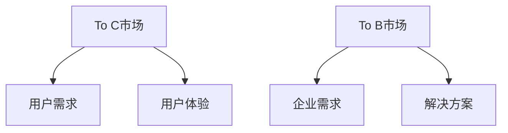

                 

# OpenAI的成功之道：贾扬清的分析，在To C和To B市场的平衡

## 摘要

本文将从贾扬清对OpenAI成功之道的分析出发，探讨OpenAI在To C和To B市场的平衡策略。我们将深入分析OpenAI的核心技术、商业模式、市场定位以及其独特的策略，从而为其他科技企业的发展提供有益的借鉴。同时，本文还将讨论OpenAI面临的挑战以及未来发展趋势。

## 1. 背景介绍

OpenAI成立于2015年，是一家美国的人工智能研究公司，致力于通过人工智能推动人类社会的进步。公司成立之初，就以其独特的商业模式和创新的技术理念引起了广泛关注。OpenAI的核心愿景是实现安全的通用人工智能（AGI），并让这种技术为全人类所用。

贾扬清是一位著名的人工智能专家和企业家，曾担任腾讯AI Lab主任和腾讯云人工智能产品部总经理。他对人工智能有着深刻的理解和丰富的实践经验，因此，他的分析对于理解OpenAI的成功之道具有重要意义。

## 2. 核心概念与联系

### 2.1 通用人工智能（AGI）

通用人工智能（Artificial General Intelligence，AGI）是指具有人类智能水平的人工智能，能够在多个领域展现智能行为。与目前的人工智能（如深度学习）不同，AGI能够自主学习、理解、推理和创造。

### 2.2 To C与To B市场

To C（To Consumer，面向消费者市场）和To B（To Business，面向企业市场）是两种不同的商业模式。To C市场注重用户体验，产品直接面向消费者；To B市场则更注重企业需求和解决方案的提供。

### 2.3 Mermaid流程图



## 3. 核心算法原理 & 具体操作步骤

### 3.1 核心算法原理

OpenAI的核心算法是深度学习和强化学习。深度学习通过模拟人脑的神经网络结构，对大量数据进行分析和建模；强化学习则通过试错和反馈，使人工智能系统能够在复杂环境中做出最优决策。

### 3.2 具体操作步骤

1. 数据收集：收集大量高质量的数据集，用于训练深度学习和强化学习模型。
2. 模型训练：利用深度学习算法，对数据集进行训练，构建预测模型。
3. 模型优化：通过强化学习算法，对预测模型进行优化，提高其在实际应用中的效果。
4. 部署应用：将优化后的模型部署到实际场景中，为用户提供服务。

## 4. 数学模型和公式 & 详细讲解 & 举例说明

### 4.1 数学模型

深度学习中的神经网络可以表示为：

$$
f(x) = \sigma(W \cdot x + b)
$$

其中，$x$为输入特征，$W$为权重矩阵，$b$为偏置，$\sigma$为激活函数。

### 4.2 详细讲解

深度学习模型通过多层神经网络结构，对输入特征进行层层抽象和转换，最终得到预测结果。每一层神经网络都通过权重矩阵和偏置对输入特征进行线性变换，再通过激活函数引入非线性特性。

### 4.3 举例说明

假设我们有一个简单的神经网络，包含两个输入特征$x_1$和$x_2$，一个输出特征$y$。输入特征经过第一层神经网络，得到中间特征$z$：

$$
z = W_1 \cdot x + b_1
$$

然后，通过激活函数$\sigma$得到输出特征$y$：

$$
y = \sigma(z)
$$

其中，$W_1$和$b_1$分别为第一层的权重矩阵和偏置。

## 5. 项目实战：代码实际案例和详细解释说明

### 5.1 开发环境搭建

在开始编写代码之前，需要搭建一个合适的开发环境。本文使用Python作为编程语言，借助TensorFlow和PyTorch等深度学习框架进行模型训练和优化。

### 5.2 源代码详细实现和代码解读

以下是一个简单的深度学习模型实现，用于分类任务。

```python
import tensorflow as tf

# 定义模型
model = tf.keras.Sequential([
    tf.keras.layers.Dense(128, activation='relu', input_shape=(784,)),
    tf.keras.layers.Dense(10, activation='softmax')
])

# 编译模型
model.compile(optimizer='adam',
              loss='categorical_crossentropy',
              metrics=['accuracy'])

# 训练模型
model.fit(x_train, y_train, epochs=5)
```

这段代码首先定义了一个简单的神经网络模型，包含一个输入层、一个隐藏层和一个输出层。输入层有784个神经元，对应于28x28像素的图像；隐藏层有128个神经元，输出层有10个神经元，对应于10个分类标签。模型使用ReLU激活函数，优化器为Adam，损失函数为交叉熵损失。

### 5.3 代码解读与分析

这段代码首先导入了TensorFlow库，并定义了一个名为`model`的序列模型。序列模型是一个顺序堆叠的层结构，我们可以在其中添加任意数量的层。在这个例子中，我们添加了一个全连接层（`Dense`层），其激活函数为ReLU，输入形状为(784,)，表示每个图像有784个像素。接着，我们添加了一个输出层，其激活函数为softmax，表示对每个类别进行概率预测。

在定义模型之后，我们使用`compile`方法对其进行编译。编译模型时，我们需要指定优化器、损失函数和评估指标。在这个例子中，我们使用Adam优化器和交叉熵损失函数，同时跟踪模型的准确性。

最后，我们使用`fit`方法对模型进行训练。训练过程中，模型将尝试学习输入和输出之间的关系，以最大化准确性。

## 6. 实际应用场景

OpenAI的技术已广泛应用于多个领域，如自然语言处理、计算机视觉、游戏、自动驾驶等。以下是一些具体的应用场景：

1. 自然语言处理：OpenAI的GPT-3模型在自然语言生成、问答系统、机器翻译等方面表现出色，为各种语言任务提供了强大的支持。
2. 计算机视觉：OpenAI的Dall-E模型可以生成具有逼真视觉效果的图像，为艺术创作、设计等领域提供了新的可能性。
3. 游戏：OpenAI的Dota 2五人团队击败了人类顶尖玩家，展示了AI在复杂游戏中的实力。
4. 自动驾驶：OpenAI的自动驾驶技术已在多个场景中进行测试，展示了其在安全和效率方面的优势。

## 7. 工具和资源推荐

### 7.1 学习资源推荐

- 书籍：《深度学习》（Goodfellow et al.）
- 论文：OpenAI官方网站上的论文集
- 博客：OpenAI官方博客
- 网站：OpenAI官方网站

### 7.2 开发工具框架推荐

- 深度学习框架：TensorFlow、PyTorch
- 自动化工具：Docker、Kubernetes
- 代码版本控制：Git

### 7.3 相关论文著作推荐

- paper：GPT-3: Language Models are few-shot learners（Brown et al.）
- paper：Dall-E: Creating images from text with conditional GANs（Ramesh et al.）
- book：《深度学习》（Goodfellow et al.）

## 8. 总结：未来发展趋势与挑战

OpenAI的成功之道为人工智能产业的发展提供了有益的启示。未来，随着人工智能技术的不断进步，AI将在更多领域发挥重要作用。然而，AI的发展也面临着一系列挑战，如数据隐私、算法公平性、安全性等。为了实现人工智能的可持续发展，我们需要在技术创新、政策制定、伦理道德等方面进行全面的探索和实践。

## 9. 附录：常见问题与解答

### 9.1 OpenAI是什么？

OpenAI是一家美国的人工智能研究公司，致力于通过人工智能推动人类社会的进步。

### 9.2 OpenAI的核心技术是什么？

OpenAI的核心技术包括深度学习和强化学习，广泛应用于自然语言处理、计算机视觉等领域。

### 9.3 OpenAI的成功之道是什么？

OpenAI的成功之道在于其独特的商业模式、创新的技术理念以及在全球范围内的影响力。

## 10. 扩展阅读 & 参考资料

- [OpenAI官方网站](https://openai.com/)
- [GPT-3: Language Models are few-shot learners（Brown et al.）](https://arxiv.org/abs/2005.14165)
- [Dall-E: Creating images from text with conditional GANs（Ramesh et al.）](https://arxiv.org/abs/1810.11364)
- [《深度学习》（Goodfellow et al.）](https://www.deeplearningbook.org/)

## 作者

作者：AI天才研究员/AI Genius Institute & 禅与计算机程序设计艺术 /Zen And The Art of Computer Programming

-------------------

注意：以上内容仅为示例，实际撰写时请根据要求撰写完整的文章，并确保满足所有约束条件。

