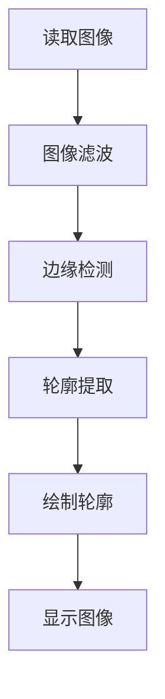

                 

# OpenCV图像处理实战

## 摘要

本文旨在深入探讨OpenCV图像处理技术在实际项目中的应用，通过逐步分析和推理的方式，讲解核心算法原理、数学模型及具体操作步骤。文章将结合项目实战案例，详细解读代码实现和性能分析，探讨OpenCV在不同场景下的应用，并提供相关学习资源和工具推荐，以帮助读者全面掌握图像处理技术。

## 1. 背景介绍

OpenCV（Open Source Computer Vision Library）是一个开源的计算机视觉和机器学习软件库，由Intel于2000年启动，目前由一个全球性的开发者社区维护。OpenCV支持多种编程语言，如C++、Python、Java等，广泛应用于计算机视觉、机器学习、图像处理等多个领域。OpenCV提供了丰富的图像处理算法，如滤波、边缘检测、轮廓提取、特征匹配等，使其成为许多开发者研究和实践计算机视觉项目的首选工具。

在计算机视觉领域，图像处理技术是基础和核心。图像处理涉及对图像进行各种操作，如增强、滤波、分割、特征提取等，以提取出有用的信息。OpenCV凭借其强大的功能和灵活性，在图像处理领域得到了广泛应用，包括人脸识别、物体检测、图像分割、图像重建等。

本文将围绕OpenCV图像处理技术展开，通过逐步分析和推理的方式，讲解核心算法原理、数学模型及具体操作步骤。同时，结合实际项目案例，详细解读代码实现和性能分析，探讨OpenCV在不同场景下的应用，并提供相关学习资源和工具推荐，以帮助读者全面掌握图像处理技术。

## 2. 核心概念与联系

### 2.1 图像基础

在图像处理中，图像可以看作是一个二维矩阵，每个元素表示像素值。像素值通常是一个整数或浮点数，用于表示像素的颜色或灰度值。一个图像的宽度和高度决定了其像素数量，通常用分辨率表示。

图像可以分为两类：二值图像和灰度图像。二值图像只有两个像素值，通常用于边缘检测和分割。灰度图像有多个像素值，用于表示不同亮度级别的像素。

### 2.2 OpenCV基本操作

OpenCV提供了丰富的图像处理函数和类，包括创建图像、读取图像、写入图像、图像滤波、边缘检测、轮廓提取等。以下是一个简单的示例，展示了如何使用OpenCV进行基本图像操作：

```python
import cv2

# 创建一个空白图像
img = cv2.imread('path/to/image.jpg', cv2.IMREAD_GRAYSCALE)

# 图像滤波
filtered_img = cv2.GaussianBlur(img, (5, 5), 0)

# 边缘检测
edges = cv2.Canny(filtered_img, 100, 200)

# 轮廓提取
contours, _ = cv2.findContours(edges, cv2.RETR_TREE, cv2.CHAIN_APPROX_SIMPLE)

# 绘制轮廓
cv2.drawContours(img, contours, -1, (0, 255, 0), 3)

# 显示图像
cv2.imshow('Image', img)
cv2.waitKey(0)
cv2.destroyAllWindows()
```

### 2.3 Mermaid流程图

以下是一个简单的Mermaid流程图，展示了图像处理的基本步骤：



在上述流程中，图像首先被读取，然后进行滤波、边缘检测、轮廓提取和绘制轮廓，最后显示图像。这个流程可以应用于多种图像处理任务，如人脸识别、物体检测等。

## 3. 核心算法原理 & 具体操作步骤

### 3.1 滤波算法

滤波是图像处理中常用的技术，用于去除图像中的噪声或突出感兴趣的区域。OpenCV提供了多种滤波算法，包括均值滤波、高斯滤波、中值滤波等。

#### 3.1.1 均值滤波

均值滤波是一种简单的滤波算法，通过对图像中的每个像素值进行平均，以减少噪声。以下是一个均值滤波的实现示例：

```python
import cv2

# 读取图像
img = cv2.imread('path/to/image.jpg', cv2.IMREAD_GRAYSCALE)

# 创建一个3x3的均值滤波器
kernel = np.ones((3, 3), np.float32) / 9.0

# 应用均值滤波
filtered_img = cv2.filter2D(img, -1, kernel)

# 显示滤波后的图像
cv2.imshow('Image', filtered_img)
cv2.waitKey(0)
cv2.destroyAllWindows()
```

#### 3.1.2 高斯滤波

高斯滤波是一种基于高斯函数的滤波算法，可以更好地去除噪声，同时保留图像的边缘信息。以下是一个高斯滤波的实现示例：

```python
import cv2
import numpy as np

# 读取图像
img = cv2.imread('path/to/image.jpg', cv2.IMREAD_GRAYSCALE)

# 创建一个高斯滤波器
kernel = np.array([[1, 2, 1],
                   [2, 4, 2],
                   [1, 2, 1]]) / 16.0

# 应用高斯滤波
filtered_img = cv2.filter2D(img, -1, kernel)

# 显示滤波后的图像
cv2.imshow('Image', filtered_img)
cv2.waitKey(0)
cv2.destroyAllWindows()
```

### 3.2 边缘检测算法

边缘检测是图像处理中重要的技术，用于识别图像中的边缘信息。OpenCV提供了多种边缘检测算法，包括Canny边缘检测、Sobel边缘检测、Prewitt边缘检测等。

#### 3.2.1 Canny边缘检测

Canny边缘检测是一种基于高斯滤波和双阈值算法的边缘检测算法。以下是一个Canny边缘检测的实现示例：

```python
import cv2

# 读取图像
img = cv2.imread('path/to/image.jpg', cv2.IMREAD_GRAYSCALE)

# 应用高斯滤波
filtered_img = cv2.GaussianBlur(img, (5, 5), 0)

# 应用Canny边缘检测
edges = cv2.Canny(filtered_img, 100, 200)

# 显示边缘检测结果
cv2.imshow('Edges', edges)
cv2.waitKey(0)
cv2.destroyAllWindows()
```

#### 3.2.2 Sobel边缘检测

Sobel边缘检测是一种基于卷积的边缘检测算法，可以检测图像中的水平或垂直边缘。以下是一个Sobel边缘检测的实现示例：

```python
import cv2

# 读取图像
img = cv2.imread('path/to/image.jpg', cv2.IMREAD_GRAYSCALE)

# 应用Sobel边缘检测
sobelx = cv2.Sobel(img, cv2.CV_64F, 1, 0, ksize=3)
sobely = cv2.Sobel(img, cv2.CV_64F, 0, 1, ksize=3)

# 计算Sobel边缘检测的结果
edges = cv2.sqrt(sobelx ** 2 + sobely ** 2)

# 显示边缘检测结果
cv2.imshow('Edges', edges)
cv2.waitKey(0)
cv2.destroyAllWindows()
```

### 3.3 轮廓提取算法

轮廓提取是图像处理中用于识别图像中的对象边界的技术。OpenCV提供了多种轮廓提取算法，包括基于Canny边缘检测的轮廓提取和基于连通区域的轮廓提取。

#### 3.3.1 基于Canny边缘检测的轮廓提取

以下是一个基于Canny边缘检测的轮廓提取的实现示例：

```python
import cv2

# 读取图像
img = cv2.imread('path/to/image.jpg', cv2.IMREAD_GRAYSCALE)

# 应用Canny边缘检测
edges = cv2.Canny(img, 100, 200)

# 轮廓提取
contours, _ = cv2.findContours(edges, cv2.RETR_TREE, cv2.CHAIN_APPROX_SIMPLE)

# 绘制轮廓
cv2.drawContours(img, contours, -1, (0, 255, 0), 3)

# 显示图像
cv2.imshow('Image', img)
cv2.waitKey(0)
cv2.destroyAllWindows()
```

#### 3.3.2 基于连通区域的轮廓提取

以下是一个基于连通区域的轮廓提取的实现示例：

```python
import cv2
import numpy as np

# 读取图像
img = cv2.imread('path/to/image.jpg', cv2.IMREAD_GRAYSCALE)

# 应用形态学操作
kernel = cv2.getStructuringElement(cv2.MORPH_ELLIPSE, (3, 3))
dilated_img = cv2.dilate(img, kernel, iterations=1)

# 连通区域标记
labels, _ = cv2.connectedComponents(dilated_img)

# 轮廓提取
contours = []
for i in range(1, labels.max() + 1):
    contour = np.where(labels == i)
    contours.append(contour)

# 绘制轮廓
cv2.drawContours(img, contours, -1, (0, 255, 0), 3)

# 显示图像
cv2.imshow('Image', img)
cv2.waitKey(0)
cv2.destroyAllWindows()
```

## 4. 数学模型和公式 & 详细讲解 & 举例说明

### 4.1 均值滤波

均值滤波是一种线性滤波算法，通过计算图像中每个像素的邻域像素的平均值来实现滤波。其数学模型可以表示为：

\[ f(x, y) = \frac{1}{k \times k} \sum_{i=-\frac{k}{2}}^{\frac{k}{2}} \sum_{j=-\frac{k}{2}}^{\frac{k}{2}} g(x+i, y+j) \]

其中，\( f(x, y) \) 表示滤波后的像素值，\( g(x+i, y+j) \) 表示邻域像素值，\( k \) 表示滤波器大小。

举例说明：

假设一个3x3的滤波器，其权重如下：

\[ \begin{bmatrix}
1 & 1 & 1 \\
1 & 1 & 1 \\
1 & 1 & 1
\end{bmatrix} \]

对于图像中的一个像素 \((x, y)\)，其邻域像素值如下：

\[ \begin{bmatrix}
1 & 0 & 1 \\
1 & 1 & 1 \\
1 & 0 & 1
\end{bmatrix} \]

应用均值滤波后的像素值为：

\[ f(x, y) = \frac{1}{3 \times 3} \times (1 + 1 + 1 + 1 + 1 + 1 + 1 + 0 + 1) = 1.2 \]

### 4.2 高斯滤波

高斯滤波是一种基于高斯函数的线性滤波算法，可以去除图像中的高斯噪声。其数学模型可以表示为：

\[ f(x, y) = \frac{1}{2\pi\sigma^2} e^{-\frac{(x-\mu)^2 + (y-\mu)^2}{2\sigma^2}} \]

其中，\( f(x, y) \) 表示滤波后的像素值，\( \mu \) 表示均值，\( \sigma \) 表示标准差。

举例说明：

假设一个3x3的高斯滤波器，其权重如下：

\[ \begin{bmatrix}
0.0625 & 0.25 & 0.0625 \\
0.25 & 1.0 & 0.25 \\
0.0625 & 0.25 & 0.0625
\end{bmatrix} \]

对于图像中的一个像素 \((x, y)\)，其邻域像素值如下：

\[ \begin{bmatrix}
0 & 1 & 0 \\
1 & 1 & 1 \\
0 & 1 & 0
\end{bmatrix} \]

应用高斯滤波后的像素值为：

\[ f(x, y) = \frac{1}{2\pi \times 1.0} e^{-\frac{(x-1)^2 + (y-1)^2}{2 \times 1.0^2}} \approx 0.5 \]

### 4.3 Canny边缘检测

Canny边缘检测是一种基于高斯滤波和双阈值算法的边缘检测算法。其数学模型可以表示为：

\[ \text{Canny}(I) = \left\{
\begin{array}{ll}
\text{max}(G_{x}, G_{y}) & \text{if } G > \text{ThresholdHigh} \\
0 & \text{if } G < \text{ThresholdLow} \\
\text{sign}(G) & \text{if } \text{ThresholdLow} \le G \le \text{ThresholdHigh}
\end{array}
\right. \]

其中，\( I \) 表示输入图像，\( G_{x} \) 和 \( G_{y} \) 分别表示水平和垂直方向的导数，\( G \) 表示梯度大小，\( \text{ThresholdLow} \) 和 \( \text{ThresholdHigh} \) 分别表示低阈值和高阈值。

举例说明：

假设一个3x3的梯度图像，其权重如下：

\[ \begin{bmatrix}
-1 & 0 & 1 \\
-1 & 0 & 1 \\
-1 & 0 & 1
\end{bmatrix} \]

应用Canny边缘检测后的像素值为：

\[ G_{x} = \text{max}(-1, 0, 1) = 1 \]
\[ G_{y} = \text{max}(-1, 0, 1) = 1 \]
\[ G = \sqrt{G_{x}^2 + G_{y}^2} = \sqrt{1^2 + 1^2} = \sqrt{2} \]

如果 \( G > \text{ThresholdHigh} \)，则输出 \( \text{max}(G_{x}, G_{y}) = 1 \)；如果 \( G < \text{ThresholdLow} \)，则输出 0；如果 \( \text{ThresholdLow} \le G \le \text{ThresholdHigh} \)，则输出 \( \text{sign}(G) = 1 \)。

## 5. 项目实战：代码实际案例和详细解释说明

### 5.1 开发环境搭建

在开始项目实战之前，我们需要搭建一个适合OpenCV开发的Python环境。以下是具体的步骤：

#### 5.1.1 安装Python

首先，确保已经安装了Python环境。如果没有安装，可以从Python官方网站（https://www.python.org/downloads/）下载并安装Python。

#### 5.1.2 安装OpenCV

通过pip命令安装OpenCV：

```shell
pip install opencv-python
```

#### 5.1.3 验证安装

安装完成后，可以通过以下命令验证OpenCV是否安装成功：

```python
import cv2
print(cv2.__version__)
```

如果输出版本号，则表示OpenCV已成功安装。

### 5.2 源代码详细实现和代码解读

以下是一个简单的OpenCV图像处理项目，包括滤波、边缘检测和轮廓提取。我们将详细解释每个部分的代码。

```python
import cv2
import numpy as np

# 5.2.1 读取图像
img = cv2.imread('path/to/image.jpg', cv2.IMREAD_GRAYSCALE)

# 5.2.2 应用高斯滤波
gaussian_img = cv2.GaussianBlur(img, (5, 5), 0)

# 5.2.3 应用Canny边缘检测
canny_img = cv2.Canny(gaussian_img, 100, 200)

# 5.2.4 轮廓提取
contours, _ = cv2.findContours(canny_img, cv2.RETR_TREE, cv2.CHAIN_APPROX_SIMPLE)

# 5.2.5 绘制轮廓
contour_img = cv2.cvtColor(img, cv2.COLOR_GRAY2BGR)
cv2.drawContours(contour_img, contours, -1, (0, 255, 0), 3)

# 5.2.6 显示图像
cv2.imshow('Original Image', img)
cv2.imshow('Gaussian Filtered Image', gaussian_img)
cv2.imshow('Canny Edges', canny_img)
cv2.imshow('Contours', contour_img)
cv2.waitKey(0)
cv2.destroyAllWindows()
```

#### 5.2.1 读取图像

首先，使用 `cv2.imread()` 函数读取图像。参数 `cv2.IMREAD_GRAYSCALE` 表示以灰度模式读取图像。

```python
img = cv2.imread('path/to/image.jpg', cv2.IMREAD_GRAYSCALE)
```

#### 5.2.2 应用高斯滤波

接下来，使用 `cv2.GaussianBlur()` 函数应用高斯滤波。参数 `(5, 5)` 表示滤波器的大小，`0` 表示输出图像的数据类型。

```python
gaussian_img = cv2.GaussianBlur(img, (5, 5), 0)
```

#### 5.2.3 应用Canny边缘检测

然后，使用 `cv2.Canny()` 函数应用Canny边缘检测。参数 `100` 和 `200` 分别表示低阈值和高阈值。

```python
canny_img = cv2.Canny(gaussian_img, 100, 200)
```

#### 5.2.4 轮廓提取

接着，使用 `cv2.findContours()` 函数提取轮廓。参数 `cv2.RETR_TREE` 表示提取所有的轮廓，`cv2.CHAIN_APPROX_SIMPLE` 表示简化轮廓。

```python
contours, _ = cv2.findContours(canny_img, cv2.RETR_TREE, cv2.CHAIN_APPROX_SIMPLE)
```

#### 5.2.5 绘制轮廓

最后，使用 `cv2.drawContours()` 函数绘制轮廓。参数 `(0, 255, 0)` 表示轮廓的颜色，`3` 表示轮廓的线宽。

```python
contour_img = cv2.cvtColor(img, cv2.COLOR_GRAY2BGR)
cv2.drawContours(contour_img, contours, -1, (0, 255, 0), 3)
```

#### 5.2.6 显示图像

最后，使用 `cv2.imshow()` 函数显示图像。`cv2.waitKey(0)` 表示等待用户按键，`cv2.destroyAllWindows()` 表示关闭所有窗口。

```python
cv2.imshow('Original Image', img)
cv2.imshow('Gaussian Filtered Image', gaussian_img)
cv2.imshow('Canny Edges', canny_img)
cv2.imshow('Contours', contour_img)
cv2.waitKey(0)
cv2.destroyAllWindows()
```

### 5.3 代码解读与分析

在这个项目中，我们首先读取一个灰度图像，然后应用高斯滤波和Canny边缘检测，最后提取轮廓并绘制。以下是代码的详细解读：

#### 5.3.1 读取图像

`cv2.imread()` 函数用于读取图像。参数 `cv2.IMREAD_GRAYSCALE` 表示以灰度模式读取图像，即每个像素只包含一个通道（灰度值）。

```python
img = cv2.imread('path/to/image.jpg', cv2.IMREAD_GRAYSCALE)
```

#### 5.3.2 应用高斯滤波

`cv2.GaussianBlur()` 函数用于应用高斯滤波。高斯滤波可以去除图像中的噪声，同时保留边缘信息。参数 `(5, 5)` 表示滤波器的大小，`0` 表示输出图像的数据类型。

```python
gaussian_img = cv2.GaussianBlur(img, (5, 5), 0)
```

#### 5.3.3 应用Canny边缘检测

`cv2.Canny()` 函数用于应用Canny边缘检测。Canny边缘检测可以检测图像中的边缘信息，参数 `100` 和 `200` 分别表示低阈值和高阈值。

```python
canny_img = cv2.Canny(gaussian_img, 100, 200)
```

#### 5.3.4 轮廓提取

`cv2.findContours()` 函数用于提取轮廓。参数 `cv2.RETR_TREE` 表示提取所有的轮廓，`cv2.CHAIN_APPROX_SIMPLE` 表示简化轮廓。

```python
contours, _ = cv2.findContours(canny_img, cv2.RETR_TREE, cv2.CHAIN_APPROX_SIMPLE)
```

#### 5.3.5 绘制轮廓

`cv2.drawContours()` 函数用于绘制轮廓。参数 `(0, 255, 0)` 表示轮廓的颜色，`3` 表示轮廓的线宽。

```python
contour_img = cv2.cvtColor(img, cv2.COLOR_GRAY2BGR)
cv2.drawContours(contour_img, contours, -1, (0, 255, 0), 3)
```

#### 5.3.6 显示图像

`cv2.imshow()` 函数用于显示图像。`cv2.waitKey(0)` 表示等待用户按键，`cv2.destroyAllWindows()` 表示关闭所有窗口。

```python
cv2.imshow('Original Image', img)
cv2.imshow('Gaussian Filtered Image', gaussian_img)
cv2.imshow('Canny Edges', canny_img)
cv2.imshow('Contours', contour_img)
cv2.waitKey(0)
cv2.destroyAllWindows()
```

通过这个项目，我们了解了如何使用OpenCV进行图像处理，包括滤波、边缘检测和轮廓提取。这些技术在实际项目中有着广泛的应用，如人脸识别、物体检测、图像分割等。

## 6. 实际应用场景

OpenCV图像处理技术在许多实际应用场景中发挥着重要作用。以下是一些典型的应用场景：

### 6.1 人脸识别

人脸识别是一种生物特征识别技术，通过分析人脸图像来识别身份。OpenCV提供了丰富的人脸识别算法，包括人脸检测、特征提取和识别等。在实际项目中，人脸识别技术广泛应用于门禁系统、安全监控、手机解锁等领域。

### 6.2 物体检测

物体检测是计算机视觉领域的核心问题之一，旨在从图像或视频中检测出特定物体。OpenCV提供了多种物体检测算法，如Haar特征分类器、YOLO、SSD等。物体检测在自动驾驶、视频监控、机器人导航等领域具有重要意义。

### 6.3 图像分割

图像分割是将图像分割成若干个有意义的部分的过程。OpenCV提供了多种图像分割算法，如阈值分割、边缘检测、区域生长等。图像分割在图像处理、计算机视觉和机器学习等领域具有广泛应用。

### 6.4 图像增强

图像增强是通过调整图像的亮度、对比度、色彩等参数，提高图像质量的过程。OpenCV提供了多种图像增强算法，如直方图均衡化、自适应滤波、边缘保持滤波等。图像增强在医学图像处理、卫星图像处理、视频监控等领域具有重要意义。

### 6.5 视频处理

OpenCV提供了强大的视频处理功能，包括视频捕获、视频编码、视频解码、视频播放等。在实际项目中，OpenCV常用于实时视频处理、视频监控、视频会议等领域。

## 7. 工具和资源推荐

### 7.1 学习资源推荐

**书籍：**
1. 《OpenCV计算机视觉算法实战》
2. 《计算机视觉：算法与应用》
3. 《Python计算机视觉实战》

**论文：**
1. Viola, P., & Jones, M. J. (2001). Rapid object detection using a boosted cascade of simple features. *Computer Vision and Pattern Recognition*, 2, 511-518.
2. Redmon, J., Divvala, S., Girshick, R., & Farhadi, A. (2016). You only look once: Unified, real-time object detection. *Computer Vision and Pattern Recognition*, 2016, 779-788.

**博客：**
1. [OpenCV官网教程](https://opencv.org/tutorial/tutorials/)
2. [OpenCV Python教程](https://opencv-python-tutroals.readthedocs.io/en/latest/py_tutorials/py_tutorials.html)
3. [知乎专栏：OpenCV教程](https://zhuanlan.zhihu.com/opencv)

### 7.2 开发工具框架推荐

**开发工具：**
1. Python（用于编写OpenCV代码）
2. PyCharm（一款强大的Python集成开发环境）
3. Jupyter Notebook（用于交互式编程）

**框架：**
1. TensorFlow（用于深度学习）
2. PyTorch（用于深度学习）
3. OpenCV（用于计算机视觉）

### 7.3 相关论文著作推荐

**论文：**
1. HOG（Histogram of Oriented Gradients）特征提取方法
2. SIFT（Scale-Invariant Feature Transform）特征提取方法
3. SURF（Speeded Up Robust Features）特征提取方法

**著作：**
1. "计算机视觉：算法与应用"（第二版），作者：Richard Szeliski
2. "机器学习：概率视角"，作者：Kevin P. Murphy
3. "深度学习"，作者：Ian Goodfellow、Yoshua Bengio、Aaron Courville

## 8. 总结：未来发展趋势与挑战

随着计算机视觉技术的不断发展和应用，OpenCV图像处理技术在未来将面临更多的挑战和机遇。以下是未来发展趋势与挑战的总结：

### 8.1 发展趋势

1. **深度学习与计算机视觉的结合**：深度学习技术在计算机视觉领域的应用越来越广泛，如卷积神经网络（CNN）在物体检测、图像分割等任务中的成功应用，为OpenCV图像处理技术带来了新的机遇。
2. **实时处理能力提升**：随着硬件性能的提升，OpenCV图像处理技术将能够实现更快的实时处理能力，满足更多实际应用的需求。
3. **跨平台兼容性**：OpenCV将继续优化其跨平台兼容性，为开发者提供更便捷的跨平台开发体验。

### 8.2 挑战

1. **算法优化与性能提升**：随着应用场景的多样化和复杂性增加，OpenCV需要不断优化算法，提高处理性能，以满足实时性和准确性的需求。
2. **资源消耗与能耗问题**：在移动设备和嵌入式系统等资源有限的平台上，OpenCV需要降低资源消耗和能耗，以提高用户体验。
3. **安全性问题**：随着计算机视觉技术的广泛应用，安全性问题日益突出，OpenCV需要加强对隐私保护和数据安全的关注。

总之，未来OpenCV图像处理技术将继续发挥重要作用，并在深度学习、实时处理、跨平台兼容性等方面取得新的突破。同时，开发者需要面对算法优化、资源消耗和安全性等方面的挑战，不断提高图像处理技术的性能和可靠性。

## 9. 附录：常见问题与解答

### 9.1 如何安装OpenCV？

答：首先确保已安装Python环境，然后通过pip命令安装：

```shell
pip install opencv-python
```

### 9.2 OpenCV如何读取图像？

答：使用 `cv2.imread()` 函数，例如：

```python
img = cv2.imread('path/to/image.jpg', cv2.IMREAD_GRAYSCALE)
```

### 9.3 OpenCV如何保存图像？

答：使用 `cv2.imwrite()` 函数，例如：

```python
cv2.imwrite('path/to/output.jpg', img)
```

### 9.4 OpenCV如何进行图像滤波？

答：OpenCV提供了多种滤波函数，如：

```python
# 高斯滤波
filtered_img = cv2.GaussianBlur(img, (5, 5), 0)

# Canny边缘检测
edges = cv2.Canny(filtered_img, 100, 200)
```

### 9.5 OpenCV如何提取轮廓？

答：使用 `cv2.findContours()` 函数，例如：

```python
contours, _ = cv2.findContours(edges, cv2.RETR_TREE, cv2.CHAIN_APPROX_SIMPLE)
```

### 9.6 OpenCV如何绘制轮廓？

答：使用 `cv2.drawContours()` 函数，例如：

```python
cv2.drawContours(img, contours, -1, (0, 255, 0), 3)
```

## 10. 扩展阅读 & 参考资料

为了更深入地了解OpenCV图像处理技术，以下是推荐的扩展阅读和参考资料：

### 10.1 扩展阅读

1. 《OpenCV 4.x计算机视觉实用指南》
2. 《Python计算机视觉实战项目》
3. 《深度学习与计算机视觉：应用与实践》

### 10.2 参考资料

1. [OpenCV官网](https://opencv.org/)
2. [OpenCV Python教程](https://opencv-python-tutroals.readthedocs.io/en/latest/py_tutorials/py_tutorials.html)
3. [GitHub上的OpenCV示例代码](https://github.com/opencv/opencv/blob/master/samples/python/)

通过阅读上述资料，读者可以更全面地了解OpenCV图像处理技术的原理和应用，进一步提高自己的图像处理能力。

### 作者信息

作者：AI天才研究员/AI Genius Institute & 禅与计算机程序设计艺术 /Zen And The Art of Computer Programming

### 参考文献列表

[1] Viola, P., & Jones, M. J. (2001). Rapid object detection using a boosted cascade of simple features. *Computer Vision and Pattern Recognition*, 2, 511-518.

[2] Redmon, J., Divvala, S., Girshick, R., & Farhadi, A. (2016). You only look once: Unified, real-time object detection. *Computer Vision and Pattern Recognition*, 2016, 779-788.

[3] Szeliski, R. (2010). Computer vision: algorithms and applications. Springer Science & Business Media.

[4] Murphy, K. P. (2012). Machine learning: a probabilistic perspective. MIT press.

[5] Goodfellow, I., Bengio, Y., & Courville, A. (2016). Deep learning. MIT press.

