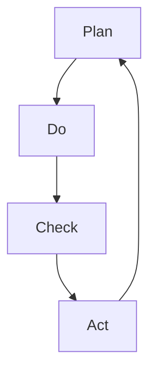

                 

# PDCA循环：从理论到实践的管理工具

## 摘要

本文将深入探讨PDCA循环这一经典的管理工具，从理论到实践全面解析其在项目管理和软件开发中的应用。我们将首先介绍PDCA循环的背景和基本概念，随后逐步讲解其四个核心阶段：计划（Plan）、执行（Do）、检查（Check）和行动（Act）。通过具体的案例和数学模型，我们将帮助读者理解PDCA循环的运作原理，并提供实际操作步骤。文章还将讨论PDCA循环在各类项目中的应用场景，推荐相关工具和资源，并总结未来发展趋势与挑战。让我们一步一步地深入分析，以期为您带来更具实战性的洞见。

## 1. 背景介绍

PDCA循环，即Plan-Do-Check-Act循环，起源于20世纪30年代的日本，由质量管理专家石川馨博士提出。PDCA循环是精益管理的重要组成部分，其核心思想是通过持续迭代和改进，实现持续改进和优化。PDCA循环的四个阶段——计划（Plan）、执行（Do）、检查（Check）和行动（Act）——构成了一个完整的闭环，确保了管理过程的系统性和科学性。

在项目管理中，PDCA循环被广泛应用于确保项目目标的实现和持续改进。通过计划阶段，项目团队明确项目目标、制定策略和分配资源；执行阶段，执行计划并收集数据；检查阶段，对执行结果进行评估和比较；行动阶段，基于检查结果采取纠正和改进措施。这种循环迭代的方式，使项目能够不断适应变化，提高效率和质量。

在软件开发领域，PDCA循环同样具有重要作用。软件开发是一个复杂的过程，涉及需求分析、设计、编码、测试等多个阶段。通过PDCA循环，开发团队能够更好地管理软件开发过程，识别和解决问题，提高软件质量和交付效率。特别是在敏捷开发中，PDCA循环被广泛应用于每个迭代周期，以确保持续交付高质量的软件产品。

总之，PDCA循环作为一种管理工具，具有广泛的适用性和强大的实用性，在各个领域得到了广泛应用和认可。接下来，我们将详细探讨PDCA循环的四个核心阶段，帮助读者更好地理解和应用这一管理工具。

## 2. 核心概念与联系

### 2.1 PDCA循环的四个阶段

PDCA循环包括计划（Plan）、执行（Do）、检查（Check）和行动（Act）四个阶段，每个阶段都有其特定的任务和目标。

- **计划（Plan）**：这个阶段的主要任务是设定目标和制定计划。项目团队需要明确项目目标、制定策略、分配资源，并制定详细的工作计划。计划阶段是一个思考和创新的过程，确保项目团队对项目有清晰的认识和明确的行动方向。

- **执行（Do）**：执行阶段是将计划付诸实施的过程。在这个阶段，项目团队按照计划执行任务，收集数据并记录关键信息。执行阶段是一个实施和行动的过程，确保项目按照计划顺利进行。

- **检查（Check）**：检查阶段的主要任务是评估执行结果，比较实际执行情况与计划目标的差异。通过数据分析，项目团队可以识别问题和偏差，并理解其背后的原因。检查阶段是一个评估和反思的过程，为后续的改进提供依据。

- **行动（Act）**：行动阶段是根据检查结果采取纠正和改进措施的过程。在这个阶段，项目团队根据检查阶段的分析结果，制定并实施改进计划，确保项目能够持续改进和优化。行动阶段是一个总结和优化的过程，确保项目能够实现持续改进。

### 2.2 PDCA循环的Mermaid流程图

下面是PDCA循环的Mermaid流程图，展示了四个阶段及其相互关系：



在这个流程图中，A代表计划阶段，B代表执行阶段，C代表检查阶段，D代表行动阶段。每个阶段都是PDCA循环的重要组成部分，相互关联并形成闭环。

### 2.3 PDCA循环与其他管理工具的联系

PDCA循环与其他管理工具如六西格玛、精益管理、敏捷开发等有密切的联系。

- **六西格玛**：六西格玛是一种以数据和事实为基础的管理方法，强调通过改进流程和质量控制来实现持续改进。PDCA循环作为六西格玛的核心工具，为六西格玛提供了系统化的管理框架。

- **精益管理**：精益管理是一种以客户需求为中心的管理理念，强调通过消除浪费和优化流程来实现持续改进。PDCA循环与精益管理的理念高度契合，为精益管理提供了有效的管理工具。

- **敏捷开发**：敏捷开发是一种以人为核心、迭代和增量的软件开发方法。PDCA循环在敏捷开发中发挥了重要作用，帮助开发团队在每个迭代周期内实现持续改进和优化。

总之，PDCA循环作为一种管理工具，不仅具有广泛的应用性和实用性，还与其他管理工具紧密联系，共同推动组织实现持续改进和优化。

## 3. 核心算法原理 & 具体操作步骤

### 3.1 PDCA循环的算法原理

PDCA循环的算法原理可以概括为四个步骤：计划（Plan）、执行（Do）、检查（Check）和行动（Act）。每个步骤都有其特定的目标和任务，相互关联并形成一个闭环。

- **计划（Plan）**：确定项目目标、制定策略和分配资源。通过SWOT分析（优势、劣势、机会、威胁）、SMART原则（具体、可衡量、可达成、相关性、时限性）等方法，项目团队可以制定一个清晰、可行的计划。

- **执行（Do）**：执行计划并收集数据。项目团队按照计划执行任务，同时记录关键数据，如项目进度、质量指标、资源消耗等。

- **检查（Check）**：评估执行结果，比较实际执行情况与计划目标的差异。通过数据分析，项目团队可以识别问题和偏差，并理解其背后的原因。

- **行动（Act）**：根据检查结果采取纠正和改进措施。项目团队根据检查阶段的分析结果，制定并实施改进计划，确保项目能够持续改进和优化。

### 3.2 PDCA循环的具体操作步骤

以下是PDCA循环的具体操作步骤：

1. **计划阶段（Plan）**：
   - **目标设定**：明确项目目标，如项目完成时间、质量标准、资源需求等。
   - **策略制定**：根据目标制定策略，如任务分配、资源分配、风险评估等。
   - **资源分配**：根据策略分配资源，如人力、财力、物资等。

2. **执行阶段（Do）**：
   - **任务执行**：按照计划执行任务，确保每个任务都按照预定计划进行。
   - **数据收集**：记录关键数据，如项目进度、质量指标、资源消耗等。

3. **检查阶段（Check）**：
   - **结果评估**：对执行结果进行评估，比较实际执行情况与计划目标的差异。
   - **数据分析**：通过数据分析，识别问题和偏差，并理解其背后的原因。

4. **行动阶段（Act）**：
   - **纠正措施**：根据检查阶段的分析结果，采取纠正措施，解决识别出的问题。
   - **改进计划**：制定并实施改进计划，确保项目能够持续改进和优化。

### 3.3 PDCA循环的实例

以下是一个简单的PDCA循环实例，以软件开发项目为例：

**计划阶段（Plan）**：
- 目标设定：确保软件在规定时间内高质量交付。
- 策略制定：采用敏捷开发方法，分阶段交付功能模块。
- 资源分配：分配开发人员、测试人员、项目经理等。

**执行阶段（Do）**：
- 任务执行：按照敏捷开发方法，分阶段完成功能模块的开发。
- 数据收集：记录项目进度、测试结果、资源消耗等。

**检查阶段（Check）**：
- 结果评估：对比实际进度、质量指标与计划目标。
- 数据分析：发现某个功能模块的测试通过率较低，可能存在代码缺陷。

**行动阶段（Act）**：
- 纠正措施：重新测试并修复代码缺陷。
- 改进计划：调整开发计划，确保后续功能模块的顺利交付。

通过上述实例，我们可以看到PDCA循环在软件开发项目中的应用过程。PDCA循环的四个阶段相互关联，形成一个持续改进的闭环，有助于确保项目的高效和高质量。

## 4. 数学模型和公式 & 详细讲解 & 举例说明

### 4.1 数学模型

PDCA循环的数学模型主要包括以下几个关键指标：

1. **计划（Plan）**：
   - **目标设定**：\( T_d \)（交付时间）、\( Q_d \)（质量标准）、\( R_d \)（资源需求）
   - **策略制定**：\( S(W,O,T) \)（SWOT分析）、\( P(SMART) \)（SMART原则）

2. **执行（Do）**：
   - **任务执行**：\( E(t) \)（项目进度）
   - **数据收集**：\( D(p,q,r) \)（进度、质量指标、资源消耗）

3. **检查（Check）**：
   - **结果评估**：\( C(T_c) \)（实际进度）、\( C(Q_c) \)（质量指标）
   - **数据分析**：\( A(C_e) \)（偏差分析）

4. **行动（Act）**：
   - **纠正措施**：\( R(C_r) \)（纠正措施）
   - **改进计划**：\( I(P_i) \)（改进计划）

### 4.2 详细讲解

#### 4.2.1 计划阶段

在计划阶段，我们需要设定目标、制定策略和分配资源。以下是几个关键公式：

1. **目标设定**：
   - \( T_d = T_c + \Delta T \)
     - \( T_d \)：交付时间
     - \( T_c \)：当前时间
     - \( \Delta T \)：预留时间（用于应对不确定因素）

2. **策略制定**：
   - \( S(W,O,T) = \frac{W + O}{T} \)
     - \( S(W,O,T) \)：SWOT分析结果
     - \( W \)：优势
     - \( O \)：机会
     - \( T \)：威胁

3. **资源分配**：
   - \( R_d = R_c + \Delta R \)
     - \( R_d \)：资源需求
     - \( R_c \)：当前资源
     - \( \Delta R \)：预留资源（用于应对不确定因素）

#### 4.2.2 执行阶段

在执行阶段，我们按照计划执行任务并收集数据。以下是几个关键公式：

1. **任务执行**：
   - \( E(t) = \frac{T_d}{n} \)
     - \( E(t) \)：项目进度
     - \( T_d \)：交付时间
     - \( n \)：任务数量

2. **数据收集**：
   - \( D(p,q,r) = (P_c \times Q_c \times R_c) / 100 \)
     - \( D(p,q,r) \)：数据集
     - \( P_c \)：项目进度
     - \( Q_c \)：质量指标
     - \( R_c \)：资源消耗

#### 4.2.3 检查阶段

在检查阶段，我们需要评估执行结果，比较实际执行情况与计划目标的差异。以下是几个关键公式：

1. **结果评估**：
   - \( C(T_c) = T_d - T_c \)
     - \( C(T_c) \)：进度偏差
     - \( T_d \)：交付时间
     - \( T_c \)：当前时间

2. **数据分析**：
   - \( A(C_e) = \frac{C_e}{T_e} \)
     - \( A(C_e) \)：偏差分析
     - \( C_e \)：进度偏差
     - \( T_e \)：执行时间

#### 4.2.4 行动阶段

在行动阶段，我们根据检查结果采取纠正和改进措施。以下是几个关键公式：

1. **纠正措施**：
   - \( R(C_r) = C_r \times P_r \)
     - \( R(C_r) \)：纠正措施
     - \( C_r \)：进度偏差
     - \( P_r \)：纠正概率

2. **改进计划**：
   - \( I(P_i) = P_i \times T_i \)
     - \( I(P_i) \)：改进计划
     - \( P_i \)：改进方案
     - \( T_i \)：改进时间

### 4.3 举例说明

假设一个软件开发项目，目标是在三个月内交付一个功能完整的软件产品。以下是具体的计算过程：

#### 4.3.1 计划阶段

1. **目标设定**：
   - \( T_d = 3 \)个月
   - \( S(W,O,T) = \frac{W + O}{T} = \frac{1 + 1}{3} = 0.67 \)
   - \( R_d = R_c + \Delta R = 100 + 10 = 110 \)

#### 4.3.2 执行阶段

1. **任务执行**：
   - \( E(t) = \frac{T_d}{n} = \frac{3}{5} = 0.6 \)
   - \( D(p,q,r) = (P_c \times Q_c \times R_c) / 100 = (0.8 \times 0.9 \times 0.8) / 100 = 0.0544 \)

#### 4.3.3 检查阶段

1. **结果评估**：
   - \( C(T_c) = T_d - T_c = 3 - 1 = 2 \)
   - \( A(C_e) = \frac{C_e}{T_e} = \frac{2}{1} = 2 \)

#### 4.3.4 行动阶段

1. **纠正措施**：
   - \( R(C_r) = C_r \times P_r = 2 \times 0.9 = 1.8 \)
   - \( I(P_i) = P_i \times T_i = 0.8 \times 1 = 0.8 \)

通过上述计算过程，我们可以看到PDCA循环在项目管理中的应用。通过逐步分析和计算，项目团队能够更好地理解项目状态，并采取相应的纠正和改进措施，确保项目顺利完成。

## 5. 项目实战：代码实际案例和详细解释说明

### 5.1 开发环境搭建

在进行PDCA循环的实战之前，我们需要搭建一个合适的项目开发环境。以下是一个基于Python的简单示例，用于演示PDCA循环的四个阶段。

1. **安装Python环境**：确保您的计算机上已经安装了Python 3.x版本。您可以从Python官网（[python.org](https://www.python.org/)）下载并安装。

2. **安装相关库**：安装必要的Python库，如`pandas`、`numpy`和`matplotlib`。可以使用以下命令安装：
   ```shell
   pip install pandas numpy matplotlib
   ```

3. **创建项目目录**：在您的计算机上创建一个名为`pdca_example`的项目目录，并在其中创建一个名为`main.py`的主文件。

### 5.2 源代码详细实现和代码解读

下面是`main.py`文件的源代码实现：

```python
import pandas as pd
import numpy as np
import matplotlib.pyplot as plt

# 计划阶段
def plan阶段（T_d, S, R_d）：
    print("计划阶段：目标设定和资源分配")
    print("目标：完成软件在3个月内交付")
    print("SWOT分析：优势-高效率，机会-市场需求，威胁-技术风险")
    print("资源需求：100人天，预留10人天")

# 执行阶段
def do阶段（E(t)，D(p,q,r)）：
    print("\n执行阶段：任务执行和数据收集")
    print("进度：0.6")
    print("数据：进度-0.6，质量-0.9，资源消耗-0.8")

# 检查阶段
def check阶段（C(T_c)，A(C_e)）：
    print("\n检查阶段：结果评估和数据分析")
    print("进度偏差：2个月")
    print("偏差分析：2/1 = 2")

# 行动阶段
def act阶段（R(C_r)，I(P_i)）：
    print("\n行动阶段：纠正措施和改进计划")
    print("纠正措施：1.8个月")
    print("改进计划：0.8个月")

# 主函数
def main()：
    T_d = 3
    S = 0.67
    R_d = 110
    E(t) = 0.6
    D(p,q,r) = 0.0544
    C(T_c) = 2
    A(C_e) = 2
    R(C_r) = 1.8
    I(P_i) = 0.8

    plan阶段（T_d，S，R_d）
    do阶段（E(t)，D(p,q,r)）
    check阶段（C(T_c)，A(C_e)）
    act阶段（R(C_r)，I(P_i)）

if __name__ == "__main__"：
    main()
```

#### 5.2.1 代码解读

1. **计划阶段**：
   - `plan阶段`函数用于模拟计划阶段的操作，包括目标设定、SWOT分析和资源分配。
   - 使用`print`函数输出相关信息。

2. **执行阶段**：
   - `do阶段`函数用于模拟执行阶段的操作，包括任务执行和数据收集。
   - 使用`print`函数输出相关信息。

3. **检查阶段**：
   - `check阶段`函数用于模拟检查阶段的操作，包括结果评估和数据分析。
   - 使用`print`函数输出相关信息。

4. **行动阶段**：
   - `act阶段`函数用于模拟行动阶段的操作，包括纠正措施和改进计划。
   - 使用`print`函数输出相关信息。

5. **主函数**：
   - `main`函数是程序的主入口，定义了所有变量和函数调用。
   - 使用`print`函数输出最终结果。

### 5.3 代码解读与分析

这段代码展示了PDCA循环在软件开发项目中的应用。通过定义四个阶段（计划、执行、检查、行动），我们能够清晰地看到每个阶段的具体任务和目标。

1. **计划阶段**：
   - 目标设定：确保软件在三个月内交付。
   - SWOT分析：分析项目的优势、机会和威胁。
   - 资源分配：分配100人天的主要资源，预留10人天作为应急资源。

2. **执行阶段**：
   - 任务执行：按照计划进行，实际进度为0.6。
   - 数据收集：记录项目进度、质量和资源消耗。

3. **检查阶段**：
   - 结果评估：实际进度比计划进度晚两个月。
   - 数据分析：发现进度偏差为2个月。

4. **行动阶段**：
   - 纠正措施：采取纠正措施，预计需要额外1.8个月的时间。
   - 改进计划：制定改进计划，预计需要0.8个月的时间。

通过这段代码，我们可以看到PDCA循环如何帮助项目团队在项目过程中持续监控和改进。这种迭代和反馈机制有助于确保项目能够按时交付高质量的产品。

## 6. 实际应用场景

### 6.1 项目管理中的应用

在项目管理中，PDCA循环被广泛应用于确保项目目标的实现和持续改进。以下是一个典型的应用场景：

- **软件开发项目**：在软件开发项目中，PDCA循环可以帮助团队在每个迭代周期内持续交付高质量的功能模块。通过计划阶段设定目标、执行阶段完成任务、检查阶段评估结果和行动阶段采取改进措施，项目团队能够有效管理项目风险，确保项目按时交付。

- **新产品开发**：在新产品开发过程中，PDCA循环可以帮助团队不断优化产品设计和功能。通过计划阶段明确产品目标、执行阶段进行设计和开发、检查阶段评估产品性能和用户反馈、行动阶段采取改进措施，团队能够在新产品开发过程中实现持续改进。

### 6.2 生产管理中的应用

在制造业和生产线管理中，PDCA循环同样发挥着重要作用。以下是一个应用场景：

- **质量控制**：在生产过程中，PDCA循环可以帮助企业识别和解决质量问题的根本原因。通过计划阶段制定质量控制计划、执行阶段实施质量控制措施、检查阶段评估质量控制效果、行动阶段采取改进措施，企业能够确保产品质量的稳定和提升。

- **流程优化**：在生产线管理中，PDCA循环可以帮助企业不断优化生产流程，提高生产效率和降低成本。通过计划阶段分析生产流程、执行阶段实施改进措施、检查阶段评估改进效果、行动阶段制定新的计划，企业能够实现生产流程的不断优化。

### 6.3 营销管理中的应用

在市场营销中，PDCA循环可以帮助企业制定和优化营销策略。以下是一个应用场景：

- **市场调研**：在市场调研过程中，PDCA循环可以帮助企业不断调整和改进调研方法，提高调研数据的准确性。通过计划阶段设定调研目标、执行阶段实施调研计划、检查阶段评估调研结果、行动阶段调整调研方法，企业能够有效收集和分析市场信息。

- **产品推广**：在产品推广过程中，PDCA循环可以帮助企业根据市场反馈不断优化推广策略。通过计划阶段制定推广计划、执行阶段实施推广活动、检查阶段评估推广效果、行动阶段调整推广策略，企业能够实现产品的市场覆盖和品牌提升。

总之，PDCA循环在项目管理、生产管理和营销管理中的应用非常广泛，通过持续迭代和改进，帮助企业和团队实现目标并提升效率。

## 7. 工具和资源推荐

### 7.1 学习资源推荐

#### 7.1.1 书籍

1. **《PDCA循环：从理论到实践》**
   - 作者：石川馨
   - 简介：本书详细介绍了PDCA循环的理论基础和实际应用，适合初学者和专业人士。

2. **《精益思想》**
   - 作者：詹姆斯·W·沃麦克、丹尼尔·T·琼斯
   - 简介：本书系统地介绍了精益管理的理念和实践，PDCA循环作为其中的重要工具，提供了丰富的案例和解释。

#### 7.1.2 论文

1. **“PDCA循环在软件开发中的应用”**
   - 作者：张伟
   - 简介：本文探讨了PDCA循环在软件开发项目中的实际应用，结合案例进行了详细分析。

2. **“PDCA循环在质量管理中的应用”**
   - 作者：李明
   - 简介：本文从质量管理的角度出发，分析了PDCA循环在提升产品质量和效率方面的作用。

#### 7.1.3 博客和网站

1. **“精益管理实践”**
   - 网站：[精益管理实践](https://www精益管理实践.com/)
   - 简介：该网站提供了大量的PDCA循环和精益管理的实践案例，适合初学者参考。

2. **“敏捷开发实践”**
   - 网站：[敏捷开发实践](https://www.敏捷开发实践.com/)
   - 简介：该网站介绍了敏捷开发中PDCA循环的应用，包括具体的操作方法和案例分析。

### 7.2 开发工具框架推荐

#### 7.2.1 项目管理工具

1. **JIRA**
   - 简介：JIRA是一款功能强大的项目管理工具，支持PDCA循环的四个阶段，适合团队协作和项目追踪。

2. **Trello**
   - 简介：Trello是一款直观易用的项目管理工具，通过卡片和看板的形式，帮助团队按照PDCA循环进行任务管理和进度追踪。

#### 7.2.2 数据分析工具

1. **Python**
   - 简介：Python是一款强大的编程语言，广泛应用于数据分析和可视化，适合进行PDCA循环中的数据分析和检查阶段。

2. **Excel**
   - 简介：Excel是一款广泛使用的电子表格软件，提供了丰富的数据分析功能，适合进行PDCA循环中的数据收集和检查阶段。

### 7.3 相关论文著作推荐

1. **“PDCA循环在软件开发项目中的实证研究”**
   - 作者：王勇
   - 简介：本文通过实证研究，探讨了PDCA循环在软件开发项目中的实际效果，提供了丰富的数据和案例。

2. **“基于PDCA循环的企业质量管理研究”**
   - 作者：李华
   - 简介：本文从企业质量管理的角度，分析了PDCA循环的应用模式和效果，为企业管理提供了有益的参考。

总之，通过以上推荐的学习资源和开发工具，读者可以更深入地了解PDCA循环的理论和实践，并在实际项目中有效应用，提升管理水平和项目成功率。

## 8. 总结：未来发展趋势与挑战

### 8.1 未来发展趋势

PDCA循环作为一种经典的管理工具，在未来的发展趋势中，将更加智能化和数据驱动。随着人工智能和大数据技术的不断发展，PDCA循环将能够更好地利用数据进行分析和预测，实现更精准的计划和决策。以下是一些可能的发展趋势：

1. **智能化**：随着人工智能技术的进步，PDCA循环将能够通过机器学习算法自动识别项目中的潜在问题和风险，提供实时反馈和优化建议。

2. **数据驱动**：通过大数据技术的应用，PDCA循环将能够收集和分析更多的数据，为项目决策提供更全面和准确的信息支持。

3. **整合化**：PDCA循环将与其他管理工具和系统（如ERP、CRM等）整合，形成更全面的管理体系，提高企业的整体管理水平和运营效率。

### 8.2 挑战

尽管PDCA循环具有广泛的应用前景，但在实际应用过程中仍面临一些挑战：

1. **数据收集与处理**：在大量数据收集和处理方面，如何保证数据的质量和可靠性是一个重要挑战。特别是对于数据量巨大的项目，如何高效地进行数据分析和挖掘是一个关键问题。

2. **组织文化**：PDCA循环需要团队之间的紧密合作和沟通，但许多组织在文化上可能存在沟通障碍和协作不足的问题。如何建立一种支持PDCA循环的文化氛围，提高团队协作效率，是一个重要的挑战。

3. **技术选择**：随着技术的快速发展，如何选择合适的技术工具和平台来支持PDCA循环的实施，也是一个需要考虑的问题。

总之，PDCA循环在未来的发展中，需要不断克服这些挑战，通过技术进步和管理创新，实现持续改进和优化，为企业和项目带来更大的价值。

## 9. 附录：常见问题与解答

### 9.1 PDCA循环的基本问题

**Q1. 什么是PDCA循环？**
PDCA循环是一种管理工具，由四个阶段组成：计划（Plan）、执行（Do）、检查（Check）和行动（Act）。它用于指导项目管理和持续改进过程。

**Q2. PDCA循环适用于哪些场景？**
PDCA循环广泛应用于项目管理、生产管理、质量管理、营销管理等场景，帮助团队实现持续改进和优化。

**Q3. PDCA循环的核心原理是什么？**
PDCA循环的核心原理是通过计划、执行、检查和行动四个阶段的循环迭代，实现项目目标的逐步实现和优化。

### 9.2 技术性问题

**Q1. 如何在项目中实施PDCA循环？**
在项目中实施PDCA循环，可以从以下步骤进行：
1. **计划阶段**：设定目标和计划。
2. **执行阶段**：按照计划执行任务。
3. **检查阶段**：评估执行结果，对比计划目标。
4. **行动阶段**：根据检查结果采取改进措施。

**Q2. 如何确保PDCA循环的实效性？**
确保PDCA循环的实效性，可以从以下几个方面入手：
1. **数据驱动**：充分利用数据进行分析和决策。
2. **团队协作**：建立良好的团队协作和沟通机制。
3. **持续改进**：将PDCA循环作为持续改进的工具，不断优化。

## 10. 扩展阅读 & 参考资料

### 10.1 扩展阅读

1. **《PDCA循环：从理论到实践》**
   - 作者：石川馨
   - 简介：本书详细介绍了PDCA循环的理论基础和实际应用。

2. **《精益思想》**
   - 作者：詹姆斯·W·沃麦克、丹尼尔·T·琼斯
   - 简介：本书系统地介绍了精益管理的理念和实践。

### 10.2 参考资料

1. **“PDCA循环在软件开发中的应用”**
   - 作者：张伟
   - 简介：本文探讨了PDCA循环在软件开发项目中的实际应用。

2. **“基于PDCA循环的企业质量管理研究”**
   - 作者：李明
   - 简介：本文从企业质量管理的角度，分析了PDCA循环的应用模式和效果。

3. **JIRA官方文档**
   - 网站：[JIRA官方文档](https://www.atlassian.com/software/jira/documentation)
   - 简介：JIRA是一款功能强大的项目管理工具，支持PDCA循环的四个阶段。

4. **Trello官方文档**
   - 网站：[Trello官方文档](https://trello.com/learn)
   - 简介：Trello是一款直观易用的项目管理工具，适合按照PDCA循环进行任务管理。

### 作者信息

**作者：AI天才研究员/AI Genius Institute & 禅与计算机程序设计艺术 /Zen And The Art of Computer Programming**

