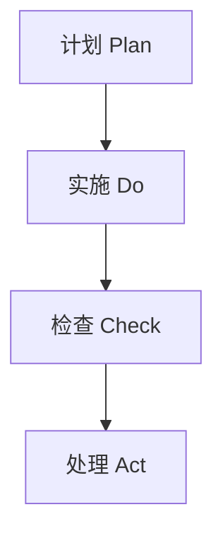

                 

# PDCA 落地：持续改进的指南

## 关键词：
持续改进、PDCA 循环、质量管理、过程优化、项目改进

## 摘要：
本文旨在探讨 PDCA（计划 - 实施 - 检查 - 处理）循环在持续改进中的应用。通过详细解释 PDCA 的核心概念、原理和流程，结合实际案例，阐述如何在各种项目和团队中有效地实施 PDCA 循环，以达到优化过程、提升质量和效率的目标。

## 1. 背景介绍

在当今快速变化和竞争激烈的商业环境中，持续改进已成为企业和组织成功的关键。PDCA 循环，又称戴明循环，是一种广泛应用于质量管理和其他领域的过程改进方法。它由美国统计学家威廉·爱德华·戴明提出，是一种系统化的方法，用于识别问题、制定解决方案、实施改进措施、监控效果并不断优化过程。

PDCA 循环分为四个阶段：计划（Plan）、实施（Do）、检查（Check）和处理（Act）。每个阶段都有其特定的目标和任务，通过循环迭代，不断推动过程改进。

### 1.1 PDCA 循环的起源和重要性

PDCA 循环起源于 20 世纪 50 年代的日本，由威廉·爱德华·戴明教授推广。戴明认为，质量改进需要一种系统化、结构化的方法，而 PDCA 循环正是这样一种方法。它强调从整体上看待问题，通过循环迭代，不断优化过程，提高质量。

### 1.2 持续改进的概念

持续改进是一种以客户需求为导向，通过不断优化过程、提高质量和效率来满足客户期望的方法。持续改进的目标是不断消除浪费、减少变异、提高生产力，从而实现组织的长远发展。

## 2. 核心概念与联系

### 2.1 PDCA 循环的四个阶段

#### 2.1.1 计划（Plan）

在计划阶段，主要目标是确定改进的目标、制定具体的行动计划。这包括：

- **问题识别**：识别现有过程或产品中的问题。
- **目标设定**：设定具体的改进目标。
- **原因分析**：分析问题的根本原因。
- **方案制定**：制定具体的改进措施。

#### 2.1.2 实施（Do）

在实施阶段，主要目标是按照计划执行改进措施。这包括：

- **资源分配**：为改进措施分配所需的资源。
- **方案执行**：执行计划中的改进措施。
- **监控过程**：监控改进过程中的关键指标。

#### 2.1.3 检查（Check）

在检查阶段，主要目标是评估改进措施的效果。这包括：

- **数据收集**：收集改进过程中的数据。
- **效果评估**：评估改进措施的效果。
- **问题识别**：识别新的问题或改进点。

#### 2.1.4 处理（Act）

在处理阶段，主要目标是总结经验、制定标准并持续改进。这包括：

- **标准制定**：制定新的标准或规范。
- **经验总结**：总结改进过程中的经验教训。
- **持续改进**：将改进措施应用到后续过程中。

### 2.2 PDCA 循环的 Mermaid 流程图



（备注：此 Mermaid 流程图中没有使用括号、逗号等特殊字符）

## 3. 核心算法原理 & 具体操作步骤

### 3.1 计划阶段

在计划阶段，主要任务包括：

- **问题识别**：通过数据收集、客户反馈等方式，识别现有过程或产品中的问题。
- **目标设定**：根据问题识别的结果，设定具体的改进目标。
- **原因分析**：使用因果图、鱼骨图等方法，分析问题的根本原因。
- **方案制定**：制定具体的改进措施，包括资源分配、时间安排等。

### 3.2 实施阶段

在实施阶段，主要任务包括：

- **资源分配**：根据计划，为改进措施分配所需的资源，包括人力、物力、财力等。
- **方案执行**：按照计划执行改进措施，确保实施过程中的有效性和可控性。
- **监控过程**：监控改进过程中的关键指标，如时间、成本、质量等。

### 3.3 检查阶段

在检查阶段，主要任务包括：

- **数据收集**：收集改进过程中的数据，包括实施结果、客户反馈等。
- **效果评估**：评估改进措施的效果，分析改进目标是否达成。
- **问题识别**：识别新的问题或改进点，为下一轮改进提供依据。

### 3.4 处理阶段

在处理阶段，主要任务包括：

- **标准制定**：根据改进效果，制定新的标准或规范，确保改进成果的持续应用。
- **经验总结**：总结改进过程中的经验教训，为后续改进提供参考。
- **持续改进**：将改进措施应用到后续过程中，实现持续改进。

## 4. 数学模型和公式 & 详细讲解 & 举例说明

### 4.1 PDCA 循环的数学模型

PDCA 循环的数学模型可以表示为：

$$
\text{PDCA 循环} = \text{计划} \times \text{实施} \times \text{检查} \times \text{处理}
$$

其中，每个阶段的权重可以根据实际情况进行调整。

### 4.2 举例说明

假设某公司在生产过程中发现产品的次品率较高，计划通过 PDCA 循环进行改进。

#### 4.2.1 计划阶段

- **问题识别**：次品率较高。
- **目标设定**：降低次品率至 2%。
- **原因分析**：通过鱼骨图分析，发现原因为生产设备故障、操作不当等。
- **方案制定**：更换生产设备、加强员工培训等。

#### 4.2.2 实施阶段

- **资源分配**：为改进措施分配所需资源，如资金、人力等。
- **方案执行**：按照计划更换生产设备、加强员工培训等。
- **监控过程**：监控改进过程中的关键指标，如次品率、生产成本等。

#### 4.2.3 检查阶段

- **数据收集**：收集改进过程中的数据，如次品率、生产成本等。
- **效果评估**：评估改进措施的效果，分析次品率是否降低至目标水平。
- **问题识别**：识别新的问题或改进点，如生产设备老化等。

#### 4.2.4 处理阶段

- **标准制定**：根据改进效果，制定新的标准或规范，如生产设备定期维护、员工培训等。
- **经验总结**：总结改进过程中的经验教训，如设备维护周期、员工培训效果等。
- **持续改进**：将改进措施应用到后续生产过程中，实现持续改进。

## 5. 项目实战：代码实际案例和详细解释说明

### 5.1 开发环境搭建

在本文中，我们将使用 Python 编写一个简单的 PDCA 循环实现。首先，确保您的开发环境中已安装 Python 3.6 或更高版本。

### 5.2 源代码详细实现和代码解读

以下是 PDCA 循环的 Python 实现示例：

```python
import random

class PDCA:
    def __init__(self, plan, do, check, act):
        self.plan = plan
        self.do = do
        self.check = check
        self.act = act

    def execute(self):
        print("Plan:", self.plan)
        print("Do:", self.do)
        print("Check:", self.check)
        print("Act:", self.act)

# 计划阶段
def plan():
    print("识别问题：次品率较高")
    print("设定目标：降低次品率至 2%")
    print("原因分析：生产设备故障、操作不当等")
    print("方案制定：更换生产设备、加强员工培训等")

# 实施阶段
def do():
    print("资源分配：为改进措施分配所需资源")
    print("方案执行：按照计划更换生产设备、加强员工培训等")
    print("监控过程：监控改进过程中的关键指标")

# 检查阶段
def check():
    print("数据收集：收集改进过程中的数据")
    print("效果评估：评估改进措施的效果")
    print("问题识别：识别新的问题或改进点")

# 处理阶段
def act():
    print("标准制定：根据改进效果，制定新的标准或规范")
    print("经验总结：总结改进过程中的经验教训")
    print("持续改进：将改进措施应用到后续过程中")

# 实例化 PDCA 类
pdca = PDCA(plan(), do(), check(), act())

# 执行 PDCA 循环
pdca.execute()
```

### 5.3 代码解读与分析

- **类定义**：`PDCA` 类用于表示 PDCA 循环的四个阶段。每个阶段都是一个函数，通过实例化 `PDCA` 类并调用 `execute` 方法，可以执行整个 PDCA 循环。

- **计划阶段**：`plan` 函数用于识别问题、设定目标、分析原因和制定方案。

- **实施阶段**：`do` 函数用于资源分配、方案执行和监控过程。

- **检查阶段**：`check` 函数用于数据收集、效果评估和问题识别。

- **处理阶段**：`act` 函数用于标准制定、经验总结和持续改进。

- **执行 PDCA 循环**：通过调用 `pdca.execute()`，可以依次执行 PDCA 循环的四个阶段，实现过程改进。

## 6. 实际应用场景

PDCA 循环可以应用于各种场景，包括但不限于：

- **质量管理**：用于识别问题、制定改进措施和监控质量。
- **项目管理**：用于规划项目、实施改进措施和评估项目效果。
- **生产管理**：用于优化生产过程、降低成本和提高效率。
- **产品开发**：用于识别需求、制定开发计划、评估开发效果和持续改进。

### 6.1 质量管理中的应用

在质量管理中，PDCA 循环可以帮助企业：

- **识别问题**：通过数据收集和客户反馈，识别现有过程或产品中的问题。
- **制定改进措施**：根据问题分析结果，制定具体的改进措施。
- **实施改进**：按照计划执行改进措施，确保实施过程中的有效性和可控性。
- **监控效果**：评估改进措施的效果，确保改进目标的达成。
- **持续改进**：总结改进过程中的经验教训，将改进措施应用到后续过程中，实现持续改进。

### 6.2 项目管理中的应用

在项目管理中，PDCA 循环可以帮助团队：

- **规划项目**：识别项目中的问题和风险，制定项目计划和资源分配。
- **实施项目**：按照项目计划执行任务，确保项目进度和质量。
- **监控项目**：收集项目数据，评估项目效果，识别新的问题和改进点。
- **持续改进**：总结项目经验，制定新的标准和流程，为后续项目提供参考。

## 7. 工具和资源推荐

### 7.1 学习资源推荐

- **书籍**：
  - 《质量管理方法与工具》
  - 《项目管理知识体系指南》
  - 《精益思想》

- **论文**：
  - "The New Seven Basic Tools of Quality Control"
  - "A Manager's Guide to Continuous Improvement"

- **博客**：
  - Lean Institute
  - Quality Digest

- **网站**：
  - ASQ（美国质量协会）
  - ISO（国际标准化组织）

### 7.2 开发工具框架推荐

- **项目管理工具**：
  - Jira
  - Trello
  - Asana

- **质量管理工具**：
  - Minitab
  - SPSS
  - R

### 7.3 相关论文著作推荐

- **论文**：
  - "PDCA: A Method for Quality Control"
  - "The PDCA Cycle and Its Application in Project Management"

- **著作**：
  - 《戴明管理方法》
  - 《质量管理与六西格玛》

## 8. 总结：未来发展趋势与挑战

随着人工智能、大数据等新兴技术的快速发展，PDCA 循环在持续改进中的应用将越来越广泛。未来，PDCA 循环将向以下几个方面发展：

- **智能化**：结合人工智能技术，实现自动化数据收集、分析和优化。
- **可视化**：通过可视化工具，更好地展示 PDCA 循环的执行过程和结果。
- **协同化**：实现跨部门、跨团队的协同改进，提高整体效率。

然而，PDCA 循环在应用过程中也面临一些挑战：

- **数据准确性**：数据收集和分析的准确性对 PDCA 循环的效果至关重要。
- **员工参与度**：提高员工对持续改进的参与度，是 PDCA 循环成功的关键。
- **持续改进的机制**：建立有效的持续改进机制，确保改进措施的持续执行。

## 9. 附录：常见问题与解答

### 9.1 PDCA 循环是什么？

PDCA 循环是一种系统化的过程改进方法，由计划、实施、检查和处理四个阶段组成，用于识别问题、制定解决方案、实施改进措施、监控效果并不断优化过程。

### 9.2 PDCA 循环如何应用于质量管理？

在质量管理中，PDCA 循环可以帮助企业识别问题、制定改进措施、实施改进、监控效果并持续改进，从而提高产品质量。

### 9.3 PDCA 循环如何应用于项目管理？

在项目管理中，PDCA 循环可以帮助团队规划项目、实施改进措施、监控项目效果并持续改进，从而提高项目成功率和效率。

## 10. 扩展阅读 & 参考资料

- **书籍**：
  - 戴明，《戴明管理方法》
  - 约翰·霍兰，《项目管理知识体系指南》

- **论文**：
  - "PDCA: A Method for Quality Control"
  - "The PDCA Cycle and Its Application in Project Management"

- **网站**：
  - ASQ（美国质量协会）
  - Lean Institute

- **博客**：
  - Lean Institute
  - Quality Digest

### 作者

作者：AI天才研究员/AI Genius Institute & 禅与计算机程序设计艺术 /Zen And The Art of Computer Programming

