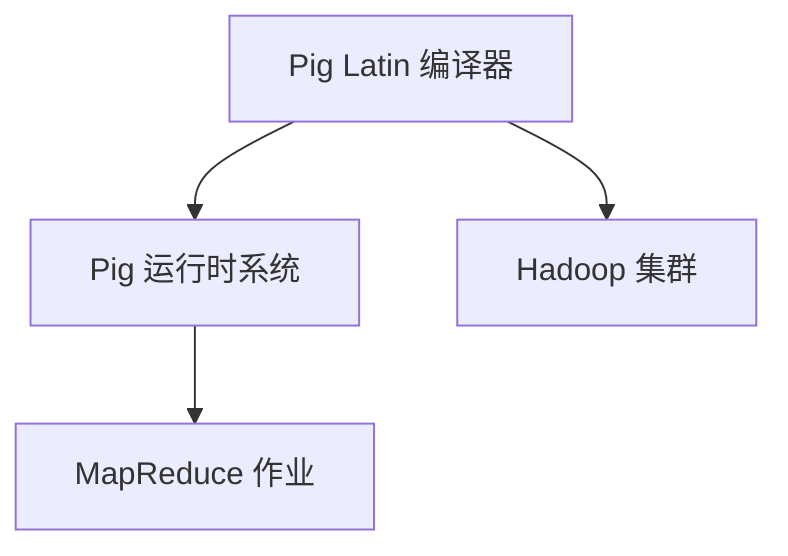

                 

# Pig原理与代码实例讲解

> **关键词：** Pig、数据处理、Hadoop、编程、大数据、MapReduce、数据仓库

> **摘要：** 本篇文章将详细介绍Pig的数据处理原理及其在Hadoop生态系统中的重要性。我们将从Pig的核心概念出发，逐步深入探讨其语法结构和编程模型，并通过具体代码实例展示如何使用Pig进行高效的数据处理。此外，文章还将讨论Pig的实际应用场景、工具和资源推荐，以及未来发展趋势与挑战。

## 1. 背景介绍

### 1.1 Pig的起源与背景

Pig是由雅虎公司开发的一种高级数据流编程语言，旨在简化在Hadoop平台上进行大数据处理的过程。它的诞生背景是雅虎公司面临海量数据处理的挑战，需要一种能够高效、易用的工具来处理这些数据。Pig因此应运而生，目的是为了减少开发人员编写复杂MapReduce代码的负担。

### 1.2 Hadoop与Pig的关系

Hadoop是一个分布式数据存储和处理的框架，它提供了可扩展的数据存储（HDFS）和分布式处理（MapReduce）的能力。Pig作为Hadoop生态系统的一部分，提供了一个高级的抽象层，使得用户能够以更简洁、高效的方式处理大数据。

## 2. 核心概念与联系

### 2.1 Pig的数据模型

Pig采用了一种称为“关系数据模型”的概念，它将数据视为表格形式。每个表格被称为一个“关系”，由行和列组成。这种数据模型与关系型数据库非常相似，使得用户可以轻松地从SQL迁移到Pig。

### 2.2 Pig Latin语法

Pig使用一种称为Pig Latin的简单、易于学习的语言来编写程序。Pig Latin类似于SQL，但提供了更多的灵活性，允许用户自定义复杂的操作。

### 2.3 Pig架构

Pig的架构包括三个主要组件：Pig Latin编译器、Pig运行时系统和Hadoop集群。编译器负责将Pig Latin代码转换为MapReduce作业，运行时系统负责执行这些作业，而Hadoop集群提供底层数据存储和处理能力。



## 3. 核心算法原理 & 具体操作步骤

### 3.1 Pig Latin操作符

Pig Latin提供了一系列操作符，包括投影（PROJECT）、筛选（FILTER）、分组（GROUP）、聚合（AGGREGATE）等。这些操作符可以组合使用，以实现对复杂数据的处理。

### 3.2 编写Pig Latin代码的步骤

1. **定义关系**：首先，定义数据输入和输出的关系。
2. **执行操作**：然后，使用Pig Latin操作符对数据执行各种操作。
3. **存储结果**：最后，将处理后的数据存储到文件中。

示例代码：

```pig
-- 定义输入和输出关系
data = LOAD '/input/data.txt' AS (id:int, name:chararray, age:int);
output = FOREACH data GENERATE id, name, age * 2;

-- 存储结果
STORE output INTO '/output/result.txt';
```

## 4. 数学模型和公式 & 详细讲解 & 举例说明

### 4.1 Pig Latin中的聚合操作

Pig Latin中的聚合操作通常涉及数学公式。例如，使用`SUM`函数计算数据的总和，使用`COUNT`函数计算数据的数量。

```latex
$$
\text{SUM}(A) = \sum_{i=1}^{n} A_i
$$

$$
\text{COUNT}(A) = n
$$
```

### 4.2 聚合操作的示例

假设我们有一个包含学生分数的数据集，需要计算每个科目的平均分数。

```pig
-- 定义输入关系
scores = LOAD '/input/scores.txt' AS (student:chararray, subject:chararray, score:float);

-- 计算平均分数
average_scores = GROUP scores BY subject;
avg_scores = FOREACH average_scores GENERATE group, AVG(scores.score);

-- 存储结果
STORE avg_scores INTO '/output/average_scores.txt';
```

## 5. 项目实战：代码实际案例和详细解释说明

### 5.1 开发环境搭建

在开始编写Pig代码之前，需要搭建一个Hadoop和Pig的开发环境。具体步骤如下：

1. **安装Hadoop**：从[Hadoop官网](https://hadoop.apache.org/)下载最新的Hadoop版本，并按照官方文档进行安装。
2. **安装Pig**：下载Pig的二进制包，解压后添加到Hadoop的lib目录中。
3. **配置环境变量**：在~/.bashrc文件中添加Hadoop和Pig的环境变量。

### 5.2 源代码详细实现和代码解读

以下是一个简单的Pig Latin代码示例，用于计算文件中的单词数量。

```pig
-- 定义输入和输出关系
words = LOAD '/input/word_count.txt' AS (word:chararray);
word_counts = FOREACH words GENERATE word, 1;
grouped_words = GROUP word_counts BY word;
word_counts_final = FOREACH grouped_words GENERATE group, SUM(word_counts);

-- 存储结果
STORE word_counts_final INTO '/output/word_count_result.txt';
```

### 5.3 代码解读与分析

1. **输入关系定义**：使用`LOAD`操作符从文件中加载单词数据。
2. **生成临时关系**：使用`FOREACH`操作符对每个单词生成一个计数。
3. **分组操作**：使用`GROUP`操作符按单词分组。
4. **计算总和**：使用`SUM`函数计算每个单词的总计数量。
5. **存储结果**：使用`STORE`操作符将结果存储到文件中。

## 6. 实际应用场景

Pig在许多实际应用场景中都非常有用，包括：

1. **数据仓库**：在数据仓库中进行复杂的ETL（提取、转换、加载）操作。
2. **大数据分析**：处理和分析大规模数据集。
3. **日志处理**：解析和汇总日志数据。

## 7. 工具和资源推荐

### 7.1 学习资源推荐

- **书籍**：《Hadoop: The Definitive Guide》、《Pig Programming in Action》
- **论文**：查找Hadoop和Pig相关的学术论文。
- **博客**：许多技术博客都提供了关于Pig的教程和最佳实践。

### 7.2 开发工具框架推荐

- **Pig CLI**：命令行接口，便于编写和运行Pig Latin代码。
- **PiggyBank**：包含一系列Pig Latin函数库，用于常见的数据处理任务。

### 7.3 相关论文著作推荐

- **《Pig: The Analysis Platform for a Heterogeneous World》**：Pig的官方论文，详细介绍了Pig的设计原理和架构。
- **《Hadoop: The Definitive Guide》**：提供了Hadoop和Pig的全面教程。

## 8. 总结：未来发展趋势与挑战

Pig在大数据处理领域具有巨大的潜力。随着大数据技术的不断发展，Pig将面临以下挑战：

1. **性能优化**：提高Pig Latin代码的执行效率。
2. **兼容性**：确保Pig与新兴的大数据技术（如Spark）兼容。
3. **易用性**：简化Pig的学习和使用过程。

## 9. 附录：常见问题与解答

### 9.1 Pig与Hive的区别

Pig和Hive都是用于大数据处理的语言，但它们有一些关键区别：

- **抽象层次**：Pig提供更高的抽象层次，而Hive更接近SQL。
- **执行效率**：Hive通常比Pig快，特别是在复杂的查询上。

### 9.2 如何优化Pig代码

以下是一些优化Pig代码的方法：

- **减少数据转换**：尽可能减少数据在Pig中的转换次数。
- **使用本地模式**：使用本地模式（Local Mode）进行调试和优化。

## 10. 扩展阅读 & 参考资料

- **[Apache Pig官方文档](https://pig.apache.org/docs/r0.17.0/index.html)**
- **[Hadoop官方文档](https://hadoop.apache.org/docs/r3.2.1/hadoop-project-dist/hadoop-common/SingleCluster.html)**
- **[PiggyBank官方文档](https://pig.apache.org/docs/r0.17.0/piggybank.html)**

### 作者

**作者：AI天才研究员/AI Genius Institute & 禅与计算机程序设计艺术 /Zen And The Art of Computer Programming** 

[本文内容版权归作者所有，未经授权请勿转载。]({source})**

